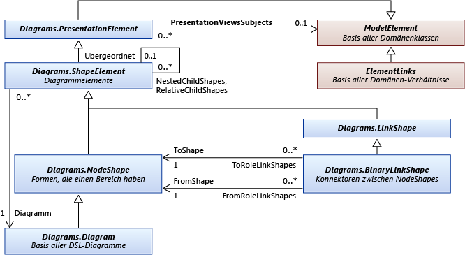

# <a name="navigate-and-update-a-model-in-program-code"></a>Navigieren in und Aktualisieren von Modellen im Programmcode

Sie können Code zum Erstellen und Löschen von Modellelementen, legen Sie deren Eigenschaften, und erstellen und Löschen von Verknüpfungen zwischen den Elementen schreiben. Alle Änderungen müssen innerhalb einer Transaktion ausgeführt werden. Wenn die Elemente in einem Diagramm angezeigt werden, wird das Diagramm "automatisch am Ende der Transaktion angepasst werden".

##  <a name="example"></a> Eine Beispiel-DSL-Definition
 Dies ist der Hauptteil der "DslDefinition.DSL" für die Beispiele in diesem Thema:

 

 Dieses Modell ist eine Instanz dieser DSL:

 

### <a name="references-and-namespaces"></a>Verweise und Namespaces
 Um den Code in diesem Thema auszuführen, sollten Sie Folgendes verweisen:

 `Microsoft.VisualStudio.Modeling.Sdk.11.0.dll`

 Im Code wird dieser Namespace verwendet werden:

 `using Microsoft.VisualStudio.Modeling;`

 Wenn Sie den Code in einem anderen Projekt als dem Schreiben in denen DSL definiert ist, sollten Sie darüber hinaus die Assembly importieren, die von der Dsl-Projekt erstellt wird.

##  <a name="navigation"></a> Navigieren Sie in das Modell

### <a name="properties"></a>Eigenschaften
 Domäneneigenschaften, die Sie in der DSL-Definition zu definieren, werden Eigenschaften, die Sie im Programmcode zugreifen können:

 `Person henry = ...;`

 `if (henry.BirthDate < 1500) ...`

 `if (henry.Name.EndsWith("VIII")) ...`

 Wenn Sie eine Eigenschaft festlegen möchten, müssen Sie dazu in einem [Transaktion](#transaction):

 `henry.Name = "Henry VIII";`

 Sofern in der DSL-Definition einer Eigenschaft des **Art** ist **berechnete**, es kann nicht festgelegt werden. Weitere Informationen finden Sie unter [berechnete und benutzerdefinierte Speichereigenschaften](../modeling/calculated-and-custom-storage-properties.md).

### <a name="relationships"></a>Beziehungen
 Beziehungen, die Sie, in der DSL-Definition definieren werden die Paare von Eigenschaften für die Klasse an beiden Enden der Beziehung. Die Namen der Eigenschaften, die als Beschriftungen für die Rollen auf beiden Seiten der Beziehung im DslDefinition Diagramm angezeigt werden. Abhängig von die Multiplizität der Rolle ist der Typ der Eigenschaft entweder die Klasse am anderen Ende der Beziehung oder eine Auflistung von dieser Klasse.

 `foreach (Person child in henry.Children) { ... }`

 `FamilyTreeModel ftree = henry.FamilyTreeModel;`

 Die Eigenschaften am entgegengesetzten Ende einer Beziehung sind immer Kehrwert. Wenn ein Link erstellt oder gelöscht wird, werden die Rolleneigenschaften für beide Elemente aktualisiert. Der folgende Ausdruck (verwendet die Erweiterungen der `System.Linq`) ist immer "true" für die ParentsHaveChildren-Beziehung im Beispiel:

 `(Person p) => p.Children.All(child => child.Parents.Contains(p))`

 `&& p.Parents.All(parent => parent.Children.Contains(p));`

 **ElementLinks**. Eine Beziehung durch ein Modellelement aufgerufen dargestellt eine *Link*, dies ist eine Instanz des Typs eine Domäne. Ein Link verfügt immer über eine Source-Element und einem Zielelement. Das Quellelement "und" Target-Elements können identisch sein.

 Sie können einen Link und seine Eigenschaften zugreifen:

 `ParentsHaveChildren link = ParentsHaveChildren.GetLink(henry, edward);`

 `// This is now true:`

 `link == null || link.Parent == henry && link.Child == edward`

 Standardmäßig ist nicht mehr als eine Instanz einer Beziehung zulässig, um ein Paar von Modellelementen verknüpfen. Aber wenn Sie in der DSL-Definition der `Allow Duplicates` Flag ist für die Beziehung "true" und dann gibt es möglicherweise mehr als einen Link, und Sie müssen `GetLinks`:

 `foreach (ParentsHaveChildren link in ParentsHaveChildren.GetLinks(henry, edward)) { ... }`

 Es gibt auch andere Methoden für den Zugriff auf Links. Zum Beispiel:

 `foreach (ParentsHaveChildren link in     ParentsHaveChildren.GetLinksToChildren(henry)) { ... }`

 **Ausgeblendete Rollen.** Wenn Sie in der DSL-Definition **wird Eigenschaft generiert** ist **"false"** für eine bestimmte Rolle aus, klicken Sie dann keine Eigenschaft wird generiert, die diese Rolle entspricht. Sie können jedoch immer noch Zugriff auf die Links und durchlaufen die Links, die mit den Methoden der Beziehung:

 `foreach (Person p in ParentsHaveChildren.GetChildren(henry)) { ... }`

 Das am häufigsten verwendete Beispiel ist die <xref:Microsoft.VisualStudio.Modeling.Diagrams.PresentationViewsSubject> Beziehung, die einem Modellelement mit der Form verknüpft ist, die in einem Diagramm angezeigt:

 `PresentationViewsSubject.GetPresentation(henry)[0] as PersonShape`

### <a name="the-element-directory"></a>Das Elementverzeichnis
 Sie können alle Elemente in den Speicher, der mit dem Elementverzeichnis zugreifen:

 `store.ElementDirectory.AllElements`

 Es gibt auch Methoden für die Suche nach Elementen, z. B. Folgendes:

 `store.ElementDirectory.FindElements(Person.DomainClassId);`

 `store.ElementDirectory.GetElement(elementId);`

##  <a name="metadata"></a> Zugreifen auf Klasseninformationen
 Sie erhalten Informationen über die Klassen, Beziehungen und andere Aspekte der DSL-Definition. Zum Beispiel:

 `DomainClassInfo personClass = henry.GetDomainClass();`

 `DomainPropertyInfo birthProperty =`

 `personClass.FindDomainProperty("BirthDate")`

 `DomainRelationshipInfo relationship =`

 `link.GetDomainRelationship();`

 `DomainRoleInfo sourceRole = relationship.DomainRole[0];`

 Die übergeordneten Klassen von Modellelementen lauten wie folgt aus:

-   Der ModelElement - alle Elemente und Beziehungen werden ModelElements

-   ElementLink - sind alle Beziehungen ElementLinks

##  <a name="transaction"></a> Nehmen Sie Änderungen innerhalb einer Transaktion
 Änderung des Programm-Codes in den Store, muss dies innerhalb einer Transaktion erfolgen. Dies gilt für alle Modellelementen, Beziehungen, Formen, Diagramme und ihre Eigenschaften. Weitere Informationen finden Sie unter <xref:Microsoft.VisualStudio.Modeling.Transaction>.

 Die einfachste Methode der Verwaltung einer Transaktion wird mit einem `using` -Anweisung eingeschlossen werden, einem `try...catch` Anweisung:

```
Store store; ...
try
{
  using (Transaction transaction =
    store.TransactionManager.BeginTransaction("update model"))
    // Outermost transaction must always have a name.
  {
    // Make several changes in Store:
    Person p = new Person(store);
    p.FamilyTreeModel = familyTree;
    p.Name = "Edward VI";
    // end of changes to Store

    transaction.Commit(); // Don't forget this!
  } // transaction disposed here
}
catch (Exception ex)
{
  // If an exception occurs, the Store will be
  // rolled back to its previous state.
}
```

 Sie können eine beliebige Anzahl von Änderungen in einer Transaktion vornehmen. Sie können neue Transaktionen innerhalb einer aktiven Transaktion öffnen.

 Um die Änderungen permanent zu machen, sollten Sie `Commit` der Transaktion, bevor es verworfen wird. Wenn eine Ausnahme, die innerhalb der Transaktion nicht abgefangen wird auftritt, wird der Store in dem Zustand vor der Änderungen zurückgesetzt.

##  <a name="elements"></a> Erstellen von Modellelementen
 In diesem Beispiel fügt ein Element zu einem vorhandenen Modell:

```
FamilyTreeModel familyTree = ...; // The root of the model.
using (Transaction t =
    familyTree.Store.TransactionManager
    .BeginTransaction("update model"))
{
  // Create a new model element
  // in the same partition as the model root:
  Person edward = new Person(familyTree.Partition);
  // Set its embedding relationship:
  edward.FamilyTreeModel = familyTree;
          // same as: familyTree.People.Add(edward);
  // Set its properties:
  edward.Name = "Edward VII";
  t.Commit(); // Don't forget this!
}
```

 Dieses Beispiel veranschaulicht diese wichtige Punkte zum Erstellen eines Elements:

- Erstellen Sie das neue Element in einer bestimmten Partition, der den Store. Für Modellelemente und Beziehungen, jedoch keine Formen ist dies normalerweise die Standardpartition.

- Erleichtern Sie das Ziel einer einbettenden Beziehung. In der DslDefinition dieses Beispiels muss jede Person, die das Ziel der Einbettung Beziehung FamilyTreeHasPeople sein. Um dies zu erreichen, können wir legen die FamilyTreeModel Role-Eigenschaft des Person-Objekt oder die Person hinzugefügt, um die Personen Role-Eigenschaft des Objekts FamilyTreeModel.

- Legen Sie die Eigenschaften eines neuen Elements an, vor allem die Eigenschaft, für die `IsName` der DslDefinition gilt. Dieses Flag markiert die Eigenschaft, die verwendet wird, die das Element in seinem Besitzer eindeutig identifiziert. In diesem Fall hat die Namenseigenschaft dieses Flag an.

- Die DSL-Definition dieser DSL muss in den Store geladen wurden. Wenn Sie eine Erweiterung, z. B. einen Menübefehl schreiben, wird dies in der Regel bereits "true" sein. In anderen Fällen, Sie können explizit laden Sie das Modell in den Store oder <xref:Microsoft.VisualStudio.Modeling.Integration.ModelBus> zu laden. Weitere Informationen finden Sie unter [Vorgehensweise: Öffnen Sie ein Modell aus einer Datei im Programmcode](../modeling/how-to-open-a-model-from-file-in-program-code.md).

  Wenn Sie ein Element auf diese Weise erstellen, wird eine Form (wenn die DSL ein Diagramm verfügt) automatisch erstellt. Er wird in einen automatisch zugewiesenen Speicherort mit Standardform, Farbe und andere Funktionen. Wenn Sie möchten steuern, wo und wie die zugeordnete Form angezeigt wird, finden Sie unter [erstellen ein Element und seine Form](#merge).

##  <a name="links"></a> Erstellen von Beziehungslinks
 Es gibt zwei Beziehungen, die in der Beispiel-DSL-Definition definiert. Jede Beziehung definiert eine *Rolleneigenschaft* für die Klasse an beiden Enden der Beziehung.

 Es gibt drei Möglichkeiten, die in denen Sie eine Instanz einer Beziehung erstellen können. Jede dieser drei Methoden hat dieselbe Wirkung:

- Legen Sie die Eigenschaft des der quellrolleninhaber. Zum Beispiel:

  -   `familyTree.People.Add(edward);`

  -   `edward.Parents.Add(henry);`

- Legen Sie die Eigenschaft des der Zielrolleninhaber. Zum Beispiel:

  -   `edward.familyTreeModel = familyTree;`

       Die Multiplizität dieser Rolle ist `1..1`, sodass wir den Wert zuzuweisen.

  -   `henry.Children.Add(edward);`

       Die Multiplizität dieser Rolle ist `0..*`, also fügen wir der Auflistung hinzu.

- Erstellen Sie explizit eine Instanz der Beziehung. Zum Beispiel:

  -   `FamilyTreeHasPeople edwardLink = new FamilyTreeHasPeople(familyTreeModel, edward);`

  -   `ParentsHaveChildren edwardHenryLink = new ParentsHaveChildren(henry, edward);`

  Die letzte Methode ist nützlich, wenn Sie Eigenschaften für die Beziehung selbst festlegen möchten.

  Wenn Sie ein Element auf diese Weise erstellen, ein Connector im Diagramm wird automatisch erstellt, aber es verfügt über eine Standardform, Farbe und andere Funktionen. Um zu steuern, wie die zugeordnete Connector erstellt wird, finden Sie unter [erstellen ein Element und seine Form](#merge).

##  <a name="deleteelements"></a> Löschen von Elementen
 Löschen eines Elements durch den Aufruf `Delete()`:

 `henry.Delete();`

 Dieser Vorgang wird auch gelöscht werden:

- Beziehungslinks in und aus dem Element. Z. B. `edward.Parents` wird nicht mehr enthalten `henry`.

- Elemente an den Rollen für die die `PropagatesDelete` Flag "true" ist. Beispielsweise wird die Form, die das Element anzeigt, gelöscht werden.

  Standardmäßig verfügt jede einbettenden Beziehung `PropagatesDelete` an die Zielrolle "true". Löschen von `henry` löscht keine der `familyTree`, aber `familyTree.Delete()` würde, löschen Sie alle der `Persons`. Weitere Informationen finden Sie unter [Anpassen des Löschverhaltens](../modeling/customizing-deletion-behavior.md).

  In der Standardeinstellung `PropagatesDelete` gilt nicht für die Rollen der verweisbeziehungen.

  Sie können veranlassen, dass die Löschregeln, um bestimmte zur Weitergabe von Würmern zu unterdrücken, wenn Sie ein Objekt löschen. Dies ist hilfreich, wenn Sie ein Element für eine andere ersetzt werden. Geben Sie an die GUID des eine oder mehrere Rollen, die für die Löschung nicht weitergegeben werden soll. Die GUID kann von Relationship-Klasse abgerufen werden:

  `henry.Delete(ParentsHaveChildren.SourceDomainRoleId);`

  (Dieses spezielle Beispiel würde wirken sich nicht, da `PropagatesDelete` ist `false` für Rollen die `ParentsHaveChildren` Beziehung.)

  In einigen Fällen wird ein Löschen verhindert, durch das Vorhandensein einer Sperre, die auf das Element oder auf ein Element, das von der Verteilung gelöscht werden würde. Sie können `element.CanDelete()` zu überprüfen, ob das Element gelöscht werden kann.

##  <a name="deletelinks"></a> Löschen von Beziehungslinks
 Sie können einen Beziehungslink löschen, durch das Entfernen eines Elements aus einer Rolleneigenschaft:

 `henry.Children.Remove(edward); // or:`

 `edward.Parents.Remove(henry);  // or:`

 Sie können auch den Link explizit löschen:

 `edwardHenryLink.Delete();`

 Alle diese drei Methoden haben den gleichen Effekt. Sie müssen nur eine der Möglichkeiten nutzen.

 Wenn die Rolle eine 0.. 1 "oder" 1..1 Multiplizität aufweist, können Sie sie festlegen, um `null`, oder auf einen anderen Wert:

 `edward.FamilyTreeModel = null;` oder:

 `edward.FamilyTreeModel = anotherFamilyTree;`

##  <a name="reorder"></a> Die Reihenfolge von Links einer Beziehung
 Die Links von einer bestimmten Beziehung, die Quelle oder Ziel auf einem bestimmten Modellelement müssen eine bestimmte Reihenfolge. Sie werden in der Reihenfolge, in der sie hinzugefügt wurden. Diese Anweisung ergibt z. B. immer die untergeordneten Elemente in der gleichen Reihenfolge:

 `foreach (Person child in henry.Children) ...`

 Sie können die Reihenfolge von Links ändern:

 `ParentsHaveChildren link = GetLink(henry,edward);`

 `ParentsHaveChildren nextLink = GetLink(henry, elizabeth);`

 `DomainRoleInfo role =`

 `link.GetDomainRelationship().DomainRoles[0];`

 `link.MoveBefore(role, nextLink);`

##  <a name="locks"></a> Sperren
 Ihre Änderungen möglicherweise durch eine Sperre verhindert werden. Sperren können für einzelne Elemente, Partitionen und im Speicher festgelegt werden. Wenn einer dieser Ebenen verfügt eine Sperre, die verhindert, dass die Art der Änderung, die Sie vornehmen möchten, möglicherweise eine Ausnahme ausgelöst werden, wenn Sie es versuchen. Sie können ermitteln, ob Sperren mithilfe-Elements festgelegt werden. GetLocks(), die eine Erweiterungsmethode ist, die im Namespace definiert ist <xref:Microsoft.VisualStudio.Modeling.Immutability>.

 Weitere Informationen finden Sie unter [Definieren einer Sperrrichtlinie zum Read-Only-Segmente erstellen](../modeling/defining-a-locking-policy-to-create-read-only-segments.md).

##  <a name="copy"></a> Kopieren und einfügen
 Sie können kopieren, Elemente oder Gruppen von Elementen, die eine <xref:System.Windows.Forms.IDataObject>:

```
Person person = personShape.ModelElement as Person;
Person adopter = adopterShape.ModelElement as Person;
IDataObject data = new DataObject();
personShape.Diagram.ElementOperations
      .Copy(data, person.Children.ToList<ModelElement>());
```

 Die Elemente werden als eine serialisierte Elementgruppe gespeichert.

 Sie können Elementen aus IDataObject in ein Modell zusammenführen:

```
using (Transaction t = targetDiagram.Store.
        TransactionManager.BeginTransaction("paste"))
{
  adopterShape.Diagram.ElementOperations.Merge(adopter, data);
}
```

 `Merge ()` akzeptiert entweder eine `PresentationElement` oder `ModelElement`. Wenn Sie ihm geben eine `PresentationElement`, Sie können auch eine Position im Diagramm "Target" als dritten Parameter angeben.

##  <a name="diagrams"></a> Navigieren in und Aktualisieren von Diagrammen
 In einer DSL unterscheidet sich das Domain-Model-Element, das ein Konzept wie z. B. die Person oder "Song" darstellt, aus dem FormElement, das darstellt, was Sie im Diagramm angezeigt. Das Modellelement Domäne speichert der wichtigen Eigenschaften und Beziehungen der Konzepte. Das FormElement speichert die Größe, Position und Farbe der Ansicht des Objekts im Diagramm und das Layout der seine Komponenten unterteilen.

### <a name="presentation-elements"></a>Präsentationselementen
 

 In Ihrer DSL-Definition erstellt jedes Element, das Sie angeben, die eine Klasse, die von einer der folgenden standard-Klassen abgeleitet ist.

|Art des Elements|Basisklasse|
|-|-|
|Domänenklasse|<xref:Microsoft.VisualStudio.Modeling.ModelElement>|
|Domänenbeziehung|<xref:Microsoft.VisualStudio.Modeling.ElementLink>|
|Form|<xref:Microsoft.VisualStudio.Modeling.Diagrams.NodeShape>|
|Verbindung|<xref:Microsoft.VisualStudio.Modeling.Diagrams.BinaryLinkShape>|
|Diagramm|<xref:Microsoft.VisualStudio.Modeling.Diagrams.Diagram>|

 Ein Element in einem Diagramm stellt ein Modellelement in der Regel dar. In der Regel (aber nicht immer), eine <xref:Microsoft.VisualStudio.Modeling.Diagrams.NodeShape> stellt eine Klasseninstanz für die Domäne, und ein <xref:Microsoft.VisualStudio.Modeling.Diagrams.BinaryLinkShape> eine Domäneninstanz der Beziehung darstellt. Die <xref:Microsoft.VisualStudio.Modeling.Diagrams.PresentationViewsSubject> Beziehung verknüpft ein Knoten oder Link Shape, mit dem Modellelement, das es darstellt.

 Jede Form von Knoten oder Link gehört zu einem Diagramm. Eine binäre Linkform verbindet zwei Knoten Formen.

 Untergeordnete Formen können zwei Formen enthalten. Eine Form in die `NestedChildShapes` Satz ist auf das umgebende Feld des übergeordneten beschränkt. Eine Form in die `RelativeChildShapes` Liste kann außerhalb oder teilweise außerhalb der Grenzen des übergeordneten Elements – z. B. eine Bezeichnung oder einen Port angezeigt. Ein Diagramm hat keine `RelativeChildShapes` und es wird kein `Parent`.

###  <a name="views"></a> Navigieren zwischen Formen und Elemente
 Domänenmodellelemente und Formelemente sind verknüpft, von der <xref:Microsoft.VisualStudio.Modeling.Diagrams.PresentationViewsSubject> Beziehung.

```csharp
// using Microsoft.VisualStudio.Modeling;
// using Microsoft.VisualStudio.Modeling.Diagrams;
// using System.Linq;
Person henry = ...;
PersonShape henryShape =
  PresentationViewsSubject.GetPresentation(henry)
    .FirstOrDefault() as PersonShape;
```

 Beziehungen werden von die gleiche Beziehung mit Konnektoren im Diagramm verknüpft:

```
Descendants link = Descendants.GetLink(henry, edward);
DescendantConnector dc =
   PresentationViewsSubject.GetPresentation(link)
     .FirstOrDefault() as DescendantConnector;
// dc.FromShape == henryShape && dc.ToShape == edwardShape
```

 Diese Beziehung wird der Stamm des Modells auch mit dem Diagramm verknüpft:

```
FamilyTreeDiagram diagram =
   PresentationViewsSubject.GetPresentation(familyTree)
      .FirstOrDefault() as FamilyTreeDiagram;
```

 Rufen Sie das Modellelement, das durch eine Form dargestellt verwenden:

 `henryShape.ModelElement as Person`

 `diagram.ModelElement as FamilyTreeModel`

### <a name="navigating-around-the-diagram"></a>Navigieren im Diagramm
 Im Allgemeinen ist es nicht ratsam, zwischen Formen und Konnektoren im Diagramm zu navigieren. Es empfiehlt sich die Beziehungen im Modell verschieben zwischen Formen und Konnektoren, nur bei Bedarf für die Arbeit auf die Darstellung des Diagramms navigieren. Diese Methoden werden Connectors mit den Formen an jedem Ende verknüpfen:

 `personShape.FromRoleLinkShapes, personShape.ToRoleLinkShapes`

 `connector.FromShape, connector.ToShape`

 Viele Formen sind kombinierenden Zeichen ersetzt wurden. Sie werden eine übergeordnete Form und eine oder mehrere Ebenen von untergeordneten Elementen besteht. Formen, die relativ zu einer anderen Form positioniert werden gelten als seine *untergeordneten*. Wenn die übergeordnete Form bewegt wird, werden die untergeordneten Elemente mit verschoben.

 *Relative untergeordnete* kann außerhalb des umgebenden Felds der übergeordneten Form angezeigt werden. *Geschachtelte* untergeordneten Elementen wird ausschließlich innerhalb der Grenzen des übergeordneten Elements angezeigt.

 Zum Abrufen des oberen Satz von Formen in einem Diagramm zu verwenden:

 `Diagram.NestedChildShapes`

 Die übergeordneten Klassen von Formen und Konnektoren sind:

 <xref:Microsoft.VisualStudio.Modeling.ModelElement>

 -- <xref:Microsoft.VisualStudio.Modeling.Diagrams.PresentationElement>

 -- <xref:Microsoft.VisualStudio.Modeling.Diagrams.ShapeElement>

 ----- <xref:Microsoft.VisualStudio.Modeling.Diagrams.NodeShape>

 ------- <xref:Microsoft.VisualStudio.Modeling.Diagrams.Diagram>

 ------- *YourShape*

 ----- <xref:Microsoft.VisualStudio.Modeling.Diagrams.LinkShape>

 ------- <xref:Microsoft.VisualStudio.Modeling.Diagrams.BinaryLinkShape>

 --------- *YourConnector*

###  <a name="shapeProperties"></a> Eigenschaften von Formen und Konnektoren
 In den meisten Fällen ist es nicht notwendig, explizite Änderungen an Formen vornehmen. Wenn Sie die Modellelemente geändert haben, aktualisieren die Regeln "Reparieren", Formen und Konnektoren. Weitere Informationen finden Sie unter [reagieren auf und propagieren Änderungen](../modeling/responding-to-and-propagating-changes.md).

 Allerdings ist es hilfreich, einige explizite Formen in den Eigenschaften ändern, die von den Modellelementen unabhängig sind. Beispielsweise können Sie diese Eigenschaften ändern:

-   <xref:Microsoft.VisualStudio.Modeling.Diagrams.NodeShape.Size%2A> – Bestimmt die Höhe und Breite der Form.

-   <xref:Microsoft.VisualStudio.Modeling.Diagrams.NodeShape.Location%2A> -die Position relativ zu die übergeordnete Form oder das Diagramm

-   <xref:Microsoft.VisualStudio.Modeling.Diagrams.ShapeElement.StyleSet%2A> – der Satz von Stifte und Pinsel zum Zeichnen der Form oder -Connector

-   <xref:Microsoft.VisualStudio.Modeling.Diagrams.ShapeElement.Hide%2A> -wird die Form unsichtbar

-   <xref:Microsoft.VisualStudio.Modeling.Diagrams.ShapeElement.Show%2A> – Stellt die Form sichtbar, nachdem ein `Hide()`

###  <a name="merge"></a> Erstellen ein Element und seine Form

Wenn Sie ein Element erstellen und in die Struktur einbettender Beziehungen verknüpfen, wird eine Form automatisch erstellt und zugeordnet. Dies erfolgt durch die Regeln "Reparieren", die am Ende der Transaktion ausgeführt werden. Jedoch wird die Form in einen automatisch zugewiesenen Standort angezeigt, und die Form, Farbe und andere Funktionen haben Standardwerte. Um zu steuern, wie die Form erstellt wird, können Sie die Merge-Funktion verwenden. Sie müssen zuerst die Elemente, die Sie in eine ElementGroup hinzufügen möchten, und klicken Sie dann die Gruppe in das Diagramm zusammenführen.

Diese Methode:

-   Legt den Namen fest, wenn Sie eine Eigenschaft als Namen des Elements zugewiesen haben.

-   Überwacht alle Elementmerge-Anweisungen, die Sie in der DSL-Definition angegeben.

In diesem Beispiel erstellt eine Form an der Position des Mauszeigers, wenn der Benutzer im Diagramm doppelklickt. In der DSL-Definition für dieses Beispiel die `FillColor` Eigenschaft `ExampleShape` verfügbar gemacht wurde.

```
using Microsoft.VisualStudio.Modeling;
using Microsoft.VisualStudio.Modeling.Diagrams;
partial class MyDiagram
{
  public override void OnDoubleClick(DiagramPointEventArgs e)
  {
    base.OnDoubleClick(e);

    using (Transaction t = this.Store.TransactionManager
        .BeginTransaction("double click"))
    {
      ExampleElement element = new ExampleElement(this.Store);
      ElementGroup group = new ElementGroup(element);

      { // To use a shape of a default size and color, omit this block.
        ExampleShape shape = new ExampleShape(this.Partition);
        shape.ModelElement = element;
        shape.AbsoluteBounds = new RectangleD(0, 0, 1.5, 1.0);
        shape.FillColor = System.Drawing.Color.Azure;
        group.Add(shape);
      }

      this.ElementOperations.MergeElementGroupPrototype(
        this,
        group.CreatePrototype(),
        PointD.ToPointF(e.MousePosition));
      t.Commit();
    }
  }
}
```

 Wenn Sie mehr als eine Form vom Typ angeben, legen Sie ihre relativen Positionen, die mit der `AbsoluteBounds`.

 Sie können auch die Farbe und andere verfügbar gemachten Eigenschaften des Connectors, die mit dieser Methode festlegen.

### <a name="use-transactions"></a>Verwenden von Transaktionen
 Formen, Konnektoren und Diagrammen sind Untertypen von <xref:Microsoft.VisualStudio.Modeling.ModelElement> als auch in den Store. Sie müssen deshalb Änderungen werden nur innerhalb einer Transaktion vornehmen. Weitere Informationen finden Sie unter [Vorgehensweise: Verwenden von Transaktionen zum Aktualisieren des Modells](../modeling/how-to-use-transactions-to-update-the-model.md).

##  <a name="docdata"></a> Ansicht des Dokuments und Dokumentdaten
 

## <a name="store-partitions"></a>Store-Partitionen
 Wenn ein Modell geladen wird, wird das zugehörige Diagramm zur gleichen Zeit geladen. In der Regel das Modell in Store.DefaultPartition geladen wird, und der Inhalt des Diagramms in einer anderen Partition geladen wird. In der Regel der Inhalt der einzelnen Partitionen geladen und in einer separaten Datei gespeichert.

## <a name="see-also"></a>Siehe auch

- <xref:Microsoft.VisualStudio.Modeling.ModelElement>
- [Validierung in einer domänenspezifischen Sprache](../modeling/validation-in-a-domain-specific-language.md)
- [Generieren von Code für eine domänenspezifische Sprache](../modeling/generating-code-from-a-domain-specific-language.md)
- [Vorgehensweise: Verwenden von Transaktionen zum Aktualisieren des Modells](../modeling/how-to-use-transactions-to-update-the-model.md)
- [Integrieren von Modellen mit Visual Studio-ModelBus](../modeling/integrating-models-by-using-visual-studio-modelbus.md)
- [Reagieren auf und Propagieren von Änderungen](../modeling/responding-to-and-propagating-changes.md)
