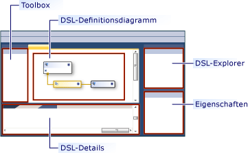
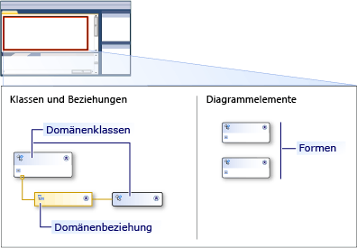
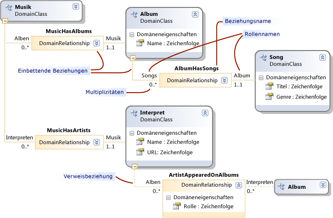
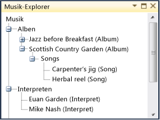
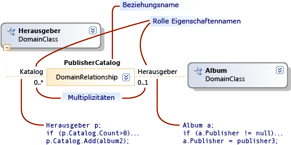

# Grundlagen von Modellen, Klassen und Beziehungen
Eine domänenspezifische Sprache (DSL) wird durch seine DSL-Definitionsdatei, zusammen mit benutzerdefinierten Programmcode definiert, den Sie schreiben können. Die meisten der Programmcode der DSL-Lösung wird aus dieser Datei generiert.

 In diesem Thema wird erläutert, die zentralen Funktionen der DSL-Definition.

## DSL-Definition
 Beim erneuten Öffnen `Dsl\DslDefinition.dsl`muss Ihr [!INCLUDE[vsprvs](../code-quality/includes/vsprvs_md.md)] Fenster ähnelt die folgenden Abbildung.

 

 Die wichtigste Informationen in der DSL-Definition wird in der DSL-Definitionsdiagramm angezeigt. Zusätzliche Informationen, die auch DslDefinition.dsl gehört, wird im DSL-Explorer angezeigt, das in der Regel auf der Seite des Diagramms angezeigt wird. Sie arbeiten mit dem Diagramm für die häufigsten Aufgaben, und klicken Sie mit der DSL-Explorer für erweiterten Anpassung.

 DSL-Definitionsdiagramm zeigt die Domänenklassen, die betroffenen Modellelemente und deren Beziehungen, die Verknüpfungen zwischen Modellelementen definieren definiert. Es zeigt auch die Formen und Konnektoren, die verwendet werden, um die betroffenen Modellelemente, die dem Benutzer anzuzeigen.

 

 Bei der Auswahl eines Elements in der DSL-Definition im Diagramm oder im Explorer für DSL, wird die Informationen im Fenster Eigenschaften angezeigt. Zusätzliche Informationen können in der DSL-Detailfenster angezeigt werden.

### Modelle sind Instanzen der konzentriert
 Ein *Modell* ist eine Instanz der DSL, die von einem Benutzer erstellt. Ein Modell enthält Modellelemente, die sind Instanzen der Domänenklassen, die Sie definieren und Links zwischen den Elementen, die Instanzen der zwischen den Domänen sind, die Sie definieren. Ein Modell kann auch veranlassen, Formen und Verbindern, die die betroffenen Modellelemente und Links in einem Diagramm angezeigt. Die DSL-Definition enthält die Shape-Klassen, Connectors und eine Klasse für das Diagramm.

 Eine DSL-Definition ist auch bekannt als ein *Domänenmodell*. Ein DSL-Definition "oder" Domain-Modell ist der domänenspezifische Sprache, die zur Entwurfszeit-Darstellung, während das Modell die Laufzeitinstanziierung von einer domänenspezifischen Sprache ist.

## Domänenklassen definieren die betroffenen Modellelemente
 Domänenklassen werden verwendet, um die verschiedenen Elemente in der Domäne zu erstellen, und zwischen Domänen sind die Links zwischen den Elementen. Sie sind zur Entwurfszeit-Darstellung der Elemente und Links, die von den Benutzern der Design-spezifische Sprache instanziiert wird, wenn sie ihre Modelle erstellen.

 Diese Abbildung zeigt ein Modell, das vom Benutzer von einer Bibliothek "Musik" DSL erstellt wurde. Musikalben werden durch Felder dargestellt, die Listen von Songs ermöglicht enthalten. Nach Feldern mit abgerundeten Ecken dargestellt werden und verbunden sind, auf die Alben, zu denen sie beigetragen haben.

 

 DSL-Definition werden zwei Aspekte getrennt. Die Darstellung der Elemente von Modellelementen im Modell-Diagramm wird mithilfe der Form und Connector Klassen definiert. Die Informationen im Modell durchgeführt wird mit Domänenklassen und zwischen Domänen definiert.

 Die folgende Abbildung zeigt die Domänenklassen und Beziehungen in der DSL-Definition von der Bibliothek "Musik".

 

 Die Abbildung zeigt vier Domänenklassen: Musik, Album, Interpret und Titel. Die Domänenklassen definieren Domäneneigenschaften z. B. Name, Titel und So weiter. Im Modell werden die Werte für einige dieser Eigenschaften im Diagramm angezeigt.

 Zwischen den Klassen sind domänenbeziehungen: MusicHasAlbums, MusicHasArtists AlbumbHasSongs und ArtistAppearedOnAlbums. Die Beziehungen wurden Multiplizitäten z. B. 1..1, 0.. *. Beispielsweise muss jeder Titel genau ein Album über die AlbumHasSongs-Beziehung verknüpft sein. Jedes Album kann eine beliebige Anzahl von Songs ermöglicht werden.

### Neuanordnen der DSL-Definitionsdiagramm
 Beachten Sie, dass eine Domänenklasse mehrmals auf die DSL-Definitionsdiagramm angezeigt werden kann, wie Album in dieser Abbildung verfügt. Es ist immer ein Hauptansicht und treten möglicherweise einige *Verweis* Ansichten.

 Um die DSL-Definitionsdiagramm neu anordnen, können Sie folgende Aktionen ausführen:

-   Austausch main aus, und verweisen Sie Sichten mit der **Struktur hier bringen** und **Teilung Struktur** Befehle. Mit der rechten Maustaste in einer Einzeldomäne-Klasse, um diese Befehle anzuzeigen.

-   Sortieren Sie die Domänenklassen und Formklassen durch Drücken von STRG + nach-oben und STRG + nach-unten ein.

-   Klassen, die über das Symbol auf der oberen rechten der einzelnen Formen erweitern oder reduzieren.

-   Reduzieren Sie Teile der Struktur, indem Sie auf das Minuszeichen (-) am unteren Rand einer Domänenklasse.

## Vererbung
 Domänenklassen können mithilfe von Vererbung definiert werden. Um eine Ableitung Vererbung zu erstellen, klicken Sie auf das Tool Vererbung, klicken Sie auf die abgeleitete Klasse, und klicken Sie dann auf die Basisklasse. Ein Modellelement hat alle Eigenschaften, die auf einem eigenen Domänenklasse, zusammen mit den Eigenschaften, die von der Basisklasse geerbt definiert sind. Es erbt auch die Rollen in Beziehungen.

 Vererbung kann auch zwischen Beziehungen, Formen und Konnektoren verwendet werden. Vererbung muss innerhalb der gleichen Gruppe beibehalten werden. Eine Form "kann nicht aus einer Domänenklasse erben.

## Zwischen Domänen
 Modellelemente können durch Beziehungen verknüpft werden. Links werden immer binäre; genau zwei Elemente verknüpft. Allerdings kann ein Element viele Links zu anderen Objekten, und es mehr als eine Verknüpfung zwischen den gleichen Elementpaar gerade sein.

 Ebenso, wie Sie verschiedene Klassen von Elementen definieren können, können Sie unterschiedliche Klassen von Links definieren. Die Klasse einer Verknüpfung wird aufgerufen, eine *domänenbeziehung*. Eine domänenbeziehung gibt an, welche Klassen des Elements ihrer Instanzen herstellen können. Jede Seite der Beziehung wird aufgerufen, eine *Rolle*, und die domänenbeziehung definiert den Namen für die beiden Rollen sowie für die Beziehung selbst.

 Es gibt zwei Arten von domänenbeziehungen: Einbetten von Beziehungen und verweisbeziehungen. Auf der DSL-Definitionsdiagramm Einbetten von Beziehungen durchgezogene Linien an jede Rolle vorhanden ist, und verweisbeziehungen haben gestrichelte Linien.

### Einbetten von Beziehungen
 Jedes Element in einem Modell, mit Ausnahme der Stamm ist das Ziel der Glied einbetten. Aus diesem Grund bildet das gesamte Modell eine einzelne Struktur Links einbetten. Eine Einbetten von Beziehung darstellt, Containment oder Besitzverhältnis ermöglicht. Zwei Modellelemente, die auf diese Weise beziehen sind auch bekannt als übergeordnete und untergeordnete. Das untergeordnete Element besitzt, in der übergeordneten Tabelle eingebettet werden soll.

 Einbetten von Links werden nicht in der Regel explizit als Connectors in einem Diagramm angezeigt. Stattdessen werden sie in der Regel durch Eingrenzung dargestellt. Der Stamm des Modells wird durch das Diagramm dargestellt, und Elemente, die in den es eingebettet werden als Formen im Diagramm angezeigt.

 Im Beispiel hat die Stammklasse Musik eine Einbetten von Beziehung MusicHasAlbums Album, ein Einbetten von AlbumHasSongs auf Musiktitel besitzt. Titel werden als Elemente in einer Liste innerhalb jedes Album angezeigt. Musik verfügt auch über ein Einbetten von MusicHasArtists der Interpret-Klasse, mit deren Instanzen auch als Formen im Diagramm angezeigt.

 Standardmäßig werden eingebettete Elemente automatisch gelöscht, wenn ihre übergeordneten Elemente gelöscht werden.

 Wenn ein Modell gespeichert wird für die Datei im XML-Format sind eingebettete Elemente in ihren übergeordneten Elementen geschachtelt, es sei denn, Sie die Serialisierung angepasst haben.

> [!NOTE]
>  Einbettung ist nicht identisch mit Vererbung. Untergeordnete Elemente in einer Beziehung einbetten erben keine Eigenschaften des übergeordneten Elements. Ein einbetten ist ein Link zwischen betroffenen Modellelemente. Vererbung ist eine Beziehung zwischen Klassen und keine Verknüpfungen zwischen Modellelementen erstellt.

### Einbetten von Regeln
 Jedes Element in einem Instanzmodell muss das Ziel des genau ein Einbetten von links, mit Ausnahme der Stamm des Modells.

 Aus diesem Grund jede nicht abstrakten-Domänenklasse, mit Ausnahme der Stammklasse muss das Ziel über mindestens ein Einbetten von Beziehung, oder sie müssen die ein Einbetten von einer Basisklasse erben. Eine Klasse ist das Ziel von mindestens zwei eingebetteten Objekten möglich, aber seine Instanz Modellelemente können jeweils nur ein übergeordnetes Element haben. Die Multiplizität von Ziel zu Quelle muss 0.. 1 oder 1..1 sein.

### Der Explorer zeigt das Einbetten von Struktur
 DSL-Definition erstellt auch ein Explorer, der Benutzer zusammen mit ihren Modelldiagramm finden Sie unter.

 

 Der Explorer zeigt alle Elemente im Modell, auch die für die Sie keine Formen definiert haben. Es zeigt Elemente und Beziehungen einbetten, aber nicht verweisen auf Beziehungen.

 Um die Werte der Domäneneigenschaften eines Elements angezeigt wird, wird der Benutzer wählt ein Element im Modell oder im Modell-Explorer und öffnet das Fenster Eigenschaften. Es zeigt alle Domäneneigenschaften einschließlich derer, die nicht im Diagramm angezeigt werden. Im Beispiel hat jeder Titel, einen Titel und eine "Genre", aber nur der Wert des Titels wird im Diagramm angezeigt.

## Verweisbeziehungen
 Eine verweisbeziehung stellt jede Art von Beziehung, die nicht einbetten ist.

 Verweisbeziehungen werden in der Regel in einem Diagramm als Verbindungen zwischen Formen angezeigt.

 In der XML-Darstellung des Modells, wird ein Link zwischen zwei Elementen dargestellt, mit *Moniker.* D. h. sind Moniker Namen, die jedes Element im Modell eindeutig zu identifizieren. Der XML-Knoten für jedes Modellelement enthält einen Knoten, der den Namen der Beziehung und der Moniker des anderen Elements angibt.

## Rollen
 Jede domänenbeziehung verfügt über zwei Rollen, eine Rolle "Quelle" und eine Rolle "Ziel".

 In der folgenden Abbildung, die Zeile zwischen den **Publisher** Domänenklasse und die **PublisherCatalog** domänenbeziehung wird die Rolle "Quelle". Die Linie zwischen den domänenbeziehung und die **Album** Domänenklasse ist die Rolle "Ziel".

 

 Die mit einer Beziehung zu verknüpften Namen sind besonders wichtig, wenn Sie Programmcode schreiben, der das Modell durchläuft. Die DSL-Projektmappe zu erstellen, hat die generierte Klasse Verleger beispielsweise eine Eigenschaft enthalten, der eine Auflistung von Alben ist. Die Klasse Album hat es sich um eine Eigenschaft Verleger, die eine einzelne Instanz der Klasse Verleger ist.

 Wenn Sie eine Beziehung in einer DSL-Definition erstellen, werden die Namen der Eigenschaft und die Beziehung Standardwerte angegeben. Allerdings können Sie sie ändern.

## Multiplizitäten
 Multiplizitäten anzugeben, wie viele Elemente derselben Rolle in einer domänenbeziehung haben. Im Beispiel, das NULL-zu-viele (0..\*) Multiplizität-Einstellung auf die **Katalog** Rolle angibt, die eine beliebige Instanz von der **Verleger** Domänenklasse können beliebig viele  **PublisherCatalog** Beziehung verknüpft werden, wie Sie es möchten.

 Konfigurieren Sie die Multiplizität einer Rolle durch Eingabe im Diagramm oder durch Ändern der `Multiplicity` Eigenschaft in der **Eigenschaften** Fenster. Die folgende Tabelle beschreibt die Einstellungen für diese Eigenschaft.

|' Multiplicity '-Typ|Beschreibung|
|-----------------------|-----------------|
|0.. * (0 bis viele)|Jede Instanz der Domänenklasse kann über mehrere Instanzen der Beziehung oder keine Instanzen der Beziehung verfügen.|
|0.. 1 (null bis eins)|Jede Instanz der Domänenklasse kann es sich um nicht mehr als eine Instanz der Beziehung oder keine Instanzen der Beziehung verfügen.|
|1..1 (eins)|Jede Instanz der Domänenklasse kann es sich um eine Instanz der Beziehung enthalten. Mehr als eine Instanz dieser Beziehung kann nicht in jeder Instanz der Role-Klasse erstellt werden. Wenn die Überprüfung aktiviert ist, wird ein Validierungsfehler angezeigt, wenn Instanz der Rolle ""-Klasse keine Instanz der Beziehung hat.|
|1.. * (eins zu viele)|Jede Instanz der Klasse auf die Rolle, die diese Multiplizität kann mehrere Instanzen der Beziehung, und jede Instanz muss mindestens eine Instanz der Beziehung aufweisen. Wenn die Überprüfung aktiviert ist, wird ein Validierungsfehler angezeigt, wenn Instanz der Rolle ""-Klasse keine Instanz der Beziehung hat.|

## Domänenbeziehungen als Klassen
 Eine Verknüpfung ist im Speicher als eine Instanz von LinkElement, dargestellt, das eine abgeleitete Klasse von Modellelement ist. Sie können diese Eigenschaften in der Domäne Modelldiagramm auf domänenbeziehungen definieren.

 Sie können auch die Quelle oder Ziel andere Beziehungen einer Beziehung vornehmen. In der Domäne Modelldiagramm mit der rechten Maustaste in der domänenbeziehung, und klicken Sie dann auf **anzeigen als Klasse**. Eine weitere Klasse-Dialogfeld wird angezeigt. Sie können anschließend Beziehungen zu verbinden.

 Sie können eine Beziehung teilweise durch Vererbung, definieren, ebenso wie Sie mit der Domänenklassen. Wählen Sie die abgeleitete Beziehung, und legen Sie **Base Beziehung** im Eigenschaftenfenster angezeigt.

 Eine abgeleitete Beziehung spezialisiert seine Basis Beziehung. Die Domäne Klassen, It, das Links von abgeleitet werden sollte oder identisch mit den Klassen der Basis-Beziehung verknüpft. Wenn ein Link in der abgeleiteten Beziehung in einem Modell erstellt wird, ist es eine Instanz der abgeleiteten und die Basis-Beziehungen. Im Programmcode können Sie auf den Link mithilfe der Eigenschaften, die vom Basistyp oder von der abgeleiteten Klasse generiert entgegengesetzten Ende navigieren.

## Siehe auch

- [Domänenspezifische Sprache Tools Glossar](http://msdn.microsoft.com/ca5e84cb-a315-465c-be24-76aa3df276aa)
