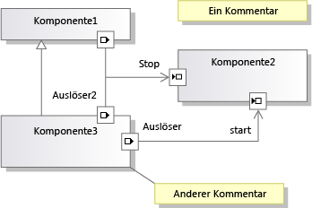

# <a name="understanding-the-dsl-code"></a>Grundlegendes zum DSL-Code
Eine DSL-Projektmappe (Domain-Specific Language, domänenspezifische Sprache) generiert eine API, die Sie zum Lesen und Aktualisieren von Instanzen der DSL in [!INCLUDE[vsprvs](../code-quality/includes/vsprvs_md.md)] verwenden können. Diese API wird im Code definiert, der aus der DSL-Definition generiert wird. In diesem Thema wird die generierte API beschrieben.  
  
## <a name="the-example-solution-component-diagrams"></a>Beispielprojektmappe: Komponentendiagramme  
 Um die Projektmappe zu erstellen, der die Quelle für die meisten der Beispiele in diesem Thema erstellen Sie eine DSL aus der **Komponentenmodelle** Projektmappenvorlage. Dies ist eine der Standardvorlagen, die angezeigt wird, wenn Sie eine neue DSL-Projektmappe erstellen.  
  
> [!NOTE]
>  Die Komponente Diagramme DSL-Vorlage bezieht sich nicht auf die UML-Komponentendiagramme, die Sie mithilfe der Architektur-Menü in Visual Studio erstellen können. In der **neues Projekt** Dialogfeld erweitern Sie **andere Projekt Types\Extensibility** , und klicken Sie dann auf **einer domänenspezifischen Sprachdesigner**.  
  
 Drücken Sie F5, und experimentieren Sie, wenn Sie mit dieser Projektmappenvorlage nicht vertraut sind. Achten Sie insbesondere darauf, dass Sie Ports erstellen, indem Sie ein Port-Tool auf eine Komponente ziehen, und dass Sie Verbindungen mit Ports herstellen können.  
  
   
  
## <a name="the-structure-of-the-dsl-solution"></a>Struktur der DSL-Projektmappe  
 Die **Dsl** Projekt definiert die API für der DSL. Die **DslPackage** Projekt definiert, wie sie mit integriert [!INCLUDE[vsprvs](../code-quality/includes/vsprvs_md.md)]. Sie können auch eigene Projekte hinzufügen, die durch das Modell generierten Code enthalten können.  
  
### <a name="the-code-directories"></a>Codeverzeichnisse  
 Großteil des Codes in jedem dieser Projekte clientregisterkarte **Dsl\DslDefinition.dsl**. Der generierte Code ist der **generierten Code** Ordner. Um eine generierte Datei anzuzeigen, klicken Sie auf **[+]** neben dem Generieren von **TT** Datei.  
  
 Es empfiehlt sich, den generierten Code zu untersuchen, damit Sie die DSL besser verstehen. Erweitern Sie zum Anzeigen der generierten Dateien die TT-Dateien im Projektmappen-Explorer.  
  
 Die \*TT-Dateien sehr wenig Generieren von Code enthalten. Stattdessen verwenden sie `<#include>`-Direktiven, um freigegebene Vorlagendateien einzubinden. Die freigegebenen Dateien befinden sich im **\Programme\Microsoft Visual Studio 10.0\Common7\IDE\Extensions\Microsoft\DSL SDK\DSL Designer\11.0\TextTemplates**  
  
 Wenn Sie der DSL-Projektmappe eigenen Programmcode hinzufügen, nutzen Sie dafür eine separate Datei außerhalb des Ordners für generierten Code. Möglicherweise möchten Sie erstellen eine **benutzerdefinierter Code** Ordner. (Wenn Sie eine neue Codedatei einem benutzerdefinierten Ordner hinzufügen, müssen Sie den Namespace im anfänglichen Codeskelett korrigieren.)  
  
 Wir raten dringend davon ab, den generierten Code direkt zu bearbeiten, da Ihre Änderungen verloren gehen, wenn Sie die Projektmappe neu erstellen. Passen Sie stattdessen Ihre DSL an:  
  
-   Passen Sie die vielen Parameter in der DSL-Definition an.  
  
-   Schreiben Sie partielle Klassen in separaten Codedateien, um Methoden zu überschreiben, die in den generierten Klassen definiert sind oder von ihnen geerbt werden. In einigen Fällen müssen Sie festlegen der **generiert doppelte abgeleitete** festlegen, die einer Klasse in der DSL-Definition, um eine generierte Methode überschreiben können.  
  
-   Festlegen der Optionen in der DSL-Definition, die dazu führen, dass den generierten Code "Hooks" für den eigenen Code bereitstellen.  
  
     Angenommen, Sie legen die **benutzerdefinierten Konstruktor verfügt über** Option einer Domäne-Klasse, und erstellen Sie die Projektmappe, sehen Sie Fehlermeldungen. Wenn Sie auf eine dieser Fehlermeldungen doppelklicken, sehen Sie Kommentare im generierten Code, die erläutern, was der benutzerdefinierte Code enthalten sollte.  
  
-   Schreiben Sie eigene Textvorlagen, um Code speziell für Ihre Anwendung zu erstellen. Mit Includedateien können Sie Teile der Vorlagen freigeben, die in vielen Projekten gleich sind. Darüber hinaus können Sie [!INCLUDE[vsprvs](../code-quality/includes/vsprvs_md.md)]-Projektvorlagen erstellen, die mit Ihrer eigenen Dateistruktur initialisiert werden.  
  
## <a name="generated-files-in-dsl"></a>Generierte Dateien in "Dsl"  
 Die folgenden generierten Dateien werden in der **Dsl** Projekt.  
  
 *YourDsl*`Schema.xsd`  
  
 Das Schema für Dateien, die Instanzen Ihrer DSL enthalten. Diese Datei wird kopiert, zur Kompilierung (**"bin"**) Verzeichnis. Bei der Installation der DSL können Sie diese Datei zu kopieren **\Programme\Microsoft Visual Studio 11.0\Xml\Schemas** , damit Modelldateien überprüft werden können. Weitere Informationen finden Sie unter [Bereitstellen einer domänenspezifischen Sprachlösungen](../modeling/deploying-domain-specific-language-solutions.md).  
  
 Wenn Sie die Serialisierung durch Festlegen von Optionen im DSL-Explorer anpassen, ändert sich das Schema entsprechend. Wenn Sie jedoch eigenen Serialisierungscode schreiben, bildet diese Datei das eigentliche Schema möglicherweise nicht mehr ab. Weitere Informationen finden Sie unter [Dateispeicher anpassen und XML-Serialisierung](../modeling/customizing-file-storage-and-xml-serialization.md).  
  
 `ConnectionBuilders.cs`  
  
 Ein Verbindungs-Generator ist eine Klasse, die Beziehungen erstellt. Es ist der Code für ein Verbindungstool. Diese Datei enthält ein Paar von Klassen für jedes Verbindungstool. Ihre Namen werden von den Namen der Domäne Beziehung und Verbindung mit dem abgeleitet: *Beziehung*-Generator und *ConnectorTool*ConnectAction.  
  
 (Im Beispiel der Komponentenprojektmappe trägt einer der Verbindungs-Generatoren den Namen "ConnectionBuilder". Dies ist ein Zufall, da die Domänenbeziehung "Connection" genannt wurde.)  
  
 Die Beziehung wird erstellt, der *Beziehung* `Builder.Connect()` Methode. Die Standardversion überprüft, ob die Quell- und Zielmodellelemente akzeptiert werden können und instanziiert dann die Beziehung. Zum Beispiel:  
  
 `CommentReferencesSubject(sourceAccepted, targetAccepted);`  
  
 Jede Generatorklasse wird generiert, von einem Knoten in der **Verbindung Generatoren** Abschnitt im Explorer für DSL. Eine `Connect`-Methode kann Beziehungen zwischen einem oder mehreren Paaren von Domänenklassen erstellen. Jedes Paar wird durch eine Direktive für Linkverbindungen definiert, die Sie im DSL-Explorer unter dem Generator-Knoten finden.  
  
 Sie könnten beispielsweise einem Verbindungs-Generator Direktiven für Linkverbindungen für jeden der drei Typen von Beziehungen in der Beispiel-DSL hinzufügen. Auf diese Weise erhält der Benutzer ein einziges Verbindungstool. Der Typ der instanziierten Beziehung hängt von den Typen der Quell- und Zielelemente ab, die vom Benutzer ausgewählt werden.  Klicken Sie zum Hinzufügen von Direktiven für Linkverbindungen mit der rechten Maustaste auf einen Generator im DSL-Explorer.  
  
 Wählen Sie zum Schreiben von benutzerdefiniertem Code, der bei der Erstellung eines bestimmten Typs von Domänenbeziehung ausgeführt wird, unter dem Generator-Knoten die entsprechende Direktive für Linkverbindungen aus. Legen Sie im Fenster Eigenschaften **verwendet benutzerdefinierte verbinden**. Erstellen Sie die Projektmappe, und stellen Sie dann den Code bereit, um die entstandenen Fehler zu korrigieren.  
  
 Legen Sie zum Schreiben von benutzerdefinierten Codes, der ausgeführt wird, wenn der Benutzer diese Verbindungstool verwendet die **benutzerdefinierte ist** Eigenschaft im Generator für die Verbindung. Sie können Code bereitstellen, der bestimmt, ob ein Element zulässig ist, ob eine bestimmte Kombination aus Quelle und Ziel zulässig ist und welche Aktualisierungen am Modell vorgenommen werden sollen, wenn eine Verbindung hergestellt wird. Sie könnten eine Verbindung beispielsweise nur zulassen, wenn damit keine Schleife im Diagramm erstellt wird. Statt eines einzelnen Beziehungslinks könnten Sie eine komplexeres Muster mehrerer miteinander verknüpfter Elemente zwischen Quelle und Ziel instanziieren.  
  
 `Connectors.cs`  
  
 Enthält die Klassen für die Konnektoren, bei denen es sich um die Diagrammelemente handelt, die üblicherweise Verweisbeziehungen darstellen. Jede Klasse wird aus einem Konnektor in der DSL-Definition generiert. Jede Konnektorklasse wird von <xref:Microsoft.VisualStudio.Modeling.Diagrams.BinaryLinkShape> abgeleitet.  
  
 Um die Farbe und einige andere Formatvorlage Funktionen Variable zur Laufzeit zu machen, mit der rechten Maustaste in der Klasse für die DSL-Definitionsdiagramm, und zeigen Sie auf **hinzufügen verfügbar gemachten**.  
  
 Informationen dazu, wie weitere Stilmerkmale zur Laufzeit variabel gemacht werden, finden Sie in den Beispielen <xref:Microsoft.VisualStudio.Modeling.Diagrams.TextField> und <xref:Microsoft.VisualStudio.Modeling.Diagrams.ShapeElement>.  
  
 `Diagram.cs`  
  
 Enthält die Klasse, die das Diagramm definiert. Sie wird von <xref:Microsoft.VisualStudio.Modeling.Diagrams.Diagram> abgeleitet.  
  
 Um die Farbe und einige andere Formatvorlage Funktionen Variable zur Laufzeit zu machen, mit der rechten Maustaste in der Klasse für die DSL-Definitionsdiagramm, und zeigen Sie auf **hinzufügen verfügbar gemachten**.  
  
 Darüber hinaus enthält die Datei die Regel `FixupDiagram`, die angewendet wird, wenn dem Modell ein neues Element hinzugefügt wird. Die Regel fügt eine neue Form hinzu und verknüpft die Form mit dem Modellelement.  
  
 `DirectiveProcessor.cs`  
  
 Mit diesem Direktivenprozessor können Ihre Benutzer Textvorlagen schreiben, die eine Instanz Ihrer DSL lesen. Der Direktivenprozessor lädt die Assemblys (DLLs) für Ihre DSL und fügt effektiv `using`-Anweisungen für Ihren Namespace ein. So kann der Code in den Textvorlagen die Klassen und Beziehungen verwenden, die Sie in Ihrer DSL definiert haben.  
  
 Weitere Informationen finden Sie unter [Generieren von Code aus einer domänenspezifischen Sprache](../modeling/generating-code-from-a-domain-specific-language.md) und [Erstellen von benutzerdefinierten T4 Text Vorlage Direktivenprozessoren](../modeling/creating-custom-t4-text-template-directive-processors.md).  
  
 `DomainClasses.cs`  
  
 Implementierungen der Domänenklassen, die Sie definiert haben, einschließlich der abstrakten Klassen und der Modellstammklasse. Sie werden von <xref:Microsoft.VisualStudio.Modeling.ModelElement> abgeleitet.  
  
 Jede Domänenklasse enthält Folgendes:  
  
-   Eine Eigenschaftendefinition und eine geschachtelte Handlerklasse für jede Domäneneigenschaft. Sie können OnValueChanging() und OnValueChanged() überschreiben. Weitere Informationen finden Sie unter [Domäne Eigenschaft Wert ändern Handler](../modeling/domain-property-value-change-handlers.md).  
  
     In der Beispiel-DSL enthält die `Comment`-Klasse eine `Text`-Eigenschaft und eine `TextPropertyHandler`-Handlerklasse.  
  
-   Accessoreigenschaften für die Beziehungen mit Beteiligung dieser Domänenklasse. (Es gibt keine geschachtelte Klasse für Rolleneigenschaften.)  
  
     In der Beispiel-DSL weist die `Comment`-Klasse Accessoren auf, die über die Einbettungsbeziehung `ComponentModelHasComments` auf das übergeordnete Modell zugreifen.  
  
-   Konstruktoren. Wenn Sie diese außer Kraft setzen möchten, legen Sie **hat benutzerdefinierte Konstruktor** in der Domänenklasse.  
  
-   EGP-Handlermethoden (Elementgruppenprototyp). Diese sind erforderlich, wenn der Benutzer kann *Merge* (hinzufügen) ein anderes Element auf Instanzen dieser Klasse. Üblicherweise führt der Benutzer dazu einen Ziehvorgang von einem Elementtool oder einer anderen Form oder einen Einfügevorgang aus.  
  
     In der Beispiel-DSL kann ein Eingangsport oder ein Ausgangsport in einer Komponente zusammengeführt werden. Außerdem können Komponenten und Kommentare im Modell zusammengeführt werden. Die  
  
     Die EGP-Handlermethoden in der Komponentenklasse lassen es zu, dass eine Komponente Ports akzeptiert, aber keine Kommentare. Der EGP-Handler in der Stammmodellklasse akzeptiert Kommentare und Komponenten, aber keine Ports.  
  
 `DomainModel.cs`  
  
 Die Klasse, die das Domänenmodell darstellt. Sie wird von <xref:Microsoft.VisualStudio.Modeling.DomainModel> abgeleitet.  
  
> [!NOTE]
>  Sie ist nicht mit der Stammklasse des Modells identisch.  
  
 Mit Kopier- und Löschabschlüssen wird definiert, welche anderen Elemente aufgenommen werden sollen, wenn ein Element kopiert oder gelöscht wird. Sie können dieses Verhalten steuern, indem Sie die Einstellung der **weitergibt Kopie** und **weitergibt löschen** Eigenschaften der Rollen auf jeder Seite jeder Beziehung. Wenn die Werte dynamisch ermittelt werden sollen, können Sie Code schreiben, um die Methoden der Abschlussklassen zu überschreiben. 
  
 `DomainModelResx.resx`  
  
 Enthält Zeichenfolgen wie die Beschreibungen von Domänenklassen und -eigenschaften, Eigenschaftennamen, Toolboxbezeichnungen, Standardfehlermeldungen und andere Zeichenfolgen, die dem Benutzer angezeigt werden können. Die Datei könnte auch Toolsymbole und Bilder für Bildformen enthalten.  
  
 Diese Datei ist an die erstellte Assembly gebunden und enthält die Standardwerte für diese Ressourcen. Sie können Ihre DSL lokalisieren, indem Sie eine Satellitenassembly erstellen, die eine lokalisierte Version der Ressourcen enthält. Diese Version wird verwendet, wenn die DSL in einer Kultur erstellt wird, die mit den lokalisierten Ressourcen übereinstimmt. Weitere Informationen finden Sie unter [Bereitstellen einer domänenspezifischen Sprachlösungen](../modeling/deploying-domain-specific-language-solutions.md).  
  
 `DomainRelationships.cs`  
  
 Jeder Link zwischen zwei Elementen in einem Modell wird durch eine Instanz einer Domänenbeziehungsklasse dargestellt. Alle Beziehungsklassen werden von <xref:Microsoft.VisualStudio.Modeling.ElementLink> abgeleitet, der wiederum von <xref:Microsoft.VisualStudio.Modeling.ModelElement> abgeleitet wird. Da es sich um ein ModelElement handelt, kann eine Instanz einer Beziehung Eigenschaften aufweisen und die Quelle oder das Ziel einer Beziehung sein.  
  
 `HelpKeywordHelper.cs`  
  
 Stellt Funktionen bereit, die verwendet werden, wenn der Benutzer F1 drückt.  
  
 `MultiplicityValidation.cs`  
  
 In Beziehungsrollen, in denen Sie die Multiplizität 1..1 oder 1..* angegeben haben, sollte der Benutzer informiert werden, dass mindestens eine Instanz der Beziehung erforderlich ist. Diese Datei enthält Validierungseinschränkungen, mit denen diese Warnungen implementiert werden. Der Link 1..1 zu einem übergeordneten Einbettungselement wird nicht überprüft.  
  
 Für diese Einschränkungen ausgeführt werden, müssen Sie haben Festlegen eines der **verwendet...**  Optionen in der **Editor\Validation** Knoten im Explorer für DSL. Weitere Informationen finden Sie unter [Überprüfung in einer domänenspezifischen Sprache](../modeling/validation-in-a-domain-specific-language.md).  
  
 `PropertiesGrid.cs`  
  
 Diese Datei enthält nur Code, wenn Sie einer Domäneneigenschaft einen benutzerdefinierten Typdeskriptor angefügt haben. Weitere Informationen finden Sie unter [Anpassen des Eigenschaftenfensters](../modeling/customizing-the-properties-window.md).  
  
 `SerializationHelper.cs`  
  
-   Eine Validierungsmethode, mit der sichergestellt wird, dass ein Moniker nicht auf zwei Elemente verweist. Weitere Informationen finden Sie unter [Dateispeicher anpassen und XML-Serialisierung](../modeling/customizing-file-storage-and-xml-serialization.md).  
  
-   SerializationHelper-Klasse, die Funktionen bereitstellt, die von Serialisierungsklassen gemeinsam verwendet werden.  
  
 `Serializer.cs`  
  
 Eine Serialisierungsklasse für alle Domänenklassen, Beziehungen, Formen, Konnektoren, Diagramme und Modelle.  
  
 Viele der Funktionen dieser Klassen können gesteuert werden, indem die Einstellungen im DSL-Explorer unter **XML-Serialisierungsverhalten**.  
  
 `Shapes.cs`  
  
 Eine Klasse für jede Formklasse in der DSL-Definition. Formen werden von <xref:Microsoft.VisualStudio.Modeling.Diagrams.NodeShape> abgeleitet. Weitere Informationen finden Sie unter [Dateispeicher anpassen und XML-Serialisierung](../modeling/customizing-file-storage-and-xml-serialization.md).  
  
 Um die generierten Methoden mit eigenen Methoden in einer partiellen Klasse zu überschreiben, legen **generiert doppelte abgeleitete** für den Connector in der DSL-Definition. Um einen Konstruktor mit eigenem Code zu ersetzen, legen Sie **hat benutzerdefinierte Konstruktor**.  
  
 Um die Farbe und einige andere Formatvorlage Funktionen Variable zur Laufzeit zu machen, mit der rechten Maustaste in der Klasse für die DSL-Definitionsdiagramm, und zeigen Sie auf **hinzufügen verfügbar gemachten**.  
  
 Informationen dazu, wie weitere Stilmerkmale zur Laufzeit variabel gemacht werden, finden Sie in den Beispielen <xref:Microsoft.VisualStudio.Modeling.Diagrams.TextField> und <xref:Microsoft.VisualStudio.Modeling.Diagrams.ShapeElement>.  
  
 `ToolboxHelper.cs`  
  
 Richtet die Toolbox ein, indem Elementgruppenprototypen in den Elementtools installiert werden. Kopien dieser Prototypen werden mit den Zielelementen zusammengeführt, wenn der Benutzer das Tool ausführt.  
  
 Sie könnten `CreateElementPrototype()` überschreiben, um ein Toolboxelement zu definieren, mit dem eine Gruppe aus mehreren Objekten erstellt wird. Sie könnten z. B. ein Element definieren, das Objekte mit Unterkomponenten darstellt. Setzen Sie nach den Codeänderungen die experimentelle Instanz von [!INCLUDE[vsprvs](../code-quality/includes/vsprvs_md.md)] zurück, um den Toolboxcache zu leeren.  
  
## <a name="generated-files-in-the-dslpackage-project"></a>Generierte Dateien im DslPackage-Projekt  
 "DslPackage" verbindet das DSL-Modell mit der [!INCLUDE[vsprvs](../code-quality/includes/vsprvs_md.md)]-Shell und verwaltet Fenster-, Toolbox- und Menübefehle. Die meisten der Klassen werden doppelt abgeleitet, sodass Sie deren Methoden überschreiben können.  
  
 `CommandSet.cs`  
  
 Die Kontextmenübefehle, die auf dem Diagramm angezeigt werden. Sie können diesen Satz anpassen oder erweitern. Diese Datei enthält den Code für die Befehle. Die Position der Befehle in Menüs wird durch die Datei "Commands.vsct" bestimmt. Weitere Informationen finden Sie unter [schreiben Benutzerbefehle und Aktionen](../modeling/writing-user-commands-and-actions.md).  
  
 `Constants.cs`  
  
 GUIDs.  
  
 `DocData.cs`  
  
 *YourDsl* `DocData` verwaltet das Laden und speichern ein Modell in der Datei und erstellt die Store-Instanz.  
  
 Wenn Sie Ihre DSL beispielsweise in einer Datenbank statt in einer Datei speichern möchten, können Sie die Methoden `Load` und `Save` überschreiben.  
  
 `DocView.cs`  
  
 *YourDsl* `DocView` verwaltet das Fenster, in dem das Diagramm angezeigt wird. Sie könnten das Diagramm beispielsweise in eine Windows Form einbetten:  
  
 Fügen Sie dem DslPackage-Projekt eine Datei mit Benutzersteuerelementen hinzu. Fügen Sie ein Panel hinzu, in dem das Diagramm angezeigt werden kann. Fügen Sie Schaltflächen und andere Steuerelemente hinzu. Fügen Sie in der Codeansicht des Formulars den folgenden Code hinzu; passen Sie dabei die Namen an Ihre DSL an:  
  
```  
using System;  
using System.Collections.Generic;  
using System.ComponentModel;  
using System.Drawing;  
using System.Data;  
using System.Linq;  
using System.Text;  
using System.Windows.Forms;  
using Microsoft.VisualStudio.Modeling;  
using Microsoft.VisualStudio.Modeling.Shell;  
  
namespace Company.EmbedInForm  
{  
  public partial class UserControl1 : UserControl  
  {  
    public UserControl1()  
    {  
      InitializeComponent();  
    }  
  
    private DiagramDocView docView;  
  
    public UserControl1(DiagramDocView docView, Control content)  
      : this()  
    {  
      this.docView = docView;  
      panel1.Controls.Add(content);  
    }  
  
    private void button1_Click(object sender, EventArgs e)  
    {  
      ExampleModel modelRoot = this.docView.CurrentDiagram.ModelElement as ExampleModel;  
      foreach (ExampleElement element in modelRoot.Elements)  
      {  
       listBox1.Items.Add(element.Name);  
      }  
    }  
  }  
  internal partial class EmbedInFormDocView  
  {  
  
    private ContainerControl container;  
  
    /// <summary>  
    /// Return a User Control instead of the DSL window.   
    /// The user control will contain the DSL window.  
    /// </summary>  
  
    public override System.Windows.Forms.IWin32Window Window  
    {  
      get  
      {  
        if (container == null)  
        {  
          // Put the normal DSL Window inside our control  
          container = new UserControl1(this, (Control)base.Window);  
        }  
        return container;  
      }  
    }  
  }  
  
}  
  
```  
  
 `EditorFactory.cs`  
  
 Instanziiert `DocData` und `DocView`. Damit wird eine Standardschnittstelle erfüllt, die von [!INCLUDE[vsprvs](../code-quality/includes/vsprvs_md.md)] zum Öffnen eines Editors verwendet wird, wenn Ihr DSL-Paket startet. Auf die Datei wird im `ProvideEditorFactory`-Attribut in "Package.cs" verwiesen.  
  
 `GeneratedVSCT.vsct`  
  
 Sucht die Standardmenü Befehle in Menüs, z. B. im Kontextmenü "Diagramm" die **bearbeiten** Menü und So weiter. Der Code für die Befehle befindet sich in "CommandSet.cs". Sie können die Standardbefehle verschieben oder ändern, und Sie können eigene Befehle hinzufügen. Weitere Informationen finden Sie unter [schreiben Benutzerbefehle und Aktionen](../modeling/writing-user-commands-and-actions.md).  
  
 `ModelExplorer.cs`  
  
 Definiert den Modell-Explorer für Ihre DSL. Dies ist eine Strukturansicht des Modells, die dem Benutzer neben dem Diagramm angezeigt wird.  
  
 Sie könnten z. B. `InsertTreeView()` überschreiben, um die Reihenfolge zu ändern, in der Elemente im Modell-Explorer angezeigt werden.  
  
 Mit folgendem Code können Sie festlegen, dass die Auswahl im Modell-Explorer mit der Diagrammauswahl synchron bleibt:  
  
```  
protected override void OnSelectionChanged(global::System.EventArgs e)  
{  
base.OnSelectionChanged(e);  
// get the selected element  
DslModeling::ModelElement selectedElement =   
this.PrimarySelection as DslModeling::ModelElement;  
// Select in the model explorer  
SelectInModelExplorer<YOURLANGUAGEExplorerToolWindow>(selectedElement);  
}  
private void SelectInModelExplorer<T>(DslModeling::ModelElement modelElement)  
where T : DslShell.ModelExplorerToolWindow  
{  
DslShell::ModelingPackage package =   
this.GetService(typeof(VSShell.Package)) as DslShell::ModelingPackage;  
  
if (package != null)  
{  
// find the model explorer window  
T explorerWindow = package.GetToolWindow(typeof(T), true) as T;  
if (explorerWindow != null)  
{  
// get the tree container  
DslShell.ModelExplorerTreeContainer treeContainer =   
explorerWindow.TreeContainer;  
// find the tree node  
DslShell.ExplorerTreeNode treeNode =   
treeContainer.FindNodeForElement(modelElement);  
// select the node  
explorerWindow.TreeContainer.ObjectModelBrowser.SelectedNode = treeNode;  
}  
}  
}  
  
```  
  
 `ModelExplorerToolWindow.cs`  
  
 Definiert das Fenster, in dem der Modell-Explorer angezeigt wird. Verarbeitet die Auswahl der Elemente im Explorer.  
  
 `Package.cs`  
  
 Diese Datei definiert, wie die DSL in [!INCLUDE[vsprvs](../code-quality/includes/vsprvs_md.md)] integriert wird. Attribute in der Paketklasse registrieren die DSL als Handler für Dateien, die Ihre Dateierweiterung aufweisen, definieren die Toolbox und definieren, wie ein neues Fenster geöffnet wird. Die Initialize()-Methode wird einmal aufgerufen, wenn die erste DSL in eine [!INCLUDE[vsprvs](../code-quality/includes/vsprvs_md.md)]-Instanz geladen wird.  
  
 `Source.extension.vsixmanifest`  
  
 Um diese Datei anzupassen, bearbeiten Sie die `.tt`-Datei.  
  
> [!WARNING]
>  Wenn Sie die TT-Datei bearbeiten, damit sie Ressourcen wie Symbole oder Bilder enthält, stellen Sie sicher, dass die Ressourcen im VSIX-Build enthalten sind. Klicken Sie im Projektmappen-Explorer, wählen Sie die Datei, und stellen Sie sicher, dass die **Include in VSIX** Eigenschaft ist `True`.  
  
 Mit dieser Datei wird gesteuert, wie die DSL in eine Visual Studio-Integrationserweiterung (VSIX) verpackt wird. Weitere Informationen finden Sie unter [Bereitstellen einer domänenspezifischen Sprachlösungen](../modeling/deploying-domain-specific-language-solutions.md).  
  
## <a name="see-also"></a>Siehe auch  
 [Gewusst wie: definieren eine domänenspezifischen Sprache](../modeling/how-to-define-a-domain-specific-language.md)   
 [Grundlegendes zu Modellen, Klassen und Beziehungen](../modeling/understanding-models-classes-and-relationships.md)   
 [Anpassen und Erweitern einer domänenspezifischen Sprache](../modeling/customizing-and-extending-a-domain-specific-language.md)   
 [Schreiben von Code zum Anpassen einer domänenspezifischen Sprache](../modeling/writing-code-to-customise-a-domain-specific-language.md)
