# Verwenden von Code Maps zum Debuggen von Anwendungen
Code Maps helfen Ihnen, die Übersicht in umfangreichen Codebasen, nicht vertrautem Code oder Legacycode zu behalten. Wenn Sie Debuggen, möglicherweise Sie z. B. Code in vielen Dateien und Projekten ansehen. Mithilfe von Code Maps können Sie in Codeabschnitten navigieren und Beziehungen zwischen ihnen verstehen. Auf diese Weise müssen Sie die den Code nicht gedanklich nachvollziehen oder ein separates Diagramm zeichnen. Wenn Sie die Arbeit unterbrechen müssen, können Code Maps Ihnen helfen, sich den Code wieder ins Gedächtnis zu rufen, an dem Sie arbeiten.  
  
 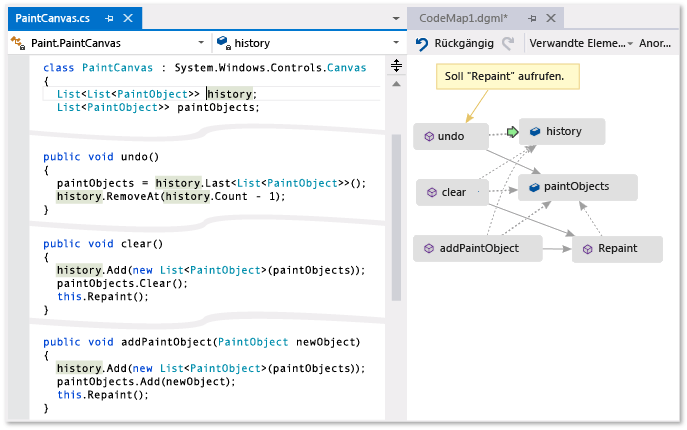  
  
 **Ein grüner Pfeil zeigt, wo sich der Cursor im Editor angezeigt wird**  
  
 Weitere Informationen zu den Befehlen und Aktionen können Sie beim Arbeiten mit codezuordnungen verwenden, finden Sie unter [durchsuchen und Neuanordnen code Maps](../modeling/browse-and-rearrange-code-maps.md).  
  
## Das Problem verstehen  
 Nehmen Sie an, in einem Zeichenprogramm, an dem Sie arbeiten, liegt ein Fehler vor. Um den Fehler zu reproduzieren, öffnen Sie die Projektmappe in Visual Studio, und drücken Sie **F5** zum Starten des Debuggings.  
  
 Wenn Sie eine Linie zeichnen, und wählen Sie **letzten Strich rückgängig machen**, geschieht nichts, bis Sie die nächste Linie zeichnen.  
  
 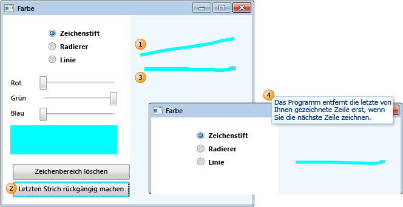  
  
 Daher beginnen Sie mit der Untersuchung, indem Sie nach der `Undo`-Methode suchen. Sie finden diese in der `PaintCanvas`-Klasse.  
  
 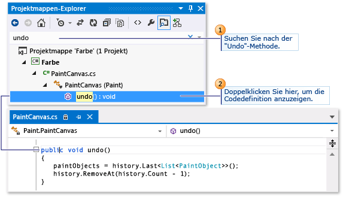  
  
## Die Codezuordnung starten  
 Nun beginnen Sie mit dem Mapping der `undo`-Methode und ihrer Beziehungen. Fügen Sie im Code-Editor die `undo`-Methode und die Felder, auf die sie verweist, zu einer neuen Codezuordnung hinzu. Wenn Sie eine neue Zuordnung erstellen, kann es einige Zeit dauern, den Code zu indizieren. Aufgrund der Indizierung können spätere Vorgänge schneller ausgeführt werden.  
  
 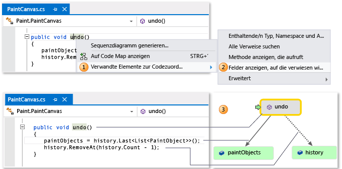  
  
> [!TIP]
>  Die letzten zur Zuordnung hinzugefügten Elemente werden grün hervorgehoben. Die grünen Pfeils wird die Cursorposition im Code. Pfeile zwischen Elementen stellen verschiedene Beziehungen dar. Weitere Informationen zu Elementen in der Map enthalten die entsprechenden QuickInfos. Fahren Sie zur Anzeige einfach mit dem Mauszeiger über das Element.  
  
 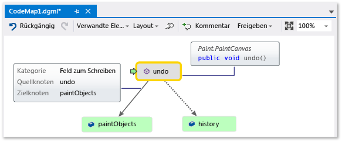  
  
## Code aus der Zuordnung navigieren und untersuchen  
 Um die Codedefinition für jedes Feld angezeigt wird, doppelklicken Sie auf das Feld auf der Karte aus, oder wählen Sie das Feld, und drücken Sie **F12**. Der grüne Pfeil wird zwischen den Elementen in der Zuordnung verschoben. Der Cursor im Code-Editor wird automatisch ebenfalls bewegt.  
  
 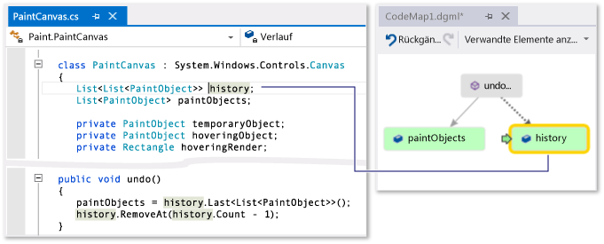  
  
 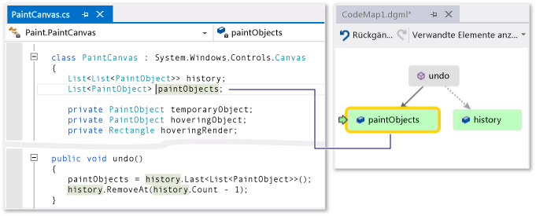  
  
> [!TIP]
>  Sie können den grünen Pfeil in der Zuordnung auch verschieben, indem Sie den Cursor im Code-Editor bewegen.  
  
## Beziehungen zwischen Teilen des Codes verstehen  
 Nun möchten Sie wissen, in welchem anderen Code die Felder `history` und `paintObjects` verwendet werden. Sie können der Zuordnung alle Methoden hinzufügen, die auf diese Felder verweisen. Dies kann von der Map oder vom Code-Editor aus erfolgen.  
  
 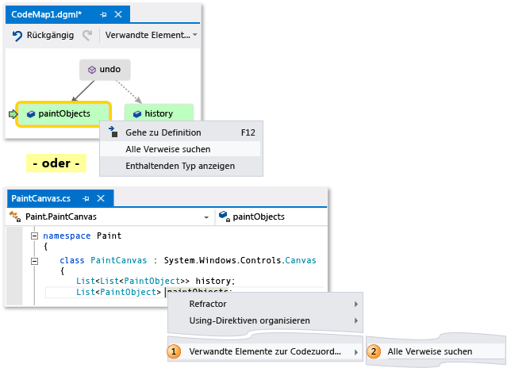  
  
   
  
> [!NOTE]
>  Wenn Sie Elemente aus einem Projekt hinzufügen, das von mehreren Apps wie Windows Phone oder Windows Store gemeinsam genutzt wird, werden diese Elemente immer mit dem derzeit aktiven App-Projekt in der Map angezeigt. Wenn Sie also den Kontext auf ein anderes App-Projekt ändern, ändert sich auch der Kontext auf der Map für alle neu hinzugefügte Elemente aus dem freigegebenen Projekt. Vorgänge, die Sie mit einem Element in der Zuordnung ausführen, gelten nur für solche Elemente, die denselben Kontext gemeinsam verwenden.  
  
 Ändern Sie das Layout, um den Ablauf der Beziehungen neu anzuordnen und die Zuordnung besser lesbar zu machen. Sie können Elemente in der Zuordnung auch verschieben, indem Sie sie an andere Positionen ziehen.  
  
 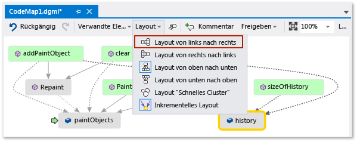  
  
> [!TIP]
>  Standardmäßig **inkrementelles Layout** eingeschaltet ist. Dadurch wird die Zuordnung so wenig wie möglich neu angeordnet, wenn Sie neue Elemente hinzufügen. Um die gesamte Zuordnung jedes Mal, wenn Sie neue Elemente hinzufügen zu ändern, deaktivieren Sie **inkrementelles Layout**.  
  
 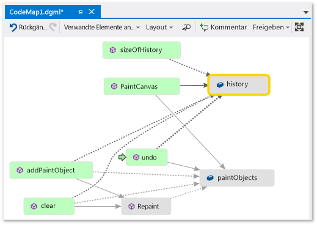  
  
 Überprüfen Sie diese Methoden. Doppelklicken Sie auf der Karte auf der **PaintCanvas** -Methode, oder wählen Sie diese Methode, und drücken Sie **F12**. Sie erfahren, dass `history` und `paintObjects` von dieser Methode als leere Listen erstellt werden.  
  
 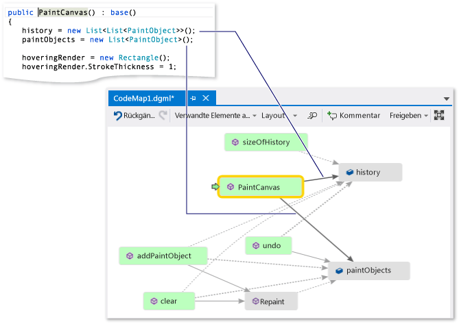  
  
 Wiederholen Sie nun die gleichen Schritte, um die Definition der `clear`-Methode zu überprüfen. Sie erfahren, dass in `clear` einige Aufgaben mit `paintObjects` und `history` ausgeführt werden. Anschließend wird die `Repaint`-Methode aufgerufen.  
  
 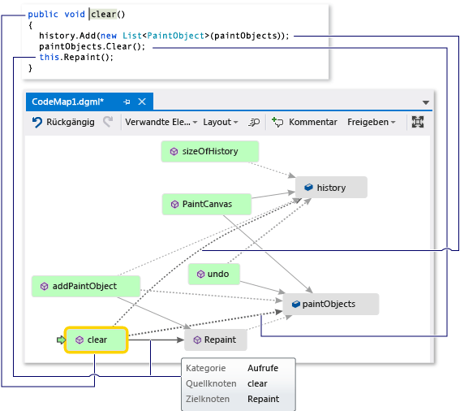  
  
 Überprüfen Sie nun die Definition der `addPaintObject`-Methode. Darin werden ebenfalls einige Aufgaben mit `history` und `paintObjects` ausgeführt. Auch darin wird `Repaint` aufgerufen.  
  
 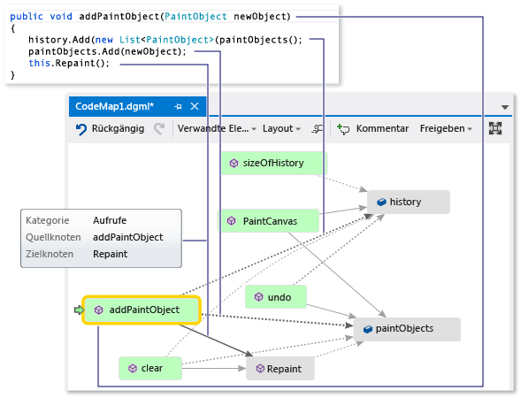  
  
## Das Problem durch Prüfen der Zuordnung suchen  
 Anscheinend wird von allen Methoden, die `history` und `paintObjects` ändern, `Repaint` aufgerufen. Von der `undo`-Methode wird `Repaint` jedoch nicht aufgerufen, obwohl von `undo` die gleichen Felder geändert werden. Daher denken Sie, dass Sie dieses Problem beheben können, indem Sie `Repaint` von `undo` aus aufrufen.  
  
 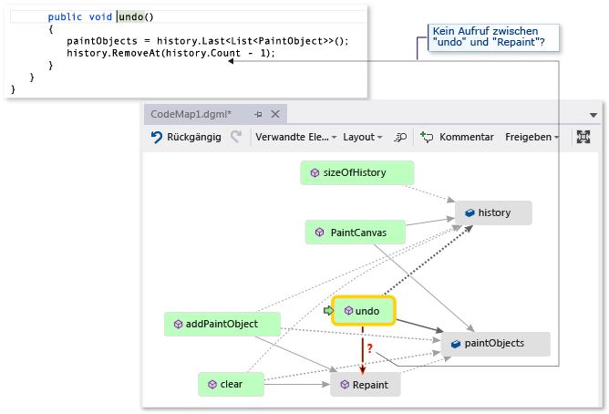  
  
 Wenn Sie keine Zuordnung zur Verfügung gehabt hätten, in der dieser fehlende Aufruf angezeigt wird, wäre es möglicherweise schwieriger gewesen, dieses Problem zu finden, insbesondere bei komplexerem Code.  
  
## Ergebnisse freigeben und nächste Schritte  
 Bevor Sie oder jemand anderes diesen Fehler behebt, können Sie in der Zuordnung Notizen zu dem Problem und dessen Behebung erstellen.  
  
 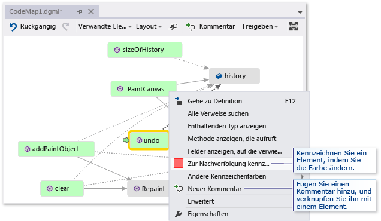  
  
 Sie können der Zuordnung beispielsweise Kommentare hinzufügen und Elemente mit Farben kennzeichnen.  
  
 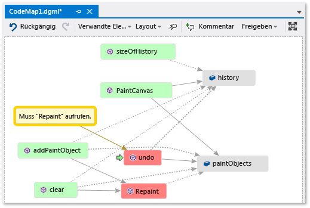  
  
 Wenn Microsoft Outlook installiert ist, können Sie die Zuordnung per E-Mail an andere senden. Sie können die Zuordnung auch als Bild oder in einem anderen Format exportieren.  
  
 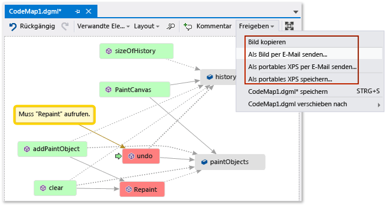  
  
## Das Problem beheben und zeigen, was Sie getan haben  
 Fügen Sie den Aufruf von `Repaint` zu `undo` hinzu, um diesen Fehler zu beheben.  
  
   
  
 Starten Sie die Debugsitzung neu, und versuchen Sie, den Fehler zu reproduzieren, um sicherzustellen, dass der Fehler behoben ist. Wählen jetzt **letzten Strich rückgängig machen** wie erwartet funktioniert, und bestätigen Sie die richtige Korrektur vorgenommen.  
  
 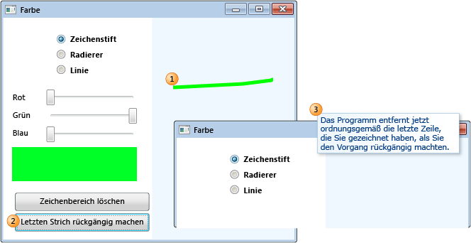  
  
 Sie können die Zuordnung aktualisieren, damit die Ihre Korrektur angezeigt wird.  
  
 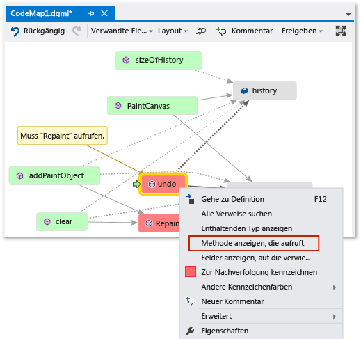  
  
 Die Karte zeigt nun eine Verknüpfung zwischen **Rückgängig** und **Repaint**.  
  
   
  
> [!NOTE]
>  Wenn Sie die Zuordnung aktualisieren, wird möglicherweise eine Meldung angezeigt, die besagt, dass der zum Erstellen der Zuordnung verwendete Codeindex aktualisiert wurde. Dies bedeutet, dass jemand den Code geändert hat, was dazu führt, dass die Zuordnung nicht mit dem aktuellen Code übereinstimmt. Das hindert Sie nicht daran, die Zuordnung zu aktualisieren. Sie müssen jedoch möglicherweise die Zuordnung neu erstellen, um sicherzustellen, dass sie dem Code entspricht.  
  
 Sie sind jetzt mit der Untersuchung fertig. Sie haben das Problem gefunden und erfolgreich korrigiert, indem Sie den Code zugeordnet haben. Außerdem verfügen Sie über eine Zuordnung, anhand der Sie im Code navigieren, sich an das Gelernte erinnern und die Schritte zur Behebung des Problems anzeigen können.  
  
## Siehe auch  
 [Zuordnen von Methoden in der Aufrufliste beim Debuggen](../debugger/map-methods-on-the-call-stack-while-debugging-in-visual-studio.md)   
 [Visualisieren von Code](../modeling/visualize-code.md)