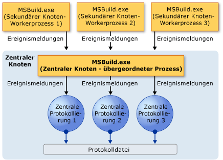
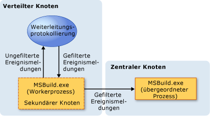

# Writing Multi-Processor-Aware Loggers
[!INCLUDE[vs2017banner](../code-quality/includes/vs2017banner.md)]

Die Fähigkeit von [!INCLUDE[vstecmsbuild](../extensibility/internals/includes/vstecmsbuild_md.md)], mehrere Prozessoren zu verwenden, kann die Dauer der Projekterstellung deutlich verringern, jedoch auch die Komplexität der Buildereignisprotokollierung erhöhen.  In einer Umgebung mit nur einem Prozessor gehen Ereignisse, Meldungen, Warnungen und Fehler auf vorhersehbare, geordnete Weise bei der Protokollierung ein.  In einer Umgebung mit mehreren Prozessoren können jedoch Ereignisse aus verschiedenen Quellen gleichzeitig und ungeordnet eintreffen.  Um dies verarbeiten zu können, bietet [!INCLUDE[vstecmsbuild](../extensibility/internals/includes/vstecmsbuild_md.md)] eine neue mehrprozessorfähige Protokollierung und ein neues Protokollierungsmodell; außerdem können Sie benutzerdefinierte "Weiterleitungsprotokollierungen" erstellen.  
  
## Anforderungen bei der Multiprozessorprotokollierung  
 Wenn Sie ein oder mehrere Projekte in einer Umgebung mit mehreren Prozessoren oder mehreren Prozessorkernen erstellen, werden die [!INCLUDE[vstecmsbuild](../extensibility/internals/includes/vstecmsbuild_md.md)]\-Buildereignisse für alle Projekte gleichzeitig erzeugt.  Die Protokollierung erhält eine Unmenge von Ereignismeldungen zur gleichen Zeit und ohne bestimmte Reihenfolge.  Da eine Protokollierung von [!INCLUDE[vstecmsbuild](../extensibility/internals/includes/vstecmsbuild_md.md)] 2.0 nicht für diese Situation ausgelegt ist, kann die Protokollierung überlastet werden, was zu einer längeren Builderstellungsdauer, falschen Protokollierungsausgaben oder sogar einem beschädigten Build führen kann.  Um diese Probleme zu beheben, kann die Protokollierung \(ab [!INCLUDE[vstecmsbuild](../extensibility/internals/includes/vstecmsbuild_md.md)] 3.5\) ungeordnete Ereignisse verarbeiten und Ereignisse ihren Quellen zuordnen.  
  
 Sie können die Protokollierungseffizienz noch erhöhen, indem Sie eine benutzerdefinierte Weiterleitungsprotokollierung erstellen.  Eine benutzerdefinierte Weiterleitungsprotokollierung funktioniert wie ein Filter, der Ihnen vor der Builderstellung ermöglicht, nur die zu überwachenden Ereignisse auszuwählen.  Durch die Verwendung einer benutzerdefinierten Weiterleitungsprotokollierung wird vermieden, dass die Protokollierung durch nicht benötigte Ereignisse überlastet, die Protokolle mit überflüssigen Daten gefüllt oder die Builderstellung verlangsamt wird.  
  
## Multiprozessor\-Protokollierungsmodelle  
 [!INCLUDE[vstecmsbuild](../extensibility/internals/includes/vstecmsbuild_md.md)] unterstützt zwei Protokollierungsmodelle, die zentrale und die verteilte Protokollierung, um Probleme mit Mehrprozessorbuilds behandeln zu können.  
  
### Zentrales Protokollierungsmodell  
 Im zentralen Protokollierungsmodell fungiert eine einzelne Instanz von MSBuild.exe als "zentraler Knoten", und untergeordnete Instanzen des zentralen Knotens \("sekundäre Knoten"\) werden an den zentralen Knoten angehängt, um ihn beim Durchführen von Buildaufgaben zu unterstützen.  
  
   
  
 Protokollierungen verschiedener Typen, die an den zentralen Knoten angefügt werden, werden als "zentrale Protokollierungen" bezeichnet. Es kann jeweils nur eine Instanz eines Protokollierungstyps an den zentralen Knoten angehängt werden.  
  
 Bei der Builderstellung leiten die sekundären Knoten die Buildereignisse an den zentralen Knoten weiter.  Der zentrale Knoten leitet alle seine Ereignisse sowie die Ereignisse der sekundären Knoten an eine oder mehrere der angehängten zentralen Protokollierungen weiter.  Die Protokollierungen erstellen dann Protokolldateien, die auf den eingehenden Daten basieren.  
  
 Obwohl nur <xref:Microsoft.Build.Framework.ILogger> von der zentralen Protokollierung implementiert werden muss, wird empfohlen, auch <xref:Microsoft.Build.Framework.INodeLogger> zu implementieren, sodass die zentrale Protokollierung mit der Anzahl Knoten, die am Build beteiligt sind, initialisiert wird.  Die folgende Überladung der <xref:Microsoft.Build.Framework.ILogger.Initialize%2A>\-Methode wird aufgerufen, wenn das Modul die Protokollierung initialisiert:  
  
```  
public interface INodeLogger: ILogger  
{  
    public void Initialize(IEventSource eventSource, int nodeCount);  
}  
```  
  
 Bereits vorhandene Protokollierungen, die auf <xref:Microsoft.Build.Framework.ILogger> basieren, können als zentrale Protokollierungen verwendet und an den Build angehängt werden.  Zentrale Protokollierungen jedoch, die ohne ausdrückliche Unterstützung für Protokollierungsszenarien mit mehreren Prozessoren und ungeordnete Ereignisse erstellt wurden, können zu einer Beschädigung des Builds führen oder eine bedeutungslose Ausgabe produzieren.  
  
### Verteiltes Protokollierungsmodell  
 Beim zentralen Protokollierungsmodell kann ein zu hohes Aufkommen von eingehenden Meldungen zu einer Überlastung des zentralen Knotens führen, wenn zum Beispiel mehrere Projekte gleichzeitig erstellt werden.  Dies kann zu einer Belastung der Systemressourcen und zu einer reduzierten Buildleistung führen.  Um dieses Problem zu verringern, unterstützt [!INCLUDE[vstecmsbuild](../extensibility/internals/includes/vstecmsbuild_md.md)] ein verteiltes Protokollierungsmodell.  
  
   
  
 Das verteilte Protokollierungsmodell erweitert das zentrale Protokollierungsmodell, indem es Ihnen ermöglicht, eine Weiterleitungsprotokollierung zu erstellen.  
  
#### Weiterleitungsprotokollierungen  
 Eine Weiterleitungsprotokollierung ist eine sekundäre, einfache Protokollierung mit einem Ereignisfilter. Diese Protokollierung wird an einen sekundären Knoten angehängt und empfängt eingehende Buildereignisse dieses Knotens.  Sie filtert die eingehenden Ereignisse und leitet nur die Ereignisse weiter, die im zentralen Knoten festgelegt sind.  Dies reduziert den Meldungsverkehr, der zum zentralen Knoten gesendet wird, und verbessert insgesamt die Buildleistung.  
  
 Es gibt zwei Möglichkeiten für die Verwendung der verteilten Protokollierung:  
  
-   Passen Sie die vordefinierte Weiterleitungsprotokollierung <xref:Microsoft.Build.BuildEngine.ConfigurableForwardingLogger> an.  
  
-   Schreiben Sie eine eigene benutzerdefinierte Weiterleitungsprotokollierung.  
  
 Sie können ConfigurableForwardingLogger an Ihre Anforderungen anpassen.  Rufen Sie hierzu die Protokollierung in der Befehlszeile mit MSBuild.exe auf, und führen Sie die Buildereignisse auf, die von der Protokollierung an den zentralen Knoten weitergeleitet werden sollen.  
  
 Alternativ können Sie auch eine benutzerdefinierte Weiterleitungsprotokollierung erstellen.  Durch die Erstellung einer benutzerdefinierten Weiterleitungsprotokollierung können Sie das Verhalten der Protokollierung genauer bestimmen.  Das Erstellen einer benutzerdefinierten Weiterleitungsprotokollierung ist jedoch komplexer als das Anpassen von ConfigurableForwardingLogger.  Weitere Informationen finden Sie unter [Creating Forwarding Loggers](../msbuild/creating-forwarding-loggers.md).  
  
## Verwenden von ConfigurableForwardingLogger zur einfachen verteilten Protokollierung  
 Verwenden Sie zum Konfigurieren von ConfigurableForwardingLogger oder einer benutzerdefinierten Weiterleitungsprotokollierung den `/distributedlogger`\-Schalter \(abgekürzt `/dl`\) in einem Befehlszeilenbuild von MSBuild.exe.  Das Format zum Angeben der Namen von Protokollierungstypen und \-klassen ist identisch mit dem für den `/logger`\-Schalter, mit der Ausnahme, dass eine verteilte Protokollierung immer über zwei Protokollierungsklassen statt einer verfügt, d. h. die Weiterleitungsprotokollierung und die zentrale Protokollierung.  Nachfolgend ist ein Beispiel dafür aufgeführt, wie eine benutzerdefinierte Weiterleitungsprotokollierung mit dem Namen XMLForwardingLogger angefügt wird.  
  
```  
msbuild.exe myproj.proj/distributedlogger:XMLCentralLogger,MyLogger,Version=1.0.2,Culture=neutral*XMLForwardingLogger,MyLogger,Version=1.0.2,Culture=neutral  
```  
  
> [!NOTE]
>  Ein Sternchen \(\*\) muss zum Trennen der beiden Protokollierungsnamen im `/dl`\-Schalter verwendet werden.  
  
 Die Verwendung von ConfigurableForwardingLogger ist mit der Verwendung anderer Protokollierungen identisch \(wie in [Erhalten von Buildprotokollen](../msbuild/obtaining-build-logs-with-msbuild.md) erläutert\), mit der Ausnahme, dass die ConfigurableForwardingLogger\-Protokollierung statt der normalen [!INCLUDE[vstecmsbuild](../extensibility/internals/includes/vstecmsbuild_md.md)]\-Protokollierung angehängt wird und dass Sie als Parameter die Ereignisse festlegen, die ConfigurableForwardingLogger an den zentralen Knoten weiterleiten soll.  
  
 Wenn Sie zum Beispiel nur dann benachrichtigt werden möchten, wenn ein Build beginnt und endet und wenn ein Fehler auftritt, übergeben Sie `BUILDSTARTEDEVENT`, `BUILDFINISHEDEVENT` und `ERROREVENT` als Parameter.  Mehrere Parameter können übergeben werden, indem sie durch Semikolons getrennt werden.  Nachfolgend ist ein Beispiel für die Verwendung von ConfigurableForwardingLogger dargestellt, um nur die Ereignisse `BUILDSTARTEDEVENT`, `BUILDFINISHEDEVENT` und `ERROREVENT` weiterzuleiten.  
  
```  
msbuild.exe myproj.proj /distributedlogger:XMLCentralLogger,MyLogger,Version=1.0.2,Culture=neutral*ConfigureableForwardingLogger,C:\My.dll;BUILDSTARTEDEVENT; BUILDFINISHEDEVENT;ERROREVENT  
```  
  
 Nachfolgend ist eine Liste der verfügbaren ConfigurableForwardingLogger\-Parameter aufgeführt.  
  
|ConfigurableForwardingLogger\-Parameter|  
|---------------------------------------------|  
|BUILDSTARTEDEVENT|  
|BUILDFINISHEDEVENT|  
|PROJECTSTARTEDEVENT|  
|PROJECTFINISHEDEVENT|  
|TARGETSTARTEDEVENT|  
|TARGETFINISHEDEVENT|  
|TASKSTARTEDEVENT|  
|TASKFINISHEDEVENT|  
|ERROREVENT|  
|WARNINGEVENT|  
|HIGHMESSAGEEVENT|  
|NORMALMESSAGEEVENT|  
|LOWMESSAGEEVENT|  
|CUSTOMEVENT|  
|COMMANDLINE|  
|PERFORMANCESUMMARY|  
|NOSUMMARY|  
|SHOWCOMMANDLINE|  
  
## Siehe auch  
 [Creating Forwarding Loggers](../msbuild/creating-forwarding-loggers.md)