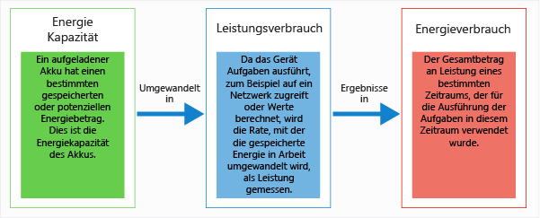
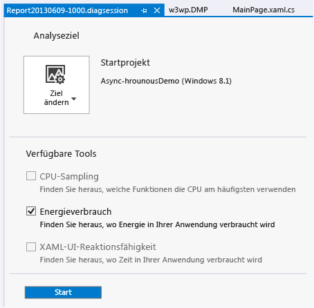
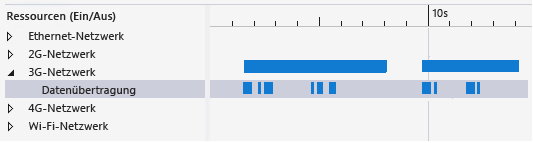
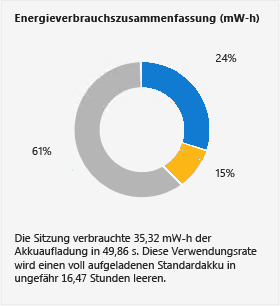

# <a name="analyze-energy-use-in-uwp-apps"></a>Analysieren des Energieverbrauchs in UWP-Apps
Der Profiler **Energieverbrauch** von Visual Studio hilft Ihnen, den Strom- und Energieverbrauch von UWP-Apps auf Tablets mit geringer Leistung zu analysieren, die die ganze Zeit oder zeitweilig von eigenen Akkus betrieben werden. Auf einem akkubetriebenen Gerät kann eine App, die zu viel Energie verbraucht, die Kundenzufriedenheit so sehr beeinträchtigen, dass sie von den Kunden möglicherweise sogar deinstalliert wird. Ein optimierter Energieverbrauch kann die Akzeptanz Ihrer App und deren Nutzung durch die Kunden erhöhen.  
  
##  <a name="BKMK_What_the_Energy_Consumption_tool_is__how_it_works__and_what_it_measures"></a> Beschreibung, Funktionsweise und Messwerte des Energieverbrauchsprofilers  
 Der Energieverbrauch-Profiler erfasst die Aktivitäten der Anzeige, CPU und Netzwerkverbindungen eines Geräts während einer Profilerstellungssitzung. Daraufhin generiert er Schätzungen der Energie, die für diese Aktivitäten verbraucht wird, sowie der Gesamtmenge an Energie, die für die Profilerstellungssitzung verwendet wird.  
  
> [!NOTE]
>  Der Energie-Profiler schätzt den Strom- und Energieverbrauch unter Anwendung eines Softwaremodells einer Standardreferenzgerätehardware, die repräsentativ für Tabletgeräte mit geringer Leistung ist, auf denen Ihre Anwendung möglicherweise ausgeführt wird. Um eine optimale Schätzung zu ermöglichen, wird empfohlen, die Profildaten auf einem Tabletgerät mit geringer Leistung zu sammeln.  
>   
>  Auch wenn das Modell gute Schätzungen für eine Vielzahl an Geräten mit geringer Leistung liefert, sind die tatsächlichen Werte des Geräts, für das Sie ein Profil erstellen, wahrscheinlich anders. Anhand der Werte können Sie herausfinden, welche Anzeige-, CPU- und Netzwerkaktivitäten im Vergleich zur Nutzung anderer Ressourcen recht teuer sind und sich so möglicherweise besonders gut für Optimierungszwecke eignen.  
  
 Der Energieverbrauch-Profiler verwendet folgende Definitionen von *Strom* und *Energie*:  
  
-   *Strom* misst die Rate, mit der Kraft aufgewendet wird, um in einem bestimmten Zeitraum eine Leistung zu erbringen. In der Elektrik ist die Standardeinheit für Strom *Watt*. Diese wird als die Rate definiert, in der Leistung erbracht wird, wenn ein Ampere Spannung über eine elektrische Potenzialdifferenz von einem Volt fließt. Im Diagramm für den **Stromverbrauch** werden die Einheiten in Milliwatt **mW** (einem Tausendstel Watt) angezeigt.  
  
     Da Strom fließt, hat es auch eine Richtung (die Leistung kann in einem Zeitraum ansteigen oder abnehmen) und eine Geschwindigkeit (die Menge, mit der die Leistung ansteigt oder abnimmt).  
  
-   *Energie* misst die Gesamtmenge der Leistung, entweder als Kapazität oder Potenzial, wie bei der Stromkapazität eines Akkus, oder als Gesamtsumme an Leistung über einen bestimmten Zeitraum. Die Einheit für Energie ist eine Wattstunde, d. h. die Menge an Strom eines Watts, die ständig eine Stunde lang angewendet wird. In der **Energiezusammenfassung**werden die Einheiten in Milliwattstunden **mW-h**dargestellt.  
  
   
  
 Ein vollständig geladener Akku in einem Tablet verfügt z. B. über eine bestimmte Menge an gespeicherte Energie. Während die Energie verwendet wird, um Aufgaben wie die Kommunikation über ein Netzwerk, die Berechnung von Werten oder die Anzeige von Grafiken auszuführen, verbraucht sich der Strom des Akkus in unterschiedlichen Raten. Während jedes beliebigen Zeitraum wird auch die Summe des verbrauchten Stroms von der Energie gemessen.  
  
##  <a name="BKMK_Identify_scenarios_with_user_marks"></a> Identifizieren von Szenarien mit Benutzermarkierungen  
 Sie können den Profilerstellungsdaten *Benutzermarkierungen* hinzufügen, die bei der Identifizierung von Bereichen im Zeitachsenlineal hilfreich sind.  
  
   
  
 Die Markierung wird bei Ausführung der Methode in der Zeitachse als orangefarbenes Dreieck angezeigt. Die Meldung und Uhrzeit werden als QuickInfo angezeigt, wenn Sie mit der Maus über die Markierung fahren. Wenn mindestens zwei Benutzermarkierungen nahe beieinander liegen, werden die Markierungen zusammengeführt und die QuickInfo-Daten werden kombiniert. Sie können auf der Zeitachse eine Vergrößerung durchführen, um die Markierungen zu trennen.  
  
 **Hinzufügen von Markierungen zu C#-, Visual Basic- und C++-Code**  
  
 Erstellen Sie zuerst ein [Windows.Foundation.Diagnostics LoggingChannel](http://msdn.microsoft.com/library/windows/apps/windows.foundation.diagnostics.loggingchannel.aspx) -Objekt, um C#-, Visual Basic- und C++-Code eine Benutzermarkierung hinzuzufügen. Fügen Sie anschließend an den Positionen im Code, die Sie markieren möchten, Aufrufe von [LoggingChannel.LogMessage](http://msdn.microsoft.com/library/windows/apps/dn264210.aspx) -Methoden ein. Verwenden Sie in den Aufrufen [LoggingLevel.Information](http://msdn.microsoft.com/library/windows/apps/windows.foundation.diagnostics.logginglevel.aspx) .  
  
 Wenn die Methode ausgeführt wird, wird eine Benutzermarkierung zu den Profilerstellungsdaten zusammen mit einer Meldung hinzugefügt.  
  
> [!NOTE]
>  -   Die Windows.Foundation.Diagnostics LoggingChannel-Klasse implementiert die [Windows.Foundation.IClosable](/uwp/api/windows.foundation.iclosable)-Schnittstelle (in C# und VB als [System.IDisposable](/dotnet/api/system.idisposable) projiziert). Rufen Sie [LoggingChannel.Close](/uwp/api/Windows.Foundation.Diagnostics.LoggingChannel) ([Windows.Foundation.Diagnostics.LoggingChannel.Dispose](/uwp/api/Windows.Foundation.Diagnostics.LoggingChannel) in C# und VB) auf, wenn Sie mit einem Protokollierungskanal fertig sind, um Verluste von Betriebssystemressourcen zu vermeiden.  
> -   Jeder offene Protokollierungschannel muss einen eindeutigen Namen haben. Wenn Sie versuchen, einen neuen Protokollierungschannel mit demselben Namen wie ein nicht gelöschter Channel zu erstellen, wird eine Ausnahme verursacht.  
  
 Beispiele hierzu finden Sie im Windows SDK-Beispiel [LoggingSession](http://code.msdn.microsoft.com/windowsapps/LoggingSession-Sample-ccd52336) .  
  
 **Hinzufügen von Markierungen zu JavaScript-Code**  
  
 Um Benutzermarkierungen hinzuzufügen, fügen Sie Ihrem Code an den gewünschten Positionen den folgenden Code hinzu:  
  
```  
if (performance && performance.mark) {  
    performance.mark(markDescription);  
}  
```  
  
 *markDescription* ist eine Zeichenfolge, die die Meldung enthält, die in der QuickInfo der Benutzermarkierung angezeigt werden soll.  
  
##  <a name="BKMK_Configure_your_environment_for_profiling"></a> Konfigurieren der Umgebung für die Profilerstellung  
 Um gute Schätzungen zu erhalten, sollten Sie für den Energieverbrauch der App auf einem Gerät mit geringer Leistung, das durch Akkus betrieben wird, ein Profil erstellen. Da Visual Studio auf den meisten dieser Geräte nicht ausgeführt wird, müssen Sie den Visual Studio-Computer mithilfe der Visual Studio-Remotetools mit dem Gerät verbinden. Um eine Verbindung mit einem Remotegerät herzustellen, müssen Sie sowohl das Visual Studio-Projekt und als auch das Remotegerät konfigurieren. Weitere Informationen finden Sie unter [Ausführen von UWP-Apps auf einem Remotecomputer](../debugger/run-windows-store-apps-on-a-remote-machine.md).  
  
> [!TIP]
>  -   Energieprofilerstellung auf dem UWP-Simulator oder auf dem Visual Studio-Computer wird nicht empfohlen. Die Profilerstellung auf dem tatsächlichen Gerät bietet weitaus realistischere Daten.  
> -   Erstellen Sie das Profil auf dem Zielgerät, während es über seine Akkus betrieben wird.  
> -   Schließen Sie alle anderen Anwendungen, die möglicherweise die gleichen Ressourcen verwenden (Netzwerk, CPU oder Anzeige).  
  
##  <a name="BKMK_Collect_energy_profile_data_for_your_app"></a> Sammeln von Energieprofildaten für die App  
  
1.  Wählen Sie im Menü **Debuggen** die Option **Diagnose ohne Debugging starten**.  
  
       
  
2.  Wählen Sie **Energieverbrauch** und dann **Starten**aus.  
  
    > [!NOTE]
    >  Wenn Sie den Profiler **Energieverbrauch** starten, wird möglicherweise das Fenster **Benutzerkontensteuerung** angezeigt, im dem Sie zur Eingabe Ihrer Berechtigung zur Ausführung von VsEtwCollector.exe aufgefordert werden. Klicken Sie auf **Ja**.  
  
3.  Führen Sie Ihre App aus, um Daten zu sammeln.  
  
4.  Um die Profilerstellung zu beenden, wechseln Sie zu Visual Studio zurück (ALT+TAB), und wählen Sie **Auflistung beenden** auf der Diagnosehubseite aus.  
  
       
  
     Visual Studio analysiert die gesammelten Daten und zeigt die Ergebnisse an.  
  
##  <a name="BKMK_Collect_energy_profile_data_for_an_installed_app"></a> Sammeln von Energieprofildaten für eine installierte App  
 Das Energieverbrauchstool kann nur für UWP-Apps ausgeführt werden, die von einer Visual Studio-Projektmappe gestartet oder vom Microsoft Store installiert werden. Wenn eine Projektmappe in Visual Studio geöffnet ist, lautet das Standardziel **Startprojekt**. So verwenden Sie eine installierte App als Ziel  
  
1.  Wählen Sie **Ziel ändern** und dann **Installierte App**aus.  
  
2.  Wählen Sie in der Liste **Installiertes App-Paket auswählen** das Ziel aus.  
  
3.  Wählen Sie auf der Seite "Diagnosehub" **Energieverbrauch** aus.  
  
4.  Wählen **Starten** , um die Profilerstellung zu starten.  
  
 Um die Profilerstellung zu beenden, wechseln Sie zu Visual Studio zurück (ALT+TAB), und wählen Sie **Auflistung beenden** auf der Diagnosehubseite aus.  
  
##  <a name="BKMK_Analyze_energy_profile_data"></a> Analysieren der Energieprofildaten  
 Die Energieprofildaten werden im Dokumentfenster von Visual Studio angezeigt:  
  
   
  
|||  
|-|-|  
||Die Berichtsdatei heißt Report*JJJJMMTT-HHMM*.diagsession. Sie können den Namen ändern, wenn Sie den Bericht speichern.|  
||Die Zeitachse zeigt die Länge der Profilerstellungssitzung, der App-Lebenszyklusaktivierungsereignisse und der Benutzermarkierungen an.|  
||Sie können den Bericht auf einen Teil der Zeitachse einschränken, indem Sie die blauen Striche ziehen, um einen Bereich der Zeitachse auszuwählen.|  
||Das Diagramm **Stromverbrauch** ist ein Liniendiagramm (mit mehreren Linien), in dem die Änderung in der Stromabgabe anzeigt wird, die durch eine Geräteressource während einer Profilerstellungssitzung verursacht wird. Der Energieverbrauchsprofiler verfolgt die von der CPU, von der Netzwerkaktivität und von der Bildschirmanzeige verwendete Energie.|  
||Das Diagramm **Ressourcen (Ein/Aus)**  stellt Details der Netzwerkenergiekosten dar. Die Leiste **Netzwerk** stellt die Zeit dar, während der die Netzwerkverbindung geöffnet war. Die untergeordnete Leiste **Datenübertragung** stellt die Zeit dar, in der die App Daten über das Netzwerk empfangen oder gesendet hat.|  
||In der **Zusammenfassung der Energieverwendung** wird der proportionale Betrag der gesamten Energie dargestellt, die in einem ausgewählten Zeitraum von der CPU, von der Netzwerkaktivität und von der Bildschirmanzeige verbraucht wurde.|  
  
 **Analyse der Energieprofildaten**  
  
 Suchen Sie einen Bereich, in dem die Ressourcenenergie sehr hoch war. Verknüpfen Sie den Höchstbereich mit der Funktionalität der App. Verwenden Sie dann die Steuerleisten auf der Zeitachse, um den Bereich zu vergrößern. Wenn Sie sich auf die Netzwerkauslastung konzentrieren möchten, erweitern Sie den Knoten **Netzwerk** im Diagramm **Ressourcen (Ein/Aus)**  . Sie können nun die Zeit, in der die Netzwerkverbindung aktiv war, mit der Zeit vergleichen, in der die App Daten über die Verbindung empfangen oder übertragen hat. Eine sehr wirksame Optimierungsmaßnahme ist, die Zeitspanne zu reduzieren, die das Netzwerk unnötigerweise geöffnet ist.  
  
##  <a name="BKMK_Optimize_energy_use"></a> Optimieren des Energieverbrauchs  
 Zusätzlich zur Datenübertragung verursachen Netzwerkverbindungen auch Energiekosten für das Initialisieren, Verwalten und Schließen der Verbindung. Einige Netzwerke halten die Verbindung für einen bestimmten Zeitraum aufrecht, nachdem Daten gesendet bzw. empfangen wurden, damit über eine einzige Verbindung mehr Daten übertragen werden können. Im Bereich **Ressourcen (Ein/Aus)** können Sie die Methode überprüfen, mit der die App auf die Verbindung interagiert.  
  
   
  
 Wenn in den Leisten **Netzwerk** und **Datenübertragung** angezeigt wird, dass die Verbindung langfristig aktiv ist, damit eine Reihe kleiner Datenpakete nacheinander übertragen werden kann, können Sie die Daten im Batch im Rahmen einer Übertragung senden. Damit verringern Sie die Zeit, in der das Netzwerk aktiv ist, und und sparen somit Energiekosten.  
  
   
  
 Über die Energiekosten der Anzeige haben Sie weniger Kontrolle. Die meisten Bildschirme benötigen mehr Energie, um helle Farben darzustellen als dunklere Farben. Deshalb ist eine Möglichkeit, Kosten zu reduzieren, einen dunklen Hintergrund zu verwenden.  
  
##  <a name="BKMK_Other_resources"></a> Weitere Ressourcen  
  
-   In den Abschnitten **Verbindungsstatus- und Kostenverwaltung** für [C#/VB/C++ und XAML](http://msdn.microsoft.com/en-us/0ee0b706-8432-4d49-9801-306ed90764e1) und [JavaScript und HTML](http://msdn.microsoft.com/en-us/372afa6a-1c7c-4657-967d-03a77cd8e933) im Windows Dev Center werden die Windows-APIs beschrieben, die Informationen zur Netzwerkkonnektivität bereitstellen, die Ihre App nutzen kann, damit Sie die Kosten für den Netzwerkdatenverkehr reduzieren können.  
  
     Mit dem Visual Studio-Simulator für UWP-Apps können Sie Datenverbindungseigenschaften der APIs für Netzwerkinformationen simulieren. Weitere Informationen finden Sie unter [Ausführen von UWP-Apps im Simulator](../debugger/run-windows-store-apps-in-the-simulator.md).  
  
-   Mit den Tools **JavaScript-Funktionstiming** und **CPU-Auslastung** können Sie die CPU-Last reduzieren, wenn diese von ineffizienten Funktionen verursacht wird. Siehe [Analysieren der CPU-Auslastung](../profiling/analyze-cpu-usage-in-a-windows-universal-app.md).

## <a name="see-also"></a>Siehe auch
 [Profilerstellung in Visual Studio](../profiling/index.md)  
 [Tour zur Profilerstellungsfunktion](../profiling/profiling-feature-tour.md)