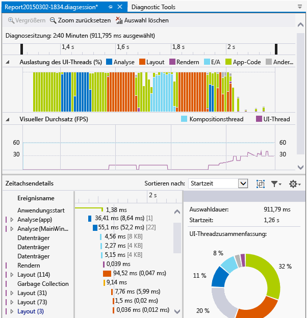
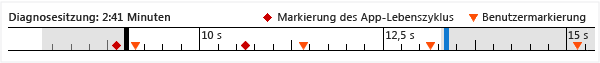
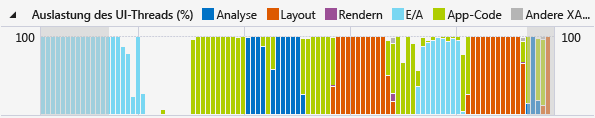
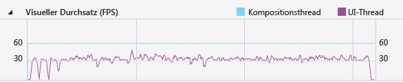

# Analysieren des Ressourcenverbrauchs und der Threadaktivitäten auf Benutzeroberflächen (XAML)

Verwenden Sie den Profiler **Anwendungszeitachse** , um Leistungsprobleme in Bezug auf die Anwendungsinteraktion in XAML-Anwendungen zu suchen und zu beheben. Mit diesem Tool können Sie die Leistung von XAML-Anwendungen verbessern, indem Sie eine detaillierte Ansicht des Ressourcenverbrauchs einer Anwendung anzeigen lassen. Sie können analysieren, wie viel Zeit Ihre Anwendung zum Vorbereiten von Benutzeroberflächenframes (Anordnen und Rendern), zum Verarbeiten von Netzwerk- und Datenträgeranforderungen sowie in Szenarios wie Starten von Anwendungen, Laden von Seiten und Ändern von Fenstergrößen benötigt.

Die **Anwendungszeitachse** ist eines der Tools, die Sie mit dem Befehl **Debuggen** > **Leistungsprofiler** starten können.

Dieses Tool ersetzt das Tool **XAML-UI-Reaktionsfähigkeit** , das zum Diagnosetoolset für Visual Studio 2013 gehört.

Sie können dieses Tool auf den folgenden Plattformen verwenden:

- Universelle Windows-Apps (unter Windows 10)
- Windows 8.1
- Windows Presentation Foundation (.NET 4.0 und höher)
- Windows 7

> [!NOTE]
> Zusätzlich zu den Daten der **Anwendungszeitachse** können Sie Daten zu CPU-Auslastung und Energieverbrauch sammeln und analysieren. Weitere Informationen finden Sie unter [Profilerstellungstools mit oder ohne den Debugger ausführen](../profiling/running-profiling-tools-with-or-without-the-debugger.md).

## Erfassen von Anwendungszeitachsen-Daten

Sie können Profile für die Reaktionsfähigkeit Ihrer App auf dem lokalen Computer, einem angeschlossenen Gerät, dem Visual Studio-Simulator bzw. -Emulatoren sowie auf einem Remotegerät erstellen. Weitere Informationen finden Sie unter [Profilerstellungstools mit oder ohne den Debugger ausführen](../profiling/running-profiling-tools-with-or-without-the-debugger.md).

> [!TIP]
> Führen Sie die App nach Möglichkeit direkt auf dem Gerät aus. Die Anwendungsleistung, die im Simulator oder über eine Remotedesktopverbindung überwacht wird, ist möglicherweise nicht identisch mit der tatsächlichen Leistung auf dem Gerät. Auf der anderen Seite wirkt sich das Sammeln der Daten mithilfe der Visual Studio-Remotetools nicht auf die Leistungsdaten aus.

Im Folgenden finden Sie die grundlegenden Schritte:

1. Öffnen Sie die XAML-App.

2. Klicken Sie auf **Debuggen/Leistungsprofiler**. Im Fenster ".diagsession" sollte eine Liste der Profilerstellungstools angezeigt werden.

3. Wählen Sie **Anwendungszeitachse** aus, und klicken Sie unten im Fenster auf **Starten** .

   > [!NOTE]
   > Möglicherweise wird das Fenster „Benutzerkontensteuerung“ angezeigt, in dem Sie zur Eingabe Ihrer Berechtigung zur Ausführung von *VsEtwCollector.exe* aufgefordert werden. Klicken Sie auf **Ja**.

4. Führen Sie das Szenario aus, mit dem Sie ein Profil für Ihre App erstellen möchten, um Leistungsdaten zu sammeln.

5. Um die Profilerstellung zu beenden, wechseln Sie zurück zum Fenster ".diagsession", und klicken Sie oben im Fenster auf **Beenden** .

   Visual Studio analysiert die gesammelten Daten und zeigt die Ergebnisse an.

   

## Analysieren von Zeitachsen-Profilerstellungsdaten

Nachdem Sie die Profilerstellungsdaten gesammelt haben, können Sie diese Schritte ausführen, um mit der Analyse zu beginnen:

1. Überprüfen Sie die Informationen in den Diagrammen **Auslastung des UI-Threads** und **Visueller Durchsatz (FPS)**, und wählen Sie dann über die Navigationsleisten der Zeitachse den Zeitraum aus, den Sie analysieren möchten.

2. Überprüfen Sie anhand der Informationen in den Diagrammen **Auslastung des UI-Threads** bzw. **Visueller Durchsatz (FPS)** die Details in der Ansicht **Zeitachsendetails**, um mögliche Ursachen für eine scheinbar mangelhafte Reaktionsfähigkeit zu finden.

###  Berichtsszenarien, Kategorien und Ereignisse

Das Tool **Anwendungszeitachse** zeigt zeitbezogene Daten zu Szenarien, Kategorien und Ereignissen im Zusammenhang mit der XAML-Leistung.

###  Zeitachse der Diagnosesitzung

Das Lineal oben auf der Seite zeigt die Zeitachse für die Profilerstellungsinformationen an. Diese Zeitachse gilt sowohl für das Diagramm **Auslastung des UI-Threads** als auch für das Diagramm **Visueller Durchsatz** . Sie können den Bereich des Berichtes eingrenzen, indem Sie die Navigationsleisten auf der Zeitachse ziehen, um ein Segment der Zeitachse auszuwählen.

Die Zeitachse zeigt auch alle Benutzermarkierungen an, die Sie eingefügt haben, sowie die Ereignisse des Aktivierungslebenszyklus der App.

###  Diagramm der Auslastung des UI-Threads

Das Diagramm **Auslastung des UI-Threads (%)** ist ein Balkendiagramm, in dem für den Verlauf einer Datensammlung die relative Dauer in der jeweiligen Kategorie angezeigt wird.

###  Diagramm des visuellen Durchsatzes (FPS)

Das Liniendiagramm **Visueller Durchsatz (FPS)** zeigt die Bilder pro Sekunde (FPS) auf der UI und dem Kompositionsthread für die App an.

###  Zeitachse

Die Detailansicht benötigen Sie am häufigsten, um den Bericht zu analysieren. Sie zeigt die CPU-Auslastung Ihrer Anwendung kategorisiert nach dem UI-Frameworksubsystem oder der Systemkomponente an, das/die die CPU verbraucht hat.

Die folgenden Ereignisse werden unterstützt:

|||
|-|-|
|**Analyse**|Für das Analysieren von XAML-Dateien und Erstellen von Objekten benötigte Zeit.   Beim Erweitern eines **Analyse**-Knotens im Bereich **Zeitachsendetails** wird die Abhängigkeitskette aller XAML-Dateien anzeigt, die aufgrund des Ausgangsereignisses analysiert wurden. Mit diesem Tipp können Sie unnötige Dateianalysen und Objekterstellungen in leistungssensiblen Szenarios finden und entfernen.|
|**Layout**|In großen Anwendungen können Tausende von Elementen zur gleichen Zeit auf dem Bildschirm angezeigt werden. Diese Anzeige kann zu einer niedrigen UI-Framerate und einer entsprechend geringen Reaktionsfähigkeit der Anwendung führen. Das Layoutereignis bestimmt genau die Kosten für die Anordnung jedes Elements (d.h. die Zeit, die für die Vorgänge Arrange, Measure, ApplyTemplate, ArrangeOverride und MeasureOverride aufgewendet wird). Es erstellt auch die visuellen Strukturen, die an einem Layoutdurchlauf beteiligt waren. Sie können diese Visualisierung verwenden, um zu bestimmen, welche logischen Strukturen gelöscht werden müssen, oder um andere Mechanismen mit Verzögerungen auszuwerten, um Ihren Layoutdurchlauf zu optimieren.|
|**Rendern**|Zeitaufwand für das Zeichnen von XAML-Elementen auf dem Bildschirm.|
|**E/A**|Zeitaufwand für das Abrufen von Daten vom lokalen Datenträger oder von Netzwerkressourcen, auf die über die [Microsoft Windows Internet-API (WinINet)](/windows/desktop/WinInet/portal)zugegriffen wird.|
|**App-Code**|Der Zeitaufwand für die Ausführung von Anwendungs- bzw. Benutzercode, der nicht mit der Analyse oder dem Layout zusammenhängt.|
|**Andere XAML**|Zeitaufwand für die Ausführung von XAML-Laufzeitcode.|

> [!TIP]
> Wählen Sie das Tool **CPU-Auslastung** zusammen mit dem Tool **Anwendungszeitachse** aus, wenn Sie mit der Profilerstellung beginnen, um App-Methoden anzuzeigen, die im UI-Thread ausgeführt werden. Durch das Verlagern von App-Code mit langer Ausführungsdauer in einen Hintergrundthread kann die UI-Reaktionsfähigkeit verbessert werden.

####  Anpassen von Zeitachsendetails

Verwenden Sie die Symbolleiste **Zeitachsendetails** zum Sortieren, Filtern und Angeben der Anmerkungen zu Einträgen in der Ansicht **Zeitachsendetails** .

|||
|-|-|
|**Sortieren nach**|Sortieren Sie nach Startzeit oder Ereignisdauer.|
||Dient zum Hinzufügen oder Entfernen einer Kategorie **Frame** der obersten Ebene, die Ereignisse nach Frame gruppiert.|
||Filtert die Liste anhand ausgewählter Kategorien und der Dauer von Ereignissen.|
||Ermöglicht die Angabe von Anmerkungen zu Ereignissen.|

## Siehe auch

- [WPF team blog: New UI performance analysis tool for WPF applications (WPF-Teamblog: Neues Tool für die Analyse der Benutzeroberflächenleistung für WPF-Anwendungen)](https://blogs.msdn.microsoft.com/wpf/2015/01/16/new-ui-performance-analysis-tool-for-wpf-applications/)
- [Bewährte Methoden zur Leistungsverbesserung für UWP-Apps mit C++, C# und Visual Basic](/previous-versions/windows/apps/hh750313\(v\=win.10\))
- [Optimieren der WPF-Anwendungsleistung](/dotnet/framework/wpf/advanced/optimizing-wpf-application-performance)
- [Profilerstellung in Visual Studio](../profiling/index.md)
- [Einführung in Profilerstellungstools](../profiling/profiling-feature-tour.md)
