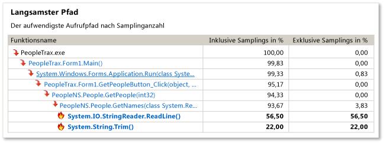
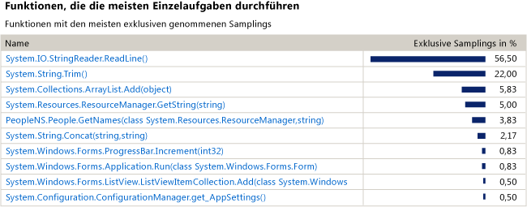
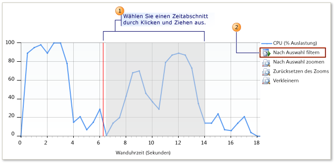

# Einführung in CPU-Sampling
Sie können Visual Studio-Profilerstellungstools verwenden, um Leistungsprobleme in der Anwendung zu analysieren. Dieses Verfahren veranschaulicht die Verwendung von **Sampling**-Daten.

> [!NOTE]
>  Es wird empfohlen, das Tool [CPU-Auslastung](../profiling/beginners-guide-to-performance-profiling.md) im Fenster „Diagnosetools“ anstelle des Legacy-CPU-Samplingtools zu verwenden, außer wenn Sie spezielle Funktionen benötigen, wie z.B. Instrumentierungsunterstützung.
  
 Beim **Sampling** handelt es sich um eine statistische Profilerstellungsmethode, die Aufschluss über die Funktionen gibt, von denen in der Anwendung die meisten Benutzermodusarbeiten ausgeführt werden. Das Sampling stellt einen guten Ausgangspunkt für die Suche nach Bereichen dar, in denen sich die Geschwindigkeit der Anwendung optimieren lässt.  
  
 Von der **Samplingmethode** werden in angegebenen Intervallen Informationen zu den in der Anwendung ausgeführten Funktionen gesammelt. Nach Abschluss einer Profilerstellung zeigt die Ansicht **Zusammenfassung** der Profilerstellungsdaten die aktivste Funktionsaufrufstruktur namens **Langsamster Pfad**, in der die meisten Aufgaben in der Anwendung ausgeführt wurden. In der Ansicht sind auch die Funktionen aufgeführt, die die meiste individuelle Arbeit ausgeführt haben. Außerdem wird ein Zeitachsendiagramm zur Verfügung gestellt, das Sie verwenden können, um sich auf bestimmte Segmente der Samplingsitzung zu konzentrieren.  
  
 Wenn Sie beim **Sampling** nicht die benötigten Daten erhalten, stehen in den Profilerstellungstools weitere Sammlungsmethoden zur Verfügung, um andere Arten von hilfreichen Informationen zu erhalten. Weitere Informationen zu diesen anderen Methoden finden Sie unter [Vorgehensweise: Auswählen von Sammlungsmethoden](../profiling/how-to-choose-collection-methods.md).  
  
> [!TIP]
>  Vergewissern Sie sich bei der Profilerstellung für Code, mit dem Windows-Funktionen aufgerufen werden, dass Sie über die neuesten *PDB-Dateien* verfügen. Ohne diese Dateien werden in den Berichtsansichten kryptische und schwer verständliche Namen von Windows-Funktionen aufgeführt. Weitere Informationen zum Sicherstellen, dass Sie über die erforderlichen Dateien verfügen, finden Sie unter [Vorgehensweise: Verweisen auf Windows-Symbolinformationen](../profiling/how-to-reference-windows-symbol-information.md).  
  
## Erstellen und Ausführen einer Leistungssitzung  
 Zum Abrufen der zu analysierenden Daten muss zunächst eine Leistungssitzung erstellt und ausgeführt werden. Diese beiden Schritte können mithilfe des **Leistungs-Assistenten** ausgeführt werden.  
  
 Wenn Sie kein Profil für eine Windows-Desktop-Anwendung oder ASP.NET-Anwendung erstellen, müssen Sie eines der anderen Profilerstellungstools verwenden. Weitere Informationen finden Sie unter [Einführung in Profilerstellungstools](../profiling/profiling-tools.md)  
  
#### So können Sie eine Leistungssitzung erstellen und ausführen  
  
1.  Öffnen Sie die Lösung in Visual Studio. Legen Sie die Konfiguration auf „Release“ fest. (Das Feld **Projektmappenkonfigurationen** finden Sie in der Symbolleiste. Es ist standardmäßig auf **Debuggen** festgelegt. Ändern Sie es in **Release**.)  
  
    > [!IMPORTANT]
    >  Wenn Sie auf dem Computer, den Sie verwenden, kein Administrator sind, sollten Sie Visual Studio während der Verwendung des Profilers als Administrator ausführen. (Klicken Sie mit der rechten Maustaste auf das Anwendungssymbol für Visual Studio, und klicken Sie dann auf **Als Administrator ausführen**.)  
  
2.  Wählen Sie im Menü **Debuggen** die Option **Profiler** und danach **Leistungsprofiler** aus.  
  
3.  Aktivieren Sie den **Leistungs-Assistenten**, und klicken Sie auf **Starten**.  
  
4.  Aktivieren Sie die Option **CPU Sampling** (empfohlen), und klicken Sie auf **Fertig stellen**.  
  
5.  Die Anwendung wird gestartet, und die Datensammlung durch den Profiler beginnt.  
  
6.  Verwenden Sie die Funktionen, bei denen möglicherweise Leistungsprobleme vorliegen.  
  
7.  Schließen Sie die Anwendung wie gewohnt.  
  
     Nach Beendigung der Anwendung wird im Hauptfenster von Visual Studio die Ansicht **Zusammenfassung** mit den Profilerstellungsdaten angezeigt, und im Fenster **Leistungs-Explorer** erscheint ein Symbol für die neue Sitzung.  
  
## Schritt 2: Analysieren der Samplingdaten  
 Nach Beendigung einer Leistungssitzung wird im Hauptfenster von Visual Studio die Ansicht **Zusammenfassung** des Profilerstellungsberichts angezeigt.  
  
 Beginnen Sie bei der Datenanalyse am besten mit dem **Langsamsten Pfad**, fahren Sie mit der Liste der Funktionen fort, von denen die meisten Aufgaben ausgeführt werden, und richten Sie Ihr Augenmerk schließlich mithilfe der **Zeitachsenübersicht** auf andere Funktionen. Sie können auch Profilerstellungsvorschläge und Warnungen im Fenster **Fehlerliste** anzeigen.  
  
 Beachten Sie, dass Sie aufgrund der Samplingmethode unter Umständen nicht die benötigten Informationen erhalten. So werden Beispieldaten beispielsweise nur gesammelt, wenn von der Anwendung Benutzermoduscode ausgeführt wird. Aus diesem Grund werden beim Sampling einige Funktionen (beispielsweise Eingabe- und Ausgabevorgänge) nicht erfasst. In den Profilerstellungstools stehen mehrere Sammlungsmethoden zur Verfügung, die es Ihnen ermöglichen, sich auf die wichtigen Daten zu konzentrieren. Weitere Informationen zu den anderen Methoden finden Sie unter [How to: Choose Collection Methods (Vorgehensweise: Auswählen von Sammlungsmethoden)](../profiling/how-to-choose-collection-methods.md).  
  
 Jeder nummerierte Bereich in der Abbildung bezieht sich auf einen Schritt in der Prozedur.  
  
   
  
#### So analysieren Sie Samplingdaten  
  
1.  In der Ansicht **Zusammenfassung** finden Sie unter **Langsamster Pfad** den Branch der Anwendungsaufrufstruktur mit den höchsten inklusiven Samplings. Hierbei handelt es sich um den Ausführungspfad, der beim Sammeln der Daten am aktivsten war. Hohe inklusive Werte können darauf hindeuten, dass der Algorithmus zum Generieren der Aufrufstruktur optimiert werden kann. Suchen Sie im Code die Funktion, die im Pfad am niedrigsten ist. Beachten Sie, dass der Pfad auch Systemfunktionen oder Funktionen in externen Modulen enthalten kann.  
  
       
  
    1.  Mit dem Wert **Inklusive Samplings** wird das Pensum angegeben, das von der Funktion und den von der Funktion aufgerufenen Funktionen bewältigt wurde. Ein hohes Maß an inklusiven Samplings deutet auf die insgesamt aufwändigsten Funktionen hin.  
  
    2.  Mit dem Wert **Exklusive Samplings** wird das bewältigte Pensum des Codes im Funktionstext angegeben. Das Pensum der Funktionen, die durch den Code aufgerufen wurden, ist nicht enthalten. Ein hohes Maß an exklusiven Samplings deutet auf einen Leistungsengpass in der Funktion selbst hin.  
  
2.  Klicken Sie auf den Funktionsnamen, um die Ansicht **Funktionsdetails** der Profilerstellungsdaten anzuzeigen. Die Ansicht **Funktionsdetails** enthält eine grafische Darstellung der Profilerstellungsdaten für die ausgewählte Funktion. Hier werden alle Funktionen angezeigt, die diese Funktion aufgerufen haben, sowie alle Funktionen, die von der ausgewählten Funktion aufgerufen wurden.  
  
    -   Die Größe der Blöcke der aufrufenden und aufgerufenen Funktionen stellt die relative Häufigkeit dar, mit der die Funktionen aufgerufen wurden oder ein Aufruf durch die Funktionen erfolgt ist.  
  
    -   Sie können auf den Namen einer aufrufenden oder aufgerufenen Funktion klicken, um sie in der Funktionsdetailansicht auszuwählen.  
  
    -   Im unteren Bereich des Fensters **Funktionsdetails** wird der eigentliche Funktionscode angezeigt. Sollten Sie beim Untersuchen des Codes eine Möglichkeit zur Leistungsoptimierung finden, klicken Sie auf den Quelldateinamen, um die Datei im Visual Studio-Editor zu öffnen.  
  
3.  Kehren Sie zum Fortsetzen der Analyse zur Ansicht **Zusammenfassung** zurück, indem Sie in der Dropdownliste **Ansicht** die Option **Zusammenfassung** auswählen. Untersuchen Sie dann die Funktionen unter **Funktionen, die die meisten Einzelaufgaben durchführen**. Diese Liste enthält die Funktionen mit den höchsten exklusiven Samplings. Durch den Code im Funktionstext dieser Funktionen wurde eine Vielzahl von Aufgaben ausgeführt, und er lässt sich unter Umständen optimieren. Klicken Sie zur ausführlicheren Analyse einer bestimmten Funktion auf den Funktionsnamen, um sie in der Ansicht **Funktionsdetails** anzuzeigen.  
  
       
  
     Wenn Sie mit der Untersuchung der Profilerstellung fortfahren möchten, können Sie mithilfe der Zeitachse in der Ansicht **Zusammenfassung** ein Segment der Profilerstellungsdaten erneut analysieren, um die Werte für **Langsamster Pfad** und **Funktionen, die die meisten Einzelaufgaben durchführen** eines ausgewählten Segments anzuzeigen. So werden bei der Untersuchung einer kleineren Spitze auf der Zeitachse unter Umständen aufwändige Aufrufstrukturen und Funktionen ersichtlich, die bei der Analyse der gesamten Profilerstellung nicht sichtbar waren.  
  
     Wählen Sie im Feld **Zeitachsenübersicht** ein Segment aus, und klicken Sie dann auf **Nach Auswahl filtern**, um ein Segment erneut zu analysieren.  
  
       
  
4.  Der Profiler schlägt zudem anhand eines Satzes von Regeln Möglichkeiten zur Verbesserung der Profilerstellungsausführung vor und erkennt Leistungsprobleme. Wenn ein Problem gefunden wurde, wird im Fenster **Fehlerliste** eine Warnung angezeigt. Klicken Sie zum Öffnen des Fensters **Fehlerliste** im Menü **Ansicht** auf **Fehlerliste**.  
  
    -   Zum Anzeigen der Funktion, die eine Warnung ausgelöst hat, doppelklicken Sie in der Ansicht **Funktionsdetails** auf die Warnung.  
  
    -   Wenn Sie ausführliche Informationen zur Warnung anzeigen möchten, klicken mit der rechten Maustaste auf den Fehler, und klicken Sie dann auf **Hilfe zu Fehlern anzeigen**.  
  
## Schritt 3: Überarbeiten des Codes und erneutes Ausführen einer Sitzung  
 Nachdem Sie Funktionen mit Optimierungsbedarf gefunden und optimiert haben, können Sie die Profilerstellung wiederholen und die Daten vergleichen, um zu ermitteln, wie sich die vorgenommenen Änderungen auf die Anwendungsleistung ausgewirkt haben.  
  
#### So können Sie den Code überarbeiten und den Profiler erneut ausführen  
  
1.  Ändern Sie den Code.  
  
2.  Klicken Sie zum Öffnen des**Leistungs-Explorers** im Menü **Debuggen** auf **Profiler**, **Leistungs-Explorer** und anschließend auf **Leistungs-Explorer anzeigen**.  
  
3.  Klicken Sie im **Leistungs-Explorer** mit der rechten Maustaste auf die Sitzung, die Sie erneut ausführen möchten, und klicken Sie anschließend auf **Mit Profilerstellung starten**.  
  
4.  Nach dem erneuten Ausführen der Sitzung wird dem Ordner *Berichte* für die Sitzung im **Leistungs-Explorer** eine weitere Datendatei hinzugefügt. Wählen Sie sowohl die ursprünglichen als auch die neuen Profilerstellungsdaten aus, klicken Sie mit der rechten Maustaste auf die Auswahl, und klicken Sie anschließend auf **Leistungsberichte vergleichen**.  
  
     Ein neues Berichtsfenster mit den Ergebnissen des Vergleichs wird geöffnet. Weitere Informationen zum Verwenden der Vergleichsansicht finden Sie unter [Vorgehensweise: Vergleichen der Leistungsdatendateien](../profiling/how-to-compare-performance-data-files.md).
  
## Siehe auch  
 [Performance Explorer (Leistungs-Explorer)](../profiling/performance-explorer.md)   
 [Erste Schritte](../profiling/getting-started-with-performance-tools.md)   
 [Übersichten](../profiling/overviews-performance-tools.md)  
 [Profilerstellung in Visual Studio](../profiling/index.md)  
 [Tour zur Profilerstellungsfunktion](../profiling/profiling-feature-tour.md)
