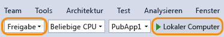

# Analysieren der CPU-Auslastung ohne Debugging
[!INCLUDE[vs2017banner](../code-quality/includes/vs2017banner.md)]

Wenn Sie Leistungsprobleme in Ihrer App untersuchen müssen, ist ein guter Ausgangspunkt die Untersuchung der CPU\-Nutzung. Das Tool **CPU\-Auslastung** Tool zeigt Ihnen, wo die CPU Zeit für die Ausführung von C\+\+\-, C\#\-\/VB\- und JavaScript\-Code verbringt.  
  
 Das Tool "CPU\-Auslastung" kann in Kombination mit anderen Diagnosetools von Visual Studio ausgeführt werden. Siehe [Ausführen von Diagnosetools ohne Debugging](../Topic/Run%20profiling%20tools%20without%20debugging.md).  
  
 Ab Visual Studio 2015 Update 1 können Sie eine Aufteilung nach Funktion der CPU\-Auslastung anzeigen, ohne den Debugger zu verlassen. Sie können die CPU\-Profilerstellung während des Debuggens ein\- und ausschalten und die Ergebnisse anzeigen, wenn die Ausführung angehalten wird, z. B. an einem Haltepunkt. Weitere Informationen finden Sie unter [CPU\-Profilerstellung im Debugger in Visual Studio 2015](http://blogs.msdn.com/b/visualstudioalm/archive/2015/10/29/profile-your-cpu-in-the-debugger-in-visual-studio-2015.aspx).  
  
 Eine exemplarische Vorgehensweise, die die Leistung von Windows Store\-Apps analysiert, finden Sie unter [Analysieren der CPU\-Auslastung in Store\-Apps](https://msdn.microsoft.com/en-us/library/windows/apps/dn641982.aspx).  
  
 Der Hub "Leistung und Diagnose" bietet Ihnen viele weitere Optionen zum Ausführen und Verwalten Ihrer Diagnosesitzung. Sie können z. B. das Tool **CPU\-Auslastung** auf lokalen oder Remotecomputern oder in einem Simulator oder Emulator ausführen. Sie können die Leistung eines geöffneten Projekts in Visual Studio analysieren, eine Verbindung mit einer ausgeführten App herstellen oder eine App starten, die aus dem Windows Store installiert wurde. Weitere Informationen finden Sie unter [Ausführen von Diagnosetools ohne Debugging](../Topic/Run%20profiling%20tools%20without%20debugging.md)  
  
##   Erfassen von CPU\-Auslastungsdaten  
  
1.  Legen Sie in Visual Studio die Konfiguration der Projektmappe auf **Release** fest, und wählen Sie das Bereitstellungsziel.  
  
       
  
    -   Durch das Ausführen der App im**Release**\-Modus erhalten Sie eine bessere Übersicht über die tatsächliche Leistung Ihrer App.  
  
    -   Durch Ausführen der App auf dem lokalen Computer wird die Ausführung der installierten App am besten repliziert.  
  
    -   Wenn Sie Daten von einem Remotegerät sammeln, führen Sie die App direkt auf dem Gerät und nicht über eine Remotedesktopverbindung aus.  
  
    -   Bei Windows Phone\-Apps bietet das Sammeln von Daten direkt auf dem **Gerät** die genauesten Daten.  
  
2.  Wählen Sie im Menü **Debuggen** die Option **Diagnose ohne Debugging starten**.  
  
3.  Wählen Sie **CPU\-Auslastung**, und klicken Sie dann auf **Starten**.  
  
       
  
4.  Klicken Sie nach dem Start der App auf **Maximale Anzahl abrufen**. Warten Sie nach Anzeige der Ausgabe etwa eine Minute, und klicken Sie dann auf **Maximale Anzahl asynchron abrufen**. Das Warten zwischen Schaltflächenklicks vereinfacht das Isolieren der Schaltflächenklickroutinen im Diagnosebericht.  
  
5.  Nachdem die zweite Ausgabezeile angezeigt wird, wählen Sie im Leistungs\- und Diagnosehub **Auflistung beenden** aus.  
  
   
  
 Das CPU\-Auslastungstool analysiert die Daten und zeigt den Bericht an.  
  
   
  
## Analysieren des CPU\-Auslastungsberichts  
  
###   Die Aufrufstruktur der CPU\-Auslastung  
 Um sich mit den Informationen in der Aufrufstruktur vertraut zu machen, wählen Sie zunächst `GetMaxNumberButton_Click` erneut aus, und sehen Sie sich dann die Aufrufstrukturdetails an.  
  
####   Struktur der Aufrufstruktur  
   
  
|||  
|-|-|  
||Der oberste Knoten in CPU\-Auslastungsaufrufstrukturen ist ein Pseudoknoten.|  
||Wenn die Option **Externen Code anzeigen** deaktiviert ist, ist in den meisten Apps der Knoten der zweiten Ebene ein **\[External Code\]**\-Knoten, der den System\- und Frameworkcode enthält, der die App startet und beendet, die Benutzeroberfläche zeichnet, die Threadplanung steuert und andere Dienste der unteren Ebene für die App bereitstellt.|  
||Die untergeordneten Elemente des Knotens der zweiten Ebene sind die Benutzercodemethoden und asynchronen Routinen, die vom System\- und Frameworkcode der zweiten Ebene aufgerufen oder erstellt werden.|  
||Untergeordnete Knoten einer Methode enthalten Daten nur für die Aufrufe der übergeordneten Methode. Wenn **Externen Code anzeigen** deaktiviert ist, können App\-Methoden auch den Knoten **\[Externer Code\]** enthalten.|  
  
####   Externer Code  
 Externer Code umfasst Funktionen in System\- und Frameworkkomponenten, die vom Code ausgeführt werden, den Sie schreiben. Externer Code umfasst Funktionen, die die App starten und beenden, die Benutzeroberfläche zeichnen, das Threading steuern und der App andere hardwarenahe Dienste bereitstellen. In den meisten Fällen sind Sie nicht an externem Code interessiert, weshalb die Aufrufstruktur "CPU\-Auslastung" die externen Funktionen einer Benutzermethode im Knoten **\[Externer Code\]** sammelt.  
  
 Wenn Sie die Aufrufpfade von externem Code anzeigen möchten, wählen Sie aus der Liste **Ansicht filtern** die Option **Externen Code anzeigen** und dann **Übernehmen** aus.  
  
   
  
 Achten Sie darauf, dass viele externe Codeaufrufketten tief verschachtelt sind, sodass die Breite der Spalte mit dem Funktionsnamen die Anzeigebreite aller außer sehr großer Computerbildschirme überschreiten kann. In diesem Fall werden Funktionsnamen als **\[…\]** angezeigt:  
  
   
  
 Verwenden Sie das Suchfeld, um nach einem gewünschten Knoten zu suchen, und verwenden Sie dann die horizontale Bildlaufleiste, um die Daten sichtbar zu machen:  
  
   
  
###   Spalten mit Aufrufstrukturdaten  
  
|||  
|-|-|  
|**Gesamt\-CPU \(%\)**|   Der Prozentsatz der CPU\-Aktivität der App im ausgewählten Zeitraum durch Aufrufe der Funktion und die von der Funktion aufgerufenen Funktionen. Beachten Sie, dass sich dieser Wert vom Zeitachsendiagramm **CPU\-Auslastung** unterscheidet, das die Gesamtaktivität der App in einem Zeitraum mit der insgesamt verfügbaren CPU\-Kapazität vergleicht.|  
|**Eigen\-CPU \(%\)**|   Der Prozentsatz der CPU\-Aktivität der App im ausgewählten Zeitraum durch Aufrufe der Funktion ohne die Aktivität der von der Funktion aufgerufenen Funktionen.|  
|**Gesamt\-CPU \(ms\)**|Die Anzahl der Millisekunden für Aufrufe an die Funktion im ausgewählten Zeitraum und die von der Funktion aufgerufenen Funktionen.|  
|**Eigen\-CPU \(ms\)**|Die Anzahl der Millisekunden für Aufrufe an die Funktion im ausgewählten Zeitraum und die von der Funktion aufgerufenen Funktionen.|  
|**Modul**|Der Name des Moduls mit der Funktion oder die Anzahl der Module, die die Funktionen in einem Knoten vom Typ \[Externer Code\] enthalten.|  
  
###   Asynchrone Funktionen in der Aufrufstruktur der CPU\-Auslastung  
 Wenn der Compiler auf eine asynchrone Methode trifft, erstellt er eine versteckte Klasse zum Steuern der Ausführung der Methode. Grundsätzlich ist die Klasse ein Zustandsautomat mit einer Liste von vom Compiler generierten Funktionen, die Vorgänge der ursprünglichen Methode asynchron aufrufen, und den Rückrufen, dem Scheduler und den Iteratoren, die für diese ordnungsgemäß erforderlich sind. Wenn die ursprüngliche Methode von einer übergeordneten Methode aufgerufen wird, entfernt die Runtime die Methode aus dem Ausführungskontext der übergeordneten Methode und führt die Methode der ausgeblendeten Klasse im Kontext des System\- und Frameworkcodes durch, der die Ausführung der App steuert. Die asynchronen Methoden werden oft, jedoch nicht immer, in einem oder mehreren verschiedenen Threads ausgeführt. Dieser Code wird in der Aufrufstruktur der CPU\-Auslastung als untergeordnete Elemente des Knotens **\[Externer Code\]** direkt unter dem obersten Knoten der Struktur gezeigt.  
  
 Um dies in unserem Beispiel zu sehen, wählen Sie erneut das Segment `GetMaxNumberAsyncButton_Click` in der Zeitachse aus.  
  
   
  
 Die ersten zwei Knoten unter **\[External Code\]** sind die vom Compiler generierten Methoden der Zustandsautomatklasse. Der dritte ist der Aufruf der ursprünglichen Methode. Wenn Sie die generierte Methoden erweitern, sehen Sie, was passiert.  
  
   
  
-   `MainPage::GetMaxNumberAsyncButton_Click` tut sehr wenig: Es verwaltet eine Liste der Aufgabenwerte, berechnet den maximalen Wert der Ergebnisse und zeigt die Ausgabe an.  
  
-   `MainPage+<GetMaxNumberAsyncButton_Click>d__3::MoveNext` zeigt die erforderliche Aktivität zum Planen und Starten der 48 Aufgaben, die den Aufruf von `GetNumberAsync` umschließen.  
  
-   `MainPage::<GetNumberAsync>b__b` zeigt die Aktivität der Aufgaben, die `GetNumber` aufrufen.