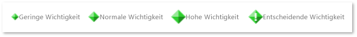

# Flag-Marker
[!INCLUDE[vs2017banner](../code-quality/includes/vs2017banner.md)]

Ein Flagmarker stellt einige dar, das zu einem bestimmten Zeitpunkt in einer App aufgetreten ist.  Ein Flag kann viele Arten Anwendungsereignisse darstellen.  Beispielsweise könnte ein Flag darstellen, wenn eine bestimmte Arbeitsaufgabe geplant wurde, oder als eine Ausnahme ausgelöst wurde.  Laufzeiten wie die Task Parallel Library können auch Flags generieren.  
  
## Flag\-Bedeutung  
 Flags sind in unterschiedlichen Größen je nach deren Bedeutung angezeigt.  Wie jeder Markierung kann die Bedeutung niedrig, normal oder hoch, wichtig sein.  Diese Abbildung wird die Darstellung von Markern durch Wichtigkeitsstufe an:  
  
   
Markierungen, die Flagbedeutung anzeigen  
  
## Flag\-Kategorie  
 Ein Flag ist in eine von fünf unterschiedlichen Farben je nach ihrer Kategorie angezeigt.  Die Farben werden wiederverwendet, wenn mehr als fünf Kategorien gibt.  Sie können die Farbe nicht auswählen.  Wie jeder Markierung kann die Kategorie eine ganze Zahl sein.  Die folgende Abbildung zeigt die Farben für die ersten fünf Kategorien angezeigt.  
  
   
Markierungen, Kategorien anzeigen  
  
## Warnungen  
 Eine Warnung ist eine RED\-farbiges Flag, das ein wichtiges Anwendungsereignis darstellt, wie eine Ausnahme.  Im Folgenden eine Warnung:  
  
   
Ein wachsamer Markierung  
  
## Aggregations\-Flags  
 Manchmal treten Flags auf, das Sie schließen beieinander in der Parallelitätsschnellansicht, dass sie nicht einzeln gezeichnet werden können.  Wenn dies auftritt, wird ein graues *Aggregationsflag*, die das zugrunde liegenden Flags darstellt, angezeigt.  Wenn Sie den Mauszeiger auf einem dieser Symbole zeigen, Anzeigen einer QuickInfo die Zahl des zugrunde liegens von Flags, die dargestellt werden.  Um die Flags anzuzeigen, Vergrößern Sie.  Beim Einchecken ähnlich Vergrößern und dennoch ein Aggregationsflag erhalten, können Sie das zugrunde liegenden Flags im [Markerbericht](../profiling/markers-report.md) anzeigen.  
  
 Aggregationsflags werden in unterschiedlichen Größen gezeichnet.  Die Größe hängt von der Wichtigkeitsstufe der wichtigsten Flags in der Aggregation ab.  Die folgende Abbildung zeigt Aggregationsflags in aufsteigender Reihenfolge von Bedeutung aufgeführt.  
  
   
Aggregationsflags von Ebene von Bedeutung  
  
## Siehe auch  
 [Parallelitätsschnellansichtsmarker](../profiling/concurrency-visualizer-markers.md)   
 [Parallelitätsschnellansichts\-SDK](../profiling/concurrency-visualizer-sdk.md)