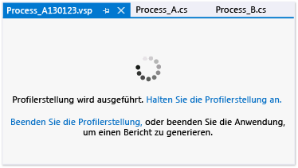

# Gewusst wie: Anhalten und Fortsetzen der Profilerstellung
[!INCLUDE[vs2017banner](../code-quality/includes/vs2017banner.md)]

Im Fenster der Profilerstellungs\-Sitzungsseite können Sie die Erfassung der Profilerstellungsdaten interaktiv steuern.  
  
 Durch Steuerung der Datensammlung können Sie die Größe der Profildatendatei reduzieren sowie Daten nur für relevante Vorgänge sammeln.  Sie können die Profilerstellung in einer Leistungssitzung mehrmals anhalten und fortsetzen.  
  
   
  
> [!NOTE]
>  Sie können die Leistungssitzung auch mit angehaltener Profilerstellung starten und die Profilaustellung zu einem späteren Zeitpunkt in der Programmausführung fortsetzen.  Wählen Sie zum Starten der Leistungssitzung bei angehaltener Profilerstellung im Menü **Debuggen** den Befehl **Leistungsanalyse mit angehaltener Profilerstellung starten** aus.  
  
### So können Sie die Profilerstellung anhalten, fortsetzen oder beenden  
  
-   Gehen Sie auf der Profilerstellungs\-Sitzungsseite folgendermaßen vor:  
  
    -   Wählen **Auflistung anhalten**, um die Datensammlung anzuhalten.  
  
    -   Wählen **Auflistung wiederaufnehmen**, um die Datensammlung neu zu starten, nachdem sie angehalten wurde.  
  
    -   Wählen **Profilerstellung beenden**, um die Profilerstellungssitzung zu beenden und Berichte zu generieren.  
  
## Siehe auch  
 [Steuern der Datensammlung](../profiling/controlling-data-collection.md)   
 [Gewusst wie: Starten und Beenden der Profilerstellung](../profiling/how-to-start-and-end-performance-data-collection.md)