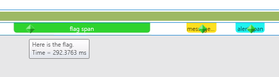
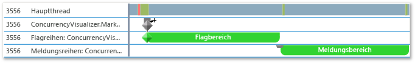
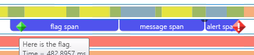
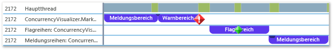

# <a name="how-to-use-the-concurrency-visualizer-markers-sdk"></a>Vorgehensweise: Verwenden der SDK-Parallelitätsschnellansichtsmarker
Dieses Thema veranschaulicht, wie SDK-Parallelitätsschnellansichtsmarker verwendet werden, um Spannen zu erstellen und Flags, Nachrichten und Warnungen zu schreiben.  
  
### <a name="to-use-c"></a>C++ verwenden  
  
1.  Fügen Sie die Unterstützung mit SDK-Parallelitätsschnellansichtsmarker zu Ihrer Anwendung hinzu. Weitere Informationen finden Sie unter [Parallelitätsschnellansichts-SDK](../profiling/concurrency-visualizer-sdk.md).  
  
2.  Fügen Sie eine `include` und `using`-Anweisung für das SDK hinzu.  
  
    ```C++  
  
    #include <cvmarkersobj.h>  
    using namespace Concurrency::diagnostic;  
  
    ```  
  
3.  Fügen Sie den Code hinzu, um drei Spannen in der Standardmarkerreihe zu erstellen und eine Flag, eine Nachricht und eine Warnung für jede Spanne zu schreiben. Die Methoden zum Schreiben von Flags, Nachrichten und Warnungen sind Mitglieder der [marker_series](../profiling/marker-series-class.md)-Klasse. Der Konstruktor für die [span](../profiling/span-class.md)-Klasse erfordert ein `marker_series`-Objekt, sodass jede Spanne einer bestimmten Markerreihe zugeordnet ist. Ein `span` endet, wenn er gelöscht wird.  
  
    ```C++  
  
    marker_series series;  
    span *flagSpan = new span(series, 1, _T("flag span"));  
    series.write_flag(_T("Here is the flag."));  
    delete flagSpan;  
  
    span *messageSpan = new span(series, 2, _T("message span"));  
    series.write_flag(_T("Here is the message."));  
    delete messageSpan;  
  
    span *alertSpan = new span(series, 3, _T("alert span"));  
    series.write_flag(_T("Here is the alert."));  
    delete alertSpan;  
  
    ```  
  
4.  Wählen Sie auf der Menüleiste **Analysieren**, **Parallelitätsschnellansicht**, **Mit dem aktuellen Projekt beginnen**aus, um die Anwendung auszuführen und die Parallelitätsschnellansicht anzuzeigen. Die folgende Abbildung zeigt die drei Spannen und drei Marker in der Parallelitätsschnellansicht.  
  
       
  
5.  Fügen Sie den Code hinzu, um zusätzliche, benutzerdefinierte Markerreihen zu erstellen, indem der Konstruktor für `marker_series` aufgerufen wird, der einen Zeichenfolgennamen für die Markerreihe annimmt.  
  
    ```C++  
  
    marker_series flagSeries(_T("flag series"));  
    span *flagSeriesSpan = new span(flagSeries, 1, _T("flag span"));  
    flagSeries.write_flag(1, _T("flag"));  
    // Sleep to even out the display in the Concurrency Visualizer.  
    Sleep(50);  
    delete flagSeriesSpan;  
  
    marker_series messageSeries(_T("message series"));  
    span *messageSeriesSpan = new span(messageSeries, 1, _T("message span"));  
    messageSeries.write_message(1, _T("message"));  
    // Sleep to even out the display in the Concurrency Visualizer.  
    Sleep(50);  
    delete messageSeriesSpan;  
  
    ```  
  
6.  Starten Sie das aktuelle Projekt, um die Parallelitätsschnellansicht anzuzeigen. Die zwei Markerreihen werden in ihren eigenen Bereichen in der Threadansicht angezeigt. In der folgenden Abbildung werden die zwei neuen Spannen gezeigt.  
  
       
  
### <a name="to-use-visual-basic-or-c"></a>So verwenden Sie Visual Basic oder C# #
  
1.  Fügen Sie die Unterstützung mit SDK-Parallelitätsschnellansichtsmarker zu Ihrer Anwendung hinzu. Weitere Informationen finden Sie unter [Parallelitätsschnellansichts-SDK](../profiling/concurrency-visualizer-sdk.md).  
  
2.  Fügen Sie eine `using` oder `Imports`-Anweisung für das SDK hinzu.  
  
    ```VB  
    Imports Microsoft.ConcurrencyVisualizer.Instrumentation  
  
    ```  
  
    ```csharp  
    using Microsoft.ConcurrencyVisualizer.Instrumentation;  
    ```  
  
3.  Fügen Sie den Code hinzu, um drei Spannen für die Standardmarkerreihe zu erstellen und eine Flag, eine Nachricht und eine Warnung für jede Spanne zu schreiben. Sie erstellen ein <xref:Microsoft.ConcurrencyVisualizer.Instrumentation.Span>-Objekt, indem Sie die statische `EnterSpan`-Methode aufrufen. Um in die Standardreihe zu schreiben, verwenden Sie die statischen Methoden zum Schreiben der <xref:Microsoft.ConcurrencyVisualizer.Instrumentation.Markers>-Klasse.  
  
    ```VB  
  
    Dim flagSpan As Span = Markers.EnterSpan("flag span")  
    Markers.WriteFlag("Here is the flag.")  
    flagSpan.Leave()  
  
    Dim messageSpan As Span = Markers.EnterSpan("message span")  
    ' Sleep for a millisecond to even out the display in the Concurrency Visualizer.  
    System.Threading.Thread.Sleep(1)  
    Markers.WriteMessage("Here is a message")  
    messageSpan.Leave()  
  
    Dim alertSpan As Span = Markers.EnterSpan("alert span")  
    ' Sleep for a millisecond to even out the display in the Concurrency Visualizer.  
    System.Threading.Thread.Sleep(1)  
    Markers.WriteAlert("Here is an alert")  
    alertSpan.Leave()  
  
    ```  
  
    ```csharp  
  
    Span flagSpan = Markers.EnterSpan("flag span");  
    Markers.WriteFlag("Here is the flag.");  
    flagSpan.Leave();  
  
    Span messageSpan = Markers.EnterSpan("message span");  
    // Sleep for a millisecond to even out the display in the Concurrency Visualizer.  
    System.Threading.Thread.Sleep(1);  
    Markers.WriteMessage("Here is a message");  
    messageSpan.Leave();  
  
    Span alertSpan = Markers.EnterSpan("alert span");  
    // Sleep for a millisecond to even out the display in the Concurrency Visualizer.  
    System.Threading.Thread.Sleep(1);  
    Markers.WriteAlert("Here is an alert");  
    alertSpan.Leave();  
    ```  
  
4.  Wählen Sie auf der Menüleiste **Analysieren**, **Parallelitätsschnellansicht**, **Mit dem aktuellen Projekt beginnen**aus, um die Anwendung auszuführen und die Parallelitätsschnellansicht anzuzeigen. Die folgende Abbildung zeigt die drei Spannen und drei Marker in der Threadansicht der Parallelitätsschnellansicht.  
  
       
  
5.  Fügen Sie Code hinzu, um benutzerdefinierte Markerreihen mithilfe der statischen <xref:Microsoft.ConcurrencyVisualizer.Instrumentation.Markers.CreateMarkerSeries%2A>-Methode zu erstellen. Die <xref:Microsoft.ConcurrencyVisualizer.Instrumentation.MarkerSeries>-Klasse enthält Methoden zum Erstellen von Spannen und zum Schreiben von Flags, Meldungen und Warnungen.  
  
    ```VB  
  
    Dim flagSeries As MarkerSeries = Markers.DefaultWriter.CreateMarkerSeries("flag series")  
    Dim flagSeriesSpan As Span = flagSeries.EnterSpan("flag span")  
    System.Threading.Thread.Sleep(1)  
    flagSeries.WriteFlag(1, "flag")  
    System.Threading.Thread.Sleep(1)  
    flagSeriesSpan.Leave()  
  
    Dim messageSeries As MarkerSeries = Markers.DefaultWriter.CreateMarkerSeries("message series")  
    Dim messageSeriesSpan As Span = messageSeries.EnterSpan("message span")  
    messageSeries.WriteMessage("message")  
    System.Threading.Thread.Sleep(1)  
    messageSeriesSpan.Leave()  
    ```  
  
    ```csharp  
  
    MarkerSeries flagSeries = Markers.DefaultWriter.CreateMarkerSeries("flag series");  
    Span flagSeriesSpan = flagSeries.EnterSpan("flag span");  
    System.Threading.Thread.Sleep(1);  
    flagSeries.WriteFlag(1, "flag");  
    System.Threading.Thread.Sleep(1);  
    flagSeriesSpan.Leave();  
  
    MarkerSeries messageSeries = Markers.DefaultWriter.CreateMarkerSeries("message series");  
    Span messageSeriesSpan = messageSeries.EnterSpan("message span");  
    messageSeries.WriteMessage("message");  
    System.Threading.Thread.Sleep(1);  
    messageSeriesSpan.Leave();  
    ```  
  
6.  Starten Sie das aktuelle Projekt, um die Parallelitätsschnellansicht anzuzeigen. Die drei Markerreihen werden in ihren eigenen Bereichen in der Threadansicht angezeigt. Die folgende Abbildung zeigt die drei neuen Spannen.  
  
       
  
## <a name="see-also"></a>Siehe auch  
 [SDK der Nebenläufigkeitsschnellansicht](../profiling/concurrency-visualizer-sdk.md)
