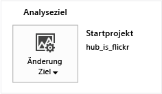
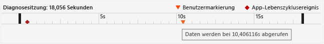
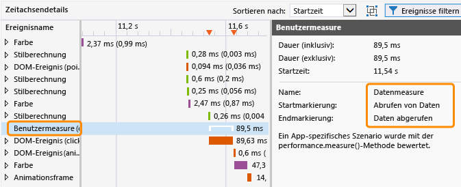
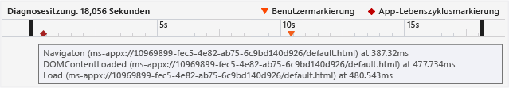
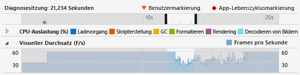
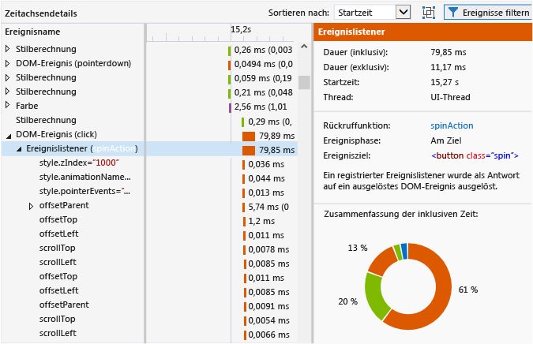
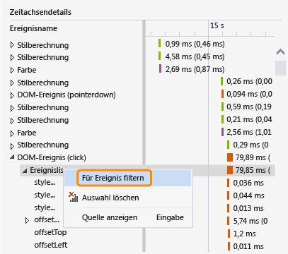
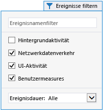
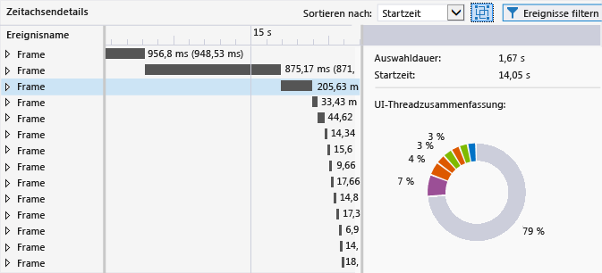

# <a name="analyze-html-ui-responsiveness-in-universal-windows-apps"></a>Analysieren der HTML-UI-Reaktionsfähigkeit in UWP-Apps
In diesem Thema wird das Isolieren von Leistungsproblemen in Ihren Apps mithilfe des Benutzeroberflächen-Reaktionsfähigkeits-Profilers beschrieben, einem Leistungstool für universelle Windows-Apps.  
  
 Mit dem Benutzeroberflächen-Reaktionsfähigkeits-Profiler können Sie Probleme mit der Reaktionsfähigkeit der Benutzeroberfläche oder Plattformnebeneffekte isolieren, die normalerweise mit den folgenden Symptomen auftreten:  
  
-   Fehlende Reaktionsfähigkeit in der Benutzeroberfläche. Die Anwendung reagiert möglicherweise langsam, wenn der UI-Thread blockiert wird. Einige Aufgaben können den UI-Thread blockieren, z. B. übermäßiger synchroner JavaScript-Code, übermäßige Belastung für CSS-Layouts oder CSS-Berechnung, synchrone XHR-Anforderungen, Garbage Collection, übermäßige Paint-Zeiten oder prozessorintensiver JavaScript-Code.  
  
-   Langsame Ladezeit für die App oder für eine Seite. Dies wird normalerweise durch die zu lange Ressourcenladezeit verursacht.  
  
-   Visuelle Updates, die seltener sind als erwartet. Dies tritt auf, wenn der UI-Thread ausgelastet ist, damit eine angemessene Framerate beibehalten wird. Frames könnten z. B. abgelegt werden, wenn der UI-Thread ausgelastet ist. Einige von UI-Threads unabhängige Aufgaben können auch die Häufigkeit von visuellen Updates einschränken, z. B. Netzwerkanforderungen, Decodierung von Images und Paint-Ereignisse. (Nicht alle Paint-Ereignisse werden im UI-Thread ausgeführt).  
  
##  <a name="RunningProfiler"></a> Ausführen des Tools für die Reaktionsfähigkeit der HTML-Benutzeroberfläche  
 Sie können das Tool für die Reaktionsfähigkeit der HTML-Benutzeroberfläche verwenden, wenn Sie eine funktionierende universelle Windows-App oder Windows Store-App in Visual Studio geöffnet oder auf einem Computer installiert haben, auf dem Windows 8 oder höher ausgeführt wird.  
  
1.  Wenn Sie die App aus Visual Studio heraus ausführen, wählen Sie auf der Symbolleiste **Standard** in der Dropdownliste **Debugging starten** ein Bereitstellungsziel aus, z. B. einen der Windows Phone-Emulatoren, **Lokaler Computer**, **Simulator**oder **Remotecomputer**.  
  
2.  Klicken Sie im Menü **Debuggen** auf **Leistungsprofiler…**.  
  
     Wenn Sie das Ziel der Analyse ändern möchten, wählen Sie**Ziel ändern**aus.  
  
       
  
     Folgende Optionen sind für das Analyseziel verfügbar:  
  
    -   **Startprojekt**. Wählen Sie diese Option aus, um das aktuelle Startprojekt zu analysieren. Wenn Sie die Anwendung auf einem Remotecomputer oder -gerät ausführen, müssen Sie diese Einstellung verwenden, die der Standardwert ist.  
  
    -   **Ausgeführte App**. Wählen Sie diese Option aus, um eine Windows Store-App aus einer Liste von ausgeführten Apps auszuwählen. Diese Option können Sie nicht verwenden, wenn Sie die App auf einem Remotecomputer oder -gerät ausführen.  
  
         Sie können diese Option zum Analysieren der Leistung von Apps verwenden, die auf Ihrem Computer ausgeführt werden, wenn Sie keinen Zugriff auf den Quellcode haben.  
  
    -   **Installierte App**. Verwenden Sie diese Option, um eine installierte App auszuwählen, die Sie analysieren möchten. Diese Option können Sie nicht verwenden, wenn Sie die App auf einem Remotecomputer oder -gerät ausführen.  
  
         Sie können diese Option zum Analysieren der Leistung von Apps verwenden, die auf Ihrem Computer installiert sind, wenn Sie keinen Zugriff auf den Quellcode haben. Diese Option kann auch nützlich sein, um die Leistung einer App außerhalb der eigenen App-Entwicklung zu analysieren.  
  
3.  Wählen Sie unter **Verfügbare Tools**das Tool **HTML-UI-Reaktionsfähigkeit**aus, und wählen Sie dann **Starten**aus.  
  
4.  Wenn Sie den Benutzeroberflächen-Reaktionsfähigkeits-Profiler starten, werden Sie im Fenster „Benutzerkontensteuerungsfenster“ eventuell aufgefordert, die Berechtigung zur Ausführung von Visual Studio ETW Collector.exe anzugeben. Klicken Sie auf **Ja**.  
  
     Interagieren mit der App, um das relevante Leistungsszenario zu testen. Einen ausführlichen Workflow finden Sie unter [Isolieren eines Problems mit der Reaktionsfähigkeit der Benutzeroberfläche](#Workflow) und [Isolate a visual throughput problem](#IsolateVisualThroughput).  
  
5.  Wechseln Sie mittels der Tastenkombination ALT+TAB zu Visual Studio.  
  
6.  Um die Profilerstellung für die App zu beenden und vom Profiler erfasste Daten anzuzeigen, wählen Sie **Auflistung beenden**aus.  
  
##  <a name="IsolateAnIssue"></a> Isolieren eines Problems  
 Im folgenden Abschnitt sind Vorschläge enthalten, die Ihnen beim Isolieren von Leistungsproblemen helfen sollen. Eine schrittweise Erklärung der Vorgehensweise zum Identifizieren und Beheben von Leistungsproblemen mithilfe einer Beispiel-App für Leistungstests finden Sie unter [Exemplarische Vorgehensweise: Verbesserung der Reaktionsfähigkeit der Benutzeroberfläche (HTML)](../profiling/walkthrough-improving-ui-responsiveness-html.md).  
  
###  <a name="Workflow"></a> Isolieren eines Problems mit der Reaktionsfähigkeit der Benutzeroberfläche  
 In den folgenden Schritten wird ein Workflow vorgeschlagen, mit dem Sie den Benutzeroberflächen-Reaktionsfähigkeits-Profiler effektiver verwenden können:  
  
1.  Öffnen Sie die App in Visual Studio.  
  
2.  Testen Sie die App auf Probleme mit der Reaktionsfähigkeit der Benutzeroberfläche. (Drücken Sie STRG+F5, um die App zu starten ohne sie zu debuggen.)  
  
     Wenn ein Problem auftritt, setzen Sie das Testen fort und versuchen Sie, den Zeitrahmen, in dem das Problem auftritt einzugrenzen, oder versuchen Sie, mögliche Auslöser zu identifizieren, die zu dem Verhalten führen.  
  
3.  Wechseln Sie zu Visual Studio (drücken Sie ALT+TAB), und beenden Sie die App (UMSCHALT+F5).  
  
4.  Optional können Sie dem Code mit [Markieren von Code zur Analyse](#ProfileMark).  
  
    > [!TIP]
    >  Benutzermarkierungen können das Identifizieren eines Problems mit der Reaktionsfähigkeit während der Anzeige der Profilerdaten erleichtern. Sie können z. B. am Anfang und Ende eines Codeabschnitts, der ein Reaktionsfähigkeitsproblem verursacht, eine Benutzermarkierung hinzufügen.  
  
5.  Führen Sie den Benutzeroberflächen-Reaktionsfähigkeits-Profiler aus, indem Sie den Anweisungen im vorherigen Abschnitt folgen.  
  
6.  Dies setzt die App in den Zustand, der zu einem Problem mit der Reaktionsfähigkeit der Benutzeroberfläche führt.  
  
7.  Wechseln Sie zu Visual Studio (drücken Sie ALT+TAB), wählen Sie **Auflistung beenden** auf der Profiler-Registerkarte des Benutzeroberflächen-Reaktionsfähigkeits-Profilers aus.  
  
8.  Wenn Sie Benutzermarkierungen hinzugefügt haben, werden diese in der [Anzeigen einer Zeitachse für die Diagnosesitzung](#Ruler) des Profilers angezeigt. Die folgende Abbildung zeigt eine einzelne Benutzermarkierung, die verwendet wird, um einen bestimmten Vorgang im Code anzugeben.  
  
       
  
9. Identifizieren Sie einen relevanten Bereich auf der Zeitachse und in den Profilerdiagrammen, indem Sie Benutzermarkierungen, App-Lebenszyklusereignisse oder die in den Diagrammen angezeigten Daten verwenden. Es folgen einige Richtlinien als Hilfestellung bei der Analyse und Verwendung der Diagrammdaten:  
  
    -   Verwenden Sie die [Anzeigen einer Zeitachse für die Diagnosesitzung](#Ruler) , um [Markieren von Code zur Analyse](#ProfileMark), App-Lebenszyklusereignisse und die zugeordnete Zeitachse für diese Ereignisse sowie die Zeitachse für Daten in den anderen Diagramme anzuzeigen.  
  
    -   Mit dem [CPU utilization graph](#CPUutilization) können Sie allgemeine Informationen zu CPU-Aktivität und den Typ der Arbeit anzeigen, die in einem bestimmten Zeitraum behandelt wird. Zeiträume übermäßiger CPU-Aktivität führen viel wahrscheinlicher zu Reaktionsfähigkeitsproblemen und abfallende Frames.  
  
    -   Wenn Sie ein Spiel oder eine Rich-Media-App entwickeln, verwenden Sie das [Anzeigen des visuellen Durchsatzes (FPS)](#VisualThroughput) , um Zeiträume zu identifizieren, in denen die Framerate abfiel.  
  
10. Wählen Sie in einem der Diagramme den relevanten Bereich aus, indem Sie auf einen Teil des Diagramms klicken und den Mauszeiger ziehen (oder mit der TABTASTE und den PFEILTASTEN). Wenn Sie einen Zeitraum auswählen, indem Sie eine Auswahl treffen, ändert sich das Zeitachsendetaildiagramm im unteren Bereich des Profilers, um nur den ausgewählten Zeitraum anzuzeigen.  
  
     In der folgenden Abbildung wird das CPU-Auslastungsdiagramm mit hervorgehobenem relevanten Bereich dargestellt.  
  
       
  
11. Verwenden Sie die [Anzeigen des Zeitachsendetaildiagramms](#TimelineDetails) , um ausführliche Informationen über Ereignisse abzurufen, die entweder zu häufig ausgeführt werden oder zu viel Zeit in Anspruch nehmen. Suchen Sie z. B. nach Folgendem:  
  
    -   Ereignislistener, Timer und Animationsframerückrufe. Abhängig vom angegebenen Ereignis können die bereitgestellten Daten IDs von geänderten DOM-Elementen, Namen von geänderten CSS-Eigenschaften, einen Link zum Speicherort der Quelle und den Namen der dazugehörigen Ereignis- oder Rückruffunktion enthalten.  
  
    -   Layout oder Skripterstellungsereignisse, die zum Rendern von Elementen führen, z. B. Aufrufe von `window.getComputedStyles`. Das dazugehörige DOM-Element für das Ereignis wird bereitgestellt.  
  
    -   Seiten oder URL-Ressourcen, die von der App geladen werden, z. B. Skriptauswertungen für HTML-Analyseereignisse. Der Dateiname oder die Ressource wird bereitgestellt.  
  
    -   Andere in der [Profiler event reference](#ProfilerEvents)angegebene Ereignisse.  
  
    > [!TIP]
    >  Die nützlichsten Informationen im Profiler werden im Zeitachsendetaildiagramm angezeigt.  
  
12. Wenn ein Bereich im Diagramm der CPU-Auslastung oder im Diagramm des visuellen Durchsatzes (FPS) ausgewählt ist, wählen Sie **Vergrößern** aus (entweder die Schaltfläche oder das Kontextmenü), um ausführlichere Informationen abzurufen. Die Zeitachse für das Diagramm ändert sich und zeigt nur den ausgewählten Zeitraum an.  
  
13. Wenn das Diagramm vergrößert ist, wählen Sie einen Teil des Diagramms für die CPU-Auslastung oder des Diagramms für den visuellen Durchsatz aus. Wenn Sie eine Auswahl treffen, ändert sich das Zeitachsendetaildiagramm im unteren Bereich des Profilers und zeigt nur den ausgewählten Zeitraum an.  
  
###  <a name="IsolateVisualThroughput"></a> Isolate a visual throughput problem  
 Zeiten übermäßiger CPU-Auslastung können zu niedrigen oder ungleichmäßigen Frameraten führen. Wenn Sie Rich-Media-Apps und Spiele entwickeln, stellt das visuelle Durchsatzdiagramm eventuell wichtigere Daten als das CPU-Auslastungsdiagramm bereit.  
  
 Um ein visuelles Durchsatzproblem zu isolieren, führen Sie die im vorherigen Abschnitt beschriebenen Schritte aus, doch verwenden Sie das visuelle Durchsatzdiagramm als einen der Hauptdatenpunkte.  
  
###  <a name="ProfileMark"></a> Markieren von Code zur Analyse  
 Um einen Abschnitt eines App-Codes zu isolieren, dem Daten zugeordnet sind, die im Diagramm angezeigt werden, können Sie in der App einen Funktionsaufruf hinzufügen, mit dem der Profiler angewiesen wird, eine Benutzermarkierung (ein invertiertes Dreieck) an dem Zeitpunkt in der Zeitachse einzufügen, an dem die Funktion ausgeführt wird. Jede Benutzermarkierung, die Sie hinzufügen, wird in der Zeitachse im CPU-Auslastungsdiagramm, im Diagramm des visuellen Durchsatzes und im Zeitachsendetaildiagramm angezeigt.  
  
 Um eine Benutzermarkierung hinzuzufügen, fügen Sie der App den folgenden Code hinzu: In diesem Beispiel wird "Abrufen von Daten" als die Beschreibung des Ereignisses verwendet.  
  
```javascript  
if (performance && performance.mark) {  
    performance.mark("getting data");  
}  
  
```  
  
 Die Beschreibung des Ereignisses wird als QuickInfo angezeigt, wenn Sie den Mauszeiger über die Benutzermarkierung bewegen. Sie können so viele Benutzermarkierungen hinzufügen wie erforderlich.  
  
> [!NOTE]
>  `console.timeStamp`, ein Chrome-Befehl, wird ebenfalls als Benutzermarkierung angezeigt.  
  
 Die folgende Abbildung zeigt das Diagnoselineal mit einer einzelnen Benutzermarkierung und der QuickInfo an.  
  
   
  
 Sie können auch toolgenerierte Ereignisse in der Zeitachsendetailansicht erstellen, um die Dauer darzustellen, die zwischen zwei Benutzermarkierungen vergeht. Der folgende Code fügt eine zweite Benutzermarkierung sowie ein Maß der Zeit hinzu, die zwischen der Ausführung der zwei Benutzermarkierungen vergeht (der voranstehende Code zeigt die erste Benutzermarkierung an).  
  
```javascript  
if (performance.mark && performance.measure) {  
    performance.mark("data retrieved");  
    performance.measure("data measure", "getting data", "data retrieved");  
}  
```  
  
 Wenn die zweite Benutzermarkierung nicht angegeben ist, verwendet `performance.measure` einen Zeitstempel als zweite Benutzermarkierung. Die erste Benutzermarkierung ist erforderlich.  
  
 Die Dauermessung wird als **Benutzermaß** -Ereignis in der Zeitachsendetailansicht angezeigt und stellt detaillierte Informationen dar, wenn sie ausgewählt wird.  
  
   
  
##  <a name="AnalyzeData"></a> Analysieren von Daten  
 In den folgenden Abschnitten sind Informationen enthalten, die Ihnen das Interpretieren der im Profiler angezeigten Daten erleichtern sollen.  
  
###  <a name="Ruler"></a> Anzeigen einer Zeitachse für die Diagnosesitzung  
 Das Lineal am Anfang des Profilers zeigt die Zeitachse für profilierte Informationen an. Diese Zeitachse gilt sowohl für das Diagramm zur CPU-Auslastung als auch für das Diagramm zum visuellen Durchsatz.  
  
 Die Zeitachse für die Diagnosesitzung sieht wie folgt aus. Außerdem wird eine QuickInfo für mehrere Ereignisse des App-Lebenszyklus anzeigt:  
  
   
  
 Die Zeitachse wird angezeigt, wenn App-Lebenszyklusereignisse wie z. B. das Aktivierungsereignis auftreten. Es werden Benutzermarkierungen (Benutzermarkierungsdreiecke) angezeigt, die Sie dem Code hinzufügen können. Sie können die Ereignisse auswählen, um QuickInfos mit weiteren Informationen anzuzeigen. Weitere Informationen über Benutzermarkierungen finden Sie unter [Markieren von Code zur Analyse](#ProfileMark) in diesem Thema.  
  
 App-Lebenszyklusereignisse werden als Diamantsymbole angezeigt. Es handelt sich um DOM-Ereignisse, beispielsweise:  
  
-   `DOMContentLoaded` -Ereignisse und `Load` -Ereignisse, die normalerweise im aktivierten Ereignishandler im Code auftreten. In einer QuickInfo für das Ereignis werden das Ereignis und die URL angezeigt.  
  
-   Ein Navigationsereignis, das auftritt, wenn Sie zu einer anderen Seite navigieren. In einer QuickInfo für das Ereignis wird die URL der Zielseite angezeigt.  
  
###  <a name="CPUUtilization"></a> Anzeigen der CPU-Auslastung  
 Das Diagramm der CPU-Auslastung ermöglicht das Identifizieren von Zeiträumen mit übermäßiger CPU-Aktivität. Es stellt Informationen über die durchschnittliche CPU-Auslastung der App über einen bestimmten Zeitraum dar. Die Informationen sind farbcodiert, um die folgenden spezifischen Kategorien darzustellen: **Laden**, **Skripterstellung**, Garbage Collection (**GC**), **Format**, **Rendern**und **Bilddekodierung**. Weitere Informationen über diese Kategorien finden Sie unter [Profiler event reference](#ProfilerEvents) in diesem Thema.  
  
 Im CPU-Auslastungsdiagramm wird die Zeit angezeigt, die auf allen App-Threads aufgewendet wird. Dabei werden die CPU-Auslastungs-Werte für eine oder mehrere CPUs in einem einzelnen Prozentwert zusammengefasst. Der CPU-Auslastungswert überschreitet möglicherweise 100 Prozent, wenn mehr als eine CPU verwendet wird.  
  
> [!NOTE]
>  Die GPU-Auslastung wird nicht im Diagramm angezeigt.  
  
 In diesem Beispiel wird das Diagramm der CPU-Auslastung illustriert:  
  
   
  
 Verwendungszwecke für dieses Diagramm:  
  
-   Identifizieren allgemeiner Interessenbereiche.  
  
-   Auswählen eines bestimmten Zeitraums für die Anzeige des Zeitachsendetaildiagramms. Markieren Sie einen Teil des Diagramms, und ziehen Sie den Mauszeiger, um einen Zeitraum auszuwählen.  
  
-   Sie erhalten eine ausführlichere Ansicht eines ausgewählten Zeitraums, indem Sie die Schaltfläche **Vergrößern** auswählen.  
  
 Weitere Informationen zur Verwendung des Diagramms finden Sie unter [Isolate a UI responsiveness problem](#Workflow) in diesem Thema.  
  
###  <a name="VisualThroughput"></a> Anzeigen des visuellen Durchsatzes (FPS)  
 Das Diagramm des visuellen Durchsatzes ermöglicht das Identifizieren von Zeiträumen, in denen die Framerate abgefallen ist. Es zeigt die Frames pro Sekunde (FPS) für die App an. Dieses Diagramm ist für die Entwicklung von Spielen und von Rich-Media-Apps besonders hilfreich.  
  
 Der angezeigte F/s-Wert kann sich von den tatsächlichen Frameraten unterscheiden. Behalten Sie die folgenden Informationen im Kopf, wenn Sie Daten in diesem Diagramm untersuchen:  
  
-   Das Diagramm zeigt den F/s-Wert an, den die App zu jedem Zeitpunkt erreichen kann. Wenn sich die Anwendung im Leerlauf befindet, ist der F/s-Wert identisch mit der Bildschirmaktualisierungsrate.  
  
-   Im Diagramm wird der tatsächliche F/s-Wert angezeigt, wenn die App Aufgaben ausführt, für die visuelle Updates erforderlich sind.  
  
-   Das Diagramm zeigt den Wert Null an, wenn Frames abgelegt werden.  
  
 In diesem Beispiel wird das Diagramm für den visuellen Durchsatz illustriert:  
  
   
  
 Verwendungszweck des Diagramms für den visuellen Durchsatz:  
  
-   Identifizieren allgemeiner Interessenbereiche.  
  
-   Auswählen eines bestimmten Zeitraums für die Anzeige des Zeitachsendetaildiagramms. Markieren Sie einen Teil des Diagramms, und ziehen Sie den Mauszeiger, um einen Zeitraum auszuwählen.  
  
-   Sie erhalten eine ausführlichere Ansicht eines ausgewählten Zeitraums, indem Sie die Schaltfläche **Vergrößern** auswählen.  
  
###  <a name="TimelineDetails"></a> Anzeigen des Zeitachsendetaildiagramms  
 Das Zeitachsendetaildiagramm wird im unteren Bereich des Benutzeroberflächen-Reaktionsfähigkeits-Profilers angezeigt. Es stellt sequenzielle und hierarchische Informationen über Ereignisse bereit, die während ausgewählter Zeiträume die meiste CPU-Zeit in Anspruch genommen haben. Mit diesem Diagramm können Sie bestimmen, wodurch ein bestimmtes Ereignis ausgelöst wurde, und für einige Ereignisse erkennen, wie das Ereignis wieder dem Quellcode zugeordnet wird. Mit diesem Diagramm können Sie auch die Zeit zu bestimmen, die für das Paint-Ereignis visueller Updates auf den Bildschirm erforderlich ist.  
  
 Im Diagramm werden die Aufgaben des UI-Threads und die Aufgaben an Hintergrundthreads angezeigt, die langsame visuelle Aktualisierungen verursachen können. Im Diagramm werden folgende Aspekte nicht angezeigt: Just-In-Time-Aufgaben in JavaScript, asynchrone GPU-Aufgaben, Aufgaben, die außerhalb des Hostprozesses ausgeführt werden (wie RuntimeBroker.exe- und dwm.exe-Aufgaben) oder Aufgaben für Bereiche der Windows Runtime, die noch nicht für die Profilerstellung instrumentiert wurden (wie Datenträger-E/A).  
  
> [!TIP]
>  Wenn ein Ereignis in einem Hintergrundthread auftritt, wird die Thread-ID in Klammern neben dem Ereignisnamen angezeigt.  
  
 Dieses Beispiel zeigt, wie das Zeitachsendetaildiagramm aussieht, wenn der Ereignislistener für ein DOM-Klickereignis ausgewählt wird:  
  
   
  
 In dieser Abbildung ist der **spinAction** -Ereignishandler in der Spalte **Ereignisname** ein Link, der Sie zum Ereignishandler im Quellcode führt, wenn er ausgewählt wird. Im Bereich rechts stellt die Eigenschaft **Rückruffunktion** denselben Link zum Quellcode bereit. Weitere Eigenschaften stellen auch Informationen zum Ereignis, wie das zugehörige DOM-Element, bereit.  
  
 Wenn ein Teil der Zeitachse für das Diagramm der CPU-Auslastung und das Diagramm des visuellen Durchsatzes (FPS) ausgewählt ist, zeigt das Zeitachsendetaildiagramm ausführliche Informationen für den ausgewählten Zeitraum an.  
  
 Die Ereignisse im Zeitachsendetaildiagramm sind farbcodiert und stellen dieselben Kategorien von Aufgaben dar, die im CPU-Auslastungsdiagramm angezeigt werden. Weitere Informationen über die Ereigniskategorien und die spezifischen Ereignisse finden Sie unter [Profiler event reference](#ProfilerEvents) in diesem Thema.  
  
 Verwendungszwecke des Zeitachsendetaildiagramms:  
  
-   Anzeigen der ungefähren Start-, Dauer- und Beendigungszeit für ein Ereignis in einer Zeitachsen- und Rasteransicht. Im Zeitachsendetaildiagramm können je nach Zoomzustand Zeiträume von 30 Millisekunden bis zu 30 Sekunden in der Rasteransicht angezeigt werden. Für Dauerwerte:  
  
    -   Inklusive Zeiten stellen die Dauer des Ereignisses einschließlich der untergeordneten Elemente des Ereignisses dar. In der Rasteransicht wird dieser Wert zuerst angezeigt.  
  
    -   Exklusive Zeiten stellen die Dauer des Ereignisses ohne die untergeordneten Elemente des Ereignisses dar. In der Rasteransicht wird dieser Wert in Klammern angezeigt.  
  
-   Erweitern Sie ein Ereignis in der Hierarchie, um untergeordnete Elemente des Ereignisses anzuzeigen. Die untergeordneten Elemente des Ereignisses sind andere Ereignisse, die vom übergeordneten Ereignis ausgelöst werden. Beispielsweise kann ein DOM-Ereignis Ereignislistener enthalten, die als untergeordnete Elemente angezeigt werden. Ein Ereignislistener kann andere Ereignisse enthalten, die sich daraus ergeben, z. B. ein Layoutereignis.  
  
-   Sortieren Sie Ereignisse nach Startzeit (Standard) oder Dauer. In der Liste **Sortieren nach** können Sie eine Sortiermethode auswählen.  
  
-   Zeigen Sie Details für jedes Ereignis im Detailbereich an (rechter Bereich). Die Eigenschaften variieren je nach Ereignis, wie für diese Beispiele:  
  
    -   Für Zeitgeber, Ereignislistener (DOM-Ereignisse) und Animationsframerückrufe stellt die Eigenschaft **Rückruffunktion** einen Link zum Quellcodespeicherort zusammen mit dem Namen des Ereignishandlers oder der Rückruffunktion an.  
  
    -   Für Zeitgeber, Ereignislistener (DOM-Ereignisse), Layoutereignisse und Animationsframerückrufe werden eine farbkodierte Zusammenfassung des ausgewählten Ereignisses und alle untergeordneten Elemente im Abschnitt **Zusammenfassung der inklusiven Zeit** (der farbkodierte Ring) angezeigt. Jedes farbcodierte Segment des Bilds stellt einen Ereignistyp dar. QuickInfo geben den Ereignistypnamen an.  
  
    > [!TIP]
    >  Das Diagramm mit den Zeitachsendetails und **Zusammenfassung der inklusiven Zeit** können Ihnen dabei helfen, Optimierungsbereiche zu identifizieren. Wenn beide Ansichten viele kleine Aufgaben anzeigen, ist das Ereignis eventuell ein Kandidat für die Optimierung. Beispielsweise kann es sein, dass eine App häufig DOM-Elemente aktualisiert, was zu Layout- und HTML-Analyseereignissen führt. Sie können die Leistung möglicherweise optimieren, indem Sie eine Batchverarbeitung einrichten.  
  
###  <a name="FilterTimelineDetails"></a> Filtern der Zeitachsendetails  
 Sie können die Ansicht in den Zeitachsendetails für ein bestimmtes Ereignis filtern. Wählen Sie dazu in dessen Kontextmenü **Für Ereignis filtern** aus. Wenn Sie diese Option auswählen, wird die Zeitachsen- und Rasteransicht auf das ausgewählte Ereignis beschränkt. Auch die Auswahl im CPU-Auslastungsdiagramm wird auf das bestimmte Ereignis beschränkt.  
  
   
  
###  <a name="FilterEvents"></a> Filtern von Ereignissen  
 Sie können einige Ereignisse aus dem Zeitachsendetaildiagramm herausfiltern, um Störungen in den Daten zu reduzieren oder um Daten zu entfernen, die für Ihr Leistungsszenario irrelevant sind. Sie können nach Ereignisname oder Ereignisdauer filtern oder mit spezifischen, hier beschriebenen Filtern.  
  
 Deaktivieren Sie die Option **Hintergrundaktivität** im Filtersymbol im unteren Bereich, um Bilddecodierungs-, spekulative Download- und GC-Ereignisse auszufiltern. Da für diese Ereignisse zumeist keine Aktionen ausgeführt werden, sind sie standardmäßig ausgeblendet.  
  
   
  
 Deaktivieren Sie die Option **Netzwerkdatenverkehr** im Filtersymbol im unteren Bereich, um HTTP-Anforderungsereignisse auszufiltern. Diese Ereignisse werden standardmäßig im Zeitachsendetaildiagramm angezeigt.  
  
 Um UI-Threadaktivität auszufiltern, deaktivieren Sie die Option **UI-Aktivität** .  
  
> [!TIP]
>  Deaktivieren Sie diese Option, und wählen Sie die Option "Netzwerkdatenverkehr" aus, um Probleme im Zusammenhang mit Netzwerklatenz zu untersuchen.  
  
 Um Benutzermaße auszufiltern, deaktivieren Sie die Option **Benutzermaße** . Benutzermaße sind Ereignisse der obersten Ebene ohne untergeordnete Elemente.  
  
###  <a name="GroupFrames"></a> Ereignisse nach Frame gruppieren  
 Sie können Ereignisse, die in der Zeitachsendetailansicht angezeigt werden, in einzelnen Frames gruppieren. Diese Frameereignisse sind toolgenerierte Ereignisse und stellen Ereigniscontainer der obersten Ebene für alle Aufgaben des UI-Threads dar, die zwischen Paint-Ereignissen auftreten. Um diese Ansicht zu aktivieren, wählen Sie **Ereignisse der obersten Ebene nach Frames gruppieren**aus.  
  
   
  
 Wenn sie die Ereignisse nach Frame gruppieren, stellen die Ereignisse der obersten Ebene in der Zeitachsendetailansicht jeweilig ein Frame dar.  
  
   
  
##  <a name="SaveSession"></a> Speichern einer Diagnosesitzung  
 In Visual Studio können Sie eine Diagnosesitzung speichern, wenn Sie die Registerkarte schließen, die der Sitzung zugeordnet ist. Gespeicherte Sitzungen können zu einem späteren Zeitpunkt erneut geöffnet werden.  
  
##  <a name="ProfilerEvents"></a> Profiler event reference  
 Profilerereignisse sind kategorisiert und im Benutzeroberflächen-Reaktionsfähigkeits-Profiler farbcodiert. Beispiele für Ereigniskategorien:  
  
-   **Ladevorgang.** Gibt die Zeit an, die beim ersten Laden der App für den Abruf von App-Ressourcen und die Analyse von HTML und CSS aufgebracht wurde. Dazu können auch Netzwerkanforderungen gehören.  
  
-   **Skripterstellung** Gibt die Zeit an, die für die Analyse und die Ausführung von JavaScript aufgewendet wurde. Dazu gehören DOM-Ereignissen, Timer, Skriptauswertung und Animationsframeaufgaben. Umfasst sowohl Benutzercode als auch Bibliothekscode.  
  
-   **GC.** Gibt die Zeit an, die auf die Garbage Collection aufgewendet wurde.  
  
-   **Formatieren.** Gibt die Zeit an, die für die Analyse von CSS und die Berechnung der Präsentation und des Layouts von Elementen aufgewendet wurde.  
  
-   **Rendering.** Gibt die Zeit an, die für die Formatübertragung des Bildschirms aufgewendet wurde.  
  
-   **Decodieren von Bildern.** Gibt die Zeit an, die für das Dekomprimieren und Decodieren von Bildern aufgewendet wurde.  
  
 Für die Kategorien Skript und Formatieren stellt der Benutzeroberflächen-Reaktionsfähigkeits-Profiler möglicherweise Daten bereit, die Sie im Zeitachsendetaildiagramm bearbeiten können. Wenn Sie Skripterstellungsprobleme festgestellt haben, können Sie den CPU-Sampling-Profiler mit dem Benutzeroberflächen-Reaktionsfähigkeits-Profiler ausführen. Um ausführlichere Daten abzurufen, können Sie alternativ den Visual Studio-Funktionsprofiler verwenden. Weitere Informationen finden Sie unter [JavaScript-Speicher](../profiling/javascript-memory.md).  
  
 Für die anderen Ereigniskategorien können Sie Plattformnebeneffekte identifizieren, die durch das Hinzufügen von Funktionen zur App verursacht werden. In diesen Fällen können Sie jedoch bestimmte Leistungsprobleme möglicherweise nicht mit dem Benutzeroberflächen-Reaktionsfähigkeits-Profiler beheben.  
  
 In dieser Tabelle werden die Ereignisse und die entsprechenden Beschreibungen aufgeführt:  
  
|Ereignis|Ereigniskategorie|Tritt auf bei|  
|-----------|--------------------|-----------------|  
|CSS-Analyse|Laden|Neuer CSS-Inhalt wurde gefunden, und es wurde versucht, den CSS-Inhalt zu analysieren.|  
|HTML-Analyse|Laden|Neuer HTML-Inhalt wurde gefunden, und es wurde versucht, den Inhalt in Knoten zu analysieren und in die DOM-Struktur einzufügen.|  
|HTTP-Anforderung|Laden|Eine Remoteressource wurde im DOM gefunden, oder ein XMLHttpRequest wurde erstellt, das zu einer HTTP-Anforderung geführt hat.|  
|Spekulatives Herunterladen|Laden|Der HTML-Inhalt der Seite wurde für erforderliche Ressourcen gefunden, sodass darauf folgende HTTP-Anforderungen für die Ressourcen schnell geplant werden konnten.|  
|Rückruffunktion für den Animationsframe|Skripterstellung|Der Browser war im Begriff, einen anderen Frame zu rendern, und dies hat eine Rückruffunktion der App ausgelöst.|  
|DOM-Ereignis|Skripterstellung|Ein DOM-Ereignis ist aufgetreten und wurde ausgeführt.<br /><br /> Die `context` -Eigenschaft für das DOM-Ereignis, z. B.  `DOMContentLoaded` oder `click`, wird in Klammern angezeigt.|  
|Ereignislistener|Skripterstellung|Ein Ereignislistener wurde aufgerufen und ausgeführt.|  
|Medienabfragelistener|Skripterstellung|Eine registrierte Medienabfrage wurde ungültig, was zur Ausführung der zugeordneten Listener geführt hat.|  
|Mutationsbeobachter|Skripterstellung|Mindestens ein beobachtetes DOM-Element wurde geändert, was zur Ausführung eines einem MutationObserver zugeordneten Rückrufs geführt hat.|  
|Skriptauswertung|Skripterstellung|Ein neues SCRIPT-Element wurde im DOM gefunden, und es wurde versucht, das Skript zu analysieren und auszuführen.|  
|Zeitgeber|Skripterstellung|Ein geplanter Zeitgeber ist verstrichen, und dies führt zur Ausführung der zugeordneten Rückruffunktion.|  
|Asynchrone Rückruffunktion der Windows Runtime|Skripterstellung|Ein asynchroner Vorgang, der eine `Promise` -Rückruffunktion ausgelöst hat, wurde von einem Windows Runtime-Objekt abgeschlossen.|  
|Windows Runtime-Ereignis|Skripterstellung|Ein Ereignis, das auf einem Windows Runtime-Objekt aufgetreten ist, hat einen registrierten Listener ausgelöst.|  
|Garbage Collection|GC|Es wurde Zeit für die Erfassung von Speicher für Objekte aufgewendet, die nicht mehr verwendet wurden.|  
|CSS-Berechnung|Format|Es wurden Änderungen am DOM vorgenommen, für die die Formateigenschaften aller betroffenen Elemente neu berechnet werden musste.|  
|Layout|Format|Es wurden Änderungen am DOM vorgenommen, für die die Größe und/oder die Position aller betroffenen Elemente neu berechnet werden musste.|  
|Farbe|Rendern|Es wurden visuelle Änderungen am DOM vorgenommen, und es wurde versucht, Teile der Seite erneut zu rendern.|  
|Ebene rendern|Rendern|Es wurden visuelle Änderungen an einem unabhängig gerenderten Fragment des DOM (Ebene genannt) vorgenommen, und für die Änderungen muss ein Teil der Seite gerendert werden.|  
|Bilddekodierung|Bilddekodierung|Ein Bild wurde im DOM eingefügt, und es wurde versucht, das Bild vom ursprünglichen Format in eine Bitmap zu dekomprimieren und zu decodieren.|  
|Frame|Nicht zutreffend|Es wurden optische Änderungen am DOM vorgenommen, durch die ein Neuzeichnen der betroffenen Teile der Seite erforderlich wurde. Dies ist ein toolgeneriertes Ereignis für die Gruppierung.|  
|Benutzermaß|Nicht zutreffend|Ein App-spezifisches Szenario wurde während der Verwendung der `performance.measure` -Methode gemessen. Dies ist ein toolgeneriertes Ereignis, das für die Analyse von Code verwendet wird.|  
  
##  <a name="Tips"></a> Zusätzliche Informationen  
  
-   Sehen Sie sich [dieses Video](http://channel9.msdn.com/Events/Build/2013/3-316) von der Build 2013-Konferenz über den Benutzeroberflächen-Reaktionsfähigkeits-Profiler an.  
  
-   Lesen Sie die Leistungstipps für die Windows Store-Apps, die mit JavaScript für Windows erstellt wurden. Weitere Informationen finden Sie unter [Bewährte Methoden zur Leistungsverbesserung von Windows Store-Apps mit JavaScript](http://msdn.microsoft.com/library/windows/apps/hh465194.aspx).  
  
-   Informationen zum Ausführungsmodell von Singlethreadcode und der entsprechenden Leistung finden Sie unter [Ausführen von Code](http://msdn.microsoft.com/library/windows/apps/hh781217.aspx).  
  
## <a name="see-also"></a>Siehe auch  
 [Profilerstellungstools](../profiling/profiling-tools.md)
