# Analysieren der Speicherauslastung ohne den Debugger

Das **Speicherauslastungstool** überwacht die Speicherauslastung Ihrer App. Mithilfe des Tools können Sie in Echtzeit überwachen, welche Auswirkungen die Szenarios haben, die Sie aktiv in Visual Studio entwickeln. Sie können detaillierte Momentaufnahmen des Speicherzustands der App machen und diese miteinander vergleichen, um die Grundursachen für Speicherprobleme zu bestimmen.

Das **Speicherauslastungstool** kann mit oder ohne Debugger ausgeführt werden. Die folgenden Anweisungen zeigen, wie Sie das **Speicherauslastungstool** ohne den Debugger mit dem Visual Studio-**Leistungsprofiler** verwenden.

>[!NOTE]
>- Damit Sie die Speicherauslastung für eine .NET Core-Anwendung messen können, müssen Sie das **Speicherauslastungstool** mit dem Debugger verwenden. Weitere Informationen finden Sie unter [Profilerstellung zur Speicherauslastung in Visual Studio](memory-usage.md).
>- Verwenden Sie zum Analysieren der Speicherauslastung in JavaScript- oder HTML UWP-Apps das [JavaScript-Speichertool](../profiling/javascript-memory.md) im **Leistungsprofiler**.

## Diagnosesitzungen zur Speicherauslastung

**So starten Sie eine Diagnosesitzung zur Speicherauslastung:**

1. Öffnen Sie ein universelles Windows-C#-Projekt (UWP) in Visual Studio.

1. Klicken Sie auf der Menüleiste auf **Debuggen** > **Leistungsprofiler**.

1. Klicken Sie erst auf **Speicherauslastung** und dann auf **Starten**.

   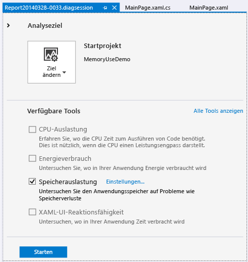

### Speichernutzung überwachen

Wenn Sie eine Diagnosesitzung starten, startet Ihre App, und im Fenster **Diagnosetools** wird eine Zeitachse zur Speicherauslastung Ihrer App angezeigt.

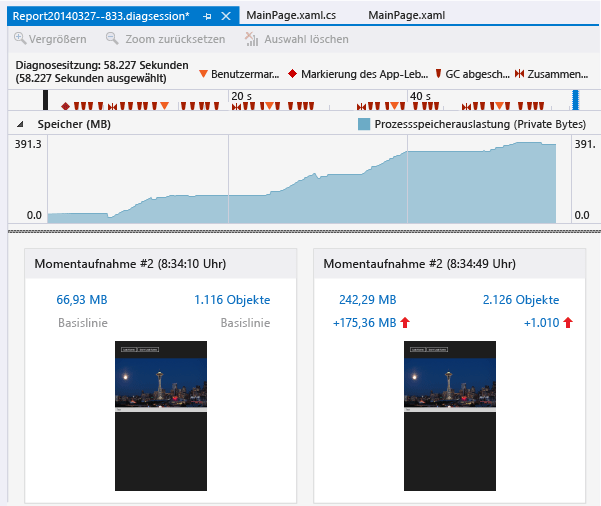

Auf dieser Zeitachse werden Schwankungen der Speicherauslastung während der Ausführung der App dargestellt. Spitzen in der Zeitachse weisen normalerweise darauf hin, dass Code in der App Daten erfasst oder erstellt und diese dann verwirft, wenn die Verarbeitung abgeschlossen ist. Hohe Spitzen weisen auf Bereiche hin, die Sie ggf. optimieren können. Problematischer ist ein Anstieg in der Auslastung von Speicher, der nicht zurückgegeben wird, denn dies kann auf ineffiziente Speicherverwendung oder sogar einen Speicherverlust hindeuten.

### Erstellen von Momentaufnahmen zu Speicherzuständen von Apps

Eine App verwendet eine Vielzahl verschiedener Arten von Objekten. Daher sollten Sie Ihre Analyse auf ein bestimmtes Szenario ausrichten. Möglicherweise stoßen Sie auch auf Speicherprobleme, die Sie untersuchen sollten. Sie können während einer Diagnosesitzung Momentaufnahmen erstellen, um die Speicherauslastung zu bestimmten Zeitpunkten zu erfassen. Zudem wird empfohlen, vor dem Auftreten eines Speicherproblems eine Baselinemomentaufnahme der App zu erstellen und nach dem ersten Auftreten des Problems eine weitere Momentaufnahme und zusätzliche Momentaufnahmen zu erstellen, wenn Sie das Szenario wiederholen.

Klicken Sie auf **Momentaufnahme erstellen**, wenn Sie mit dem Erfassen der Speicherdaten beginnen möchten.

###   Schließen der Diagnosesitzung

Um eine Überwachungssitzung zu schließen, ohne einen Bericht zu erstellen, schließen Sie das Diagnosefenster einfach. Wenn Sie einen Bericht generieren möchten, nachdem Sie genügend Momentaufnahmen erstellt haben, klicken Sie auf **Sammlung beenden**.

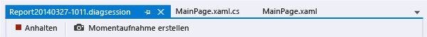

##  Berichte zur Speicherauslastung

Wenn Sie die Datenerfassung beenden, hält das **Speicherauslastungstool** die App an und zeigt eine Übersichtsseite zur **Speicherauslastung** an.

###  Momentaufnahmen zur Speicherauslastung

In den **Momentaufnahmenbereichen** finden Sie die Anzahl der Bytes und Objekte im Speicher zum Zeitpunkt der Momentaufnahme sowie Zahlen zum Vergleich zwischen der aktuellen und der vorherigen Momentaufnahme.

Es handelt sich bei den Zahlen um Links, über die Sie ausführliche Berichtsansichten zur **Speicherauslastung** in weiteren Fenstern in Visual Studio öffnen können. In einem [Momentaufnahmendetailbericht](#snapshot-details-reports) werden die Arten und Instanzen in einer Momentaufnahme aufgeführt. In einem [Momentaufnahmenvergleichsbericht](#snapshot-difference-diff-reports) werden die Typen und Instanzen zweier Momentaufnahmen miteinander verglichen.

  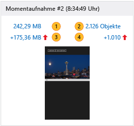

|||
|-|-|
||Die Gesamtanzahl der Bytes im Speicher zum Zeitpunkt der Momentaufnahme   Klicken Sie auf diesen Link, um einen Bericht mit Momentaufnahmedetails anzuzeigen, der anhand der Gesamtgröße der Typinstanzen geordnet ist.|
||Die Gesamtzahl der Objekte im Speicher zum Zeitpunkt der Momentaufnahme   Klicken Sie auf diesen Link, um einen Bericht mit Momentaufnahmedetails anzuzeigen, der anhand der Anzahl der Typinstanzen geordnet ist.|
||Der Unterschied zwischen der Gesamtgröße der Speicherobjekte in dieser und der vorherigen Momentaufnahme    Wenn die Zahl positiv ist, ist die Speichergröße dieser Momentaufnahme größer als die der vorherigen. Wenn sie negativ ist, ist die Speichergröße kleiner. Wenn der Begriff **Baseline** angezeigt wird, deutet dies darauf hin, dass es sich um die erste Momentaufnahme in einer Diagnosesitzung handelt. Wenn die Worte **No Difference** (Kein Unterschied) angezeigt werden, liegt der Vergleichswert bei 0 (null).   Klicken Sie auf diesen Link, um einen Momentaufnahmenvergleichsbericht anzuzeigen, der anhand der Unterschiede in der Gesamtgröße der Typinstanzen geordnet ist.|
||Der Unterschied zwischen der Gesamtanzahl der Speicherobjekte in dieser und der vorherigen Momentaufnahme   Klicken Sie auf diesen Link, um einen Momentaufnahmenvergleichsbericht anzuzeigen, der nach den Unterschieden in der Gesamtanzahl der Typinstanzen geordnet ist.|

## Momentaufnahmenberichte zur Speicherauslastung

 Wenn Sie auf einen der Momentaufnahmenlinks auf der Übersichtsseite zur **Speicherauslastung** klicken, wird auf einer neuen Seite ein Momentaufnahmenbericht geöffnet.

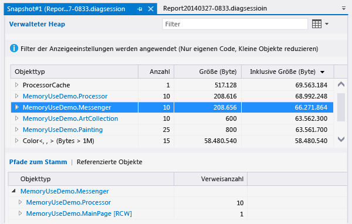

Sie können Einträge zum **Objekttyp** in einem Momentaufnahmenbericht erweitern, um untergeordnete Einträge anzuzeigen. Instanzennamen sind eindeutige IDs, die durch das Speicherauslastungstool generiert werden.

Wenn ein **Objekttyp** in blau angezeigt wird, können Sie auf diesen klicken, um in einem separaten Fenster im Quellcode zu dem Objekt zu navigieren.

Typen, die Sie nicht identifizieren können oder deren Bedeutung für Ihren Code Sie nicht kennen, gehören wahrscheinlich zu .NET Framework, zum Betriebssystem oder zu Compilerobjekten. Im **Speicherauslastungstool** werden diese Objekte angezeigt, wenn sie Bestandteil der Besitzketten Ihrer Objekte sind.

Der Momentaufnahmenbericht:

- Die **Verwalteter Heap**-Struktur zeigt die Typen und Instanzen im Bericht an. Wenn Sie einen Typ oder eine Instanz auswählen, werden die Strukturen **Pfade zum Stamm** und **Referenzierte Objekte** für das gewählte Element angezeigt.

- Die **Pfade zum Stamm**-Struktur zeigt die Kette der Objekte an, die auf einen Typ oder eine Instanz verweisen. Der Garbage Collector von .NET Framework bereinigt den Speicher für ein Objekt nur dann, wenn alle Verweise darauf freigegeben wurden.

- Die **Verweistypen**- oder die **Verweisobjekte**-Struktur zeigt die Objekte an, auf die der ausgewählte Typ oder die ausgewählte Instanz verweist.

###   Berichtsstrukturenfilter

Die meisten Typen in Apps spielen für App-Entwickler keine große Rolle. Mit den Filtern für Momentaufnahmenberichte können die meisten dieser Typen in der **Verwalteter Heap**- und der **Pfade zum Stamm**-Struktur ausgeblendet werden.

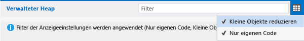

-  Wenn Sie eine Struktur nach Typnamen filtern möchten, geben Sie den entsprechenden Namen in das Feld **Filter** ein. Der Filter berücksichtigt die Groß-/Kleinschreibung nicht und erkennt die angegebene Zeichenfolge in jedem Teil des Typennamens.

-  Wählen Sie aus der Dropdownliste unter **Filter** **Kleine Objekte reduzieren** aus, um Typen auszublenden, deren **Größe (Byte)** weniger als 0,5 % des Gesamtspeichers beträgt.

-  Wählen Sie aus der Dropdownliste unter **Filter** **Nur eigenen Code** aus, um die meisten Instanzen auszublenden, die durch externen Code generiert werden. Externe Typen gehören zum Betriebssystem, zu Framework-Komponenten oder werden vom Compiler generiert.

## Berichte über Momentaufnahmendetails

 In einem Bericht mit Momentaufnahmedetails wird eine Momentaufnahme aus einer Diagnosesitzung beschrieben. Wenn Sie den Bericht öffnen möchten, klicken Sie in einem Momentaufnahmenbereich auf den Link zur Größe oder zu den Objekten.

 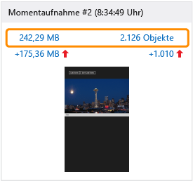

Beide Links führen zum selben Bericht. Der Unterschied besteht lediglich in der Sortierreihenfolge der **Verwalteter Heap**-Struktur. Der Link „Größe“ ordnet den Bericht nach der Spalte **Inklusive Größe (Bytes)**. Der Link „Objekte“ ordnet den Bericht nach der Spalte **Anzahl**. Sie können die Sortierspalte oder -reihenfolge ändern, nachdem der Bericht geöffnet wurde.

###   „Verwalteter Heap“-Struktur (Bericht mit Momentaufnahmedetails)
 Die Struktur des **verwalteten Heaps** führt die Objekttypen auf, die im Speicher gehalten werden. Sie können den Typennamen erweitern, um die zehn größten Instanzen des Typs nach Größe geordnet anzuzeigen. Wenn Sie einen Typ oder eine Instanz auswählen, wird die **Pfade zum Stamm**- und die **Verweisobjekt**-Struktur für das gewählte Element angezeigt.

 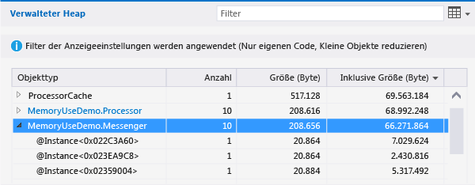

Eine **Verwalteter Heap**-Struktur in einem Bericht mit Momentaufnahmedetails weist die folgenden Spalten auf:

|||
|-|-|
|**Objekttyp**|Der Name des Typs oder der Objektinstanz.|
|**Anzahl**|Die Anzahl der Objektinstanzen des Typs. Für eine Instanz ist die **Anzahl** stets 1.|
|**Größe (Byte)**|Für Typen: die Größe aller Instanzen des Typs in der Momentaufnahme, ohne die Größe der in den Instanzen enthaltenen Objekte.   Für Instanzen: die Größe des Objekts, ohne die Größe der in der Instanz enthaltenen Objekte. |
|**Inklusive Größe (Bytes)**|Die Größe der Instanzen des Typs oder einer einzelnen Instanz, einschließlich der Größe der enthaltenen Objekte.|
|**Modul**|Das Modul, das dieses Objekt enthält.|

###   „Pfade zum Stamm“-Struktur (Berichte mit Momentaufnahmedetails)
Die **Pfade zum Stamm**-Struktur zeigt die Kette der Objekte an, die auf einen Typ oder eine Instanz verweisen. Der Garbage Collector von .NET Framework bereinigt den Speicher für ein Objekt nur dann, wenn alle Verweise darauf freigegeben wurden.

Bei einer **Pfade zum Stamm**-Struktur wird die Anzahl der Objekte mit Verweisen auf diesen Typ in der Spalte **Verweisanzahl** angezeigt.

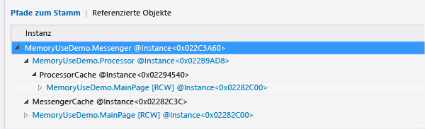

###   „Verweistypen“- oder „Verweisobjekte“-Struktur (Berichte mit Momentaufnahmedetails)
Die **Verweistypen**- oder die **Verweisobjekte**-Struktur zeigt die Objekte an, auf die der ausgewählte Typ oder die ausgewählte Instanz verweist.

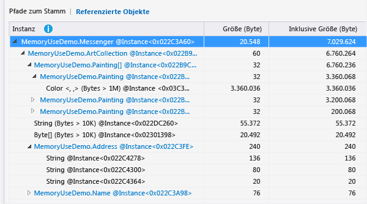

Eine **Verweistypen**-Struktur in einem Bericht mit Momentaufnahmedetails weist die folgenden Spalten auf. Eine **Verweisobjekte**-Struktur weist keine Spalte für die **Verweisanzahl** auf.

|||
|-|-|
|**Objekttyp** oder **Instanz**|Der Name des Typs oder der Instanz.|
|**Verweisanzahl**|Für Typen: die Anzahl der Objektinstanzen des Typs.|
|**Größe (Byte)**|Für Typen: die Größe aller Instanzen des Typs ohne die Größe der in dem Typ enthaltenen Objekte.   Für Instanzen: die Größe des Objekts ohne die Größe der in dem Objekt enthaltenen Objekte.|
|**Inklusive Größe (Bytes)**|Die Gesamtgröße der Instanzen des Typs oder die Größe der Instanz, einschließlich der Größe der enthaltenen Objekte.|
|**Modul**|Das Modul, das dieses Objekt enthält.|

## Bericht über Momentaufnahmenunterschiede

In einem Momentaufnahmenvergleichsbericht werden die Unterschiede zwischen der primären und der zuvor erstellten Momentaufnahme angezeigt. Wenn Sie einen Vergleichsbericht öffnen möchten, klicken Sie auf einen der Vergleichslinks im Momentaufnahmenbereich.

Beide Links führen zum selben Bericht. Der Unterschied besteht lediglich in der Sortierreihenfolge der **Verwalteter Heap**-Struktur in dem Bericht. Der Link „Größe“ ordnet den Bericht nach der Spalte **Inklusive Differenz der Größe (Bytes)**. Der Link „Objekte“ ordnet den Bericht nach der Spalte **Differenz der Anzahl**. Sie können die Sortierspalte oder -reihenfolge ändern, nachdem der Bericht geöffnet wurde.

 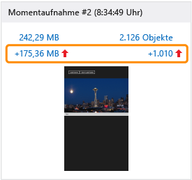

###   „Verwalteter Heap“-Struktur (Bericht zu Momentaufnahmenvergleichsberichte)

 Die Struktur des **verwalteten Heaps** führt die Objekttypen auf, die im Speicher gehalten werden. Sie können den Typennamen erweitern, um die zehn größten Instanzen des Typs nach Größe geordnet anzuzeigen. Wenn Sie einen Typ oder eine Instanz auswählen, wird die **Pfade zum Stamm**- und die **Verweisobjekt**-Struktur für das gewählte Element angezeigt.

 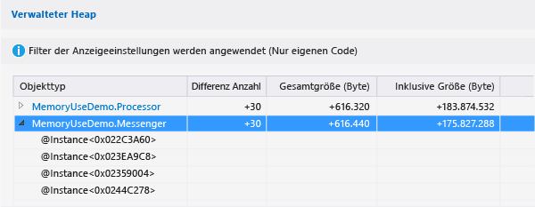

Eine **Verwalteter Heap**-Struktur in einem Vergleichsbericht bei Momentaufnahmen weist die folgenden Spalten auf:

|||
|-|-|
|**Objekttyp**|Der Name des Typs oder der Objektinstanz.|
|**Anzahl**|Die Zahl der Instanzen eines Typs in der primären Momentaufnahme. Für eine Instanz ist die **Anzahl** stets 1.|
|**Differenz der Anzahl**|Für Typen: Der Unterschied zwischen der Anzahl der Instanzen des Typs in der primären Momentaufnahme und der vorhergehenden Momentaufnahme. Für Instanzen ist das Feld leer.|
|**Größe (Byte)**|Die Größe der Objekte in der primären Momentaufnahme abzüglich der Größe der in den Objekten enthaltenen Objekte. Für Typen sind **Größe (Bytes)** und **Inklusive Größe (Bytes)** die Gesamtgrößen der Typinstanzen.|
|**Unterschied der Gesamtgrößen (Bytes)**|Für Typen: der Unterschied in der Gesamtgröße der Typinstanzen zwischen der primären und der vorherigen Momentaufnahme, ohne die Größe der in den Instanzen enthaltenen Objekte. Für Instanzen ist das Feld leer.|
|**Inklusive Größe (Bytes)**|Die Größe der Objekte in der primären Momentaufnahme einschließlich der Größe der in den Objekten enthaltenen Objekte.|
|**Unterschied der inklusiven Größen (Bytes)**|Für Typen: der Unterschied in der Größe aller Typinstanzen zwischen der primären Momentaufnahme und der vorhergehenden Momentaufnahme, einschließlich der Größe der in den Objekten enthaltenen Objekte. Für Instanzen ist das Feld leer.|
|**Modul**|Das Modul, das dieses Objekt enthält.|

###   „Pfade zum Stamm“-Struktur (Momentaufnahmenvergleichsberichte)

Die **Pfade zum Stamm**-Struktur zeigt die Kette der Objekte an, die auf einen Typ oder eine Instanz verweisen. Der Garbage Collector von .NET Framework bereinigt den Speicher für ein Objekt nur dann, wenn alle Verweise darauf freigegeben wurden.

Bei einer **Pfade zum Stamm**-Struktur wird die Anzahl der Objekte mit Verweisen auf diesen Typ in der Spalte **Verweisanzahl** angezeigt. Die Veränderungen der Anzahl im Vergleich zur vorherigen Momentaufnahme werden in der Spalte **Reference Diff** (Verweisunterschied) aufgeführt.

 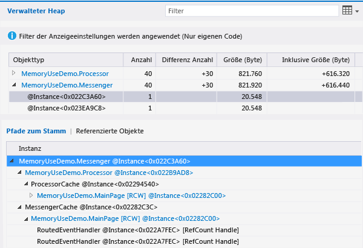

###   „Verweistyp“- oder „Verweisobjekte“-Struktur (Momentaufnahmenvergleichsberichte)

Die **Verweistypen**- oder die **Verweisobjekte**-Struktur zeigt die Objekte an, auf die der ausgewählte Typ oder die ausgewählte Instanz verweist.

Eine **Verweistypen**-Struktur in einem Momentaufnahmenvergleichsbericht weist die folgenden Spalten auf. Eine **Verweisobjekte**-Struktur umfasst die folgenden Spalten: **Instanz**, **Größe (Bytes)**, **Inklusive Größe (Bytes)** und **Modul**.

|||
|-|-|
|**Objekttyp** oder **Instanz**|Der Name des Typs oder der Objektinstanz.|
|**Verweisanzahl**|Die Zahl der Instanzen eines Typs in der primären Momentaufnahme.|
|**Differenz Verweisanzahl**|Für Typen: Der Unterschied zwischen der Anzahl der Instanzen des Typs in der primären Momentaufnahme und der vorhergehenden Momentaufnahme.|
|**Größe (Byte)**|Die Größe der Objekte in der primären Momentaufnahme abzüglich der Größe der in den Objekten enthaltenen Objekte. Für Typen sind **Größe (Bytes)** und **Inklusive Größe (Bytes)** die Gesamtgrößen der Typinstanzen.|
|**Unterschied der Gesamtgrößen (Bytes)**|Für Typen: der Unterschied in der Gesamtgröße der Typinstanzen zwischen der primären und der vorherigen Momentaufnahme, ohne die Größe der in den Instanzen enthaltenen Objekte. |
|**Inklusive Größe (Bytes)**|Die Größe der Objekte in der primären Momentaufnahme einschließlich der Größe der in den Objekten enthaltenen Objekte.|
|**Unterschied der inklusiven Größen (Bytes)**|Für Typen: der Unterschied in der Größe aller Typinstanzen zwischen der primären Momentaufnahme und der vorhergehenden Momentaufnahme, einschließlich der Größe der in den Objekten enthaltenen Objekte.|
|**Modul**|Das Modul, das dieses Objekt enthält.|

## Siehe auch
- [JavaScript memory (JavaScript-Arbeitsspeicher)](../profiling/javascript-memory.md)
- [Profilerstellung in Visual Studio](../profiling/index.md)
- [Einführung in Profilerstellungstools](../profiling/profiling-feature-tour.md)
- [Bewährte Methoden zur Leistungsverbesserung für UWP-Apps mit C++, C# und Visual Basic](/previous-versions/windows/apps/hh750313\(v\=win.10\))
- [Diagnosing memory issues with the new Memory Usage Tool in Visual Studio (Diagnostizieren von Speicherproblemen mithilfe des neuen Speicherauslastungstools in Visual Studio)](http://go.microsoft.com/fwlink/p/?LinkId=394706)