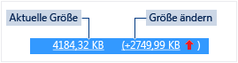

# Speicherauslastung
[!INCLUDE[vs2017banner](../code-quality/includes/vs2017banner.md)]

Suchen Sie Speicherverluste und ineffiziente Arbeitsspeichernutzung während des Debuggens mit dem Debugger\-integrierten **Speicherauslastungs**\-Diagnosetool. Mit dem Speicherauslastungstool können Sie einen oder mehrere *Momentaufnahmen* des verwalteten und systemeigenen Momentaufnahme\-Heaps machen. Sie können Momentaufnahmen von .NET\-Apps, systemeigenen Apps und Apps in gemischtem Modus \(.Net und systemeigen\) erfassen.  
  
-   Sie können eine einzelne Momentaufnahme analysieren, um die relativen Auswirkungen der Objekttypen auf die Arbeitsspeichernutzung zu verstehen und Code in der App zu suchen, die Arbeitsspeicher auf ineffiziente Weise verwendet.  
  
-   Sie können auch einen Vergleich zweier Momentaufnahmen einer App vornehmen, um Bereiche im Code aufzuspüren, die dazu führen, dass die Arbeitsspeichernutzung im Zeitverlauf zunimmt.  
  
 Folgende Abbildung zeigt das Fenster **Diagnosetools** in Visual Studio 2015 Update 1:  
  
   
  
 Obwohl Sie Speichermomentaufnahmen des Arbeitsspeichers zu jedem beliebigen Zeitpunkt im **Speicherauslastungstool** erfassen können, können Sie mit dem Visual Studio\-Debugger kontrollieren, wie Ihre Anwendung die Ausführung vornimmt, und dabei Leistungsprobleme untersuchen. Festlegen von Haltepunkten, schrittweises Ausführen, alles unterbrechen und andere Debugger\-Aktionen können Ihnen helfen, Ihre Leistungsuntersuchungen auf die relevantesten Codepfade zu fokussieren. Durch die Ausführung dieser Aktionen, während Ihre App ausgeführt wird, kann das Rauschen, das Sie nicht interessiert, vom Code entfernt werden, wodurch sich der Zeitaufwand, den Sie zur Diagnose eines Problems benötigen, maßgeblich verringert.  
  
 Sie können das Speichertool auch außerhalb des Debuggers verwenden. Siehe [Analysieren der Arbeitsspeichernutzung ohne Debugging](../Topic/Memory%20Usage%20without%20Debugging1.md).  
  
> [!NOTE]
>  **Unterstützung für benutzerdefinierte Zuweisungen** Die systemeigene Speicherprofilerstellung funktioniert dadurch, dass speicherbelegungsbezogene [ETW\-](https://msdn.microsoft.com/en-us/library/windows/desktop/bb968803\(v=vs.85\).aspx)\-Ereignisdaten gesammelt werden, die während der Laufzeit ausgegeben wurden.  Zuweisungen im CRT und Windows SDK wurden auf Quellebene kommentiert, sodass ihre Speicherbelegungsdaten erfasst werden können.  Wenn Sie Ihre eigenen Zuweisungen schreiben, kann jede Funktion, die einen Zeiger auf neu zugewiesenen Heapspeicher zurückgibt, mit [\_\_declspec](/visual-cpp/cpp/declspec)\(allocator\) ergänzt werden, wie in diesem Beispiel für myMalloc zu sehen ist:  
>   
>  `__declspec(allocator) void* myMalloc(size_t size)`  
  
## Analysieren der Arbeitsspeichernutzung mithilfe des Debuggers  
  
> [!NOTE]
>  Da das Erfassen von Speicherdaten die Debugleistung Ihrer systemeigenen Apps oder Ihrer Apps mit gemischtem Modus beeinträchtigen kann, sind Speichermomentaufnahmen standardmäßig deaktiviert. Starten Sie eine Debugsitzung \(Tastenkombination: **F5**\), um Momentaufnahmen von nativen Apps oder von Apps im gemischten Modus zu aktivieren. Wenn das Fenster **Diagnosetools** eingeblendet wird, wählen Sie die Registerkarte "Speicherauslastung". Dann wählen Sie **Momentaufnahmen aktivieren**.  
>   
>    
>   
>  Beenden Sie den Debugvorgang \(Tastenkombination: **UMSCHALT\+F5**\), und starten Sie ihn neu.  
  
 Wenn Sie den Status des Arbeitsspeichers aufzeichnen möchten, wählen Sie **Momentaufnahme** in der Übersichtssymbolleiste **Speicherauslastung**.  
  
   
  
> [!TIP]
>  -   Um eine Basislinie für Speichervergleiche zu erstellen, sollten Sie zu Beginn Ihrer Debugsitzung eine Momentaufnahme erstellen.  
> -   Da es schwierig sein kann, das Speicherprofil eines Vorgangs zu erfassen, der für Sie von Interesse ist, wenn Ihre App häufig Speicher zuweist und dessen Speicherung wieder aufhebt, richten Sie zu Beginn und zum Ende des Vorgangs Haltepunkte ein oder gehen Sie schrittweise durch den Vorgang, um so den genauen Punkt zu finden, an dem sich der Speicher geändert hat.  
  
## Anzeigen von Arbeitsspeichermomentaufnahme\-Details  
 Die Zeilen der Speicherauslastungs\-Übersichtstabelle führt die Momentaufnahmen auf, die Sie während der Debugsitzung erstellt haben.  
  
 Die Spalten der Zeile sind abhängig von dem Debugmodus, den Sie in den Projekteigenschaften gewählt haben: .NET, systemeigen oder gemischt \(sowohl .NET als auch systemeigen\).  
  
-   Die Spalten **Verwaltete Objekte** und **Systemeigene Zuordnungen** zeigen die Anzahl der Objekte im .NET\-Speicher und im systemeigenen Speicher zum Zeitpunkt der Erstellung der Momentaufnahme an.  
  
-   Die Spalten **Verwaltete Heapgröße** und **Systemeigene Heapgröße** zeigen die Anzahl der Bytes in den .NET\-Heaps und in den systemeigenen Heaps an.  
  
-   Wenn Sie mehrere Momentaufnahmen erstellt haben, beinhalten die Zellen der Übersichtstabelle die Wertänderung zwischen Zeilenmomentaufnahme und vorheriger Momentaufnahme.  
  
       
  
 **So zeigen Sie einen detaillierten Bericht an:**  
  
-   Um nur die Details der ausgewählten Momentaufnahme anzuzeigen, wählen Sie die aktuelle Verknüpfung aus.  
  
-   Um die Details des Unterschiedes zwischen aktueller Momentaufnahme und vorheriger Momentaufnahme anzuzeigen, wählen Sie die Änderungsverknüpfung aus.  
  
 Der Bericht wird in einem separaten Fenster angezeigt.  
  
## Speicherauslastungsdetail\-Berichte  
  
### Berichte zu den verwalteten Typen  
 Wählen Sie die aktuelle Verknüpfung einer Zelle **Verwaltete Objekte** oder **Verwaltete Heapgröße** in der Speicherauslastungs\-Übersichtstabelle.  
  
   
  
 Im oberen Bereich werden Anzahl und Größe der Typen in der Momentaufnahme angezeigt, einschließlich der Größe aller Objekte, auf die der Typ verweist \(**Umfassende Größe**\).  
  
 Die Baumstruktur **Pfade zum Stamm** im unteren Bereich zeigt die Objekte an, die auf den im oberen Bereich ausgewählten Typ verweisen. Der .NET Framework\-Garbage Collector bereinigt den Speicher für ein Objekt nur, wenn der letzte Typ, der darauf verweist, freigegeben wurde.  
  
 Die Baumstruktur **Referenzierte Typen** enthält die Verweise, die von dem Typ, der im oberen Bereich ausgewählt ist, gehalten werden.  
  
   
  
 Um die Instanzen eines ausgewählten Typs im oberen Bereich anzuzeigen, wählen Sie das Symbol .  
  
   
  
 Die Ansicht **Instanzen** zeigt die Instanzen des ausgewählten Objekts in der Momentaufnahme des oberen Bereichs an. Der Bereich "Pfade zum Stamm" und "Referenzierte Objekte" zeigt die Objekte an, die auf die ausgewählte Instanz verweisen, sowie die Typen, auf die die ausgewählte Instanz verweist. Wenn der Debugger an dem Punkt beendet wird, an  dem die Momentaufnahme erstellt wurde, können Sie den Mauszeiger über die Zelle "Wert" führen, um die Werte des Objekts in einer QuickInfo anzuzeigen.  
  
### Berichte zu den systemeigenen Typen  
 Wählen Sie die aktuelle Verknüpfung einer Zelle **Systemeigene Zuordnungen** oder **Systemeigene Heapgröße** aus der Speicherauslastungs\-Übersichtstabelle des Fensters **Diagnosetools**.  
  
   
  
 Die **Typenansicht** zeigt die Anzahl und Größe der Typen in der Momentaufnahme an.  
  
-   Wählen Sie das Instanzensymbol \(\) eines ausgewählten Typs, um Informationen zum Objekt des ausgewählten Typs in der Momentaufnahme anzuzeigen.  
  
     Die Ansicht **Instanzen** zeigt jede Instanz des ausgewählten Typs an. Durch Auswahl einer Instanz wird die Aufrufliste angezeigt, welche die Erstellung der Instanz im Bereich **Belegungsaufrufliste** bewirkt hat.  
  
       
  
-   Wählen Sie **Stapelansicht** im **Ansichtsmodus**, um den Zuweisungsstapel für den ausgewählten Typ anzuzeigen.  
  
       
  
### \(Diff\) Änderungsberichte  
  
-   Wählen Sie die Änderungsverknüpfung in einer Zelle der Übersichtstabelle der Registerkarte **Speicherauslastung** im Fenster **Diagnosetools** aus.  
  
       
  
-   Wählen Sie eine Momentaufnahme aus der Liste **Vergleichen mit** Liste eines verwalteten oder systemeigenen Berichts aus.  
  
       
  
 Der Änderungsbericht fügt dem Basisbericht Spalten \(durch **\(Diff\)** gekennzeichnet\) hinzu, die den Unterschied zwischen der Basismomentaufnahme und der Vergleichsmomentaufnahme anzeigen. So könnte ein Diff\-Bericht der Ansicht mit systemeigenen Typen aussehen:  
  
   
  
## Blogs und Videos  
 [Diagnostic Tools debugger window in Visual Studio 2015](http://blogs.msdn.com/b/visualstudioalm/archive/2015/01/16/diagnostic-tools-debugger-window-in-visual-studio-2015.aspx)  
  
 [Blog: Memory Usage Tool while debugging in Visual Studio 2015](http://blogs.msdn.com/b/visualstudioalm/archive/2014/11/13/memory-usage-tool-while-debugging-in-visual-studio-2015.aspx)  
  
 [Visual C\+\+ Blog: Native Memory Diagnostics in VS2015 Preview](http://blogs.msdn.com/b/vcblog/archive/2014/11/21/native-memory-diagnostics-in-vs2015-preview.aspx)  
  
 [Visual C\+\+ Blog: Native Memory Diagnostic Tools for Visual Studio 2015 CTP](http://blogs.msdn.com/b/vcblog/archive/2014/06/04/native-memory-diagnostic-tools-for-visual-studio-14-ctp1.aspx)