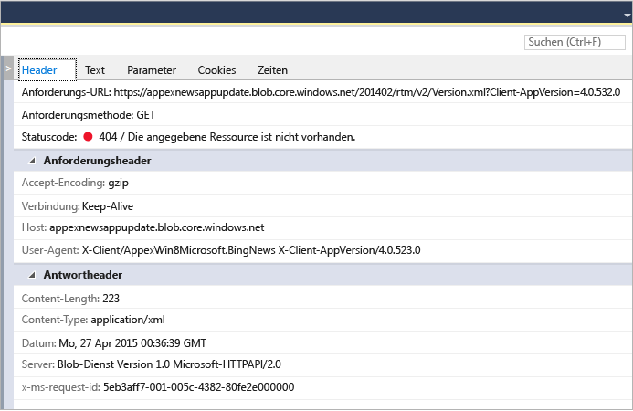

# Analysieren der Netzwerkauslastung in UWP-Apps
Das Diagnosetool **Netzwerk** von Visual Studio erfasst mithilfe der [Windows.Web.Http-API](https://msdn.microsoft.com/library/windows/apps/windows.web.http.aspx) Daten zu Netzwerkoperationen. Durch Analysieren der Daten können Sie Probleme wie Zugriffs- und Authentifizierungsprobleme, falsche Cacheverwendung und schlechte Anzeige- und Downloadleistung in den Griff bekommen.  
  
 Das Netzwerktool unterstützt nur universelle Windows-Apps. Andere Plattformen werden derzeit nicht unterstützt.  
  
> [!NOTE]
>  Detailliertere Informationen zum Netzwerk-Tool finden Sie unter [Introducing Visual Studio’s network tool (Einführung in das Netzwerk-Tool von Visual Studio)](http://blogs.msdn.com/b/visualstudio/archive/2015/05/04/introducing-visual-studio-s-network-tool.aspx).  
  
## Sammeln von Netzwerktooldaten  
 Sie sollten das Tool **Netzwerk** mit einem geöffneten Visual Studio-Projekt auf dem Computer mit Visual Studio ausführen.  
  
1.  Öffnen Sie das Projekt in Visual Studio.  
  
2.  Wählen Sie im Menü die Option **Debuggen / Leistungsprofiler** aus. Wählen Sie **Netzwerk** aus, und klicken Sie anschließend auf **Starten**.  
  
3.  Das Netzwerktool beginnt mit dem Erfassen des HTTP-Datenverkehrs Ihrer App.  
  
     Während der Ausführung der App zeigt die Zusammenfassungsansicht im linken Bereich automatisch eine Liste der erfassten HTTP-Vorgänge an. Wählen Sie ein Element in der Zusammenfassungsansicht aus, um weitere Informationen im Detailbereich rechts anzuzeigen.  
  
4.  Klicken Sie auf **Beenden**, um die App zu schließen.  
  
 Das Berichtsfenster sollte in etwa wie folgt aussehen:  
  
   
  
## Analysieren von Daten  
 Sie können erfassten HTTP-Datenverkehr analysieren, während die App ausgeführt wird oder nachdem sie geschlossen wurde. Wählen Sie dazu einen der in der Zusammenfassungsansicht angezeigten Netzwerkvorgänge aus.  
  
 Die Zusammenfassungsansicht **Netzwerk** zeigt die Daten der einzelnen ausgeführten Netzwerkoperationen Ihrer App an. Wählen Sie eine Spaltenüberschrift aus, um die Liste zu sortieren, oder wählen Sie die Inhaltstypen aus, die in der Filteransicht **Inhaltstyp** angezeigt werden sollen.  
  
 Wählen Sie **Als HAR speichern** aus, um eine JSON-Datei zu erstellen, die von Drittanbietertools wie Fiddler genutzt werden kann.  
  
 Die Detailansicht **Netzwerk** enthält weitere Informationen zu den einzelnen in der Zusammenfassungsansicht angezeigten Netzwerkoperationen.  
  
   
  
|||  
|-|-|  
|**Header**|Informationen zu den Anforderungsheadern des Ereignisses.|  
|**Text**|Die Nutzlastdaten von Anforderung und Antwort.|  
|**Parameter**|Die Parameternamen und Werte der Abfragezeichenfolge.|  
|**Cookies**|Cookiedaten von Antwort und Anforderung.|  
|**Zeiten**|Ein Diagramm der Phasen beim Abrufen der ausgewählten Ressourcen.|  
  
 Die **Zusammenfassungsleiste** in der Ansicht „Netzwerk“ zeigt die jeweils angezeigte Anzahl von Netzwerkoperationen, die Menge der übertragenen Daten, die für das Herunterladen der Daten aufgewendete Zeit und die Anzahl von sichtbaren Fehlern (Anforderungen mit Antworten „4xx“ oder „5xx“).  
  
### Tipps für die Analyse  
 Dieses Tool hebt bestimmte Bereiche hervor, die bei der Ausführung von netzwerkbezogenen Analysen nützlich sein können:  
  
1.  Anforderungen, die vollständig aus dem Cache bedient werden, werden in der Spalte **Empfangen** als **(aus Cache)** angezeigt. Dies kann dabei helfen, herauszufinden, ob der Cache effektiv genutzt und damit Bandbreite für die Benutzer gespart wird, oder ob versehentlich überflüssige Antworten zwischengespeichert und den Endbenutzern Ihrer Anwendung veraltete Daten bereitgestellt werden.  
  
2.  Fehlerantworten (4xx oder 5xx) werden mit einem roten Statuscode in der Spalte **Ergebnisse** angezeigt und auch in der Zusammenfassungsleiste hervorgehoben. So lassen sich unter den vielen potenziellen Anforderungen Ihrer Anwendung Fehler ganz einfach erkennen.  
  
3.  Die Schaltfläche für eine strukturierte Ausgabe („Schöndruck“, auf der Registerkarte mit dem Haupttext) verbessert die Lesbarkeit des Inhalts und vereinfacht so das Analysieren großer Mengen von JSON-, XML-, HTML-, CSS-, JavaScript- und TypeScript-Antworten.  
  
## Siehe auch  
 [Run Profiling Tools with or without the Debugger (Ausführen von Profilerstellungstools mit und ohne Debugger)](../profiling/running-profiling-tools-with-or-without-the-debugger.md)
 [Visual Studio blog: Introducing Visual Studio’s network inspector (Visual Studio-Blog: Einführung in den Netzwerk-Inspektor von Visual Studio)](http://go.microsoft.com/fwlink/?LinkId=535022)   
 [Channel 9 Video: VS Diagnostics tools – New Network Profiler (Channel-9-Video: Diagnosetools von Visual Studio – Neuer Profiler „Netzwerk“)](http://channel9.msdn.com/Series/ConnectOn-Demand/206)
