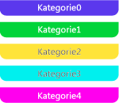

# Bereichsmarker
Ein Bereichsmarker stellt eine sinnvolle Phase einer Anwendung dar. Sie können beispielsweise mit einem Bereich ein Zeitintervall darstellen, in dem ein Arbeitselement verarbeitet wird. Seine Länge stellt die Dauer der Phase der entsprechenden Anwendung dar. Diese Abbildung zeigt einen Bereich in der Parallelitätsschnellansicht an:  
  
   
Span-Marker in der Parallelitätsschnellansicht  
  
## Bereichskategorie  
 Je nach Kategorie wird ein Span-Marker in einer von fünf unterschiedlichen Farben angezeigt. Die Farben werden wiederholt, wenn mehr als fünf Kategorien vorhanden sind. Die Kategorie kann jede beliebige Ganzzahl sein. Die folgende Abbildung zeigt die fünf möglichen Farben:  
  
   
Die Farben der ersten fünf Bereichskategorien  
  
## Span-Aggregationsmarker  
 Manchmal treten Span-Marker so nahe nebeneinander in der Parallelitätschnellansicht auf, dass sie nicht einzeln gezeichnet werden können. Ist dies der Fall, wird ein *Span-Aggregationsmarker* angezeigt, der die zugrunde liegenden Bereiche darstellt. Wenn Sie mit dem Mauszeiger über eines dieser Symbole fahren, zeigt eine QuickInfo die Anzahl der zugrunde liegenden Bereiche an, die dargestellt werden. Vergrößern Sie, um die Bereichs anzuzeigen. Wenn Sie bis zur maximalen Stufe vergrößern und weiterhin ein Span-Aggregationsmarker angezeigt wird, können Sie die zugrunde liegenden Bereichsmarker im [Markerbericht](../profiling/markers-report.md) anzeigen. Die folgende Abbildung zeigt einen Span-Aggregationsmarker:  
  
   
Span-Aggregationsmarker  
  
## Siehe auch  
 [Concurrency Visualizer markers (Parallelitätsschnellansichtsmarker)](../profiling/concurrency-visualizer-markers.md)   
 [SDK der Nebenläufigkeitsschnellansicht](../profiling/concurrency-visualizer-sdk.md)