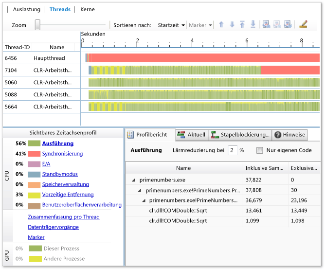

# Threadansicht in der Parallelitätsschnellansicht

Die **Threadansicht** ist die detaillierteste und funktionsreichste Ansicht in der Parallelitätsschnellansicht. Sie können anhand der **Threadansicht** ermitteln, welche Threads in einem Ausführungssegment Code ausführen, und analysieren, welche Threads aufgrund der Synchronisierung, aufgrund von E/A oder aus anderen Gründen Code ausführen oder blockieren. Berichte zur **Threadansicht** profilen außerdem die Ausführung der Aufruflistenstruktur und die Aufhebung von Blockierungen für Threads.

Wenn Threads ausgeführt werden, sammelt die Parallelitätsschnellansicht Beispiele. Wenn die Ausführung eines Threads beendet wird, überprüft die Schnellansicht alle Kontextwechselereignisse für den Thread. Kontextwechsel können aus folgenden Gründen auftreten:  
  
- Ein Thread wird auf einer Synchronisierungsprimitive blockiert.  
- Das Quantum eines Threads läuft ab.  
- Durch einen Thread erfolgt eine blockierende E/A-Anforderung.  

Die Parallelitätsschnellansicht kategorisiert Thread- und Kontextwechselereignisse und durchsucht die Aufrufliste des Threads nach bekannten blockierenden APIs. Sie zeigt die Threadkategorien in der aktiven Legende im unteren linken Bereich der **Threadansicht** an. In den meisten Fällen können Sie die Ursache eines blockierenden Ereignisses identifizieren, indem Sie die Aufruflisten überprüfen, die Kontextwechselereignissen entsprechen.

Wenn keine Übereinstimmung in der Aufrufliste gefunden wird, verwendet die Parallelitätsschnellansicht den von [!INCLUDE[TLA#tla_mswin](../code-quality/includes/tlasharptla_mswin_md.md)] angegebenen Wartegrund. Die [!INCLUDE[TLA#tla_mswin](../code-quality/includes/tlasharptla_mswin_md.md)]-Kategorie basiert jedoch möglicherweise auf einem Implementierungsdetail und entspricht nicht der Absicht des Benutzers. [!INCLUDE[TLA#tla_mswin](../code-quality/includes/tlasharptla_mswin_md.md)] meldet z. B. die Warteursache für das Blockieren einer nativen SRW-Sperre (Slim Reader/Writer) als E/A und nicht als Synchronisierung.  
  
In der **Threadansicht** werden auch Abhängigkeiten zwischen Threads angezeigt. Wenn Sie beispielsweise einen Thread ermitteln, der ein Synchronisierungsobjekt blockiert hat, können Sie den Thread suchen, der die Blockierung aufgehoben hat. Sie können die Aufrufliste nach der Stelle durchsuchen, an der der Thread die Blockierung des anderen Threads aufgehoben hat.  

Sie können die **Threadansicht** für Folgendes nutzen:  

- Identifizieren von Gründen, warum die Benutzeroberfläche (UI) einer App in bestimmten Ausführungsphasen nicht reagiert  
- Bestimmen des Zeitumfangs, der für das Blockieren von Synchronisierung, E/A, Seitenfehlern und anderen Ereignissen aufgewendet wird  
- Ermitteln des Grads der Störung durch andere Prozesse, die auf dem System ausgeführt werden  
- Lastenausgleichsprobleme bei paralleler Ausführung identifizieren.  
- Finden der Gründe für suboptimale bzw. nicht vorhandene Skalierbarkeit Z. B: Warum verbessert sich die Leistung einer parallelen App nicht, wenn mehr logische Kerne verfügbar sind?  
- Den Parallelitätsgrad in der Anwendung verstehen, um die Parallelisierung zu unterstützen.  
- Identifizieren von Abhängigkeiten zwischen Arbeitsthreads und kritischen Pfaden der Ausführung  
  
## Verwenden der Threadansicht 

Klicken Sie zum Starten der Parallelitätsschnellansicht auf **Analysieren** > **Parallelitätsschnellansicht**, und wählen Sie anschließend z. B. die Option **Neuen Prozess starten** aus. 

Die Parallelitätsschnellansicht startet dann die App und verfolgt so lange die Abläufe, bis Sie auf **Sammlung beenden** klicken. Die Schnellansicht analysiert anschließend die Ablaufverfolgung und zeigt die Ergebnisse auf der Seite „Ablaufverfolgungsbericht“ an. 

Klicken Sie oben links im Bericht auf die Registerkarte **Threads**, um die **Threadansicht** zu öffnen. 

  
  
Wählen Sie Zeitintervalle und Threads aus, um die entsprechende Leistung zu analysieren.  
  
## Zeitachsenanalyse  

Im oberen Bereich der **Threadansicht** finden Sie eine Zeitachse. Auf der Zeitachse wird die Aktivität aller Threads im Prozess sowie aller physischen Laufwerke auf dem Hostcomputer angezeigt. Außerdem werden GPU-Aktivität und Markerereignisse angezeigt.  

Die x-Achse der Zeitachse gibt die Zeit an und auf der y-Achse gibt es verschiedene Kanäle:  
  
- Zwei E/A-Kanäle für jedes Laufwerk im System, einen Kanal für Lesevorgänge und einen für Schreibvorgänge.  
- Einen Kanal für jeden Thread im Prozess.  
- Markerkanäle, falls Markerereignisse in der Ablaufverfolgung vorhanden sind. Markerkanäle werden zuerst unter den Threadkanälen angezeigt, die diese Ereignisse generiert haben.  
- GPU-Kanäle.  
  
Die Threads werden zuerst in der Reihenfolge sortiert, in der sie erstellt werden, sodass der Hauptthread der App an erster Stelle steht. Wenn Sie Threads anhand eines anderen Aspekts (z. B. der **Ausführung**) sortieren möchten, wählen Sie eine andere Option aus der Dropdownliste **Sortieren nach** aus. 

Die Farben auf der Zeitachse zeigen den Status eines Threads zu einem bestimmten Zeitpunkt an. Ausführende Segmente sind grün, für die Synchronisierung blockierte Segmente sind rot, Segmente mit Vorrang sind gelb und mit der Geräte-E/A beschäftigte Segmente sind violett. 

Sie können die Ansicht vergrößern, um mehr Details anzuzeigen, oder verkleinern, um ein längeres Zeitintervall anzuzeigen. Wählen Sie Punkte im Diagramm aus, um Details zu Kategorien, Startzeiten, Verzögerungen und Aufruflistenzuständen abzurufen.  

Untersuchen Sie anhand der Zeitachse den Lastenausgleich zwischen Threads, die an einer parallelen Schleife beteiligt sind oder gleichzeitige Aufgaben ausführen. Wenn ein Thread zum Abschließen mehr Zeit in Anspruch nimmt als die anderen, ist die Arbeit möglicherweise unausgewogen verteilt. Sie können die Leistung Ihrer App verbessern, indem Sie die Arbeit unter den Threads gleichmäßiger verteilen.  
  
Wenn zu einem Zeitpunkt nur ein Thread ausführt wird, kann die App die Parallelität auf dem System möglicherweise nicht vollständig nutzen. Sie können das Zeitachsendiagramm verwenden, um Abhängigkeiten zwischen Threads und die zeitlichen Beziehungen zwischen blockierenden und blockierten Threads zu untersuchen. Wenn Sie Threads neu anordnen möchten, wählen Sie einen Thread aus, und klicken Sie dann auf der Symbolleiste auf die Pfeile nach oben und nach unten. 

Sie können vollständig blockierte oder nicht funktionierende Threads ausblenden, da deren Statistiken irrelevant sind und die Berichte überlasten können. Sie können Threads ausblenden, indem Sie deren Namen auswählen und in der Symbolleiste auf **Ausgewählte Threads ausblenden** oder **Alle außer den ausgewählten Threads ausblenden** klicken. Wenn Sie Threads ermitteln möchten, die ausgeblendet werden sollen, klicken Sie im Bereich unten links auf den Link **Zusammenfassung pro Thread**. Sie können die Threads ausblenden, für die im Graph **Zusammenfassung pro Thread** keine Aktivität verzeichnet ist. 

### Details zur Threadausführung  
Sie erhalten genauere Informationen zu einem Ausführungssegment, wenn Sie in einem grünen Segment auf der Zeitachse einen Punkt auswählen. In der Parallelitätsschnellansicht wird über dem ausgewählten Punkt ein Caretzeichen angezeigt. Die entsprechende Aufrufliste finden Sie im unteren Bereich auf der Registerkarte **Aktuell**. Sie können auf dem Ausführungssegment mehrere Punkte auswählen.  
  
>[!NOTE]
>Die Parallelitätsschnellansicht ist möglicherweise nicht in der Lage, eine Auswahl auf einem Ausführungssegment aufzulösen, wenn das Segment weniger als eine Millisekunde umfasst.  
  
Klicken Sie in der Legende unten links auf **Ausführung**, um ein Ausführungsprofil für alle eingeblendeten Threads im ausgewählten Zeitbereich zu erhalten.  
  
### Details zur Threadblockierung  
Sie erhalten Informationen zu einer bestimmten Region auf einem Thread, wenn Sie mit dem Mauszeiger auf diesen Bereich zeigen. Dann wird eine QuickInfo angezeigt. Die QuickInfo beinhaltet Informationen wie die Kategorie, die Startzeit und die Verzögerung. Wählen Sie die Region aus, um eine Aufrufliste für diesen Zeitpunkt auf der Registerkarte **Aktuell** anzuzeigen, die sich im unteren Bereich befindet. In dem Bereich wird außerdem die Kategorie, die Verzögerung, die blockierende API (falls vorhanden) und ggf. der Thread angezeigt, der die Blockade aufhebt. Sie können anhand der Aufrufliste den Grund für die Ereignisse bestimmen, die den Thread blockieren.  
  
Auf einem Ausführungspfad können mehrere blockierende Ereignisse auftreten. Wählen Sie im Bereich links eine Blockierungskategorie aus der Legende aus, um diese Pfade nach Blockierungskategorie sortiert zu überprüfen und Problembereiche schneller zu finden.  
  
### Abhängigkeiten zwischen Threads  
In der Parallelitätsschnellansicht werden Abhängigkeiten zwischen Threads im Prozess angezeigt, damit Sie feststellen können, was ein blockierter Thread ausführen wollte, und welcher andere Thread die Ausführung ermöglicht hat. 

Wählen Sie das Blockierungssegment auf der Zeitachse aus, um festzustellen, welcher Thread die Blockierung eines anderen Threads aufgehoben hat. Wenn die Parallelitätsschnellansicht den die Blockierung aufhebenden Thread bestimmen kann, zeichnet sie eine Linie zwischen diesem und dem ausführenden Segment, das dem blockierenden Segment folgt. Klicken Sie im unteren Bereich auf die Registerkarte **Stapelblockierung wird aufgehoben**, damit die betreffende Aufrufliste angezeigt wird.  
  
## Profilberichte 
Unterhalb des Zeitachsendiagramms finden Sie einen Bereich mit den folgenden Registerkarten: **Profilbericht**, **Aktuell** und **Stapelblockierung wird aufgehoben**. Die Berichte werden automatisch aktualisiert, wenn Sie die Zeitachse und die Threadauswahl ändern. Für große Ablaufverfolgungen ist der Berichtsbereich möglicherweise zweitweise nicht verfügbar, während die Updates berechnet werden. 

### Registerkarte „Profilbericht“ 

Der **Profilbericht** umfasst zwei Filter:

- Wenn Sie Einträge aus der Aufrufstruktur herausfiltern möchten, für die wenig Zeit aufgewendet wurde, geben Sie einen Filterwert zwischen 0 und 99 Prozent in das Feld **Lärmreduzierung bei** ein. Der Standardwert ist 2 Prozent. 
- Aktivieren Sie das Kontrollkästchen **Nur eigenen Code**, um die Aufrufstruktur für Ihren Code anzuzeigen. Deaktivieren Sie das Kontrollkästchen, um alle Aufrufstrukturen anzuzeigen.  

Auf der Registerkarte **Profilbericht** werden Berichte zu den Kategorien und Links in der Legende angezeigt. Klicken Sie auf einen Eintrag im linken Bereich, um einen Bericht anzuzeigen:  

- **Ausführung**  
  Im **Ausführungsbericht** wird die Aufschlüsselung der Zeit angezeigt, die die Anwendung zur Ausführung aufgewendet hat.  
  
  Wenn Sie die Codezeile finden möchten, für die Ausführungszeit aufgewendet wird, erweitern Sie die Aufrufstruktur, und wählen Sie dann im Kontextmenü für den Aufrufstruktureintrag **Quelle anzeigen** oder **Aufrufsites anzeigen** aus. **Quelle anzeigen** sucht die ausgeführte Codezeile. Über die Option **Aufrufsites anzeigen** wird die Codezeile gesucht, die die ausgeführte Zeile aufgerufen hat. Wenn nur eine Aufrufsite vorhanden ist, wird der Code hervorgehoben. Wenn es mehrere Aufrufsites gibt, wählen Sie die gewünschte im Dialogfeld aus, und klicken Sie anschließend auf **Zu Quelle wechseln**. Es ist oft am nützlichsten, die Aufrufsite mit den meisten Instanzen, der meisten Zeit oder beidem zu suchen. Weitere Informationen finden Sie unter [Ausführungsprofilbericht](../profiling/execution-profile-report.md).  
  
- **Synchronisierung**  
  Im **Synchronisierungsbericht** werden die Aufrufe, die Blockierungen der Synchronisierung verursachen, sowie die Gesamtblockierungszeiten der einzelnen Aufruflisten angezeigt. Weitere Informationen finden Sie unter [Synchronisierungszeit](../profiling/synchronization-time.md).  
  
- **E/A**  
  Im **E/A**-Bericht werden die Aufrufe, die E/A-Blockierungen verursachen, sowie die Gesamtblockierungszeiten der einzelnen Aufruflisten angezeigt. Weitere Informationen finden Sie unter [E/A-Zeit (Threadansicht)](../profiling/i-o-time-threads-view.md).  
  
- **Sleep**  
  Im Bericht zum **Standbymodus** werden die Aufrufe, die Blockierungen des Standbymodus verursachen, sowie die Gesamtblockierungszeiten der einzelnen Aufruflisten angezeigt. Weitere Informationen finden Sie unter [Standbyzeit](../profiling/sleep-time.md).  
  
- **Speicherverwaltung**  
  Im **Speicherverwaltungsbericht** werden die Aufrufe, bei denen Blockierungen der Speicherverwaltung aufgetreten sind, sowie die Gesamtblockierungszeiten der einzelnen Aufruflisten angezeigt. Sie können anhand dieser Informationen Bereiche identifizieren, die eine übermäßige Paging oder Garbage Collection aufweisen.  Weitere Informationen finden Sie unter [Speicherverwaltungszeit](../profiling/memory-management-time.md).  
  
- **Vorzeitige Entfernung**  
  Im Bericht über die **vorzeitige Entfernung** werden die Instanzen, bei denen Prozesse auf dem System den aktuellen Prozess vorzeitig entfernt haben, sowie die einzelnen Threads angezeigt, die Threads im aktuellen Prozess ersetzt haben. Sie können diese Informationen verwenden, um die Prozesse und Threads zu identifizieren, die an der vorzeitigen Entfernung am stärksten beteiligt sind. Weitere Informationen finden Sie unter [Zeit für die vorzeitige Entfernung](../profiling/preemption-time.md).  
  
- **Benutzeroberflächenverarbeitung**  
  Im Bericht zur **Benutzeroberflächenverarbeitung** werden die Aufrufe, die eine Blockierung der Benutzeroberflächenverarbeitung verursachen, sowie die Gesamtblockierungszeiten der einzelnen Aufruflisten angezeigt. Weitere Informationen finden Sie unter [Benutzeroberflächenverarbeitungszeit](../profiling/ui-processing-time.md).  
  
- **Zusammenfassung pro Thread**  
  Klicken Sie auf **Zusammenfassung pro Thread**, um ein Diagramm anzuzeigen, in dem der Zustand der Threads für das zum jeweiligen Zeitpunkt ausgewählte Zeitintervall angegeben ist. Farbcodierte Spalten zeigen die Gesamtzeit an, die die einzelnen Threads im ausführenden oder blockierten Zustand, in der E/A oder anderen Zuständen verbracht haben. Die Threads werden im unteren Bereich beschriftet. Wenn Sie die Zoomstufe im Zeitachsendiagramm anpassen, wird das Diagramm automatisch aktualisiert. 
  
  Auf einigen Zoomstufen werden mehrere Threads möglicherweise nicht in dem Diagramm angezeigt. Wenn dies der Fall ist, werden im Bereich rechts Auslassungspunkte angezeigt (**...**). Wenn der gewünschte Thread nicht angezeigt wird, können Sie andere Threads ausblenden. Weitere Informationen finden Sie unter [Zusammenfassungsbericht pro Thread](../profiling/per-thread-summary-report.md).  
  
- **Datenträgervorgänge**  
  Klicken Sie auf **Datenträgervorgänge**, um die Prozesse und Threads anzuzeigen, die im aktuellen Prozess an der Datenträger-E/A beteiligt waren, und um anzuzeigen, welche Dateien davon betroffen waren (z. B. DLLs, die geladen wurden) und wie viele Bytes gelesen wurden. Sie können diesen Bericht verwenden, um die Zeit auszuwerten, die während der Ausführung für den Zugriff auf Dateien aufgewendet wird, insbesondere, wenn der Prozess E/A-gebunden scheint. Weitere Informationen finden Sie unter [Bericht über Datenträgervorgänge](../profiling/disk-operations-report-threads-view.md).  
  
### Registerkarte „Aktuell“  
Diese Registerkarte zeigt die Aufrufliste für einen ausgewählten Punkt auf einem Threadsegment im Zeitachsendiagramm an. Die Aufruflisten werden abgeschnitten, um nur die Aktivität anzuzeigen, die mit der App verknüpft ist.  
  
### Registerkarte „Stapelblockierung wird aufgehoben“ 
Auf dieser Registerkarte wird angezeigt, welcher Thread die Blockierung für den ausgewählten Thread aufgehoben hat. Außerdem wird die Aufrufliste angegeben, deren Blockierung aufgehoben wird.  
  
## Siehe auch  
 [Nebenläufigkeitsschnellansicht](../profiling/concurrency-visualizer.md)
