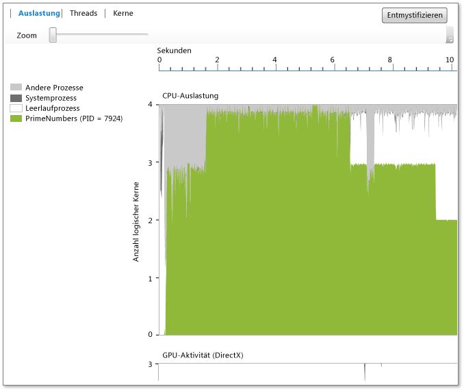

# Auslastungsansicht
In der **Auslastungsansicht** werden Informationen zur CPU, zur GPU sowie zu anderen Systemressourcen angezeigt, die vom aktuellen Prozess beansprucht werden (wählen Sie **Analysieren** > **Nebenläufigkeitsschnellansicht** aus, um die Nebenläufigkeitsschnellansicht zu starten). Hier wird die durchschnittliche Kernauslastung durch den analysierten Prozess, den Leerlaufprozess, den Systemprozess und andere Prozesse angezeigt, die auf dem System im Verlauf der Zeit ausgeführt werden. Es wird jedoch nicht angezeigt, welcher Kern zu einem bestimmten Zeitpunkt aktiv ist. Wenn beispielsweise zwei Kerne mit einer Kapazität von 50% während eines bestimmten Zeitraums aktiv sind, zeigt diese Ansicht einen logischen Kern, der verwendet wird. Die Ansicht wird generiert, indem die Profilerstellungszeit in kurze Zeitsegmente unterteilt wird. Für jedes Segment wird im Diagramm die durchschnittliche Anzahl von Prozessthreads ausgegeben, die während des Intervalls auf logischen Kernen ausgeführt werden.  
  
   
  
 Im Diagramm werden die Zeit (auf der x-Achse) und die durchschnittliche Anzahl der logischen Kerne angezeigt, die vom Zielprozess, vom Leerlaufprozess sowie vom Systemprozess verwendet werden. (Vom Leerlaufprozess werden Kerne im Leerlaufprozess angezeigt. Beim Systemprozess handelt es sich um einem Prozess in Windows, von dem Aufgaben für andere Prozesse ausgeführt werden können.) Die verbleibenden Prozesse, die unter dem Systemkonto zur Auslastung aller verbleibenden Kerne ausgeführt werden.  
  
 Die Anzahl der logischen Kerne wird auf der y-Achse angezeigt. Die Hardwareunterstützung von simultanem Multithreading (beispielsweise Hyper-Threading) wird von Windows wie logische Kerne behandelt. Deshalb wird ein System mit einem Prozessor mit vier Kernen, bei dem jeweils zwei Hardwarethreads pro Kern unterstützt werden, als System mit acht logischen Kernen angezeigt. Dies gilt auch für die Kernansicht. Weitere Informationen finden Sie unter [Cores View (Kernansicht)](../profiling/cores-view.md).  
  
 Im GPU-Aktivitätsdiagramm wird die Anzahl der im Verlauf der Zeit genutzten DirectX-Module angezeigt.  Ein Modul ist aktiv, wenn ein DAM-Paket verarbeitet wird.  Im Diagramm werden keine bestimmten DirectX-Module (z.B. 3D-Modul, Videomodul und andere Module) angezeigt.  
  
## Zweck  
 Die Auslastungsansicht ist der empfohlene Ausgangspunkt für Leistungsuntersuchungen mit der Nebenläufigkeitsschnellansicht. Hier steht eine Übersicht über den Parallelitätsgrad der Anwendung im Zeitverlauf zur Verfügung, wodurch sich schnell Bereiche ermitteln lassen, die eine Leistungsoptimierung oder Parallelisierung erfordern.  
  
 Wenn Sie sich für die Leistungsoptimierung interessieren, können Sie Verhaltensweisen ermitteln, die sich von Ihren Erwartungen unterscheiden. Auch können Sie nach Bereichen mit geringer Auslastung der logischen CPU-Kerne sowie nach der Ursache hierfür suchen. Zudem können Sie bei CPU und GPU nach Auslastungsmustern suchen.  
  
 Wenn Sie an der Parallelisierung einer Anwendung interessiert sind, suchen Sie in der Regel entweder nach CPU-gebundenen Ausführungsbereichen oder nach Bereichen, in denen die CPU nicht genutzt wird.  
  
 CPU-gebundene Bereiche werden grün dargestellt. Im Diagramm wird die Nutzung eines einzelnen Kerns angezeigt, wenn es sich um eine serielle Anwendung handelt.  
  
 Bereiche ohne CPU-Nutzung werden grau dargestellt. Hierbei kann es sich um Punkte handeln, an denen sich die Anwendung im Leerlauf befindet oder eine blockierende E/A ausgeführt wird, durch die sich Möglichkeiten zur Parallelisierung aufgrund einer Überschneidung mit anderen CPU-gebundenen Aufgaben ergeben.  
  
 Wenn Sie ein relevantes Verhalten ermittelt haben, können Sie die Ansicht der entsprechenden Region vergrößern, indem Sie sie auswählen. Nach dem Vergrößern können Sie zur Threadansicht oder zur Kernansicht wechseln, um eine ausführlichere Analyse vorzunehmen.  
  
 Wenn Sie die GPU mithilfe von C++ AMP oder DirectX verwenden, möchten Sie möglicherweise die Anzahl der ausgelasteten GPU-Module oder die Bereiche ermitteln, in denen sich die GPU unerwartet im Leerlauf befindet.  
  
## Zoomen  
 Wählen Sie zum Vergrößern der Ansicht des CPU-Auslastungsdiagramms oder des GPU-Aktivitätsdiagramms einen Abschnitt aus oder verwenden Sie den Zoomschieberegler über dem Diagramm. Die Zoomeinstellung bleibt erhalten, wenn Sie zu anderen Ansichten wechseln. Wenn Sie die Ansicht wieder verkleinern möchten, verwenden Sie den Zoomschieberegler. Alternativ können Sie auch Zoomen, indem Sie die STRG-TASTE drücken und Scrollen.  
  
## Siehe auch  
 [Concurrency Visualizer (Nebenläufigkeitsschnellansicht)](../profiling/concurrency-visualizer.md)   
 [Cores View (Kernansicht)](../profiling/cores-view.md)