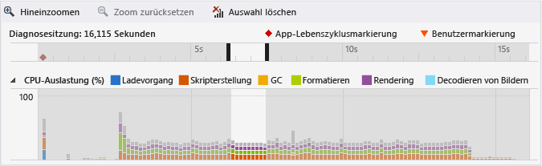
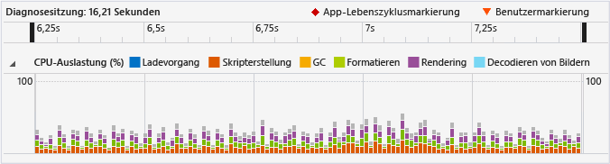
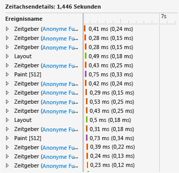
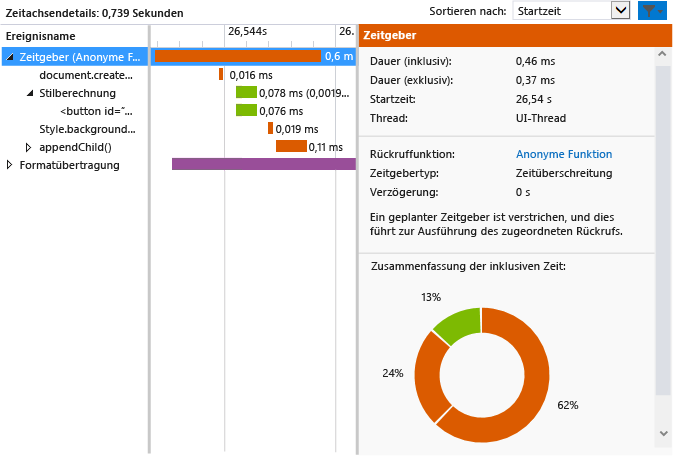

# <a name="walkthrough-improving-ui-responsiveness-html"></a>Exemplarische Vorgehensweise: Verbesserung der Reaktionsfähigkeit der Benutzeroberfläche (HTML)
Diese exemplarische Vorgehensweise führt Sie durch den Prozess zum Identifizieren und Beheben eines Leistungsproblems mithilfe des [Profilers für die HTML-UI-Reaktionsfähigkeit](../profiling/html-ui-responsiveness.md). Der Profiler ist in Visual Studio für universelle Windows-Apps und Windows Store-Apps verfügbar, die JavaScript verwenden. In diesem Szenario erstellen Sie eine Leistungstest-App, die DOM-Elemente zu häufig aktualisiert, und Sie verwenden den Profiler, um das Problem zu identifizieren und zu beheben.  
  
### <a name="creating-and-running-the-performance-test-app"></a>Erstellen und Ausführen der Leistungstest-App  
  
1.  Erstellen Sie in Visual Studio ein neues JavaScript-Projekt für Windows (universell). Wählen Sie **Datei > Neu > Projekt** aus. Wählen Sie im linken Bereich **JavaScript** und anschließend **Windows**, **Windows 10** und dann entweder **Universell** oder **Windows Phone** aus.  
  
2.  > [!IMPORTANT]
    >  Die in diesem Thema gezeigten Ergebnisse der Diagnose werden für Windows 8-Apps angezeigt.  
  
3.  Wählen Sie im mittleren Bereich eine leere Projektvorlage aus, zum Beispiel **Leere App**.  
  
4.  Geben Sie im Feld **Name** einen Namen wie `JS_Perf_Tester` an, und wählen Sie dann **OK** aus.  
  
5.  Öffnen Sie im **Projektmappen-Explorer** „default.html“, und fügen Sie den folgenden Code zwischen den \<body>-Tags ein:  
  
    ```html  
    <div class="wrapper">  
        <button id="content">Waiting for values</button>  
    </div>  
    ```  
  
6.  Öffnen Sie default.css, und fügen Sie den folgenden CSS-Code hinzu:  
  
    ```css  
    #content {  
        margin-left: 100px;  
        margin-top: 100px;  
    }  
    ```  
  
7.  Öffnen Sie default.js, und ersetzen Sie den gesamten Code mit dem folgenden Code:  
  
    ```javascript  
    (function () {  
        "use strict";  
  
        var app = WinJS.Application;  
        var activation = Windows.ApplicationModel.Activation;  
  
        var content;  
        var wrapper;  
  
        app.onactivated = function (args) {  
            if (args.detail.kind === activation.ActivationKind.launch) {  
                if (args.detail.previousExecutionState !== activation.ApplicationExecutionState.terminated) {  
  
                    content = document.getElementById("content");  
                    wrapper = document.querySelector(".wrapper");  
  
                    content.addEventListener("click", handler);  
  
                } else {  
                }  
  
                args.setPromise(WinJS.UI.processAll());  
            }  
        };  
  
        app.oncheckpoint = function (args) {  
        };  
  
        app.start();  
  
        var idx = 0;  
        var count = 0;  
        var max = 5000;  
        var text = ["what", "is", "the", "Matrix?"];  
        var color = ["red", "crimson", "maroon", "purple"];  
  
        function increment() {  
  
            setTimeout(function () {  
  
                idx++;  
                count++;  
  
                if (idx > 3) { idx = 0; }  
                if (count < max) { increment(); }  
  
            }, 1000);  
        }  
  
        function setValues() {  
  
            content = document.getElementById("content");  
            content.removeNode(true);  
  
            var newNode = document.createElement("button");  
            newNode.id = "content";  
            newNode.textContent = text[idx];  
            //newNode.textContent = getData();  
            newNode.style.backgroundColor = color[idx];  
            //newNode.style.animationName = "move";  
            //count++;  
  
            wrapper.appendChild(newNode);  
  
        }  
  
        function update() {  
  
            setTimeout(function () {  
  
                setValues();  
                if (count < max) { update(); }  
            });  
        }  
  
        function handler(args) {  
  
            content.textContent = "eenie";  
            increment();  
            update();  
        }  
  
    })();  
  
    ```  
  
8.  Drücken Sie die F5-TASTE, um das Debuggen zu starten. Überprüfen Sie, ob die Schaltfläche **Waiting for values** (Warten auf Werte) auf der Seite angezeigt wird.  
  
9. Wählen Sie **Waiting for values** (Warten auf Werte) aus, und überprüfen Sie, ob Text und Farbe der Schaltfläche ungefähr einmal pro Sekunde aktualisiert werden. Dieser Fehler ist entwurfsbedingt.  
  
10. Wechseln Sie zu Visual Studio zurück (ALT+TAB), und drücken Sie die Tastenkombination UMSCHALT+F5, um das Debugging zu beenden.  
  
     Nachdem Sie überprüft haben, dass die App funktioniert, können Sie mit dem Profiler deren Leistung überprüfen.  
  
### <a name="analyzing-performance-data"></a>Analysieren der Leistungsdaten  
  
1.  Wählen Sie in der Dropdownliste neben der Schaltfläche **Debuggen starten** auf der Symbolleiste **Debuggen** einen Windows Phone-Emulator oder den **Simulator** aus.  
  
2.  Klicken Sie im Menü **Debuggen** auf **Leistung und Diagnose**.  
  
3.  Wählen Sie unter **Verfügbare Tools** **HTML-UI-Reaktionsfähigkeit** aus, und wählen Sie dann **Starten** aus.  
  
     In diesem Lernprogramm fügen Sie den Profiler an das Startprojekt an. Informationen zu anderen Optionen, wie dem Anfügen des Profilers an eine installierte App, finden Sie unter [HTML-UI-Reaktionsfähigkeit](../profiling/html-ui-responsiveness.md).  
  
     Beim Start des Profilers wird möglicherweise eine Benutzerkontensteuerung die Berechtigung zum Ausführen der Datei "VsEtwCollector.exe" abfragen. Klicken Sie auf **Ja**.  
  
4.  Wählen Sie in der ausgeführten App **Waiting for values** (Warten auf Werte) aus, und warten Sie ca. 10 Sekunden. Überprüfen Sie, ob Text und Farbe der Schaltfläche ungefähr einmal pro Sekunde aktualisiert werden.  
  
5.  Wechseln Sie aus der ausgeführten App zu Visual Studio (ALT+TAB).  
  
6.  Wählen Sie **Sammlung beenden** aus.  
  
     Der Profiler zeigt Informationen auf einer neuen Registerkarte in Visual Studio an. Wenn Sie die Daten zu CPU-Auslastung und visuellem Durchsatz (FPS) betrachten, können Sie leicht einige Trends ermitteln:  
  
    -   Die CPU-Auslastung erhöht sich nach ungefähr 3 Sekunden deutlich (wenn Sie auf die Schaltfläche **Waiting for values** (Warten auf Werte) geklickt haben) und zeigt ab diesem Punkt ein klares Muster von Ereignissen an (eine gleichmäßige Mischung aus Skripterstellung, Formatieren und Rendern).  
  
    -   Der visuelle Durchsatz ist nicht betroffen, und der FPS-Wert bleibt bei einem Durchsatz von 60 (d. h., es gibt keine verworfenen Rahmen).  
  
     Sehen wir uns einen typischen Abschnitt des CPU-Auslastungsdiagramms an, um festzustellen, welche Vorgänge die App in diesem Zeitraum hoher Aktivität ausführt.  
  
7.  Wählen Sie einen ein- bis zweisekündigen Teil in der Mitte des CPU-Auslastungsdiagramms aus (entweder durch Klicken und Ziehen oder mithilfe der Registerkarte und der Pfeiltasten). Die folgende Abbildung zeigt das CPU-Auslastungsdiagramm, nachdem eine Auswahl getroffen wurde. Die Auswahl ist der nicht freigegebene Bereich.  
  
       
  
8.  Wählen Sie **Vergrößern** aus.  
  
     Das Diagramm wird geändert, um den ausgewählten Zeitraum ausführlicher anzuzeigen. Die folgende Abbildung zeigt das CPU-Auslastungsdiagramm, nachdem es vergrößert wurde. (Die spezifischen Daten können abweichen, aber das allgemeine Muster ist erkennbar.)  
  
       
  
     Die Zeitachsendetails im unteren Bereich zeigen ein Beispiel mit Details für den ausgewählten Zeitraum an.  
  
       
  
     Die Ereignisse in den Zeitachsedetails bestätigen sichtbare Entwicklungen im CPU-Auslastungsdiagramm: Es gibt viele Ereignisse, die innerhalb kurzer Zeiträume stattfinden. Die Zeitachsendetailansicht zeigt, dass diese Ereignisse `Timer`, `Layout`- und `Paint`-Ereignisse sind.  
  
9. Verwenden Sie das Kontextmenü für eines der `Timer`-Ereignisse im unteren Bereich (bzw. klicken Sie mit der rechten Maustaste darauf), und wählen Sie **Für Ereignis filtern** aus. Die folgende Abbildung zeigt ein Beispiel für Details, die typisch für eines der `Timer`-Ereignisse in dieser Test-App sind.  
  
       
  
     Eine Vielzahl von Fakten kann aus den Daten abgeleitet werden. Zum Beispiel:  
  
    -   Jedes `Timer`-Ereignis ist farbcodiert, um es als scripting-Ereignis zu identifizieren. Es enthält einen `document.createElement`-Aufruf, gefolgt von einer Formatberechnung und einem Aufruf von `style.backgroundColor` und `appendChild()`.  
  
    -   In dem kurzen ausgewählten Zeitraum (ungefähr ein bis zwei Sekunden), gibt es viele `Timer`-, `Layout`- und `Paint`-Ereignisse, die stattfinden. Die `Timer`-Ereignisse treten viel häufiger auf als das eine Update pro Sekunde, das sichtbar ist, nachdem Sie die App ausgeführt und auf die Schaltfläche **Waiting for values** (Warten auf Werte) geklickt haben.  
  
10. Um dies zu untersuchen, wählen Sie den Link zu der anonymen Funktion für eines der `Timer`-Ereignisse im unteren linken Bereich. Die folgende Funktion wird in default.js geöffnet:  
  
    ```javascript  
    function update() {  
  
        setTimeout(function () {  
  
            setValues();  
            if (count < max) { update(); }  
        });  
    }  
    ```  
  
     Diese rekursive Funktion richtet eine Schleife ein, welche die `setValues()`-Funktion aufruft, die die Schaltfläche in der Benutzeroberfläche aktualisiert. Wenn Sie die verschiedenen Zeitgeberereignisse im Profiler untersuchen, werden Sie feststellen, dass die meisten davon oder alle aus diesem Code resultieren, der zu häufig ausgeführt wird. Es ist also wahrscheinlich, dass das Problem aus diesem Code stammt.  
  
### <a name="fixing-the-performance-issue"></a>Korrigieren des Leistungsproblems  
  
1.  Ersetzen Sie die `update()`-Funktion durch den folgenden Code:  
  
    ```javascript  
    function update() {  
  
        setTimeout(function () {  
  
            setValues();  
            if (count < max) { update(); }  
        }, 1000 );  
    }  
    ```  
  
     Diese feste Version des Codes enthält eine 1000-Millisekunden-Verzögerung, die aus der früheren Version des Codes weggelassen wurde, was zur Verwendung eines Standardverzögerungswerts führte. Auf Basis der Profilerdaten ist anzunehmen, dass der Standardwert 0 Millisekunden beträgt, wodurch die `setValues()`-Funktion zu häufig ausgeführt wird.  
  
2.  Führen Sie den Profiler für die HTML-UI-Reaktionsfähigkeit erneut aus, und überprüfen Sie das CPU-Auslastungsdiagramm. Sie werden feststellen, dass die überzähligen Ereignisse verschwunden sind und die CPU-Auslastung beinahe auf null gesunken ist. Problem behoben!  
  
## <a name="see-also"></a>Siehe auch  
 [HTML-UI-Reaktionsfähigkeit](../profiling/html-ui-responsiveness.md)
