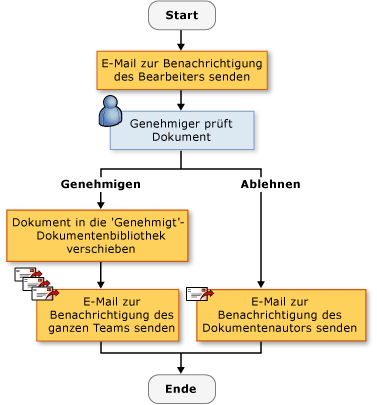
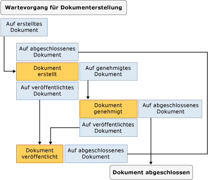

# Erstellen von SharePoint-Workflow-Projektmappen
  [!INCLUDE[vsprvs](../sharepoint/includes/vsprvs-md.md)] bietet Tools, mit denen Sie benutzerdefinierte Workflows zu erstellen, die den Lebenszyklus der Dokumente und Listenelemente in einer SharePoint-Website zu verwalten. Die bereitgestellten Elemente umfassen einen Designer, einen Satz von Aktivitätssteuerelementen sowie die erforderlichen Assemblyverweise. [!INCLUDE[vsprvs](../sharepoint/includes/vsprvs-md.md)] umfasst auch die **Assistent zum Anpassen von SharePoint**, damit die erstellen und Konfigurieren von Workflows.  
  
 Die Liste der erforderlichen Komponenten zum Erstellen von SharePoint-Projekte in [!INCLUDE[vsprvs](../sharepoint/includes/vsprvs-md.md)], finden Sie unter [Anforderungen für die Entwicklung von SharePoint-Lösungen](../sharepoint/requirements-for-developing-sharepoint-solutions.md). Weitere Informationen zu SharePoint finden Sie unter [Microsoft SharePoint Products and Technologies](http://go.microsoft.com/fwlink/?LinkId=178470).  
  
## Workflows in SharePoint  
 Wenn Sie einen Workflow zu einer SharePoint-Bibliothek oder Liste hinzufügen, erzwingen Sie einen Geschäftsprozess für alle Elemente in der Liste oder Bibliothek an. Ein Workflow beschreibt die Aktionen, die vom System oder Benutzer ausführen müssen, für jedes Element, wie etwa das Versenden des Elements bearbeitet und anschließend überprüft werden. Diese Aktionen, die genannte *Aktivitäten*, sind die Bausteine des Workflows.  
  
 Sie können im SharePoint-Workflows erstellen [!INCLUDE[vsprvs](../sharepoint/includes/vsprvs-md.md)] und für eine SharePoint-Website bereitstellen. Nachdem ein Workflow in SharePoint bereitgestellt wird, ordnen Sie es mit einer Bibliothek oder der Liste ein. Es kann dann automatisch von einem Prozess oder manuell von einem Benutzer gestartet werden. Weitere Informationen zu Workflowvorgang, finden Sie unter [Entwickeln von SharePoint-Workflows, die mit Visual Studio](https://docs.microsoft.com/sharepoint/dev/general-development/develop-sharepoint-workflows-using-visual-studio).  
  
## Erstellen von benutzerdefinierten SharePoint-Workflows  
 Zwei SharePoint-Workflowprojekte stehen Ihnen in [!INCLUDE[vsprvs](../sharepoint/includes/vsprvs-md.md)]: **sequenzieller Workflow** und **Zustandsautomatenworkflow**.  
  
 Ein *sequenzieller Workflow* stellt eine Reihe von Schritten. Die Schritte werden nacheinander ausgeführt, bis die letzte Aktivität abgeschlossen ist. Sequenzielle Workflows sind immer streng sequenziell ausgeführt. Da sie externe Ereignisse empfangen und parallele logische Abläufe enthalten können, variieren die genaue Reihenfolge der Ausführung. Die folgende Abbildung zeigt ein Beispiel für einen sequenziellen Workflow.  
  
   
  
 Ein *zustandsautomatenworkflow* stellt eine Reihe von Zuständen, Übergängen und Aktionen. Die Schritte in einem Zustandsautomatworkflow werden asynchron ausgeführt. Dies bedeutet, dass sie nach dem anderen nicht unbedingt ausgeführt werden, aber von Aktionen und Zuständen ausgelöst werden. Ein Zustand als den Startzustand zugewiesen ist, und klicken Sie dann, basierend auf ein Ereignis, ein Übergang in einen anderen Zustand. Das Zustandsautomat kann über einen Endzustand verfügen, der das Ende des Workflows bestimmt. Das folgende Diagramm zeigt ein Beispiel von einem Statuscomputer-Workflow.  
  
   
  
 Weitere Informationen zu Workflowtypen, finden Sie unter [Workflowtypen](http://go.microsoft.com/fwlink/?LinkId=178995).  
  
### Mithilfe des Assistenten  
 Beim Erstellen einer SharePoint-Workflowprojekt in [!INCLUDE[vsprvs](../sharepoint/includes/vsprvs-md.md)], geben Sie zunächst die Einstellungen in der **Assistent zum Anpassen von SharePoint**. Der Assistent verwendet diese Einstellungen zum Erstellen eines Projekts in **Projektmappen-Explorer**. Dieses Projekt enthält eine Codedatei, mehrere Dateien, die zum Bereitstellen des Workflows verwendet werden, und Verweise auf Assemblys, die zum Erstellen eines benutzerdefinierten SharePoint-Workflows erforderlich sind.  
  
 Nachdem Sie den Workflow erstellt haben, können Sie seine Eigenschaften im Eigenschaftenfenster ändern. Obwohl die meisten Workfloweigenschaften direkt im Eigenschaftenfenster geändert werden können, erfordern einige auf eine Schaltfläche mit Auslassungspunkten (), Ändern Sie ihre Werte. Diese Schaltfläche Neustart der **Assistent zum Anpassen von SharePoint**. Nachdem Sie die Eigenschaft-Wert ändert, wählen Sie haben die **Fertig stellen** Schaltfläche, um diese zu beenden.  
  
> [!NOTE]  
>  Die **Workflowtyp** -Eigenschaft ist schreibgeschützt und kann nicht geändert werden. Wenn Sie den Workflow ändern möchten, müssen Sie einen anderen Workflow erstellen.  
  
## Entwerfen einen SharePoint-Workflow  
 Nachdem Sie alle Schritte im Geschäftsprozess definieren, verwenden Sie die [!INCLUDE[vsprvs](../sharepoint/includes/vsprvs-md.md)] Workflow-Designer auf den SharePoint-Workflow entwerfen. Um den Designer zu öffnen, doppelklicken Sie auf Workflow1.cs oder Workflow1.vb in **Projektmappen-Explorer**, oder öffnen Sie das Kontextmenü für eine der Dateien, und wählen Sie dann **öffnen**.  
  
### Aktivitäten  
 Fügen Sie zum Entwerfen eines Workflows Aktivitäten aus der **Toolbox** auf eine *Workflowzeitplan* im Designer. Ein Workflowzeitplan enthält die Abfolge von Aktivitäten in der Reihenfolge, in der sie ausgeführt werden soll.  
  
 Es gibt zwei Arten von Aktivitäten:  
  
-   *Einfache Aktivitäten* führen Sie eine einzelne Arbeitseinheit, z. B. "Verzögerung für einen Tag" oder "Webdienst starten".  
  
-   *Zusammengesetzte Aktivitäten* andere Aktivitäten enthalten, die eine bedingte Aktivität kann z. B. zwei Verzweigungen enthalten.  
  
 Beide Arten von Aktivitäten stehen in der **Toolbox**.  
  
 Aktivitäten können Eigenschaften, Methoden und Ereignisse aufweisen. Verwenden der **Eigenschaften** Fenster zum Festlegen der Eigenschaften einer Aktivität.  
  
 Sie können auch eine benutzerdefinierte Aktivität erstellen. Weitere Informationen finden Sie unter [Exemplarische Vorgehensweise: Erstellen einer benutzerdefinierten Websiteworkflowaktivität](../sharepoint/walkthrough-create-a-custom-site-workflow-activity.md).  
  
 Aktivitäten sind in den folgenden Registerkarten unterteilt die **Toolbox**:  
  
-   **SharePoint-Workflow**  
  
-   **Windows Workflow v3. 0**  
  
-   **Windows Workflow v3. 5**  
  
 Nicht alle Core-Workflow-Aktivitäten werden von SharePoint unterstützt. Weitere Informationen finden Sie unter [Workflow Aktivitäten für Windows SharePoint Services Overview](http://go.microsoft.com/fwlink/?LinkID=156094).  
  
#### SharePoint-Workflow-Aktivitäten  
 Die **SharePoint-Workflow** Registerkarten enthalten spezielle Aktivitäten für die Verwendung in [!INCLUDE[wss_14_long](../sharepoint/includes/wss-14-long-md.md)]. Diese Aktivitäten vereinfachen und optimieren die Entwicklung von Dokumentlebenszyklus-Workflows. Weitere Informationen zu den aufgeführten Aktivitäten der **SharePoint-Workflow** finden Sie unter [Workflow Aktivitäten für Windows SharePoint Services Overview](http://go.microsoft.com/fwlink/?LinkID=156094).  
  
#### Windows Workflow-Aktivitäten  
 Die **Windows Workflow** Registerkarten enthalten die Aktivitäten, die von bereitgestellt werden die [!INCLUDE[TLA#tla_workflow](../sharepoint/includes/tlasharptla-workflow-md.md)]. Diese Aktivitäten können Sie die um Workflow-Zeitpläne für jede Art von Windows Workflow-Anwendung zu erstellen.  
  
 Weitere Informationen zu den aufgeführten Aktivitäten der **Windows-Workflows** finden Sie unter [Windows Workflow Foundation-Aktivitäten](http://go.microsoft.com/fwlink/?LinkID=156096). Weitere Informationen zu Windows Workflow Foundation, finden Sie unter [Übersicht über die Windows Workflow Foundation](http://go.microsoft.com/fwlink/?LinkID=128632).  
  
### Arbeiten mit Aktivitäten im Designer  
 Die Workflowzeitplan kann eine Kombination von Windows Workflow-Aktivitäten und SharePoint-Workflow-Aktivitäten enthalten.  
  
 Der Designer zeigt visuelle Hinweise zum Positionieren und Aktivitäten ordnungsgemäß zu konfigurieren. Beim Ziehen oder kopieren Sie eine Aktivität auf dem Workflowzeitplan, zeigt der Designer grünes Pluszeichen (+) Symbole, die Sie die gültige Positionen für diese Aktivität im Workflow anzuzeigen. Sie können keine Aktivität an einem Ort positionieren, wo es nicht gültig wäre. Sie können nicht z. B. eine Send-Aktivität als erste Aktivität in einer Verzweigung der warten-Aktivität positionieren. Weitere Informationen finden Sie unter [SharePoint Designer-Entwicklercenter](http://go.microsoft.com/fwlink/?LinkId=178476).  
  
## Sammeln von Informationen während des Workflows  
 Möglicherweise möchten Sie Informationen von Benutzern sammeln vordefinierten Zeitpunkten im Workflow. Sie können Informationen sammeln, indem Sie mithilfe von Formularen oder Elementeigenschaften.  
  
### Formulare  
 Formen sind z. B. Dialogfelder, die Fragen enthalten, und geben Sie die Möglichkeiten zum Antworten zu geben.  
  
 Es gibt vier Arten von Formularen, die in einem Workflow verwendet werden können:  
  
-   Zuordnung  
  
-   Initiierung  
  
-   Änderung  
  
-   Aufgabe  
  
 Von diesen [!INCLUDE[vsprvs](../sharepoint/includes/vsprvs-md.md)] beinhaltet Elementvorlagen für Zuordnungs-und Initiierungsformularen. Ein Beispiel für eine *Zuordnungsformular* ist eine, die mit dem Administrator, installieren den Workflow können Geben Sie Parameter, die für den Workflow, z. B. ein Ausgabenlimit für einen Workflow Ausgaben beziehen. Ein Beispiel für eine *Initiierungsformular* ist ein, mit dem den Benutzer eines Workflows Ausgaben Geben Sie den Betrag an den Workflow. Weitere Informationen zu diesen Formen finden Sie unter [SharePoint-Projekte und Projektelementvorlagen](../sharepoint/sharepoint-project-and-project-item-templates.md).  
  
### Elementeigenschaften  
 Sie können Informationen auch mithilfe der Eigenschaften eines Elements in der SharePoint-Bibliothek oder eine Liste von Benutzern sammeln. Die Hauptcodedatei (Workflow1.cs oder Workflow1.vb) wird eine Instanz der Microsoft.SharePoint.Workflow.SPWorkflowActivationProperties.WorkflowProperties-Klasse, die mit dem Namen deklariert `workflowProperties`. Verwenden der `workflowProperties` Objekt, das die Eigenschaften der Bibliothek oder Liste im Code zugreifen. Ein Beispiel finden Sie unter [Exemplarische Vorgehensweise: Erstellen und Debuggen einer SharePoint-Workflow-Lösung](../sharepoint/walkthrough-creating-and-debugging-a-sharepoint-workflow-solution.md).  
  
## Debuggen einer SharePoint-Workflow-Vorlage  
 Sie können Debuggen einer SharePoint-Workflowprojekt dieselbe wie bei anderen [!INCLUDE[vsprvs](../sharepoint/includes/vsprvs-md.md)] webbasierte Projekte. Beim Starten der [!INCLUDE[vsprvs](../sharepoint/includes/vsprvs-md.md)] -Debugger, [!INCLUDE[vsprvs](../sharepoint/includes/vsprvs-md.md)] verwendet die Einstellungen, die Sie, in angeben der **Assistent zum Anpassen von SharePoint** öffnen Sie die entsprechende SharePoint-Website und die Workflowvorlage automatisch zuordnen mit der entsprechenden Bibliothek oder der Liste. [!INCLUDE[vsprvs](../sharepoint/includes/vsprvs-md.md)] Außerdem fügt der [!INCLUDE[vsprvs](../sharepoint/includes/vsprvs-md.md)] debugger an die [!INCLUDE[wss_14_long](../sharepoint/includes/wss-14-long-md.md)] Prozess w3wp.exe Namens.  
  
 Um den Workflow zu testen, müssen Sie ihn manuell starten. Weitere Informationen finden Sie im Abschnitt "Debuggen von Workflows" in [Debuggen von SharePoint-Lösungen](../sharepoint/debugging-sharepoint-solutions.md). Weitere Informationen zu [!INCLUDE[vsprvs](../sharepoint/includes/vsprvs-md.md)] Anwendungsdebugging angezeigt wird, finden Sie unter [Debuggen von Webanwendungen und Skripts](/visualstudio/debugger/debugging-web-applications-and-script).  
  
## Bereitstellen einer SharePoint-Workflow-Vorlage  
 [!INCLUDE[vsprvs](../sharepoint/includes/vsprvs-md.md)] Bereitstellen von SharePoint-Workflow-Projekte wie andere [!INCLUDE[vsprvs](../sharepoint/includes/vsprvs-md.md)] SharePoint-Projekte. Weitere Informationen finden Sie unter [Verpacken und Bereitstellen von SharePoint-Lösungen](../sharepoint/packaging-and-deploying-sharepoint-solutions.md).  
  
## Importieren von Global Wiederverwendbaren Workflows  
 Zusätzlich zu den standortspezifischen wieder verwendbaren Workflows erstellen, SharePoint-Designer ermöglicht Ihnen die Erstellung *Global wiederverwendbare Workflows*, welche sind Workflows, die von SharePoint-Website verwendet werden können. Das Projekt "Wiederverwendbaren Workflow importieren" in [!INCLUDE[vsprvs](../sharepoint/includes/vsprvs-md.md)] derzeit nicht global wiederverwendbare Workflows importieren. Allerdings können entweder mit dem eine Global wieder verwendbaren Workflows in einer wiederverwendbaren Workflows umgewandelt SharePoint Designer oder der Workflow als nicht konvertierten deklarativen Workflow importieren. Weitere Informationen finden Sie unter [Importieren von Elementen aus einer vorhandenen SharePoint-Website](../sharepoint/importing-items-from-an-existing-sharepoint-site.md).  
  
## Verwandte Themen  
  
|Titel|Beschreibung|  
|-----------|-----------------|  
|[Exemplarische Vorgehensweise: Erstellen und Debuggen einer SharePoint-Workflow-Projektmappe](../sharepoint/walkthrough-creating-and-debugging-a-sharepoint-workflow-solution.md)|Führt Sie schrittweise durch das Erstellen und Debuggen eines einfachen [!INCLUDE[vsprvs](../sharepoint/includes/vsprvs-md.md)] Workflow.|  
|[Exemplarische Vorgehensweise: Erstellen eines Workflows mit Zuordnungs- und Initiierungsformularen](../sharepoint/walkthrough-creating-a-workflow-with-association-and-initiation-forms.md)|Führt Sie schrittweise zu erstellen, einen größeren Funktionsumfang [!INCLUDE[vsprvs](../sharepoint/includes/vsprvs-md.md)] Workflows mit Zuordnungs-und Initiierungsformularen nicht abgeschlossen.|  
|[Exemplarische Vorgehensweise: Hinzufügen einer Anwendungsseite zu einem Workflow](../sharepoint/walkthrough-add-an-application-page-to-a-workflow.md)|Baut auf das Thema [Exemplarische Vorgehensweise: Erstellen eines Workflows mit Zuordnungs- und Initiierungsformularen](../sharepoint/walkthrough-creating-a-workflow-with-association-and-initiation-forms.md) durch Hinzufügen einer zusätzlichen ASPX-Anwendungsseite, der an den Workflow eingegebenen Daten angibt.|  
|[Exemplarische Vorgehensweise: Erstellen einer benutzerdefinierten Websiteworkflowaktivität](../sharepoint/walkthrough-create-a-custom-site-workflow-activity.md)|Veranschaulicht, wie zwei wesentliche Aufgaben zu erledigen: Erstellen eines Workflows Websiteebene und erstellen eine benutzerdefinierten Workflowaktivität.|  
|[Exemplarische Vorgehensweise: Importieren eines wiederverwendbaren Workflows aus SharePoint-Designer in Visual Studio](../sharepoint/walkthrough-import-a-sharepoint-designer-reusable-workflow-into-visual-studio.md)|Veranschaulicht das Importieren von wiederverwendbaren deklarativen Workflows, die in SharePoint Designer 2010 in erstellt ein [!INCLUDE[vsprvs](../sharepoint/includes/vsprvs-md.md)] SharePoint-Projekt.|  
  
## Siehe auch  
 [Entwickeln von SharePoint-Lösungen](../sharepoint/developing-sharepoint-solutions.md)   
 [Erstellen und Debuggen von SharePoint-Lösungen](../sharepoint/building-and-debugging-sharepoint-solutions.md)   
 [Erstellen von Anwendungsseiten für SharePoint](../sharepoint/creating-application-pages-for-sharepoint.md)  
  
  