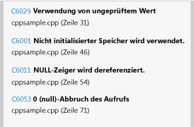
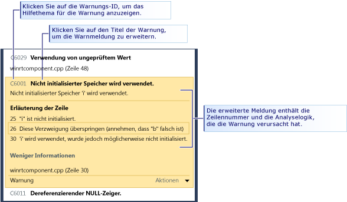
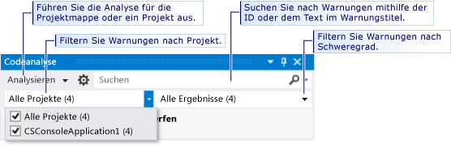

# Analysieren der Qualität des C++-Codes von Store-Apps mit der statischen Codeanalyse von Visual Studio
  
  
 Das Codeanalysetool in Visual Studio Express-Editionen überprüft den Code auf eine Reihe von allgemeinen Fehlern und auf Verstöße gegen gebräuchliche Programmiergrundlagen. Codeanalysewarnungen unterscheiden sich von Compilerfehlern und -warnungen, da die Codeanalyse nach bestimmten Codeschemata sucht, die gültig sind, jedoch Probleme für Sie oder andere Personen bereiten können, die den Code verwenden. Codeanalyse kann auch Fehler im Code suchen, die schwierig durch Tests zu erkennen sind. Das regelmäßige Ausführen des Codeanalysetools während des Entwicklungsprozesses kann die Qualität der App erhöhen.  
  
> [!NOTE]
>  In Visual Studio Ultimate, Visual Studio Premium und Visual Studio Professional können Sie sämtliche Funktionen der Codeanalysetools verwenden. Siehe [Analysieren der Anwendungsqualität mit Codeanalysetools](http://msdn.microsoft.com/library/dd264897.aspx) in der MSDN Library.  
  
## In diesem Thema  
 Erfahren Sie:  
  
 [Ausführen der Codeanalyse](../test/analyze-cpp-code-quality-of-store-apps-using-visual-studio-static-code-analysis.md#BKMK_Run)  
  
 [Analysieren und Auflösen von Codeanalysewarnungen](../test/analyze-cpp-code-quality-of-store-apps-using-visual-studio-static-code-analysis.md#BKMK_Analyze)  
  
 [Unterdrücken der Codeanalysewarnungen](../test/analyze-cpp-code-quality-of-store-apps-using-visual-studio-static-code-analysis.md#BKMK_Suppress)  
  
 [Durchsuchen und Filtern von Codeanalyseergebnissen](../test/analyze-cpp-code-quality-of-store-apps-using-visual-studio-static-code-analysis.md#BKMK_Search)  
  
 [C++-Codeanalysewarnungen](../test/analyze-cpp-code-quality-of-store-apps-using-visual-studio-static-code-analysis.md#Warnings)  
  
##   Ausführen der Codeanalyse  
 So führen Sie die Codeanalyse in der Visual Studio-Projektmappe aus  
  
-   Wählen Sie im Menü **Build** die Option **Codeanalyse für Lösung ausführen** aus.  
  
 So führen Sie die Codeanalyse beim Erstellen eines Projekts jedes Mal automatisch aus  
  
1.  Wählen Sie im Projektmappen-Explorer den Projektnamen und dann**Eigenschaften** aus.  
  
2.  Wählen Sie auf der Seite der Projekteigenschaften **Codeanalyse** aus, und wählen Sie dann **Codeanalyse für C/C++ auf Build aktivieren** aus.  
  
 Die Projektmappe wird kompiliert und die Codeanalyse ausgeführt. Die Ergebnisse werden im Codeanalysefenster angezeigt.  
  
   
  
##   Analysieren und Auflösen von Codeanalysewarnungen  
 Um eine bestimmte Warnung zu analysieren, wählen Sie den Titel der Warnung im Fenster "Codeanalyse" aus. Die Warnung wird erweitert, um ausführliche Informationen zum Problem anzuzeigen. Wenn möglich, zeigt die Codeanalyse die Zeilennummer und die Analyselogik an, die zu der Warnung geführt haben.  
  
   
  
 Wenn Sie eine Warnung erweitern, werden die Codezeilen, die die Warnung verursacht haben, im Visual Studio-Code-Editor hervorgehoben.  
  
   
  
 Nachdem Sie das Problem verstanden haben, können Sie es in Ihrem Code beheben. Wiederholen Sie die Codeanalyse, um sicherzustellen, dass die Warnung nicht mehr im Codeanalysefenster angezeigt wird und dass die Lösung des Problems keine neuen Warnungen ausgelöst hat.  
  
> [!TIP]
>  Sie können die Codeanalyse im Codeanalysefenster erneut ausführen. Klicken Sie auf die Schaltfläche **Analysieren**, und wählen Sie dann den Bereich der Analyse aus. Sie können die Analyse für die gesamte Projektmappe oder für ein ausgewähltes Projekt erneut ausführen.  
  
##   Unterdrücken der Codeanalysewarnungen  
 Mitunter möchten Sie möglicherweise darauf verzichten, eine Codeanalysewarnung zu korrigieren. So kann es beispielsweise vorkommen, dass das Auflösen der Warnung im Verhältnis zur Wahrscheinlichkeit, dass das Problem in einer realen Implementierung des Codes auftritt, eine zu große Bearbeitung des Codes erfordert. Oder Sie gehen davon aus, dass die für die Warnung verwendete Analyse für den jeweiligen Kontext ungeeignet ist. Sie können Warnungen unterdrücken, sodass diese nicht mehr im Codeanalysefenster angezeigt werden.  
  
 So unterdrücken Sie eine Warnung  
  
1.  Wenn die ausführlichen Informationen nicht angezeigt werden, erweitern Sie den Titel der Warnung.  
  
2.  Wählen Sie unten in der Warnung den Link **Aktionen** aus.  
  
3.  Wählen Sie **Meldung unterdrücken** und dann **In Quelle** aus.  
  
 Unterdrücken einer Meldung fügt `#pragma(warning:`*WarningId*`)` ein, das die Warnung für die Codezeile unterdrückt.  
  
##   Suchen und Filtern der Codeanalyseergebnisse  
 Sie können lange Listen mit Warnmeldungen durchsuchen und Warnungen in Projektmappen mit mehreren Projekten filtern.  
  
   
  
##   C++-Codeanalysewarnungen  
 Die Codeanalyse gibt die folgenden Warnungen für C++-Code aus:  
  
|Regel|Beschreibung|  
|----------|-----------------|  
|[C6001](../code-quality/c6001.md)|Nicht initialisierter Speicher wird verwendet|  
|[C6011](../code-quality/c6011.md)|Dereferenzierender NULL-Zeiger|  
|[C6029](../code-quality/c6029.md)|Verwendung von ungeprüftem Wert|  
|[C6053](../code-quality/c6053.md)|0 (null)-Abbruch des Aufrufs|  
|[C6059](../code-quality/c6059.md)|Fehlerhafte Verkettung|  
|[C6063](../code-quality/c6063.md)|Fehlendes Zeichenfolgenargument für Formatfunktion|  
|[C6064](../code-quality/c6064.md)|Fehlendes Ganzzahlargument für Formatfunktion|  
|[C6066](../code-quality/c6066.md)|Fehlendes Zeigerargument für Formatfunktion|  
|[C6067](../code-quality/c6067.md)|Fehlendes Zeichenfolgenzeigerargument für Formatfunktion|  
|[C6101](../code-quality/c6101.md)|Rückgabe von nicht initialisiertem Speicher|  
|[C6200](../code-quality/c6200.md)|Index überschreitet maximale Puffergröße|  
|[C6201](../code-quality/c6201.md)|Index überschreitet maximale Puffergröße|  
|[C6270](../code-quality/c6270.md)|Fehlendes Gleitkommaargument für Formatfunktion|  
|[C6271](../code-quality/c6271.md)|Zusätzliches Argument für Formatfunktion|  
|[C6272](../code-quality/c6272.md)|Nicht-Gleitkommaargument für Formatfunktion|  
|[C6273](../code-quality/c6273.md)|Nicht-Ganzzahlargument für Formatfunktion|  
|[C6274](../code-quality/c6274.md)|Nicht-Zeichenargument für Formatfunktion|  
|[C6276](../code-quality/c6276.md)|Ungültige Zeichenfolgenumwandlung|  
|[C6277](../code-quality/c6277.md)|Ungültiger CreateProcess-Aufruf|  
|[C6284](../code-quality/c6284.md)|Ungültiges Objekt-Argument für Formatfunktion|  
|[C6290](../code-quality/c6290.md)|Logischer NOT-Operator hat Vorrang gegenüber bitweisem AND-Operator|  
|[C6291](../code-quality/c6291.md)|Logischer NOT-Operator hat Vorrang gegenüber bitweisem OR-Operator|  
|[C6302](../code-quality/c6302.md)|Ungültiges Zeichenfolgenargument für Formatfunktion|  
|[C6303](../code-quality/c6303.md)|Ungültiges Zeichenfolgenargument für breite Zeichen zu Formatfunktion|  
|[C6305](../code-quality/c6305.md)|Keine Übereinstimmung bei Größe und Count-Verwendung|  
|[C6306](../code-quality/c6306.md)|Falscher Variablenargument-Funktionsaufruf|  
|[C6328](../code-quality/c6328.md)|Möglicher Argumenttypenkonflikt|  
|[C6385](../code-quality/c6385.md)|Leseüberlauf|  
|[C6386](../code-quality/c6386.md)|Schreibüberlauf|  
|[C6387](../code-quality/c6387.md)|Ungültiger Parameterwert|  
|[C6500](../code-quality/c6500.md)|Ungültige Attributeigenschaft|  
|[C6501](../code-quality/c6501.md)|In Konflikt stehende Attributeigenschaftswerte|  
|[C6503](../code-quality/c6503.md)|Verweise dürfen nicht NULL sein.|  
|[C6504](../code-quality/c6504.md)|NULL auf Nichtzeiger|  
|[C6505](../code-quality/c6505.md)|MustCheck für "void"|  
|[C6506](../code-quality/c6506.md)|Puffergröße auf Nichtzeiger oder Array|  
|[C6507](http://msdn.microsoft.com/en-us/18f88cd1-d035-4403-a6a4-12dd0affcf21)|NULL-Konflikt bei 0 Dereferenzierung|  
|[C6508](../code-quality/c6508.md)|Schreibzugriff auf Konstante|  
|[C6509](../code-quality/c6509.md)|Rückgabe wurde für Vorbedingung verwendet|  
|[C6510](../code-quality/c6510.md)|NULL für Nichtzeiger abgebrochen|  
|[C6511](../code-quality/c6511.md)|MustCheck Muss "Ja" oder "Nein" lauten|  
|[C6513](../code-quality/c6513.md)|Elementgröße ohne Puffergröße|  
|[C6514](../code-quality/c6514.md)|Puffergröße übersteigt Arraygröße|  
|[C6515](../code-quality/c6515.md)|Puffergröße auf Nichtzeiger|  
|[C6516](../code-quality/c6516.md)|Keine Eigenschaften für Attribut|  
|[C6517](../code-quality/c6517.md)|Zulässige Größe für nicht lesbaren Puffer|  
|[C6518](../code-quality/c6518.md)|Schreibbare Größe für Puffer, der nicht geschrieben werden kann|  
|[C6519](http://msdn.microsoft.com/en-us/2b6326b0-0539-4d26-8fb1-720114933232)|Ungültige Anmerkung: Wert für die Eigenschaft "NeedsRelease" muss "Ja" oder "Nein" sein|  
|[C6521](http://msdn.microsoft.com/en-us/e98d0ae3-6f13-47b2-9a15-15d4055af9ef)|Ungültige Größenzeichenfolgendereferenzierung|  
|[C6522](../code-quality/c6522.md)|Ungültiger Größenzeichenfolgentyp|  
|[C6523](http://msdn.microsoft.com/en-us/11397a31-b224-46b0-afb7-d49ca576a3bb)|Ungültiger Größenzeichenfolgenparameter|  
|[C6525](../code-quality/c6525.md)|Ungültiger Größenzeichenfolgenstandort|  
|[C6526](http://msdn.microsoft.com/en-us/59c590c7-0098-4166-a1ac-87f324596002)|Ungültiger Größenzeichenfolgen-Puffertyp|  
|[C6527](../code-quality/c6527.md)|Ungültige Anmerkung: Die 'NeedsRelease'-Eigenschaft kann nicht für Werte des void-Typs verwendet werden.|  
|[C6530](../code-quality/c6530.md)|Unbekannter Formatzeichenfolgenstil|  
|[C6540](../code-quality/c6540.md)|Bei Verwendung von Attributanmerkungen für diese Funktion werden alle vorhandenen, zugehörigen __declspec-Anmerkungen ungültig|  
|[C6551](../code-quality/c6551.md)|Ungültige Größenangabe: Ausdruck nicht analysierbar|  
|[C6552](../code-quality/c6552.md)|Ungültiger Deref= oder Notref=: Ausdruck nicht analysierbar|  
|[C6701](../code-quality/c6701.md)|Der Wert ist kein gültiger Yes/No/Maybe-Wert|  
|[C6702](../code-quality/c6702.md)|Der Wert ist kein Zeichenfolgenwert|  
|[C6703](../code-quality/c6703.md)|Der Wert ist keine Zahl|  
|[C6704](../code-quality/c6704.md)|Unerwarteter Ausdrucksfehler der Anmerkung|  
|[C6705](../code-quality/c6705.md)|Erwartete Anzahl von Argumenten für die Anmerkung stimmt nicht mit tatsächlicher Anzahl von Argumenten für die Anmerkung überein|  
|[C6706](../code-quality/c6706.md)|Unerwarteter Anmerkungsfehler für Anmerkung|  
|[C28021](../code-quality/c28021.md)|Der Parameter, der mit Anmerkungen versehen ist, muss ein Zeiger sein.|  
|[C28182](../code-quality/c28182.md)|Dereferenzierender NULL-Zeiger. Der Zeit enthält denselben NULL-Wert wie ein anderer Zeiger.|  
|[C28202](../code-quality/c28202.md)|Illegaler Verweis auf nicht statischen Member|  
|[C28203](../code-quality/c28203.md)|Mehrdeutiger Verweis auf Klassenmember.|  
|[C28205](../code-quality/c28205.md)|_Success\_ oder _On_failure\_ wurde in einem illegalen Kontext verwendet|  
|[C28206](../code-quality/c28206.md)|„->“ verwenden, wenn linker Operand auf eine Struktur zeigt|  
|[C28207](../code-quality/c28207.md)|„.“ verwenden, wenn linker Operand eine Struktur ist|  
|[C28210](../code-quality/c28210.md)|Anmerkungen für den _On_failure_-Kontext dürfen sich nicht im expliziten Vorkontext befinden.|  
|[C28211](../code-quality/c28211.md)|Statischer Kontextname für SAL_context erwartet|  
|[C28212](../code-quality/c28212.md)|Zeigerausdruck für Anmerkung erwartet|  
|[C28213](../code-quality/c28213.md)|Die _Use_decl_annotations\_-Anmerkung muss ohne Änderung zum Verweisen auf eine vorherige Deklaration verwendet werden.|  
|[C28214](../code-quality/c28214.md)|Attributparameternamen müssen p1...p9 sein.|  
|[C28215](../code-quality/c28215.md)|Der Typefix kann nicht auf einen Parameter angewendet werden, der bereits über einen Typefix verfügt.|  
|[C28216](../code-quality/c28216.md)|Die checkReturn-Anmerkung gilt nur für Nachbedingungen für den bestimmten Funktionsparameter.|  
|[C28217](../code-quality/c28217.md)|Für die Funktion stimmt die Anzahl der Parameter für die Anmerkung nicht mit der in der Datei gefundenen überein|  
|[C28218](../code-quality/c28218.md)|Für den Funktionsparameter stimmt der Parameter der Anwendung nicht mit dem in der Datei gefundenen überein|  
|[C28219](../code-quality/c28219.md)|Member von Enumeration für den Parameter in der Anmerkung erwartet|  
|[C28220](../code-quality/c28220.md)|Für den Parameter in der Anmerkung erwarteter Ganzzahlausdruck|  
|[C28221](../code-quality/c28221.md)|Für den Parameter in der Anmerkung erwarteter Zeichenfolgeausdruck|  
|[C28222](../code-quality/c28222.md)|__yes, \___no oder \___maybe für die Anmerkung erwartet|  
|[C28223](../code-quality/c28223.md)|Erwartetes Token/Bezeichner für Anmerkung, Parameter nicht gefunden|  
|[C28224](../code-quality/c28224.md)|Anmerkung erfordert Parameter|  
|[C28225](../code-quality/c28225.md)|Korrekte Anzahl erforderlicher Parameter konnten in Anmerkung nicht gefunden werden|  
|[C28226](../code-quality/c28226.md)|Anmerkung kann nicht zusätzlich ein PrimOp sein (in der aktuellen Deklaration).|  
|[C28227](../code-quality/c28227.md)|Anmerkung kann nicht zusätzlich ein PrimOp sein (siehe vorherige Deklaration).|  
|[C28228](../code-quality/c28228.md)|Anmerkungsparameter: Typ kann nicht in Anmerkungen verwendet werden.|  
|[C28229](../code-quality/c28229.md)|Anmerkung unterstützt keine Parameter.|  
|[C28230](../code-quality/c28230.md)|Der Parametertyp weist keinen Member auf.|  
|[C28231](../code-quality/c28231.md)|Anmerkung ist nur im Array gültig.|  
|[C28232](../code-quality/c28232.md)|Pre, post oder deref wurden auf keine Anmerkung angewendet.|  
|[C28233](../code-quality/c28233.md)|Pre, post oder deref wurden auf einen Block angewendet.|  
|[C28234](../code-quality/c28234.md)|_At_-Ausdruck gilt nicht für die aktuelle Funktion.|  
|[C28235](../code-quality/c28235.md)|Die Funktion kann nicht als Anmerkung alleine stehen.|  
|[C28236](../code-quality/c28236.md)|Die Anmerkung kann nicht in einem Ausdruck verwendet werden.|  
|[C28237](../code-quality/c28237.md)|Die Anmerkung zum Parameter wird nicht mehr unterstützt.|  
|[C28238](../code-quality/c28238.md)|Die Anmerkung zum Parameter verfügt über mehrere Werte vom Typ "value", "stringValue" und "longValue". Verwenden Sie paramn=xxx.|  
|[C28239](../code-quality/c28239.md)|Für die Anmerkung zum Parameter wurden sowohl value, stringValue oder longValue sowie paramn=xxx definiert. Verwenden Sie nur paramn=xxx.|  
|[C28240](../code-quality/c28240.md)|Die Anmerkung zum Parameter verfügt über param2, jedoch nicht über param1.|  
|[C28241](../code-quality/c28241.md)|Die Anmerkung für die Funktion zum Parameter wird nicht erkannt.|  
|[C28243](../code-quality/c28243.md)|Die Anmerkung für die Funktion zum Parameter erfordert eine größere Anzahl von Dereferenzierungen, als der derzeit angemerkte Typ zulässt.|  
|[C28245](../code-quality/c28245.md)|Die Anmerkung für die Funktion merkt „this“ in einer Nicht-Member-Funktion an.|  
|[C28246](../code-quality/c28246.md)|Die Parameteranmerkung für die Funktion stimmt nicht mit dem Parametertyp überein.|  
|[C28250](../code-quality/c28250.md)|Inkonsistente Anmerkung für die Funktion: die vorherige Instanz weist einen Fehler auf.|  
|[C28251](../code-quality/c28251.md)|Inkonsistente Anmerkung für die Funktion: diese Instanz weist einen Fehler auf.|  
|[C28252](../code-quality/c28252.md)|Inkonsistente Anmerkung für die Funktion: der Parameter weist andere Anmerkungen für diese Instanz auf.|  
|[C28253](../code-quality/c28253.md)|Inkonsistente Anmerkung für die Funktion: der Parameter weist andere Anmerkungen für diese Instanz auf.|  
|[C28254](../code-quality/c28254.md)|dynamic_cast<>() wird in Anmerkungen nicht unterstützt.|  
|[C28262](../code-quality/c28262.md)|Ein Syntaxfehler in der Anmerkung wurde in der Funktion für Anmerkung gefunden|  
|[C28263](../code-quality/c28263.md)|Ein Syntaxfehler in einer bedingten Anmerkung wurde gefunden für systeminterne Anmerkung|  
|[C28264](http://msdn.microsoft.com/en-us/bf6ea983-a06e-4752-a042-747a7dbf338c)|Ergebnislistenwerte müssen Konstanten sein.|  
|[C28267](../code-quality/c28267.md)|Ein Syntaxfehler in den Anmerkungen wurde in Anmerkung in der Funktion gefunden.|  
|[C28272](../code-quality/c28272.md)|Die Anmerkung für Funktion, Parameter, beim Untersuchen von ist inkonsistent mit der Funktionsdeklaration.|  
|[C28273](../code-quality/c28273.md)|Für Funktion sind die Hinweise inkonsistent mit der Funktionsdeklaration.|  
|[C28275](../code-quality/c28275.md)|Der Parameter für _Macro_value\_ ist NULL|  
|[C28279](../code-quality/c28279.md)|Für Symbol wurde ein 'begin' ohne zugehöriges 'end' gefunden.|  
|[C28280](../code-quality/c28280.md)|Für Symbol wurde ein 'end' ohne zugehöriges 'begin' gefunden.|  
|[C28282](../code-quality/c28282.md)|Formatzeichenfolgen müssen sich in Vorbedingungen befinden|  
|[C28285](../code-quality/c28285.md)|Syntaxfehler im Parameter für Funktion|  
|[C28286](../code-quality/c28286.md)|Für Funktion wurde ein Syntaxfehler gegen Ende gefunden.|  
|[C28287](../code-quality/c28287.md)|Für Funktion Syntaxfehler in _At\_()-Anmerkung (unbekannter Parametername)|  
|[C28288](../code-quality/c28288.md)|Für Funktion Syntaxfehler in _At\_()-Anmerkung (ungültiger Parametername)|  
|[C28289](../code-quality/c28289.md)|Für Funktion: ReadableTo oder WritableTo enthielt keine Begrenzungsangabe als Parameter.|  
|[C28290](../code-quality/c28290.md)|Die Anmerkung für Funktion enthält mehr Externe als die tatsächliche Anzahl von Parametern.|  
|[C28291](../code-quality/c28291.md)|Post null/notnull auf deref-Ebene 0 ist ohne Bedeutung für Funktion.|  
|[C28300](../code-quality/c28300.md)|Ausdrucksoperanden von inkompatiblen Typen für Operator|  
|[C28301](../code-quality/c28301.md)|Keine Anmerkungen für die erste Deklaration der Funktion.|  
|[C28302](../code-quality/c28302.md)|Ein zusätzlicher _Deref\_-Operator wurde in der Anmerkung gefunden.|  
|[C28303](../code-quality/c28303.md)|Ein mehrdeutiger _Deref\_-Operator wurde in der Anmerkung gefunden.|  
|[C28304](../code-quality/c28304.md)|Ein falsch platzierter _Notref\_-Operator wurde gefunden, der auf das Token angewendet wird.|  
|[C28305](../code-quality/c28305.md)|Fehler beim Analysieren eines Token.|  
|[C28350](../code-quality/c28350.md)|Die Anmerkung beschreibt eine Situation, die nicht bedingt anwendbar ist.|  
|[C28351](../code-quality/c28351.md)|Die Anmerkung beschreibt, wo ein dynamischer Wert (eine Variable) in der Bedingung nicht verwendet werden darf.|

