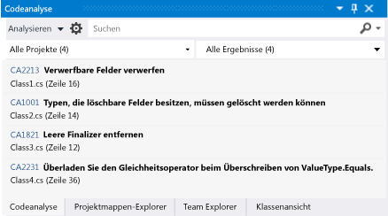
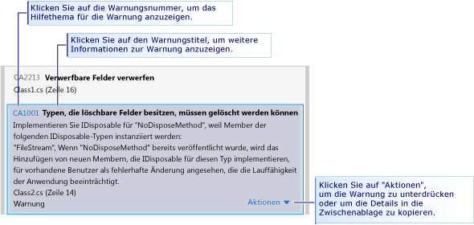

# Analysieren der Qualit&#228;t von Visual Basic- und C#-Code in Store-Apps mit der statischen Codeanalyse von Visual Studio
[!INCLUDE[vs2017banner](../code-quality/includes/vs2017banner.md)]

  
  
 Das Codeanalysetool in Visual Studio Express überprüft den Code auf eine Reihe von allgemeinen Fehlern und auf Verstöße gegen gebräuchliche Programmiergrundlagen.  Codeanalysewarnungen unterscheiden sich von C\#\-Compilerfehlern und \-Warnungen, da das Codeanalysetool nach bestimmten Codeschemata sucht, die gültig sind, jedoch Probleme für Sie oder andere Personen bereiten können, die den Code verwenden.  Codeanalyse kann auch Fehler im Code suchen, die schwierig durch Tests zu erkennen sind.  Das regelmäßige Ausführen des Codeanalysetools während des Entwicklungsprozesses kann die Qualität der App erhöhen.  
  
> [!NOTE]
>  In Visual Studio Ultimate, Visual Studio Premium und Visual Studio Professional können Sie sämtliche Funktionen der Codeanalyse verwenden.  Weitere Informationen finden Sie unter [Analysieren der Anwendungsqualität mit Codeanalysetools](http://msdn.microsoft.com/library/dd264897.aspx) in der MSDN Library.  
  
## In diesem Thema  
 Erfahren Sie:  
  
 [Ausführen der Codeanalyse](../test/analyze-visual-basic-and-csharp-code-quality-in-store-apps-using-visual-studio-static-code-analysis.md#BKMK_Run)  
  
 [Analysieren und Auflösen von Codeanalysewarnungen](../test/analyze-visual-basic-and-csharp-code-quality-in-store-apps-using-visual-studio-static-code-analysis.md#BKMK_Analyze)  
  
 [Unterdrücken der Codeanalysewarnungen](../test/analyze-visual-basic-and-csharp-code-quality-in-store-apps-using-visual-studio-static-code-analysis.md#BKMK_Suppress)  
  
 [Suchen und Filtern der Codeanalyseergebnisse](../test/analyze-visual-basic-and-csharp-code-quality-in-store-apps-using-visual-studio-static-code-analysis.md#BKMK_Search)  
  
 [Visual Basic- und C#-Codeanalysewarnungen](../test/analyze-visual-basic-and-csharp-code-quality-in-store-apps-using-visual-studio-static-code-analysis.md#BKMK_Warnings)  
  
##   Ausführen der Codeanalyse  
 So führen Sie die Codeanalyse in der Visual Studio\-Projektmappe aus  
  
-   Wählen Sie im Menü **Erstellen** die Option **Codeanalyse für Lösung ausführen** aus.  
  
 So führen Sie die Codeanalyse beim Erstellen eines Projekts jedes Mal automatisch aus  
  
1.  Klicken Sie im Projektmappen\-Explorer mit der rechten Maustaste auf den Projektnamen und dann auf **Eigenschaften**.  
  
2.  Wählen Sie auf der Seite der Projekteigenschaften **Codeanalyse** aus, und wählen Sie dann **Codeanalyse für Build aktivieren \(definiert eine CODE\_ANALYSIS\-Konstante\)** aus.  
  
 Die Projektmappe wird kompiliert und die Codeanalyse ausgeführt.  Die Ergebnisse werden im Codeanalysefenster angezeigt.  
  
   
  
##   Analysieren und Auflösen von Codeanalysewarnungen  
 Um eine bestimmte Warnung zu analysieren, klicken Sie im Codeanalysefenster auf den Titel der Warnung.  Die Warnung wird erweitert, um ausführliche Informationen zum Problem anzuzeigen.  
  
   
  
 Wenn Sie eine Warnung erweitern, wird die Codezeile, die die Warnung verursacht hat, im Visual Studio\-Code\-Editor hervorgehoben.  
  
   
  
 Nachdem Sie die Ursache des Problems verstanden haben, können Sie es im Code beheben.  Wiederholen Sie dann die Codeanalyse, um sicherzustellen, dass die Warnung nicht mehr im Codeanalysefenster angezeigt wird, und dass durch die Korrektur keine neuen Warnungen ausgelöst wurden.  
  
> [!TIP]
>  Sie können die Codeanalyse im Codeanalysefenster erneut ausführen.  Klicken Sie auf die Schaltfläche **Analysieren**, und wählen Sie den Bereich der Analyse aus.  Sie können die Analyse für die gesamte Projektmappe oder für ein ausgewähltes Projekt erneut ausführen.  
  
##   Unterdrücken der Codeanalysewarnungen  
 Mitunter möchten Sie möglicherweise darauf verzichten, eine Codeanalysewarnung zu korrigieren.  So kann es beispielsweise vorkommen, dass das Auflösen der Warnung im Verhältnis zur Wahrscheinlichkeit, dass das Problem in einer realen Implementierung des Codes auftritt, eine zu große Bearbeitung des Codes erfordert.  Oder Sie gehen davon aus, dass die für die Warnung verwendete Analyse für den jeweiligen Kontext ungeeignet ist.  Sie können Warnungen unterdrücken, sodass diese nicht mehr im Codeanalysefenster angezeigt werden.  
  
 So unterdrücken Sie eine Warnung  
  
1.  Wenn die ausführlichen Informationen nicht angezeigt werden, klicken Sie auf den Titel der Warnung, um sie zu erweitern.  
  
2.  Wählen Sie unten in der Warnung den Link **Aktionen** aus.  
  
3.  Zeigen Sie auf **Meldung unterdrücken**, und wählen Sie dann entweder **In Quelle** oder **In Unterdrückungsdatei** aus.  
  
    -   **In Quelle** fügt ein `SuppressMessage`\-Attribut in der Quelldatei über der Methode ein, die die Warnung generiert.  Dadurch wird die Unterdrückung leichter gefunden.  
  
    -   **In Unterdrückungsdatei** fügt ein `SuppressMessage`\-Attribut zur **GlobalSuppressions.cs**\-Datei des Projekts hinzu.  Dies kann die Verwaltung der Unterdrückungen vereinfachen.  Beachten Sie, dass das `SuppressMessage`\-Attribut, das zu **GlobalSuppression.cs** hinzugefügt wurde, auch auf die Methode angewendet wird, die die Warnung generiert.  Sie unterdrückt die Warnung nicht global.  
  
     Die Entscheidung, ob die Warnung in der Quelldatei oder in der Unterdrückungsdatei unterdrückt wird, hängt vom Programmierstil und den Anforderungen ab.  
  
##   Suchen und Filtern der Codeanalyseergebnisse  
 Sie können lange Listen mit Warnmeldungen durchsuchen und Warnungen in Projektmappen mit mehreren Projekten filtern.  
  
   
  
 In [!INCLUDE[vs_dev11_expwin_long](../porting/includes/vs_dev11_expwin_long_md.md)] haben alle Codeanalysewarnungen den Schweregrad der Warnung.  
  
##   Visual Basic\- und C\#\-Codeanalysewarnungen  
 Codeanalyse löst die folgenden Warnungen aus:  
  
 [CA1001: Typen, die löschbare Felder besitzen, sollten gelöscht werden](http://msdn.microsoft.com/library/ms182172.aspx)  
  
 [CA1821: Leere Finalizer entfernen](http://msdn.microsoft.com/library/bb264476.aspx)  
  
 [CA2213: Verwerfbare Felder verwerfen](http://msdn.microsoft.com/library/ms182328.aspx)  
  
 [CA2229: Serialisierungskonstruktoren implementieren](http://msdn.microsoft.com/library/ms182343.aspx)  
  
 [CA2231: Überladen des Gleichheitsoperators beim Überschreiben von ValueType.Equals](http://msdn.microsoft.com/library/ms182359.aspx)