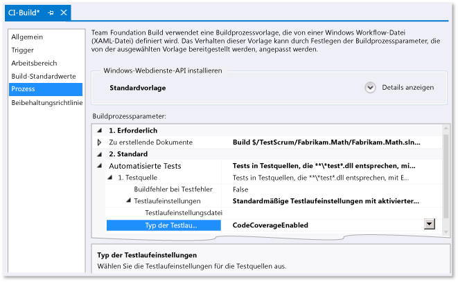

# Analysieren von Code Coverage in Buildüberprüfungstests
Die Code Coverage-Analyse in Microsoft Visual Studio zeigt Ihnen, wie viel Ihres Codes durch automatische Test untersucht wird. Weitere Informationen finden Sie unter [Using Code Coverage to Determine How Much Code is being Tested (Wie Sie feststellen können, wie viel Code untersucht wird)](../test/using-code-coverage-to-determine-how-much-code-is-being-tested.md).  
  
 Wenn Sie Code einchecken, werden Ihre Tests zusammen mit allen anderen Tests von anderen Teammitgliedern auf dem Buildserver ausgeführt. (Wenn Sie dies noch nicht eingerichtet haben, finden Sie unter [Ausführen von Tests im Buildprozess](http://msdn.microsoft.com/Library/d05743a1-c5cf-447e-bed9-bed3cb595e38) Informationen hierzu.) Es ist hilfreich, die Code Coverage für den Builddienst zu analysieren, da Sie dadurch das aktuellste und umfassendste Bild der Code Coverage für das gesamte Projekt erhalten. Dazu gehören auch automatisierte Systemtests und andere codierte Tests, die Sie normalerweise nicht auf Entwicklungscomputern ausführen.  
  
1.  Öffnen Sie im Team Explorer **Builds**, und fügen Sie dann eine Builddefinition hinzu oder bearbeiten Sie diese.  
  
2.  Erweitern Sie auf der Seite **Prozess** die Elemente **Automatisierte Tests**, **Testquelle** und **Testlaufeinstellungen**. Legen Sie die Option **Code Coverage Enabled**(Code Coverage aktiviert) für den **Type of Run Settings File**(Typ der Laufzeiteinstellungsdatei) fest.  
  
     Wenn Sie über mehrere Testquelldefinitionen verfügen, wiederholen Sie diesen Schritt für jede einzelne Definition.  
  
    -   *Es ist jedoch kein Feld mit dem Namen **Type of Run Settings File**(Typ der Laufzeiteinstellungsdatei) vorhanden.*  
  
         Wählen Sie **Testassembly** unter **Automatisierte Tests**, und klicken Sie auf die Schaltfläche mit den Auslassungspunkten **[...]** am Ende der Zeile. Wählen Sie unter **Test Runner** im Dialogfeld **Testlauf hinzufügen/bearbeiten** die Option **Visual Studio Test Runner** aus.  
  
   
  
 Nach Ausführung des Builds werden die Code Coverage-Ergebnisse in der Buildzusammenfassung angezeigt.  
  
## Siehe auch  
 [Bestimmen des Umfangs des zu testenden Codes mithilfe von Code Coverage](../test/using-code-coverage-to-determine-how-much-code-is-being-tested.md)
