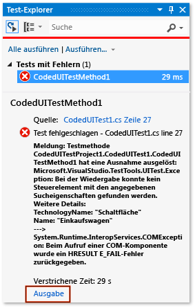
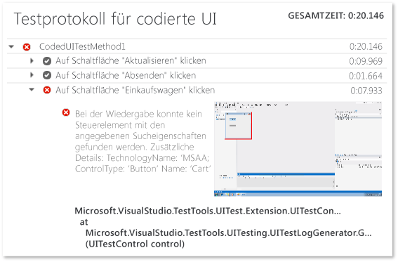

# <a name="analyzing-coded-ui-tests-using-coded-ui-test-logs"></a>Analysieren von Tests der programmierten UI mithilfe der Testprotokolle der programmierten UI
Testprotokolle für programmierten UI filtern wichtige Informationen zu den Ausführungen Ihrer Tests der programmierten UI und zeichnen diese auf.  
  
 **Anforderungen**  
  
-   Visual Studio Enterprise  
  
## <a name="why-should-i-do-this"></a>Warum sollte ich das tun?  
 Die Protokolle werden in einem Format dargestellt, mit dem sich Probleme schnell debuggen lassen.  
  
## <a name="how-do-i-do-this"></a>Vorgehensweise  
  
### <a name="step-1-enable-logging"></a>Schritt 1: Aktivieren der Protokollierung  
 Verwenden Sie je nach Szenario eine der folgenden Methoden zur Aktivierung des Protokolls.  
  
-   Auf .NET Framework Version 4 abzielen, wenn keine Datei App.config im Testprojekt vorhanden ist  
  
    -   Öffnen Sie die Datei **QTAgent32_40.exe.config**.  
  
         Diese Datei befindet sich standardmäßig unter **\<Laufwerk>:\Programme (x86)\Microsoft Visual Studio 12.0\Common7\IDE**.  
  
         Ändern Sie den Wert für EqtTraceLevel auf die gewünschte Protokollebene.  
  
         Speichern Sie die Datei.  
  
-   Auf .NET Framework Version 4,5 abzielen, wenn keine Datei App.config im Testprojekt vorhanden ist  
  
    -   Öffnen Sie die Datei **QTAgent32.exe.config**.  
  
         Diese Datei befindet sich standardmäßig unter **\<Laufwerk>:\Programme (x86)\Microsoft Visual Studio 12.0\Common7\IDE**.  
  
         Ändern Sie den Wert für EqtTraceLevel auf die gewünschte Protokollebene.  
  
         Speichern Sie die Datei.  
  
-   Datei App.config im Testprojekt vorhanden  
  
    -   Öffnen Sie die Datei App.config im Projekt.  
  
         Fügen Sie unter dem Konfigurationsknoten den folgenden Code hinzu:  
  
         `<system.diagnostics>     <switches>       <add name="EqtTraceLevel" value="4" />     </switches>  </system.diagnostics>`  
  
-   Die Anmeldung aus dem Testcode selbst aktivieren  
  
    -   <xref:Microsoft.VisualStudio.TestTools.UITesting.PlaybackSettings.LoggerOverrideState%2A> = HtmlLoggerState.AllActionSnapshot;  
  
### <a name="step-2-run-your-coded-ui-test-and-view-the-log"></a>Schritt 2: Den Test der programmierten UI ausführen und das Protokoll anzeigen  
 Wenn Sie einen Test der programmierten Benutzeroberfläche mit der modifizierten Datei **QTAgent32.exe.config** ausführen, dann sehen Sie, dass es einen Ausgabelink in den Ergebnissen des Test-Explorers gibt. Protokolldateien werden nicht nur produziert, wenn der Test fehlschlägt, sondern auch für erfolgreiche Tests, wenn das Level der Ablaufverfolgung auf "verbose" gesetzt ist.  
  
1.  Wählen Sie im Menü **TEST** den Punkt **Fenster**aus, und wählen Sie dann **Test-Explorer**.  
  
2.  Wählen Sie im Menü **BUILD** die Option **Projektmappe erstellen**.  
  
3.  Wählen Sie in Test-Explorer den Test der programmierten Benutzeroberfläche, den Sie ausführen möchten. Öffnen Sie dessen Kontextmenü, und wählen Sie **Ausgewählte Tests ausführen**.  
  
     Die automatisierten Tests werden ausgeführt und geben an, wenn sie erfolgreich waren oder Fehler aufgetreten sind.  
  
    > [!TIP]
    >  Um Test-Explorer über das **Testmenü** anzuzeigen, zeigen Sie auf **Fenster**, und wählen Sie **Test-Explorer** aus.  
  
4.  Wählen Sie den Link **Ausgabe** in den Test-Explorer-Ergebnissen.  
  
       
  
     Damit wird die Ausgabe für den Test angezeigt, in der ein Link zum Aktionsprotokoll enthalten ist.  
  
       
  
5.  Wählen Sie den Link UITestActionLog.html.  
  
     Das Protokoll wird im Webbrowser angezeigt.  
  
       
  
## <a name="q--a"></a>Fragen und Antworten  
  
### <a name="q-what-happened-to-the-enablehtmllogger-key"></a>F: Was ist mit dem Schlüssel EnableHtmlLogger passiert?  
 In früheren Versionen von Visual Studio gab es zwei zusätzliche Konfigurationseinstellungen mit denen der HtmlLogger in Coded UI-Test aktiviert werden konnte:  
  
```  
  
<add key="EnableHtmlLogger" value="true"/>  
  
<add key="EnableSnapshotInfo" value="true"/>  
  
```  
  
 Diese beiden Einstellungen sind ab Visual Studio 2012 veraltet. Sie müssen nur noch die Einstellung EqtTraceLevel ändern, damit HtmlLogger aktiviert wird.  
  
## <a name="see-also"></a>Siehe auch  
 [Verwenden von Benutzeroberflächenautomatisierung zum Testen des Codes](../test/use-ui-automation-to-test-your-code.md)   
 [Gewusst wie: Ausführen von Tests in Microsoft Visual Studio](http://msdn.microsoft.com/Library/1a1207a9-2a33-4a1e-a1e3-ddf0181b1046)
