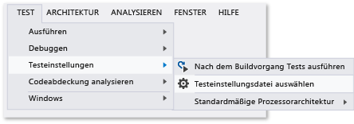

# <a name="configure-unit-tests-by-using-a-runsettings-file"></a>Konfigurieren von Komponententests mithilfe einer .runsettings-Datei
Komponententests in Visual Studio können mithilfe einer .runsettings-Datei konfiguriert werden. (Der Dateiname ist unerheblich, sofern Sie die Erweiterung ". runsettings" verwenden) Beispielsweise können Sie die .NET Framework-Version, auf der die Tests durchgeführt werden, das Verzeichnis, in dem Testergebnisse gespeichert werden, sowie die während eines Testlaufs gesammelten Daten ändern.  
  
 Wenn Sie keine spezielle Konfiguration möchten, benötigen Sie keine Datei "*.runsettings". Sie wird meistens dazu verwendet, die [Code Coverage](../test/customizing-code-coverage-analysis.md) anzupassen.  
  
> [!NOTE]
>  **RUNSETTINGS- und TESTSETTINGS-Dateien**  
>   
>  Es gibt zwei Typen oder Dateien für das Konfigurieren von Tests. *.runsettings werden für Komponententests gebraucht. \*.testsettings-Dateien werden für [Tests in Laborumgebungen](/devops-test-docs/test/specifying-test-settings-for-visual-studio-tests), Webleistungs- und Auslastungstests sowie für das Anpassen einiger diagnostischer Datenadapter wie beispielsweise Intellitrace und Ereignisprotokolladapter genutzt.  
>   
>  In früheren Editionen von Visual Studio bis 2010 wurden Komponententests auch mithilfe von *.testsettings-Dateien angepasst. Das ist weiterhin möglich. Die Tests laufen jedoch langsamer, als wenn Sie die vergleichbare Konfiguration in einer \*.runsettings-Datei verwenden.  
  
## <a name="customizing-tests-with-a-runsettings-file"></a>Anpassen von Tests mit einer .runsetting-Datei  
  
1.  Fügen Sie Ihrer Visual Studio-Projektmappe eine XML-Datei hinzu und benennen Sie sie um. (Der Dateiname ist unerheblich, aber die Dateierweiterung muss ".runsettings" sein.)  
  
2.  Ersetzen Sie den Inhalt der Datei durch das [Beispiel](#example).  
  
     Bearbeiten Sie ihn Ihren Anforderungen entsprechend.  
  
3.  Klicken Sie im Menü **Test** auf **Testeinstellungen**und dann **Datei für Testeinstellungen auswählen**.  
  
 Sie können mehr als eine \*.runsettings-Datei in der Projektmappe erstellen und im Menü **Testeinstellungen** festlegen, dass die Dateien zu unterschiedlichen Zeitpunkten aktiviert oder deaktiviert werden.  
  
   
  
##  <a name="example"></a>Kopieren dieser RUNSETTINGS-Beispieldatei  
 Im Folgenden finden Sie eine typische *.runsettings-Datei. Jedes Element der Datei ist optional, weil jeder Wert über einen Standardwert verfügt.  
  
```xml  
<?xml version="1.0" encoding="utf-8"?>  
<RunSettings>  
  <!-- Configurations that affect the Test Framework -->  
  <RunConfiguration>  
    <MaxCpuCount>1</MaxCpuCount>  
    <!-- Path relative to solution directory -->  
    <ResultsDirectory>.\TestResults</ResultsDirectory>  
  
    <!-- [x86] | x64    
      - You can also change it from menu Test, Test Settings, Default Processor Architecture -->  
    <TargetPlatform>x86</TargetPlatform>  
  
    <!-- Framework35 | [Framework40] | Framework45 -->  
    <TargetFrameworkVersion>Framework40</TargetFrameworkVersion>  
  
    <!-- Path to Test Adapters -->  
    <TestAdaptersPaths>%SystemDrive%\Temp\foo;%SystemDrive%\Temp\bar</TestAdaptersPaths>  
  </RunConfiguration>  
  
  <!-- Configurations for data collectors -->  
  <DataCollectionRunSettings>  
    <DataCollectors>  
      <DataCollector friendlyName="Code Coverage" uri="datacollector://Microsoft/CodeCoverage/2.0" assemblyQualifiedName="Microsoft.VisualStudio.Coverage.DynamicCoverageDataCollector, Microsoft.VisualStudio.TraceCollector, Version=11.0.0.0, Culture=neutral, PublicKeyToken=b03f5f7f11d50a3a">  
        <Configuration>  
          <CodeCoverage>  
            <ModulePaths>  
              <Exclude>  
                <ModulePath>.*CPPUnitTestFramework.*</ModulePath>  
              </Exclude>  
            </ModulePaths>  
  
            <!-- We recommend you do not change the following values: -->  
            <UseVerifiableInstrumentation>True</UseVerifiableInstrumentation>  
            <AllowLowIntegrityProcesses>True</AllowLowIntegrityProcesses>  
            <CollectFromChildProcesses>True</CollectFromChildProcesses>  
            <CollectAspDotNet>False</CollectAspDotNet>  
  
          </CodeCoverage>  
        </Configuration>  
      </DataCollector>  
  
    </DataCollectors>  
  </DataCollectionRunSettings>  
  
  <!-- Parameters used by tests at runtime -->  
  <TestRunParameters>  
    <Parameter name="webAppUrl" value="http://localhost" />  
    <Parameter name="webAppUserName" value="Admin" />  
    <Parameter name="webAppPassword" value="Password" />  
  </TestRunParameters>  
  
  <!-- Adapter Specific sections -->  
  
  <!-- MSTest adapter -->  
  <MSTest>  
    <MapInconclusiveToFailed>True</MapInconclusiveToFailed>  
    <CaptureTraceOutput>false</CaptureTraceOutput>  
    <DeleteDeploymentDirectoryAfterTestRunIsComplete>False</DeleteDeploymentDirectoryAfterTestRunIsComplete>  
    <DeploymentEnabled>False</DeploymentEnabled>  
    <AssemblyResolution>  
      <Directory Path="D:\myfolder\bin\" includeSubDirectories="false"/>  
    </AssemblyResolution>  
  </MSTest>  
  
</RunSettings>  
```  
  
 Die RUNSETTINGS-Datei wird auch zur Konfiguration der [Code Coverage](../test/customizing-code-coverage-analysis.md) verwendet.  
  
 Im verbleibenden Teil dieses Themas wird der Dateiinhalt beschrieben.  
  
## <a name="edit-your-runsettings-file"></a>Bearbeiten Sie die .runsettings-Datei  
 Die .runsettings-Datei weist folgende Elemente auf.  
  
### <a name="test-run-configuration"></a>Testlaufkonfiguration  
  
|Knoten|Standard|Werte|  
|----------|-------------|------------|  
|`ResultsDirectory`||Das Verzeichnis, in dem die Testergebnisse gespeichert werden.|  
|`TargetFrameworkVersion`|Framework40|Framework35, Framework40, Framework45<br /><br /> Dadurch wird angegeben, welche Version des Komponententest-Frameworks verwendet wird, um die Tests zu ermitteln und auszuführen. Diese kann sich von der Version der .NET-Plattform unterscheiden, die Sie in den Buildeigenschaften des Komponententestprojekts angeben.|  
|`TargetPlatform`|x86|x86, x64|  
|`TreatTestAdapterErrorsAsWarnings`|false|false, true|  
|`TestAdaptersPaths`||Ein oder mehrere Pfade zu dem Verzeichnis, in dem die Testadapter gespeichert sind.|  
|`MaxCpuCount`|1|Hiermit wird der Umfang der parallelen Ausführung gesteuert, wenn Komponententests ausgeführt werden, bei denen die auf dem Computer verfügbaren Kerne verwendet werden.  Das Testausführungsmodul startet für jeden verfügbaren Kern einen eigenständigen Prozess und übergibt an jeden Kern einen Container mit auszuführenden Tests, etwa eine Assembly, eine DLL oder ein relevantes Artefakt.  Der Testcontainer ist die Planungseinheit.  In jedem Container werden die Tests entsprechend dem Testframework ausgeführt.  Gibt es viele Container, werden Prozesse, sobald das Ausführen ihrer Tests in einem Container abgeschlossen ist, an den nächsten verfügbaren Container übergeben.<br /><br /> MaxCpuCount kann Folgendes sein:<br /><br /> n, wobei 1 < = n < = Anzahl von Kernen: bis zu n Prozesse werden gestartet.<br /><br /> n, wobei n = beliebiger anderer Wert: die Anzahl von gestarteten Prozessen wird bis zur Anzahl der maximal auf dem Computer verfügbaren Kerne erhöht.|  
  
### <a name="diagnostic-data-adapters-data-collectors"></a>Adapter für diagnostische Daten (Datensammler)  
 Das `DataCollectors` -Element gibt die Einstellungen von Adaptern für diagnostische Daten an. Adapter für diagnostische Daten werden verwendet, um zusätzliche Informationen zur Umgebung und den getesteten Anwendung zu sammeln. Jeder Adapter verfügt über Standardeinstellungen. Wenn Sie diese nicht verwenden möchten, können Sie andere Einstellungen festlegen.  
  
#### <a name="code-coverage-adapter"></a>Codeabdeckungsadapter  
 Der Datensammler der Codeabdeckung erstellt ein Protokoll der Teile des Anwendungscodes, die im Test ausgeführt wurden. Weitere Informationen zum Anpassen der Einstellungen für die Code Coverage finden Sie unter [Anpassen der Codeabdeckungsanalyse](../test/customizing-code-coverage-analysis.md).  
  
#### <a name="other-diagnostic-data-adapters"></a>Sonstige Adapter für diagnostische Daten  
 Der Codeabdeckungsadapter ist zurzeit der einzige Adapter, der mithilfe der Testlaufeinstellungsdatei angepasst werden kann.  
  
 Um andere Typen von Adaptern für diagnostische Daten anzupassen, müssen Sie eine Testeinstellungsdatei verwenden. Weitere Informationen finden Sie unter [Specifying Test Settings for Visual Studio Tests (Angeben von Testeinstellungen für Visual Studio-Tests)](/devops-test-docs/test/specifying-test-settings-for-visual-studio-tests).  
  
#### <a name="testrunparameters"></a>TestRunParameters  
 TestRunParameters bieten eine Möglichkeit zum Definieren von Variablen und Werten, die für die Tests zur Laufzeit verfügbar sind.  
  
### <a name="mstest-run-settings"></a>MSTest-Testlaufeinstellungen  
 Diese Einstellungen betreffen den Testadapter, der Testmethoden ausführt, die über das `[TestMethod]` -Attribut verfügen.  
  
|Konfiguration|Standard|Werte|  
|-------------------|-------------|------------|  
|ForcedLegacyMode|false|In Visual Studio 2012 wurde der MSTest-Adapter für eine schnellere Geschwindigkeit und bessere Skalierbarkeit optimiert. Einige Verhalten, z. B. die Reihenfolge der Testausführung, sind möglicherweise nicht mehr so präzise wie in den vorherigen Versionen von Visual Studio. Legen Sie diesen Wert auf `true` fest, um den älteren Testadapter zu verwenden.<br /><br /> Beispielsweise können Sie diesen verwenden, wenn Sie eine app.config-Datei für einen Komponententest angegeben haben.<br /><br /> Eventuell sollten Sie in Betracht ziehen, die Tests so umzugestalten, dass Sie den späteren Adapter verwenden können.|  
|IgnoreTestImpact|false|Die Testauswirkungensfunktion priorisiert Tests, auf die sich aktuelle Änderungen auswirken, wenn sie in MSTest oder von Microsoft Test-Manager ausgeführt werden. Diese Einstellung deaktiviert die Funktion. Weitere Informationen finden Sie unter [How to: Collect Data to Check Which Tests Should be Run After Code Changes (Vorgehensweise: Sammeln von Daten, um zu überprüfen, welche Tests nach Codeänderungen ausgeführt werden sollen](http://msdn.microsoft.com/Library/2f921ea1-9bb0-4870-a30f-0521fc22cb47).|  
|SettingsFile||Sie können eine Testeinstellungsdatei, die mit dem MS-Testadapter verwendet werden soll, hier angeben. Außerdem können Sie eine Testeinstellungsdatei im Menü **Test**über die Optionen **Testeinstellungen**und dann **Datei für Testeinstellungen auswählen**angeben.<br /><br /> Wenn Sie diesen Wert angeben, müssen Sie außerdem **ForcedlegacyMode** auf **true**festlegen.<br /><br /> `<RunSettings>   <MSTest>     <SettingsFile>my.testsettings</SettingsFile>      <ForcedLegacyMode>true</ForcedLegacyMode>    </MSTest> </RunSettings>`|  
|KeepExecutorAliveAfterLegacyRun|false|Nachdem ein Testlauf abgeschlossen ist, wird MSTest beendet. Jeder Prozess, der als Teil des Tests gestartet wird, wird dann ebenfalls abgebrochen. Wenn der Test-Executor aktiv bleiben soll, legen Sie diese Konfiguration auf "true" fest.<br /><br /> Beispielsweise können Sie mit dieser Konfiguration erreichen, dass der Browser zwischen Tests der codierten UI aktiv bleibt.|  
|DeploymentEnabled|true|Wenn Sie diese Konfiguration auf "false" festlegen, werden in der Testmethode angegebene Bereitstellungselemente nicht in das Bereitstellungsverzeichnis kopiert.|  
|CaptureTraceOutput|true|Mithilfe von Trace.WriteLine können Sie über Ihre Testmethode in die Debugablaufverfolgung schreiben. Mit dieser Konfiguration können Sie diese Debugablaufverfolgungen deaktivieren.|  
|DeleteDeploymentDirectoryAfterTestRunIsComplete|true|Sie können das Bereitstellungsverzeichnis nach einem Testlauf beibehalten, indem Sie diesen Wert auf "false" festlegen.|  
|MapInconclusiveToFailed|false|Wenn ein Test einen nicht eindeutigen Status zurückgibt, wird er normalerweise dem Status "Übersprungen" im Test-Explorer zugeordnet. Wenn nicht eindeutige Tests als "Fehlgeschlagen" angezeigt werden sollen, verwenden Sie diese Konfiguration.|  
|InProcMode|false|Wenn die Tests im selben Prozess wie der MSTest-Adapter ausgeführt werden sollen, legen Sie diesen Wert auf "true" fest. Diese Einstellung führt zu einer geringen Leistungssteigerung. Wenn ein Test allerdings mit einer Ausnahme beendet wird, werden die anderen Tests nicht fortgesetzt.|  
|AssemblyResolution|false|Sie können Pfade zu weiteren Assemblys angeben, wenn Komponententests gefunden und ausgeführt werden.  Verwenden Sie z. B. diese Pfade für Abhängigkeitsassemblys, die sich nicht im selben Verzeichnis wie die Testassembly befinden.  Um einen Pfad anzugeben, verwenden Sie ein „Directory Path“-Element.  Pfade können Umgebungsvariablen enthalten.<br /><br /> `<AssemblyResolution>  <Directory Path>"D:\myfolder\bin\" includeSubDirectories="false"/> </AssemblyResolution>`|  
  
## <a name="see-also"></a>Siehe auch  
 [Anpassen der Code Coverage-Analyse](../test/customizing-code-coverage-analysis.md)   
 [Angeben von Testeinstellungen für Tests mit Visual Studio](/devops-test-docs/test/specifying-test-settings-for-visual-studio-tests)
