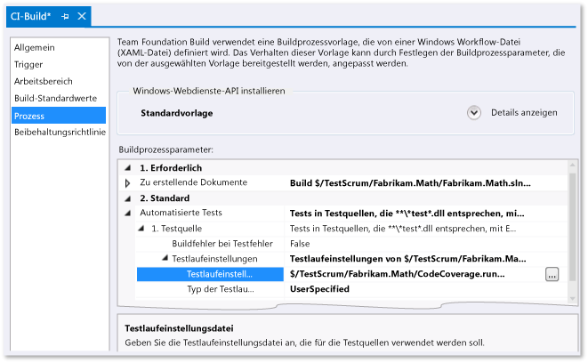

# <a name="customize-code-coverage-analysis"></a>Anpassen der Code Coverage-Analyse

Standardmäßig analysiert das Code Coverage-Tool von Visual Studio alle Projektmappenassemblys, die während der Komponententests geladen werden. Es wird empfohlen, diese Standardeinstellung beizubehalten, da sie meist gut funktioniert. Weitere Informationen finden Sie unter [Using Code Coverage to Determine How Much Code is being Tested (Wie Sie feststellen können, wie viel Code untersucht wird)](../test/using-code-coverage-to-determine-how-much-code-is-being-tested.md).

Bevor Sie das Code Coverage-Verhalten anpassen, berücksichtigen Sie einige Alternativen:

- *Ich möchte den Testcode aus den Code Coverage-Ergebnissen ausschließen und nur den Anwendungscode einbinden.*

     Fügen Sie Ihrer Testklasse `ExcludeFromCodeCoverage Attribute` hinzu.

- *Ich möchte die Assemblys einschließen, die nicht Teil meiner Projektmappe sind.*

     Rufen Sie die PDB-Dateien für diese Assemblys ab, und kopieren Sie sie in den gleichen Ordner wie die Assemblydateien (DLL-Dateien).

Um das Code Coverage-Verhalten anzupassen, kopieren Sie das [Beispiel am Ende dieses Themas](#sample), und fügen Sie es der Projektmappe mit der Dateierweiterung *.runsettings* hinzu. Bearbeiten Sie das Beispiel Ihren eigenen Anforderungen entsprechend, und klicken Sie dann im Menü **Test** auf **Testeinstellungen** und auf **Datei für Testeinstellungen auswählen**. Im verbleibenden Teil dieses Artikels werden diese Schritte ausführlicher beschrieben.

## <a name="the-run-settings-file"></a>Die Testlaufeinstellungsdatei

Erweiterte Code Coverage-Einstellungen werden in einer *RUNSETTINGS*-Datei angegeben. Die Testlaufeinstellungsdatei ist die Konfigurationsdatei, die von den Tools für Komponententests verwendet wird. Es wird empfohlen, das [Beispiel am Ende dieses Themas](#sample) zu kopieren und es an Ihre eigenen Anforderungen anzupassen.

Fügen Sie zur Anpassung der Code Coverage Ihrer Projektmappe eine RUNSETTINGS-Datei hinzu:

1. Fügen Sie eine XML-Datei als Projektmappenelement mit der Erweiterung *.runsettings* hinzu:

     Wählen Sie im Projektmappen-Explorer im Kontextmenü der Projektmappe die Option **Hinzufügen** > **Neues Element** und **XML-Datei** aus. Speichern Sie die Datei mit einer Namensendung wie z.B. *CodeCoverage.runsettings*.

2. Fügen Sie den Inhalt des Beispiels am Ende dieses Artikels hinzu, und passen Sie diesen wie in den folgenden Abschnitten beschrieben an Ihre Anforderungen an.

3. Klicken Sie im Menü **Test** auf **Testeinstellungen** > **Datei für Testeinstellungen auswählen**, und wählen Sie dann die Datei aus.

4. Wenn Sie jetzt den Befehl **Code Coverage analysieren** ausführen, steuert die RUNSETTINGS-Datei das Verhalten. Vergessen Sie nicht, dass Sie die Code Coverage erneut ausführen müssen. Die vorherigen Code Coverage-Ergebnisse und Codefarben werden nicht automatisch ausgeblendet, wenn Sie Tests ausführen oder den Code aktualisieren.

5. Um die benutzerdefinierten Einstellungen ein- und auszuschalten, deaktivieren oder aktivieren Sie die Datei im Menü **Test** > **Testeinstellungen**.

 

Andere Aspekte von Komponententests können in derselben RUNSETTINGS-Datei konfiguriert werden. Weitere Informationen finden Sie unter [Komponententests des Codes](../test/unit-test-your-code.md).

### <a name="specifying-symbol-search-paths"></a>Festlegen von Symbolsuchpfaden

Die Codeabdeckung erfordert Symbole (PDB-Dateien), damit Assemblys zur Verfügung stehen. Für über die Projektmappe erstellte Assemblys werden Symboldateien meistens neben den Binärdateien bereitgestellt, und die Code Coverage funktioniert automatisch. In einigen Fällen sollten Sie jedoch Assemblys, auf die verwiesen wird, in die Codeabdeckungsanalyse einschließen. In solchen Fällen befinden sich die PDB-Dateien nicht neben den Binärdateien. Sie können jedoch den Symbolsuchpfad in der RUNSETTINGS-Datei angeben.

```xml
<SymbolSearchPaths>
      <Path>\\mybuildshare\builds\ProjectX</Path>
      <!--More paths if required-->
</SymbolSearchPaths>
```

> [!WARNING]
> Die Symbolauflösung kann zeitaufwendig sein, insbesondere wenn sie einen Remotedateispeicherort mit zahlreichen Assemblys verwendet. Daher sollten Sie erwägen, die Remote-PDB-Dateien an denselben lokalen Speicherort wie die Binärdateien (DLL- und EXE-Dateien) zu kopieren.

### <a name="excluding-and-including"></a>Ausschließen und Einschließen

Sie können angegebene Assemblys von der Codeabdeckungsanalyse ausschließen. Zum Beispiel:

```xml
<ModulePaths>
  <Exclude>
   <ModulePath>Fabrikam.Math.UnitTest.dll</ModulePath>
   <!-- Add more ModulePath nodes here. -->
  </Exclude>
</ModulePaths>
```

Alternativ können Sie angeben, welche Assemblys enthalten sein sollen. Dieser Ansatz hat den Nachteil, dass Sie beim Hinzufügen von weiteren Assemblys zur Projektmappe daran denken müssen, diese der Liste hinzuzufügen:

```xml
<ModulePaths>
  <Include>
   <ModulePath>Fabrikam.Math.dll</ModulePath>
   <!-- Add more ModulePath nodes here. -->
  </Include>
</ModulePaths>
```

Wenn `<Include>` leer ist, enthält die Verarbeitung der Code Coverage alle Assemblys, die geladen wurden und für die PDB-Dateien gefunden werden können. Die Code Coverage enthält keine Elemente, die mit einer Klausel in einer `<Exclude>`-Liste übereinstimmen.

`Include` wird vor `Exclude` verarbeitet.

### <a name="regular-expressions"></a>Reguläre Ausdrücke

In den Knoten "include" und "exclude" werden reguläre Ausdrücke verwendet. Weitere Informationen finden Sie unter [Verwenden von regulären Ausdrücken in Visual Studio](../ide/using-regular-expressions-in-visual-studio.md). Reguläre Ausdrücke sind nicht identisch mit Platzhaltern. Insbesondere:

- **.\*** entspricht einer Zeichenfolge beliebiger Zeichen

- **\\.** entspricht einem Punkt „.“

- **\\(   \\)** entspricht Klammern „(  )“

- **\\\\** entspricht dem Dateipfadtrennzeichen „\\“

- **^** entspricht dem Anfang der Zeichenfolge

- **$** entspricht dem Ende der Zeichenfolge

Bei allen Entsprechungen wird die Groß-/Kleinschreibung nicht beachtet.

Zum Beispiel:

```xml
<ModulePaths>
  <Include>
    <!-- Include all loaded .dll assemblies (but not .exe assemblies): -->
    <ModulePath>.*\.dll$</ModulePath>
  </Include>
  <Exclude>
    <!-- But exclude some assemblies: -->
    <ModulePath>.*\\Fabrikam\.MyTests1\.dll$</ModulePath>
    <!-- Exclude all file paths that contain "Temp": -->
    <ModulePath>.*Temp.*</ModulePath>
  </Exclude>
</ModulePaths>
```

> [!WARNING]
> Wenn ein Fehler in einem regulären Ausdruck auftritt, z. B. eine Klammer ohne Escapezeichen und Übereinstimmung, wird die Codeabdeckungsanalyse nicht ausgeführt.

### <a name="other-ways-to-include-or-exclude-elements"></a>Andere Möglichkeiten zum Einschließen oder Ausschließen von Elementen

Ein Codebeispiel finden Sie [am Ende dieses Themas](#sample).

- `ModulePath`: Assemblys, die durch den Assemblydateipfad angegeben werden.

- `CompanyName`: gleicht Assemblys nach dem Unternehmensattribut ab.

- `PublicKeyToken`: gleicht signierte Assemblys nach dem öffentlichen Schlüsseltoken ab. Verwenden Sie beispielsweise `<PublicKeyToken>^B03F5F7F11D50A3A$</PublicKeyToken>`, um alle Visual Studio-Komponenten und -Erweiterungen abzugleichen.

- `Source`: gleicht Elemente nach dem Pfadnamen der Quelldatei ab, in der sie definiert sind.

- `Attribute`: gleicht Elemente ab, an die ein bestimmtes Attribut angefügt ist. Geben Sie den vollständigen Namen des Attributs, einschließlich "Attribut", am Ende des Namens an.

- `Function`: gleicht Prozeduren, Funktionen oder Methoden nach dem vollqualifizierten Namen ab.

**Abgleichen eines Funktionsnamens**

Der reguläre Ausdruck muss mit dem vollqualifizierten Namen der Funktion, einschließlich Namespace, Klassennamen, Methodenname und Parameterliste, übereinstimmen. Ein auf ein Objekt angewendeter

- C# oder Visual Basic: `Fabrikam.Math.LocalMath.SquareRoot(double)`

- C++: `Fabrikam::Math::LocalMath::SquareRoot(double)`

```xml
<Functions>
  <Include>
    <!-- Include methods in the Fabrikam namespace: -->
    <Function>^Fabrikam\..*</Function>
    <!-- Include all methods named EqualTo: -->
    <Function>.*\.EqualTo\(.*</Function>
  </Include>
  <Exclude>
    <!-- Exclude methods in a class or namespace named UnitTest: -->
    <Function>.*\.UnitTest\..*</Function>
  </Exclude>
</Functions>
```

## <a name="how-to-specify-run-settings-files-while-running-tests"></a>Angeben von RUNSETTINGS-Dateien beim Ausführen von Tests

### <a name="to-customize-run-settings-in-visual-studio-tests"></a>Anpassen einer RUNSETTINGS-Datei in Visual Studio-Tests

Klicken Sie auf **Test** > **Testeinstellungen** > **Datei für Testeinstellungen auswählen**, und wählen Sie die *RUNSETTINGS*-Datei aus. Die Datei erscheint im Menü "Testeinstellungen", und Sie können sie auswählen oder abbrechen. Wenn die RUNSETTINGS-Datei ausgewählt ist, wird sie bei jeder Ausführung von **Code Coverage analysieren** angewendet.

### <a name="to-customize-run-settings-in-a-command-line-test"></a>Anpassen einer RUNSETTINGS-Datei in einem Befehlszeilentest

Verwenden Sie *vstest.console.exe*, um Tests über die Befehlszeile auszuführen. Die Einstellungsdatei ist ein Parameter dieses Hilfsprogramms.

1. Starten der Visual Studio Developer-Eingabeaufforderung:

    Wählen Sie im Windows **Startmenü** **Visual Studio 2017** > **Developer Command Prompt for VS 2017** (Eingabeaufforderung für Entwickler für VS 2017) aus.

2. Führen Sie den folgenden Befehl aus:

    `vstest.console.exe MyTestAssembly.dll /EnableCodeCoverage /Settings:CodeCoverage.runsettings`

### <a name="to-customize-run-settings-in-a-build-definition"></a>So passen Sie Testlaufeinstellungen in einer Builddefinition an

Sie können die Code Coverage-Daten von einem Teambuild abrufen.



1. Vergewissern Sie sich, dass die RUNSETTINGS-Datei eingecheckt ist.

2. Öffnen Sie im Team Explorer **Builds**, und fügen Sie dann eine Builddefinition hinzu oder bearbeiten Sie diese.

3. Erweitern Sie auf der Seite **Prozess** die Elemente **Automatisierte Tests** > **Testquelle** > **Laufzeiteinstellungen**. Wählen Sie die *RUNSETTINGS*-Datei aus.

   > [!TIP]
   > Wird **Testassembly** anstelle von **Testquelle** angezeigt, und es können nur *TESTSETTINGS*-Dateien ausgewählt werden, legen Sie die Eigenschaft **Test Runner** folgendermaßen fest: Wählen Sie unter **Automatisierte Tests** die Option **Testassembly** aus, und klicken Sie anschließend am Ende der Zeile auf **[...]**. Setzen Sie im Dialogfeld **Testlauf hinzufügen/bearbeiten** den **Test Runner** auf **Visual Studio Test Runner**.

Die Ergebnisse sind im zusammenfassenden Abschnitt des Buildberichts sichtbar.

##  <a name="sample"></a> Beispiel für eine RUNSETTINGS-Datei:

Kopieren Sie diesen Code, und passen Sie ihn Ihren Anforderungen entsprechend an.

(Informationen zu anderen Verwendungsmöglichkeiten der RUNSETTINGS-Datei, finden Sie unter [Konfigurieren von Komponententests mithilfe einer RUNSETTINGS-Datei](../test/configure-unit-tests-by-using-a-dot-runsettings-file.md).)

```xml
<?xml version="1.0" encoding="utf-8"?>
<!-- File name extension must be .runsettings -->
<RunSettings>
  <DataCollectionRunSettings>
    <DataCollectors>
      <DataCollector friendlyName="Code Coverage" uri="datacollector://Microsoft/CodeCoverage/2.0" assemblyQualifiedName="Microsoft.VisualStudio.Coverage.DynamicCoverageDataCollector, Microsoft.VisualStudio.TraceCollector, Version=11.0.0.0, Culture=neutral, PublicKeyToken=b03f5f7f11d50a3a">
        <Configuration>
          <CodeCoverage>
<!--
Additional paths to search for .pdb (symbol) files. Symbols must be found for modules to be instrumented.
If .pdb files are in the same folder as the .dll or .exe files, they are automatically found. Otherwise, specify them here.
Note that searching for symbols increases code coverage runtime. So keep this small and local.
-->
<!--
            <SymbolSearchPaths>
                   <Path>C:\Users\User\Documents\Visual Studio 2012\Projects\ProjectX\bin\Debug</Path>
                   <Path>\\mybuildshare\builds\ProjectX</Path>
            </SymbolSearchPaths>
-->

<!--
About include/exclude lists:
Empty "Include" clauses imply all; empty "Exclude" clauses imply none.
Each element in the list is a regular expression (ECMAScript syntax). See http://msdn.microsoft.com/library/2k3te2cs.aspx.
An item must first match at least one entry in the include list to be included.
Included items must then not match any entries in the exclude list to remain included.
-->

            <!-- Match assembly file paths: -->
            <ModulePaths>
              <Include>
                <ModulePath>.*\.dll$</ModulePath>
                <ModulePath>.*\.exe$</ModulePath>
              </Include>
              <Exclude>
                <ModulePath>.*CPPUnitTestFramework.*</ModulePath>
              </Exclude>
            </ModulePaths>

            <!-- Match fully qualified names of functions: -->
            <!-- (Use "\." to delimit namespaces in C# or Visual Basic, "::" in C++.)  -->
            <Functions>
              <Exclude>
                <Function>^Fabrikam\.UnitTest\..*</Function>
                <Function>^std::.*</Function>
                <Function>^ATL::.*</Function>
                <Function>.*::__GetTestMethodInfo.*</Function>
                <Function>^Microsoft::VisualStudio::CppCodeCoverageFramework::.*</Function>
                <Function>^Microsoft::VisualStudio::CppUnitTestFramework::.*</Function>
              </Exclude>
            </Functions>

            <!-- Match attributes on any code element: -->
            <Attributes>
              <Exclude>
                <!-- Don't forget "Attribute" at the end of the name -->
                <Attribute>^System\.Diagnostics\.DebuggerHiddenAttribute$</Attribute>
                <Attribute>^System\.Diagnostics\.DebuggerNonUserCodeAttribute$</Attribute>
                <Attribute>^System\.Runtime\.CompilerServices.CompilerGeneratedAttribute$</Attribute>
                <Attribute>^System\.CodeDom\.Compiler.GeneratedCodeAttribute$</Attribute>
                <Attribute>^System\.Diagnostics\.CodeAnalysis.ExcludeFromCodeCoverageAttribute$</Attribute>
              </Exclude>
            </Attributes>

            <!-- Match the path of the source files in which each method is defined: -->
            <Sources>
              <Exclude>
                <Source>.*\\atlmfc\\.*</Source>
                <Source>.*\\vctools\\.*</Source>
                <Source>.*\\public\\sdk\\.*</Source>
                <Source>.*\\microsoft sdks\\.*</Source>
                <Source>.*\\vc\\include\\.*</Source>
              </Exclude>
            </Sources>

            <!-- Match the company name property in the assembly: -->
            <CompanyNames>
              <Exclude>
                <CompanyName>.*microsoft.*</CompanyName>
              </Exclude>
            </CompanyNames>

            <!-- Match the public key token of a signed assembly: -->
            <PublicKeyTokens>
              <!-- Exclude Visual Studio extensions: -->
              <Exclude>
                <PublicKeyToken>^B77A5C561934E089$</PublicKeyToken>
                <PublicKeyToken>^B03F5F7F11D50A3A$</PublicKeyToken>
                <PublicKeyToken>^31BF3856AD364E35$</PublicKeyToken>
                <PublicKeyToken>^89845DCD8080CC91$</PublicKeyToken>
                <PublicKeyToken>^71E9BCE111E9429C$</PublicKeyToken>
                <PublicKeyToken>^8F50407C4E9E73B6$</PublicKeyToken>
                <PublicKeyToken>^E361AF139669C375$</PublicKeyToken>
              </Exclude>
            </PublicKeyTokens>

            <!-- We recommend you do not change the following values: -->
            <UseVerifiableInstrumentation>True</UseVerifiableInstrumentation>
            <AllowLowIntegrityProcesses>True</AllowLowIntegrityProcesses>
            <CollectFromChildProcesses>True</CollectFromChildProcesses>
            <CollectAspDotNet>False</CollectAspDotNet>

          </CodeCoverage>
        </Configuration>
      </DataCollector>
    </DataCollectors>
  </DataCollectionRunSettings>
</RunSettings>
```

## <a name="see-also"></a>Siehe auch

- [Bestimmen des Umfangs des zu testenden Codes mithilfe von Code Coverage](../test/using-code-coverage-to-determine-how-much-code-is-being-tested.md)
- [Komponententest für Code](../test/unit-test-your-code.md)