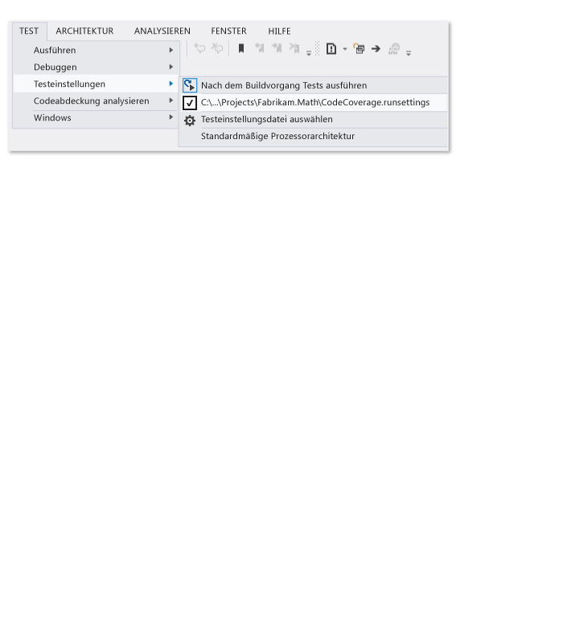

# <a name="customize-code-coverage-analysis"></a>Anpassen der Code Coverage-Analyse

Standardmäßig werden bei der Code Coverage-Analyse alle Projektmappenassemblys analysiert, die während der Komponententests geladen werden. Es wird empfohlen, dieses Standardverhalten beizubehalten, da es meist gut funktioniert. Weitere Informationen finden Sie unter [Bestimmen des Umfangs des zu testenden Codes mithilfe von Code Coverage](../test/using-code-coverage-to-determine-how-much-code-is-being-tested.md).

Fügen Sie das Attribut <xref:System.Diagnostics.CodeAnalysis.ExcludeFromCodeCoverageAttribute> zu Ihrer Testklasse hinzu, um Testcode aus den Code Coverage-Ergebnissen auszuschließen und nur Anwendungscode einzuschließen.

Rufen Sie die *PDB*-Dateien für diese Assemblys ab, und kopieren Sie sie in den gleichen Ordner wie die *DLL*-Assemblydateien, um Assemblys einzuschließen, die nicht Teil Ihrer Projektmappe sind.

## <a name="run-settings-file"></a>Testlaufeinstellungsdatei

Die [Testlaufeinstellungsdatei](../test/configure-unit-tests-by-using-a-dot-runsettings-file.md) ist die Konfigurationsdatei, die von den Tools für Komponententests verwendet wird. Erweiterte Code Coverage-Einstellungen werden in einer *RUNSETTINGS*-Datei angegeben.

Führen Sie die folgenden Schritte aus, um Code Coverage anzupassen:

1. Fügen Sie eine Testlaufeinstellungsdatei zu Ihrer Projektmappe hinzu. Wählen sie im **Projektmappen-Explorer** im Kontextmenü Ihrer Projektmappe die Option **Hinzufügen** > **Neues Element** und **XML-Datei** aus. Speichern Sie die Datei mit einem Namen wie z.B. *CodeCoverage.runsettings*.

2. Fügen Sie den Inhalt der Beispieldatei am Ende dieses Artikels hinzu, und passen Sie diesen anschließend wie in den folgenden Abschnitten beschrieben an Ihre Anforderungen an.

::: moniker range="vs-2017"

3. Wählen Sie im Menü **Test** die Option **Testeinstellungen** > **Datei für Testeinstellungen auswählen** aus, um die Testeinstellungsdatei auszuwählen. Informationen zur Angabe einer Testlaufeinstellungsdatei für die Ausführung von Tests über die Befehlszeile finden Sie unter [Konfigurieren von Komponententests](../test/configure-unit-tests-by-using-a-dot-runsettings-file.md#specify-a-run-settings-file-from-the-command-line).

::: moniker-end

::: moniker range=">=vs-2019"

3. Klicken Sie im Menü **Test** auf die Option **Datei für Testeinstellungen auswählen**, um die Testeinstellungsdatei auszuwählen. Informationen zur Angabe einer Testlaufeinstellungsdatei für die Ausführung von Tests über die Befehlszeile finden Sie unter [Konfigurieren von Komponententests](../test/configure-unit-tests-by-using-a-dot-runsettings-file.md#specify-a-run-settings-file-from-the-command-line).

::: moniker-end

   Wenn Sie **Code Coverage analysieren** auswählen, werden die Konfigurationsinformationen aus der Testlaufeinstellungsdatei gelesen.

   > [!TIP]
   > Alle vorherigen Code Coverage-Ergebnisse und Codefarben werden nicht automatisch ausgeblendet, wenn Sie Tests ausführen oder Ihren Code aktualisieren.

::: moniker range="vs-2017"

Um die benutzerdefinierten Einstellungen ein- und auszuschalten, deaktivieren oder aktivieren Sie die Datei im Menü **Test** > **Testeinstellungen**.



::: moniker-end

::: moniker range=">=vs-2019"

Deaktivieren oder aktivieren Sie die Datei im Menü **Test** , um die benutzerdefinierten Einstellungen ein- und auszuschalten.

::: moniker-end

## <a name="symbol-search-paths"></a>Symbolsuchpfade

Für die Code Coverage sind Symboldateien (*PDB*-Dateien) für Assemblys erforderlich. Für über die Projektmappe erstellte Assemblys werden Symboldateien meistens neben den Binärdateien bereitgestellt, und die Code Coverage funktioniert automatisch. In einigen Fällen sollten Sie Assemblys, auf die verwiesen wird, in die Code Coverage-Analyse einschließen. In solchen Fällen befinden sich die *PDB*-Dateien möglicherweise nicht neben den Binärdateien. Sie können jedoch den Symbolsuchpfad in der *RUNSETTINGS*-Datei angeben.

```xml
<SymbolSearchPaths>
      <Path>\\mybuildshare\builds\ProjectX</Path>
      <!--More paths if required-->
</SymbolSearchPaths>
```

> [!NOTE]
> Die Symbolauflösung kann zeitaufwendig sein, insbesondere wenn sie einen Remotedateispeicherort mit zahlreichen Assemblys verwendet. Daher sollten Sie in Erwägung ziehen, die *PDB*-Dateien in denselben lokalen Speicherort zu kopieren wie die Binärdateien (*DLL* und *EXE*).

## <a name="include-or-exclude-assemblies-and-members"></a>Einschließen oder Ausschließen von Assemblys und Membern

Sie können Assemblys oder spezifische Typen und Member für die Code Coverage-Analyse einschließen oder ausschließen. Wenn der Abschnitt **Include** (Einschließen) leer ist oder ausgelassen wird, werden alle geladenen Assemblys und deren zugehörigen PDB-Dateien eingeschlossen. Wenn eine Assembly oder ein Member mit einer Klausel im Abschnitt **Exclude** (Ausschließen) übereinstimmt, wird sie bzw. er von der Code Coverage-Analyse ausgeschlossen. Der Abschnitt **Exclude** (Ausschließen) hat Vorrang vor dem Abschnitt **Include** (Einschließen): Wenn eine Assembly sowohl in **Include** als auch in **Exclude** aufgeführt wird, wird sie nicht in die Code Coverage-Analyse eingeschlossen.

Mit dem folgenden XML-Code wird eine einzelne Assembly beispielsweise ausgeschlossen, indem ihr Name angegeben wird:

```xml
<ModulePaths>
  <Exclude>
   <ModulePath>.*Fabrikam.Math.UnitTest.dll</ModulePath>
   <!-- Add more ModulePath nodes here. -->
  </Exclude>
</ModulePaths>
```

Im folgenden Beispiel wird festgelegt, dass nur eine einzelne Assembly in Code Coverage enthalten werden soll:

```xml
<ModulePaths>
  <Include>
   <ModulePath>.*Fabrikam.Math.dll</ModulePath>
   <!-- Add more ModulePath nodes here. -->
  </Include>
</ModulePaths>
```

In der folgenden Tabelle werden die verschiedenen Methoden aufgeführt, mit denen Assemblys und Member zum Einschließen oder Ausschließen aus Code Coverage identifiziert werden können.

| XML-Element | Gesuchte Übereinstimmung |
| - | - |
| ModulePath | Gleicht Assemblys anhand des Assemblynamens oder Dateipfads ab. |
| CompanyName | Gleicht Assemblys anhand des Attributs **Company** ab. |
| PublicKeyToken | Gleicht signierte Assemblys nach dem öffentlichen Schlüsseltoken ab. |
| Quelle | Gleicht Elemente anhand des Pfadnamens der Quelldatei ab, in der sie definiert sind. |
| Attribut | Entspricht Elementen, die das festgelegte Attribut aufweisen. Geben Sie den vollständigen Namen des Attributs an (beispielsweise `<Attribute>^System\.Diagnostics\.DebuggerHiddenAttribute$</Attribute>`).<br/><br/>Wenn Sie das Attribut <xref:System.Runtime.CompilerServices.CompilerGeneratedAttribute> ausschließen, werden Code, der Sprachfunktionen wie `async`, `await` und `yield return` verwendet, und automatisch implementierte Eigenschaften von der Code Coverage-Analyse ausgeschlossen. Wenn Sie tatsächlich generierten Code ausschließen möchten, schließen Sie nur das Attribut <xref:System.CodeDom.Compiler.GeneratedCodeAttribute> aus. |
| Funktion | Gleicht Prozeduren, Funktionen oder Methoden nach dem vollqualifizierten Namen, einschließlich der Parameterliste, ab. Mithilfe eines [regulären Ausdrucks](#regular-expressions) können Sie auch nach einer Übereinstimmung mit einem Teil des Namens suchen.<br/><br/>Beispiele:<br/><br/>`Fabrikam.Math.LocalMath.SquareRoot(double);` (C#)<br/><br/>`Fabrikam::Math::LocalMath::SquareRoot(double)` (C++) |

### <a name="regular-expressions"></a>Reguläre Ausdrücke

Include- und exclude-Knoten verwenden reguläre Ausdrücke, die nicht mit Platzhaltern identisch sind. Bei allen Entsprechungen wird die Groß-/Kleinschreibung nicht beachtet. Beispiele:

- **.\*** entspricht einer Zeichenfolge beliebiger Zeichen

- **\\.** entspricht einem Punkt „.“

- **\\(   \\)** entspricht Klammern „(  )“

- **\\\\** entspricht dem Dateipfadtrennzeichen „\\“

- **^** entspricht dem Anfang der Zeichenfolge

- **$** entspricht dem Ende der Zeichenfolge

Im folgenden XML-Code wird veranschaulicht, wie Sie spezifische Assemblys mithilfe von regulären Ausdrücken einschließen oder ausschließen:

```xml
<ModulePaths>
  <Include>
    <!-- Include all loaded .dll assemblies (but not .exe assemblies): -->
    <ModulePath>.*\.dll$</ModulePath>
  </Include>
  <Exclude>
    <!-- But exclude some assemblies: -->
    <ModulePath>.*\\Fabrikam\.MyTests1\.dll$</ModulePath>
    <!-- Exclude all file paths that contain "Temp": -->
    <ModulePath>.*Temp.*</ModulePath>
  </Exclude>
</ModulePaths>
```

Im folgenden XML-Code wird veranschaulicht, wie Sie spezifische Funktionen mithilfe von regulären Ausdrücken einschließen oder ausschließen:

```xml
<Functions>
  <Include>
    <!-- Include methods in the Fabrikam namespace: -->
    <Function>^Fabrikam\..*</Function>
    <!-- Include all methods named EqualTo: -->
    <Function>.*\.EqualTo\(.*</Function>
  </Include>
  <Exclude>
    <!-- Exclude methods in a class or namespace named UnitTest: -->
    <Function>.*\.UnitTest\..*</Function>
  </Exclude>
</Functions>
```

> [!WARNING]
> Wenn ein Fehler in einem regulären Ausdruck auftritt, z.B. eine Klammer ohne Escapezeichen oder Übereinstimmung, wird die Code Coverage-Analyse nicht ausgeführt.

Weitere Informationen zu regulären Ausdrücken finden Sie unter [Verwenden von regulären Ausdrücken in Visual Studio](../ide/using-regular-expressions-in-visual-studio.md).

## <a name="sample-runsettings-file"></a>Beispiel für eine RUNSETTINGS-Datei

Kopieren Sie diesen Code, und passen Sie ihn Ihren Anforderungen entsprechend an.

```xml
<?xml version="1.0" encoding="utf-8"?>
<!-- File name extension must be .runsettings -->
<RunSettings>
  <DataCollectionRunSettings>
    <DataCollectors>
      <DataCollector friendlyName="Code Coverage" uri="datacollector://Microsoft/CodeCoverage/2.0" assemblyQualifiedName="Microsoft.VisualStudio.Coverage.DynamicCoverageDataCollector, Microsoft.VisualStudio.TraceCollector, Version=11.0.0.0, Culture=neutral, PublicKeyToken=b03f5f7f11d50a3a">
        <Configuration>
          <CodeCoverage>
<!--
Additional paths to search for .pdb (symbol) files. Symbols must be found for modules to be instrumented.
If .pdb files are in the same folder as the .dll or .exe files, they are automatically found. Otherwise, specify them here.
Note that searching for symbols increases code coverage runtime. So keep this small and local.
-->
<!--
            <SymbolSearchPaths>
                   <Path>C:\Users\User\Documents\Visual Studio 2012\Projects\ProjectX\bin\Debug</Path>
                   <Path>\\mybuildshare\builds\ProjectX</Path>
            </SymbolSearchPaths>
-->

<!--
About include/exclude lists:
Empty "Include" clauses imply all; empty "Exclude" clauses imply none.
Each element in the list is a regular expression (ECMAScript syntax). See /visualstudio/ide/using-regular-expressions-in-visual-studio.
An item must first match at least one entry in the include list to be included.
Included items must then not match any entries in the exclude list to remain included.
-->

            <!-- Match assembly file paths: -->
            <ModulePaths>
              <Include>
                <ModulePath>.*\.dll$</ModulePath>
                <ModulePath>.*\.exe$</ModulePath>
              </Include>
              <Exclude>
                <ModulePath>.*CPPUnitTestFramework.*</ModulePath>
              </Exclude>
            </ModulePaths>

            <!-- Match fully qualified names of functions: -->
            <!-- (Use "\." to delimit namespaces in C# or Visual Basic, "::" in C++.)  -->
            <Functions>
              <Exclude>
                <Function>^Fabrikam\.UnitTest\..*</Function>
                <Function>^std::.*</Function>
                <Function>^ATL::.*</Function>
                <Function>.*::__GetTestMethodInfo.*</Function>
                <Function>^Microsoft::VisualStudio::CppCodeCoverageFramework::.*</Function>
                <Function>^Microsoft::VisualStudio::CppUnitTestFramework::.*</Function>
              </Exclude>
            </Functions>

            <!-- Match attributes on any code element: -->
            <Attributes>
              <Exclude>
                <!-- Don't forget "Attribute" at the end of the name -->
                <Attribute>^System\.Diagnostics\.DebuggerHiddenAttribute$</Attribute>
                <Attribute>^System\.Diagnostics\.DebuggerNonUserCodeAttribute$</Attribute>
                <Attribute>^System\.CodeDom\.Compiler\.GeneratedCodeAttribute$</Attribute>
                <Attribute>^System\.Diagnostics\.CodeAnalysis\.ExcludeFromCodeCoverageAttribute$</Attribute>
              </Exclude>
            </Attributes>

            <!-- Match the path of the source files in which each method is defined: -->
            <Sources>
              <Exclude>
                <Source>.*\\atlmfc\\.*</Source>
                <Source>.*\\vctools\\.*</Source>
                <Source>.*\\public\\sdk\\.*</Source>
                <Source>.*\\microsoft sdks\\.*</Source>
                <Source>.*\\vc\\include\\.*</Source>
              </Exclude>
            </Sources>

            <!-- Match the company name property in the assembly: -->
            <CompanyNames>
              <Exclude>
                <CompanyName>.*microsoft.*</CompanyName>
              </Exclude>
            </CompanyNames>

            <!-- Match the public key token of a signed assembly: -->
            <PublicKeyTokens>
              <!-- Exclude Visual Studio extensions: -->
              <Exclude>
                <PublicKeyToken>^B77A5C561934E089$</PublicKeyToken>
                <PublicKeyToken>^B03F5F7F11D50A3A$</PublicKeyToken>
                <PublicKeyToken>^31BF3856AD364E35$</PublicKeyToken>
                <PublicKeyToken>^89845DCD8080CC91$</PublicKeyToken>
                <PublicKeyToken>^71E9BCE111E9429C$</PublicKeyToken>
                <PublicKeyToken>^8F50407C4E9E73B6$</PublicKeyToken>
                <PublicKeyToken>^E361AF139669C375$</PublicKeyToken>
              </Exclude>
            </PublicKeyTokens>

            <!-- We recommend you do not change the following values: -->

            <!-- Set this to True to collect coverage information for functions marked with the "SecuritySafeCritical" attribute. Instead of writing directly into a memory location from such functions, code coverage inserts a probe that redirects to another function, which in turns writes into memory. -->
            <UseVerifiableInstrumentation>True</UseVerifiableInstrumentation>
            <!-- When set to True, collects coverage information from child processes that are launched with low-level ACLs, for example, UWP apps. -->
            <AllowLowIntegrityProcesses>True</AllowLowIntegrityProcesses>
            <!-- When set to True, collects coverage information from child processes that are launched by test or production code. -->
            <CollectFromChildProcesses>True</CollectFromChildProcesses>
            <!-- When set to True, restarts the IIS process and collects coverage information from it. -->
            <CollectAspDotNet>False</CollectAspDotNet>

          </CodeCoverage>
        </Configuration>
      </DataCollector>
    </DataCollectors>
  </DataCollectionRunSettings>
</RunSettings>
```

## <a name="see-also"></a>Siehe auch

- [Konfigurieren von Komponententests mithilfe einer Testlaufeinstellungsdatei](../test/configure-unit-tests-by-using-a-dot-runsettings-file.md)
- [Bestimmen des Umfangs des zu testenden Codes mithilfe von Code Coverage](../test/using-code-coverage-to-determine-how-much-code-is-being-tested.md)
- [Ausführen von Komponententests für Code](../test/unit-test-your-code.md)
