# Bearbeiten von Tests der programmierten UI mithilfe des Editors für Tests der programmierten UI

Mit dem Editor für Tests der programmierten UI können Sie Tests der programmierten UI mühelos ändern. Er ermöglicht das Suchen, Anzeigen und Bearbeiten von Eigenschaften der Testmethoden und UI-Aktionen. Darüber hinaus können Sie mit der UI-Steuerelementzuordnung die entsprechenden Steuerelemente anzeigen und bearbeiten.

[!INCLUDE [coded-ui-test-deprecation](includes/coded-ui-test-deprecation.md)]

**Anforderungen**

- Visual Studio Enterprise
- Komponente „Test der programmierten UI“

## Features des Editors für Tests der programmierten UI

Mit dem Editor für Tests der programmierten UI sind Sie schneller und effizienter, als wenn Sie den Code in den Testmethoden der programmierten UI mithilfe des Code-Editors bearbeiten. Mit dem Editor für Tests der programmierten UI können Sie mithilfe der Symbolleiste und der Kontextmenüs schneller die den UI-Aktionen und -Steuerelementen zugeordneten Eigenschaftswerte finden und bearbeiten. Mit der Symbolleiste des Editors für Tests der programmierten UI können Sie beispielsweise die folgenden Befehle ausführen:

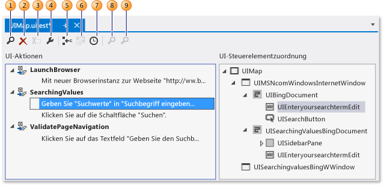

1. Mit [Suchen](../ide/finding-and-replacing-text.md) können Sie nach UI-Aktionen und -Steuerelementen suchen.

2. Mit**Löschen** können Sie unerwünschte UI-Aktionen entfernen.

3. Mit**Umbenennen** können Sie die Namen für Testmethoden und Steuerelemente ändern.

4. **Eigenschaften** Öffnet das **Eigenschaftenfenster** für das ausgewählte Element.

5. Mit**In eine neue Methode aufteilen** können Sie UI-Aktionen modularisieren.

6. Mit**Code verschieben** können Sie benutzerdefinierten Code zu Testmethoden  hinzufügen.

7. Mit**Verzögerung einfügen vor** können Sie eine Pause in Millisekunden vor einer UI-Aktion hinzufügen.

8. Mit**UI-Steuerelement suchen** wird die Position des Steuerelements in der Benutzeroberfläche der getesteten Anwendung ermittelt.

9. Mit **Alle suchen** können Sie Steuerelementeigenschaften und bedeutende Änderungen an den Steuerelementen der Anwendung überprüfen.

Wenn Sie die Datei *UIMap.uitest* öffnen, die Ihrem Test der programmierten UI zugeordnet ist, wird der Test im **Editor für Tests der programmierten UI** geöffnet. In den folgenden Verfahren wird beschrieben, wie Sie mithilfe der Symbolleiste und den Kontextmenüs des Editors die Testmethoden, Eigenschaften für die UI-Aktionen und Steuerelemente finden und bearbeiten können.

## Einen Test der codierten UI öffnen

Mit dem **Editor für Tests der programmierten UI** können Sie den Visual C#- und Visual Basic-basierten Test der programmierten UI anzeigen und bearbeiten.

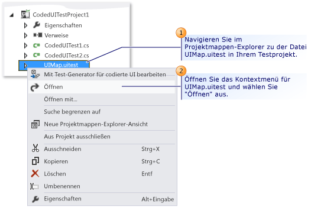

Öffnen Sie im **Projektmappen-Explorer** das Kontextmenü für *UIMap.uitest*, und klicken Sie auf **Öffnen**. Der Test der programmierten UI wird im **Editor für Tests der programmierten UI** angezeigt. Sie können nun aufgezeichnete Methoden, Aktionen und entsprechende Steuerelemente im Test der programmierten UI anzeigen und bearbeiten.

> [!TIP]
> Beim Auswählen einer UI-Aktion, die in einer Methode im Bereich **UI-Aktionen** enthalten ist, wird das entsprechende Steuerelement hervorgehoben. Sie können auch die UI-Aktion oder die Steuerelementeigenschaften ändern.

## Ändern der Eigenschaften von UI-Aktionen und Steuerelementen

Mit dem Editor für Tests der programmierten UI, können Sie leicht alle UI-Aktionen in den Testmethoden finden und anzeigen. Wenn Sie die UI-Aktion im Editor auswählen, wird das entsprechende Steuerelement automatisch hervorgehoben. Wenn Sie ein Steuerelement auswählen, werden entsprechend die zugeordneten UI-Aktionen hervorgehoben. Wenn Sie eine UI-Aktion oder ein -Steuerelement auswählen, können Sie dann einfach das Fenster **Eigenschaften** verwenden, um die entsprechenden Eigenschaften zu ändern.

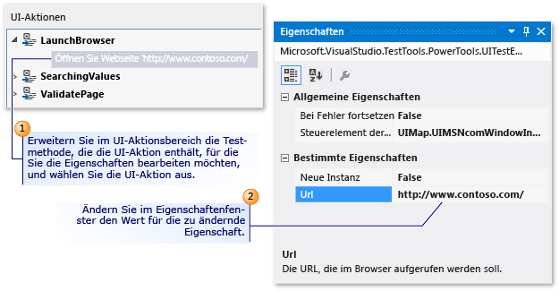

Erweitern Sie zum Ändern der Eigenschaften einer UI-Aktion die Testmethode im Bereich **UI-Aktion** , die die UI-Aktion mit den zu bearbeitenden Eigenschaften enthält. Wählen Sie die UI-Aktion aus, und ändern Sie dann die Eigenschaften im Fenster „Eigenschaften“.

Wenn ein Server beispielsweise nicht verfügbar ist und in Ihrem Webbrowser die UI-Aktion **Zur Webseite „<http://Contoso1/default.aspx>“ wechseln** vorhanden ist, können Sie die URL in `'http://Contoso2/default.aspx'` ändern.

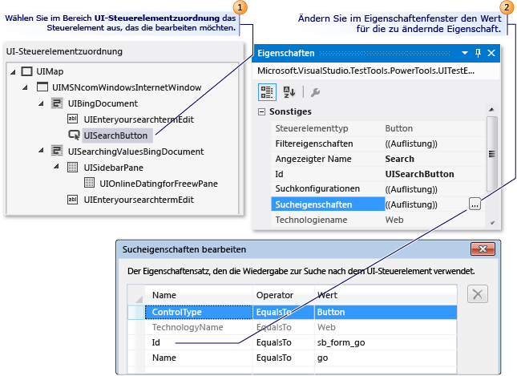

Die Änderung der Eigenschaften eines Steuerelements erfolgt auf die gleiche Weise wie die der UI-Aktionen. Wählen Sie im Bereich **UI-Steuerelementzuordnung** das zu bearbeitende Steuerelement aus, und bearbeiten Sie seine Eigenschaften im Fenster **Eigenschaften**.

Ein Entwickler kann z.B. die **(ID)**-Eigenschaft auf einem Schaltflächensteuerelement im Quellcode für die getestete Anwendung von „idSubmit“ in „idLogin“ geändert haben. Wenn die **(ID)** -Eigenschaft in der Anwendung geändert wurde, kann der Test der programmierten UI nicht das Schaltflächen-Steuerelement finden, und es wird ein Fehler ausgegeben. In diesem Fall kann der Tester die Auflistung **Sucheigenschaften** öffnen und die **ID** -Eigenschaft auf den neuen Wert festlegen, den der Entwickler in der Anwendung verwendet hat. Der Tester kann auch den Eigenschaftswert von **Anzeigename** von „Submit“ in „Login“ ändern. Durch diese Änderung wird die zugeordnete UI-Aktion im Editor für Tests der programmierten UI von „Schaltfläche ‚Submit‘ auswählen“ in „Schaltfläche ‚Login‘ auswählen“ geändert.

Nachdem Sie die Änderungen abgeschlossen haben, speichern Sie die Änderungen in der Datei *UIMap.Designer*, indem Sie auf der Symbolleiste von Visual Studio **Speichern** auswählen.

### Tipps

- Wenn das Fenster **Eigenschaften** nicht angezeigt wird, halten Sie **ALT** gedrückt, und drücken Sie die **EINGABETASTE**, oder drücken Sie **F4**.

- Klicken Sie im Menü **Bearbeiten** auf **Rückgängig**, oder drücken Sie die Tasten **STRG**+**Z**, wenn Sie Änderungen an den Eigenschaften rückgängig machen wollen.

- Mit der Schaltfläche **Suchen** in der Symbolleiste des Editors für Tests der programmierten UI können Sie das Tool zum **Suchen und Ersetzen** in Visual Studio öffnen. Anschließend können Sie mit dem Steuerelement **Suchen** nach einer UI-Aktion im Editor für Tests der programmierten UI suchen. Sie können z.B. die Option „Auf die Schaltfläche ‚Anmelden‘ klicken“ suchen. Dies kann bei umfangreichen Tests hilfreich sein. Sie können die Ersetzungsfunktion nicht im Tool zum **Suchen und Ersetzen** im Editor für Tests der programmierten UI verwenden. Weitere Informationen finden Sie in [Suchen und Ersetzen von Text](../ide/finding-and-replacing-text.md) in den Informationen zum Steuerelement „Suchen“.

- Manchmal kann die Darstellung der Position der Steuerelemente in der Benutzeroberfläche der getesteten Anwendung schwierig sein. Zu den Funktionen des Editors für Tests der programmierten UI zählen die Möglichkeiten zum Auswählen eines Steuerelements, das in der UI-Steuerelementzuordnung aufgeführt ist, und zum Anzeigen der Position in der getesteten Anwendung. Weitere Information finden Sie unter [Suchen eines UI-Steuerelements in der getesteten Anwendung](#locate-a-ui-control-in-the-application-under-test) im weiteren Verlauf dieses Artikels.

- Möglicherweise müssen Sie das Containersteuerelement erweitern, das das zu bearbeitende Steuerelement enthält. Weitere Informationen finden Sie unter [Suchen eines Steuerelements und seiner Nachfolgerelemente](#locate-a-control-and-its-descendants) im weiteren Verlauf dieses Artikels.

## Unerwünschte UI-Aktionen löschen

Sie können unerwünschte UI-Aktionen in dem Test der programmierten UI leicht entfernen.

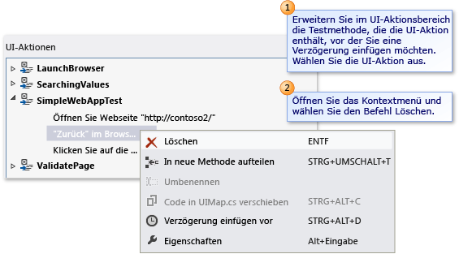

Erweitern Sie im Bereich **UI-Aktion** die Testmethode, die die zu löschende UI-Aktion enthält. Öffnen Sie das Kontextmenü für die UI-Aktion, und wählen Sie dann **Löschen**.

## Eine Testmethode in zwei separate Methoden aufteilen

Sie können eine Testmethode aufteilen, um die UI-Aktionen zu optimieren und zu modularisieren. Beispielsweise kann der Test eine einzelne Testmethode mit UI-Aktionen in zwei Containersteuerelementen beinhalten. Die UI-Aktionen werden ggf. besser in zwei Methoden modularisiert, die einem Container entsprechen.

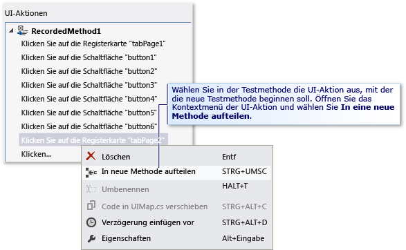

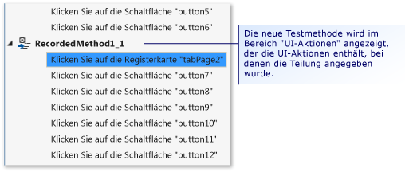

Erweitern Sie im Bereich **UI-Aktion** die Testmethode, die Sie in zwei separate Methoden aufteilen möchten, und wählen Sie die UI-Aktion, die als Anfang der neuen Testmethode dienen soll. Öffnen Sie entweder das Kontextmenü für die UI-Aktion, und wählen Sie dann **In eine neue Methode aufteilen**, oder wählen Sie die Schaltfläche **In eine neue Methode aufteilen** auf der Symbolleiste des Editors für Tests der programmierten UI. Die neue Testmethode wird im Bereich **UI-Aktionen** angezeigt. Sie enthält UI-Aktionen, beginnend mit der Aktion, in der Sie die Aufteilung angegeben haben.

Wenn Sie die Aufteilung der Methode abgeschlossen haben, speichern Sie die Änderungen in der Datei *UIMap.Designer*, indem Sie auf der Symbolleiste von Visual Studio auf **Speichern** klicken.

> [!WARNING]
> Wenn eine Methode aufgeteilt wird, müssen Sie den Code ändern, mit dem die vorhandene Methode aufgerufen wird, damit die neue erstellte Methode auch aufgerufen wird, falls Sie die enthaltenen UI-Aktionen weiterhin benötigen. Beim Aufteilen einer Methode wird ein Microsoft Visual Studio-Dialogfeld angezeigt. In diesem werden Sie darauf hingewiesen, dass Sie jeglichen Code ändern müssen, mit dem die vorhandene Methode aufgerufen wird, damit die neue Methode auch aufgerufen wird. Klicken Sie auf **Ja**.

### Tipps

- Wenn Sie die Aufteilung rückgängig machen möchten, klicken Sie im Menü **Bearbeiten** auf **Rückgängig**, oder drücken Sie **STRG**+**Z**.

- Sie können die neue Methode umbenennen. Wählen Sie sie im Bereich **UI-Aktionen** aus, und wählen Sie die Schaltfläche **Umbenennen** in der Symbolleiste des Editors für Tests der programmierten UI aus.

   - oder - 

   Öffnen Sie das Kontextmenü für die neue Testmethode, und wählen Sie **Umbenennen**.

   Ein Microsoft Visual Studio-Dialogfeld wird angezeigt. In diesem werden Sie darauf hingewiesen, dass Sie jeglichen Code ändern müssen, der auf die Methode verweist. Klicken Sie auf **Ja**.

## Verschieben einer Testmethode in die UIMap-Datei, um Anpassungen zu vereinfachen

Wenn Sie feststellen, dass eine der Testmethoden im Test der programmierten UI benutzerdefinierten Code erfordert, müssen Sie sie in die Datei *UIMap.cs* oder *UIMap.vb* verschieben. Andernfalls wird der Code beim erneuten Kompilieren des Tests der programmierten UI überschrieben. Wenn Sie die Methode nicht verschieben, wird der benutzerdefinierte Code bei jedem erneuten Kompilieren des Tests überschrieben.

Wählen Sie im Bereich **UI-Aktion** die Testmethode aus, die Sie in die Datei *UIMap.cs* oder *UIMap.vb* verschieben möchten. Dadurch vereinfachen Sie die Funktion für benutzerdefinierten Code, die beim erneuten Kompilieren des Tests nicht überschrieben wird. Wählen Sie als Nächstes die Schaltfläche **Code verschieben** auf der Symbolleiste des Editors für Tests der programmierten UI, oder öffnen Sie das Kontextmenü für die Testmethode und wählen **Code verschieben**aus. Die Testmethode wird aus der Datei *UIMap.uitest* entfernt und nicht mehr im Bereich der **UI-Aktionen** angezeigt. Öffnen Sie zum Bearbeiten der verschobenen Testdatei die Datei *UIMap.cs* oder *UIMap.vb* im **Projektmappen-Explorer**.

Wenn Sie die Methode verschoben haben, speichern Sie die Änderungen in der Datei *UIMap.Designer*, indem Sie auf der Symbolleiste von Visual Studio auf **Speichern** klicken.

> [!WARNING]
> Nach dem Verschieben einer Methode kann sie mit dem Editor für Tests der programmierten UI nicht mehr bearbeitet werden. Sie müssen den benutzerdefinierten Code hinzufügen und ihn mit dem Code-Editor verwalten. Beim Verschieben einer Methode wird ein Microsoft Visual Studio-Dialogfeld angezeigt. Sie werden darauf hingewiesen, dass die Methode aus der Datei *UIMap.uitest* in die Datei *UIMap.cs* oder *UIMap.vb* verschoben wird, und dass die Methode mit dem Editor für Tests der programmierten UI nicht mehr bearbeitet werden kann. Klicken Sie auf **Ja**.

### Tipps

Wenn Sie die Verschiebung rückgängig machen möchten, klicken Sie im Menü **Bearbeiten** auf **Rückgängig**, oder drücken Sie **STRG**+**Z**. Allerdings müssen Sie den Code dann manuell aus der Datei *UIMap.cs* oder *UIMap.vb* entfernen.

## Suchen eines UI-Steuerelements in der getesteten Anwendung

Manchmal kann die Darstellung der Position der Steuerelemente in der Benutzeroberfläche der getesteten Anwendung schwierig sein. Zu den Funktionen des Editors für Tests der programmierten UI zählen die Möglichkeiten zum Auswählen eines Steuerelements, das in der UI-Steuerelementzuordnung aufgeführt ist, und zum Anzeigen der Position in der getesteten Anwendung. Mit der Funktion **UI-Steuerelemente suchen** in der getesteten Anwendung können auch Änderungen der Sucheigenschaften überprüft werden, die an einem Steuerelement vorgenommen wurden.

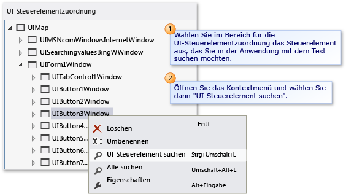

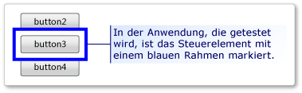

Wählen Sie im Bereich **UI-Steuerelementzuordnung** das Steuerelement aus, das Sie in der Anwendung mit dem Test suchen möchten. Öffnen Sie das Kontextmenü für das Steuerelement, und wählen Sie dann **UI-Steuerelement suchen**. In der Anwendung, die getestet wird, ist das Steuerelement mit einem blauen Rahmen markiert.

> [!NOTE]
> Stellen Sie vor dem Suchen eines UI-Steuerelements sicher, dass die Anwendung mit dem Test ausgeführt wird.

### Tipps

Sie können die Option **Alle suchen** verwenden, um zu überprüfen, ob die Position aller Steuerelemente in einem Container korrekt ermittelt werden kann. Diese Option wird im nächsten Abschnitt beschrieben.

## Suchen eines Steuerelements und seiner Nachfolgerelemente

Sie können überprüfen, ob alle Steuerelemente in einem Container in der Benutzeroberfläche der getesteten Anwendung ordnungsgemäß ermittelt werden können. Dies kann bei der Überprüfung von Sucheigenschaftenänderungen hilfreich sein, die möglicherweise am Container vorgenommen wurden. Außerdem können Sie bei umfangreichen Änderungen an der Benutzeroberfläche der getesteten Anwendung überprüfen, ob die vorhandenen Eigenschaften für die Steuerelementsuche weiterhin korrekt sind.

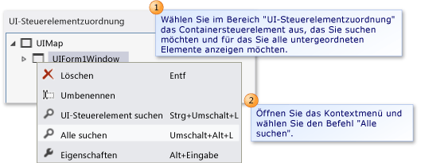

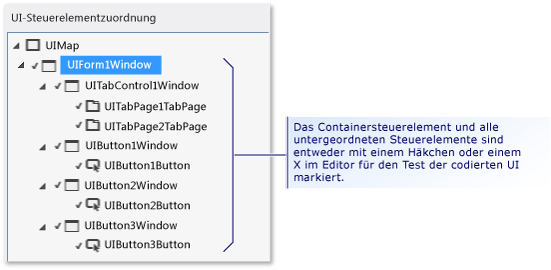

Wählen Sie im Bereich **UI-Steuerelementzuordnung** das Containersteuerelement aus, das Sie suchen möchten und für das Sie alle Nachfolgerelemente anzeigen möchten. Öffnen Sie das Kontextmenü für das Steuerelement, und wählen Sie dann **Alle suchen**. Das Containersteuerelement und alle Nachfolgersteuerelemente sind entweder mit einem grünen Häkchen oder einem roten „X“ im Editor für Tests der programmierten UI markiert. Anhand dieser Markierungen sehen Sie, ob die Steuerelemente in der getesteten Anwendung erfolgreich ermittelt werden konnten.

> [!NOTE]
> Stellen Sie vor dem Suchen der UI-Steuerelemente sicher, dass die Anwendung mit dem Test ausgeführt wird.

## Einfügen einer Verzögerung vor einer UI-Aktion

Gelegentlich soll der Test möglicherweise auf bestimmte Ereignisse warten, z. B. das Anzeigen eines Fensters, das Ausblenden einer Statusleiste usw. Mit dem Editor für Tests der programmierten UI können Sie zu diesem Zweck vor einer UI-Aktion eine Verzögerung einfügen. Sie können angeben, wie viele Sekunden die Verzögerung dauern soll.

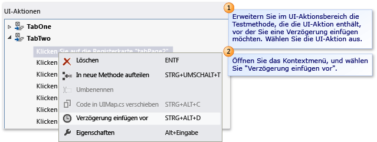

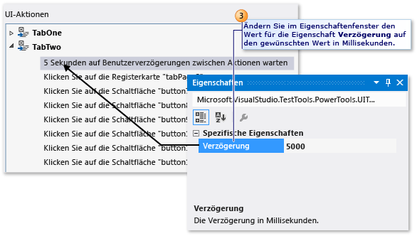

Erweitern Sie im Bereich **UI-Aktion** die Testmethode mit der UI-Aktion, vor die Sie eine Verzögerung einfügen möchten. Wählen Sie die UI-Aktion aus. Öffnen Sie das Kontextmenü für die UI-Aktion, und wählen Sie **Verzögerung einfügen vor**. Eine Verzögerung wird vor der ausgewählten UI-Aktion mit dem folgenden Text eingefügt und hervorgehoben: **1 Sekunde auf Benutzerverzögerungen zwischen Aktionen warten**. Ändern Sie im Fenster **Eigenschaften** den Wert für die Eigenschaft **Verzögerung** auf die gewünschte Anzahl von Millisekunden.

Wenn Sie das Einfügen der Verzögerung abgeschlossen haben, speichern Sie die Änderungen in der Datei *UIMap.Designer*, indem Sie auf der Symbolleiste von Visual Studio auf **Speichern** klicken.

Wenn ein bestimmtes Steuerelement vor einer UI-Aktion verfügbar sein muss, sollten Sie mit der entsprechenden UITestControl.WaitForControlXXX-Methode ggf. benutzerdefinierten Code zur Testmethode hinzufügen. Weitere Informationen finden Sie unter [Festlegen, dass bei Wiedergabe von Tests der programmierten UI auf bestimmte Ereignisse gewartet wird](../test/making-coded-ui-tests-wait-for-specific-events-during-playback.md).

## Siehe auch

- [Verwenden der Benutzeroberflächenautomatisierung zum Testen des Codes](../test/use-ui-automation-to-test-your-code.md)
- [Erstellen von Tests der programmierten UI](../test/use-ui-automation-to-test-your-code.md)
- [Erstellen eines datengesteuerten Tests für die programmierte UI](../test/creating-a-data-driven-coded-ui-test.md)
- [Exemplarische Vorgehensweise: Erstellen, Bearbeiten und Verwalten von Tests der programmierten UI](../test/walkthrough-creating-editing-and-maintaining-a-coded-ui-test.md)