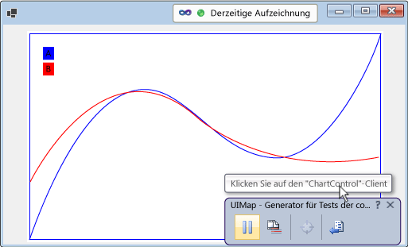
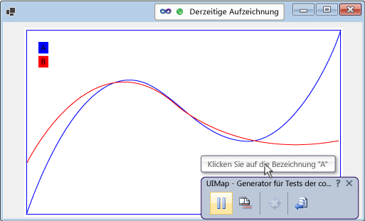
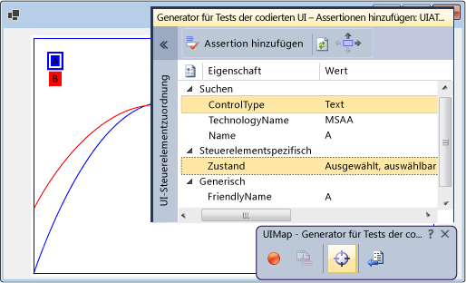

# <a name="enable-coded-ui-testing-of-your-controls"></a>Aktivieren von Tests der programmierten UI Ihrer Steuerelemente

Steuerelemente können besser getestet werden, wenn Sie Unterstützung für das Testframework der programmierten UI implementieren. Der Umfang der Unterstützung kann schrittweise erweitert werden. Beginnen Sie mit der Unterstützung von Aufzeichnung und Wiedergabe sowie Eigenschaftenvalidierung. Konfigurieren Sie anschließend den Test-Generator der programmierten UI so, dass die benutzerdefinierten Eigenschaften des Steuerelements erkannt werden. Stellen Sie benutzerdefinierte Klassen bereit, um den Zugriff auf diese Eigenschaften aus generiertem Code zu ermöglichen. Außerdem können Sie dazu beitragen, dass Aktionen vom Test-Generator der programmierten UI auf eine Art aufgezeichnet werden, die den Zweck der jeweiligen Aktion genauer widerspiegelt.


[!INCLUDE [coded-ui-test-deprecation](includes/coded-ui-test-deprecation.md)]

## <a name="support-record-and-playback-and-property-validation-by-implementing-accessibility"></a>Unterstützen von Aufzeichnung und Wiedergabe sowie Eigenschaftenvalidierung durch Implementieren von Barrierefreiheit

Der Test-Generator der programmierten UI erfasst Informationen zu den Steuerelementen, die während einer Aufzeichnung gefunden werden, und generiert dann Code zur Wiedergabe dieser Sitzung. Wenn Barrierefreiheit vom Steuerelement nicht unterstützt wird, erfasst der Test-Generator der programmierten UI Aktionen wie z.B. Mausklicks anhand von Bildschirmkoordinaten. Bei der Wiedergabe des Tests werden diese Aktionen vom generierten Code an den gleichen Bildschirmkoordinaten ausgeführt. Wenn das Steuerelement bei der Wiedergabe des Tests an einer anderen Stelle auf dem Bildschirm angezeigt wird, kann der generierte Code die entsprechende Aktion nicht ausführen. Wenn Sie Barrierefreiheit für das Steuerelement nicht implementieren, kann dies möglicherweise zu Fehlern führen, wenn die Testwiedergabe auf unterschiedlichen Bildschirmkonfigurationen oder in unterschiedlichen Umgebungen erfolgt oder Änderungen am Benutzeroberflächenlayout vorgenommen wurden.



Wenn Sie Barrierefreiheit implementieren, wird diese vom Test-Generator der programmierten UI im Rahmen der Testaufzeichnung für das Erfassen von Informationen zum Steuerelement verwendet. Bei der anschließenden Ausführung des Tests erfolgt die Wiedergabe der entsprechenden Ereignisse durch den generierten Code auf dem Steuerelement, auch wenn sich dieses an einer anderen Stelle der Benutzeroberfläche befindet. Testautoren können mithilfe der grundlegenden Eigenschaften des Steuerelements auch Assert-Vorgänge erstellen.



### <a name="to-support-record-and-playback-property-validation-and-navigation-for-a-windows-forms-control"></a>So unterstützen Sie Aufzeichnung und Wiedergabe, Eigenschaftenvalidierung und Navigation für ein Windows Forms-Steuerelement
Barrierefreiheit kann wie in der folgenden Prozedur dargestellt implementieren werden. Ein ausführliche Anleitung finden Sie unter <xref:System.Windows.Forms.AccessibleObject>.


1. Implementieren Sie eine von <xref:System.Windows.Forms.Control.ControlAccessibleObject> abgeleitete Klasse, und überschreiben Sie die <xref:System.Windows.Forms.Control.AccessibilityObject%2A>-Eigenschaft, um ein Objekt der Klasse zurückzugeben.

    ```csharp
    public partial class ChartControl : UserControl
    {
        // Overridden to return the custom AccessibleObject for the control.
        protected override AccessibleObject CreateAccessibilityInstance()
        {
            return new ChartControlAccessibleObject(this);
        }

        // Inner class ChartControlAccessibleObject represents accessible information
        // associated with the ChartControl and is used when recording tests.
        public class ChartControlAccessibleObject : ControlAccessibleObject
        {
            ChartControl myControl;
            public ChartControlAccessibleObject(ChartControl ctrl)
                : base(ctrl)
            {
                myControl = ctrl;
            }
        }
    }
    ```

2. Überschreiben Sie die Eigenschaften und Methoden <xref:System.Windows.Forms.AccessibleObject.Role%2A>, <xref:System.Windows.Forms.AccessibleObject.State%2A>, <xref:System.Windows.Forms.AccessibleObject.GetChild%2A> sowie <xref:System.Windows.Forms.AccessibleObject.GetChildCount%2A> des Barrierefreiheitsobjekts.

3. Implementieren Sie ein anderes Barrierefreiheitsobjekt für das untergeordnete Steuerelement, und überschreiben Sie die <xref:System.Windows.Forms.Control.AccessibilityObject%2A>-Eigenschaft des Steuerelements, um das Objekt für die Barrierefreiheit zurückzugeben.

4. Überschreiben Sie die Eigenschaften und Methoden <xref:System.Windows.Forms.AccessibleObject.Bounds%2A>, <xref:System.Windows.Forms.AccessibleObject.Name%2A>, <xref:System.Windows.Forms.AccessibleObject.Parent%2A>, <xref:System.Windows.Forms.AccessibleObject.Role%2A>, <xref:System.Windows.Forms.AccessibleObject.State%2A>, <xref:System.Windows.Forms.AccessibleObject.Navigate%2A> sowie <xref:System.Windows.Forms.AccessibleObject.Select%2A> für das Barrierefreiheitsobjekt des untergeordneten Steuerelements.

> [!NOTE]
> Dieses Thema beginnt mit dem Barrierefreiheitsbeispiel für das <xref:System.Windows.Forms.AccessibleObject>. Aufbauend auf dieses Beispiel werden anschließend die restlichen Prozeduren erläutert. Zum Erstellen einer funktionierenden Version des Barrierefreiheitsbeispiels entwickeln Sie eine Konsolenanwendung und ersetzen dann den Code in *Program.cs* durch den Beispielcode. Fügen Sie Verweise auf Barrierefreiheit, System.Drawing und System.Windows.Forms hinzu. Ändern Sie das **Einbetten von Interop-Typen** für die Barrierefreiheit in **FALSE**, um eine Buildwarnung zu beseitigen. Sie können den Ausgabetyp des Projekts von **Konsolenanwendung** in **Windows-Anwendung** ändern, damit beim Ausführen der Anwendung kein Konsolenfenster angezeigt wird.

## <a name="support-custom-property-validation-by-implementing-a-property-provider"></a>Unterstützen benutzerdefinierter Eigenschaftenvalidierung durch Implementieren eines Eigenschaftenanbieters

Nach dem Implementieren grundlegender Unterstützung für die Aufzeichnung und Wiedergabe sowie die Eigenschaftenvalidierung können Sie die benutzerdefinierten Eigenschaften des Steuerelements für Tests der programmierten UI verfügbar machen, indem Sie ein <xref:Microsoft.VisualStudio.TestTools.UITesting.UITestPropertyProvider>-Plug-In implementieren. Beispielsweise wird von der folgenden Prozedur ein Eigenschaftenanbieter erstellt, mit dem Tests der programmierten UI auf die Zustandseigenschaft der untergeordneten CurveLegend-Steuerelemente des Diagrammsteuerelements zugreifen können:



### <a name="to-support-custom-property-validation"></a>So unterstützen Sie die Validierung benutzerdefinierter Eigenschaften


1. Überschreiben Sie die zugängliche <xref:System.Windows.Forms.AccessibleObject.Description%2A>-Eigenschaft des Kurvenlegendenobjekts, um Werte von Rich-Eigenschaften in der Beschreibungszeichenfolge zu übergeben. Trennen Sie mehrere Werte per Semikolon (;) voneinander ab.

    ```csharp
    public class CurveLegendAccessibleObject : AccessibleObject
    {
        // add the state property value to the description
        public override string Description
        {
            get
            {
                // Add ";" and the state value to the end
                // of the curve legend's description
                return "CurveLegend; " + State.ToString();
            }
        }
    }
    ```

1. Erstellen Sie ein UI-Test-Erweiterungspaket für das Steuerelement, indem Sie ein Klassenbibliotheksprojekt erstellen. Fügen Sie Verweise auf Barrierefreiheit, Microsoft.VisualStudio.TestTools.UITesting, Microsoft.VisualStudio.TestTools.UITest.Common sowie Microsoft.VisualStudio.TestTools.Extension hinzu. Ändern Sie für die Barrierefreiheit **Interoptypen einbetten** zu **FALSE**.

1. Fügen Sie eine von <xref:Microsoft.VisualStudio.TestTools.UITesting.UITestPropertyProvider> abgeleitete Eigenschaftenanbieterklasse hinzu:

    ```csharp
    using System;
    using System.Collections.Generic;
    using Accessibility;
    using Microsoft.VisualStudio.TestTools.UITesting;
    using Microsoft.VisualStudio.TestTools.UITest.Extension;
    using Microsoft.VisualStudio.TestTools.UITesting.WinControls;
    using Microsoft.VisualStudio.TestTools.UITest.Common;

    namespace ChartControlExtensionPackage
    {
        public class ChartControlPropertyProvider : UITestPropertyProvider
        {
        }
    }
    ```

1. Implementieren Sie den Eigenschaftenanbieter, indem Sie Eigenschaftennamen und Eigenschaftendeskriptoren in <xref:System.Collections.Generic.Dictionary%602> einfügen.

1. Überschreiben Sie <xref:Microsoft.VisualStudio.TestTools.UITesting.UITestPropertyProvider.GetControlSupportLevel%2A?displayProperty=fullName>, um anzugeben, dass die Assembly steuerelementspezifische Unterstützung für das Steuerelement und dessen untergeordneten Elemente bietet.

1. Überschreiben Sie die verbleibenden abstrakten Methoden von <xref:Microsoft.VisualStudio.TestTools.UITesting.UITestPropertyProvider?displayProperty=fullName>.

1. Fügen Sie ein von <xref:Microsoft.VisualStudio.TestTools.UITest.Extension.UITestExtensionPackage> abgeleitete Erweiterungspaketklasse hinzu.

1. Definieren Sie das `UITestExtensionPackage`-Attribut für die Assembly.

1. Überschreiben Sie in der Erweiterungspaketklasse <xref:Microsoft.VisualStudio.TestTools.UITest.Extension.UITestExtensionPackage.GetService%2A?displayProperty=fullName>, um bei Anforderung eines Eigenschaftenanbieters die entsprechende Klasse zurückzugeben.

1. Überschreiben Sie die verbleibenden abstrakten Methoden und Eigenschaften von <xref:Microsoft.VisualStudio.TestTools.UITest.Extension.UITestExtensionPackage>.

1. Erstellen Sie die Binärdateien, und kopieren Sie sie nach *%ProgramFiles%\Gemeinsame Dateien\Microsoft Shared\VSTT\10.0\UITestExtensionPackages*.

> [!NOTE]
> Dieses Erweiterungspaket wird auf jedes Steuerelement vom Typ „Text“ angewendet. Mehrere Steuerelemente des gleichen Typs müssen separat getestet werden, damit Sie steuern können, welche Erweiterungspakete beim Aufzeichnen der Tests bereitgestellt werden.

## <a name="support-code-generation-by-implementing-a-class-to-access-custom-properties"></a>Unterstützen von Codegenerierung durch Implementieren einer Klasse für den Zugriff auf benutzerdefinierte Eigenschaften

Wenn der Test-Generator für codierte UI aus einer Sitzungsaufzeichnung Code generiert, wird für den Zugriff auf die Steuerelemente die <xref:Microsoft.VisualStudio.TestTools.UITesting.UITestControl>-Klasse verwendet.

Wenn ein Eigenschaftenanbieter für den Zugriff auf die benutzerdefinierten Eigenschaften des Steuerelements implementiert wurde, können Sie hierfür eine spezialisierte Klasse hinzufügen. Das Hinzufügen einer spezialisierten Klasse vereinfacht den generierten Code.

### <a name="to-add-a-specialized-class-to-access-your-control"></a>So fügen Sie eine spezialisierte Klasse zum Zugriff auf das Steuerelement hinzu


1. Implementieren Sie eine von <xref:Microsoft.VisualStudio.TestTools.UITesting.WinControls.WinControl> abgeleitete Klasse, und fügen in der Sucheigenschaftenauflistung des Konstruktors den Typ des Steuerelements hinzu.

1. Implementieren Sie die benutzerdefinierten Eigenschaften des Steuerelements als Eigenschaften der Klasse.

1. Überschreiben Sie die <xref:Microsoft.VisualStudio.TestTools.UITesting.UITestPropertyProvider.GetSpecializedClass%2A?displayProperty=fullName>-Methode des Eigenschaftenanbieters, um den Typ der neuen Klasse für die untergeordneten Kurvenlegendensteuerelemente zurückzugeben.

1. Überschreiben Sie die <xref:Microsoft.VisualStudio.TestTools.UITesting.UITestPropertyProvider.GetPropertyNamesClassType%2A>-Methode des Eigenschaftenanbieters, um den Typ der PropertyNames-Methode der neuen Klasse zurückzugeben.

## <a name="support-intent-aware-actions-by-implementing-an-action-filter"></a>Unterstützen absichtsbewusster Aktionen durch Implementieren eines Aktionsfilters

Beim Aufzeichnen eines Tests in Visual Studio werden alle Maus- und Tastaturereignisse erfasst. In einigen Fällen kann jedoch der Zweck der durch die Reihe von Maus- und Tastaturereignissen bewirkten Aktion verloren gehen. Wenn das Steuerelement beispielsweise AutoVervollständigen unterstützt, kann bei der Wiedergabe des Tests in einer anderen Umgebung der gleiche Satz von Maus- und Tastaturereignissen einen abweichenden Wert ergeben. Sie können ein Aktionsfilter-Plug-In hinzufügen, von dem die Reihe der Tastatur- und Mausereignisse durch eine einzelne Aktion ersetzt wird. Dadurch können Sie die zur Auswahl eines Werts erforderliche Reihe von Tastatur- und Mausereignissen durch eine einzelne Aktion zum Festlegen des Werts ersetzen. Auf diese Weise können die aufgrund von AutoVervollständigen in verschiedenen Umgebungen auftretenden Unterschiede bei Tests der codierten UI vermieden werden.

### <a name="to-support-intent-aware-actions"></a>So unterstützen Sie absichtbewusste Aktionen


1. Implementieren Sie eine Aktionsfilterklasse, die von [UITestActionFilter](/previous-versions/visualstudio/visual-studio-2012/dd985757(v=vs.110)) abgeleitet ist und die Eigenschaften [ApplyTimeout](/previous-versions/visualstudio/visual-studio-2012/dd984649%28v%3dvs.110%29), [Category](/previous-versions/visualstudio/visual-studio-2012/dd986905(v=vs.110)), [Enabled](/previous-versions/visualstudio/visual-studio-2012/dd985633(v=vs.110)), [FilterType](/previous-versions/visualstudio/visual-studio-2012/dd778726(v=vs.110)), [Group](/previous-versions/visualstudio/visual-studio-2012/dd779219(v=vs.110)) und [Name](/previous-versions/visualstudio/visual-studio-2012/dd998334(v=vs.110)) überschreibt.

1. Setzen Sie [ProcessRule](/previous-versions/visualstudio/visual-studio-2012/dd987281(v=vs.110)) außer Kraft. In diesem Beispiel wird eine Doppelklickaktion durch eine Einzelklickaktion ersetzt.

1. Fügen Sie den Aktionsfilter der <xref:Microsoft.VisualStudio.TestTools.UITest.Extension.UITestExtensionPackage.GetService%2A>-Methode des Erweiterungspakets hinzu.

1. Erstellen Sie die Binärdateien, und kopieren Sie sie nach *%ProgramFiles%\Gemeinsame Dateien\Microsoft Shared\VSTT\10.0\UITestExtensionPackages*.

> [!NOTE]
> Der Aktionsfilter ist nicht von der Implementierung der Barrierefreiheit oder vom Eigenschaftenanbieter abhängig.

## <a name="debug-your-property-provider-or-action-filter"></a>Debuggen des Eigenschaftenanbieters oder Aktionsfilters

Der Eigenschaftenanbieter und der Aktionsfilter werden in einem Erweiterungspaket implementiert. Der Test-Generator führt das Erweiterungspaket in einem von der Anwendung getrennten Prozess aus.

### <a name="to-debug-your-property-provider-or-action-filter"></a>So debuggen Sie den Eigenschaftenanbieter oder Aktionsfilter

1. Erstellen Sie die Debugversion des Erweiterungspakets, und kopieren Sie die *DLL*- und *PDB*-Dateien nach *%ProgramFiles%\Gemeinsame Dateien\Microsoft Shared\VSTT\10.0\UITestExtensionPackages*.

2. Führen Sie die Anwendung aus (nicht im Debugger.)

3. Führen Sie den Test-Generator für codierte UI aus

     `codedUITestBuilder.exe  /standalone`

4. Fügen Sie den Debugger an den codedUITestBuilder-Prozess an.

5. Legen Sie im Code Haltepunkte fest.

6. Erstellen Sie im Test-Generator für codierte UI Asserts zum Testen des Eigenschaftenanbieters und Aufzeichnungsaktionen zum Testen der Aktionsfilter.

## <a name="see-also"></a>Siehe auch

- <xref:System.Windows.Forms.AccessibleObject>
- [Verwenden der Benutzeroberflächenautomatisierung zum Testen des Codes](../test/use-ui-automation-to-test-your-code.md)
