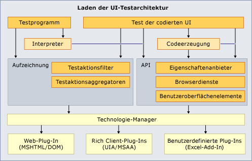

# Erweitern von Tests der programmierten UI und Aktionsaufzeichnungen

Das Testframework für Tests der programmierten UI und Aktionsaufzeichnungen unterstützen nicht jede mögliche Benutzeroberfläche. Es kann vorkommen, dass die zu testende Benutzeroberfläche nicht unterstützt wird. Es ist z.B. nicht möglich, direkt einen Test der programmierten UI oder eine Aktionsaufzeichnung für ein Microsoft Excel-Arbeitsblatt zu erstellen. Die Erweiterbarkeit des Frameworks für Tests der programmierten UI bietet Ihnen jedoch die Möglichkeit, eine eigene Erweiterung des Frameworks zu erstellen, die die spezifische Benutzeroberfläche unterstützt.

[!INCLUDE [coded-ui-test-deprecation](includes/coded-ui-test-deprecation.md)]

## Beispielerweiterung für Tests in Microsoft Excel

Dieser [Blogbeitrag](/archive/blogs/gautamg/3-introducing-sample-excel-extension) enthält einen Link zu einer [Beispielerweiterung](https://msdnshared.blob.core.windows.net/media/MSDNBlogsFS/prod.evol.blogs.msdn.com/CommunityServer.Components.PostAttachments/00/09/94/38/24/ExcelPluginSample.zip) für das Framework für Tests der programmierten UI. Sie können ebenfalls die gesamte [Reihe von Blogbeiträgen für die Erweiterbarkeit von Tests der programmierten UI](/archive/blogs/gautamg/series-on-coded-ui-test-extensibility) anzeigen.

> [!NOTE]
> Das Beispiel ist zur Verwendung mit Microsoft Excel 2010 gedacht. Es ist ungewiss, ob es mit anderen Excel-Versionen funktioniert.

## Weitere Informationen

- <xref:Microsoft.VisualStudio.TestTools.UITesting.UITestPropertyProvider>
- <xref:Microsoft.VisualStudio.TestTools.UITest.Extension.UITechnologyElement>
- [UITestActionFilter](/previous-versions/visualstudio/visual-studio-2012/dd985757(v=vs.110))
- <xref:Microsoft.VisualStudio.TestTools.UITest.Extension.UITestExtensionPackage>
- [Verwenden der Benutzeroberflächenautomatisierung zum Testen des Codes](../test/use-ui-automation-to-test-your-code.md)
- [Bewährte Methoden für Tests der programmierten UI](../test/best-practices-for-coded-ui-tests.md)
- [Unterstützte Konfigurationen und Plattformen für Tests der programmierten UI und Aktionsaufzeichnungen](../test/supported-configurations-and-platforms-for-coded-ui-tests-and-action-recordings.md)