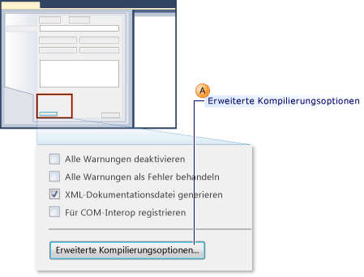
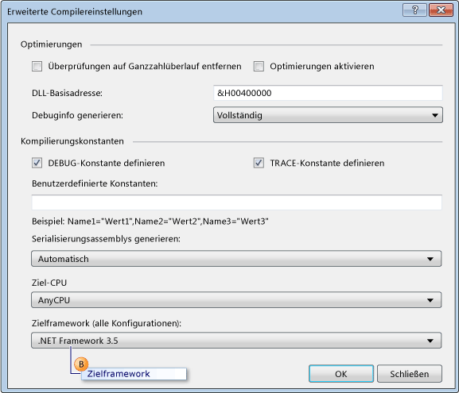
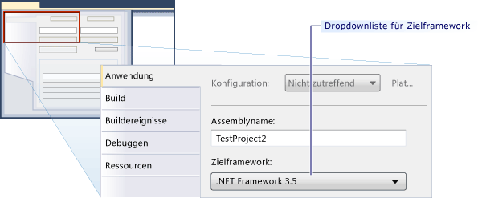

# <a name="how-to-configure-unit-tests-to-target-an-earlier-version-of-the-net-framework"></a>Vorgehensweise: Konfigurieren von Komponententests zur Ausrichtung auf eine frühere Version von .NET Framework

Wenn Sie in Microsoft Visual Studio ein Testprojekt erstellen, wird die neueste Version von .NET Framework standardmäßig als Ziel festgelegt. Wenn Sie ein Upgrade von Projekten aus früheren Versionen von Visual Studio durchführen, werden Projektupgrades darüber hinaus auf die neueste Version von .NET Framework durchgeführt. Durch Bearbeiten der Projekteigenschaften können Sie das Projekt auf frühere Versionen von .NET Framework explizit umleiten.

Sie können Komponententestprojekte erstellen, die auf bestimmte Versionen von .NET Framework abzielen. Die Zielversion muss 3.5 oder höher sein und darf keine Clientversion sein. Visual Studio ermöglicht die folgende grundlegende Unterstützung für Komponententests, die auf bestimmte Versionen abzielen:

- Sie können Komponententestprojekte erstellen und sie auf eine bestimmte Version von .NET Framework leiten.

- Sie können Komponententests ausführen, die auf eine bestimmte Version von .NET Framework in Visual Studio auf Ihrem lokalen Computer abzielen.

- Sie können Komponententests ausführen, die mithilfe von *MSTest.exe* über die Eingabeaufforderung auf eine bestimmte Version von .NET Framework abzielen.

- Sie können Komponententests auf einen Build-Agent als Teil eines Builds ausführen.

**Testen von SharePoint-Anwendungen**

Die oben genannten Funktionen helfen Ihnen auch beim Schreiben von Komponenten- und Integrationstest für SharePoint-Anwendungen, die Visual Studio verwenden. Weitere Informationen zum Entwickeln von SharePoint-Anwendungen mit Visual Studio finden Sie unter [Erstellen von SharePoint-Lösungen](../sharepoint/create-sharepoint-solutions.md), [Erstellen und Debuggen von SharePoint-Lösungen](../sharepoint/building-and-debugging-sharepoint-solutions.md) und [Überprüfen und Debuggen von SharePoint-Code](../sharepoint/verifying-and-debugging-sharepoint-code.md).

**Einschränkungen**

Die folgenden Einschränkungen gelten, wenn Sie Ihre Testprojekte zum Verwenden von früheren .NET Framework-Versionen umleiten:

- In .NET Framework 3.5 wird die Festlegung von Zielversionen für Testprojekte unterstützt, die nur Komponententests enthalten. .NET Framework 3.5 unterstützt keine anderen Testtypen, z.B. Tests der programmierten UI oder Auslastungstests. Die Umleitung ist für Testtypen, die keine Komponententests sind, blockiert.

- Ausführung von Tests, die auf eine frühere Version von .NET Framework abzielen, ist nur im standardmäßigen Hostadapter unterstützt. Es wird nicht im Hostadapter „ASP.NET“ unterstützt. ASP.NET-Anwendungen, die unter dem Kontext „ASP.NET Development Server“ ausgeführt werden müssen, müssen mit der aktuellen Version von .NET Framework kompatibel sein.

- Die Unterstützung der Datensammlung ist deaktiviert, wenn Sie Tests ausführen, die die Festlegung von Zielversionen in .NET Framework 3.5 unterstützen. Sie können Code Coverage mithilfe der Visual Studio-Befehlszeilentools ausführen.

- Komponententests, die .NET Framework 3.5 verwenden, können nicht auf einem Remotecomputer ausgeführt.

- Sie können keine Komponententests zu früheren Clientversionen des Frameworks leiten.

## <a name="re-targeting-to-a-specific-version-of-the-net-framework-for-visual-basic-unit-test-projects"></a>Umleiten zu einer bestimmten Version von .NET Framework für Visual Basic-Komponententestprojekte

1.  Erstellen Sie ein neues Visual Basic-Komponententestprojekt. Wählen Sie im Menü **Datei** die Option **Neu** und anschließend **Projekt** aus.

     Das Dialogfeld **Neues Projekt** wird angezeigt.

2.  Klicken Sie unter **Installierte Vorlagen**auf **Visual Basic**. Wählen Sie **Test** und anschließend die Vorlage **Testprojekt** aus.

3.  Geben Sie im Textfeld **Name** einen Namen für das Projekt ein, und klicken Sie anschließend auf **OK**.

4.  Wählen Sie im **Projektmappen-Explorer** aus dem Kontextmenü des neuen Visual Basic-Testprojekts die Option **Eigenschaften** aus.

     Die Eigenschaften für Ihr Visual Basic-Testprojekt werden angezeigt.

5.  Klicken sie auf der Registerkarte **Kompilieren** auf **Erweiterte Kompilierungsoptionen**, wie es in der folgenden Abbildung gezeigt wird.

     

6.  Verwenden Sie die Dropdownliste **Zielframework (alle Konfigurationen)**, um das Zielframework auf **.NET Framework 3.5** oder eine höhere Version zu ändern, wie es im Beispiel B der folgenden Abbildung gezeigt wird. Sie sollten keine Clientversion angeben.

     

## <a name="re-targeting-to-a-specific-version-of-the-net-framework-for-visual-c-unit-test-projects"></a>Umleiten zu einer bestimmten Version von .NET Framework für Visual C#-Komponententestprojekte

1.  Erstellen Sie ein neues Visual C#-Komponententestprojekt. Wählen Sie im Menü **Datei** die Option **Neu** und anschließend **Projekt** aus.

     Das Dialogfeld **Neues Projekt** wird angezeigt.

2.  Klicken Sie unter **Installierte Vorlagen**auf **Visual C#**. Wählen Sie **Test** und anschließend die Vorlage **Testprojekt** aus.

3.  Geben Sie im Textfeld **Name** einen Namen für Ihr Visual C#-Testprojekt ein, und klicken Sie anschließend auf **OK**.

4.  Wählen Sie im **Projektmappen-Explorer** aus dem Kontextmenü Ihres neuen Visual C#-Testprojekts die Option **Eigenschaften** aus.

     Die Eigenschaften für Ihr Visual C#-Testprojekt werden angezeigt.

5.  Wählen Sie auf der Registerkarte **Anwendung** die Option **Zielframework** aus. Wählen Sie aus der Dropdown-Liste **.NET Framework 3.5** oder eine höhere Version aus, wie in der folgenden Abbildung dargestellt wird. Sie sollten keine Clientversion angeben.

     

## <a name="re-targeting-to-a-specific-version-of-the-net-framework-for-ccli-unit-test-projects"></a>Umleiten zu einer bestimmten Version von .NET Framework für C++/CLI-Komponententestprojekte

1.  Erstellen Sie ein neues C++-Komponententestprojekt. Klicken Sie im Menü **Datei** auf **Neu** und anschließend auf **Projekt**.

     Das Dialogfeld **Neues Projekt** wird angezeigt.

    > [!WARNING]
    > Sie müssen die entsprechende Version von Visual Studio verwenden, um C++/CLI-Komponententestprojekte für eine frühere Version von .NET Framework für C++ zu erstellen. Sie müssen Visual Studio 2008 und Visual Studio 2008 Service Pack 1 installieren, um z.B. .NET Framework 3.5 als Ziel zu verwenden.

2.  Klicken Sie unter **Installierte Vorlagen**auf **Visual C ++**. Wählen Sie **Test** und anschließend die Vorlage **Testprojekt** aus.

3.  Geben Sie im Textfeld **Name** einen Namen für Ihr Visual C++-Testprojekt ein, und klicken Sie anschließend auf **OK**.

4.  Wählen Sie im **Projektmappen-Explorer** aus Ihrem neuen Visual C++-Testprojekt die Option **Projekt entladen** aus.

5.  Wählen Sie im **Projektmappen-Explorer** das entladene Visual C++-Testprojekt und anschließend **Projektname\<>.vcxproj bearbeiten** aus.

     Die *VCXPROJ*-Datei wird im Editor geöffnet.

6.  Legen Sie `TargetFrameworkVersion` auf Version 3.5 oder höher in `PropertyGroup`, die als `"Globals"` bezeichnet wird, fest. Sie sollten keine Clientversion angeben:

    ```xml
    <PropertyGroup Label="Globals">
        <TargetName>DefaultTest</TargetName>
        <ProjectTypes>{3AC096D0-A1C2-E12C-1390-A8335801FDAB};{8BC9CEB8-8B4A-11D0-8D11-00A0C91BC942}</ProjectTypes>
        <ProjectGUID>{CE16D77A-E364-4ACD-948B-1EB6218B0EA3}</ProjectGUID>
        <TargetFrameworkVersion>3.5</TargetFrameworkVersion>
        <Keyword>ManagedCProj</Keyword>
        <RootNamespace>CPP_Test</RootNamespace>
      </PropertyGroup>
    ```

7.  Speichern und schließen Sie die *VCXPROJ*-Datei.

8.  Wählen Sie im **Projektmappen-Explorer** aus dem Kontextmenü Ihres neuen Visual C++-Testprojekts die Option **Projekt erneut laden** aus.

## <a name="see-also"></a>Siehe auch

- [Erstellen von SharePoint-Lösungen](../sharepoint/create-sharepoint-solutions.md)
- [Erstellen und Debuggen von SharePoint-Lösungen](../sharepoint/building-and-debugging-sharepoint-solutions.md)
- [Dialogfeld „Erweiterte Compilereinstellungen“ (Visual Basic)](../ide/reference/advanced-compiler-settings-dialog-box-visual-basic.md)
