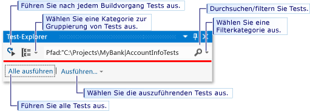
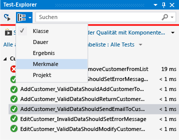
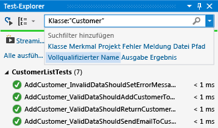
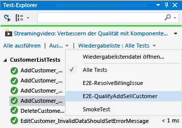

# <a name="run-unit-tests-with-test-explorer"></a>Ausführen von Komponententests mit dem Test-Explorer

Verwenden Sie den **Test-Explorer** zum Ausführen von Komponententests von Visual Studio oder Komponententestprojekten von Drittanbietern. Sie können den **Test-Explorer** auch dazu verwenden, Tests in Kategorien zu gruppieren, die Testliste zu filtern und Ausführungslisten zu erstellen, zu speichern und auszuführen. Zudem können Sie Tests debuggen und die Leistung und Code Coverage von Tests analysieren.

Visual Studio enthält die Komponententest-Frameworks von Microsoft für sowohl verwalteten als auch systemeigenen Code. Im **Test-Explorer** kann jedoch auch jedes Komponententest-Framework mit implementiertem Test-Explorer-Adapter ausgeführt werden. Weitere Informationen zum Installieren von Komponententest-Frameworks von Drittanbietern finden Sie unter [Installieren von Frameworks für Komponententests von Drittanbietern](../test/install-third-party-unit-test-frameworks.md).

Im **Test-Explorer** können Tests aus mehreren Testprojekten in einer Projektmappe und aus Testklassen ausgeführt werden, die Teil der Produktionscodeprojekte sind. Für Testprojekte können verschiedene Komponententest-Frameworks verwendet werden. Wenn der zu testende Code für .NET Framework geschrieben wird, kann das Testprojekt in jeder ebenfalls auf .NET Framework abzielenden Sprache geschrieben werden, unabhängig von der Sprache des Zielcodes. Systemeigene C/C++-Codeprojekte müssen mithilfe eines Komponententest-Frameworks für C++ getestet werden. Weitere Informationen finden Sie unter [Schreiben von Komponententests für C/C++ ](writing-unit-tests-for-c-cpp.md).

## <a name="run-tests-in-test-explorer"></a>Ausführen von Tests im Test-Explorer

Wenn Sie das Testprojekt erstellen, werden die Tests im Test-Explorer angezeigt. Falls der Test-Explorer nicht geöffnet ist, wählen Sie im Visual Studio-Menü nacheinander **Test** , **Fenster**und dann **Test-Explorer**aus.


Beim Ausführen, Schreiben und erneuten Ausführen der Tests werden die Ergebnisse vom Test-Explorer in den Standardgruppen **Fehlgeschlagene Tests**, **Bestandene Tests**, **Abgebrochene Tests** und **Nicht ausgeführte Tests**angezeigt. Sie können die Gruppierung der Tests im Test-Explorer ändern.

Über die Test-Explorer-Symbolleiste können Sie die meisten Aktionen zum Suchen, Organisieren und Ausführen von Tests ausführen.



### <a name="run-tests"></a>Tests durchführen

Sie können alle Tests in der Projektmappe, alle Tests in einer Gruppe oder einen Satz ausgewählter Tests ausführen. Führen Sie einen der folgenden Schritte aus:

- Wählen Sie zum Ausführen aller Tests in einer Projektmappe **Alle ausführen**aus.

- Wählen Sie zum Ausführen aller Tests in einer Standardgruppe **Ausführen...** und dann im Menü die Gruppe aus.

- Wählen Sie die einzelnen auszuführenden Tests aus, öffnen Sie das Kontextmenü eines ausgewählten Tests, und wählen Sie dann **Ausgewählte Tests ausführen**aus.

- Wenn einzelne Tests keine Abhängigkeiten haben, die verhindern, dass sie in beliebiger Reihenfolge ausgeführt werden können, sollten Sie die parallele Testausführung über die Umschaltfläche  auf der Symbolleiste aktivieren. Dadurch lässt sich die Zeit deutlich verkürzen, die zum Ausführen aller Tests erforderlich ist.

Während der Testausführung wird die oben im Fenster "Test-Explorer" angezeigte Erfolgreich/Fehler-Leiste animiert. Am Ende des Testlaufs wird die Erfolgreich/Fehler-Leiste grün, wenn alle Tests erfolgreich verlaufen, oder rot, falls ein beliebiger Test fehlschlägt.

### <a name="run-tests-after-every-build"></a>Ausführen von Tests nach jedem Build

|||
|-|-|
||Wählen Sie zum Ausführen der Komponententests nach jedem lokalen Buildvorgang im Standardmenü **Test** und dann auf der Test-Explorer-Symbolleiste **Nach dem Buildvorgang Tests ausführen** aus.|

## <a name="view-test-results"></a>Testergebnisse anzeigen

Beim Ausführen, Schreiben und erneuten Ausführen der Tests werden die Ergebnisse vom Test-Explorer in den Gruppen **Fehlgeschlagene Tests**, **Bestandene Tests**, **Abgebrochene Tests** sowie **Nicht ausgeführte Tests**angezeigt. Im Detailbereich unten im Test-Explorer wird eine Zusammenfassung des Testlaufs angezeigt.

### <a name="view-test-details"></a>Anzeigen von Testdetails

Zum Anzeigen der Details eines einzelnen Tests wählen Sie den jeweiligen Test aus.


Im Testdetailbereich werden folgende Informationen angezeigt:

- Quelldateiname und Zeilennummer der Testmethode

- Teststatus

- Ausführungsdauer der Testmethode

Bei einem fehlgeschlagenen Test wird im Detailbereich außerdem Folgendes angezeigt:

- Die vom Komponententest-Framework für den Test zurückgegebene Meldung

- Die Stapelüberwachung zum Zeitpunkt des Testfehlers

### <a name="view-the-source-code-of-a-test-method"></a>Anzeigen des Quellcodes einer Testmethode

 Zum Anzeigen des Quellcodes einer Testmethode im Visual Studio-Editor wählen Sie den Test und anschließend im Kontextmenü **Test öffnen** (Tastatur: **F12**) aus.

## <a name="group-and-filter-the-test-list"></a>Gruppieren und Filtern der Testliste

Im Test-Explorer können Sie Tests in vordefinierte Kategorien gruppieren. In den meisten der im Test-Explorer ausführbaren Komponententest-Frameworks können Sie eigene Kategorien und Kategorie/Wert-Paare zum Gruppieren der Tests definieren. Sie können die Testliste auch durch das Vergleichen von Zeichenfolgen mit Testeigenschaften filtern.

### <a name="group-tests-in-the-test-list"></a>Gruppieren von Tests in der Testliste

 Zum Ändern der Testunterteilung wählen Sie den neben der Schaltfläche **Gruppieren nach** angezeigten Pfeil nach unten  und anschließend neue Gruppierungskriterien aus.

 

### <a name="test-explorer-groups"></a>Test-Explorer-Gruppen

|Gruppieren|description|
|-----------|-----------------|
|**Dauer**|Die Tests werden nach Ausführungszeit gruppiert: **Schnell**, **Mittel**und **Langsam**.|
|**Ergebnis**|Die Tests werden nach Ausführungsergebnis gruppiert: **Fehlgeschlagene Tests**, **Übersprungene Tests**und **Bestandene Tests**.|
|**Merkmale**|Gruppiert Tests nach von Ihnen definierten Kategorie/Wert-Paaren. Die Syntax zum Angeben von Merkmalskategorien und -werten wird durch das Komponententest-Framework festgelegt.|
|**Projekt**|Gruppiert Tests nach den Namen der Projekte.|

### <a name="group-by-traits"></a>Gruppieren nach Merkmalen

 In der Regel handelt es sich bei Merkmalen um Kategoriename/Wert-Paare, ein Merkmal kann jedoch auch eine einzelne Kategorie darstellen. Merkmale können Methoden zugewiesen werden, die im Komponententest-Framework als Testmethoden identifiziert sind. In einem Komponententest-Framework können Merkmalskategorien definiert werden. Außerdem können Sie den Merkmalskategorien Werte hinzufügen, um eigene Kategoriename/Wert-Paare zu definieren. Die Syntax zum Angeben von Merkmalskategorien und -werten wird durch das Komponententest-Framework festgelegt.

 **Merkmale im Microsoft-Komponententest-Framework für verwalteten Code**

 Im Microsoft-Komponententest-Framework für verwaltete Apps wird ein Merkmalsname/Wert-Paar in einem  <xref:Microsoft.VisualStudio.TestTools.UnitTesting.TestPropertyAttribute> -Attribut definiert. Das Testframework weist zudem folgende vordefinierte Merkmale auf:

|Merkmal|description|
|-----------|-----------------|
|<xref:Microsoft.VisualStudio.TestTools.UnitTesting.OwnerAttribute>|Die Kategorie "Besitzer" wird vom Komponententest-Framework definiert. Sie müssen einen Zeichenfolgenwert für den Besitzer angeben.|
|<xref:Microsoft.VisualStudio.TestTools.UnitTesting.PriorityAttribute>|Die Kategorie "Priorität" wird vom Komponententest-Framework definiert. Sie müssen einen ganzzahligen Wert für die Priorität angeben.|
|<xref:Microsoft.VisualStudio.TestTools.UnitTesting.TestCategoryAttribute>|Mithilfe des TestCategory-Attributs können Sie eine Kategorie ohne Wert angeben. Bei einer durch das TestCategory-Attribut definierten Kategorie kann es sich auch um die Kategorie eines TestProperty-Attributs handeln.|
|<xref:Microsoft.VisualStudio.TestTools.UnitTesting.TestPropertyAttribute>|Mithilfe des TestProperty-Attributs können Sie Merkmalskategorie/Wert-Paare definieren.|

 **Merkmale im Komponententest-Framework für C++ von Microsoft** finden Sie unter [Verwenden des Microsoft-Komponententest-Frameworks für C++ in Visual Studio](how-to-use-microsoft-test-framework-for-cpp.md).

### <a name="search-and-filter-the-test-list"></a>Durchsuchen und Filtern der Testliste

Verwenden Sie Test-Explorer-Filter, um die Testmethoden einzuschränken, die in Ihren Projekten angezeigt und ausgeführt werden können.

Wenn Sie im Suchfeld des Test-Explorers eine Zeichenfolge eingeben und die EINGABETASTE drücken, wird die Liste so gefiltert, dass nur Tests angezeigt werden, deren vollqualifizierter Name die Zeichenfolge aufweist.

Filtern nach einem anderen Kriterium:

1. Öffnen Sie die rechts neben dem Suchfeld angezeigte Dropdownliste.

2. Wählen Sie ein neues Kriterium aus.

3. Geben Sie zwischen den Anführungszeichen den Filterwert ein.



> [!NOTE]
> Bei Suchvorgängen wird die Groß-/Kleinschreibung nicht beachtet, und die angegebene Zeichenfolge kann einem die oft ausgegebene Befehlszeilen  Teil des Kriteriumswerts entsprechen.

|Qualifizierer|description|
|---------------|-----------------|
|**Merkmal**|Durchsucht sowohl die Merkmalskategorie als auch den Wert nach Übereinstimmungen. Die Syntax zum Angeben von Merkmalskategorien und -werten wird durch das Komponententest-Framework festgelegt.|
|**Projekt**|Durchsucht die Testprojektnamen nach Übereinstimmungen.|
|**Fehlermeldung**|Durchsucht die von fehlerhaften Asserts zurückgegebenen benutzerdefinierte Fehlermeldungen nach Übereinstimmungen.|
|**Dateipfad**|Durchsucht die vollqualifizierten Dateinamen der Testquelldateien nach Übereinstimmungen.|
|**Vollqualifizierter Name**|Durchsucht die vollqualifizierten Dateinamen von Testnamespaces, Klassen und Methoden nach Übereinstimmungen.|
|**Ausgabe**|Durchsucht die benutzerdefinierten Fehlermeldungen, die als Standardausgabe (stdout) oder Standardfehler (stderr) geschrieben werden. Die Syntax zum Angeben von Ausgabemeldungen wird durch das Komponententest-Framework festgelegt.|
|**Ergebnis**|Durchsucht die Test-Explorer-Kategorienamen nach Übereinstimmungen: **Fehlgeschlagene Tests**, **Abgebrochene Tests**und **Bestandene Tests**.|

Verwenden Sie folgende Syntax, um eine Teilmenge von Filterergebnissen auszuschließen :

```
FilterName:"Criteria" -FilterName:"SubsetCriteria"
```

Zum Beispiel gibt `FullName:"MyClass" - FullName:"PerfTest"` alle Tests mit „MyClass“ im Namen zurück, mit Ausnahme der Tests, deren Namen auch „PerfTest“ enthalten.

## <a name="create-custom-playlists"></a>Erstellen benutzerdefinierter Wiedergabelisten

 Sie können eine Liste mit Tests erstellen und speichern, die als Gruppe ausgeführt oder angezeigt werden sollen. Wenn Sie eine Wiedergabeliste auswählen, werden die Tests in der Liste im Test-Explorer angezeigt. Sie können einen Test zu mehr als einer Wiedergabeliste hinzufügen, und bei Auswahl der Standardwiedergabeliste **Alle Tests** sind alle Tests im Projekt verfügbar.

 

 Wählen Sie zum**Erstellen einer Wiedergabeliste**im Komponententest-Explorer mindestens einen Test aus. Wählen Sie im Kontextmenü **Neue Wiedergabeliste**und dann **Zu Wiedergabeliste hinzufügen**aus. Speichern Sie die Datei unter dem im Dialogfeld **Neue Wiedergabeliste erstellen** angegebenen Namen und Speicherort.

 Wählen Sie zum**Hinzufügen von Tests zu einer Wiedergabeliste**im Komponententest-Explorer mindestens einen Test aus. Wählen Sie im Kontextmenü **Zu Wiedergabeliste hinzufügen**und anschließend die Wiedergabeliste aus, der die Tests hinzugefügt werden sollen.

 Wählen Sie zum**Öffnen einer Wiedergabeliste**im Visual Studio-Menü "Test" aus. Anschließend können Sie entweder aus der Liste der zuletzt verwendeten Wiedergabelisten oder die Option "Wiedergabelistendatei öffnen" auswählen, um den Namen und Speicherort der Wiedergabeliste anzugeben.

 Wenn einzelne Tests keine Abhängigkeiten haben, die verhindern, dass sie in beliebiger Reihenfolge ausgeführt werden können, sollten Sie die parallele Testausführung über die Umschaltfläche  auf der Symbolleiste aktivieren. Dadurch lässt sich die Zeit deutlich verkürzen, die zum Ausführen aller Tests erforderlich ist.

## <a name="debug-and-analyze-unit-tests"></a>Debugging und Analyse von Komponententests

### <a name="debug-unit-tests"></a>Debugging von Komponententests

Mit dem Test-Explorer können Sie Debugsitzungen für Tests starten. Beim schrittweisen Durchlaufen des Codes mit dem Visual Studio-Debugger wechseln Sie nahtlos zwischen den Komponententests und dem zu testenden Projekt hin und zurück. Starten des Debuggens:

1. Legen Sie im Visual Studio-Editor in mindestens einer zu debuggenden Testmethode einen Haltepunkt fest.

    > [!NOTE]
    > Da Testmethoden in jeder die oft ausgegebene Befehlszeilen  Reihenfolge ausgeführt werden können, legen Sie Haltepunkte in allen Testmethoden fest, die Sie debuggen möchten.

2. Wählen Sie im Test-Explorer die Testmethoden und dann im Kontextmenü **Ausgewählte Tests debuggen** aus.

 Weitere Informationen zum Debugger finden Sie unter [Debugging in Visual Studio](../debugger/debugging-in-visual-studio.md).

### <a name="diagnose-test-method-performance-issues"></a>Diagnose von Leistungsproblemen bei Testmethoden

 Um die Ursache zu ermitteln, weshalb die Ausführung einer Testmethode zu lange dauert, wählen Sie im Komponententest-Explorer die Methode und anschließend im Kontextmenü "Profil" aus. Weitere Informationen finden Sie unter [Performance Explorer (Leistungs-Explorer)](../profiling/performance-explorer.md).

### <a name="analyze-unit-test-code-coverage"></a>Analysieren der Codeabdeckung für Komponententests

MIthilfe des Codeabdeckungstools von Visual Studio können Sie die Menge des Produktcodes ermitteln, die tatsächlich von den Komponententests getestet wird. Das Codeabdeckungstool kann für ausgewählte oder alle Tests in einer Projektmappe ausgeführt werden.

Ausführen des Codeabdeckungstools für Testmethoden in einer Projektmappe:

1. Wählen Sie im Visual Studio-Menü **Tests** und anschließend **Codeabdeckung analysieren**aus.

2. Wählen Sie in Untermenü einen der folgenden Befehle aus:

    - Mit**Ausgewählte Tests** werden die im Test-Explorer ausgewählten Testmethoden analysiert.

    - Mit**Alle Tests** werden alle Testmethoden in der Projektmappe analysiert.

Im Fenster "Codeabdeckungsergebnisse " wird der Prozentsatz der durchlaufenen Produktcodeblöcke angezeigt, angeordnet nach Zeile, Funktion, Klasse, Namespace und Modul.

Weitere Informationen finden Sie unter [Using Code Coverage to Determine How Much Code is being Tested (Wie Sie feststellen können, wie viel Code untersucht wird)](../test/using-code-coverage-to-determine-how-much-code-is-being-tested.md).

## <a name="test-shortcuts"></a>Tastenkombinationen für Tests

Tests können im **Test-Explorer** ausgeführt werden, indem Sie mit der rechten Maustaste auf einen Test im Code-Editor und dann auf **Test ausführen** klicken, oder indem Sie die [Standardtastenkombinationen vom Test-Explorer](../ide/default-keyboard-shortcuts-in-visual-studio.md#bkmk_testexplorerGLOBAL) in Visual Studio verwenden. Manche dieser Tastenkombinationen sind vom Kontext abhängig. Das heißt, dass sie Tests basierend auf der Position Ihres Cursors im Code ausführen oder debuggen. Wenn Ihr Cursor sich in einer Testmethode befindet, wird diese Testmethode ausgeführt. Wenn Ihr Cursor sich auf der Klassenebene befindet, werden alle Tests in dieser Klasse ausgeführt. Dies gilt ebenfalls für die Namespaceebene.

|Häufig verwendete Befehle| Tastenkombinationen|
|--------------|------------------------|
|TestExplorer.DebugAllTestsInContext|STRG+R, STRG+T|
|TestExplorer.RunAllTestsInContext|STRG+R, T|

> [!NOTE]
> In einer abstrakten Klasse können Sie keinen Test ausführen, da Tests nur in abstrakten Klassen definiert werden und nicht instanziiert. Zum Ausführen von Tests in abstrakten Klassen müssen Sie eine Klasse erstellen, die von der abstrakten Klasse abgeleitet ist.

## <a name="see-also"></a>Siehe auch

- [Komponententest für Code](../test/unit-test-your-code.md)
- [Ausführen eines Komponententest als 64-Bit-Prozess](../test/run-a-unit-test-as-a-64-bit-process.md)
