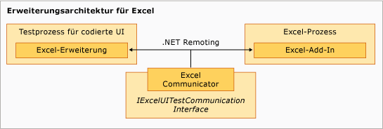

# Sample Coded UI Test Extension for Excel
[!INCLUDE[vs2017banner](../code-quality/includes/vs2017banner.md)]

Die Erweiterungskomponente des Beispiels wird im Testprozess der codierten UI in [!INCLUDE[vsprvs](../code-quality/includes/vsprvs_md.md)] ausgeführt und steht in einer Art hierarchischen Beziehung mit `ExtensionPackage`\-Klasse an der Basis.  Die Klassen`TechnologyManager`, `ActionFilter` und `PropertyProvider` befinden sich auf der nächsten Ebene; dabei liegen die Steuerelemente an oberster Stelle.  
  
   
Excel\-Erweiterungsarchitektur  
  
## Erweiterungspunkte  
 Diese Klassen stellen die Erweiterungspunkte dar, die im Beispiel implementiert werden, um Tests der codierten UI für [!INCLUDE[ofprexcel](../test/includes/ofprexcel_md.md)] zu aktivieren.  
  
### ExtensionPackage  
 Dies wird von der <xref:Microsoft.VisualStudio.TestTools.UITest.Extension.UITestExtensionPackage>\-Klasse geerbt und ist der Einstiegspunkt der Erweiterung für Tests der codierten UI.  Durch das Implementieren dieser abstrakten Klasse erhält das Framework für Tests der codierten UI internen Zugriff auf den benutzerdefinierten Technologie\-Manager, den Eigenschaftenanbieter und den Aktionsfilter für Benutzeroberflächentests zum Testen der neuen Benutzeroberfläche.  Weitere Informationen finden Sie unter [ExtensionPackage Class](../test/sample-excel-extension-extensionpackage-class.md).  
  
### TechnologyManager  
 Diese von der <xref:Microsoft.VisualStudio.TestTools.UITest.Extension.UITechnologyManager>\-Klasse geerbte Klasse stellt einen Technologie\-Manager für die Testaufzeichnung und Wiedergabe bereit.  Weitere Informationen finden Sie unter [TechnologyManager Class](../test/sample-excel-extension-technologymanager-class.md).  
  
### ActionFilter  
 Diese von der <xref:Microsoft.VisualStudio.TestTools.UITest.Common.UITestActionFilter>\-Klasse geerbte Klasse stellt eine Basisklasse zum Zusammenfassen ähnlicher Testaktionsergebnisse in einem einzelnen Testergebnis bereit.  Weitere Informationen finden Sie unter [ActionFilter Class](../test/sample-excel-extension-actionfilter-class.md).  
  
### Technologieelemente  
 Eine von der <xref:Microsoft.VisualStudio.TestTools.UITest.Extension.UITechnologyElement>\-Klasse geerbte Basisklasse stellt die Grundlage für die Technologieelemente in den Oberflächentests bereit, die aufgezeichnet und wiedergegeben werden können.  Weitere Informationen finden Sie unter [Element Classes](../test/sample-excel-extension-element-classes.md).  
  
### PropertyProvider  
 Diese von der <xref:Microsoft.VisualStudio.TestTools.UITesting.UITestPropertyProvider>\-Klasse geerbte Klasse stellt eine Basisklasse zur Unterstützung der Eigenschaften der Benutzeroberflächenelemente für die Testaufzeichnung und \-wiedergabe bereit.  Weitere Informationen finden Sie unter [PropertyProvider\-Klasse](../test/sample-excel-extension-propertyprovider-class.md).  
  
## Siehe auch  
 <xref:Microsoft.VisualStudio.TestTools.UITesting.UITestPropertyProvider>   
 <xref:Microsoft.VisualStudio.TestTools.UITest.Extension.UITechnologyElement>   
 <xref:Microsoft.VisualStudio.TestTools.UITest.Common.UITestActionFilter>   
 <xref:Microsoft.VisualStudio.TestTools.UITest.Extension.UITestExtensionPackage>   
 [ExtensionPackage Class](../test/sample-excel-extension-extensionpackage-class.md)   
 [TechnologyManager Class](../test/sample-excel-extension-technologymanager-class.md)   
 [ActionFilter Class](../test/sample-excel-extension-actionfilter-class.md)   
 [Element Classes](../test/sample-excel-extension-element-classes.md)   
 [PropertyProvider\-Klasse](../test/sample-excel-extension-propertyprovider-class.md)