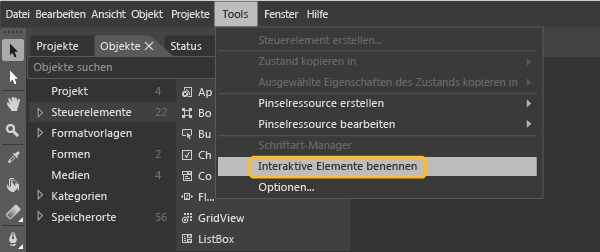
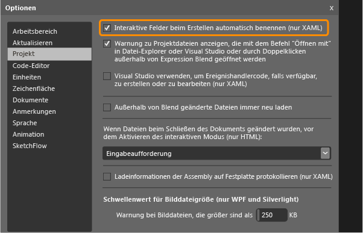

# <a name="set-a-unique-automation-property-for-uwp-controls-for-testing"></a>Festlegen einer eindeutigen Automatisierungseigenschaft für UWP-Steuerelemente für Tests

Wenn Sie Tests der programmierten UI für Ihre XAML-basierte UWP-App ausführen möchten, benötigen Sie eine eindeutige Automatisierungseigenschaft, durch die die einzelnen Steuerelemente gekennzeichnet werden.

 Sie können eine eindeutige Automatisierungseigenschaft auf Grundlage des Typs des XAML-Steuerelements in der Anwendung zuweisen. In diesem Thema wird die Zuweisung der eindeutigen Automatisierungseigenschaft in den folgenden Situationen erklärt:

-   [Statische XAML-Definition von Steuerelementen](#UniquePropertyWindowsStoreControlsStaticXAML)

-   [Zuweisen von eindeutigen Automatisierungseigenschaften mithilfe von Visual Studio oder Blend für Visual Studio](#UniquePropertyWindowsStoreControlsExpressionBlend)

-   [Verwenden einer DataTemplate](#UniquePropertyWindowsStoreControlsDataTemplate)

-   [Verwenden einer Steuerelementvorlage](#UniquePropertyWindowsStoreControlsControlTemplate)

-   [Dynamische Steuerelemente](#UniquePropertyWindowsStoreControlsDynamicControls)

## <a name="use-methods-to-assign-a-unique-automation-property"></a>Verwenden von Methoden zur Zuweisung einer eindeutigen Automatisierungseigenschaft

###  <a name="UniquePropertyWindowsStoreControlsStaticXAML"></a> Statische XAML-Definition
 Zum Angeben einer eindeutigen Automatisierungseigenschaft für ein Steuerelement, das in der XAML-Datei definiert ist, können Sie „AutomationProperties.AutomationId“ oder „AutomationProperties.Name“ implizit oder explizit festlegen (siehe folgende Beispiele). Durch Festlegen eines dieser Werte erhält das Steuerelement eine eindeutige Automatisierungseigenschaft, mit der das Steuerelement identifiziert werden kann, wenn Sie einen Test der programmierten UI oder eine Aktionsaufzeichnung erstellen.

 **Implizites Festlegen der Eigenschaft**

Legen Sie AutomationProperties.AutomationId auf **ButtonX** fest. Verwenden Sie dazu die Name-Eigenschaft in der XAML für das Steuerelement.

```xaml
<Button Name="ButtonX" Height="31" HorizontalAlignment="Left" Margin="23,26,0,0"  VerticalAlignment="Top" Width="140" Click="ButtonX_Click" />
```

Legen Sie AutomationProperties.Name auf **ButtonY** fest. Verwenden Sie dazu die Content-Eigenschaft in der XAML für das Steuerelement.

```xaml
<Button Content="ButtonY" Height="31" HorizontalAlignment="Left" Margin="23,76,0,0" VerticalAlignment="Top" Width="140" Click="ButtonY_Click" />
```

 **Explizites Festlegen der Eigenschaft**

 Legen Sie AutomationProperties.AutomationId explizit in der XAML für das Steuerelement auf **ButtonX** fest.

```xaml
<Button AutomationProperties.AutomationId="ButtonX" Height="31" HorizontalAlignment="Left" Margin="23,26,0,0"  VerticalAlignment="Top" Width="140" Click="ButtonX_Click" />
```

 Legen Sie AutomationProperties.Name explizit in der XAML für das Steuerelement auf **ButtonY** fest.

```
<Button AutomationProperties.Name="ButtonY" Height="31" HorizontalAlignment="Left" Margin="23,76,0,0" VerticalAlignment="Top" Width="140" Click="ButtonY_Click" />
```

###  <a name="UniquePropertyWindowsStoreControlsExpressionBlend"></a> Zuweisen von eindeutigen Automatisierungseigenschaften mithilfe von Visual Studio oder Blend für Visual Studio
 Sie können auch Visual Studio oder Blend für Visual Studio verwenden, um eindeutige Namen interaktiven Elementen zuzuordnen, z.B. Schaltflächen, Listenfeldern, Kombinationsfeldern und Textfeldern. Dies gibt dem Steuerelement einen eindeutigen Wert für AutomationProperties.Name.

 **Visual Studio:** Zeigen Sie im Menü **Tools** auf **Optionen**, und wählen Sie dann **Text-Editor**, dann **XAML** und schließlich **Sonstiges** aus.

 Wählen Sie **Interaktive Elemente beim Erstellen automatisch benennen** und dann **OK** aus.

 

 **Blend für Visual Studio:** Verwenden Sie eine der folgenden Methoden, um dies in Blend für Visual Studio auszuführen.

> [!NOTE]
>  Sie können diese Methode nur für Steuerelemente verwenden, die statisch mit XAML erstellt werden.

 **So weisen Sie vorhandenen Steuerelementen einen eindeutigen Namen zu**

 Wählen Sie im Menü **Tools** die Option **Interaktive Elemente benennen** wie im Folgenden dargestellt:

 

 **So weisen Sie von Ihnen erstellten Steuerelementen automatisch einen eindeutigen Namen zu**

 Zeigen Sie im Menü **Tools** auf **Optionen**, und klicken Sie dann auf **Projekt**. Wählen Sie **Interaktive Elemente beim Erstellen automatisch benennen** und dann **OK** aus, wie im Folgenden dargestellt:

 

###  <a name="UniquePropertyWindowsStoreControlsDataTemplate"></a> Verwenden einer Datenvorlage
 Sie können eine einfache Vorlage mit ItemTemplate definieren, um die Werte in einem Listenfeld mithilfe des folgenden XAML-Codes an Variablen zu binden.

```xaml
<ListBox Name="listBox1" ItemsSource="{Binding Source={StaticResource employees}}">
   <ListBox.ItemTemplate>
      <DataTemplate>
         <StackPanel Orientation="Horizontal">
            <TextBlock Text="{Binding EmployeeName}" />
            <TextBlock Text="{Binding EmployeeID}" />
         </StackPanel>
      </DataTemplate>
   </ListBox.ItemTemplate>
</ListBox>
```

 Sie können auch eine Vorlage mit „ItemContainerStyle“ verwenden, um die Werte mithilfe des folgenden XAML-Codes an Variablen zu binden:

```xaml
      <ListBox Name="listBox1" ItemsSource="{Binding Source={StaticResource employees}}">
            <ListBox.ItemContainerStyle>
                <Style TargetType="ListBoxItem">
                    <Setter Property="Template">
                        <Setter.Value>
                            <ControlTemplate TargetType="ListBoxItem">
                                <Grid>
                                    <Button Content="{Binding EmployeeName}" AutomationProperties.AutomationId="{Binding EmployeeID}"/>
                                </Grid>
                            </ControlTemplate>
                        </Setter.Value>
                    </Setter>
                </Style>
            </ListBox.ItemContainerStyle>
        </ListBox>
```

 In beiden Beispielen müssen Sie anschließend die ToString()-Methode von ItemSource entsprechend der Darstellung mit dem folgenden Codebeispiel überschreiben. Dieser Code gewährleistet, dass der AutomationProperties.Name-Wert festgelegt wird und eindeutig ist, da mit Bindungen nicht für jedes datengebundene Listenelement eine eindeutige Automatisierungseigenschaft festgelegt werden kann. Das Festlegen eines eindeutigen Werts für AutomationProperties.Name ist in diesem Fall ausreichend.

> [!NOTE]
> Damit können die inneren Inhalte des Listenelements auch auf eine Zeichenfolge in der Mitarbeiterklasse festgelegt werden. Wie im vorliegenden Beispiel gezeigt, wird dem Schaltflächen-Steuerelement innerhalb jedes Listenelements eine eindeutige Automatisierungs-ID zugewiesen, bei der es sich um die Mitarbeiter-ID handelt.

```csharp
Employee[] employees = new Employee[]
{
   new Employee("john", "4384"),
   new Employee("margaret", "7556"),
   new Employee("richard", "8688"),
   new Employee("george", "1293")
};

listBox1.ItemsSource = employees;

public override string ToString()
{
    return EmployeeName + EmployeeID; // Unique Identification to be set as the AutomationProperties.Name
}
```

###  <a name="UniquePropertyWindowsStoreControlsControlTemplate"></a> Verwenden einer Steuerelementvorlage

Sie können eine Steuerelementvorlage verwenden, damit jede Instanz eines bestimmten Typs eine eindeutige Automatisierungseigenschaft erhält, wenn sie im Code definiert ist. Erstellen Sie die Vorlage, damit die AutomationProperty an eine eindeutige ID in der Steuerelementinstanz gebunden wird. Der folgende XAML-Code veranschaulicht eine Methode zur Erstellung der Bindung mit einer Steuerelementvorlage.

```xaml
<Style x:Key="MyButton" TargetType="Button">
<Setter Property="Template">
   <Setter.Value>
<ControlTemplate TargetType="Button">
   <Grid>
      <CheckBox HorizontalAlignment="Left" AutomationProperties.AutomationId="{TemplateBinding Content}"></CheckBox>
      <Button Width="90" HorizontalAlignment="Right" Content="{TemplateBinding Content}" AutomationProperties.AutomationId="{TemplateBinding Content}"></Button>
   </Grid>
</ControlTemplate>
   </Setter.Value>
</Setter>
</Style>
```

 Wenn Sie zwei Instanzen einer Schaltfläche mithilfe dieser Steuerelementvorlage definieren, wird die Automatisierungs-ID auf die eindeutige Inhaltszeichenfolge für die Steuerelemente in der Vorlage festgelegt, wie im folgenden XAML-Code gezeigt wird:

```xaml
<Button Content="Button1" Style="{StaticResource MyButton}" Width="140"/>
<Button Content="Button2" Style="{StaticResource MyButton}" Width="140"/>
```

###  <a name="UniquePropertyWindowsStoreControlsDynamicControls"></a> Dynamische Steuerelemente
 Wenn Sie über Steuerelemente verfügen, die dynamisch mit dem Code und nicht statisch oder mithilfe von Vorlagen in den XAML-Dateien erstellt wurden, müssen Sie die Content- oder die Name-Eigenschaft für das Steuerelement festlegen. Dadurch wird sichergestellt, dass jedes dynamische Steuerelement über eine eindeutige Automatisierungseigenschaft verfügt. Wenn beispielsweise ein Kontrollkästchen angezeigt werden muss, wenn ein Listenelement ausgewählt wird, können Sie diese Eigenschaften festlegen, wie im Folgenden dargestellt:

```csharp
private void CreateCheckBox(string txt, StackPanel panel)
   {
      CheckBox cb = new CheckBox();
      cb.Content = txt; // Sets the AutomationProperties.Name
      cb.Height = 50;
      cb.Width = 100;
      cb.Name = "DynamicCheckBoxAid"+ txt; // Sets the AutomationProperties.AutomationId
      panel.Children.Add(cb);
    }
```

## <a name="see-also"></a>Siehe auch

- [Testen von Windows UWP-Apps mit Tests der programmierten UI](../test/test-windows-store-8-1-apps-with-coded-ui-tests.md)
