# <a name="test-windows-uwp-and-81-phone-apps-with-coded-ui-tests"></a>Testen von Windows UWP- und 8.1 -Phone-Apps mit Tests der programmierten UI

Verwenden Sie diese exemplarische Vorgehensweise zum Erstellen von UI-Tests für UWP-Apps, die auf mobilen Geräte oder Emulatoren und auf XAML basierenden Phone 8.1-Apps ausgeführt werden.  

## <a name="create-a-simple-windows-phone-app"></a>Erstellen einer einfachen Windows Phone-App  
  
1.  Erstellen Sie mit einer Visual C#- oder Visual Basic-Vorlage ein neues Projekt für eine leere Windows Phone-App.  
  
     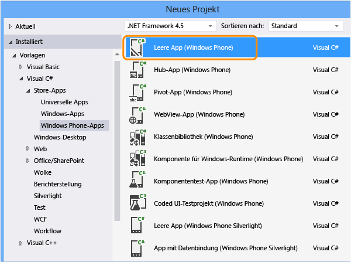  
  
2.  Öffnen Sie im Projektmappen-Explorer die Datei "MainPage.xaml". Ziehen Sie aus der Toolbox ein Schaltflächen- und ein Textfeldsteuerelement auf die Entwurfsoberfläche.  
  
     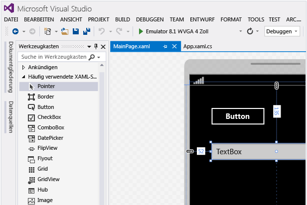  
  
3.  Benennen Sie im Fenster "Eigenschaften" das Schaltflächen-Steuerelement.  
  
     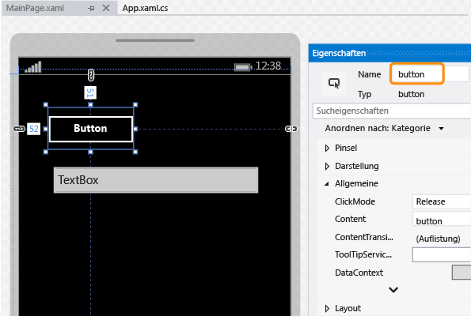  
  
4.  Benennen Sie das Textfeld-Steuerelement.  
  
     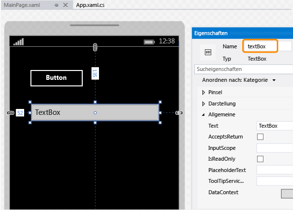  
  
5.  Doppelklicken Sie auf der Entwurfsoberfläche auf das Schaltflächensteuerelement und fügen Sie dann den folgenden Code hinzu:  
  
    ```csharp  
    private void button_Click_1(object sender, RoutedEventArgs e)  
    {  
        this.textBox.Text = this.button.Name;  
    }  
  
    ```  
  
    ```vb  
    Public NotInheritable Class MainPage  
        Inherits Page  
  
        Private Sub button_Click(sender As Object, e As RoutedEventArgs) Handles Button.Click  
            Me.textBox.Text = Me.button.Name  
        End Sub  
    End Class  
    ```  
  
6.  Drücken Sie F5, sodass die Windows Phone-App im Emulator ausgeführt wird und überprüfen Sie, ob sie funktioniert.  
  
     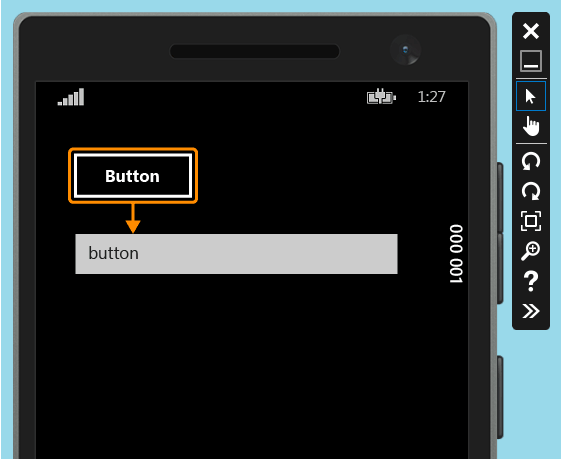  
  
7.  Verlassen Sie den Emulator.  
  
## <a name="deploy-the-windows-phone-app"></a>Windows Phone App bereitstellen  
  
1.  Ehe ein Test der programmierten UI die Steuerelemente einer App zuordnen kann, müssen Sie die App bereitstellen.  
  
     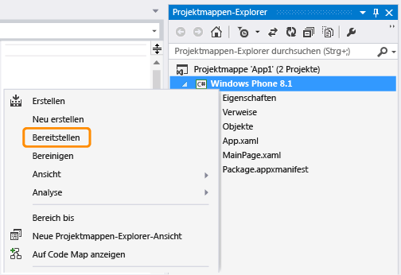  
  
     Der Emulator wird gestartet. Die App ist jetzt für den Test bereit.  
  
     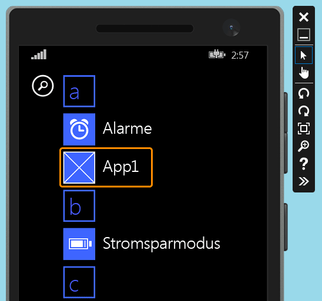  
  
     Lassen Sie den Emulator laufen, während Sie den Test der programmierten UI erstellen.  
  
## <a name="create-a-coded-ui-test-for-the-windows-phone-app"></a>Erstellen eines Tests der programmierten UI für die Windows Phone-App  

[Wie kann ich Tests der programmierten UI für Apps der universellen Windows-Plattform (UWP) erstellen?](#uwpapps)
  
1.  Fügen Sie der Lösung mit der Windows Phone-App ein neues Projekt mit einem Test für programmierte UI hinzu.  
  
     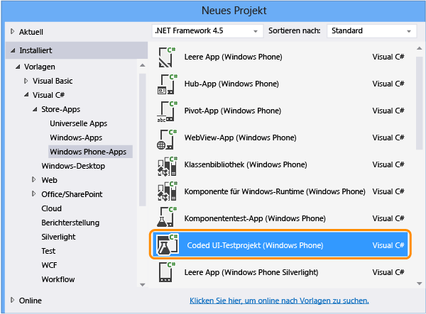  
  
2.  Wählen Sie mithilfe des Fadenkreuztools aus, dass Sie die UI-Zuordnung bearbeiten möchten.  
  
     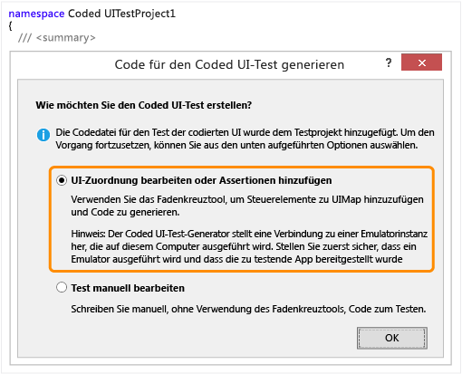  
  
3.  Verwenden Sie das Fadenkreuztool zur Auswahl der App. Kopieren Sie dann den Wert der **AutomationId**-Eigenschaft der App, der später für das Starten der App im Test verwendet wird.  
  
     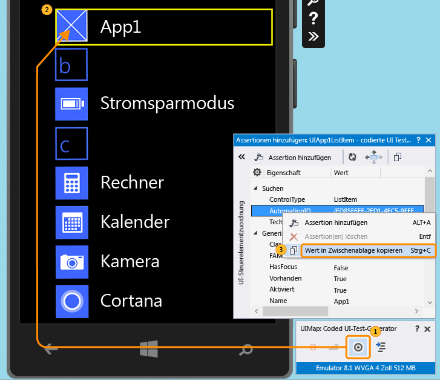  
  
4.  Starten Sie die App im Emulator mit dem Fadenkreuztool und wählen Sie das Schaltflächensteuerelement aus. Fügen Sie dann das Schaltflächen-Steuerelement der UI-Steuerelementzuordnung hinzu.  
  
     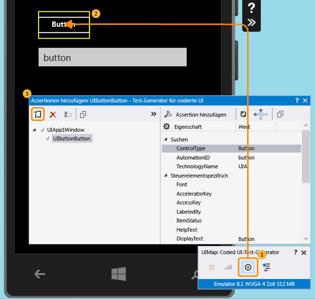  
  
5.  Wiederholen Sie den vorangehenden Schritt zum Hinzufügen des Textfeld-Steuerelements zur UI-Steuerelementzuordnung.  
  
     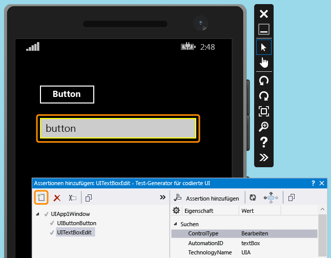  
  
6.  Erstellen Sie den Code, sodass Code für Änderungen an der UI-Steuerelementzuordnung erstellt wird.  
  
     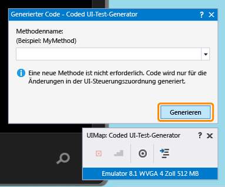  
  
7.  Wählen Sie das Textfeldsteuerelement mit dem Fadenkreuztool aus, und wählen Sie dann die **Text** -Eigenschaft aus.  
  
     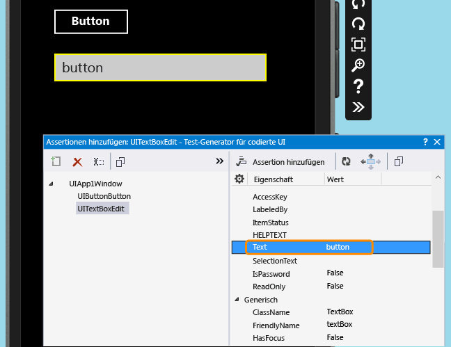  
  
8.  Fügen Sie eine Assertion hinzu. Diese wird beim Test verwendet, um die Richtigkeit des Werts sicherzustellen.  
  
     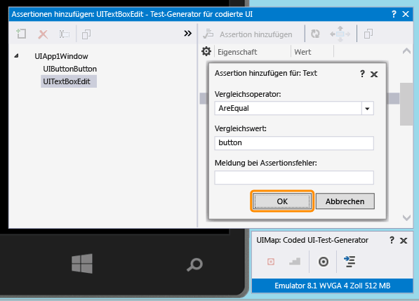  
  
9. Generieren Sie Code für die Assert-Methode, und fügen Sie diesen hinzu.  
  
     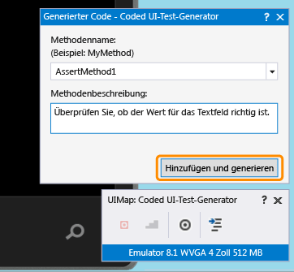  
  
10. **Visual C#**  
  
     Öffnen Sie im Projektmappen-Explorer die Datei "UIMap.Designer.cs", um den eben hinzugefügten Code für die Assert-Methode und die Steuerelemente anzuzeigen.  
  
     **Visual Basic**  
  
     Öffnen Sie im Projektmappen-Explorer die Datei "CodedUITest1.vb". Klicken Sie im Testmethodencode "CodedUITestMethod1()" mit der rechten Maustaste den Aufruf für die Assertionsmethode, der automatisch hinzugefügt wurde `Me.UIMap.AssertMethod1()` und wählen Sie **Gehe zu Definition**. Hierdurch wird die Datei "UIMap.Designer.vb" im Code-Editor geöffnet, sodass Sie den hinzugefügten Code für die Assert-Methode und die Steuerelemente sehen können.  
  
    > [!WARNING]
    >  Die Dateien "UIMap.designer.cs" oder "UIMap.Designer.vb" sollten nicht direkt geändert werden. Andernfalls werden die an der Datei vorgenommenen Änderungen bei jedem Generieren des Tests überschrieben.  
  
     **Assert-Methode**  
  
    ```csharp  
    public void AssertMethod1()  
    {  
        #region Variable Declarations  
        XamlEdit uITextBoxEdit = this.UIApp1Window.UITextBoxEdit;  
        #endregion  
  
        // Verify that the 'Text' property of 'textBox' text box equals 'button'  
        Assert.AreEqual(this.AssertMethod1ExpectedValues.UITextBoxEditText, uITextBoxEdit.Text);  
    }  
    ```  
  
    ```vb  
    Public Sub AssertMethod1()  
        Dim uITextBoxEdit As XamlEdit = Me.UIApp1Window.UITextBoxEdit  
  
        'Verify that the 'Text' property of 'textBox' text box equals 'button'  
        Assert.AreEqual(Me.AssertMethod1ExpectedValues.UITextBoxEditText, uITextBoxEdit.Text)  
    End Sub  
    ```  
  
     **Steuerelemente**  
  
    ```csharp  
    #region Properties  
    public virtual AssertMethod1ExpectedValues AssertMethod1ExpectedValues  
    {  
        get  
        {  
            if ((this.mAssertMethod1ExpectedValues == null))  
            {  
                this.mAssertMethod1ExpectedValues = new AssertMethod1ExpectedValues();  
            }  
            return this.mAssertMethod1ExpectedValues;  
        }  
    }  
  
    public UIApp1Window UIApp1Window  
    {  
        get  
        {  
            if ((this.mUIApp1Window == null))  
            {  
                this.mUIApp1Window = new UIApp1Window();  
            }  
            return this.mUIApp1Window;  
        }  
    }  
    #endregion  
  
    #region Fields  
    private AssertMethod1ExpectedValues mAssertMethod1ExpectedValues;  
  
    private UIApp1Window mUIApp1Window;  
    #endregion  
    ```  
  
    ```vb  
    #Region "Properties"  
    Public ReadOnly Property UIButtonButton() As XamlButton  
        Get  
            If (Me.mUIButtonButton Is Nothing) Then  
                Me.mUIButtonButton = New XamlButton(Me)  
                Me.mUIButtonButton.SearchProperties(XamlButton.PropertyNames.AutomationId) = "button"  
            End If  
            Return Me.mUIButtonButton  
        End Get  
    End Property  
  
    Public ReadOnly Property UITextBoxEdit() As XamlEdit  
        Get  
            If (Me.mUITextBoxEdit Is Nothing) Then  
                Me.mUITextBoxEdit = New XamlEdit(Me)  
                Me.mUITextBoxEdit.SearchProperties(XamlEdit.PropertyNames.AutomationId) = "textBox"  
            End If  
            Return Me.mUITextBoxEdit  
        End Get  
    End Property  
    #End Region  
  
    #Region "Fields"  
    Private mUIButtonButton As XamlButton  
  
    Private mUITextBoxEdit As XamlEdit  
    #End Region  
    ```  
  
11. Öffnen Sie im Projektmappen-Explorer die Datei "CodedUITest1.cs" oder "CodedUITest1.vb". Nun können Sie der CodedUTTestMethod1-Methode Code für die zum Ausführen des Tests erforderlichen Aktionen hinzufügen. Verwenden Sie die der UIMap hinzugefügten Steuerelemente zum Hinzufügen von Code:  
  
    1.  Starten Sie die Windows Phone-App mithilfe der Automation ID-Eigenschaft, die Sie zuvor in Zwischenablage kopiert haben:  
  
        ```csharp  
        XamlWindow myAppWindow = XamlWindow.Launch("ed85f6ff-2fd1-4ec5-9eef-696026c3fa7b_cyrqexqw8cc7c!App");  
        ```  
  
        ```vb  
        XamlWindow.Launch("ed85f6ff-2fd1-4ec5-9eef-696026c3fa7b_cyrqexqw8cc7c!App");  
        ```  
  
    2.  Fügen Sie eine Geste hinzu, um auf das Schaltflächensteuerelement zu tippen:  
  
        ```csharp  
        Gesture.Tap(this.UIMap.UIApp1Window.UIButtonButton);  
        ```  
  
        ```vb  
        Gesture.Tap(Me.UIMap.UIApp1Window.UIButtonButton)  
        ```  
  
    3.  Überprüfen Sie, ob der Aufruf der automatisch generierten Assert-Methode nach dem Starten der Anwendung und dem Tippen auf die Schaltfläche erfolgt:  
  
        ```csharp  
        this.UIMap.AssertMethod1();  
        ```  
  
        ```vb  
        Me.UIMap.AssertMethod1()  
        ```  
  
     Nach dem Hinzufügen des Codes sollte die CodedUITestMethod1-Testmethode wie folgt aussehen:  
  
    ```csharp  
    [TestMethod]  
    public void CodedUITestMethod1()  
    {  
        // To generate code for this test, select "Generate Code for Coded UI Test" from the shortcut menu and select one of the menu items.  
  
        // Launch the app.  
        XamlWindow myAppWindow = XamlWindow.Launch("ed85f6ff-2fd1-4ec5-9eef-696026c3fa7b_cyrqexqw8cc7c!App");  
  
        // Tap the button.  
        Gesture.Tap(this.UIMap.UIApp1Window.UIButtonButton);  
  
        this.UIMap.AssertMethod1();  
    }  
    ```  
  
    ```vb  
    <CodedUITest>  
    Public Class CodedUITest1  
  
        <TestMethod()>  
        Public Sub CodedUITestMethod1()  
            '              
            ' To generate code for this test, select "Generate Code for Coded UI Test" from the shortcut menu and select one of the menu items.  
            '  
            ' Launch the app.  
            XamlWindow.Launch("ed85f6ff-2fd1-4ec5-9eef-696026c3fa7b_cyrqexqw8cc7c!App")  
  
            '// Tap the button.  
            Gesture.Tap(Me.UIMap.UIApp1Window.UIButtonButton)  
  
            Me.UIMap.AssertMethod1()  
        End Sub  
    ```  
  
## <a name="run-the-coded-ui-test"></a>Ausführen von Tests der programmierten UI  
  
1.  Erstellen Sie den Test, und führen Sie diesen anschließend mit dem Test-Explorer aus.  
  
     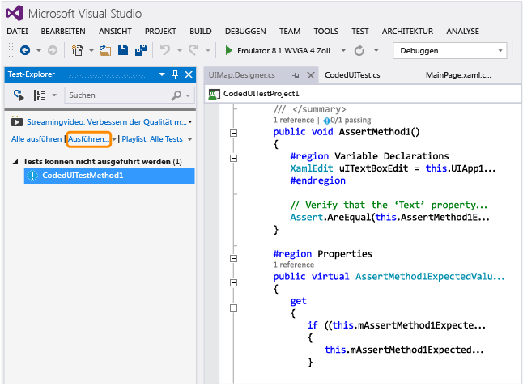  
  
     Die Windows Phone-App wird gestartet, die Aktion für das Tippen auf die Schaltfläche wird abgeschlossen, und die Text-Eigenschaft des Textfelds wird mithilfe der Assert-Methode mit einem Wert versehen und überprüft.  
  
     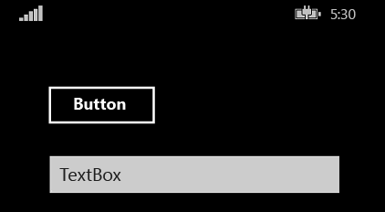  
  
     Nach Abschluss des Tests wird im Test-Explorer das Bestehen des Tests angezeigt.  
  
     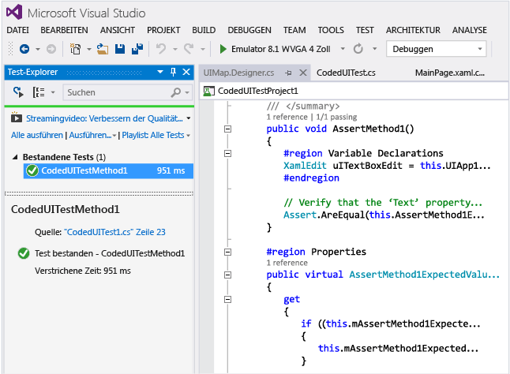  
  
##  <a name="TestingPhoneAppsCodedUI_DataDriven"></a> Einsatz datengesteuerter Tests der programmierten UI auf Windows Phone-Apps  
 Ein Test der programmierten UI kann mehrere Male ausgeführt werden, um unterschiedliche Bedingungen mit verschiedenen Datensets zu testen.  
  
 Datengesteuerte Tests der programmierten UI für Windows Phone werden mithilfe des Attributs DataRow für eine Testmethode definiert. Im folgenden Beispiel verwenden x und y die Werte 1 und 2 für die erste und -1 und -2 für die zweite Iteration des Tests.  
  
```  
[DataRow(1, 2, DisplayName = "Add positive numbers")]  
[DataRow(-1, -2, DisplayName = "Add negative numbers")]  
[TestMethod]  
public void DataDrivingDemo_MyTestMethod(int x, int y)  
  
```  
  
## <a name="q--a"></a>Fragen und Antworten  
  
### <a name="q-do-i-have-to-deploy-the-windows-phone-app-in-the-emulator-in-order-to-map-ui-controls"></a>F: Muss ich die Windows Phone-App im Emulator bereitstellen, sodass ich die Benutzeroberflächen-Steuerelemente zuordnen kann?  
 **A**: Ja, der Test-Generator der programmierten UI erfordert, dass ein Emulator läuft und die App für diesen bereitgestellt wird. Ansonsten wird ein Fehler ausgegeben der besagt, dass kein laufender Emulator gefunden werden konnte.  
  
###  <a name="TestingPhoneAppsCodedUI_EmulatorDevice"></a> F: Können Tests nur auf dem Emulator ausgeführt werden oder kann ich auch ein physisches Gerät verwenden?  
 **A**: Beide Optionen werden unterstützt. Das Ziel für die Umsetzung des Tests wird durch Ändern des Emulatortyps in der Gerätesymbolleiste ausgewählt. Ist „Gerät“ ausgewählt, dann muss ein Phone Blue-Gerät mit einem der USB-Anschlüsse des Rechners verbunden sein.  
  
 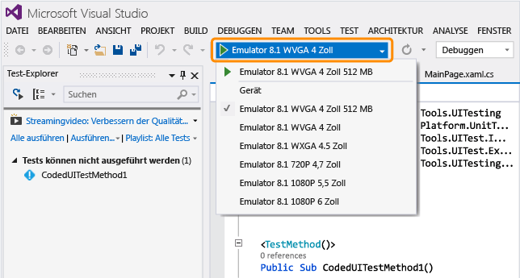  
  
### <a name="q-why-dont-i-see-the-option-to-record-my-coded-ui-test-in-the-generate-code-for-a-coded-ui-test-dialog"></a>F: Warum wird im Dialogfeld „Test der programmierten UI“ unter „Code generieren“ nicht die Option zum Aufzeichnen des Tests der programmierten UI angezeigt?  
 **A**: Die Option zum Aufzeichnen wird für Windows Phone-Apps nicht unterstützt.  
  
### <a name="q-can-i-create-a-coded-ui-test-for-my-windows-phone-apps-based-on-winjs-silverlight-or-html5"></a>F: Kann ich einen Test der programmierten UI für Windows Phone-Apps auf Grundlage von WinJS, Silverlight oder HTML5 erstellen?  
 **A**: Nein, nur XAML-basierte Apps werden unterstützt.  
  
### <a name="q-can-i-create-coded-ui-tests-for-my-windows-phone-apps-on-a-system-that-is-not-running-windows-81-or-windows-10"></a>F: Kann ich auf einem System, auf dem Windows 8.1 oder Windows 10 nicht ausgeführt wird, Tests der programmierten UI für Windows Phone-Apps erstellen?  
 **A**: Nein. Die Projektvorlagen für Tests der programmierten UI stehen nur unter Windows 8.1 und Windows 10 zur Verfügung. Um Automatisierung für Apps der universellen Windows-Plattform (UWP) zu erstellen, benötigen Sie Windows 10.  

<a name="uwpapps"></a>  
### <a name="q-how-do-i-create-coded-ui-tests-for-universal-windows-platform-uwp-apps"></a>F: Wie kann ich Tests der programmierten UI für Apps der universellen Windows-Plattform (UWP) erstellen?  
 **A**: Verwenden Sie abhängig von der Plattform, auf der Sie die UWP-App testen, eine der folgenden Möglichkeiten zum Erstellen von Tests der programmierten UI:  
  
-   Eine UWP-App auf einem lokalen Computer wird als UWP-App ausgeführt. Um dies zu testen, müssen Sie die Vorlage **Testprojekt für programmierte UI (Windows)** verwenden. Sie finden diese Vorlage beim Erstellen eines neuen Projekts unter dem Knoten **Windows**, **Universal** . Sie können auch unter dem Knoten **Windows**, **Windows 8**, **Windows** danach suchen.  
  
-   Eine UWP-App auf einem mobilen Gerät oder Emulator wird als eine Phone-App ausgeführt. Um dies zu testen, müssen Sie die Vorlage **Testprojekt für programmierte UI (Windows Phone)** verwenden. Sie finden diese Vorlage beim Erstellen eines neuen Projekts unter dem Knoten **Windows**, **Universal** . Sie können auch unter dem Knoten **Windows**, **Windows 8**, **Windows Phone** danach suchen.  
  
 Nachdem Sie das Projekt erstellt haben, wird ein Test auf die gleiche Weise wie zuvor erstellt.  
  
### <a name="q-can-i-select-controls-that-are-outside-the-emulator"></a>F: Kann ich Steuerelemente auswählen, die sich außerhalb des Emulators befinden?  
 **A**: Nein, der Generator erkennt sie nicht.  
  
### <a name="q-can-i-use-the-coded-ui-test-builder-to-map-controls-using-a-physical-phone-device"></a>F: Kann ich den Test-Generator der programmierten UI verwenden, um Steuerelemente einem physischen Telefongerät zuzuordnen?  
 **A**: Nein, der Generator kann Benutzeroberflächenelemente nur zuordnen, wenn die App auf dem Emulator bereitgestellt wurde.  
  
### <a name="q-why-cant-i-modify-the-code-in-the-uimapdesigner-file"></a>F: Warum kann ich den Code in der Datei „UIMap.Designer“ nicht ändern?  
 **A**: Alle Codeänderungen, die Sie an der Datei "UIMapDesigner.cs" vornehmen, werden jedes Mal überschrieben, wenn Sie Code mit dem UIMap – Test-Generator für programmierte UI generieren. Wenn Sie eine aufgezeichnete Methode ändern müssen, müssen Sie sie in die UIMap.cs-Datei kopieren und umbenennen. Die Datei "UIMap.cs" kann verwendet werden, um Methoden und Eigenschaften in der Datei "UIMapDesigner.cs" zu überschreiben. Sie müssen den Verweis auf die ursprüngliche Methode in der Datei "Coded UITest.cs" entfernen und ihn durch den umbenannten Methodennamen ersetzen.  
  
### <a name="q-can-i-run-a-coded-ui-test-on-my-windows-phone-app-from-the-command-line"></a>F: Kann ich einen Test der programmierten UI für Windows Phone-Apps aus der Befehlszeile ausführen?  
 **A**: Ja, verwenden Sie eine RUNSETTINGS-Datei für das Festlegen des Zielgeräts bei der Ausführung des Tests. Zum Beispiel:  
  
 **vstest.console.exe "pathToYourCodedUITestDll" /settings:devicetarget.runsettings**  
  
 Beispiel für eine RUNSETTINGS-Datei:  
  
```  
<?xml version="1.0" encoding="utf-8"?>  
<RunSettings>  
<MSPhoneTest>  
<!--to specify test execution on device, use a TargetDevice option as follows-->  
<TargetDevice>Device</TargetDevice>  
<!--to specify an emulator instead, use a TargetDevice option like below-->  
<!--<TargetDevice>Emulator 8.1 WVGA 4 inch 512MB</TargetDevice>-->  
</MSPhoneTest>  
</RunSettings>  
```  
  
### <a name="q-what-are-the-differences-between-coded-ui-tests-for-xaml-based-uwp-apps-and-windows-phone-apps"></a>F: Welche Unterschiede gibt es zwischen Tests der programmierten UI für XAML-basierte UWP-Apps und Windows Phone-Apps?  
 **A**: Es gibt einige wichtige Unterschiede:  
  
|Funktion|UWP-Apps|Windows Phone-Apps|  
|-------------|------------------------|------------------------|  
|Ziel für das Ausführen von Tests|Lokaler oder Remotecomputer. Remotecomputer können nur festgelegt werden, wenn ein automatisierter Testfall für das Ausführen von Tests verwendet wurde.|Emulator oder Gerät. Weitere Informationen finden Sie unter [F: Können Tests nur auf dem Emulator ausgeführt werden, oder kann ich auch ein physisches Gerät verwenden?](#TestingPhoneAppsCodedUI_EmulatorDevice) in diesem Thema.|  
|Ausführen aus der Befehlszeile|Einstellungsdatei für das Festlegen des Ziels nicht erforderlich.|RUNSETTINGS-Datei für das Festlegen des Ziels erforderlich.|  
|Spezialisierte Klassen für Shell-Steuerelemente|<xref:Microsoft.VisualStudio.TestTools.UITesting.DirectUIControls.DirectUIControl>|<xref:Microsoft.VisualStudio.TestTools.UITesting.UITestControl>|  
|WebView-Steuerelement in einer XAML-App|Unterstützt, wenn spezielle HTML*-Klassen für die Interaktion mit HTML-Elementen verwendet werden. Siehe <xref:Microsoft.VisualStudio.TestTools.UITesting.HtmlControls>.|Wird nicht unterstützt.|  
|Ausführen automatisierter Tests aus MTM|Unterstützt.|Wird nicht unterstützt.|  
|Datengesteuerte Tests|Sie [Datengesteuerte Tests](../test/creating-a-data-driven-coded-ui-test.md) zu Informationen über den Einsatz externer Datenquellen und die Verwendung des Attributs DataSource für eine Testmethode.|Daten werden inline mit dem Attribut DataRow für eine Testmethode festgelegt. Siehe [Einsatz datengesteuerter Tests der programmierten UI für Windows Phone-Apps](#TestingPhoneAppsCodedUI_DataDriven) in diesem Thema.|  
  
 Weitere Informationen zu Tests der programmierten UI für UWP-Apps finden Sie unter [Testen von Apps von Windows UWP-Apps mit Tests der programmierten UI](../test/test-windows-store-8-1-apps-with-coded-ui-tests.md).  
  
## <a name="external-resources"></a>Externe Ressourcen  
 Blog "Anwendungslebenszyklus-Verwaltung von Microsoft Visual Studio": [Verwenden der programmierten UI zum Testen XAML-basierter Windows Phone-Apps](http://blogs.msdn.com/b/visualstudioalm/archive/2014/04/05/using-coded-ui-to-test-xaml-based-windows-phone-apps.aspx?PageIndex=2#comments)  
  
## <a name="see-also"></a>Siehe auch  
 [Verwenden von Benutzeroberflächenautomatisierung zum Testen des Codes](../test/use-ui-automation-to-test-your-code.md)
