# <a name="test-windows-uwp-and-81-store-apps-with-coded-ui-tests"></a>Testen von Apps von Windows UWP- und 8.1-Store-Apps mit Tests der programmierten UI

Verwenden Sie diese exemplarischen Vorgehensweise zum Erstellen von UI-Tests für UWP- und XAML-basierte Store 8.1-Apps. 
  
## <a name="create-a-simple-windows-store-app"></a>Erstellen einer einfachen Windows Store-App  
  
1.  Wenn Sie Tests der programmierten UI für eine XAML-basierte Windows Store-App ausführen möchten, müssen Sie [eine eindeutige Automatisierungseigenschaft zur Kennzeichnung der einzelnen Steuerelemente festlegen](../test/set-a-unique-automation-property-for-windows-store-controls-for-testing.md).  
  
     Zeigen Sie im Menü **Tools** auf **Optionen** , und wählen Sie dann nacheinander **Text-Editor**, **XAML**und **Verschiedenes**aus.  
  
     Aktivieren Sie das Kontrollkästchen für "Interaktive Elemente beim Erstellen automatisch benennen".  
  
     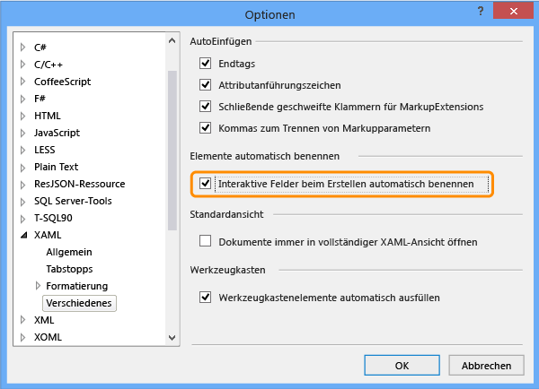  
  
2.  Erstellen Sie mit einer Visual C#- oder Visual Basic-Vorlage ein neues Projekt für eine leere XAML-basierte Windows Store-App.  
  
     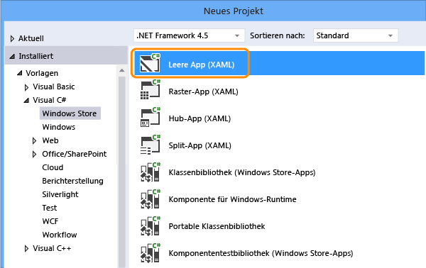  
  
3.  Öffnen Sie im Projektmappen-Explorer die Datei "MainPage.xaml". Ziehen Sie aus der Toolbox ein Schaltflächen- und ein Textfeldsteuerelement auf die Entwurfsoberfläche.  
  
     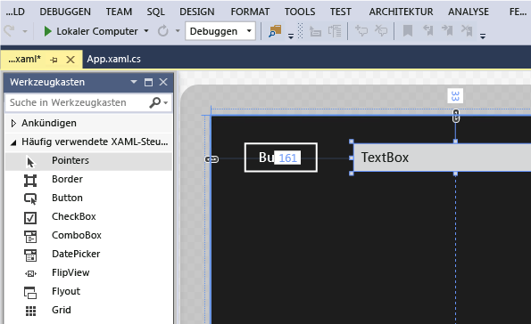  
  
4.  Doppelklicken Sie auf das Schaltflächensteuerelement, und fügen Sie dann den folgenden Code hinzu:  
  
    ```c#  
    private void button_Click_1(object sender, RoutedEventArgs e)  
    {  
        this.textBox.Text = this.button.Name;  
    }  
  
    ```  
  
    ```vb#  
    Public NotInheritable Class MainPage  
        Inherits Page  
  
        Private Sub button_Click(sender As Object, e As RoutedEventArgs) Handles Button.Click  
            Me.textBox.Text = Me.button.Name  
        End Sub  
    End Class  
    ```  
  
5.  Drücken Sie F5, um die Windows Store-App auszuführen.  
  
## <a name="create-and-run-a-coded-ui-test-for-the-windows-store-app"></a>Erstellen und Ausführen eines Tests der programmierten UI für die Windows Store-App  

[Wie kann ich Tests der programmierten UI für Apps der universellen Windows-Plattform (UWP) erstellen?](#uwpapps)
  
1.  Erstellen Sie einen neues Projekt mit einem Test der programmierten UI in der Windows Store-App.  
  
     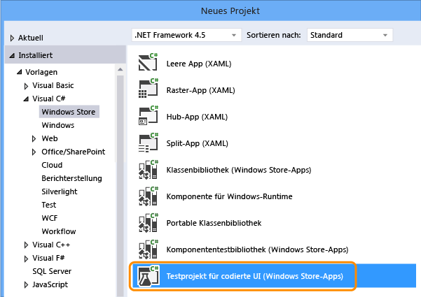  
  
2.  Wählen Sie mithilfe des Fadenkreuztools aus, dass Sie die UI-Zuordnung bearbeiten möchten.  
  
     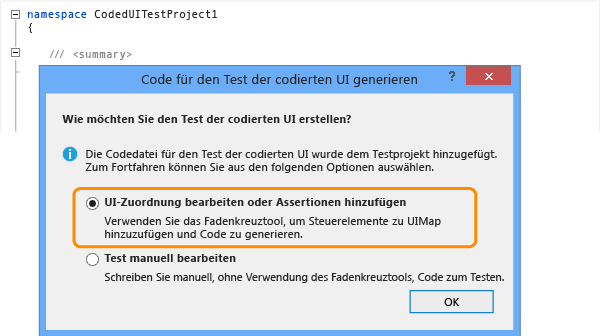  
  
3.  Wählen Sie im Test-Generator für programmierte UI mit dem Fadenkreuztool die App-Kachel aus, klicken Sie mit der rechten Maustaste auf **AutomationId** , und wählen Sie **Wert in Zwischenablage kopieren**aus. Der Wert in der Zwischenablage wird später beim Schreiben der Aktion zum Starten der App zu Testzwecken verwendet.  
  
     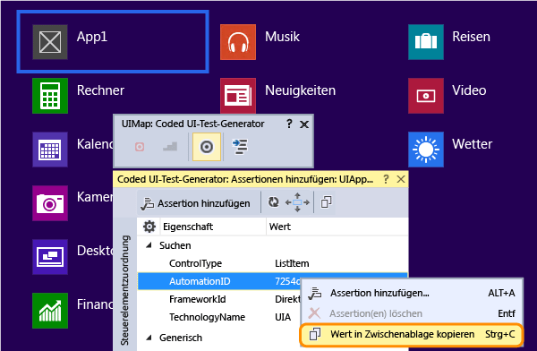  
  
4.  Wählen Sie in der ausgeführten Windows Store-App mit dem Fadenkreuztool das Schaltflächen- und das Textfeldsteuerelement aus. Wählen Sie nach dem Hinzufügen jedes Steuerelements auf der Symbolleiste des Test-Generators für programmierte UI die Schaltfläche **Steuerelement zu UI-Steuerelementzuordnung hinzufügen** aus.  
  
     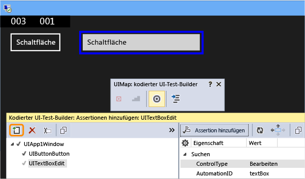  
  
5.  Wählen Sie auf der Symbolleiste des Test-Generators für programmierte UI die Schaltfläche **Code generieren** und dann **Generieren** aus, um Code für Änderungen an der UI-Steuerelementzuordnung zu erstellen.  
  
     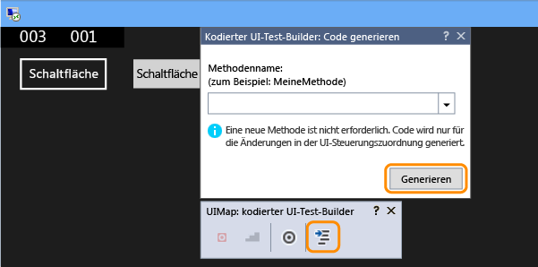  
  
6.  Wählen Sie die Schaltfläche aus, um im Textfeld einen Wert festzulegen.  
  
       
  
7.  Wählen Sie das Textfeldsteuerelement mit dem Fadenkreuztool aus, und wählen Sie dann die **Text** -Eigenschaft aus.  
  
     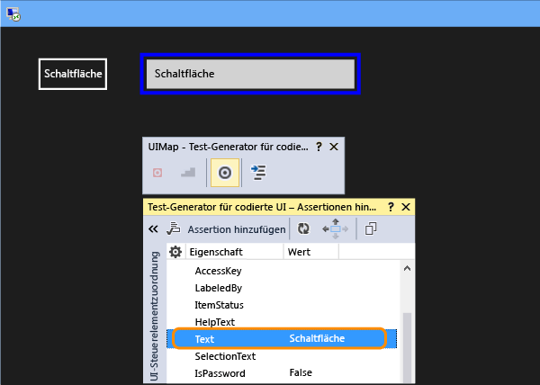  
  
8.  Fügen Sie eine Assertion hinzu. Diese wird beim Test verwendet, um die Richtigkeit des Werts sicherzustellen.  
  
     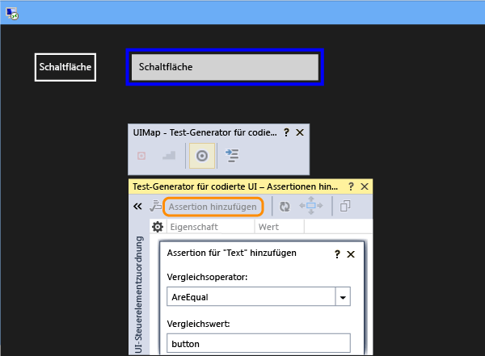  
  
9. Generieren Sie Code für die Assertion, und fügen Sie diesen hinzu.  
  
     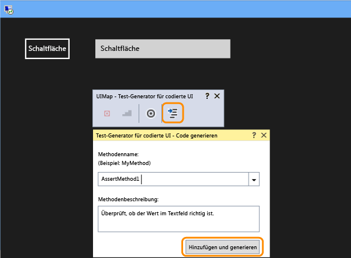  
  
10. **Visual C#**  
  
     Öffnen Sie im Projektmappen-Explorer die Datei "UIMap.Designer.cs", um den hinzugefügten Code für die Assert-Methode und die Steuerelemente anzuzeigen.  
  
     **Visual Basic**  
  
     Öffnen Sie im Projektmappen-Explorer die Datei "CodedUITest1.vb", klicken Sie im Code der CodedUITestMethod1()-Testmethode mit der rechten Maustaste auf die Assertionsmethode, die automatisch `Me.UIMap.AssertMethod1()` hinzugefügt wurde, und wählen Sie **Gehe zu Definition**aus. Hierdurch wird die Datei "UIMap.Designer.vb" im Code-Editor geöffnet, um den hinzugefügten Code für die Assert-Methode und die Steuerelemente anzuzeigen.  
  
    > [!WARNING]
    >  Die Dateien "UIMap.designer.cs" oder "UIMap.Designer.vb" sollten nicht direkt geändert werden. Andernfalls werden die an der Datei vorgenommenen Änderungen bei jedem Generieren des Tests überschrieben.  
  
     **Assert-Methode**  
  
    ```c#  
    public void AssertMethod1()  
    {  
        #region Variable Declarations  
        XamlEdit uITextBoxEdit = this.UIApp1Window.UITextBoxEdit;  
        #endregion  
  
        // Verify that the 'Text' property of 'textBox' text box equals 'button'  
        Assert.AreEqual(this.AssertMethod3ExpectedValues.UITextBoxEditText, uITextBoxEdit.Text);  
    }  
    ```  
  
    ```vb#  
    Public Sub AssertMethod1()  
        Dim uITextBoxEdit As XamlEdit = Me.UIApp2Window.UITextBoxEdit  
  
        'Verify that the 'Text' property of 'textBox' text box equals 'button'  
        Assert.AreEqual(Me.AssertMethod1ExpectedValues.UITextBoxEditText, uITextBoxEdit.Text)  
    End Sub  
    ```  
  
     **Steuerelemente**  
  
    ```c#  
    #region Properties  
    public XamlButton UIButtonButton  
    {  
        get  
        {  
            if ((this.mUIButtonButton == null))  
            {  
                this.mUIButtonButton = new XamlButton(this);  
                #region Search Criteria  
                this.mUIButtonButton.SearchProperties[XamlButton.PropertyNames.AutomationId] = "button";  
                this.mUIButtonButton.WindowTitles.Add("App1");  
                #endregion  
            }  
            return this.mUIButtonButton;  
        }  
    }  
  
    public XamlEdit UITextBoxEdit  
    {  
        get  
        {  
            if ((this.mUITextBoxEdit == null))  
            {  
                this.mUITextBoxEdit = new XamlEdit(this);  
                #region Search Criteria  
                this.mUITextBoxEdit.SearchProperties[XamlEdit.PropertyNames.AutomationId] = "textBox";  
                this.mUITextBoxEdit.WindowTitles.Add("App1");  
                #endregion  
            }  
            return this.mUITextBoxEdit;  
        }  
    }  
    #endregion  
  
    #region Fields  
    private XamlButton mUIButtonButton;  
  
    private XamlEdit mUITextBoxEdit;  
    #endregion  
    ```  
  
    ```vb#  
    #Region "Properties"  
    Public ReadOnly Property UIButtonButton() As XamlButton  
        Get  
            If (Me.mUIButtonButton Is Nothing) Then  
                Me.mUIButtonButton = New XamlButton(Me)  
                Me.mUIButtonButton.SearchProperties(XamlButton.PropertyNames.AutomationId) = "button"  
                Me.mUIButtonButton.WindowTitles.Add("App2")  
            End If  
            Return Me.mUIButtonButton  
        End Get  
    End Property  
  
    Public ReadOnly Property UITextBoxEdit() As XamlEdit  
        Get  
            If (Me.mUITextBoxEdit Is Nothing) Then  
                Me.mUITextBoxEdit = New XamlEdit(Me)  
                Me.mUITextBoxEdit.SearchProperties(XamlEdit.PropertyNames.AutomationId) = "textBox"  
                Me.mUITextBoxEdit.WindowTitles.Add("App2")  
            End If  
            Return Me.mUITextBoxEdit  
        End Get  
    End Property  
    #End Region  
  
    #Region "Fields"  
    Private mUIButtonButton As XamlButton  
  
    Private mUITextBoxEdit As XamlEdit  
    #End Region  
    ```  
  
11. Öffnen Sie im Projektmappen-Explorer die Datei "CodedUITest1.cs" oder "CodedUITest1.vb". Nun können Sie der CodedUTTestMethod1-Methode Code für die zum Ausführen des Tests erforderlichen Aktionen hinzufügen, indem Sie die der UIMap hinzugefügten Steuerelemente verwenden:  
  
    1.  Starten Sie die Windows Store-App mithilfe der Automation ID-Eigenschaft, die Sie zuvor in Zwischenablage kopiert haben:  
  
        ```c#  
        XamlWindow.Launch("8ebca7c4-effe-4c86-9998-068daccee452_cyrqexqw8cc7c!App")  
        ```  
  
        ```vb#  
        XamlWindow myAppWindow = XamlWindow.Launch("7254db3e-20a7-424e-8e05-7c4dabf4f28d_cyrqexqw8cc7c!App");  
        ```  
  
    2.  Fügen Sie eine Geste hinzu, um auf das Schaltflächensteuerelement zu tippen:  
  
        ```c#  
        Gesture.Tap(this.UIMap.UIApp1Window. UIButtonButton);  
        ```  
  
        ```vb#  
        Gesture.Tap(Me.UIMap.UIApp2Window. UIButtonButton)  
        ```  
  
    3.  Überprüfen Sie, ob der Aufruf der automatisch generierten Assert-Methode nach dem Starten der Anwendung und dem Tippen auf die Schaltfläche erfolgt:  
  
        ```c#  
        this.UIMap.AssertMethod1();  
        ```  
  
        ```vb#  
        Me.UIMap.AssertMethod1()  
        ```  
  
     Nach dem Hinzufügen des Codes sollte die CodedUITestMethod1-Testmethode wie folgt aussehen:  
  
    ```c#  
    [TestMethod]  
    public void CodedUITestMethod1()  
    {  
        // To generate code for this test, select "Generate Code for Coded UI Test" from the shortcut menu and select one of the menu items.  
  
        // Launch the app.  
        XamlWindow myAppWindow = XamlWindow.Launch("7254db3e-20a7-424e-8e05-7c4dabf4f28d_cyrqexqw8cc7c!App");  
  
        // Tap the button.  
        Gesture.Tap(this.UIMap.UIApp1Window.UIButtonButton);  
  
        this.UIMap.AssertMethod1();  
    }  
    ```  
  
    ```vb#  
    <CodedUITest(CodedUITestType.WindowsStore)>  
    Public Class CodedUITest1  
  
        <TestMethod()>  
        Public Sub CodedUITestMethod1()  
            '              
            ' To generate code for this test, select "Generate Code for Coded UI Test" from the shortcut menu and select one of the menu items.  
            '  
  
            ' Launch the app.  
            XamlWindow.Launch("8ebca7c4-effe-4c86-9998-068daccee452_cyrqexqw8cc7c!App")  
  
            '// Tap the button.  
            Gesture.Tap(Me.UIMap.UIApp2Window.UIButtonButton)  
  
            Me.UIMap.AssertMethod1()  
        End Sub  
    ```  
  
12. Erstellen Sie den Test, und führen Sie diesen anschließend mit dem Test-Explorer aus.  
  
     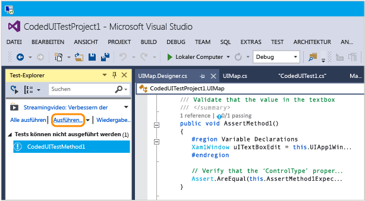  
  
     Die Windows Store-App wird gestartet, die Aktion für das Tippen auf die Schaltfläche wird abgeschlossen, und die Text-Eigenschaft des Textfelds wird mithilfe der Assert-Methode mit einem Wert versehen und überprüft.  
  
     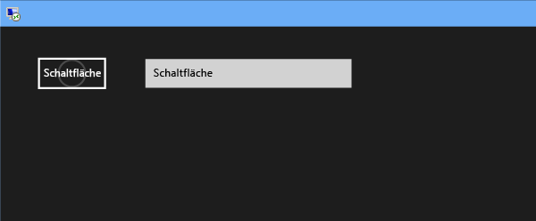  
  
     Nach Abschluss des Tests wird im Test-Explorer das erfolgreiche Ergebnis angezeigt.  
  
     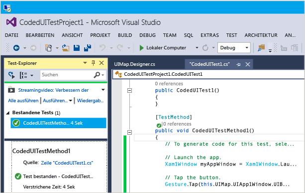  
  
## <a name="q--a"></a>Fragen und Antworten  
  
#### <a name="q-why-dont-i-see-the-option-to-record-my-coded-ui-test-in-the-generate-code-for-a-coded-ui-test-dialog"></a>F: Warum wird im Dialogfeld „Test der programmierten UI“ unter „Code generieren“ nicht die Option zum Aufzeichnen des Tests der programmierten UI angezeigt?**  
  
**A**: Die Option zum Aufzeichnen wird für Windows Store-Apps nicht unterstützt.  
  
#### <a name="q-can-i-create-a-coded-ui-test-for-my-windows-store-apps-based-on-winjs"></a>F: Kann ich einen Test der programmierten UI für Windows Store-Apps auf Grundlage von WinJS erstellen?**  

**A**: Nein, nur XAML-basierte Apps werden unterstützt.  
  
#### <a name="q-can-i-create-coded-ui-tests-for-my-windows-store-apps-on-a-system-that-is-not-running-windows-81-or-windows-10"></a>F: Kann ich auf einem System, in dem Windows 8.1 oder Windows 10 nicht ausgeführt wird, Tests der programmierten UI für meine Windows Store-Apps erstellen?**  
  
**A**: Nein. Die Projektvorlagen für Tests der programmierten UI stehen nur unter Windows 8.1 und Windows 10 zur Verfügung. Um Automatisierung für Apps der universellen Windows-Plattform (UWP) zu erstellen, benötigen Sie Windows 10.  

<a name="uwpapps"></a>  
#### <a name="q-how-do-i-create-coded-ui-tests-for-universal-windows-platform-uwp-apps"></a>F: Wie kann ich Tests der programmierten UI für Apps der universellen Windows-Plattform (UWP) erstellen?**  
  
**A**: Verwenden Sie abhängig von der Plattform, auf der Sie die UWP-App testen, eine der folgenden Möglichkeiten zum Erstellen von Tests der programmierten UI:  
  
- Eine UWP-App auf einem lokalen Computer wird als eine Store-App ausgeführt. Um dies zu testen, müssen Sie die Vorlage **Testprojekt für programmierte UI (Windows)** verwenden. Sie finden diese Vorlage beim Erstellen eines neuen Projekts unter dem Knoten **Windows**, **Universal** . Sie können auch unter dem Knoten **Windows**, **Windows 8**, **Windows** danach suchen.  
  
- Eine UWP-App auf einem mobilen Gerät oder Emulator wird als eine Phone-App ausgeführt. Um dies zu testen, müssen Sie die Vorlage **Testprojekt für programmierte UI (Windows Phone)** verwenden. Sie finden diese Vorlage beim Erstellen eines neuen Projekts unter dem Knoten **Windows**, **Universal** . Sie können auch unter dem Knoten **Windows**, **Windows 8**, **Windows Phone** danach suchen.  
  
Nachdem Sie das Projekt erstellt haben, wird ein Test auf die gleiche Weise wie zuvor erstellt.  
  
#### <a name="q-why-cant-i-modify-the-code-in-the-uimapdesigner-file"></a>F: Warum kann ich den Code in der Datei „UIMap.Designer“ nicht ändern?**  
  
**A**: Alle Codeänderungen, die Sie an der Datei "UIMapDesigner.cs" vornehmen, werden jedes Mal überschrieben, wenn Sie Code mit dem UIMap – Test-Generator für programmierte UI generieren. Wenn Sie eine aufgezeichnete Methode ändern müssen, müssen Sie sie in die UIMap.cs-Datei kopieren und umbenennen. Die Datei "UIMap.cs" kann verwendet werden, um Methoden und Eigenschaften in der Datei "UIMapDesigner.cs" zu überschreiben. Sie müssen den Verweis auf die ursprüngliche Methode in der Datei "Coded UITest.cs" entfernen und ihn durch den umbenannten Methodennamen ersetzen.  
  
## <a name="see-also"></a>Siehe auch  
 [Verwenden von Benutzeroberflächenautomatisierung zum Testen des Codes](../test/use-ui-automation-to-test-your-code.md)   
 [Festlegen einer eindeutigen Automatisierungseigenschaft für Windows Store-Steuerelemente für Tests](../test/set-a-unique-automation-property-for-windows-store-controls-for-testing.md)

