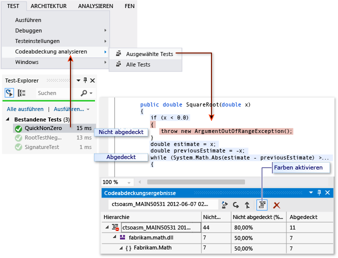

# Problembehandlung bei der Code Coverage

Mit dem Tool zur Code Coverage-Analyse in Visual Studio werden Daten für native und verwaltete Assemblys (*DLL*- oder *EXE*-Dateien) erfasst. In einigen Fällen wird im Fenster **Code Coverage-Ergebnisse** jedoch ein Fehler ähnlich dem Folgenden angezeigt: „Es wurden leere Ergebnisse generiert: ...“ Die Anzeige von leeren Ergebnissen kann verschiedene Gründe haben. In diesem Artikel erfahren Sie, wie Sie diese Probleme beheben können.

## Anzeige im Normalfall

Wenn Sie im Menü **Test** den Befehl **Code Coverage analysieren** auswählen, und der Buildvorgang sowie die Tests erfolgreich ausgeführt werden, sollte im Fenster **Code Coverage** eine Ergebnisliste angezeigt werden. Sie müssen möglicherweise die Elemente erweitern, um die Details anzuzeigen.

::: moniker range=">=vs-2019"

::: moniker-end
::: moniker range="vs-2017"

::: moniker-end

Weitere Informationen finden Sie unter [Bestimmen des Umfangs des zu testenden Codes mithilfe von Code Coverage](../test/using-code-coverage-to-determine-how-much-code-is-being-tested.md).

## Mögliche Gründe dafür, dass keine oder alte Ergebnisse angezeigt werden

### Verwenden Sie die richtige Edition von Visual Studio?

Sie benötigen Visual Studio Enterprise.

### Es wurden keine Tests ausgeführt.

Analyse&mdash;Überprüfen Sie das Ausgabefenster. Wählen Sie in der Dropdownliste **Ausgabe anzeigen von** die Option **Tests** aus. Überprüfen Sie, ob Warnungen oder Fehler protokolliert wurden.

Erklärung&mdash;Die Code Coverage-Analyse wird während der Tests ausgeführt. Sie schließt nur Assemblys ein, die während der Tests in den Arbeitsspeicher geladen werden. Wenn kein Test ausgeführt wird, gibt es nichts zur Code Coverage zu berichten.

Lösung&mdash;Wählen Sie im Test-Explorer **Alle ausführen** aus, um zu überprüfen, ob die Tests erfolgreich ausgeführt werden. Beheben Sie alle Fehler, bevor Sie **Code Coverage analysieren** verwenden.

### Sie sehen sich ein vorheriges Ergebnis an.

Wenn Sie die Tests ändern und erneut ausführen, können das vorherige Code Coverage-Ergebnis und die Codefarbe der alten Ausführung noch sichtbar sein.

1. Führen Sie **Code Coverage analysieren** aus.

2. Stellen Sie sicher, dass Sie das aktuelle Resultset im Fenster **Code Coverage-Ergebnisse** ausgewählt haben.

### PDB-Dateien (Symboldateien) sind nicht verfügbar

Analyse: Öffnen Sie den Zielordner für die Kompilierung (normalerweise *bin\debug*), und überprüfen Sie, ob für jede Assembly eine *PDB*-Datei im gleichen Verzeichnis vorhanden ist, in dem auch die *DLL*- oder *EXE*-Datei enthalten ist.

Erklärung: Für die Code Coverage-Engine muss während des Testlaufs für jede Assembly der Zugriff auf die zugeordnete *PSB*-Datei möglich sein. Wenn für eine bestimmte Assembly keine *PDB*-Datei zur Verfügung steht, wird die Assembly nicht analysiert.

Die *PDB*-Datei und die *DLL*- oder *EXE*-Datei müssen in dem gleichen Buildvorgang generiert werden.

Lösung: Stellen Sie sicher, dass die Buildeinstellungen so konfiguriert sind, dass die *PDB*-Datei generiert wird. Wenn die *PDB*-Dateien beim Erstellen des Projekts nicht aktualisiert werden, öffnen Sie die Projekteigenschaften, wählen Sie die Seite **Build** aus, wählen Sie **Erweitert** aus, und überprüfen Sie die **Debuginformationen**.

Vergewissern Sie sich bei C++-Projekten, dass die generierten PDB-Dateien über vollständige Debuginformationen verfügen. Öffnen Sie die Projekteigenschaften, und überprüfen Sie, ob der **Linker** > **Debuggen** > **Debuginformationen generieren** auf **Für Freigabe und Veröffentlichung optimierte Debuginformationen generieren (/DEBUG:FULL)** festgelegt ist.

Wenn sich die *PDB*-Datei und die *DLL*- oder *EXE*-Dateien an verschiedenen Speicherorten befinden, kopieren Sie die *PDB*-Datei in dasselbe Verzeichnis. Es ist auch möglich, die Code Coverage-Engine so zu konfigurieren, dass an anderen Speicherorten nach *PDB*-Dateien gesucht wird. Weitere Informationen finden Sie unter [Anpassen der Code Coverage-Analyse](../test/customizing-code-coverage-analysis.md).

### Verwenden einer instrumentierten oder optimierten Binärdatei

Analyse: Überprüfen Sie, ob die Binärdatei einer erweiterten Optimierung unterzogen wurde, beispielsweise einer profilgesteuerten Optimierung, oder durch ein Profilerstellungstool wie *vsinstr.exe* oder *vsperfmon.exe* instrumentiert wurde.

Erklärung&mdash;Wenn eine Assembly bereits durch ein anderes Profilerstellungstool instrumentiert oder optimiert wurde, wird die Assembly bei der Code Coverage-Analyse nicht berücksichtigt. Die Code Coverage-Analyse kann für solche Assemblys nicht ausgeführt werden.

Lösung&mdash;Deaktivieren Sie die Optimierung, und verwenden Sie einen neuen Build.

### Code ist kein verwalteter (.NET) oder systemeigener Code (C++)

Analyse&mdash;Überprüfen Sie, ob die Tests für verwalteten oder C++-Code ausgeführt werden.

Erklärung&mdash;Die Code Coverage-Analyse in Visual Studio steht nur für verwalteten und nativen Code (C++) zur Verfügung. Wenn Sie mit Tools von Drittanbietern arbeiten, wird ein Teil des Codes oder der gesamte Code möglicherweise auf einer anderen Plattform ausgeführt.

Lösung&mdash;Es ist keine Lösung verfügbar.

### Assembly wurde durch NGen installiert

Analyse&mdash;Stellen Sie sicher, dass die Assembly nicht aus dem nativen Imagecache geladen wird.

Erklärung&mdash;Native Imageassemblys werden aus Leistungsgründen nicht analysiert. Weitere Informationen finden Sie unter [Ngen.exe (Native Image Generator)](/dotnet/framework/tools/ngen-exe-native-image-generator).

Lösung&mdash;Verwenden Sie eine MSIL-Version der Assembly. Verarbeiten Sie sie nicht mit NGen.

### Benutzerdefinierte Datei ".runsettings" mit ungültiger Syntax

Analyse&mdash;Wenn Sie eine benutzerdefinierte *RUNSETTINGS*-Datei verwenden, kann sie einen Syntaxfehler enthalten. Code Coverage wird nicht ausgeführt. Entweder wird das Fenster „Code Coverage“ am Ende des Testlaufs nicht geöffnet, oder es werden darin alte Ergebnisse angezeigt.

Erklärung: Sie können die Komponententests mit einer benutzerdefinierten *RUNSETTINGS*-Datei ausführen, um Code Coverage-Optionen zu konfigurieren. Mithilfe der Optionen können Sie Dateien einschließen oder ausschließen. Weitere Informationen finden Sie unter [Anpassen der Code Coverage-Analyse](../test/customizing-code-coverage-analysis.md).

Lösung&mdash;Es gibt zwei mögliche Fehlertypen:

- **XML-Fehler**

     Öffnen Sie die *RUNSETTINGS*-Datei im XML-Editor von Visual Studio. Suchen Sie nach Fehlerhinweisen.

- **Fehler in regulärem Ausdruck**

  Jede Zeichenfolge in der Datei ist ein regulärer Ausdruck. Überprüfen Sie jede auf Fehler, und suchen Sie insbesondere nach Folgendem:

  - Nicht übereinstimmende Klammern (...) oder Klammern ohne Escapezeichen \\(...\\). Wenn eine Klammer in der Suchzeichenfolge übereinstimmen soll, müssen Sie diese mit einem Escapezeichen versehen. Verwenden Sie beispielsweise zum Abgleichen einer Funktion: `.*MyFunction\(double\)`

  - Sternchen oder Pluszeichen am Anfang eines Ausdrucks. Verwenden Sie einen Punkt gefolgt von einem Sternchen, damit jede Zeichenfolge übereinstimmt: `.*`

### Benutzerdefinierte Datei ".runsettings" mit falschen Ausschlüssen

Analyse&mdash;Wenn Sie eine benutzerdefinierte *RUNSETTINGS*-Datei verwenden, stellen Sie sicher, dass sie Ihre Assembly enthält.

Erklärung: Sie können die Komponententests mit einer benutzerdefinierten *RUNSETTINGS*-Datei ausführen, um Code Coverage-Optionen zu konfigurieren. Mithilfe der Optionen können Sie Dateien einschließen oder ausschließen. Weitere Informationen finden Sie unter [Anpassen der Code Coverage-Analyse](../test/customizing-code-coverage-analysis.md).

Lösung: Entfernen Sie alle `Include`-Knoten aus der *RUNSETTINGS*-Datei, und entfernen Sie anschließend alle `Exclude`-Knoten. Wenn das Problem damit behoben ist, fügen Sie sie schrittweise wieder hinzu.

Stellen Sie sicher, dass im „DataCollectors“-Knoten die Code Coverage angegeben wird. Vergleichen Sie ihn mit dem Beispiel in [Anpassen der Code Coverage-Analyse](../test/customizing-code-coverage-analysis.md).

## Einiger Code wird stets als nicht abgedeckt angezeigt

### Initialisierungscode in systemeigenen DLLs wird vor der Instrumentation ausgeführt

Analyse&mdash;In statisch verknüpftem nativen Code wird ein Teil der Initialisierungsfunktion **DllMain** und Code, den sie aufruft, manchmal als nicht abgedeckt angezeigt, obwohl der Code ausgeführt wurde.

Erklärung&mdash;Das Code Coverage-Tool fügt kurz vor dem Start der Anwendung Instrumentation in eine Assembly ein. In jeder zuvor geladenen Assembly wird der Initialisierungscode in **DllMain** ausgeführt, sobald die Assembly geladen wird und vor dem Ausführen der Anwendung. Dieser Code scheint nicht abgedeckt zu werden. Dies gilt in der Regel für statisch geladene Assemblys.

Lösung&mdash;Keine.

## Siehe auch

- [Bestimmen des Umfangs des zu testenden Codes mithilfe von Code Coverage](../test/using-code-coverage-to-determine-how-much-code-is-being-tested.md)
