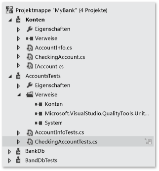
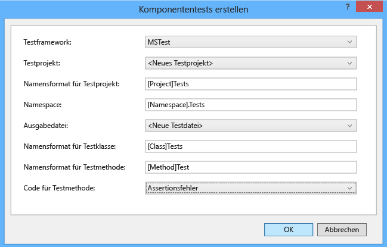
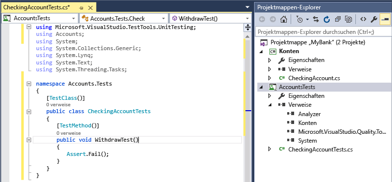
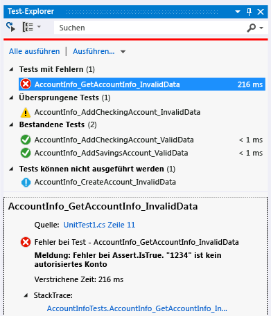
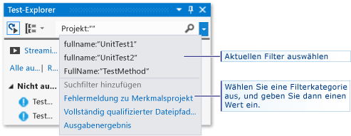
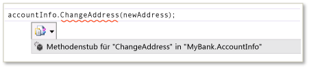
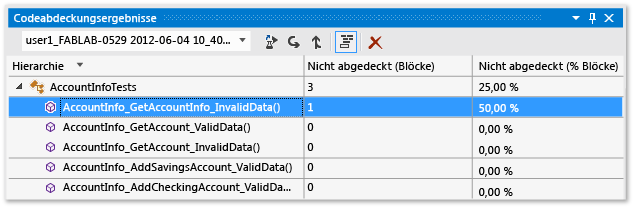

# Grundlagen zum Komponententest
[!INCLUDE[vs2017banner](../code-quality/includes/vs2017banner.md)]

Überprüfen Sie, ob Ihr Code wie erwartet funktioniert, indem Sie Komponententests erstellen und ausführen. Diese Tests werden als „Komponententests“ bezeichnet, da Sie die Funktionalität Ihres Programms in einzelne testfähige Verhalten gliedern, die Sie als einzelne *Komponenten* testen können. Mit dem Test\-Explorer von Visual Studio können Sie Komponententests flexibel und effizient ausführen und die Ergebnisse in Visual Studio anzeigen. In Visual Studio werden die Komponententest\-Frameworks von Microsoft für verwalteten und systemeigenen Code installiert. Verwenden Sie ein *Komponententest\-Framework*, um Komponententests zu erstellen, auszuführen und Berichte mit den Ergebnissen dieser Tests zu erstellen. Führen Sie Komponententests erneut durch, wenn Sie Änderungen vorgenommen haben, um zu testen, dass der Code weiterhin ordnungsgemäß ausgeführt wird. Wenn Sie Visual Studio Enterprise verwenden, können die Tests automatisch nach jedem Build ausgeführt werden.  
  
 Komponententests dienen dann am besten der Qualität Ihres Codes, wenn sie ein integraler Bestandteil des Softwareentwicklungsworkflows sind. Sobald Sie eine Funktion oder einen anderen Block mit Anwendungscode geschrieben haben, können Sie Komponententests erstellen, mit denen Sie das Verhalten des Codes bei der Eingabe von Standarddaten, falschen Daten und Daten an der Grenze des Gültigkeitsbereichs überprüfen können. Zudem bieten die Tests die Möglichkeit, alle im Code enthaltenen expliziten oder impliziten Annahmen zu überprüfen. Mit der *testgesteuerten Entwicklung* werden die Komponententests erstellt, bevor der Code geschrieben wird. So werden die Komponententests als Entwurfsdokumentation und als funktionale Spezifikationen der Funktionen verwendet.  
  
 Sie können schnell generieren Testprojekte und Testmethoden im Code oder die Tests manuell erstellen, wenn Sie sie benötigen. Wenn Sie IntelliTest verwenden, um Ihren .NET\-Code zu untersuchen, können Sie Testdaten und eine Suite von Komponententests generieren. Für jede Anweisung im Code wird eine Testeingabe generiert, die die betreffende Anweisung ausführt. Hier erfahren Sie, wie Sie [Komponententests für Ihren Code generieren](http://msdn.microsoft.com/library/dn823749.aspx).  
  
 Mit dem Test\-Explorer können auch Drittanbieter\- und Open\-Source\-Komponententest\-Frameworks ausgeführt werden, in denen Test\-Explorer\-Add\-On\-Schnittstellen implementiert sind. Sie können viele dieser Frameworks über den Visual Studio\-Erweiterungs\-Manager und die Visual Studio Gallery hinzufügen. Siehe [Installieren von Frameworks für Komponententests von Drittanbietern](../test/install-third-party-unit-test-frameworks.md).  
  
-   [Schnellstarts](#BKMK_Quick_starts)  
  
-   [Beispiel "MyBank-Projektmappe"](#BKMK_The_MyBank_Solution_example)  
  
-   [Erstellen von Komponententestprojekten und Testmethoden](#BKMK_Creating_the_unit_test_projects)  
  
-   [Erstellen der Tests](#BKMK_Writing_your_tests)  
  
-   [Ausführen von Tests im Test-Explorer](#BKMK_Running_tests_in_Test_Explorer)  
  
-   [Ausführen und Anzeigen von Tests](#BKMK_Running_and_viewing_tests_from_the_Test_Explorer_toolbar)  
  
##  <a name="BKMK_Unit_testing_overview"></a> Übersicht über Komponententests  
  
###  <a name="BKMK_Quick_starts"></a> Schnellstarts  
 Eine Einführung in Komponententests, in der Sie direkt in die Codierung eingeführt werden, finden Sie in diesen Themen:  
  
-   [Exemplarische Vorgehensweise: Erstellen und Ausführen von Komponententests für verwalteten Code](../test/walkthrough-creating-and-running-unit-tests-for-managed-code.md)  
  
-   [Schnellstart: Testgesteuerte Entwicklung mit dem Test\-Explorer](../test/quick-start-test-driven-development-with-test-explorer.md)  
  
-   [Komponententests für systemeigenen Code mit Test\-Explorer](http://msdn.microsoft.com/de-de/8a09d6d8-3613-49d8-9ffe-11375ac4736c)  
  
##  <a name="BKMK_The_MyBank_Solution_example"></a> Beispiel "MyBank\-Projektmappe"  
 In diesem Thema dient die Entwicklung einer fiktiven Anwendung mit dem Namen `MyBank` als Beispiel. Sie benötigen den tatsächlichen Code nicht, um den Erläuterungen in diesem Thema folgen zu können. Die Testmethoden werden in C\# geschrieben und mithilfe des Microsoft\-Komponententest\-Frameworks für verwalteten Code dargestellt. Die Konzepte können jedoch problemlos auf andere Sprachen und Frameworks übertragen werden.  
  
   
  
 Der erste Entwurf für die Anwendung `MyBank` umfasst eine Kontenkomponente, die ein Einzelkonto und die zugehörigen Transaktionen mit der Bank darstellt, sowie eine Datenbankkomponente, die die Funktionen zum Aggregieren und Verwalten der Einzelkonten darstellt.  
  
 Erstellen Sie eine `MyBank`\-Projektmappe, die zwei Projekte enthält:  
  
-   `Accounts`  
  
-   `BankDb`  
  
 Der erste Entwurf des Projekts `Accounts` enthält eine Klasse, die die grundlegenden Informationen über ein Konto aufnimmt, eine Schnittstelle, die die allgemeinen Funktionen jedes Kontotyps wie das Einzahlen und Abheben von Geld festlegt, und eine von der Schnittstelle abgeleitete Klasse, die ein Girokonto darstellt. Erstellen Sie zunächst die folgenden Quelldateien für das Projekt "Accounts":  
  
-   In `AccountInfo.cs` werden die grundlegenden Informationen für ein Konto definiert.  
  
-   In `IAccount.cs` wird eine `IAccount`\-Standardschnittstelle für ein Konto definiert, die Methoden zum Einzahlen und zum Abheben von Geld und zum Abrufen des Kontostands umfasst.  
  
-   `CheckingAccount.cs` enthält die `CheckingAccount`\-Klasse, die die `IAccounts`\-Schnittstelle für ein Girokonto implementiert.  
  
 Sie wissen aus Erfahrung, dass bei einer Abhebung von einem Girokonto sichergestellt werden muss, dass der abzuhebende Betrag kleiner als der Kontostand ist. Daher überschreiben Sie die `IAccount.Withdaw`\-Methode in `CheckingAccount` mit einer Methode, die prüft, ob diese Bedingung erfüllt ist. Hierfür kann folgende Methode formuliert werden:  
  
```c#  
  
public void Withdraw(double amount)  
{  
    if(m_balance >= amount)  
    {  
        m_balance -= amount;  
    }  
    else  
    {  
        throw new ArgumentException(amount, "Withdrawal exceeds balance!")  
    }  
}  
  
```  
  
 Der nun vorliegende Code kann getestet werden.  
  
##  <a name="BKMK_Creating_the_unit_test_projects"></a> Erstellen von Komponententestprojekten und Testmethoden  
 Häufig ist es schneller, das Komponententestprojekt und die Komponententest\-Stubs aus Ihrem Code zu generieren. Sie können das Komponententestprojekt und die Tests je nach Ihren Anforderungen auch manuell erstellen.  
  
 **Generieren des Komponententestprojekts und der Komponententest\-Stubs**  
  
1.  Klicken Sie im Code\-Editorfenster mit der rechten Maustaste, und wählen Sie im Kontextmenü die Option **Komponententests erstellen**.  
  
       
  
2.  Klicken Sie auf „OK“, um die Komponententests mit den Standardeinstellungen erstellen. Sie können die Werte zum Erstellen und Bennenen des Komponententestprojekts und der Komponententests jedoch auch ändern. Sie können den Code auswählen, der den Komponententestmethoden standardmäßig hinzugefügt wird.  
  
       
  
3.  Die Komponententest\-Stubs werden in einem neuen Komponententestprojekt für alle Methoden in der Klasse erstellt.  
  
       
  
4.  Erfahren Sie jetzt direkt, wie Sie [den Komponententestmethoden Code hinzufügen](#BKMK_Writing_your_tests), um einen sinnvollen Komponententest sowie weitere Komponententests zu erstellen, die Sie für einen gründlichen Test Ihres Codes noch hinzuüfgen möchten.  
  
 **Manuelles Erstellen des Komponententestpojekts und der Komponententests**  
  
 Ein Komponententestprojekt entspricht in der Regel der Struktur eines einzelnen Codeprojekts. Im MyBank\-Beispiel fügen Sie der Projektmappe `AccountsTests` die beiden Komponententestprojekte `BankDbTests` und `MyBanks` hinzu. Die Testprojektnamen wurden willkürlich ausgewählt, es ist jedoch empfehlenswert, eine standardmäßige Benennungskonvention zu verwenden.  
  
 **So fügen Sie einer Projektmappe ein Komponententestprojekt hinzu**  
  
1.  Wählen Sie im Menü **Datei** die Option **Neu** und dann **Projekt** aus \(Tastatur: STRG\+UMSCHALT\+N\).  
  
2.  Erweitern Sie im Dialogfeld "Neues Projekt" den Knoten **Installiert**, wählen die Sprache aus, die Sie für das Testprojekt verwenden möchten, und wählen Sie dann **Test** aus.  
  
3.  Wenn Sie ein Microsoft\-Komponententest\-Framework verwenden möchten, wählen Sie aus der Liste der Projektvorlagen **Komponententestprojekt** aus. Wählen Sie andernfalls die Projektvorlage des Komponententest\-Frameworks aus, das Sie verwenden möchten. Nennen Sie das Projekt zum Testen des Projekts `Accounts` in diesem Beispiel `AccountsTests`.  
  
    > [!WARNING]
    >  Nicht alle Drittanbieter\- und Open\-Source\-Komponententest\-Frameworks stellen eine Visual Studio\-Projektvorlage bereit. Lesen Sie die Dokumentation des Frameworks, um Informationen zum Erstellen eines Projekts zu erhalten.  
  
4.  Fügen Sie im Komponententestprojekt unter "Test" einen Verweis auf das Codeprojekt hinzu, in unserem Beispiel auf das Projekt "Accounts".  
  
     So erstellen Sie den Verweis auf das Codeprojekt  
  
    1.  Wählen Sie das Projekt im Projektmappen\-Explorer aus.  
  
    2.  Wählen Sie im Menü **Projekt** den Eintrag **Verweis hinzufügen** aus.  
  
    3.  Öffnen Sie im Dialogfeld "Verweis\-Manager" den Knoten **Projektmappe**, und wählen Sie **Projekte** aus. Wählen Sie den Namen des Codeprojekts aus, und schließen Sie das Dialogfeld.  
  
 Jedes Komponententestprojekt enthält Klassen, die die Namen der Klassen im Codeprojekt widerspiegeln. In diesem Beispiel enthält das Projekt `AccountsTests` die folgenden Klassen:  
  
-   Die `AccountInfoTests`\-Klasse enthält die Komponententestmethoden für die `AccountInfo`\-Klasse im Projekt `BankAccount`.  
  
-   Die `CheckingAccountTests`\-Klasse enthält die Komponententestmethoden für die `CheckingAccount`\-Klasse.  
  
##  <a name="BKMK_Writing_your_tests"></a> Erstellen der Tests  
 Das verwendete Komponententestframework und Visual Studio IntelliSense führen Sie durch das Erstellen von Komponententests für ein Codeprojekt. Für die meisten Frameworks müssen Sie zum Ausführen im Test\-Explorer bestimmte Attribute hinzufügen, um die Komponententestmethoden anzugeben. Die Frameworks bieten zudem eine Möglichkeit, anzuzeigen, ob die Testmethode erfolgreich war oder fehlgeschlagen ist. Dazu dienen in der Regel Assert\-Anweisungen oder Methodenattribute. Mit anderen Attributen werden optionale Setup\-Methoden angegeben, die bei der Initialisierung der Klasse und vor jeder Testmethode und vor Teardown\-Methoden ausgeführt werden, die wiederum nach jeder Testmethode und bevor die Klasse zerstört wird ausgeführt werden.  
  
 Das Muster "AAA" \(Arrange, Act, Assert\) stellt ein häufig verwendetes Verfahren zum Schreiben von Komponententests für eine zu testende Methode dar.  
  
-   Im Abschnitt **Arrange** \(Vorbereitung\) einer Komponententestmethode werden Objekte initialisiert und die Werte der Daten festgelegt, die an die zu testende Methode übergeben werden.  
  
-   Im Abschnitt **Act** \(Aktion\) wird die zu testende Methode mit den vorbereiteten Parametern aufgerufen.  
  
-   Im Abschnitt **Assert** \(Bestätigung\) wird überprüft, ob die zu testende Methode wie erwartet funktioniert.  
  
 Zum Testen der `CheckingAccount.Withdraw`\-Methode in diesem Beispiel können Sie zwei Tests schreiben: einen, der das Standardverhalten der Methode überprüft, und einen, der überprüft, ob eine Abhebung, die den Kontostand übersteigt, fehlschlägt. Fügen Sie der `CheckingAccountTests`\-Klasse die folgenden Methoden hinzu:  
  
```c#  
[TestMethod]  
public void Withdraw_ValidAmount_ChangesBalance()  
{  
    // arrange  
    double currentBalance = 10.0;  
    double withdrawal = 1.0;  
    double expected = 9.0;  
    var account = new CheckingAccount("JohnDoe", currentBalance);  
    // act  
    account.Withdraw(withdrawal);  
    double actual = account.Balance;  
    // assert  
    Assert.AreEqual(expected, actual);  
}  
  
[TestMethod]  
[ExpectedException(typeof(ArgumentException))]  
public void Withdraw_AmountMoreThanBalance_Throws()  
{  
    // arrange  
    var account = new CheckingAccount("John Doe", 10.0);  
    // act  
    account.Withdraw(20.0);  
    // assert is handled by the ExpectedException  
}  
  
```  
  
 Beachten Sie, dass in `Withdraw_ValidAmount_ChangesBalance` eine explizite `Assert`\-Anweisung verwendet wird, um zu bestimmen, ob die Testmethode erfolgreich ist oder fehlschlägt, während in `Withdraw_AmountMoreThanBalance_Throws` das `ExpectedException`\-Attribut verwendet wird, um den Erfolg der Testmethode zu bestimmen. Im Hintergrund werden Testmethoden vom Komponententest\-Framework in "try\/catch"\-Anweisungen eingeschlossen. Wenn eine Ausnahme abgefangen wird, schlägt die Testmethode in den meisten Fällen fehl, und die Ausnahme wird ignoriert. Die Verwendung des `ExpectedException`\-Attributs führt dazu, dass die Testmethode erfolgreich ausgeführt wird, wenn die angegebene Ausnahme ausgelöst wird.  
  
 Weitere Informationen zu den Microsoft\-Komponententest\-Frameworks finden Sie in einem der folgenden Themen:  
  
-   [Schreiben von Komponententests für .NET Framework mit dem Microsoft\-Komponententestframework für verwalteten Code](../test/writing-unit-tests-for-the-dotnet-framework-with-the-microsoft-unit-test-framework-for-managed-code.md)  
  
-   [Schreiben von Komponententests für C\/C\+\+ mit dem Microsoft\-Unittest\-Framework für C\+\+](../test/writing-unit-tests-for-c-cpp-with-the-microsoft-unit-testing-framework-for-cpp.md)  
  
## Festlegen von Timeouts für Komponententests  
 Ein Timeout für eine einzelne Testmethode festlegen:  
  
```c#  
[TestMethod]  
[Timeout(2000)]  // Milliseconds  
public void My_Test()  
{ ...  
}  
```  
  
```vb  
  
```  
  
 So legen Sie das maximal zulässige Timeout fest:  
  
```c#  
[TestMethod]  
[Timeout(TestTimeout.Infinite)]  // Milliseconds  
public void My_Test ()  
{ ...  
}  
```  
  
##  <a name="BKMK_Running_tests_in_Test_Explorer"></a> Ausführen von Tests im Test\-Explorer  
 Wenn Sie das Testprojekt erstellen, werden die Tests im Test\-Explorer angezeigt. Falls der Test\-Explorer nicht geöffnet ist, wählen Sie im Visual Studio\-Menü nacheinander **Test**, **Fenster** und dann **Test\-Explorer** aus.  
  
   
  
 Beim Ausführen, Schreiben und erneuten Ausführen der Tests werden die Ergebnisse in der Standardansicht des Test\-Explorers in den Gruppen **Fehlgeschlagene Tests**, **Bestandene Tests**, **Abgebrochene Tests** und **Nicht ausgeführte Tests** angezeigt. Sie können eine Gruppenüberschrift auswählen, um die Ansicht zu öffnen, in der alle Tests dieser Gruppe angezeigt werden.  
  
 Sie können die Tests in jeder Ansicht durch entsprechenden Text im Suchfeld auf globaler Ebene filtern oder indem Sie einen der vordefinierten Filter auswählen. Sie können jederzeit eine beliebige Auswahl der Tests ausführen. Die Ergebnisse eines Testlaufs sind sofort oben im Explorer\-Fenster in der Erfolgreich\/Fehler\-Leiste sichtbar. Details zu den Ergebnissen einer Testmethode werden angezeigt, wenn Sie den Test auswählen.  
  
###  <a name="BKMK_Running_and_viewing_tests_from_the_Test_Explorer_toolbar"></a> Ausführen und Anzeigen von Tests  
 Mithilfe der Test\-Explorer\-Symbolleiste können Sie die Tests ermitteln, organisieren und ausführen, die Sie interessieren.  
  
   
  
 Sie können zum Ausführen aller Tests **Alle ausführen** auswählen. Sie können auch **Ausführen** auswählen, um eine Teilmenge der Tests auszuführen. Nachdem Sie einen Satz von Tests ausgeführt haben, wird eine Zusammenfassung des Testlaufs unten im Test\-Explorer\-Fenster angezeigt. Wählen Sie einen Test aus, um die Details dieses Tests im unteren Bereich anzuzeigen. Wählen Sie im Kontextmenü **Test Öffnen** \(Tastatur: F12\) aus, um den Quellcode für den ausgewählten Test anzuzeigen.  
  
 Wenn einzelne Tests keine Abhängigkeiten haben, die verhindern, dass sie in beliebiger Reihenfolge ausgeführt werden können, sollten Sie parallele Testausführung über die \-Umschaltfläche auf der Symbolleiste aktivieren. Dadurch lässt sich die Zeit deutlich verkürzen, die zum Ausführen aller Tests erforderlich ist.  
  
###  <a name="BKMK_Running_tests_after_every_build"></a> Ausführen von Tests nach jedem Build  
  
> [!WARNING]
>  Das Ausführen von Komponententests nach jedem Buildvorgang wird nur in Visual Studio Enterprise unterstützt.  
  
|||  
|-|-|  
||Wählen Sie zum Ausführen der Komponententests nach jedem lokalen Buildvorgang im Standardmenü **Test** aus, und wählen Sie auf der Test\-Explorer\-Symbolleiste **Nach dem Buildvorgang Tests ausführen** aus.|  
  
###  <a name="BKMK_Filtering_and_grouping_the_test_list"></a> Filtern und Gruppieren der Testliste  
 Wenn Sie über viele Tests verfügen, können Sie im Test\-Explorer\-Suchfeld eine Eingabe vornehmen, um die Liste entsprechend der angegebenen Zeichenfolge zu filtern. Sie können den Filter weiter einschränken, indem Sie eine Option in der Filterliste auswählen.  
  
   
  
|||  
|-|-|  
||Wählen Sie die Schaltfläche **Gruppieren nach** aus, um die Tests nach Kategorie zu gruppieren.|  
  
 Weitere Informationen finden Sie unter [Ausführen von Komponententests mit dem Test\-Explorer](../test/run-unit-tests-with-test-explorer.md)  
  
## Fragen und Antworten  
 **F: Wie kann ich Komponententests debuggen?**  
  
 **A:** Mit dem Test\-Explorer können Sie Debugsitzungen für Ihre Tests starten. Beim schrittweisen Durchlaufen des Codes mit dem Visual Studio\-Debugger wechseln Sie nahtlos zwischen den Komponententests und dem zu testenden Projekt hin und zurück. Starten des Debuggens:  
  
1.  Legen Sie im Visual Studio\-Editor in mindestens einer zu debuggenden Testmethode einen Haltepunkt fest.  
  
    > [!NOTE]
    >  Da Testmethoden in jeder die oft ausgegebene Befehlszeilen  Reihenfolge ausgeführt werden können, legen Sie Haltepunkte in allen Testmethoden fest, die Sie debuggen möchten.  
  
2.  Wählen Sie im Test\-Explorer die Testmethoden aus, und wählen Sie dann im Kontextmenü **Ausgewählte Tests debuggen** aus.  
  
 Erfahren Sie mehr über das [Debuggen von Komponententests](../debugger/debugging-in-visual-studio.md).  
  
 **F: Wenn ich TDD verwende, wie generiere ich dann Code aus meinen Tests?**  
  
 **A:** Verwenden Sie IntelliSense zum Generieren von Klassen und Methoden in Ihrem Projektcode. Schreiben Sie eine Anweisung in einer Testmethode, mit der die Klasse oder die Methode aufgerufen wird, die Sie generieren möchten. Öffnen Sie anschließend das IntelliSense\-Menü unter dem Aufruf. Wenn es sich um den Aufruf eines Konstruktors der neuen Klasse handelt, wählen Sie im Menü **Neuen Typ generieren** aus, und befolgen Sie die Schritte im Assistenten, um die Klasse in das Codeprojekt einzufügen. Wenn es sich um den Aufruf einer Methode handelt, wählen Sie im IntelliSense\-Menü **Neue Methode generieren** aus.  
  
   
  
 **F: Kann ich Komponententests erstellen, die mehrere Datensätze als Eingabe zum Ausführen des Tests verwenden?**  
  
 **A:**  Ja. Mit *datengesteuerten Testmethoden* können Sie einen Wertebereich in einer einzigen Komponententestmethode testen. Verwenden Sie ein `DataSource`\-Attribut für die Testmethode, die die Datenquelle und die Tabelle mit den Variablenwerten enthält, die Sie testen möchten.  Weisen Sie im Methodentext die Zeilenwerte den Variablen mithilfe des Indexers `TestContext.DataRow[`*ColumnName*`]` zu.  
  
> [!NOTE]
>  Diese Verfahren gelten nur für Testmethoden, die Sie mithilfe des Microsoft\-Komponententest\-Frameworks für verwalteten Code schreiben. Wenn Sie ein anderes Framework verwenden, finden Sie Informationen zu entsprechenden Funktionen in der Frameworkdokumentation.  
  
 Nehmen Sie beispielsweise an, Sie fügen der `CheckingAccount`\-Klasse eine unnötige Methode mit dem Namen `AddIntegerHelper` hinzu. In `AddIntegerHelper` werden zwei ganze Zahlen addiert.  
  
 Zum Erstellen eines datengesteuerten Tests für die `AddIntegerHelper`\-Methode erstellen Sie zuerst eine Access\-Datenbank mit dem Namen `AccountsTest.accdb` und eine Tabelle mit dem Namen `AddIntegerHelperData`. In der Tabelle `AddIntegerHelperData` werden Spalten definiert, um den ersten und den zweiten Operanden der Addition anzugeben, und es wird eine Spalte definiert, um das erwartete Ergebnis anzugeben. Eine Reihe von Zeilen wird mit entsprechenden Werten gefüllt.  
  
```c#  
  
[DataSource(  
    @"Provider=Microsoft.ACE.OLEDB.12.0;Data Source=C:\Projects\MyBank\TestData\AccountsTest.accdb",   
    "AddIntegerHelperData"  
)]  
[TestMethod()]  
public void AddIntegerHelper_DataDrivenValues_AllShouldPass()  
{  
    var target = new CheckingAccount();  
    int x = Convert.ToInt32(TestContext.DataRow["FirstNumber"]);  
    int y = Convert.ToInt32(TestContext.DataRow["SecondNumber"]);   
    int expected = Convert.ToInt32(TestContext.DataRow["Sum"]);  
    int actual = target.AddIntegerHelper(x, y);  
    Assert.AreEqual(expected, actual);  
}  
  
```  
  
 Die mit dem Attribut versehene Methode wird für jede Zeile in der Tabelle einmal ausgeführt. Der Test\-Explorer meldet einen Testfehler für die Methode, wenn eine der Iterationen fehlschlägt. Im Detailbereich mit dem Testergebnis für die Methode wird die Methode mit dem Status "Erfolgreich" bzw. "Fehler" für jede Datenzeile angezeigt.  
  
 Erfahren Sie mehr über [datengesteuerte Komponententests](../test/how-to-create-a-data-driven-unit-test.md).  
  
 **F: Kann ich anzeigen, wie viel meines Codes durch die Komponententests getestet wird?**  
  
 **A:**  Ja. Mit dem Codeabdeckungstool von Visual Studio können Sie die Menge des Codes ermitteln, die tatsächlich von den Komponententests getestet wird. Es werden alle systemeigenen und verwalteten Sprachen sowie alle Komponententestframeworks, die durch das Komponententestframework ausgeführt werden können, unterstützt.  
  
 Das Codeabdeckungstool kann für ausgewählte oder alle Tests in einer Projektmappe ausgeführt werden. Im Fenster "Codeabdeckungsergebnisse " wird der Prozentsatz der durchlaufenen Produktcodeblöcke angezeigt, angeordnet nach Zeile, Funktion, Klasse, Namespace und Modul.  
  
 Wählen Sie zum Ausführen der Codeabdeckung für Testmethoden in einer Projektmappe im Visual Studio\-Menü die Option **Tests**, und wählen Sie dann **Codeabdeckung analysieren**.  
  
 Die Abdeckungsergebnisse werden im Fenster "Codeabdeckungsergebnisse" angezeigt.  
  
   
  
 Erfahren Sie mehr über [Codeabdeckung](../test/using-code-coverage-to-determine-how-much-code-is-being-tested.md).  
  
 **F: Wie kann ich in meinem Code Methoden testen, die über externe Abhängigkeiten verfügen?**  
  
 **A:**  Ja. Wenn Sie über Visual Studio Enterprise verfügen, können Sie Microsoft Fakes für Testmethoden verwenden, die Sie mithilfe von Komponententestframeworks für verwalteten Code schreiben können.  
  
 Microsoft Fakes verwendet zwei Ansätze zum Erstellen von Ersatzklassen für externe Abhängigkeiten.  
  
1.  *Stubs* generieren Ersatzklassen, die von der übergeordneten Schnittstelle der Abhängigkeitszielklasse abgeleitet werden. Stubmethoden können als Ersatz für öffentliche virtuelle Methoden der Zielklasse verwendet werden.  
  
2.  *Shims* verwenden die Laufzeitinstrumentation, um Aufrufe einer Zielmethode zu einer Shim\-Ersatzmethode für nicht virtuelle Methoden umzuleiten.  
  
 Bei beiden Ansätzen verwenden Sie die generierten Delegaten von Aufrufen der Abhängigkeitsmethode, um das Verhalten festzulegen, das Sie in der Testmethode haben möchten.  
  
 Erfahren Sie mehr über das [Isolieren von Komponententestmethoden Microsoft Fakes](../test/isolating-code-under-test-with-microsoft-fakes.md).  
  
 **F: Kann ich andere Komponententestframeworks verwenden, um Komponententests zu erstellen?**  
  
 **A:** Ja, führen Sie diese Schritte aus, um [andere Frameworks zu finden und zu installieren](../test/install-third-party-unit-test-frameworks.md). Öffnen Sie die Projektmappe nach dem Neustart von Visual Studio erneut, um die Komponententests zu erstellen, und wählen Sie dann hier Ihre installierten Frameworks aus:  
  
   
  
 Ihre Komponententest\-Stubs werden mit dem ausgewählten Framework erstellt.