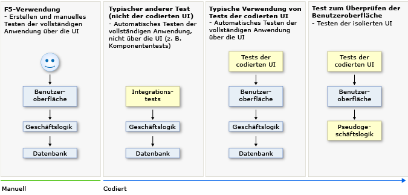
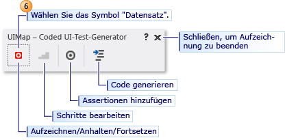
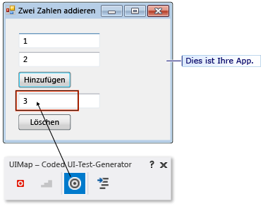
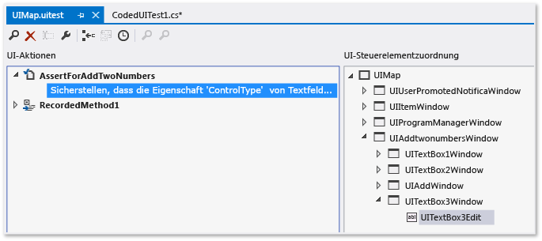
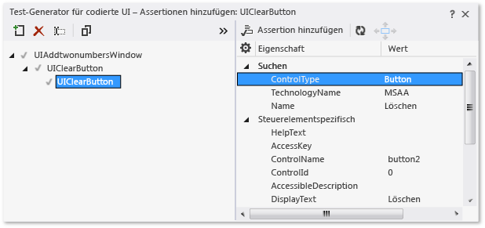
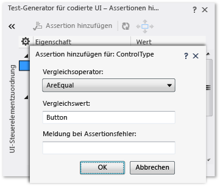
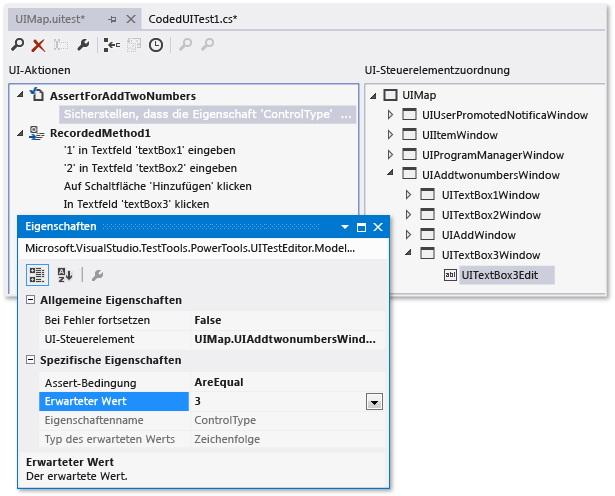
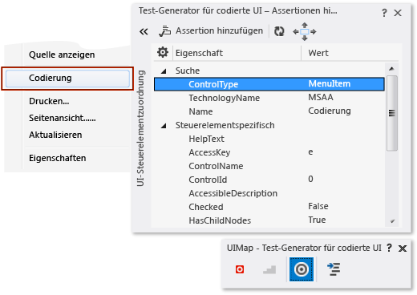
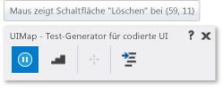

# <a name="use-ui-automation-to-test-your-code"></a>Verwenden der Benutzeroberflächenautomatisierung zum Testen des Codes

Automatisierte Tests, die die Anwendung über die Benutzeroberfläche (UI) steuern, werden in Visual Studio als *Tests der programmierten UI* (CUITs) bezeichnet. Zu diesen Tests gehören Funktionstests der Benutzeroberflächen-Steuerelemente. Mithilfe dieser Tests können Sie überprüfen, ob die gesamte Anwendung einschließlich der Benutzeroberfläche ordnungsgemäß funktioniert. Tests der codierten UI sind besonders bei der Überprüfung oder einer anderen Logik der Benutzeroberfläche hilfreich, beispielsweise einer Webseite. Außerdem werden sie häufig zum Automatisieren eines vorhandenen manuellen Tests verwendet.

[!INCLUDE [coded-ui-test-deprecation](includes/coded-ui-test-deprecation.md)]

Wie in der folgenden Abbildung dargestellt, könnte es sich bei einer typischen Entwicklungsumgebung um eine Umgebung handeln, bei der Sie einfach zu Beginn die Anwendung erstellen und durch die Benutzeroberflächen-Steuerelemente klicken, um sicherzustellen, dass alles ordnungsgemäß funktioniert. Anschließend können Sie einen automatisierten Test erstellen, statt die Anwendung weiterhin manuell zu testen. Abhängig von den jeweiligen in der Anwendung getesteten Funktionen können Sie entweder Code für einen Funktions- oder einen Integrationstest schreiben und festlegen, ob Tests auf Benutzeroberflächenebene einbezogen werden. Wenn Sie auf einen Teil der Geschäftslogik direkt zugreifen möchten, können Sie Code für einen Komponententest schreiben. Unter bestimmten Umständen, kann es jedoch nützlich sein, Tests der verschiedenen UI-Steuerelemente in die Anwendung einzubeziehen. Ein Test der programmierten UI kann überprüfen, ob Codeänderungen die Funktionalität Ihrer Anwendung beeinflussen.



Das Erstellen eines Tests der programmierten UI ist einfach. Sie können den Test einfach manuell durchführen, während der **Generator für Tests der programmierten UI** im Hintergrund ausgeführt wird. Sie können außerdem angeben, welche Werte in bestimmten Feldern angezeigt werden sollen. Der **Generator für Tests der programmierten UI** zeichnet Ihre Aktionen auf und generiert entsprechenden Code. Nach dem Erstellen des Tests können Sie diesen in einem spezialisierten Editor bearbeiten und die Sequenz der Aktionen ändern.

Alternativ können Sie aus einem Testfall, der in Microsoft Test Manager aufgezeichnet wurde, Code generieren. Weitere Informationen finden Sie unter [Record and play back manual tests (Aufzeichnen und Wiedergeben von manuellen Tests)](/azure/devops/test/mtm/record-play-back-manual-tests?view=vsts).

Mit dem spezialisierten Editor und **Generator für Tests der programmierten UI** können Sie einfach Tests der programmierten UI erstellen und bearbeiten, selbst wenn Ihr Hauptaugenmerk anstelle der Codierung auf Tests liegt. Wenn Sie jedoch Entwickler sind und den Test auf anspruchsvollere Weise erweitern möchten, bietet die einfache Struktur des Codes Möglichkeiten zum Kopieren und Anpassen. Sie können beispielsweise einen Test zu einem Kauf über eine Website aufzeichnen und den generierten Code anschließend bearbeiten, um eine Schleife zum Kaufen vieler Elemente hinzufügen.

**Anforderungen**

- Visual Studio Enterprise
- Komponente „Test der programmierten UI“

Weitere Informationen dazu, welche Plattformen und Konfigurationen von den Tests der programmierten UI unterstützt werden, finden Sie unter [Unterstützte Plattformen](../test/supported-configurations-and-platforms-for-coded-ui-tests-and-action-recordings.md).

## <a name="install-the-coded-ui-test-component"></a>Installieren der Komponente für Tests der programmierten UI

Installieren Sie die Komponente **Test der programmierten UI** von Visual Studio 2017, um Zugriff auf Tools und Vorlagen für Tests der programmierten UI zu erhalten.

1. Starten Sie den **Visual Studio-Installer**, indem Sie **Tools** > **Tools und Features abrufen** wählen.

1. Wählen Sie im **Visual Studio-Installer** die Registerkarte **Einzelne Komponenten** aus, und scrollen Sie nach unten zum Abschnitt **Debuggen und Testen**. Wählen Sie die Komponente **Test der programmierten UI** aus.

   

1. Klicken Sie auf **Ändern**.

## <a name="create-a-coded-ui-test"></a>Test der programmierten UI erstellen

1. Erstellen Sie ein Testprojekt der programmierten UI.

   Tests der programmierten UI müssen in ein Testprojekt für programmierte UI integriert sein. Erstellen Sie ein Testprojekt der programmierten UI (sofern noch nicht vorhanden). Wählen Sie **Datei** > **Neu** > **Projekt** aus, um das Dialogfeld **Neues Projekt** zu öffnen. Erweitern Sie im Kategoriebereich auf der linken Seite **Installiert** > **Visual Basic** *oder* **Visual C#**  >  **Test**. Wählen Sie die Vorlage **Testprojekt für programmierte UI** aus, und klicken Sie dann auf **OK**.

   

   > [!NOTE]
   > Wenn Ihnen die Vorlage **Test der programmierten UI** nicht angezeigt wird, müssen Sie die Komponente [Test der programmierten UI](../test/use-ui-automation-to-test-your-code.md#install-the-coded-ui-test-component) installieren.

2. Fügen Sie eine Testdatei der programmierten UI hinzu.

     Wenn Sie gerade ein Testprojekt für codierte UI erstellt haben, wird die erste CUIT-Datei automatisch hinzugefügt. Öffnen Sie zum Hinzufügen einer weiteren Testdatei das Kontextmenü im **Projektmappen-Explorer** im Testprojekt für programmierte UI, und wählen Sie dann **Hinzufügen** > **Test der programmierten UI** aus.

     Wählen Sie im Dialogfeld **Code für den Test der programmierten UI generieren** die Option **Aktionen aufzeichnen** > **UI-Zuordnung bearbeiten oder Assertionen hinzufügen** aus.

     

     Der **Test-Generator der programmierten UI** wird angezeigt.

     

3. Zeichnen Sie eine Sequenz von Aktionen auf.

     **Wählen Sie zum Starten der Aufzeichnung** das **Aufzeichnungssymbol** aus. Führen Sie die Aktionen durch, die in Ihrer Anwendung getestet werden sollen, einschließlich Starten der Anwendung (falls erforderlich). Wenn Sie beispielsweise eine Webanwendung testen, müssen Sie möglicherweise einen Browser starten, zu einer Website navigieren und sich bei der Anwendung anmelden.

     Wählen Sie beispielsweise bei eingehenden E-Mails zum **Anhalten der Aufzeichnung** die Option **Anhalten** aus.

    > [!WARNING]
    > Alle auf dem Desktop ausgeführten Aktionen werden aufgezeichnet. Halten Sie die Aufzeichnung an, wenn Sie Aktionen ausführen, bei denen sensible Daten in die Aufzeichnung gelangen könnten.

     Wählen Sie zum **Löschen von Aktionen**, die Sie versehentlich aufgezeichnet haben, **Schritte bearbeiten** aus.

     Wählen Sie zum **Generieren von Code**, der Ihre Aktionen repliziert, das Symbol **Code generieren** aus, und geben Sie einen Namen und eine Beschreibung für Ihre Testmethode für programmierte UI ein.

4. Überprüfen Sie die Werte in Benutzeroberflächenfeldern wie z.B. Textfeldern.

     Wählen Sie im **Test-Generator der programmierten UI** **Assertionen hinzufügen** und anschließend in der ausgeführten Anwendung ein UI-Steuerelement aus. Wählen Sie in der angezeigten Eigenschaftenliste eine Eigenschaft, beispielsweise **Text** in einem Textfeld, aus. Wählen Sie im Kontextmenü **Assertion hinzufügen** aus. Wählen Sie im Dialogfeld den Vergleichsoperator, den Vergleichswert und die Fehlermeldung aus.

     Schließen Sie das Assertionsfenster, und wählen Sie **Code generieren** aus.

     

    > [!TIP]
    > Wechseln Sie zwischen dem Aufzeichnen von Aktionen und dem Überprüfen von Werten. Generieren Sie Code am Ende jeder Sequenz von Aktionen oder Überprüfungen. Wenn Sie möchten, können Sie auch zu einem späteren Zeitpunkt neue Aktionen und Überprüfungen einfügen.

     Weitere Informationen finden Sie unter [Überprüfen der Eigenschaften von UI-Steuerelementen](#validate-the-properties-of-ui-controls).

5. Zeigen Sie den generierten Testcode an.

     Schließen Sie zum Anzeigen des generierten Codes das Fenster des Test-Generators für codierte UI. Im Code werden die Namen angezeigt, die Sie den einzelnen Schritten zugewiesen haben. Der Code befindet sich in der von Ihnen erstellten CUIT-Datei:

    ```csharp
    [CodedUITest]
    public class CodedUITest1
    { ...
      [TestMethod]
      public void CodedUITestMethod1()
      {
          this.UIMap.AddTwoNumbers();
          this.UIMap.VerifyResultValue();
          // To generate more code for this test, select
          // "Generate Code" from the shortcut menu.
      }
    }
    ```

6. Fügen Sie weitere Aktionen und Assertionen hinzu.

   Platzieren Sie den Cursor am entsprechenden Punkt in der Testmethode, und wählen Sie im Kontextmenü **Code für den Test der programmierten UI generieren** aus. An dieser Stelle wird neuer Code eingefügt.

7. Bearbeiten Sie die Details der Testaktionen und Assertionen.

     Öffnen Sie *UIMap.uitest*. Diese Datei wird im **Editor für Tests der programmierten UI** geöffnet, in dem Sie jede aufgezeichnete Aktionsfolge sowie die Assertionen bearbeiten können.

     

     Weitere Informationen finden Sie unter [Bearbeiten von Tests der programmierten UI mit dem Editor für Tests der programmierten UI](../test/editing-coded-ui-tests-using-the-coded-ui-test-editor.md).

8. Führen Sie den Test aus.

   Verwenden Sie Test-Explorer, oder öffnen Sie das Kontextmenü in der Testmethode, und wählen Sie **Tests ausführen** aus. Weitere Informationen zum Ausführen von Tests finden Sie unter [Ausführen von Komponententests mit dem Test-Explorer](../test/run-unit-tests-with-test-explorer.md) und *Weitere Optionen zum Ausführen von Tests der programmierten UI* im Abschnitt [Ausblick](#what's-next?) am Ende dieses Themas.

Die restlichen Abschnitten dieses Themas enthalten weitere Informationen über die Schritte in dieser Prozedur.

Ein ausführlicheres Beispiel finden Sie unter [Exemplarische Vorgehensweise: Erstellen, Bearbeiten und Verwalten eines Tests der programmierten UI](../test/walkthrough-creating-editing-and-maintaining-a-coded-ui-test.md). In der exemplarischen Vorgehensweise erstellen Sie eine einfache WPF (Windows Presentation Foundation)-Anwendung, um das Erstellen, Bearbeiten und Verwalten eines Tests der programmierten UI zu veranschaulichen. Die exemplarische Vorgehensweise umfasst Lösungen zum Korrigieren von Tests, die aufgrund verschiedener Probleme mit den Zeitabläufen und des Steuerelementrefactorings nicht mehr funktionieren.

## <a name="start-and-stop-the-application-under-test"></a>Starten und Beenden der getesteten Anwendung

Wenn Sie die Anwendung, den Browser oder die Datenbank nicht für jeden Test separat Starten und Beenden möchten, befolgen Sie einer der folgenden Anweisungen:

- Wenn Sie die Aktionen zum Starten der getesteten Anwendung nicht aufzeichnen möchten, müssen Sie die Anwendung starten, bevor Sie auf das **Aufzeichnungssymbol** klicken.

- Am Ende eines Tests wird der Prozess beendet, in dem der Test ausgeführt wird. Wenn Sie die Anwendung im Test gestartet haben, wird die Anwendung normalerweise geschlossen.  Wenn die Anwendung beim Beenden des Tests nicht geschlossen werden soll, fügen Sie der Projektmappe eine *RUNSETTINGS*-Datei hinzu und verwenden die `KeepExecutorAliveAfterLegacyRun`-Option. Weitere Informationen hierzu finden Sie unter [Configure unit tests by using a .runsettings file (Konfigurieren von Komponententests mithilfe einer .runsettings-Datei)](../test/configure-unit-tests-by-using-a-dot-runsettings-file.md).

- Fügen Sie eine Testinitialisierungsmethode hinzu, die durch ein `[TestInitialize]`-Attribut gekennzeichnet ist, mit dem am Anfang jeder Testmethode Code ausgeführt wird. Sie können die Anwendung beispielsweise aus der TestInitialize-Methode starten.

- Fügen Sie eine Testbereinigungsmethode hinzu, die durch ein `[TestCleanup]`-Attribut gekennzeichnet ist, mit dem am Ende jeder Testmethode Code ausgeführt wird. Zum Beispiel kann die Methode zum Schließen der Anwendung mit der TestCleanup-Methode aufgerufen werden.

## <a name="validate-the-properties-of-ui-controls"></a>Überprüfen der Eigenschaften von Steuerelementen der Benutzeroberfläche

Mithilfe des **Generators für den Test der programmierten UI** können Sie der <xref:Microsoft.VisualStudio.TestTools.UITest.Common.UIMap.UIMap>-Klasse für den Test ein Steuerelement für die Benutzeroberfläche (UI) hinzufügen oder Code für eine Validierungsmethode generieren, in der eine Assertion für ein UI-Steuerelement verwendet wird.

Wählen Sie zum Generieren von Assertionen für die UI-Steuerelemente im **Test-Generator der programmierten UI** das Tool **Assertionen hinzufügen** aus, und ziehen Sie es auf das Steuerelement der getesteten Anwendung, die Sie überprüfen möchten. Lassen Sie die Maustaste los, sobald das Feld das Steuerelement enthält. Der Code der Steuerelementklasse wird sofort in der Datei *UIMap.Designer.cs* erstellt.


Die Eigenschaften dieses Steuerelements werden jetzt im Dialogfeld **Assertionen hinzufügen** angezeigt.

Außerdem können Sie zu einem bestimmten Steuerelement navigieren, indem Sie den Pfeil **(<<)** auswählen und so die Ansicht für die **UI-Steuerelementzuordnung** erweitern. Wenn Sie nach einem übergeordneten, gleichgeordneten oder untergeordneten Steuerelement suchen möchten, können Sie an einer die oft ausgegebene Befehlszeilen Stelle auf die Zuordnung klicken und mit den Pfeiltasten durch die Struktur blättern.



> [!TIP]
> Wenn beim Auswählen eines Steuerelements in Ihrer Anwendung keine Eigenschaften oder keine Steuerelemente in der UI-Steuerelementzuordnung angezeigt werden, stellen Sie sicher, dass das Steuerelement im Anwendungscode über eine eindeutige ID verfügt. Diese eindeutige ID kann ein HTML-ID-Attribut oder eine WPF-UId sein.

Öffnen Sie als nächstes das Kontextmenü der Eigenschaft für das UI-Steuerelement, das Sie überprüfen möchten, und zeigen Sie dann auf **Assertion hinzufügen**. Wählen Sie im Dialogfeld **Assertion hinzufügen** den **Vergleichsoperator** für die Assertion aus, z.B. <xref:Microsoft.VisualStudio.TestTools.UnitTesting.Assert.AreEqual%2A>, und geben Sie unter **Vergleichswert** den Wert für die Assertion ein.



Wenn Sie alle Assertionen für den Test hinzugefügt haben, wählen Sie **OK** aus.

Wählen Sie **Code generieren** aus, um den Code für die Assertionen zu generieren und der UI-Zuordnung das Steuerelement hinzuzufügen. Geben Sie einen Namen und eine Beschreibung für die Testmethode der programmierten UI ein, die als Kommentare für die Methode hinzugefügt werden. Wählen Sie **Hinzufügen und generieren** aus. Wählen Sie danach zum Schließen des **Generators für Tests der programmierten UI** das Symbol **Schließen** aus. Auf diese Weise wird Code generiert, der dem folgenden ähnelt. Lautet der eingegebene Name beispielsweise `AssertForAddTwoNumbers`, sieht der Code wie in diesem Beispiel aus:

- Fügt der Testmethode in der Testdatei für codierte UI einen Aufruf der Assert-Methode AssertForAddTwoNumbers hinzu:

    ```csharp
    [TestMethod]
    public void CodedUITestMethod1()
    {
        this.UIMap.AddTwoNumbers();
        this.UIMap.AssertForAddTwoNumbers();
    }
    ```

     Sie können diese Datei bearbeiten, um die Reihenfolge der Schritte und Assertionen zu ändern oder neue Testmethoden zu erstellen. Wenn Sie weiteren Code hinzufügen möchten, platzieren Sie den Cursor auf der Testmethode, und wählen Sie im Kontextmenü **Code für den Test der programmierten UI generieren** aus.

- Fügt der UI-Zuordnung (*UIMap.uitest*) eine Methode mit dem Namen `AssertForAddTwoNumbers` hinzu. Diese Datei wird im **Editor für Tests der programmierten UI** geöffnet, in dem Sie die Assertionen bearbeiten können.

     

     Weitere Informationen finden Sie unter [Bearbeiten von Tests der programmierten UI mit dem Editor für Tests der programmierten UI](../test/editing-coded-ui-tests-using-the-coded-ui-test-editor.md).

     Sie können den generierten Code der Assertionsmethode auch in der Datei *UIMap.Designer.cs* anzeigen. Sie sollten diese Datei jedoch nicht bearbeiten. Wenn Sie eine angepasste Version des Codes erstellen möchten, kopieren Sie die Methoden in eine andere Datei, z.B. *UIMap.cs*, benennen Sie die Methoden um, und ändern Sie sie dort.

    ```csharp
    public void AssertForAddTwoNumbers()
    {
        ...
    }
    ```

### <a name="select-a-hidden-control-using-the-keyboard"></a>Auswählen eines ausgeblendeten Steuerelements mit der Tastatur

Vorgehensweise, wenn das Steuerelement den Fokus verliert und nicht mehr angezeigt wird, wenn Sie das Tool **Assertionen hinzufügen** über den **Test-Generator der programmierten UI** auswählen:

Beim Hinzufügen von Steuerelementen und Überprüfen ihrer Eigenschaften müssen Sie manchmal die Tastatur verwendet werden. Wenn Sie beispielsweise versuchen, einen Test der programmierten UI aufzuzeichnen, der ein Kontextmenü-Steuerelement verwendet, verliert die Liste der Menüelemente im Steuerelement den Fokus und wird nicht mehr angezeigt, wenn Sie versuchen, im **Test-Generator der programmierten UI** das Tool **Assertionen hinzufügen** auszuwählen. Dieser Vorgang wird in der folgenden Abbildung veranschaulicht. Das Kontextmenü in Internet Explorer verliert den Fokus und wird nicht mehr angezeigt, wenn Sie versuchen, es mit **Assertionen hinzufügen** auszuwählen.



Wenn Sie die Tastatur zum Auswählen eines Steuerelements verwenden möchten, zeigen Sie mit der Maus auf das Steuerelement. Halten Sie anschließend gleichzeitig die **STRG-TASTE** und die **I-TASTE** gedrückt. Lassen Sie die Tasten los. Das Steuerelement wird durch den **Test-Generator der programmierten UI** aufgezeichnet.

#### <a name="manually-record-mouse-hovers"></a>Manuelles Aufzeichnen von Mauszeigerbewegungen

Vorgehensweise, wenn Sie die Mauszeigerbewegung auf einem Steuerelement nicht aufzeichnen können:

Unter Umständen müssen Sie Mauszeiger-Bewegungsereignisse wegen eines bestimmten Steuerelements, das in einem Test der programmierten UI verwendet wird, mithilfe der Tastatur manuell aufzeichnen. Wenn Sie beispielsweise eine Windows Form- oder eine WPF (Windows Presentation Foundation)-Anwendung testen, weist diese möglicherweise benutzerdefinierten Code auf. Möglicherweise ist auch ein spezielles Verhalten für die Mauszeigerbewegung über ein Steuerelement definiert, beispielsweise ein sich erweiternder Strukturknoten. Zum Testen von solchen Bedingungen müssen Sie den **Test-Generator der programmierten UI** manuell benachrichtigen, wann Sie mit dem Mauszeiger auf das Steuerelement zeigen, indem Sie vordefinierte Tasten drücken.

Zeigen Sie beim Ausführen des Tests der codierten UI auf das Steuerelement. Halten Sie anschließend auf der Tastatur gleichzeitig die Tasten **STRG**, **UMSCHALTTASTE** und **R** gedrückt. Lassen Sie die Tasten los. Vom **Test-Generator der programmierten UI** wird ein Mauszeiger-Bewegungsereignis aufgezeichnet.



Nach dem Generieren der Testmethode wird der Datei *UIMap.Desinger.cs* ähnlicher Code wie im folgenden Beispiel hinzugefügt:

```csharp
// Mouse hover '1' label at (87, 9)
Mouse.Hover(uIItem1Text, new Point(87, 9));
```

### <a name="configure-mouse-hover-keyboard-assignments"></a>Konfigurieren der Tastenbelegungen für Mauszeigerbewegungen

Vorgehensweise, wenn die Tastenbelegung für das Erfassen von Mauszeiger-Bewegungsereignissen in Ihrer Umgebung an anderer Stelle verwendet wird:

Falls notwendig kann die Standardtastenbelegung für Mauszeiger-Bewegungsereignisse in Tests der programmierten UI so konfiguriert werden, dass anstelle von **STRG**+**SHIFT**+**R** andere Tasten verwendet werden.

> [!WARNING]
> In der Regel sollte jedoch eine Änderung der Tastenbelegung für Mauszeiger-Bewegungsereignisse nicht notwendig sein. Seien Sie vorsichtig, wenn Sie die Tastaturbelegung neu zuweisen. Ihre Auswahl wird in Visual Studio oder der getesteten Anwendung möglicherweise schon an anderer Stelle verwendet.

Zum Ändern der Tastaturbelegung müssen Sie die folgende Konfigurationsdatei ändern:

*%Programme (x86)%\Microsoft Visual Studio\2017\Enterprise\Common7\IDE\CodedUITestBuilder.exe.config*

Ändern Sie in der Konfigurationsdatei die Werte für den `HoverKeyModifier`-Schlüssel und den `HoverKey`-Schlüssel, um die Tastenbelegung zu ändern:

```xml
<!-- Begin : Background Recorder Settings -->
<!-- HoverKey to use. -->
<add key="HoverKeyModifier" value="Control, Shift"/>
<add key="HoverKey" value="R"/>
```

### <a name="set-implicit-mouse-hovers-for-the-web-browser"></a>Festlegen impliziter Mauszeigerbewegungen für den Webbrowser

Vorgehensweise, wenn beim Aufzeichnen von Mauszeigerbewegungen Probleme auftreten:

Auf vielen Websites wird ein Steuerelement erweitert, wenn Sie auf es zeigen, und es werden weitere Details angezeigt. Im Allgemeinen entspricht dieses Verhalten Menüs in Desktopanwendungen. Da dies ein allgemeines Muster ist, werden in Tests der codierten UI implizite Bewegungen des Mauszeigers für Webbrowser aktiviert. Wenn Sie beispielsweise Mauszeigerbewegungen in Internet Explorer aufzeichnen, wird ein Ereignis ausgelöst. Diese Ereignisse können zur Aufzeichnung redundanter Mauszeigerbewegungen führen. Daher wird für das Aufzeichnen impliziter Mauszeigerbewegungen `ContinueOnError` in der UI-Testkonfigurationsdatei auf `true` festgelegt. Auf diese Weise kann die Wiedergabe fortgesetzt werden, wenn bei einem Mauszeiger-Bewegungsereignis ein Fehler auftritt.

Öffnen Sie zum Aktivieren der Aufzeichnung impliziter Mauszeigerbewegungen in einem Webbrowser die Konfigurationsdatei:

*%Programme (x86)%\Microsoft Visual Studio\2017\Enterprise\Common7\IDE\CodedUITestBuilder.exe.config*

Überprüfen Sie, ob der `RecordImplicitiHovers`-Schlüssel in der Konfigurationsdatei auf `true` festgelegt ist, wie im folgenden Beispiel dargestellt:

```xml
<!--Use this to enable/disable recording of implicit hovers.-->
<add key="RecordImplicitHover" value="true"/>
```

## <a name="customize-the-coded-ui-test"></a>Anpassen von Tests der programmierten UI

Nachdem Sie den Test der programmierten UI erstellt haben, können Sie diesen mithilfe eines der folgenden Tools in Visual Studio bearbeiten:

- Mithilfe des **Generators für Tests der programmierten UI** können Sie Ihren Tests zusätzliche Steuerelemente und Überprüfungen hinzufügen. Weitere Informationen finden Sie in diesem Thema im Abschnitt [Hinzufügen von Steuerelementen und Überprüfen ihrer Eigenschaften](#validate-the-properties-of-ui-controls).

- Mit dem **Editor für Tests der programmierten UI** können Sie Tests der programmierten UI mühelos ändern. Der **Editor für Tests der programmierten UI** ermöglicht das Suchen, Anzeigen und Bearbeiten der Testmethoden. Sie können auch UI-Aktionen und die zugehörigen Steuerelemente in der UI-Steuerelementzuordnung bearbeiten. Weitere Informationen finden Sie unter [Bearbeiten von Tests der programmierten UI mit dem Editor für Tests der programmierten UI](../test/editing-coded-ui-tests-using-the-coded-ui-test-editor.md).

- **Code-Editor:**

    - Fügen Sie manuell Code für die Steuerelemente im Test hinzu, wie im Abschnitt [Aktionen und Eigenschaften des Steuerelements der programmierten Benutzeroberfläche](#coded-ui-control-actions-and-properties) in diesem Thema beschrieben.

    - Nachdem Sie einen Test der programmierten UI erstellt haben, können Sie ihn in einen datengesteuerten Test ändern. Weitere Informationen finden Sie unter [Erstellen eines datengesteuerten Tests der programmierten UI](../test/creating-a-data-driven-coded-ui-test.md).

    - Sie können bei der Wiedergabe eines Tests der programmierten UI festlegen, dass bei einem Test auf bestimmte Ereignisse gewartet werden soll, z. B. auf das Anzeigen eines Fensters, das Ausblenden einer Statusanzeige usw. Fügen Sie hierzu die entsprechende UITestControl.WaitForControlXXX()-Methode hinzu. Eine vollständige Liste der verfügbaren Methoden finden Sie unter [Festlegen, dass bei Wiedergabe von Tests der programmierten UI auf bestimmte Ereignisse gewartet wird](../test/making-coded-ui-tests-wait-for-specific-events-during-playback.md). Ein Beispiel für einen Test der programmierten UI, der durch die Verwendung der Methode „WaitForControlEnabled“ auf die Aktivierung eines Steuerelements wartet, finden Sie unter [Exemplarische Vorgehensweise: Erstellen, Bearbeiten und Verwalten eines Tests der programmierten UI](../test/walkthrough-creating-editing-and-maintaining-a-coded-ui-test.md).

    - Bei Tests der programmierten UI werden einige HTML5-Steuerelemente unterstützt, die in Internet Explorer 9 und in Internet Explorer 10 enthalten sind. Weitere Informationen finden Sie unter [Verwenden von HTML5-Steuerelementen in Tests der programmierten UI](../test/using-html5-controls-in-coded-ui-tests.md).

    - Codierungsleitfaden für Tests der programmierten UI:

       - [Aufbau eines Tests der programmierten UI](../test/anatomy-of-a-coded-ui-test.md)

       - [Bewährte Methoden für Tests der programmierten UI](../test/best-practices-for-coded-ui-tests.md)

       - [Testen einer großen Anwendung mit mehreren UI-Zuordnungen](../test/testing-a-large-application-with-multiple-ui-maps.md)

       - [Supported Configurations and Platforms for Coded UI Tests and Action Recordings (Unterstützte Konfigurationen und Plattformen für Tests der programmierten UI und Aktionsaufzeichnungen)](../test/supported-configurations-and-platforms-for-coded-ui-tests-and-action-recordings.md)

### <a name="the-generated-code"></a>Der generierte Code

Wenn Sie **Code generieren** auswählen, werden mehrere Codeelemente erstellt:

- Eine Zeile in der Testmethode.

    ```csharp
    [CodedUITest]
    public class CodedUITest1
    { ...
      [TestMethod]
      public void CodedUITestMethod1()
      {
          this.UIMap.AddTwoNumbers();
          // To generate more code for this test, select
          // "Generate Code" from the shortcut menu.      }
    }
    ```

     Mit einem Rechtsklick können Sie in dieser Methode weitere aufgezeichnete Aktionen und Überprüfungen hinzuzufügen. Sie können diese auch manuell bearbeiten, um den Code zu erweitern oder zu ändern. Sie können beispielsweise einen Teil des Codes in einer Schleife einschließen.

     Außerdem können Sie neue Testmethoden und auf die gleiche Weise auch Code hinzufügen. Jede Testmethode muss das `[TestMethod]`-Attribut aufweisen.

- Eine Methode in *UIMap.uitest*

     Diese Methode enthält die Details der aufgezeichneten Aktionen oder den überprüften Wert. Sie können diesen Code bearbeiten, indem Sie *UIMap.uitest* öffnen. Die Datei wird in einem spezialisierten Editor geöffnet, in dem Sie die aufgezeichneten Aktionen löschen oder umgestalten können.

     Außerdem können Sie die generierte Methode in der Datei *UIMap.Designer.cs* anzeigen. Mit dieser Methode werden die Aktionen ausgeführt, die Sie bei Ausführung des Tests aufgezeichnet haben.

    ```csharp
    // File: UIMap.Designer.cs
    public partial class UIMap
    {
      /// <summary>
      /// Add two numbers
      /// </summary>
      public void AddTwoNumbers()
      { ...   }
    }
    ```

    > [!WARNING]
    > Sie sollten diese Datei nicht bearbeiten, da sie beim Erstellen weiterer Tests neu generiert wird.

     Sie können angepasste Versionen dieser Methoden erstellen, indem Sie sie in *UIMap.cs* kopieren. Beispielsweise können Sie eine parametrisierte Version erstellen, die Sie über eine Testmethode aufrufen können:

    ```csharp
    // File: UIMap.cs
    public partial class UIMap // Same partial class
    {
      /// <summary>
      /// Add two numbers - parameterized version
      /// </summary>
      public void AddTwoNumbers(int firstNumber, int secondNumber)
      { ...   // Code modified to use parameters.
      }
    }
    ```

- Deklarationen in *UIMap.uitest*

    Diese Deklarationen stellen die UI-Steuerelemente der Anwendung dar, die von dem Test verwendet werden. Sie werden durch den generierten Code verwendet, um die Steuerelemente zu verarbeiten und auf deren Eigenschaften zuzugreifen.

    Sie können sie auch verwenden, um eigenen Code zu schreiben. Geben Sie beispielsweise an, dass die Testmethode einen Link in einer Webanwendung auswählen, einen Wert in ein Textfeld eingeben oder eine Verzweigung erzeugen und basierend auf dem Wert eines Felds andere Testaktionen ausführen soll.

    Sie können mehrere Tests der programmierten UI und mehrere UI-Zuordnungsobjekte und -dateien hinzufügen, um das Testen einer großen Anwendung zu vereinfachen. Weitere Informationen finden Sie unter [Testen einer großen Anwendung mit mehreren UI-Zuordnungen](../test/testing-a-large-application-with-multiple-ui-maps.md).

Weitere Informationen über den generierten Code finden Sie unter [Aufbau eines Tests der programmierten UI](../test/anatomy-of-a-coded-ui-test.md).

## <a name="coded-ui-control-actions-and-properties"></a>Aktionen und Eigenschaften des Steuerelements der programmieren Benutzeroberfläche

Wenn Sie mit UI-Steuerelementen in Tests der programmierten UI arbeiten, sind diese in zwei Bereiche getrennt: Aktionen und Eigenschaften.

- Der erste Bereich besteht aus Aktionen, die Sie für UI-Steuerelemente ausführen können. So können Tests der codierten UI beispielsweise Mausklicks auf ein UI-Teststeuerelement oder Tasteneingaben auf der Tastatur simulieren, die sich auf ein UI-Teststeuerelement auswirken.

- Im zweiten Bereich wird es Ihnen ermöglicht, Eigenschaften aus einem UI-Teststeuerelement abzurufen und für dieses festzulegen. Zum Beispiel kann bei Tests der codierten UI die Anzahl der Elemente in einem `ListBox` abgerufen oder ein `CheckBox` für den ausgewählten Zustand aktiviert werden.

**Zugreifen auf Aktionen von UI-Teststeuerelementen**

Verwenden Sie zum Ausführen von Aktionen für UI-Teststeuerelemente, z. B. Mausklicks oder Tastaturaktionen, die Methoden in der <xref:Microsoft.VisualStudio.TestTools.UITesting.Mouse>-Klasse und in der <xref:Microsoft.VisualStudio.TestTools.UITesting.Keyboard>-Klasse:

- Um eine mausorientierte Aktion, z. B. einen Mausklick, für ein UI-Teststeuerelement auszuführen, verwenden Sie <xref:Microsoft.VisualStudio.TestTools.UITesting.Mouse.Click%2A>.

     `Mouse.Click(buttonCancel);`

- Um eine tastaturorientierte Aktion, z. B. die Eingabe in ein Bearbeitungssteuerelement über die Tastatur, auszuführen, verwenden Sie <xref:Microsoft.VisualStudio.TestTools.UITesting.Keyboard.SendKeys%2A>.

     `Keyboard.SendKeys(textBoxDestination, @"C:\Temp\Output.txt");`

**Zugreifen auf Eigenschaften von UI-Teststeuerelementen**

Um für UI-Steuerelemente bestimmte Eigenschaftswerte abzurufen und festzulegen, können Sie die Werte und Eigenschaften eines Steuerelements direkt abrufen und festlegen, oder Sie können die <xref:Microsoft.VisualStudio.TestTools.UITesting.UITestControl.GetProperty%2A?displayProperty=fullName>-Methode und die <xref:Microsoft.VisualStudio.TestTools.UITesting.UITestControl.SetProperty%2A?displayProperty=fullName>-Methode mit dem Namen der speziellen Eigenschaft verwenden, die Sie Sie abrufen oder festlegen möchten.

<xref:Microsoft.VisualStudio.TestTools.UITesting.UITestControl.GetProperty%2A> gibt ein Objekt zurück, das anschließend in das entsprechende <xref:System.Type>-Objekt umgewandelt werden kann. <xref:Microsoft.VisualStudio.TestTools.UITesting.UITestControl.SetProperty%2A> akzeptiert ein Objekt für den Wert der Eigenschaft.

### <a name="to-get-or-set-properties-from-ui-test-controls-directly"></a>So rufen Sie Eigenschaften von UI-Teststeuerelementen ab oder legen sie fest

Mit Steuerelementen, die von <xref:Microsoft.VisualStudio.TestTools.UITesting.UITestControl> abgeleitet werden (z.B. [HtmlList](xref:Microsoft.VisualStudio.TestTools.UITesting.HtmlControls.HtmlList) oder [WinComboBox](xref:Microsoft.VisualStudio.TestTools.UITesting.WinControls.WinComboBox)), können Sie die jeweiligen Eigenschaftswerte direkt abrufen oder festlegen. Der folgende Code zeigt einige Beispiele:

 ```csharp
 int i = myHtmlList.ItemCount;
 myWinCheckBox.Checked = true;
 ```

### <a name="to-get-properties-from-ui-test-controls"></a>So rufen Sie Eigenschaften aus UI-Teststeuerelementen ab

- Um einen Eigenschaftswert von einem Steuerelement abzurufen, verwenden Sie <xref:Microsoft.VisualStudio.TestTools.UITesting.UITestControl.GetProperty%2A>.

- Um die Eigenschaft des abzurufenden Steuerelements anzugeben, verwenden Sie die entsprechende Zeichenfolge aus der `PropertyNames`-Klasse in jedem Steuerelement als Parameter für <xref:Microsoft.VisualStudio.TestTools.UITesting.UITestControl.GetProperty%2A>.

- <xref:Microsoft.VisualStudio.TestTools.UITesting.UITestControl.GetProperty%2A> gibt den entsprechenden Datentyp zurück, aber dieser Rückgabewert wird in ein <xref:System.Object> umgewandelt. Das zurückgegebene <xref:System.Object> muss dann in den entsprechenden Typ umgewandelt werden.

     Beispiel:

     `int i = (int)GetProperty(myHtmlList.PropertyNames.ItemCount);`

### <a name="to-set-properties-for-ui-test-controls"></a>So legen Sie Eigenschaften für UI-Teststeuerelemente fest

- Zum Festlegen einer Eigenschaft in einem Steuerelement verwenden Sie <xref:Microsoft.VisualStudio.TestTools.UITesting.UITestControl.SetProperty%2A>.

- Um die Eigenschaft des festzulegenden Steuerelements anzugeben, verwenden Sie die entsprechende Zeichenfolge aus der `PropertyNames`-Klasse als ersten Parameter für <xref:Microsoft.VisualStudio.TestTools.UITesting.UITestControl.SetProperty%2A>, wobei der Eigenschaftswert als zweiter Parameter fungiert.

     Beispiel:

     `SetProperty(myWinCheckBox.PropertyNames.Checked, true);`

## <a name="debug"></a>Debug

Sie können Tests der programmierten UI mithilfe von Testprotokollen der programmierten UI analysieren. Testprotokolle für codierte UI filtern wichtige Informationen zum ausgeführten Test der codierten UI und zeichnen diese auf. Durch das Format der Protokolle können Sie Probleme schnell debuggen. Weitere Informationen finden Sie unter [Analysieren von Tests der programmierten UI mithilfe der Testprotokolle der programmierten UI](../test/analyzing-coded-ui-tests-using-coded-ui-test-logs.md).

## <a name="whats-next"></a>Ausblick

**Weitere Optionen zum Ausführen von Tests der programmierten UI:** Sie können Tests der programmierten UI direkt in Visual Studio ausführen, wie weiter oben in diesem Thema beschrieben. Außerdem können Sie automatisierte Benutzeroberflächentests mit Microsoft Test Manager oder Azure Pipelines ausführen. Wenn Tests der programmierten UI automatisiert werden, müssen sie im Gegensatz zu anderen automatisierten Tests bei der Ausführung mit dem Desktop interagieren.

- [Ausführen von Komponententests mit dem Test-Explorer](../test/run-unit-tests-with-test-explorer.md)

- [Run tests in your build process (Ausführen von Tests im Buildprozess)](/azure/devops/pipelines/test/getting-started-with-continuous-testing?view=vsts)

- [Vorgehensweise: Einrichten Ihres Test-Agents, um Tests auszuführen, die mit dem Desktopcomputer interagieren](https://msdn.microsoft.com/Library/3a94dd07-6d17-402c-ae8f-7947143755c9)

**Hinzufügen der Unterstützung für benutzerdefinierte Steuerelemente:** Das Framework für den Test der programmierten UI unterstützt nicht alle Benutzeroberflächen und bietet möglicherweise keine Unterstützung für die Benutzeroberfläche, die Sie testen möchten. Zum Beispiel können Sie nicht sofort einen Test der programmierten UI für Microsoft Excel erstellen. Sie können jedoch eine Erweiterung für das Framework für den Test der programmierten UI erstellen, die ein benutzerdefiniertes Steuerelement unterstützt.

- [Aktivieren von Tests der programmierten UI Ihrer Steuerelemente](../test/enable-coded-ui-testing-of-your-controls.md)

- [Erweitern von Tests der programmierten UI und Aktionsaufzeichnungen](../test/extending-coded-ui-tests-and-action-recordings-to-support-microsoft-excel.md)

Tests der programmierten UI werden häufig verwendet, um manuelle Tests zu automatisieren. Weitere Informationen zu manuellen Tests finden Sie unter [Run manual tests with Microsoft Test Manager (Ausführen manueller Tests mit Microsoft Test Manager)](/azure/devops/test/mtm/run-manual-tests-with-microsoft-test-manager?view=vsts). Weitere Informationen zu automatisierten Tests finden Sie unter [Testtools in Visual Studio](../test/improve-code-quality.md).

## <a name="see-also"></a>Siehe auch

- <xref:Microsoft.VisualStudio.TestTools.UITest.Common.UIMap.UIMap>
- <xref:Microsoft.VisualStudio.TestTools.UnitTesting.Assert>
- [Exemplarische Vorgehensweise: Erstellen, Bearbeiten und Verwalten eines Tests der programmierten UI](../test/walkthrough-creating-editing-and-maintaining-a-coded-ui-test.md)
- [Create a coded UI test to test a UWP app (Erstellen eines Tests der programmierten UI zum Testen einer UWP-App)](test-uwp-app-with-coded-ui-test.md)
- [Aufbau eines Tests der programmierten UI](../test/anatomy-of-a-coded-ui-test.md)
- [Bewährte Methoden für Tests der programmierten UI](../test/best-practices-for-coded-ui-tests.md)
- [Testen einer großen Anwendung mit mehreren UI-Zuordnungen](../test/testing-a-large-application-with-multiple-ui-maps.md)
