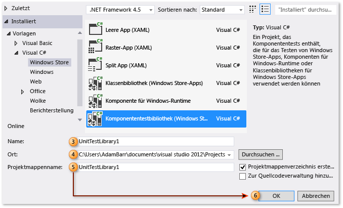
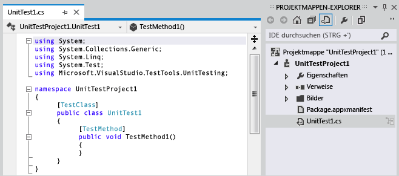
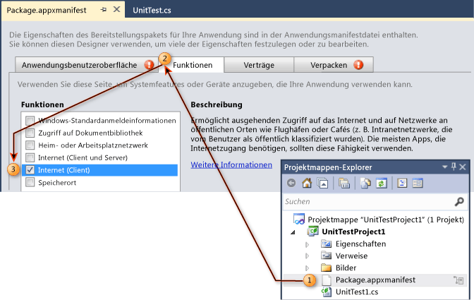
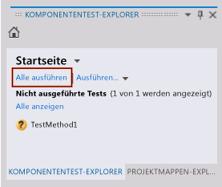
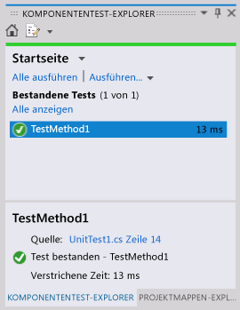

# Exemplarische Vorgehensweise: Erstellen und Ausführen von Komponententests für Windows Store-Apps
Visual Studio bietet Unterstützung für Komponententests verwalteter [!INCLUDE[win8_appname_long](../debugger/includes/win8_appname_long_md.md)] -Anwendungen und enthält Komponententest-Bibliotheksvorlagen für Visual C#, Visual Basic und Visual C++.  
  
> [!TIP]
>  Weitere Informationen zum Entwickeln von [!INCLUDE[win8_appname_long](../debugger/includes/win8_appname_long_md.md)] -Apps finden Sie unter [Erste Schritte mit Windows Store-Apps](http://go.microsoft.com/fwlink/?LinkID=241410).  
  
 Visual Studio stellt die folgende Funktionalität für Unittests bereit:  
  
-   [Erstellen eines Komponententestprojekts](#CreateAndRunUnitTestWin8Tailored_Create)  
  
-   [Bearbeiten des Manifests für das Komponententestprojekt](#CreateAndRunUnitTestWin8Tailored_Manifest)  
  
-   [Codieren des Komponententests](#CreateAndRunUnitTestWin8Tailored_Code)  
  
-   [Ausführen von Komponententests](#CreateAndRunUnitTestWin8Tailored_Run)  
  
 Im folgenden sind Schritte zur Erstellung, zum Lauf und zum Debugging von Komponententests für verwaltete Windows 8 [!INCLUDE[win8_appname_long](../debugger/includes/win8_appname_long_md.md)]-Apps beschrieben.  
  
## Erforderliche Komponenten  
 Visual Studio  
  
##   Erstellen eines Komponententestprojekts  
  
#### Erstellen eines Komponententestprojekts für eine Windows Store-App  
  
1.  Wählen Sie im Menü **Datei** die Option **Neues Projekt**aus.  
  
     Daraufhin wird das Dialogfeld "Neues Projekt" angezeigt.  
  
2.  Wählen Sie unter Vorlagen die Programmiersprache aus, in der Sie den Komponententest erstellen möchten, und wählen Sie dann die zugeordnete [!INCLUDE[win8_appname_long](../debugger/includes/win8_appname_long_md.md)] -Komponententestbibliothek aus. Wählen Sie beispielsweise **Visual C#** aus, und wählen Sie **Windows Store**aus und wählen dann **Komponententestbibliothek (Windows Store-Apps)**aus.  
  
    > [!NOTE]
    >  Visual Studio enthält Komponententest-Bibliotheksvorlagen für Visual C#, Visual Basic und Visual C++.  
  
3.  (Optional) Geben Sie im Textfeld **Name** den Namen ein, den Sie für das [!INCLUDE[win8_appname_long](../debugger/includes/win8_appname_long_md.md)]-Komponententestprojekt verwenden möchten.  
  
4.  (Optional) Ändern Sie den Pfad, unter dem Sie das Projekt erstellen möchten, indem Sie ihn im Textfeld **Speicherort** eingeben, oder klicken Sie auf die Schaltfläche **Durchsuchen** .  
  
5.  (Optional) Geben Sie im Textfeld **Projektmappe** den Namen ein, den Sie für die Projektmappe verwenden möchten.  
  
6.  Vergewissern Sie sich, dass die Option **Projektmappenverzeichnis erstellen** ausgewählt ist, und klicken Sie auf **OK** .  
  
       
  
     Der Projektmappen-Explorer wird mit dem neuen [!INCLUDE[win8_appname_long](../debugger/includes/win8_appname_long_md.md)]-Komponententestprojekt ausgefüllt, und der Code-Editor zeigt den Standardkomponententest, UnitTest1, an.  
  
       
  
##   Bearbeiten des Manifests für das Komponententestprojekt  
 Möglicherweise müssen Sie das Manifest für das Komponententestprojekt bearbeiten, um die erforderlichen Funktionen für die Ausführung der App bereitzustellen.  
  
#### So bearbeiten Sie die Manifestdatei der Windows Store-App für das Komponententestprojekt  
  
1.  Klicken Sie im Projektmappen-Explorer im neuen [!INCLUDE[win8_appname_long](../debugger/includes/win8_appname_long_md.md)] -Komponententestprojekt mit der rechten Maustaste auf die Datei Package.appxmanifest und wählen Sie **Öffnen**aus.  
  
     Daraufhin wird der Manifest-Designer für die Bearbeitung angezeigt.  
  
2.  Wählen Sie im Manifest-Designer die Registerkarte **Funktionen** aus.  
  
3.  Wählen Sie in der **Funktionen**-Liste die Funktionen, über die die getestete Komponente verfügen soll, und den für diese Tests erforderlichen Code aus. Aktivieren Sie beispielsweise das Kontrollkästchen **Internet** , wenn die Komponente, die getestet werden soll, und der Code Zugriff auf das Internet benötigen.  
  
    > [!NOTE]
    >  Die ausgewählten Funktionen sollten nur Funktionen enthalten, die für die ordnungsgemäße Durchführung des [!INCLUDE[win8_appname_long](../debugger/includes/win8_appname_long_md.md)] -Komponententests erforderlich sind. Sie sollten niemals Funktionen auswählen, die nicht Teil der zu testenden [!INCLUDE[win8_appname_long](../debugger/includes/win8_appname_long_md.md)]-App sind. Die Funktionen sollten im Allgemeinen eine Untergruppe der Funktionen sein, die für die getestete [!INCLUDE[win8_appname_long](../debugger/includes/win8_appname_long_md.md)]-App angegeben werden.  
  
     Weitere Informationen zum Manifest-Designer finden Sie unter [Konfigurieren eines Windows 8.1-App-Pakets mit dem Manifest-Designer](http://msdn.microsoft.com/Library/24c58b7f-9c6d-41c3-b385-c1e8497d5b2d).  
  
       
  
##   Codieren des Komponententests  
  
#### Schreiben von Code für den Komponententest einer Windows Store-App  
  
1.  Bearbeiten Sie im Code-Editor den Komponententest und fügen Sie die Bestätigungs- und Logikanforderungen für den Test hinzu.  
  
     Weitere Informationen finden Sie unter [Verwenden von Assert-Klassen](http://go.microsoft.com/fwlink/?LinkID=224991) in der MSDN Library.  
  
##   Ausführen von Komponententests  
  
#### So erstellen Sie die Projektmappe und führen den Komponententest mit dem Komponententest-Explorer aus  
  
1.  Wählen Sie im Menü **Test** den Punkt **Windows**und dann **Test-Explorer**aus.  
  
     Daraufhin wird der Komponententest-Explorer ohne Ihren Test angezeigt.  
  
2.  Wählen Sie im Menü **Erstellen** die Option **Projektmappe erstellen**aus.  
  
     Der Komponententest wird jetzt aufgeführt.  
  
    > [!NOTE]
    >  Sie müssen die Projektmappe erstellen, um die Liste der Komponententests im Komponententest-Explorer zu aktualisieren.  
  
    > [!WARNING]
    >  Bekanntes Visual Studio-Problem: Sie müssen den Komponententest-Explorer vor dem Erstellen des Testprojekts öffnen.  
  
3.  Wählen Sie im Test-Explorer den Komponententest aus, den Sie erstellt haben.  
  
    > [!TIP]
    >  Der Test-Explorer stellt neben **Quelle:**einen Link zum Quellcode bereit.  
  
4.  Wählen Sie **Alle ausführen** aus.  
  
       
  
    > [!TIP]
    >  Sie können mehr als einen der im Komponententest-Explorer aufgeführten Komponententests auswählen und per Rechtsklick **Ausgewählte Tests ausführen**auswählen.  
    >   
    >  Außerdem können Sie die Optionen **Ausgewählte Tests debuggen**, **Test öffnen**und **Eigenschaften** auswählen.  
    >   
    >    
  
     Der Komponententest läuft. Nach Abschluss zeigt der Komponententest-Explorer den Teststatus und die verstrichene Zeit an und stellt einen Link zur Quelle bereit.  
  
       
  
## Externe Ressourcen  
  
### Videos  
 [Channel 9: Unit testing your Windows Store apps built using XAML (Durchführen von Komponententests für Ihre mit XAML erstellten Windows Store-Apps)](http://go.microsoft.com/fwlink/?LinkId=226285)  
  
### Foren  
 [Visual Studio-Komponententest](http://go.microsoft.com/fwlink/?LinkId=224477)  
  
### MSDN Library  
 [MSDN Library - Creating and Running Unit Tests for Existing Code (Visual Studio 2010) (MSDN Library – Erstellen und Ausführen von Komponententests für vorhandenen Code (Visual Studio 2010))](http://go.microsoft.com/fwlink/?LinkID=223683)  
  
## Siehe auch  
 [Testen von Store-Apps mit Visual Studio](../test/testing-store-apps-with-visual-studio.md)   
 [Erstellen und Testen einer Windows Store-App mithilfe von Team Foundation Build](http://msdn.microsoft.com/Library/d0ca17bb-deae-4f3d-a18d-1a99bebceaa9)

