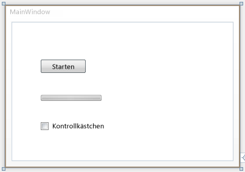
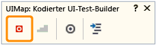
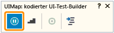

# <a name="walkthrough-create-edit-and-maintain-a-coded-ui-test"></a>Exemplarische Vorgehensweise: Erstellen, Bearbeiten und Verwalten eines Tests der programmierten UI

In dieser exemplarischen Vorgehensweise erfahren Sie, wie Sie einen Test der programmierten UI für eine WPF-App (Windows Presentation Foundation) erstellen, bearbeiten und verwalten. Die exemplarische Vorgehensweise umfasst Lösungen zum Korrigieren von Tests, die aufgrund verschiedener Probleme mit den Zeitabläufen und dem Refactoring von Steuerelementen nicht mehr funktionieren.

[!INCLUDE [coded-ui-test-deprecation](includes/coded-ui-test-deprecation.md)]

## <a name="create-a-wpf-app"></a>Erstellen einer WPF-App

1.  Zeigen Sie im Menü **Datei** auf **Neu**, und klicken Sie dann auf **Projekt**.

     Das Dialogfeld **Neues Projekt** wird angezeigt.

2.  Erweitern Sie im Bereich **Installiert** den Eintrag **Visual C#**, und wählen Sie **Windows Desktop** aus.

3.  Stellen Sie sicher, dass die Dropdownliste für das Zielframework über dem mittleren Bereich auf **.NET Framework 4.5** festgelegt ist.

4.  Wählen Sie im mittleren Bereich die Vorlage **WPF-Anwendung** aus.

5.  Geben Sie im Textfeld **Name** den Namen **SimpleWPFApp** ein.

6.  Wählen Sie einen Ordner zum Speichern des Projekts aus. Geben Sie im Textfeld **Speicherort** den Namen des Ordners ein.

7.  Klicken Sie auf **OK**.

     Der **WPF-Designer für Visual Studio** wird geöffnet und zeigt das MainWindow-Element des Projekts an.

8.  Öffnen Sie die Toolbox, sofern sie nicht geöffnet ist. Wählen Sie das Menü **Ansicht** und dann **Toolbox** aus.

9. Ziehen Sie unter dem Abschnitt **Alle WPF-Steuerelemente** ein **Button**-, ein **CheckBox**- und ein **ProgressBar**-Steuerelement auf das MainWindow-Element in der Entwurfsoberfläche.

10. Wählen Sie das **Schaltflächen**-Steuerelement aus. Ändern Sie im Fenster **Eigenschaften** den Wert für die Eigenschaft **Name** von \<Ohne Name> in „button1“. Ändern Sie den Wert für die Eigenschaft **Content** von „Button“ in „Start“.

11. Wählen Sie das **ProgressBar**-Steuerelement aus. Ändern Sie im Fenster **Eigenschaften** den Wert für die Eigenschaft **Name** von \<Ohne Name> in „progressBar1“. Ändern Sie dann den Wert für die Eigenschaft **Maximum** von **100** auf **10000**.

12. Wählen Sie das **CheckBox**-Steuerelement aus. Ändern Sie im Fenster **Eigenschaften** den Wert für die Eigenschaft **Name** von \<Ohne Name> in „checkBox1“, und löschen Sie die Eigenschaft **IsEnabled**.

     

13. Doppelklicken Sie auf das Schaltflächen-Steuerelement, um einen Click-Ereignishandler hinzuzufügen.

     Die Datei *MainWindow.xmal.cs* wird im Code-Editor angezeigt, und der Cursor ist in der neuen button1_Click-Methode positioniert.

14. Fügen Sie am oberen Rand der MainWindow-Klasse einen Delegaten hinzu. Der Delegat wird für die Statusanzeige verwendet. Fügen Sie den Delegaten mit dem folgenden Code hinzu:

    ```csharp
    public partial class MainWindow : Window
    {
            private delegate void ProgressBarDelegate(System.Windows.DependencyProperty dp, Object value);

        public MainWindow()
        {

            InitializeComponent();
        }
    ```

15. Fügen Sie folgenden Code in die button1_Click-Methode ein:

    ```csharp
    private void button1_Click(object sender, RoutedEventArgs e)
    {
        double progress = 0;

        ProgressBarDelegate updatePbDelegate =
            new ProgressBarDelegate(progressBar1.SetValue);

        do
        {
            progress ++;

            Dispatcher.Invoke(updatePbDelegate,
                System.Windows.Threading.DispatcherPriority.Background,
                new object[] { ProgressBar.ValueProperty, progress });
            progressBar1.Value = progress;
        }
        while (progressBar1.Value != progressBar1.Maximum);

        checkBox1.IsEnabled = true;
    }
    ```

16. Speichern Sie die Datei.

### <a name="run-the-wpf-app"></a>Ausführen der WPF-App

1.  Wählen Sie im Menü **Debuggen** die Option **Debuggen starten** aus, oder drücken Sie **F5**.

2.  Beachten Sie, dass das Steuerelement Kontrollkästchen deaktiviert ist. Wählen Sie **Start** aus.

     Die Statusanzeige sollte innerhalb einiger Sekunden vollständig abgeschlossen sein.

3.  Sie können jetzt das Steuerelement Kontrollkästchen auswählen.

4.  Schließen Sie "SimpleWPFApp".

## <a name="create-a-shortcut-to-the-wpf-app"></a>Erstellen einer Verknüpfung zur WPF-App

1.  Suchen Sie die zuvor erstellte Anwendung "SimpleWPFApp".

2.  Erstellen Sie eine Desktopverknüpfung zur SimpleWPFApp-Anwendung. Klicken Sie mit der rechten Maustaste auf *SimpleWPFApp.exe*, und wählen Sie **Kopieren** aus. Klicken Sie auf dem Desktop mit der rechten Maustaste, und wählen Sie die Option **Verknüpfung einfügen** aus.

    > [!TIP]
    > Über eine Verknüpfung zur Anwendung können Tests der programmierten UI für die Anwendung leichter hinzugefügt und geändert werden, da die Anwendung schnell gestartet werden kann.

## <a name="create-a-coded-ui-test-for-simplewpfapp"></a>Erstellen und Ausführen eines Tests der programmierten UI für „SimpleWPFApp“

1. Klicken Sie im **Projektmappen-Explorer** mit der rechten Maustaste auf die Projektmappe, und wählen Sie **Hinzufügen** und anschließend **Neues Projekt** aus.

     Das Dialogfeld **Neues Projekt hinzufügen** wird angezeigt.

1. Erweitern Sie im Bereich **Installiert** den Eintrag **Visual C#**, und wählen Sie **Test** aus.

1. Wählen Sie im mittleren Bereich die Vorlage **Testprojekt der programmierten UI** aus.

   > [!NOTE]
   > Wenn Ihnen die Vorlage **Test der programmierten UI** nicht angezeigt wird, müssen Sie die Komponente [Test der programmierten UI](../test/use-ui-automation-to-test-your-code.md#install-the-coded-ui-test-component) installieren.

1. Klicken Sie auf **OK**.

     Das neue Testprojekt der programmierten UI namens **CodedUITestProject1** wird zur Projektmappe hinzugefügt.

     Das Dialogfeld **Code für den Test der programmierten UI generieren** wird angezeigt.

1. Wählen Sie die Option **Aktionen aufzeichnen, UI-Zuordnung bearbeiten oder Assertionen hinzufügen** aus, und klicken Sie auf **OK**.

     Das Dialogfeld **UIMap - Coded UI Test Builder** (UIMap: Generator für Tests der programmierten UI) wird angezeigt, und das Visual Studio-Fenster wird minimiert.

     Weitere Informationen zu den Optionen im Dialogfeld finden Sie unter [Erstellen von Tests der programmierten UI](../test/use-ui-automation-to-test-your-code.md).

1. Klicken Sie im Dialogfeld **UIMap - Coded UI Test Builder** (UIMap: Generator für Tests der programmierten UI) auf **Aufzeichnung starten**.

     

     Sie können die Aufzeichnung bei Bedarf anhalten, etwa wenn Sie eine eingehende E-Mail lesen möchten.

     

    > [!WARNING]
    > Alle auf dem Desktop ausgeführten Aktionen werden aufgezeichnet. Halten Sie die Aufzeichnung an, wenn Sie Aktionen ausführen, bei denen sensible Daten in die Aufzeichnung gelangen könnten.

1. Starten Sie SimpleWPFApp mithilfe der Desktopverknüpfung.

     Beachten Sie wie bereits zuvor, dass das Steuerelement Kontrollkästchen deaktiviert ist.

1. Klicken Sie in SimpleWPFApp auf **Start**.

     Die Statusanzeige sollte innerhalb einiger Sekunden vollständig abgeschlossen sein.

1. Aktivieren Sie das Kontrollkästchen-Steuerelement, das jetzt aktiviert ist.

1. Schließen Sie die SimpleWPFApp-Anwendung.

1. Klicken Sie im Dialogfeld **UIMap - Coded UI Test Builder** (UIMap: Generator für Tests der programmierten UI) auf **Code generieren**.

1. Geben Sie im Feld **Methodenname** den Namen **SimpleAppTest** ein, und klicken Sie auf **Hinzufügen und generieren**. Der Test der programmierten UI wird nach wenigen Sekunden angezeigt und der Projektmappe hinzugefügt.

1. Schließen Sie das Dialogfeld **UIMap - Coded UI Test Builder** (UIMap: Generator für Tests der programmierten UI).

     Die Datei *CodedUITest1.cs* wird im Code-Editor geöffnet.

1. Speichern Sie das Projekt.

### <a name="run-the-test"></a>Ausführen des Tests

1. Wählen Sie im Menü **Test** **Windows** aus, und klicken Sie dann auf **Test-Explorer**.

2. Wählen Sie im Menü **Erstellen** die Option **Projektmappe erstellen**aus.

3. Finden Sie in der Datei *CodedUITest1.cs* die Methode **CodedUITestMethod**, klicken Sie mit der rechten Maustaste, und wählen Sie **Test ausführen** aus, oder führen Sie den Test mit dem **Test-Explorer** aus.

   Während der Test der programmierten UI ausgeführt wird, wird „SimpleWPFApp“ angezeigt. Die Schritte, die Sie in der vorherigen Prozedur ausgeführt haben, werden ausgeführt. Beim Versuch, das Kontrollkästchen für das Kontrollkästchen-Steuerelement zu aktivieren, wird jedoch im Fenster **Testergebnisse** angezeigt, dass der Test fehlgeschlagen ist. Dies liegt daran, dass beim Test versucht wird, das Kontrollkästchen zu aktivieren, obwohl das Kontrollkästchen-Steuerelement deaktiviert ist, bis die Statusanzeige 100 Prozent abgeschlossen ist. Sie können dieses und ähnliche Probleme mit den `UITestControl.WaitForControlXXX()`-Methoden korrigieren, die für Tests der codierten UI verfügbar sind. Bei der nächsten Prozedur wird veranschaulicht, wie Sie das Problem, das bei diesem Test zu einem Fehler geführt hat, mit der `WaitForControlEnabled()`-Methode korrigieren können. Weitere Informationen finden Sie unter [Festlegen, dass bei Wiedergabe von Tests der programmierten UI auf bestimmte Ereignisse gewartet wird](../test/making-coded-ui-tests-wait-for-specific-events-during-playback.md).

## <a name="edit-and-rerun-the-coded-ui-test"></a>Bearbeiten und erneutes Ausführen des Tests der programmierten UI

1.  Wählen Sie im **Test-Explorer** den fehlgeschlagenen Test aus, und klicken Sie im Abschnitt **StackTrace** auf den ersten Link zu **UIMap.SimpleAppTest()**.

2.  Die Datei *UIMap.Designer.cs* wird geöffnet. Die fehlerhafte Stelle wird im Code hervorgehoben:

    ```csharp
    // Select 'CheckBox' check box
    uICheckBoxCheckBox.Checked = this.SimpleAppTestParams.UICheckBoxCheckBoxChecked;
    ```

3.  Um dieses Problem zu korrigieren, können Sie mithilfe der `WaitForControlEnabled()`-Methode festlegen, dass beim Test der codierten UI gewartet werden soll, bis das CheckBox-Steuerelement aktiviert ist, bevor mit dieser Zeile fortgefahren wird.

    > [!WARNING]
    > Ändern Sie die Datei *UIMap.Designer.cs* nicht. Alle vorgenommenen Codeänderungen werden jedes Mal überschrieben, wenn Sie Code mithilfe des Dialogfelds **UIMap - Coded UI Test Builder** (UIMap: Generator für Tests der programmierten UI) generieren. Wenn Sie eine aufgezeichnete Methode ändern müssen, kopieren Sie sie in die Datei *UIMap.cs*, und benennen Sie sie um. Die Datei *UIMap.cs* kann verwendet werden, um Methoden und Eigenschaften in der Datei *UIMapDesigner.cs* zu überschreiben. Sie müssen den Verweis auf die ursprüngliche Methode in der Datei *CodedUITest.cs* entfernen und ihn durch den umbenannten Methodennamen ersetzen.

4.  Klicken Sie im **Projektmappen-Explorer** im Testprojekt der programmierten UI auf *UIMap.uitest*.

5.  Öffnen Sie das Kontextmenü *UIMap.uitest*, und wählen Sie **Öffnen** aus.

     Der Test der codierten UI wird im Editor für den Test der codierten UI angezeigt. Sie können nun den Test der programmierten UI anzeigen und bearbeiten.

6.  Wählen Sie im Bereich **UI-Aktion** die Testmethode (SimpleAppTest) aus, die Sie in die Datei *UIMap.cs* oder *UIMap.vb* verschieben möchten. Das Verschieben der Methode in eine andere Datei ermöglicht, dass benutzerdefinierter Code hinzufügt wird, der beim erneuten Kompilieren des Testcodes nicht überschrieben wird.

7.  Klicken Sie auf der Symbolleiste des **Editors für den Test der programmierten UI** auf die Schaltfläche **Code verschieben**.

8.  Ein Microsoft Visual Studio-Dialogfeld wird angezeigt. Sie werden darauf hingewiesen, dass die Methode aus der Datei *UIMap.uitest* in die Datei *UIMap.cs* verschoben wird, und dass die Methode mit dem Editor für Tests der programmierten UI nicht mehr bearbeitet werden kann. Klicken Sie auf **Ja**.

     Die Testmethode wird aus der Datei *UIMap.uitest* entfernt und nicht mehr im Bereich der UI-Aktionen angezeigt. Öffnen Sie zum Bearbeiten der verschobenen Testdatei die Datei *UIMap.cs* über den **Projektmappen-Explorer**.

9. Klicken Sie auf der Visual Studio-Symbolleiste auf **Speichern**.

     Die Updates der Testmethode werden in der Datei *UIMap.Designer* gespeichert.

    > [!WARNING]
    > Nach dem Verschieben der Methode kann sie mit dem Editor für Tests der codierten UI nicht mehr bearbeitet werden. Sie müssen den benutzerdefinierten Code hinzufügen und ihn mit dem Code-Editor verwalten.

10. Benennen Sie die Methode von `SimpleAppTest()` in `ModifiedSimpleAppTest()` um.

11. Fügen Sie der Datei die folgende using-Anweisung hinzu:

    ```csharp
    using Microsoft.VisualStudio.TestTools.UITesting.WpfControls;
    ```

12. Fügen Sie die folgende `WaitForControlEnabled()`-Methode vor der Codezeile ein, die zuvor als Fehlerquelle ermittelt wurde:

    ```csharp
    uICheckBoxCheckBox.WaitForControlEnabled();

    // Select 'CheckBox' check box
    uICheckBoxCheckBox.Checked = this.SimpleAppTestParams.UICheckBoxCheckBoxChecked;
    ```

13. Suchen Sie in der Datei *CodedUITest1.cs* die Methode **CodedUITestMethod**, und kommentieren Sie den Verweis auf die ursprüngliche Methode „SimpleAppTest()“ aus, oder benennen Sie ihn um. Ersetzen Sie ihn dann durch die neue Methode „ModifiedSimpleAppTest()“:

    ```csharp
    [TestMethod]
            public void CodedUITestMethod1()
            {
                // To generate code for this test, select "Generate Code for Coded UI Test" from the shortcut menu and select one of the menu items.
                // For more information on generated code, see http://go.microsoft.com/fwlink/?LinkId=179463
                //this.UIMap.SimpleAppTest();
                this.UIMap.ModifiedSimpleAppTest();
            }
    ```

14. Wählen Sie im Menü **Erstellen** die Option **Projektmappe erstellen**.

15. Klicken Sie mit der rechten Maustaste auf die **CodedUITestMethod**-Methode, und wählen Sie **Tests ausführen** aus.

16. Dieses Mal führt der Test der programmierten UI alle Schritte des Tests erfolgreich durch, und im Fenster **Test-Explorer** wird **Erfolgreich** angezeigt.

## <a name="refactor-a-control-in-simplewpfapp"></a>Umgestalten eines Steuerelements in „SimpleWPFApp“

1.  Klicken Sie in der Datei *MainWindow.xaml* im Designer auf das Schaltflächen-Steuerelement.

2.  Ändern Sie oben im Fenster **Eigenschaften** den Wert der Eigenschaft **Name** von **button1** in **buttonA**.

3.  Wählen Sie im Menü **Erstellen** die Option **Projektmappe erstellen**.

4.  Führen Sie **CodedUITestMethod1** in **Test-Explorer** aus.

     Der Test schlägt fehl, da der Test der programmierten UI das Schaltflächen-Steuerelement, das ursprünglich im UIMap als „button1“ zugeordnet wurde, nicht finden kann. Auf diese Weise kann sich die Umgestaltung auf Tests der programmierten UI auswirken.

5.  Klicken Sie im **Test-Explorer** im Abschnitt **StackTrace** auf den ersten Link zu **UIMpa.ModifiedSimpleAppTest()**.

     Die Datei *UIMap.cs* wird geöffnet. Die fehlerhafte Stelle wird im Code hervorgehoben:

    ```csharp
    // Click 'Start' button
    Mouse.Click(uIStartButton, new Point(27, 10));
    ```

     Beachten Sie, dass in der Codezeile dieser Prozedur zuvor `UiStartButton` verwendet wurde. Dies war der UIMap-Name vor der Umgestaltung.

     Zur Behebung des Problems können Sie dem UIMap das umgestaltete Steuerelement mit dem **Generator für Tests der programmierten UI** hinzufügen. Sie können den Code des Tests wie in der nächsten Prozedur veranschaulicht aktualisieren.

## <a name="map-refactored-control-rerun-the-test"></a>Zuordnen des umgestalteten Steuerelements und erneutes Ausführen des Tests

1.  Klicken Sie in der Datei *CodedUITest1.cs* in der Methode **CodedUITestMethod1()** mit der rechten Maustaste, wählen Sie **Code für den Test der programmierten UI generieren** aus, und klicken Sie dann auf **Use Coded UI Test Builder** (Generator für Tests der programmierten UI verwenden).

     Das Dialogfeld **UIMap - Coded UI Test Builder** (UIMap: Generator für Tests der programmierten UI) wird angezeigt.

2.  Führen Sie mithilfe der zuvor erstellten Desktopverknüpfung die Anwendung "SimpleWPFApp" aus, die Sie ebenfalls zuvor erstellt haben.

3.  Ziehen Sie im Dialogfeld **UIMap - Coded UI Test Builder** (UIMap: Generator für Tests der programmierten UI) das Fadenkreuztool auf die Schaltfläche **Start** von „SimpleWPFApp“.

     Die Schaltfläche **Start** wird mit einem blauen Rahmen versehen. Der **Generator für Tests der programmierten UI** benötigt einige Sekunden, um die Daten für das ausgewählte Steuerelement zu verarbeiten. Dann werden die Steuerelementeigenschaften angezeigt. Beachten Sie, dass **buttonA** der Wert von **AutomationUId** ist.

4.  Klicken Sie in den Eigenschaften für das Steuerelement auf den Pfeil in der linken oberen Ecke, um die UI-Steuerelementzuordnung zu erweitern. Beachten Sie, dass **UIStartButton1** ausgewählt ist.

5.  Klicken Sie auf der Symbolleiste auf **Steuerelement zu UI-Steuerelementzuordnung hinzufügen**.

     Durch den Status am unteren Rand des Fensters wird die Aktion bestätigt, indem **Das ausgewählte Steuerelement wurde der UI-Steuerelementzuordnung hinzugefügt** angezeigt wird.

6.  Klicken Sie im Dialogfeld **UIMap - Coded UI Test Builder** (UIMap: Generator für Tests der programmierten UI) auf **Code generieren**.

     Das Dialogfeld **Coded UI Test Builder - Generate Code** (Generator für Tests der programmierten UI – Code generieren) wird mit einem Hinweis angezeigt, dass keine neue Methode erforderlich ist und dass Code nur für die Änderungen an der UI-Steuerelementzuordnung generiert wird.

7.  Wählen Sie **Generieren** aus.

8.  Schließen Sie "SimpleWPFApp".

9. Schließen Sie das Dialogfeld **UIMap - Coded UI Test Builder** (UIMap: Generator für Tests der programmierten UI).

10. Öffnen Sie im **Projektmappen-Explorer** die Datei *UIMap.Designer.cs*.

11. Suchen Sie in der Datei *UIMap.Designer.cs* die Eigenschaft **UIStartButton1**. Beachten Sie, dass `SearchProperties` auf `"buttonA"` festgelegt ist:

    ```csharp
    public WpfButton UIStartButton1
            {
                get
                {
                    if ((this.mUIStartButton1 == null))
                    {
                        this.mUIStartButton1 = new WpfButton(this);
                        #region Search Criteria
                        this.mUIStartButton1.SearchProperties[WpfButton.PropertyNames.AutomationId] = "buttonA";
                        this.mUIStartButton1.WindowTitles.Add("MainWindow");
                        #endregion
                    }
                    return this.mUIStartButton1;
                }
            }
    ```

     Jetzt können Sie den Test der codierten UI ändern, um das neu zugeordnete Steuerelement zu verwenden. Wie in der vorherigen Prozedur angemerkt wurde, können Sie Methoden oder Eigenschaften im Test der programmierten UI nur in der Datei *UIMap.cs* überschreiben.

12. Fügen Sie in der Datei *UIMap.cs* einen Konstruktor hinzu, und geben Sie die `SearchProperties`-Eigenschaft der `UIStartButton`-Eigenschaft an, um die `AutomationID`-Eigenschaft mit dem Wert `"buttonA":` zu verwenden.

    ```csharp
    public UIMap()
            {
                this.UIMainWindowWindow.UIStartButton.SearchProperties[WpfButton.PropertyNames.AutomationId] = "buttonA";
            }
    ```

13. Wählen Sie im Menü **Erstellen** die Option **Projektmappe erstellen**.

14. Führen Sie **CodedUITestMethod1** in **Test-Explorer** aus.

     Dieses Mal führt der Test der programmierten UI alle Schritte im Test erfolgreich aus. Im Fenster **Testergebnisse** wird der Status **Erfolgreich** angezeigt.

## <a name="videos"></a>Videos

 [Erste Schritte mit Tests der programmierten UI](https://onedrive.live.com/?id=2DB0E1EFE1C1D3B8%21110&cid=2DB0E1EFE1C1D3B8)

## <a name="faq"></a>FAQ

[Tests der programmierten UI – FAQ](https://social.msdn.microsoft.com/Forums/vsautotest/3a74dd2c-cef8-4923-abbf-7a91f489e6c4/faqs)

## <a name="see-also"></a>Siehe auch

- [Verwenden der Benutzeroberflächenautomatisierung zum Testen des Codes](../test/use-ui-automation-to-test-your-code.md)
- [Supported Configurations and Platforms for Coded UI Tests and Action Recordings (Unterstützte Konfigurationen und Plattformen für Tests der programmierten UI und Aktionsaufzeichnungen)](../test/supported-configurations-and-platforms-for-coded-ui-tests-and-action-recordings.md)
- [Bearbeiten von Tests der programmierten UI mithilfe des Editors für Tests der programmierten UI](../test/editing-coded-ui-tests-using-the-coded-ui-test-editor.md)
