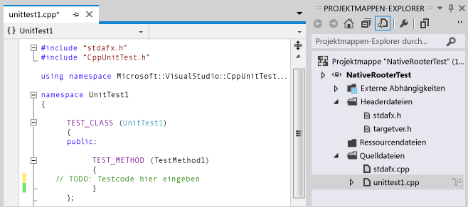
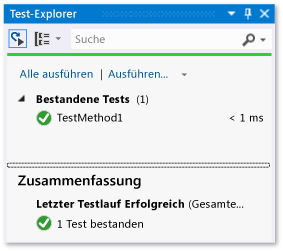
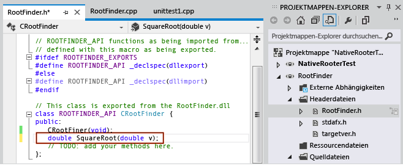
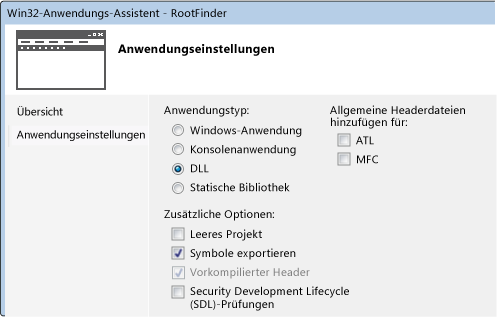
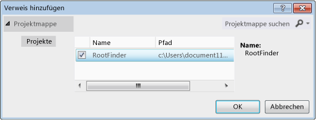
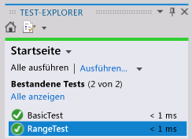

# <a name="how-to-write-unit-tests-for-c-dlls"></a>Vorgehensweise: Schreiben von Komponententests für C++-DLLs

In dieser exemplarischen Vorgehensweise wird beschrieben, wie Sie eine native C++-DLL mithilfe der Test-First-Methode entwickeln können. Die grundlegenden Schritte werden im Folgenden beschrieben:

1. [Erstellen Sie eines nativen Testprojekts](#create_test_project). Das Testprojekt befindet sich in derselben Projektmappe wie das DLL-Projekt.

2. [Erstellen eines DLL-Projekts](#create_dll_project) In dieser exemplarischen Vorgehensweise wird eine neue DLL erstellt, die Vorgehensweise für das Testen einer vorhandenen DLL ist aber ähnlich.

3. [Machen Sie die DLL-Funktionen für die Tests sichtbar](#make_functions_visible).

4. [Erweitern Sie iterativ die Tests](#iterate). Es wird empfohlen, nach dem Prinzip „Rot-Grün-Überarbeitung“ (Red-Green-Refactor) vorzugehen, bei dem die Entwicklung des Codes durch Tests geleitet wird.

5. [Debuggen Sie Tests, bei denen Fehler aufgetreten sind](#debug). Sie können die Tests im Debugmodus ausführen.

6. [Nehmen Sie Überarbeitungen vor, ohne die Tests zu verändern](#refactor). „Überarbeiten“ bedeutet Verbessern der Struktur des Codes, ohne das externe Verhalten zu ändern. Damit wird zur Verbesserung der Leistung, Erweiterbarkeit oder Lesbarkeit des Codes beigetragen. Da es nicht die Absicht ist, das Verhalten zu ändern, ändern Sie die Tests bei der Überarbeitung des Codes nicht. Mit den Tests können Sie sicherstellen, dass Sie keine Fehler einbauen, während Sie den Code umgestalten.

7. [Testabdeckung](using-code-coverage-to-determine-how-much-code-is-being-tested.md). Komponententests sind hilfreicher, wenn sie mehr vom Code ausführen. Sie können ermitteln, welche Teile des Codes von den Tests verwendet wurden.

8. [Isolieren Sie Einheiten von externen Ressourcen](using-stubs-to-isolate-parts-of-your-application-from-each-other-for-unit-testing.md). In der Regel ist eine DLL abhängig von anderen Komponenten des Systems, das Sie entwickeln, wie z. B. anderen DLLs, Datenbanken, oder Remotesubsystemen. Es ist hilfreich, jede Einheit isoliert von seinen Abhängigkeiten zu testen. Externe Komponenten können bewirken, dass Tests langsamer ausgeführt werden. Während der Entwicklung sind die anderen Komponenten möglicherweise noch nicht vollständig.

## <a name="create-a-native-unit-test-project"></a><a name="create_test_project"></a> Ein natives Komponententestprojekt erstellen

1. Wählen Sie im Menü **Datei** die Optionsfolge **Neu** > **Projekt**aus.

     **Visual Studio 2017 und früher**: Erweitern Sie **Installiert** > **Vorlagen** > **Visual C++**  > **Test**.
     **Visual Studio 2019**: Legen Sie **Sprache** auf C++ fest, und geben Sie „test“ in das Suchfeld ein.

     Klicken Sie entweder auf die Vorlage **Natives Komponententestprojekt** oder auf das von Ihnen bevorzugte installierte Framework. Wenn Sie eine andere Vorlage wie Google Test oder Boost.Test auswählen, bleiben die Grundprinzipien erhalten, obwohl bei einigen Details Unterschiede auftreten können.

     In dieser exemplarischen Vorgehensweise wird das Testprojekt `NativeRooterTest`benannt.

2. Überprüfen Sie im neuen Projekt **unittest1.cpp**.

     

     Beachten Sie Folgendes:

    - Jeder Test wird definiert, indem `TEST_METHOD(YourTestName){...}`verwendet wird.

         Sie müssen keine herkömmliche Funktionssignatur schreiben. Die Signatur wird durch das Makro TEST_METHOD erstellt. Das Makro generiert eine Instanzfunktion ohne Rückgabe. Es generiert außerdem eine statische Funktion, die Informationen zur Testmethode zurückgibt. Diese Informationen ermöglichen dem Test-Explorer, die Methode zu finden.

    - Testmethoden werden in Klassen zusammengefasst, indem `TEST_CLASS(YourClassName){...}`verwendet wird.

         Wenn die Tests ausgeführt werden, wird eine Instanz jeder Testklasse erstellt. Die Testmethoden werden in einer nicht vorgegebenen Reihenfolge aufgerufen. Sie können spezielle Methoden definieren, die vor und nach jedem Modul, jeder Klasse oder Methode aufgerufen werden.

3. Stellen Sie sicher, dass die Tests im Test-Explorer ausgeführt werden:

    1. Fügen Sie den Testcode ein:

        ```cpp
        TEST_METHOD(TestMethod1)
        {
            Assert::AreEqual(1,1);
        }
        ```

         Beachten Sie, dass die `Assert` -Klasse mehrere statische Methoden zur Verfügung stellt, die Sie verwenden können, um Ergebnisse in den Testmethoden zu überprüfen.

    2. Klicken Sie im Menü **Test** auf **Ausführen** >  **Alle Tests**.

         Der Test wird erstellt und ausgeführt.

         Der **Test-Explorer** wird angezeigt.

         Der Test wird unter **Bestandene Tests**angezeigt.

         

## <a name="create-a-dll-project"></a><a name="create_dll_project"></a> Erstellen eines DLL-Projekts

::: moniker range="vs-2019"

Die folgenden Schritte zeigen, wie Sie ein DLL-Projekt in Visual Studio-2019 erstellen.

1. Erstellen Sie ein C++-Projekt mithilfe des **Windows-Desktopassistenten**: Klicken Sie im **Projektmappen-Explorer** mit der rechten Maustaste auf den Namen der Projektmappe, und wählen Sie anschließend **Hinzufügen** > **Neues Projekt** aus. Legen Sie die **Sprache** auf C++ fest, und geben Sie dann im Suchfeld „windows“ ein. Wählen Sie in der Ergebnisliste **Windows-Desktopassistent** aus.

     In dieser exemplarischen Vorgehensweise wird das Projekt `RootFinder`benannt.

2. Drücken Sie **Erstellen**. Wählen Sie im nächsten Dialogfeld unter **Anwendungstyp** **Dynamic Link Library (dll)** aus, und aktivieren Sie außerdem **Symbole exportieren**.

     Die Option **Symbole exportieren** generiert ein komfortables Makro, das Sie verwenden können, um exportierte Methoden zu deklarieren.

     

3. Deklarieren Sie eine exportierte Funktion in der Prinzipaldatei *.h*:

     

     Der Deklarator `__declspec(dllexport)` bewirkt, dass die öffentlichen und die geschützten Member der Klasse außerhalb der DLL sichtbar sind. Weitere Informationen finden Sie unter [Using dllimport and dllexport in C++ Classes](/cpp/cpp/using-dllimport-and-dllexport-in-cpp-classes).

4. Fügen Sie in der Prinzipaldatei *CPP* einen minimalen Text für die Funktion hinzu:

    ```cpp
        // Find the square root of a number.
        double CRootFinder::SquareRoot(double v)
        {
            return 0.0;
        }
    ```

::: moniker-end

::: moniker range="vs-2017"

Die folgenden Schritte zeigen, wie Sie ein DLL-Projekt in Visual Studio-2017 erstellen.

1. Erstellen Sie ein C++-Projekt mithilfe der Vorlage **Win32-Projekt**.

     In dieser exemplarischen Vorgehensweise wird das Projekt `RootFinder`benannt.

2. Wählen Sie **DLL** und **Symbole exportieren** im Win32-Anwendungs-Assistenten aus.

     Die Option **Symbole exportieren** generiert ein komfortables Makro, das Sie verwenden können, um exportierte Methoden zu deklarieren.

     

3. Deklarieren Sie eine exportierte Funktion in der Prinzipaldatei *.h*:

     

     Der Deklarator `__declspec(dllexport)` bewirkt, dass die öffentlichen und die geschützten Member der Klasse außerhalb der DLL sichtbar sind. Weitere Informationen finden Sie unter [Using dllimport and dllexport in C++ Classes](/cpp/cpp/using-dllimport-and-dllexport-in-cpp-classes).

4. Fügen Sie in der Prinzipaldatei *CPP* einen minimalen Text für die Funktion hinzu:

    ```cpp
        // Find the square root of a number.
        double CRootFinder::SquareRoot(double v)
        {
            return 0.0;
        }
    ```

::: moniker-end

## <a name="couple-the-test-project-to-the-dll-project"></a><a name="make_functions_visible"></a> Verknüpfen des Testprojekts mit dem DLL-Projekt

1. Fügen Sie das DLL-Projekt den Projektverweisen des Testprojekts hinzu:

   1. Klicken Sie im **Projektmappen-Explorer** zunächst mit der rechten Maustaste auf den Knoten für das Testprojekt, und wählen Sie anschließend **Hinzufügen** > **Verweis** aus.

   2. Wählen Sie im Dialogfeld **Verweis hinzufügen** das DLL-Projekt aus, und wählen Sie **Hinzufügen**.

        

2. Schließen Sie in die *CPP*-Prinzipaldatei für Komponententests die *.h*-Datei des DLL-Codes ein:

   ```cpp
   #include "..\RootFinder\RootFinder.h"
   ```

3. Fügen Sie einen grundlegenden Test hinzu, der die exportierte Funktion verwendet:

   ```cpp
   TEST_METHOD(BasicTest)
   {
      CRootFinder rooter;
      Assert::AreEqual(
         // Expected value:
         0.0,
         // Actual value:
         rooter.SquareRoot(0.0),
         // Tolerance:
         0.01,
        // Message:
        L"Basic test failed",
        // Line number - used if there is no PDB file:
        LINE_INFO());
   }
   ```

4. Erstellen Sie die Projektmappe.

    Der neue Test wird im **Test-Explorer** angezeigt.

5. Wählen Sie im **Test-Explorer** die Option **Alle ausführen** aus.

    

   Sie haben den Test und die Codeprojekte eingerichtet und überprüft, dass Sie Tests ausführen können, die Funktionen im Codeprojekt ausführen. Jetzt können Sie beginnen, echte Tests und Code zu schreiben.

## <a name="iteratively-augment-the-tests-and-make-them-pass"></a><a name="iterate"></a> Die Tests iterativ steigern und erfolgreich abschließen

1. Fügen Sie einen neuen Test hinzu:

    ```cpp
    TEST_METHOD(RangeTest)
    {
      CRootFinder rooter;
      for (double v = 1e-6; v < 1e6; v = v * 3.2)
      {
        double actual = rooter.SquareRoot(v*v);
        Assert::AreEqual(v, actual, v/1000);
      }
    }
    ```

    > [!TIP]
    > Es wird empfohlen, keine Tests zu ändern, die erfolgreich abgeschlossen wurden. Fügen Sie stattdessen einen neuen Test hinzu, aktualisieren Sie den Code, damit der Test erfolgreich ist, und fügen Sie dann einen weiteren Test hinzu, usw.
    >
    > Wenn Benutzer ihre Anforderungen ändern, deaktivieren Sie die Tests, die nicht mehr richtig sind. Schreiben Sie neue Tests und führen Sie diese jeweils nacheinander auf dieselbe inkrementelle Weise durch.

2. Erstellen Sie erst die Projektmappe, und klicken Sie dann im **Test-Explorer** auf **Alle ausführen**.

     Beim neuen Test tritt ein Fehler auf.

     

    > [!TIP]
    > Stellen Sie bei jedem Test unmittelbar nachdem Sie ihn geschrieben haben sicher, dass ein Fehler bei seiner Ausführung auftritt. Dadurch können Sie vermeiden, dass Sie einen Test schreiben, bei dessen Ausführung nie ein Fehler auftritt.

3. Erweitern Sie Ihren DLL-Code, damit der neue Test erfolgreich durchgeführt werden kann:

    ```cpp
    #include <math.h>
    ...
    double CRootFinder::SquareRoot(double v)
    {
      double result = v;
      double diff = v;
      while (diff > result/1000)
      {
        double oldResult = result;
        result = result - (result*result - v)/(2*result);
        diff = abs (oldResult - result);
      }
      return result;
    }
    ```

4. Erstellen Sie die Projektmappe, und wählen Sie dann im **Test-Explorer** die Option **Alle ausführen** aus.

     Beide Tests sind erfolgreich.

     

    > [!TIP]
    > Entwickeln Sie Code, indem Sie währenddessen Tests hinzufügen. Stellen Sie sicher, dass alle Tests nach jeder Iteration erfolgreich sind.

## <a name="debug-a-failing-test"></a><a name="debug"></a> Einen nicht bestandenen Test debuggen

1. Fügen Sie einen anderen Test hinzu:

    ```cpp
    #include <stdexcept>
    ...
    // Verify that negative inputs throw an exception.
    TEST_METHOD(NegativeRangeTest)
    {
      wchar_t message[200];
      CRootFinder rooter;
      for (double v = -0.1; v > -3.0; v = v - 0.5)
      {
        try
        {
          // Should raise an exception:
          double result = rooter.SquareRoot(v);

          _swprintf(message, L"No exception for input %g", v);
          Assert::Fail(message, LINE_INFO());
        }
        catch (std::out_of_range ex)
        {
          continue; // Correct exception.
        }
        catch (...)
        {
          _swprintf(message, L"Incorrect exception for %g", v);
          Assert::Fail(message, LINE_INFO());
        }
      }
    }
    ```

2. Erstellen Sie die Projektmappe, und wählen Sie **Alle ausführen**.

3. Öffnen Sie den Test, bei dessen Ausführung ein Fehler aufgetreten ist, oder doppelklicken Sie auf diesen.

     Die Assertation, bei der ein Fehler aufgetreten ist, wird gekennzeichnet. Die Fehlermeldung wird im Detailbereich vom **Test-Explorer** angezeigt.

     

4. Um zu sehen, warum der Test nicht erfolgreich war, führen Sie schrittweise die Funktion aus:

    1. Legen Sie einen Haltepunkt am Anfang der SquareRoot-Funktion fest.

    2. Wählen Sie im Kontextmenü des nicht erfolgreichen Tests **Ausgewählte Tests debuggen**.

         Wenn die Ausführung am Haltepunkt angehalten wird, führen Sie den Code schrittweise aus.

5. Fügen Sie Code in der Funktion ein, die Sie entwickeln:

    ```cpp

    #include <stdexcept>
    ...
    double CRootFinder::SquareRoot(double v)
    {
        // Validate parameter:
        if (v < 0.0)
        {
          throw std::out_of_range("Can't do square roots of negatives");
        }

    ```

6. Alle Tests sind nun erfolgreich.

   

::: moniker range="vs-2017"

> [!TIP]
> Wenn einzelne Tests keine Abhängigkeiten haben, die verhindern, dass sie in beliebiger Reihenfolge ausgeführt werden können, sollten Sie die parallele Testausführung über die Umschaltfläche  auf der Symbolleiste aktivieren. Dadurch lässt sich die Zeit deutlich verkürzen, die zum Ausführen aller Tests erforderlich ist.

::: moniker-end

::: moniker range=">=vs-2019"

> [!TIP]
> Wenn einzelne Tests keine Abhängigkeiten aufweisen, die verhindern, dass sie in beliebiger Reihenfolge ausgeführt werden können, sollten Sie parallele Testausführung über das Eigenschaftenmenü auf der Symbolleiste aktivieren. Dadurch lässt sich die Zeit deutlich verkürzen, die zum Ausführen aller Tests erforderlich ist.

::: moniker-end

## <a name="refactor-the-code-without-changing-tests"></a><a name="refactor"></a> Umgestalten des Codes, ohne Tests zu ändern

1. Vereinfachen Sie die zentrale Berechnung in der SquareRoot-Funktion:

    ```cpp
    // old code:
    //   result = result - (result*result - v)/(2*result);
    // new code:
         result = (result + v/result)/2.0;

    ```

2. Erstellen Sie die Projektmappe, und wählen Sie **Alle ausführen**, um sicherzustellen, dass Sie keinen Fehler eingefügt haben.

    > [!TIP]
    > Mit einem guten Satz von Komponententests haben Sie die Gewissheit, dass Sie keine Fehler beim Ändern des Codes eingefügt haben.
    >
    > Halten Sie Umgestaltungen getrennt von anderen Änderungen.

## <a name="next-steps"></a>Nächste Schritte

- **Isolation.** Die meisten DLLs sind von anderen Subsystemen abhängig, z. B. Datenbanken und anderen DLLs. Häufig werden diese anderen Komponenten parallel entwickelt. Um Komponententests zu ermöglichen während die anderen Komponenten noch nicht verfügbar sind, müssen Sie Pseudoobjekte ersetzen oder

- **Buildüberprüfungstests.** Tests können auf dem Buildserver des Teams in festgelegten Intervallen ausgeführt werden. Dadurch wird sichergestellt, dass Fehler nicht eingefügt werden, wenn die Arbeit von Teammitgliedern integriert wird.

- **Einchecktests.** Sie können festlegen, dass mehrere Tests ausgeführt werden, bevor jedes Teammitglied Code in die Quellcodeverwaltung eincheckt. In der Regel ist dies eine Teilmenge des vollständigen Satzes von Buildüberprüfungstests.

   Sie können auch eine Untergrenze der Codeabdeckung vorgeben.

## <a name="see-also"></a>Siehe auch

- [Hinzufügen von Komponententests zu vorhandenen C++-Anwendungen](../test/how-to-use-microsoft-test-framework-for-cpp.md)
- [Verwenden von Microsoft.VisualStudio.TestTools.CppUnitTestFramework](how-to-use-microsoft-test-framework-for-cpp.md)
- [Debuggen von nativem Code](../debugger/debugging-native-code.md)
- [Exemplarische Vorgehensweise: Creating and using a dynamic link library (C++) (Exemplarische Vorgehensweise: Erstellen und Verwenden einer Dynamic Link Library (C++))](/cpp/build/walkthrough-creating-and-using-a-dynamic-link-library-cpp)
- [Importieren und Exportieren](/cpp/build/importing-and-exporting)
