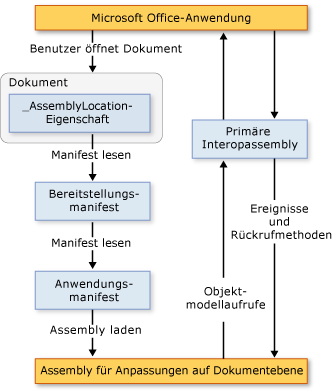

# Architektur von Anpassungen auf Dokument Ebene
  [!INCLUDE[vs_dev12](../vsto/includes/vs-dev12-md.md)] enthält Projekte für das Erstellen von Anpassungen auf Dokumentebene für Microsoft Office Word und Microsoft Office Excel. In diesem Thema werden die folgenden Aspekte von Anpassungen auf Dokumentebene beschrieben:

- [Informationen zu Anpassungen](#UnderstandingCustomizations)

- [Komponenten von Anpassungen](#Components)

- [Verwenden von Anpassungen mit Microsoft Office-Anwendungen](#HowCustomizationsWork)

  [!INCLUDE[appliesto_alldoc](../vsto/includes/appliesto-alldoc-md.md)]

  Allgemeine Informationen zum Erstellen von Anpassungen auf Dokument Ebene finden Sie unter Übersicht über die Entwicklung von Office-Projektmappen [&#40;VSTO&#41;](../vsto/office-solutions-development-overview-vsto.md), Einstieg in das [Programmieren von Anpassungen auf Dokument Ebene für Word](../vsto/getting-started-programming-document-level-customizations-for-word.md)und Einstieg in das [Programmieren von Anpassungen auf Dokument Ebene für Excel](../vsto/getting-started-programming-document-level-customizations-for-excel.md).

##  Informationen zu Anpassungen
 Wenn Sie zum Erstellen einer Anpassung auf Dokumentebene die Office-Entwicklertools in Visual Studio verwenden, erstellen Sie eine verwaltete Codeassembly, die einem bestimmten Dokument zugeordnet ist. Ein Dokument oder eine Arbeitsmappe mit einer zugeordneten Assembly besitzt Erweiterungen durch verwalteten Code. Weitere Informationen finden Sie unter [Entwerfen und Erstellen von Office-](../vsto/designing-and-creating-office-solutions.md)Projektmappen.

 Wenn ein Benutzer das Dokument öffnet, wird die Assembly von der Microsoft Office-Anwendung geladen. Nach dem Laden der Assembly kann die Anpassung auf Ereignisse reagieren, während das Dokument geöffnet ist. Die Anpassung kann auch einen Aufruf an das Objektmodell ausführen, um die Anwendung zu automatisieren und zu erweitern, während das Dokument geöffnet ist, und die Anpassung kann jede der Klassen in [!INCLUDE[dnprdnshort](../sharepoint/includes/dnprdnshort-md.md)]verwenden.

 Die Assembly verwendet die primäre Interopassembly der Anwendung, um mit den COM-Komponenten der Anwendung zu kommunizieren. Weitere Informationen finden Sie unter [primäre](../vsto/office-primary-interop-assemblies.md) Interopassemblys für Office und [Übersicht über die Entwicklung von Office-Lösungen &#40;VSTO-&#41;](../vsto/office-solutions-development-overview-vsto.md).

 Wenn ein Benutzer mehrere Anpassungen auf Dokumentebene gleichzeitig öffnet, wird jede Assembly in eine andere Anwendungsdomäne geladen. So kann eine Projektmappe, die sich falsch verhält, nicht bewirken, dass andere Projektmappen fehlschlagen. Anpassungen auf Dokumentebene sind für einzelne Dokumente in einer einzelnen Anwendungsdomäne konzipiert. Sie sind nicht für die Kommunikation zwischen verschiedenen Dokumenten konzipiert. Weitere Informationen zu Anwendungs Domänen finden Sie unter [Anwendungs Domänen](/dotnet/framework/app-domains/application-domains).

> [!NOTE]
> Anpassungen auf Dokumentebene, die mit den Office-Entwicklertools in Visual Studio erstellt werden, sollen nur dann verwendet werden, wenn die Microsoft Office-Hostanwendung von einem Endbenutzer gestartet wird. Wird die Anwendung programmgesteuert gestartet, beispielsweise durch Automatisierung, verhält sich die Anpassung unter Umständen nicht so, wie erwartet.

### Entwurfszeit-und Laufzeitumgebungen
 Um die Architektur von Anpassungen auf Dokumentebene zu verstehen, ist es hilfreich, wenn Sie die Möglichkeiten beim Entwerfen und beim Ausführen einer Lösung kennen.

#### Entwurfszeit
 Zur Entwurfszeit werden die folgenden Schritte ausgeführt:

1. Der Entwickler erstellt ein Projekt auf Dokumentebene in [!INCLUDE[vsprvs](../sharepoint/includes/vsprvs-md.md)]. Das Projekt enthält das Dokument und die Assembly, die im Dokument ausgeführt wird. Das Dokument ist möglicherweise bereits vorhanden (von einem Designer erstellt), oder es kann zusammen mit dem Projekt ein neues Dokument erstellt werden.

2. Der Designer (d. h. der Entwickler, der das Projekt erstellt, oder eine andere Person) bestimmt die endgültige Gestaltung des Dokuments für den Endbenutzer.

#### Typ
 Zur Laufzeit werden die folgenden Schritte ausgeführt:

1. Der Endbenutzer öffnet ein Dokument oder eine Arbeitsmappe, die Erweiterungen durch verwalteten Code besitzt.

2. Die kompilierte Assembly wird vom Dokument oder der Arbeitsmappe geladen.

3. Die Assembly reagiert auf Ereignisse, während der Benutzer im Dokument oder in der Arbeitsmappe arbeitet.

#### Vergleich der Entwickler-und Endbenutzer Perspektive
 Für Anpassungen auf Dokumentebene gibt es zwei verschiedene Erklärungsansätze, da Entwickler überwiegend [!INCLUDE[vsprvs](../sharepoint/includes/vsprvs-md.md)]verwenden, während Endbenutzer mit Word oder Excel arbeiten.

|Perspektive des Entwicklers|Perspektive des Endbenutzers|
|-----------------------------|----------------------------|
|Der Entwickler erstellt in [!INCLUDE[vsprvs](../sharepoint/includes/vsprvs-md.md)]Code, auf den aus Word und Excel zugegriffen werden kann.   Auch wenn der Eindruck entsteht, der Entwickler erstelle eine ausführbare Datei, die Word oder Excel ausführt, verläuft der Prozess umgekehrt. Das Dokument ist einer Assembly zugeordnet und enthält einen Zeiger auf diese Assembly. Beim Öffnen des Dokuments sucht Word bzw. Excel die Assembly und führt den Code als Reaktion auf alle behandelten Ereignisse aus.|Die Benutzer der Projektmappe öffnen einfach das Dokument bzw. die Arbeitsmappe (oder erstellen ein neues Dokument aus einer Vorlage) wie bei einer normalen Microsoft Office-Datei.   Die Assembly stellt Anpassungen im Dokument bzw. in der Arbeitsmappe bereit, z. B. das automatische Füllen mit aktuellen Daten oder das Anzeigen eines Dialogfelds zum Abfragen von Informationen.|

### Unterstützte Dokumentformate für Anpassungen auf Dokument Ebene
 Wenn Sie ein Anpassungsprojekt erstellen, können Sie das Format des Dokuments auswählen, das Sie im Projekt verwenden möchten. Weitere Informationen finden Sie unter Gewusst [wie: Erstellen von Office-Projekten in Visual Studio](../vsto/how-to-create-office-projects-in-visual-studio.md).

 In der folgenden Tabelle werden die Dokumentformate aufgelistet, die Sie in Anpassungen auf Dokumentebene für Excel und Word verwenden können.

|Excel|Word|
|-----------|----------|
|Excel-Arbeitsmappe (*. xlsx*)   Excel-Arbeitsmappe mit Makros (*. xlsm*)   Binäre Excel-Arbeitsmappe (*. xlsb*)   Excel 97-2003-Arbeitsmappe (*. xls*)   Excel-Vorlage (*. xltx*)   Excel-Vorlage mit Makros (*. xltm*)   Excel 97-2003-Vorlage (*. xlt*)|Word-Dokument (*. docx*)   Word-Dokument mit Makros (*. docm*)   Word 97-2003-Dokument (*. doc*)   Word-Vorlage (*. dotx*)   Word-Vorlage mit Makros (*. dotm*)   Word 97-2003-Vorlage (*. dot*)|

 Sie sollten Erweiterungen durch verwalteten Code nur für Dokumente in den unterstützten Formaten entwerfen. Andernfalls können bestimmte Ereignisse möglicherweise nicht ausgelöst werden, wenn das Dokument in der Anwendung geöffnet wird. Beispielsweise wird das- <xref:Microsoft.Office.Tools.Excel.Workbook.Open> Ereignis nicht ausgelöst, wenn Sie Erweiterungen mit verwaltetem Code mit Arbeitsmappen verwenden, die im XML-Tabellenformat für Excel oder auf der Webseite (*. htm*; *HTML*-Code) Ges.

### Unterstützung für Word-Dokumente mit. XML-Dateinamen Erweiterungen
 Mit Projektvorlagen auf Dokumentebene können Sie keine Projekte erstellen, die auf den folgenden Dateiformaten basieren:

- Word-XML-Dokument (* \* XML*).

- Word 2003 XML-Dokument (* \* XML*).

  Wenn Sie möchten, dass die Endbenutzer Anpassungen in diesen Dateiformaten verwenden, erstellen Sie eine Anpassung, die eines der unterstützten Dateiformate aus der Tabelle oben verwendet, und stellen Sie diese Anpassung bereit. Nach der Installation der Anpassung können Endbenutzer das Dokument im XML-Format (Word XML* \* Document) oder**im XML-Format (Word \* *2003 XML Document) speichern, und die Anpassung funktioniert weiterhin wie erwartet.

##  Komponenten von Anpassungen
 Die Hauptkomponenten einer Anpassung sind das Dokument und die Assembly. Es gibt zudem mehrere andere Komponenten, die beeinflussen, wie Microsoft Office-Anwendungen Anpassungen finden und laden.

### Bereitstellungs Manifest und Anwendungs Manifest
 Anwendungen verwenden Bereitstellungs- und Anwendungsmanifeste, um die aktuelle Version der Anpassungsassembly zu identifizieren und zu laden. Das Bereitstellungsmanifest verweist auf das aktuelle Anwendungsmanifest. Das Anwendungsmanifest verweist auf die Anpassungsassembly und gibt die Einstiegspunktklasse (bzw. Einstiegspunktklassen) an, die in der Assembly ausgeführt wird. Weitere Informationen finden Sie unter [Anwendungs-und Bereitstellungs Manifeste in Office-](../vsto/application-and-deployment-manifests-in-office-solutions.md)Projektmappen.

### Visual Studio Tools for Office Runtime
 Zum Ausführen von Anpassungen auf Dokument Ebene, die mit den Office Developer Tools in Visual Studio erstellt werden, muss auf den Endbenutzer Computern [!INCLUDE[vsto_runtime](../vsto/includes/vsto-runtime-md.md)] installiert sein. [!INCLUDE[vsto_runtime](../vsto/includes/vsto-runtime-md.md)] enthält nicht verwaltete Komponenten, die die Anpassungsassembly laden, und einen Satz verwalteter Assemblys. Die verwalteten Assemblys enthalten das Objektmodell, das Ihr Anpassungscode verwendet, um die Hostanwendung zu automatisieren und zu erweitern.

 Weitere Informationen finden Sie unter [Übersicht über die Visual Studio-Tools für Office-Laufzeit](../vsto/visual-studio-tools-for-office-runtime-overview.md).

##  Funktionsweise von Anpassungen mit Microsoft Office Anwendungen
 Wenn ein Benutzer ein Dokument öffnet, das Teil einer Anpassung für Microsoft Office ist, verwendet die Anwendung das mit dem Dokument verknüpfte Bereitstellungsmanifest, um die aktuelle Version der Anpassungsassembly zu finden und zu laden. Der Speicherort des Bereitstellungs Manifests wird in einer benutzerdefinierten Dokument Eigenschaft namens **assemblylocation**gespeichert. Die Zeichenfolge, die diesen Speicherort angibt, wird in die Eigenschaft eingefügt, wenn Sie die Projektmappe erstellen.

 Das Bereitstellungsmanifest verweist auf das Anwendungsmanifest, das wiederum auf die aktuelle Assembly verweist. Weitere Informationen finden Sie unter [Anwendungs-und Bereitstellungs Manifeste in Office-](../vsto/application-and-deployment-manifests-in-office-solutions.md)Projektmappen.

 In der folgenden Abbildung wird die grundlegende Architektur einer Anpassung auf Dokumentebene dargestellt.

 

> [!NOTE]
> In Office-Projektmappen, die auf [!INCLUDE[net_v40_short](../sharepoint/includes/net-v40-short-md.md)]abzielen, rufen Projektmappen das Objektmodell der Hostanwendung mithilfe von in die Projektmappenassembly eingebetteten Typinformationen der primären Interop-Assembly auf, statt die PIA direkt aufzurufen. Weitere Informationen finden Sie unter [Entwerfen und Erstellen von Office-](../vsto/designing-and-creating-office-solutions.md)Projektmappen.

### Ladevorgang
 Die folgenden Schritte werden ausgeführt, wenn ein Benutzer ein Dokument öffnet, das Teil einer Microsoft Office-Projektmappe ist:

1. Die Microsoft Office-Anwendung prüft anhand der benutzerdefinierten Dokumenteigenschaften, ob dem Dokument Erweiterungen durch verwalteten Code zugeordnet sind. Weitere Informationen finden Sie unter [Übersicht über benutzerdefinierte Dokumenteigenschaften](../vsto/custom-document-properties-overview.md).

2. Wenn Erweiterungen durch verwalteten Code vorhanden sind, lädt die Anwendung *VSTOEE.dll*, das *VSTOLoader.dll*lädt. Hierbei handelt es sich um nicht verwaltete DLLs, die die Lade Komponenten für Visual Studio 2010-Tools für Office-Laufzeit sind. Weitere Informationen finden Sie unter [Visual Studio-Tools for Office Runtime Overview](../vsto/visual-studio-tools-for-office-runtime-overview.md).

3. *VSTOLoader.dll* lädt den [!INCLUDE[dnprdnshort](../sharepoint/includes/dnprdnshort-md.md)] und startet den verwalteten Teil von [!INCLUDE[vsto_runtime](../vsto/includes/vsto-runtime-md.md)] .

4. Wenn das Dokument von einem anderen Speicherort als dem lokalen Computer aus geöffnet wird, überprüft [!INCLUDE[vsto_runtime](../vsto/includes/vsto-runtime-md.md)] , ob der Speicherort des Dokuments in der Liste der **vertrauenswürdigen Speicherorte** in den **Einstellungen für das Sicherheitscenter** der betreffenden Office-Anwendung aufgeführt wird. Wenn der Speicherort des Dokuments kein vertrauenswürdiger Speicherort ist, ist die Anpassung nicht vertrauenswürdig, und der Ladevorgang wird hier beendet.

5. [!INCLUDE[vsto_runtime](../vsto/includes/vsto-runtime-md.md)] installiert die Lösung, wenn sie nicht bereits installiert ist, lädt das aktuelle Anwendungs- und Bereitstellungsmanifest herunter, und führt eine Reihe von Sicherheitsüberprüfungen durch. Weitere Informationen finden Sie unter [sichere Office-Lösungen](../vsto/securing-office-solutions.md).

6. Wenn die Anpassung vertrauenswürdig ist und ausgeführt werden darf, verwendet [!INCLUDE[vsto_runtime](../vsto/includes/vsto-runtime-md.md)] das Bereitstellungsmanifest und das Anwendungsmanifest, um nach Assemblyaktualisierungen zu suchen. Wenn eine neue Version der Assembly verfügbar ist, lädt die Laufzeit die neue Version der Assembly in den [!INCLUDE[ndptecclick](../vsto/includes/ndptecclick-md.md)] -Cache auf dem Clientcomputer. Weitere Informationen finden Sie unter Bereitstellen [einer Office](../vsto/deploying-an-office-solution.md)-Projekt Mappe.

7. [!INCLUDE[vsto_runtime](../vsto/includes/vsto-runtime-md.md)] erstellt eine neue Anwendungsdomäne, in der die Anpassungsassembly geladen wird.

8. Die Anpassungsassembly wird von [!INCLUDE[vsto_runtime](../vsto/includes/vsto-runtime-md.md)] in die Anwendungsdomäne geladen.

9. Die Anpassungsassembly wird von [!INCLUDE[vsto_runtime](../vsto/includes/vsto-runtime-md.md)] ruft den **Startup** -Ereignishandler in der Anpassungsassembly auf. Weitere Informationen finden Sie unter [Ereignisse in Office-Projekten](../vsto/events-in-office-projects.md).

## Weitere Informationen
- [Architektur von Office-Projektmappen in Visual Studio](../vsto/architecture-of-office-solutions-in-visual-studio.md)
- [Architecture of VSTO Add-ins](../vsto/architecture-of-vsto-add-ins.md)
- [Übersicht über Visual Studio-Tools für Office-Laufzeit](../vsto/visual-studio-tools-for-office-runtime-overview.md)
- [Sichere Office-Lösungen](../vsto/securing-office-solutions.md)
- [Entwerfen und Erstellen von Office-Lösungen](../vsto/designing-and-creating-office-solutions.md)
- [Übersicht über benutzerdefinierte Dokumenteigenschaften](../vsto/custom-document-properties-overview.md)
- [Zwischengespeicherte Daten in Anpassungen auf Dokument Ebene](../vsto/cached-data-in-document-level-customizations.md)
