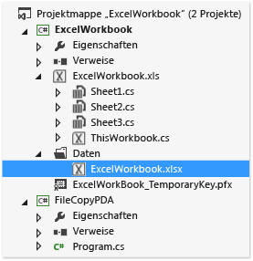
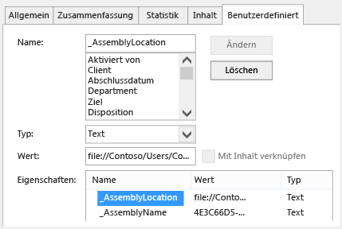

# Bereitstellen einer Office-L&#246;sung mithilfe von ClickOnce
  Wenn Sie ClickOnce verwenden, können Sie die Office\-Projektmappe in weniger Schritten bereitstellen.  Wenn Sie Updates veröffentlichen, erkennt die Projektmappe sie automatisch und installiert sie.  Für ClickOnce ist es jedoch erforderlich, die Projektmappe für jeden Benutzer eines Computers separat zu installieren.  Daher sollten Sie die Verwendung von Windows Installer \(MSI\-Format\) in Erwägung ziehen, wenn mehrere Benutzer die Projektmappe auf dem gleichen Computer ausführen.  
  
## In diesem Thema  
  
-   [Veröffentlichen der Projektmappe](#Publish)  
  
-   [Festlegen, wie der Projektmappe Vertrauenswürdigkeit gewährt werden soll](#Trust)  
  
-   [Hilfe für Benutzer bei der Installation der Projektmappe](#Helping)  
  
-   [Kopieren des Dokuments einer Projektmappe auf den Computer des Endbenutzers (nur Anpassungen auf Dokumentebene)](#Put)  
  
-   [Kopieren des Dokuments einer Projektmappe auf einen Server, auf dem SharePoint ausgeführt wird (nur Anpassungen auf Dokumentebene)](#SharePoint)  
  
-   [Erstellen eines benutzerdefinierten Installationsprogramms](#Custom)  
  
-   [Veröffentlichen eines Updates](#Update)  
  
-   [Ändern des Installationspfads einer Projektmappe](#Location)  
  
-   [Zurücksetzen der Projektmappe auf eine frühere Version](#Roll)  
  
 Weitere Informationen zum Bereitstellen einer Office\-Projektmappe durch Erstellung einer Windows Installer\-Datei finden Sie unter [Bereitstellen einer Office-Lösung mithilfe von Windows Installer](../vsto/deploying-an-office-solution-by-using-windows-installer.md).  
  
##  <a name="Publish"></a> Veröffentlichen der Projektmappe  
 Sie können die Projektmappe mit dem **Webpublishing\-Assistenten** oder dem **Projekt\-Designer** veröffentlichen.  In diesem Verfahren verwenden Sie den **Projekt\-Designer**, da dieser alle Veröffentlichungsoptionen bereitstellt.  Weitere Informationen finden Sie unter [Veröffentlichungsassistent &#40;Office-Entwicklung in Visual Studio&#41;](../vsto/publish-wizard-office-development-in-visual-studio.md)  
  
#### So veröffentlichen Sie die Projektmappe  
  
1.  Wählen Sie im **Projektmappen\-Explorer** den Knoten aus, der nach dem Projekt benannt ist.  
  
2.  Wählen Sie in der Menüleiste **Projekt** und die Option *Projektname***\-Eigenschaften** aus.  
  
3.  Wählen Sie im **Projekt\-Designer** die Registerkarte **Veröffentlichen** aus, die in der folgenden Abbildung gezeigt wird.  
  
       
  
4.  Geben Sie im Feld **Speicherort des Veröffentlichungsordners \(FTP\-Server oder Dateipfad\)** den Pfad des Ordners ein, in den der **Projekt\-Designer** die Projektmappendateien kopieren soll.  
  
     Folgende Pfadtypen sind möglich:  
  
    -   Ein lokaler Pfad \(z. B. *C:\\Ordnername\\Ordnername*\).  
  
    -   Ein UNC\-Pfad zu einem Ordner im Netzwerk \(z. B. *\\\\Servername\\Ordnername*\).  
  
    -   Ein relativer Pfad \(z. B. *Veröffentlichungsordner\\*, wobei es sich um den Ordner handelt, in dem das Projekt standardmäßig veröffentlicht wird\).  
  
5.  Geben Sie im Feld **URL des Installationsordners** den vollqualifizierten Pfad des Speicherorts ein, an dem Endbenutzer die Projektmappe finden.  
  
     Wenn Sie den Speicherort noch nicht kennen, geben Sie hier nichts ein.  Standardmäßig sucht ClickOnce in dem Ordner, von dem aus die Benutzer die Projektmappe installieren, nach Updates.  
  
6.  Klicken Sie auf die Schaltfläche **Erforderliche Komponenten**.  
  
7.  Stellen Sie im Dialogfeld **Erforderliche Komponenten** sicher, dass das Kontrollkästchen **Setupprogramm zur Installation erforderlicher Komponenten erstellen** aktiviert ist.  
  
8.  Aktivieren Sie in der Liste **Zu installierende erforderliche Komponenten auswählen** die Kontrollkästchen für **Windows Installer 4.5** und das entsprechende .NET Framework\-Paket.  
  
     Wenn die Projektmappe beispielsweise auf [!INCLUDE[net_v45](../vsto/includes/net-v45-md.md)] abzielt, aktivieren Sie die Kontrollkästchen für **Windows Installer 4.5** und **Microsoft .NET Framework 4.5 Full**.  
  
9. Wenn die Projektmappe auf .NET Framework 4.5 abzielt, aktivieren Sie auch das Kontrollkästchen **Visual Studio 2010\-Tools für Office\-Laufzeit**.  
  
    > [!NOTE]  
    >  Standardmäßig wird dieses Kontrollkästchen nicht angezeigt.  Damit es angezeigt wird, müssen Sie ein Bootstrapperpaket erstellen.  Weitere Informationen finden Sie im englischsprachigen Blog [Erstellen eines Bootstrapper\-Pakets für ein Office 2013 VSTO\-Add\-In mit Visual Studio 2012](http://blogs.msdn.com/b/vsto/archive/2012/12/21/creating-a-bootstrapper-package-for-an-office-2013-vsto-add-in-with-visual-studio-2012.aspx).  
  
10. Wählen Sie unter **Installationsort für erforderliche Komponenten angeben** eine der angezeigten Optionen, und wählen Sie dann die Schaltfläche **OK** aus.  
  
     In der folgenden Tabelle sind die einzelnen Optionen beschrieben.  
  
    |Option|Beschreibung|  
    |------------|------------------|  
    |**Erforderliche Komponenten von der Website des Komponentenherstellers herunterladen**|Der Benutzer wird aufgefordert, diese erforderlichen Komponenten vom Hersteller herunterzuladen und zu installieren.|  
    |**Erforderliche Komponenten von demselben Speicherort wie Anwendung herunterladen**|Die erforderliche Software wird mit der Projektmappe installiert.  Wenn Sie diese Option auswählen, kopiert Visual Studio alle erforderlichen Pakete für Sie an den Veröffentlichungsort.  Damit diese Option funktioniert, müssen sich die erforderlichen Pakete auf dem Entwicklungscomputer befinden.|  
    |**Erforderliche Komponenten von folgendem Speicherort herunterladen**|Visual Studio kopiert alle erforderlichen Pakete an den angegebenen Speicherort und installiert sie mit der Projektmappe.|  
  
     Weitere Informationen finden Sie unter [Dialogfeld "Erforderliche Komponenten"](../ide/reference/prerequisites-dialog-box.md).  
  
11. Wählen Sie die Schaltfläche **Updates** aus, geben Sie an, wie oft das VSTO\-Add\-In oder die Anpassung jedes Endbenutzers nach Updates suchen soll, und wählen Sie dann die Schaltfläche **OK** aus.  
  
    > [!NOTE]  
    >  Wenn Sie die Bereitstellung mithilfe einer CD oder eines Wechsellaufwerks vornehmen, aktivieren Sie das Optionsfeld **Nie nach Updates suchen**.  
  
     Wie Sie ein Update veröffentlichen, erfahren Sie unter [Veröffentlichen eines Updates](#Update).  
  
12. Wählen Sie die Schaltfläche **Optionen** aus, prüfen Sie die Optionen im Dialogfeld **Optionen**, und wählen Sie dann die Schaltfläche **OK** aus.  
  
13. Wählen Sie die Schaltfläche **Jetzt veröffentlichen**.  
  
     Visual Studio fügt dem Veröffentlichungsordner die folgenden Ordner und Dateien hinzu, die Sie zuvor in dieser Prozedur angegeben haben.  
  
    -   Den Ordner **Anwendungsdateien**.  
  
    -   Das Setupprogramm.  
  
    -   Ein Bereitstellungsmanifest, das auf das Bereitstellungsmanifest der neuesten Version verweist.  
  
     Der Ordner **Anwendungsdateien** enthält einen Unterordner für jede Version, die Sie veröffentlichen.  Jeder versionsspezifische Unterordner enthält die folgenden Dateien.  
  
    -   Ein Anwendungsmanifest.  
  
    -   Ein Bereitstellungsmanifest.  
  
    -   Anpassungsassemblys.  
  
     Die folgende Abbildung zeigt die Struktur des Veröffentlichungsordners für ein Outlook VSTO\-Add\-In.  
  
       
  
    > [!NOTE]  
    >  ClickOnce hängt an Assemblys die Erweiterung ".deploy" an, damit eine gesicherte Installation von Internetinformationsdiensten \(IIS\) die Dateien nicht aufgrund einer unsicheren Dateinamenerweiterung blockiert.  Wenn der Benutzer die Projektmappe installiert, entfernt ClickOnce die Erweiterung ".deploy".  
  
14. Kopieren Sie die Projektmappendateien an den Installationspfad, den Sie zuvor in dieser Prozedur angegeben haben.  
  
##  <a name="Trust"></a> Festlegen, wie der Projektmappe Vertrauenswürdigkeit gewährt werden soll  
 Bevor eine Projektmappe auf Benutzercomputern ausgeführt werden kann, müssen Sie entweder Vertraulichkeit gewähren, oder Benutzer müssen auf eine vertrauenswürdige Eingabeaufforderung antworten, wenn Sie die Projektmappe installieren.  Um der Projektmappe Vertraulichkeit zu gewähren, signieren Sie die Manifeste, indem Sie ein Zertifikat verwenden, das einen bekannten und vertrauenswürdigen Herausgeber identifiziert.  Siehe [Der Projektmappe durch das Signieren von Anwendungs- und Bereitstellungsmanifesten vertrauen](../vsto/granting-trust-to-office-solutions.md#Signing).  
  
 Wenn Sie eine Anpassung auf Dokumentebene bereitstellen und das Dokument in einem Ordner auf dem Computer des Benutzers speichern oder es auf einer SharePoint\-Website bereitstellen möchten, müssen Sie sicherstellen, dass Office dem Speicherort des Dokuments vertraut.  Weitere Informationen finden Sie unter [Gewähren von Vertrauenswürdigkeit für Dokumente](../vsto/granting-trust-to-documents.md).  
  
##  <a name="Helping"></a> Hilfe für Benutzer bei der Installation der Projektmappe  
 Benutzer können die Projektmappe installieren, indem sie das Setupprogramm ausführen oder das Bereitstellungsmanifest öffnen; im Falle einer Anpassung auf Dokumentebene kann auch das Dokument direkt geöffnet werden.  Als empfohlene Vorgehensweise sollten Benutzer die Projektmappe mithilfe des Setupprogramms installieren.  Bei den anderen beiden Methoden ist nicht sichergestellt, dass die erforderliche Software installiert wird.  Wenn Benutzer das Dokument vom Installationspfad öffnen möchten, müssen sie ihn der Liste vertrauenswürdiger Speicherorte im Sicherheitscenter der Office\-Anwendung hinzufügen.  
  
### Öffnen des Dokuments einer Anpassung auf Dokumentebene  
 Benutzer können das Dokument einer Anpassung auf Dokumentebene direkt vom Installationspfad öffnen, oder indem Sie das Dokument auf den lokalen Computer kopieren und dann die Kopie öffnen.  
  
 Empfohlen wird, dass Benutzer eine Kopie des Dokuments auf ihrem Computer öffnen, damit nicht mehrere Benutzer gleichzeitig versuchen, die gleiche Kopie zu öffnen.  Um diese Methode zu erzwingen, können Sie das Setupprogramm so konfigurieren, dass das Dokument auf die Benutzercomputer kopiert wird.  Siehe [Kopieren des Dokuments einer Projektmappe auf den Computer des Endbenutzers (nur Anpassungen auf Dokumentebene)](#Put).  
  
### Installieren der Projektmappe durch Öffnen des Bereitstellungsmanifests von einer IIS\-Website  
 Benutzer können eine Office\-Projektmappe installieren, indem sie das Bereitstellungsmanifest aus dem Web öffnen.  Eine gesicherte Installation von Internetinformationsdiensten \(IIS\) blockiert jedoch Dateien mit der Dateinamenerweiterung ".vsto".  Der MIME\-Typ muss in IIS definiert werden, bevor Sie Office\-Projektmappen mithilfe von IIS bereitstellen können.  
  
##### So fügen Sie den .vsto\-MIME\-Typ zu IIS 6.0 hinzu  
  
1.  Wählen Sie auf dem Server, auf dem IIS 6.0 ausgeführt wird, **Start**, **Alle Programme**, **Verwaltung**, **Internetinformationsdienste\-Manager**.  
  
2.  Wählen Sie den Computernamen, den Ordner **Websites** oder die Website, die Sie konfigurieren.  
  
3.  Wählen Sie in der Menüleiste **Aktion**, **Eigenschaften**.  
  
4.  Wählen Sie auf der Registerkarte **HTTP\-Header** die Schaltfläche **MIME\-Typen** aus.  
  
5.  Wählen Sie im Fenster **MIME\-Typen** die Schaltfläche **Neu** aus.  
  
6.  Geben Sie im Fenster **MIME\-Typ.vsto** als Erweiterung und **application\/x\-ms\-vsto** als MIME\-Typ ein, und wenden Sie dann die neuen Einstellungen an.  
  
    > [!NOTE]  
    >  Damit die Änderungen wirksam werden, müssen Sie den WWW\-Publishingdienst neu starten oder abwarten, bis der Arbeitsprozess wiederverwendet wird.  Anschließend müssen Sie den Datenträgercache des Browsers leeren und dann versuchen, die VSTO\-Datei erneut zu öffnen.  
  
##### So fügen Sie den .vsto\-MIME\-Typ zu IIS 7,0 hinzu  
  
1.  Wählen Sie auf dem Server, auf dem IIS 7.0 ausgeführt wird, **Start**, **Alle Programme**, **Zubehör** aus.  
  
2.  Öffnen Sie das Kontextmenü für die **Eingabeaufforderung**, und wählen Sie dann **Als Administrator ausführen.**  
  
3.  Geben Sie im Dialogfeld **Öffnen** den folgenden Pfad ein, und klicken Sie dann auf die Schaltfläche **OK**.  
  
    ```  
    %windir%\system32\inetsrv   
    ```  
  
4.  Geben Sie den folgenden Befehl ein, und wenden Sie dann die neuen Einstellungen an.  
  
    ```  
    set config /section:staticContent /+[fileExtension='.vsto',mimeType='application/x-ms-vsto']  
    ```  
  
    > [!NOTE]  
    >  Damit die Änderungen wirksam werden, müssen Sie den WWW\-Publishingdienst neu starten oder abwarten, bis der Arbeitsprozess wiederverwendet wird.  Anschließend müssen Sie den Datenträgercache des Browsers leeren und dann versuchen, die VSTO\-Datei erneut zu öffnen.  
  
##  <a name="Put"></a> Kopieren des Dokuments einer Projektmappe auf den Computer des Endbenutzers \(nur Anpassungen auf Dokumentebene\)  
 Sie können das Dokument der Projektmappe für die Endbenutzer auf ihre Computer kopieren, indem Sie eine Aktion nach der Bereitstellung erstellen.  Dann müssen die Benutzer das Dokument nicht manuell vom Installationspfad auf ihre Computer kopieren, nachdem sie die Projektmappe installiert haben.  Sie müssen eine Klasse erstellen, in der die Aktion nach der Bereitstellung definiert wird, die Projektmappe erstellen und veröffentlichen, das Anwendungsmanifest ändern und das Anwendungs\- und das Bereitstellungsmanifest erneut signieren.  
  
 In den folgenden Prozeduren wird davon ausgegangen, dass der Projektname **ExcelWorkbook** ist und Sie die Projektmappe im Verzeichnis **C:\\publish** auf dem Computer veröffentlichen.  
  
### Erstellen einer Klasse, in der die Aktion nach der Bereitstellung definiert wird  
  
1.  Wählen Sie auf der Menüleiste **Datei**, **Hinzufügen**, **Neues Projekt** aus.  
  
2.  Wählen Sie im Dialogfeld **Neues Projekt hinzufügen** im Bereich **Installierte Vorlagen** den Ordner **Windows**.  
  
3.  Wählen Sie im Bereich **Vorlagen** die Vorlage **Klassenbibliothek** aus.  
  
4.  Geben Sie im Feld **Name** den Eintrag **FileCopyPDA** ein, und klicken Sie dann auf die Schaltfläche **OK**.  
  
5.  Wählen Sie im **Projektmappen\-Explorer** das Projekt **FileCopyPDA** aus.  
  
6.  Wählen Sie in der Menüleiste die Optionen **Projekt** und **Verweis hinzufügen** aus.  
  
7.  Fügen Sie auf der Registerkarte **.NET** Verweise auf "Microsoft.VisualStudio.Tools.Applications.Runtime" und "Microsoft.VisualStudio.Tools.Applications.ServerDocument" hinzu.  
  
8.  Benennen Sie die Klasse in `FileCopyPDA` um, und ersetzen Sie den Inhalt der Datei durch den Code.  Mit diesem Code werden die folgenden Aufgaben ausgeführt:  
  
    -   Kopieren des Dokuments auf den Desktop des Benutzers.  
  
    -   Ändern der \_AssemblyLocation\-Eigenschaft von einem relativen Pfad in einen vollqualifizierten Pfad für das Bereitstellungsmanifest.  
  
    -   Löschen der Datei, wenn der Benutzer die Projektmappe deinstalliert.  
  
     [!code-csharp[Trin_ExcelWorkbookPDA#7](../snippets/csharp/VS_Snippets_OfficeSP/trin_excelworkbookpda/cs/filecopypda/class1.cs#7)]
     [!code-vb[Trin_ExcelWorkbookPDA#7](../snippets/visualbasic/VS_Snippets_OfficeSP/trin_excelworkbookpda/vb/filecopypda/class1.vb#7)]  
  
### Erstellen und Veröffentlichen der Projektmappe  
  
1.  Öffnen Sie im **Projektmappen\-Explorer** das Kontextmenü für das Projekt **FileCopyPDA**, und wählen Sie dann **Erstellen**.  
  
2.  Öffnen Sie das Kontextmenü für das Projekt **ExcelWorkbook**, und wählen Sie dann **Erstellen** aus.  
  
3.  Öffnen Sie das Kontextmenü für das Projekt **ExcelWorkbook**, und wählen Sie dann **Verweis hinzufügen**.  
  
4.  Wählen Sie im Dialogfeld **Verweis hinzufügen** die Registerkarte **Projekte** aus, wählen Sie **FileCopyPDA** und dann die Schaltfläche **OK**.  
  
5.  Wählen Sie im **Projektmappen\-Explorer** das Projekt **ExcelWorkbook** aus.  
  
6.  Wählen Sie in der Menüleiste **Projekt**, **Neuer Ordner** aus.  
  
7.  Geben Sie Daten ein, und wählen Sie dann die EINGABETASTE.  
  
8.  Wählen Sie im **Projektmappen\-Explorer** den Ordner **Daten**.  
  
9. Wählen Sie in der Menüleiste **Projekt** und dann **Vorhandenes Element hinzufügen** aus.  
  
10. Wechseln Sie im Dialogfeld **Vorhandenes Element hinzufügen** zum Ausgabeverzeichnis für das Projekt **ExcelWorkbook**, wählen Sie die Datei **ExcelWorkbook.xlsx**, und wählen Sie dann die Schaltfläche **Hinzufügen** aus.  
  
11. Wählen Sie im **Projektmappen\-Explorer** die Datei **ExcelWorkbook.xlsx** aus.  
  
12. Ändern Sie im Fenster **Eigenschaften** die Eigenschaft **Buildvorgang** in **Inhalt** und die Eigenschaft **In Ausgabeverzeichnis kopieren** in **Kopieren, wenn neuer**.  
  
     Wenn Sie diese Schritte abgeschlossen haben, sollte das Projekt der folgenden Abbildung entsprechen.  
  
       
  
13. Veröffentlichen Sie das Projekt **ExcelWorkbook**.  
  
### Ändern des Anwendungsmanifests  
  
1.  Öffnen Sie das Verzeichnis **c:\\publish** im **Datei\-Explorer**.  
  
2.  Öffnen Sie den Ordner **Anwendungsdateien**, und öffnen Sie dann den Ordner, der der aktuellen veröffentlichten Version der Projektmappe entspricht.  
  
3.  Öffnen Sie die Datei **ExcelWorkbook.dll.manifest** in einem Text\-Editor wie z. B. Editor.  
  
4.  Fügen Sie nach dem `</vstav3:update>`\-Element den folgenden Code ein.  Verwenden Sie für das Klassenattribut des `<vstav3:entryPoint>`\-Elements die folgende Syntax: *NamespaceName.ClassName*.  Im folgenden Beispiel sind der Namespace und die Klassennamen gleich, sodass der Name des resultierenden Einstiegspunkts `FileCopyPDA.FileCopyPDA` lautet.  
  
    ```  
    <vstav3:postActions>  
      <vstav3:postAction>  
        <vstav3:entryPoint  
          class="FileCopyPDA.FileCopyPDA">  
          <assemblyIdentity  
            name="FileCopyPDA"  
            version="1.0.0.0"  
            language="neutral"  
            processorArchitecture="msil" />  
        </vstav3:entryPoint>  
        <vstav3:postActionData>  
        </vstav3:postActionData>  
      </vstav3:postAction>  
    </vstav3:postActions>  
    ```  
  
### Erneutes Signieren der Anwendungs\- und Bereitstellungsmanifeste  
  
1.  Kopieren Sie im Ordner **%BENUTZERPROFIL%\\Dokumente\\Visual Studio 2013\\Projects\\ExcelArbeitsmappe\\ExcelArbeitsmappe** die Zertifikatdatei **ExcelWorkbook\_TemporaryKey.pfx**, und fügen Sie sie im Ordner *Veröffentlichungsordner***\\Anwendungsdateien\\ExcelArbeitsmappe***ZuletztVeröffentlichteVersion* ein.  
  
2.  Öffnen Sie die Visual Studio\-Eingabeaufforderung, und wechseln Sie dann in den Ordner **C:\\Veröffentlichungsordner\\Anwendungsdateien\\ExcelArbeitsmappe***ZuletztVeröffentlichteVersion* \(z. B. **C:\\Veröffentlichungsordner\\Anwendungsdateien\\ExcelArbeitsmappe\_1\_0\_0\_4**\).  
  
3.  Signieren Sie das geänderte Anwendungsmanifest, indem Sie den folgenden Befehl ausführen:  
  
    ```  
    mage -sign ExcelWorkbook.dll.manifest -certfile ExcelWorkbook_TemporaryKey.pfx  
    ```  
  
     Die Meldung "ExcelWorkbook.dll.manifest erfolgreich signiert" wird angezeigt.  
  
4.  Wechseln Sie zum Ordner **c:\\publish**, und aktualisieren und signieren Sie dann das Bereitstellungsmanifest, indem Sie den folgenden Befehl ausführen:  
  
    ```  
    mage -update ExcelWorkbook.vsto -appmanifest "Application Files\Ex  
    celWorkbookMostRecentVersionNumber>\ExcelWorkbook.dll.manifest" -certfile "Application Files\ExcelWorkbookMostRecentVersionNumber>\ExcelWorkbook_TemporaryKey.pfx"  
    ```  
  
    > [!NOTE]  
    >  Ersetzen Sie im vorherigen Beispiel "MostRecentVersionNumber" durch die Versionsnummer der zuletzt veröffentlichten Version der Projektmappe \(z. B. **1\_0\_0\_4**\).  
  
     Die Meldung "ExcelWorkbook.vsto erfolgreich signiert" wird angezeigt.  
  
5.  Kopieren Sie die Datei "ExcelWorkbook.vsto" in das Verzeichnis **C:\\Veröffentlichungsordner\\Anwendungsdateien\\ExcelArbeitsmappe***AktuelleVersionsnummer*.  
  
##  <a name="SharePoint"></a> Kopieren des Dokuments einer Projektmappe auf einen Server, auf dem SharePoint ausgeführt wird \(nur Anpassungen auf Dokumentebene\)  
 Sie können die Anpassung auf Dokumentebene für Endbenutzer mithilfe von SharePoint veröffentlichen.  Wenn Benutzer die SharePoint\-Site aufrufen und das Dokument öffnen, installiert die Laufzeit automatisch die Projektmappe aus dem freigegebenen Netzwerkordner auf den lokalen Computer des Benutzers.  Nachdem die Projektmappe lokal installiert wurde, funktioniert die Anpassung sogar dann, wenn das Dokument an eine andere Stelle kopiert wird, z. B. auf den Desktop.  
  
#### So kopieren Sie das Dokument auf einen Server, auf dem SharePoint ausgeführt wird  
  
1.  Fügen Sie das Projektmappendokument einer Dokumentbibliothek auf einer SharePoint\-Site hinzu.  
  
2.  Führen Sie die Schritte für eines der folgenden Verfahren aus:  
  
    -   Fügen Sie mit dem Office\-Konfigurationstool den Server, auf dem SharePoint ausgeführt wird, auf allen Benutzercomputern dem Sicherheitscenter in Word oder Excel hinzu.  
  
         Weitere Informationen finden Sie unter [Sicherheitsrichtlinien und \-einstellungen unter Office 2010](http://go.microsoft.com/fwlink/?LinkId=99227) \(möglicherweise nur in englischer Sprache\).  
  
    -   Stellen Sie sicher, dass jeder Benutzer die folgenden Schritte ausführt.  
  
        1.  Öffnen Sie auf dem lokalen Computer Word oder Excel, wählen Sie die Registerkarte **Datei**, und wählen Sie dann die Schaltfläche **Optionen** aus.  
  
        2.  Wählen Sie im Dialogfeld **Sicherheitscenter** die Schaltfläche **Vertrauenswürdige Speicherorte** aus.  
  
        3.  Aktivieren Sie das Kontrollkästchen **Vertrauenswürdige Speicherorte im Netzwerk zulassen \(nicht empfohlen\)**, und wählen Sie dann die Schaltfläche **Neuen Speicherort hinzufügen** aus.  
  
        4.  Geben Sie im Feld **Pfad** die URL der SharePoint\-Dokumentbibliothek ein, die das Dokument enthält, das Sie hochgeladen haben \(z. B. *http:\/\/SharePointServername\/TeamName\/Projektname\/Dokumentbibliotheksname*\).  
  
             Fügen Sie nicht den Namen der Standardwebseite hinzu \(z. B. "default.aspx" oder "AllItems.aspx"\).  
  
        5.  Aktivieren Sie das Kontrollkästchen **Unterordner dieses Speicherorts sind ebenfalls vertrauenswürdig**, und wählen Sie dann die Schaltfläche **OK** aus.  
  
             Wenn Benutzer das Dokument von der SharePoint\-Site öffnen, wird das Dokument geöffnet, und die Anpassung wird installiert.  Benutzer können das Dokument auf den Desktop kopieren.  Die Anpassung wird nach wie vor ausgeführt, da Eigenschaften im Dokument auf den Netzwerkspeicherort des Dokuments verweisen.  
  
##  <a name="Custom"></a> Erstellen eines benutzerdefinierten Installationsprogramms  
 Sie können ein benutzerdefiniertes Installationsprogramm für die Office\-Projektmappe erstellen, anstatt das Setupprogramm zu verwenden, das beim Veröffentlichen der Projektmappe für Sie erstellt wird.  Beispielsweise können Sie die Installation mit einem Anmeldeskript starten oder mit einer Batchdatei die Projektmappe ohne Benutzerinteraktion installieren.  Diese Szenarios funktionieren am besten, wenn die erforderlichen Komponenten bereits auf den Endbenutzercomputern installiert sind.  
  
 Rufen Sie im Rahmen des benutzerdefinierten Installationsprozesses das Installationstool für Office\-Projektmappen \(VSTOInstaller.exe\) auf, das standardmäßig an folgendem Speicherort installiert ist:  
  
 %commonprogramfiles%\\microsoft shared\\VSTO\\10.0\\VSTOInstaller.exe  
  
 Wenn sich das Tool nicht an diesem Speicherort befindet, können Sie den Registrierungsschlüssel "HKEY\_LOCAL\_MACHINE\\SOFTWARE\\Microsoft\\VSTO Runtime Setup\\v4\\InstallerPath" oder "HKEY\_LOCAL\_MACHINE\\SOFTWARE\\Wow6432Node\\Microsoft\\VSTO Runtime Setup\\v4\\InstallerPath" verwenden, um den Pfad zu diesem Tool zu finden.  
  
 Mit VSTOinstaller.exe können Sie die folgenden Parameter verwenden.  
  
|Parameter|Definition|  
|---------------|----------------|  
|\/Install oder \/I|Installation der Projektmappe.  Dieser Option muss der Pfad eines Bereitstellungsmanifests folgen.  Sie können einen Pfad auf dem lokalen Computer angeben, eine Universal Naming Convention \(UNC\)\-Dateifreigabe.  Sie können einen lokalen Pfad \(*C:\\Ordnername\\Veröffentlichungsordner*\), einen relativen Pfad \(*Publish\\*\) oder einen vollqualifizierten Speicherort \(*\\\\Servername\\Ordnername* oder http:\/\/*Servername\/Ordnername*\) angeben.|  
|\/Uninstall oder \/U|Deinstallation der Projektmappe.  Dieser Option muss der Pfad eines Bereitstellungsmanifests folgen.  Sie können einen Pfad auf dem lokalen Computer, eine UNC\-Dateifreigabe, angeben.  Sie können einen lokalen Pfad \(*C:\\Ordnername\\Veröffentlichungsordner*\), einen relativen Pfad \(*Publish\\*\) oder einen vollqualifizierten Speicherort \(*\\\\Servername\\Ordnername* oder http:\/\/*Servername\/Ordnername*\) angeben.|  
|\/Silent oder \/S|Installation bzw. Deinstallation, ohne dass der Benutzer zu einer Eingabe aufgefordert wird oder Meldungen angezeigt werden.  Wenn eine vertrauenswürdige Eingabeaufforderung erforderlich ist, wird die Anpassung nicht installiert bzw. aktualisiert.|  
|\/Help oder \/?|Anzeigen der Hilfeinformationen.|  
  
 Wenn Sie "VSTOinstaller.exe" ausführen, werden möglicherweise die folgenden Fehlercodes angezeigt.  
  
|Fehlercode|Definition|  
|----------------|----------------|  
|0|Die Projektmappe wurde erfolgreich installiert oder deinstalliert, oder die VSTOInstaller\-Hilfe wurde angezeigt.|  
|\-100|Eine oder mehrere Befehlszeilenoptionen sind nicht gültig oder wurden mehrmals festgelegt.  Weitere Informationen finden Sie, wenn Sie „vstoinstaller \/?“ eingeben, oder unter [Erstellen eines benutzerdefinierten Installers für eine ClickOnce\-Office\-Projektmappe](http://msdn.microsoft.com/de-de/3e5887ed-155f-485d-b8f6-3c02c074085e).|  
|\-101|Eine oder mehrere Befehlszeilenoptionen sind nicht gültig.  Weitere Informationen erhalten Sie, indem Sie "vstoinstaller\/?" eingeben.|  
|\-200|Der Bereitstellungsmanifest\-URI ist ungültig.  Weitere Informationen erhalten Sie, indem Sie "vstoinstaller\/?" eingeben.|  
|\-201|Die Projektmappe konnte nicht installiert werden, da das Bereitstellungsmanifest ungültig ist.  Weitere Informationen finden Sie unter [Bereitstellungsmanifeste für Office-Projektmappen](../vsto/deployment-manifests-for-office-solutions.md).|  
|\-202|Die Projektmappe konnte nicht installiert werden, da der Abschnitt für Visual Studio\-Tools für Office im Anwendungsmanifest ungültig ist.  Weitere Informationen finden Sie unter [Anwendungsmanifeste für Office-Projektmappen](../vsto/application-manifests-for-office-solutions.md).|  
|\-203|Die Projektmappe konnte nicht installiert werden, da ein Downloadfehler aufgetreten ist.  Überprüfen Sie den URI bzw. den Netzspeicherort des Bereitstellungsmanifests, und versuchen Sie es erneut.|  
|\-300|Die Projektmappe konnte nicht installiert werden, da eine Sicherheitsausnahme aufgetreten ist.  Weitere Informationen finden Sie unter [Sichern von Office-Projektmappen](../vsto/securing-office-solutions.md).|  
|\-400|Die Projektmappe konnte nicht installiert werden.|  
|\-401|Die Projektmappe konnte nicht deinstalliert werden.|  
|\-500|Der Vorgang wurde abgebrochen, da die Projektmappe nicht installiert oder deinstalliert oder das Bereitstellungsmanifest nicht heruntergeladen werden konnte.|  
  
##  <a name="Update"></a> Veröffentlichen eines Updates  
 Um eine Projektmappe zu aktualisieren, veröffentlichen Sie sie mit dem **Projekt\-Designer** oder dem **Veröffentlichungs\-Assistenten** erneut, und kopieren Sie dann die aktualisierte Projektmappe an den Installationsort.  Wenn Sie die Dateien an den Installationsort kopieren, müssen Sie die älteren Dateien überschreiben.  
  
 Wenn die Projektmappe das nächste Mal nach einem Update sucht, findet sie automatisch die neue Version und lädt sie.  
  
##  <a name="Location"></a> Ändern des Installationspfads einer Projektmappe  
 Sie können den Installationspfad hinzufügen oder ändern, nachdem eine Projektmappe veröffentlicht wurde.  Eine Änderung des Installationspfads kann aus einem oder mehreren der folgenden Gründe erforderlich werden:  
  
-   Das Setupprogramm wurde kompiliert, bevor der Installationspfad bekannt war.  
  
-   Die Projektmappendateien wurden an einen anderen Speicherort kopiert.  
  
-   Der Server, auf dem die Installationsdateien gehostet werden, hat einen neuen Namen oder einen neuen Speicherort.  
  
 Um den Installationspfad einer Projektmappe zu ändern, müssen Sie das Setupprogramm aktualisieren, das dann von den Benutzern ausgeführt werden muss.  Bei Anpassungen auf Dokumentebene müssen Benutzer außerdem eine Eigenschaft in dem Dokument aktualisieren, das auf den neuen Speicherort verweist.  
  
> [!NOTE]  
>  Wenn Sie nicht möchten, dass die Benutzer ihre Dokumenteigenschaften selbst aktualisieren, können Sie sie auffordern, das aktualisierte Dokument vom Installationspfad abzurufen.  
  
#### So ändern Sie den Installationspfad im Setupprogramm  
  
1.  Öffnen Sie eine **Eingabeaufforderung**, und wechseln Sie dann zum Installationsordner.  
  
2.  Führen Sie das Setupprogramm aus, und geben Sie den `/url`\-Parameter an, der den neuen Installationspfad als Zeichenfolge entgegennimmt.  
  
     Das folgende Beispiel zeigt, wie der Installationspfad auf einen Speicherort auf der Fabrikam\-Website geändert wird; Sie können diese URL durch den gewünschten Pfad ersetzen:  
  
    ```  
    setup.exe /url="http://www.fabrikam.com/newlocation"  
    ```  
  
    > [!NOTE]  
    >  Wenn eine Meldung angezeigt wird, dass die Signatur der ausführbaren Datei ungültig gemacht wird, ist das Zertifikat, das zum Signieren der Projektmappe verwendet wurde, nicht mehr gültig, und der Herausgeber ist unbekannt.  In diesem Fall müssen Benutzer bestätigen, dass die Quelle der Projektmappe vertrauenswürdig ist, bevor sie sie installieren können.  
  
    > [!NOTE]  
    >  Um den aktuellen Wert der URL anzuzeigen, führen Sie `setup.exe /url` aus.  
  
 Bei Anpassungen auf Dokumentebene müssen die Benutzer das Dokument öffnen und dann die \_AssemblyLocation\-Eigenschaft aktualisieren.  Die folgenden Schritte beschreiben, wie Benutzer diese Aufgabe ausführen können.  
  
#### So aktualisieren Sie die \_AssemblyLocation\-Eigenschaft in einem Dokument  
  
1.  Wählen Sie auf der Registerkarte **Datei** die Option **Info** aus, wie in der folgenden Abbildung gezeigt wird.  
  
       
  
2.  Wählen Sie in der Liste **Eigenschaften** die Option **Erweiterte Eigenschaften** aus, wie in der folgenden Abbildung gezeigt wird.  
  
       
  
3.  Wählen Sie auf der Registerkarte **Benutzerdefiniert** in der Liste **Eigenschaften** die Option \_AssemblyLocation aus, wie in der folgenden Abbildung gezeigt wird.  
  
       
  
     Das Feld **Wert** enthält den Bezeichner für das Bereitstellungsmanifest.  
  
4.  Geben Sie vor dem Bezeichner den vollqualifizierten Pfad des Dokuments ein, gefolgt von einem senkrechten Strich. Verwenden Sie das Format *Pfad* |*Bezeichner* \(z. B. *Datei:\/\/Servername\/Ordnername\/Dateiname|74744e4b\- e4d6\-41eb\-84f7\-ad20346fe2d9*.  
  
     Weitere Informationen zum Formatieren dieses Bezeichners finden Sie unter [Übersicht über benutzerdefinierte Dokumenteigenschaften](../vsto/custom-document-properties-overview.md).  
  
5.  Wählen Sie die Schaltfläche **OK** aus, und speichern und schließen Sie das Dokument.  
  
6.  Führen Sie das Setupprogramm ohne den \/url\-Parameter aus, um die Projektmappe am angegebenen Speicherort zu installieren.  
  
##  <a name="Roll"></a> Zurücksetzen der Projektmappe auf eine frühere Version  
 Wenn Sie eine Projektmappe zurücksetzen, stellen Sie die Benutzer wieder auf eine frühere Version der Projektmappe um.  
  
#### So setzen Sie eine Projektmappe zurück  
  
1.  Öffnen Sie den Installationspfad der Projektmappe.  
  
2.  Löschen Sie im Veröffentlichungsordner der obersten Ebene das Bereitstellungsmanifest \(die Datei .vsto\).  
  
3.  Suchen Sie nach dem Unterordner für die Version, auf die Sie die Datei zurücksetzen möchten.  
  
4.  Kopieren Sie das Bereitstellungsmanifest aus diesem Unterordner in den Veröffentlichungsordner der obersten Ebene.  
  
     Um beispielsweise eine Projektmappe mit dem Namen **OutlookAddIn1** von Version 1.0.0.1 auf Version 1.0.0.0 zurückzusetzen, kopieren Sie die Datei **OutlookAddIn1.vsto** aus dem Ordner **OutlookAddIn1\_1\_0\_0\_0**.  Fügen Sie die Datei in der obersten Ebene des Veröffentlichungsordners ein, und überschreiben Sie dabei das dort vorhandene versionsspezifische Bereitstellungsmanifest für **OutlookAddIn1\_1\_0\_0\_1**.  
  
     Die folgende Abbildung zeigt die Struktur des Veröffentlichungsordners in diesem Beispiel.  
  
       
  
     Wenn ein Benutzer das nächste Mal die Anwendung oder das benutzerdefinierte Dokument öffnet, wird die Änderung des Bereitstellungsmanifests erkannt.  Die frühere Version der Office\-Projektmappe wird vom ClickOnce\-Cache ausgeführt.  
  
> [!NOTE]  
>  Lokale Daten werden für nur eine vorherige Version einer Projektmappe gespeichert.  Wenn Sie eine Zurücksetzung für zwei Versionen ausführen, werden lokale Daten nicht beibehalten.  Weitere Informationen zu lokalen Daten finden Sie unter [Accessing Local and Remote Data in ClickOnce Applications](../deployment/accessing-local-and-remote-data-in-clickonce-applications.md).  
  
## Siehe auch  
 [Bereitstellen einer Office-Projektmappe](../vsto/deploying-an-office-solution.md)   
 [Veröffentlichen von Office\-Projektmappen](../vsto/deploying-an-office-solution-by-using-clickonce.md)   
 [Gewusst wie: Veröffentlichen einer Office\-Projektmappe mit ClickOnce](http://msdn.microsoft.com/de-de/2b6c247e-bc04-4ce4-bb64-c4e79bb3d5b8)   
 [Gewusst wie: Installieren einer ClickOnce\-Office\-Projektmappe](http://msdn.microsoft.com/de-de/14702f48-9161-4190-994c-78211fe18065)   
 [Gewusst wie: Veröffentlichen einer Office\-Projektmappe auf Dokumentebene auf einem SharePoint Server mit ClickOnce](http://msdn.microsoft.com/de-de/2408e809-fb78-42a1-9152-00afa1522e58)   
 [Erstellen eines benutzerdefinierten Installers für eine ClickOnce\-Office\-Projektmappe](http://msdn.microsoft.com/de-de/3e5887ed-155f-485d-b8f6-3c02c074085e)  
  
  