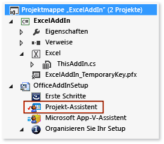
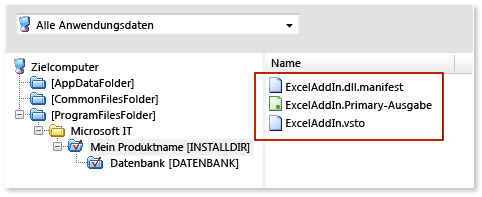
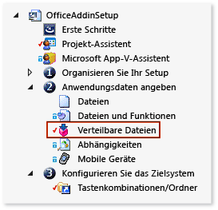

# <a name="deploy-an-office-solution-by-using-windows-installer"></a>Stellen Sie eine Office-Projekt Mappe mithilfe Windows Installer

Erfahren Sie, wie Sie mithilfe von [!INCLUDE[vs_dev12](../vsto/includes/vs-dev12-md.md)]einen Windows Installer für Ihre Office-Projektmappe erstellen.

Wenn Sie Visual Studio zum Erstellen eines Windows Installers verwenden, können Sie eine Office-Projektmappe bereitstellen, die Administratorberechtigungen auf dem Computer des Endbenutzers erfordert. Sie können eine solche Datei beispielsweise verwenden, um eine Projektmappe für alle Benutzer eines Computers nur einmal zu installieren. Sie können eine Office-Projektmappe auch mit ClickOnce bereitstellen, aber diese Projektmappe muss für jeden Benutzer des Computers getrennt installiert werden.

[!include[Add-ins note](includes/addinsnote.md)]

## <a name="in-this-topic"></a>In diesem Thema

- [Herunterladen von VSTO-Add-in-Beispielen](#Download)

- [Abrufen der InstallShield Limited-Edition](#Obtain)

- [Festlegen, wie der Projektmappe Vertrauenswürdigkeit gewährt werden soll](#ApplySecurity)

- [Erstellen eines Setup-Projekts](#Create)

- [Hinzufügen der Projektausgabe](#Add)

- [Hinzufügen der Bereitstellungs- und Anwendungsmanifeste](#AddD)

- [Konfigurieren der abhängigen Komponenten als erforderliche Komponenten](#Configure)

- [Specify where you want to deploy the solution on the user's computer](#Location)

- [Konfigurieren eines VSTO-Add-ins](#ConfigureRegistry)

- [Configure a Document-Level Customization](#ConfigureDocument)

- [Build the Setup Project](#Build)

Weitere Informationen zum Bereitstellen einer Office-Projekt Mappe mithilfe von ClickOnce finden Sie unter Bereitstellen einer Office-Projekt Mappe [mithilfe von ClickOnce](../vsto/deploying-an-office-solution-by-using-clickonce.md).

Informationen zum Erstellen einer Windows Installer Datei mithilfe von finden Sie unter Bereitstellen [!INCLUDE[vs_dev10_long](../sharepoint/includes/vs-dev10-long-md.md)] [einer Visual Studio 2010-Tools für Office](/previous-versions/visualstudio/visual-studio-2010/ff937654(v=msdn.10))-Projekt Mappe mithilfe von Windows Installer.

## <a name="download-samples"></a><a name="Download"></a>Herunterladen von Beispielen
In diesem Thema werden die folgenden herunterladbaren Beispiele erläutert.

|Beispiel<br /><br />|BESCHREIBUNG<br /><br />|
|----------|---------------|
|[ExcelAddIn](https://code.msdn.microsoft.com/VSTO-Deploy-an-Office-fbcc09ad)<br /><br />|Ein Excel VSTO-Add-In, das Sie auf einem Computer installieren können, der eine 32-Bit- oder 64-Bit-Version von Office ausführt.<br /><br />|
|[ExcelWorkbook](https://code.msdn.microsoft.com/VSTO-Deploy-a-Customization-f70fae33)<br /><br />|Eine Anpassung auf Dokumentebene in Excel, die Sie auf einem Computer installieren können, der eine 32-Bit- oder 64-Bit-Version von Office ausführt.<br /><br />|

## <a name="decide-how-to-grant-trust-to-the-solution"></a><a name="ApplySecurity"></a>Festlegen, wie der Projektmappe Vertrauenswürdigkeit gewährt werden soll
Bevor eine Projektmappe auf Benutzercomputern ausgeführt werden kann, müssen Sie Vertraulichkeit auf eine der nachfolgenden Weisen gewähren, oder Benutzer müssen auf eine vertrauenswürdige Eingabeaufforderung antworten, wenn Sie die Projektmappe installieren.

- Signieren Sie die Manifeste, indem Sie ein Zertifikat verwenden, das einen bekannten und vertrauenswürdigen Herausgeber identifiziert. Weitere Informationen finden Sie [unter Vertrauen der Lösung durch Signieren der Anwendungs-und Bereitstellungs Manifeste](../vsto/granting-trust-to-office-solutions.md#Signing).

- Installieren Sie die Projekt Mappe im Verzeichnis "Programme" auf dem Computer des Benutzers.

> [!NOTE]
> Bei Anpassungen auf Dokumentebene muss der Speicherort des Dokuments ebenfalls vertrauenswürdig sein. Weitere Informationen finden Sie unter [Gewähren von Vertrauenswürdigkeit für Dokumente](../vsto/granting-trust-to-documents.md).

## <a name="get-installshield-limited-edition"></a><a name="Obtain"></a>Abrufen der InstallShield Limited-Edition

Sie können eine Windows Installer-Datei erstellen, indem Sie InstallShield Limited Edition (ISLE) verwenden, das kostenlos ist, wenn Sie Visual Studio installiert haben. ISLE ersetzt die Funktionen der Projektvorlagen für Setup und Bereitstellung, die frühere Versionen von Visual Studio bereitstellten.

### <a name="to-get-installshield-limited-edition"></a>Abrufen der InstallShield Limited-Edition

1. Klicken Sie in der Menüleiste auf **Datei** > **Neu** > **Projekt**.

   Das Dialogfeld **Neues Projekt** wird angezeigt.

2. Erweitern Sie im Bereich "Vorlagen" **Andere Projekttypen**, und wählen Sie dann die Vorlage **Setup und Bereitstellung** aus.

3. Wählen Sie in der Liste der Projekttypen für **Setup und Bereitstellung**den Eintrag **InstallShield Limited Edition aktivieren**aus, und wählen Sie dann die Schaltfläche **OK** aus.

   Es wird eine Seite mit Informationen zum Abrufen der InstallShield Limited Edition angezeigt.

4. Wählen Sie auf dieser Seite den Link **Rufen Sie die Downloadwebsite auf** aus.

5. Klicken Sie auf der Downloadseite für InstallShield Limited Edition, geben Sie die erforderlichen Informationen in die entsprechenden Felder ein, und wählen Sie dann den Link **Jetzt herunterladen** aus.

   Nachdem Sie das Produkt heruntergeladen, installiert und aktiviert haben, wird die Vorlage **InstallShield Limited Edition Project** in Visual Studio angezeigt.

## <a name="create-a-setup-project"></a><a name="Create"></a>Erstellen eines Setup-Projekts

1. Öffnen Sie in [!INCLUDE[vsprvs](../sharepoint/includes/vsprvs-md.md)]das Office Project, das Sie bereitstellen möchten.

   Die Beispiele für VSTO-Add-Ins, die mit diesem Thema verknüpft sind, enthalten ein Projekt namens **ExcelAddIn**. Die Beispiele für die Anpassung auf Dokumentebene enthalten ein Projekt namens **ExcelWorkbook**. In diesem Thema wird auf das Office Project in der Projektmappe verwiesen, indem einer dieser beiden Namen verwendet wird.

2. Wählen Sie in der Menüleiste **Datei**  >  **Hinzufügen**  >  **Neues Projekt**aus.

   Das Dialogfeld **Neues Projekt hinzufügen** wird geöffnet.

3. Erweitern Sie im Bereich "Vorlagen" **Andere Projekttypen**, und wählen Sie dann die Vorlage **Setup und Bereitstellung** aus.

4. Wählen Sie in der Liste der Projekttypen für **Setup und Bereitstellung**den Eintrag **Projekt InstallShield Limited Edition**aus, benennen Sie das Projekt, und wählen Sie dann die Schaltfläche **OK** aus.

   Das InstallShield-Setup Projekt, das Sie erstellt haben, wird in der Projekt Mappe angezeigt.

   Die Beispiele für dieses Thema enthalten ein Setupprojekt mit dem Namen **OfficeAddInSetup**. In diesem Thema wird auf das Setupprojekt in der Projektmappe verwiesen, indem der gleiche Name verwendet wird.

## <a name="add-the-project-output"></a><a name="Add"></a>Hinzufügen der Projektausgabe

Sie konfigurieren das **OfficeAddInSetup** -Projekt, um die Ausgabe des Office Project einzuschließen. Für VSTO-Add-In-Projekte besteht die Projektausgabe nur aus der Projektmappenassembly. Für Anpassungsprojekte auf Dokumentebene umfasst die Projektausgabe nicht nur die Projektmappenassembly, sondern auch das Dokument selbst.

### <a name="to-add-the-project-output"></a>Hinzufügen der Projektausgabe

1. Erweitern Sie im **Projektmappen-Explorer**den Projektknoten **OfficeAddInSetup** , und wählen Sie dann die Datei **Projekt-Assistent** aus, die in der folgenden Abbildung dargestellt wird.

   

2. Wählen Sie in der Menüleiste **Ansicht**  >  **geöffnet**aus.

3. Wählen Sie am unteren Rand der Seite **Projekt-Assistent** die Schaltfläche **Anwendungsdateien** aus, die in der folgenden Abbildung dargestellt wird.

   

4. Wählen Sie auf der Seite **Anwendungsdateien** die Schaltfläche **Projektausgaben hinzufügen** aus.

5. Aktivieren Sie im Dialogfeld **Visual Studio Output Selector** das Kontrollkästchen **Primäre Ausgabe** , und wählen Sie anschließend die Schaltfläche **OK** aus.

## <a name="add-the-deployment-and-application-manifests"></a><a name="AddD"></a>Hinzufügen der Bereitstellungs- und Anwendungsmanifeste

1. Wählen Sie auf der Seite **Anwendungsdateien** die Schaltfläche **Dateien hinzufügen** aus.

2. Navigieren Sie im Dialogfeld **Öffnen** zum Ausgabeverzeichnis des Projekts **ExcelAddIn** .

   Normalerweise ist das Ausgabeverzeichnis je nach ausgewählter Buildkonfiguration der **bin\release** -Unterordner des Stammverzeichnisses für das Projekt.

3. Wählen Sie im Ausgabeverzeichnis die Dateien **ExcelAddIn.vsto** und **ExcelAddIn.dll.manifest** aus, und wählen Sie anschließend die Schaltfläche **Öffnen** aus.

   Die Seite **Anwendungsdateien** enthält jetzt die Projektausgabedatei, das Bereitstellungsmanifest und das Anwendungsmanifest, wie in der folgenden Abbildung veranschaulicht.

   

## <a name="configure-the-dependent-components-as-prerequisites"></a><a name="Configure"></a>Konfigurieren der abhängigen Komponenten als erforderliche Komponenten

Sie müssen nicht nur die folgenden Komponenten in die Setupanwendung einschließen, sondern auch andere Komponenten, die für die Ausführung der Lösung erforderlich sind.

- Die Version von .NET Framework, die die Office-Projektmappe als Zielversion verwendet.

- Microsoft Visual Studio 2010-Tools für Office-Laufzeit.

### <a name="add-the-net-framework-4-or-the-net-framework-45-as-a-prerequisite"></a>Fügen Sie den .NET Framework 4 oder den .NET Framework 4,5 als Voraussetzung hinzu.

1. Erweitern Sie im **Projektmappen-Explorer**den Projektknoten **OfficeAddInSetup** , erweitern Sie den Knoten **Anwendungsdaten festlegen** , und wählen Sie dann die Datei **Verteilbare Komponenten** aus, wie in der folgenden Abbildung dargestellt.

   

2. Wählen Sie in der Menüleiste **Ansicht**  >  **geöffnet**aus.

   Die Seite **Verteilbare Komponenten** wird geöffnet.

3. Aktivieren Sie in der Liste der verteilbaren Komponenten das entsprechende Kontrollkästchen für die Version von .NET Framework, die die Projektmappe als Zielversion verwendet.

   Wenn die Projektmappe beispielsweise auf [!INCLUDE[net_v45](../vsto/includes/net-v45-md.md)]abzielt, aktivieren Sie das Kontrollkästchen **Microsoft .NET Framework 4.5 Full** . Es wird möglicherweise ein Dialogfeld angezeigt, das Sie dazu auffordert, anzugeben, ob Sie die für InstallShield erforderliche verteilbare Komponente installieren möchten, bevor Sie die Komponente als erforderliche Komponente hinzufügen können. Wenn dieses Dialogfeld nicht angezeigt wird, ist die Komponente bereits auf dem Computer vorhanden.

4. Wenn das Dialogfeld angezeigt wird, wählen Sie die Schaltfläche **Nein** aus.

### <a name="add-the-visual-studio-2010-tools-for-office-runtime"></a><a name="AddToolsForOffice"></a>Hinzufügen von Visual Studio 2010-Tools für Office-Laufzeit

Die Seite **Verteilbare Komponenten** enthält ein Element mit dem Namen **Microsoft VSTO 2010-Laufzeit**, verweist jedoch auf eine frühere Version der Laufzeit. Daher müssen Sie manuell eine Konfigurationsdatei erstellen, die auf die neueste Version verweist. Sie müssen diese Datei anschließend im selben Verzeichnis wie die Konfigurationsdateien für alle anderen Elemente ablegen, die auf der Seite **Verteilbare Komponenten** angezeigt werden.

#### <a name="to-add-the-visual-studio-2010-tools-for-office-runtime-as-a-prerequisite"></a>So fügen Sie die Visual Studio 2010-Tools für Office-Laufzeit als erforderliche Komponente hinzu

1. Öffnen Sie Editor, und fügen Sie dann den folgenden XML-Code in eine Textdatei ein.

   ```xml
   <?xml version="1.0" encoding="UTF-8"?>
   <SetupPrereq>
   <conditions>
       <condition Type="32" Comparison="2" Path="HKEY_LOCAL_MACHINE\SOFTWARE\Microsoft\VSTO Runtime Setup\v4R" FileName="Version" ReturnValue="10.0.50903" Bits="2"></condition>
   <condition Type="32" Comparison="2" Path="HKEY_LOCAL_MACHINE\SOFTWARE\Wow6432Node\Microsoft\VSTO Runtime Setup\v4R" FileName="Version" ReturnValue="10.0.50903" Bits="2"></condition>
   </conditions>
   <files>
       <file LocalFile="<ISProductFolder>\SetupPrerequisites\VSTOR\vstor_redist.exe" URL="http://download.microsoft.com/download/C/0/0/C001737F-822B-48C2-8F6A-CDE13B4B9E9C/vstor_redist.exe" CheckSum="88b8aa9e8c90818f98c80ac4dd998b88" FileSize=" 0,40117912"></file>
   </files>
   <execute file="vstor_redist.exe" returncodetoreboot="1641,3010" requiresmsiengine="1">
   </execute>
   <properties Id="{15965040-56BB-49B8-A88F-3525C48D9BA8}" Description="This prerequisite installs the most recent version of the Microsoft Visual Studio 2010 Tools for Office Runtime." >
   </properties>

   </SetupPrereq>
   ```

2. Generieren Sie eine GUID in Visual Studio. Wählen Sie im Menü **Extras** den Befehl **GUID erstellen**aus.

3. Aktivieren Sie im Programm **GUID-Generator** das Optionsfeld **Registrierungsformat** , wählen Sie die Schaltfläche **Kopieren** und dann die Schaltfläche **Beenden** aus.

4. Ersetzen Sie in Editor den Text **Your GUID goes here** , indem Sie die GUID an seiner Stelle einfügen.

   Das ** &lt; Properties &gt; ** -Element der Datei ähnelt dem folgenden.

   ```xml
   <properties Id="{87989B73-21DC-4403-8FD1-0C68A41A6D8C}" Description="This prerequisite installs the most recent version of the Microsoft Visual Studio 2010 Tools for Office Runtime." >
   </properties>
   ```

5. Wählen Sie auf der Menüleiste in Editor die Option **Datei**  >  **Speichern**aus.

6. Navigieren Sie im Dialogfeld **Speichern unter** zu dem Ordner **Desktop** .

7. Wählen Sie in der Liste **Dateityp** die Option **alle Dateien (&#42;. &#42;)** aus.

8. Geben Sie im Feld **Dateiname****Visual Studio 2010 Tools for Office Runtime.prq**ein, und klicken Sie dann auf die Schaltfläche **Speichern** .

   > [!NOTE]
   > Stellen Sie sicher, dass Sie **.prq** am Ende des Dateinamens hinzufügen, um diese Datei als erforderliche Datei zu identifizieren.

9. Schließen Sie den Editor.

10. Kopieren Sie in Ihrem **Desktop** Ordner die Datei *Visual Studio 2010 Tools for Office Runtime. prq* in eines der folgenden Verzeichnisse auf dem Computer.

   Für 32-Bit-Betriebssysteme: *%ProgramFiles%\installshield\2013le\setupvoraussetzungen \\ *

   Bei 64-Bit-Betriebssystemen: *% Program Files (x86)% \ 2013le \ Setupvoraussetzungen \\ *

11. Wählen Sie auf der Seite **Verteilbare Komponente** des InstallShield-Projekts die Schaltfläche **Aktualisieren** aus, um die Liste der verteilbaren Komponenten zu aktualisieren, wie in der folgenden Abbildung veranschaulicht.

   

12. Aktivieren Sie in der Liste der verteilbaren Komponenten das Kontrollkästchen. **Visual Studio 2010-Tools für Office-Laufzeit** .

   Möglicherweise wird ein Dialogfeld angezeigt, in dem Sie aufgefordert werden, die verteilbare Komponente zu installieren. Wenn dieses Dialogfeld nicht angezeigt wird, können Sie im Abschnitt [angeben, wo die Lösung auf dem Computer des Benutzers](#Location) bereitgestellt werden soll in diesem Thema fortfahren.

13. Wenn das Dialogfeld angezeigt wird, wählen Sie die Schaltfläche **Nein** aus.

## <a name="specify-where-to-install-the-solution-on-the-users-computer"></a><a name="Location"></a>Festlegen, wo die Projektmappe auf dem Computer des Benutzers installiert werden soll

1. Erweitern Sie im **Projektmappen-Explorer**den Knoten **OfficeAddInSetup** , erweitern Sie den Knoten **Setup organisieren** , und wählen Sie dann die Datei **Allgemeine Informationen** aus.

2. Wählen Sie in der Menüleiste **Ansicht**  >  **geöffnet**aus.

3. Wählen Sie in der Liste der Eigenschaften die Schaltfläche **Durchsuchen** neben der Eigenschaft **INSTALLDIR** aus.

4. Wählen Sie im Dialogfeld **INSTALLDIR festlegen** einen Ordner auf dem Computer des Benutzers aus, in dem die Projekt Mappe installiert werden soll.

   > [!NOTE]
   > Sie können auch Unterverzeichnisse im Dialogfeld **INSTALLDIR festlegen** erstellen, indem Sie das Kontextmenü für einen beliebigen Ordner in der Liste öffnen.

## <a name="configure-a-vsto-add-in"></a><a name="ConfigureRegistry"></a>Konfigurieren eines VSTO-Add-ins

Sie können festlegen, ob Ihr VSTO-Add-In für alle Benutzer auf dem Computer (pro Computer) installiert wird, oder nur für den Benutzer, der die Installation durchführt (pro Benutzer).

Wenn Sie Installationen pro Computer unterstützen möchten, erstellen Sie zwei separate Installationsprogramme. Sie können Installationsprogramme auf Grundlage der Office-Version (32 Bit und 64 Bit) oder der Windows-Version (32 Bit und 64 Bit), die vom Benutzer ausgeführt wird, unterteilen.

Installationen pro Benutzer erfordern nur ein Installationsprogramm, unabhängig von der Office- oder Windows-Version.

> [!NOTE]
> Dieser Abschnitt gilt nur, wenn Sie ein VSTO-Add-in bereitstellen. Wenn Sie eine Anpassung auf Dokument Ebene bereitstellen, können Sie sofort zum Abschnitt [Konfigurieren einer Anpassung auf Dokument Ebene](#ConfigureDocument) wechseln.

### <a name="to-specify-whether-you-want-to-support-per-user-or-per-computer-installations"></a>So legen Sie fest, ob Installationen pro Benutzer oder pro Computer unterstützt werden sollen

1. Erweitern Sie im **Projektmappen-Explorer**den Projektknoten **OfficeAddInSetup** , erweitern Sie den Knoten **Setup organisieren** , und wählen Sie dann die Datei **Allgemeine Informationen** aus.

2. Wählen Sie in der Menüleiste **Ansicht**  >  **geöffnet**aus.

   Die Eigenschaften für das Setupprojekt werden angezeigt.

3. Legen Sie in für die Eigenschaft **AllUSERS** fest, ob diese Lösung für alle Benutzer des Computers oder nur für den Benutzer installiert werden soll, der die Projektmappe installiert.

   Um das VSTO-Add-in für den aktuellen Benutzer zu installieren, wählen Sie **ALLUSERS = "" (pro Benutzer-Installation)** aus. Um das VSTO-Add-In für alle Benutzer des Computers zu installieren, wählen Sie **ALLUSERS=1 ("Pro Computer"-Installation)** aus.

   Im nächsten Verfahren erstellen Sie Registrierungsschlüssel, damit die Office-Anwendung das VSTO-Add-in ermitteln und laden kann. Weitere Informationen finden [Sie unter Registrierungseinträge für VSTO-Add-ins](../vsto/registry-entries-for-vsto-add-ins.md).

### <a name="to-create-registry-keys"></a>So erstellen Sie Registrierungsschlüssel

1. Wählen Sie im **Projektmappen-Explorer**den Knoten **Projekt-Assistenten** aus.

   Wählen Sie in der Menüleiste **Ansicht**  >  **geöffnet**aus.

2. Wählen Sie am unteren Rand der Seite **Projekt-Assistent** die Schaltfläche **Anwendungsregistrierung** aus, wie in der folgenden Abbildung veranschaulicht.

   

   Die Seite **Anwendungsregistrierung** wird angezeigt.

3. Wählen Sie unter **Möchten Sie die Registrierungsdaten konfigurieren, die die Anwendung installiert?** das Optionsfeld **Ja** aus.

4. Fügen Sie in der Liste **Registrierungs Ansicht des Ziel Computers** die Schlüssel Hierarchie hinzu, die den Typ des Installationsprogramms ermöglicht, das Sie erstellen möchten.

   Der Pfad, den Sie in diesem Abschnitt konfigurieren, hängt davon ab, ob Sie ein Installationsprogramm pro Benutzer oder pro Computer erstellen.

   **Installationsprogramm pro Benutzer**

   **HKEY_CURRENT_USER \software\microsoft\office\excel\addins\samplecompany.ExcelAddIn**

   **Installationsprogramme pro Computer basierend auf der Office-Version**

| Office-Version<br /><br /> | InstallShield-Konfigurationspfad<br /><br /> |
|----------------------------| - |
| 32 Bit<br /><br /> | **HKEY_LOCAL_MACHINE \SOFTWARE (32-Bit) \microsoft\office\excel\addins\samplecompany.ExcelAddIn**<br /><br /> |
| 64 Bit<br /><br /> | **HKEY_LOCAL_MACHINE \SOFTWARE (64-Bit) \microsoft\office\excel\addins\samplecompany.ExcelAddIn**<br /><br /> |

   **Installationsprogramme pro Computer basierend auf der Windows-Version**

| Windows-Version<br /><br /> | InstallShield-Konfigurationspfad<br /><br /> |
|-----------------------------| - |
| 32 Bit<br /><br /> | **HKEY_LOCAL_MACHINE \SOFTWARE (32-Bit) \microsoft\office\excel\addins\samplecompany.ExcelAddIn**<br /><br /> |
| 64 Bit<br /><br /> | **HKEY_LOCAL_MACHINE \SOFTWARE (32-Bit) \microsoft\office\excel\addins\samplecompany.ExcelAddIn**<br /><br />**HKEY_LOCAL_MACHINE \SOFTWARE (64-Bit) \microsoft\office\excel\addins\samplecompany.ExcelAddIn**<br /><br /> |

   > [!NOTE]
   > Für ein Installationsprogramm für 64-Bit-Windows sind zwei Registrierungs Pfade erforderlich, da es Benutzern möglich ist, 32-Bit-und 64-Bit-Versionen von Office auf einem Computer auszuführen, auf dem 64-Bit-Windows ausgeführt wird.

   > [!NOTE]
   > Es wird empfohlen, den Namen des VSTO-Add-Ins mit dem Namen Ihres Unternehmens zu beginnen. Diese Konvention erhöht die Wahrscheinlichkeit, dass der Schlüssel eindeutig ist, und verringert die Wahrscheinlichkeit eines Konflikts mit einem VSTO-Add-in von einem anderen Lieferanten. Add-Ins mit demselben Namen können die jeweils anderen Registrierungsschlüssel beispielsweise überschreiben. Dieser Ansatz kann nicht garantieren, dass der Schlüssel eindeutig ist, jedoch kann potenzielle Namenskonflikte reduzieren.

5. Nachdem Sie die Hierarchie der Schlüssel erstellt haben, öffnen Sie das Kontextmenü für den Schlüssel **SampleCompany. ExcelAddIn** , wählen Sie **neu**aus, und wählen Sie dann **Zeichen folgen Wert**aus.

   Der neue Zeichen folgen Wert wird in **der Registrierungsdaten Liste des Ziel Computers** angezeigt. Der Name des Zeichenfolgenwerts wird hervorgehoben, damit Sie ihn umbenennen können.

6. Benennen Sie den Wert in **Beschreibung**um.

7. Wiederholen Sie diesen Vorgang, um die folgenden Werte zu erstellen.

|Werttyp<br /><br />|name<br /><br />|
|--------------|--------|
|Zeichenfolgenwert<br /><br />|**FriendlyName**<br /><br />|
|DWORD-Wert<br /><br />|**LoadBehavior**<br /><br />|
|Zeichenfolgenwert<br /><br />|**Manifest**<br /><br />|

8. Öffnen Sie das Kontextmenü für den Wert **Beschreibung** , und wählen Sie dann **Ändern**aus.

   Das Dialogfeld **Daten bearbeiten** wird angezeigt.

9. Geben Sie im Textfeld **Wertdaten** die Zeichenfolge **Excel-Demo-Add-In**ein, und wählen Sie dann die Schaltfläche **OK** aus.

   Diese Beschreibung wird angezeigt, wenn der Benutzer die Office-Anwendung öffnet, das Dialogfeld **Optionen** öffnet und anschließend das VSTO-Add-In im Bereich **Add-Ins** auswählt.

10. Öffnen Sie das Kontextmenü für den Wert **FriendlyName** , und wählen Sie dann **Ändern**aus.

   Das Dialogfeld **Daten bearbeiten** wird angezeigt.

11. Geben Sie im Textfeld **Wertdaten** die Zeichenfolge **Excel-Demo-Add-In**ein, und wählen Sie dann die Schaltfläche **OK** aus.

   Diese Zeichenfolge wird im Dialogfeld **COM-Add-Ins** in der Office-Anwendung angezeigt. Standardmäßig ist der Wert der Zeichenfolge die ID des VSTO-Add-Ins.

12. Öffnen Sie das Kontextmenü für den Wert **LoadBehavior** , und wählen Sie dann **Ändern**aus.

   Das Dialogfeld **Daten bearbeiten** wird angezeigt.

13. Geben Sie im Textfeld **Wertdaten****3**ein, und wählen Sie dann die Schaltfläche **OK** aus.

   Der Wert "3" lädt das VSTO-Add-In beim Starten der Anwendung. Weitere Informationen zu LoadBehavior-Werten finden [Sie unter Registrierungseinträge für VSTO-Add-ins](../vsto/registry-entries-for-vsto-add-ins.md).

14. Öffnen Sie das Kontextmenü für den Wert **Manifest** , und wählen Sie dann **Ändern**aus.

   Das Dialogfeld **Daten bearbeiten** wird angezeigt.

15. Geben Sie im Textfeld **Wertdaten****file:///[INSTALLDIR]ExcelAddIn.vsto|vstolocal**ein, und wählen Sie anschließend die Schaltfläche **OK** aus.

   Visual Studio 2010 Tools for Office-Laufzeit verwendet diesen Pfad, um das Bereitstellungsmanifest zu suchen. Der Teil **[INSTALLDIR]** dieses Pfads ist ein Makro, das auf die Eigenschaft **INSTALLDIR** auf der Eigenschaftenseite **Allgemeine Informationen** des InstallShield-Setupprojekts verweist. Diese Eigenschaft gibt den Speicherort auf dem Zielcomputer für die Installation des VSTO-Add-Ins an. Das Suffix **|vstolocal** stellt sicher, dass die Projektmappe aus dem Installationsordner und nicht aus dem ClickOnce-Cache geladen wird.

> [!IMPORTANT]
> Wenn Sie einen benutzerdefinierten Formular Bereich in einem VSTO-Add-in für Outlook erstellen, müssen Sie weitere Registrierungseinträge erstellen, um die Region bei Outlook zu registrieren. Weitere Informationen finden Sie unter [Registrierungseinträge für Outlook-Formular Bereiche](../vsto/registry-entries-for-vsto-add-ins.md#OutlookEntries).

## <a name="configure-a-document-level-customization"></a><a name="ConfigureDocument"></a>Configure a Document-Level Customization

Dieser Abschnitt gilt nur, wenn Sie eine Anpassung auf Dokument Ebene bereitstellen. Wenn Sie ein VSTO-Add-in bereitstellen, können Sie sofort zum Abschnitt [Erstellen des Setup Projekts](#Build) wechseln.

Anpassungen auf Dokument Ebene verwenden keine Registrierungsschlüssel. Stattdessen enthalten benutzerdefinierte Dokumenteigenschaften den Speicherort des Bereitstellungsmanifests.

Um benutzerdefinierte Eigenschaften zu ändern, erstellen Sie ein Programm, das die Anpassung auf Dokument Ebene aus dem Dokument entfernt, die entsprechenden Eigenschaften ändert und die Anpassung anschließend erneut an das Dokument anfügt. Dann erstellen Sie eine benutzerdefinierte Aktion, die das Programm ausführt, und fügen Sie dem Setupprojekt diese Aktion hinzu.

### <a name="to-create-a-program-that-modifies-document-properties"></a>Erstellen eines Programms, das Dokumenteigenschaften ändert

1. Wählen Sie in der Menüleiste **Datei**  >  **Hinzufügen**  >  **Neues Projekt**aus.

   Das Dialogfeld **Neues Projekt hinzufügen** wird angezeigt.

2. Wählen Sie im Vorlagenbereich unter dem Knoten der zu verwendenden Sprache den Ordner **Windows** aus.

3. Wählen Sie in der Liste der Projekttypen für **Windows**die Vorlage **Konsolenanwendung** aus.

4. Geben Sie dem Projekt den Namen **SetExcelDocumentProperties**, und wählen Sie dann die Schaltfläche **OK** aus.

5. Wählen Sie im **Projektmappen-Explorer**die Schaltfläche **Alle Dateien anzeigen** aus, öffnen Sie das Kontextmenü für den Projektknoten **SetExcelDocumentProperties** , und aktivieren Sie dann **Verweis hinzufügen**.

6. Wählen Sie im Dialogfeld **Verweis-Manager** die Registerkarte **Erweiterungen** aus, aktivieren Sie das Kontrollkästchen neben den folgenden Assemblys, und wählen Sie dann die Schaltfläche **OK** aus.

   - Microsoft.VisualStudio.Tools.Applications.Runtime

   - Microsoft.VisualStudio.Tools.Applications.ServerDocument

7. Wählen Sie im **Projektmappen-Explorer**die Datei **Program.cs** (für C#-Anwendungen) oder die Datei **Module1.vb** (für Visual Basic-Anwendungen) aus.

8. Wählen Sie in der Menüleiste **Ansicht**  >  **geöffnet**aus.

9. Ersetzen Sie den Inhalt der gesamten Inhalt durch den folgenden Code.

[!code-vb[Trin_CustomAction#1](../vsto/codesnippet/VisualBasic/setexceldocumentproperties/module1.vb#1)]
[!code-csharp[Trin_CustomAction#1](../vsto/codesnippet/CSharp/setexceldocumentproperties/program.cs#1)]

10. Kompilieren Sie das Projekt.

### <a name="to-add-a-custom-action-that-runs-your-program"></a>Hinzufügen einer benutzerdefinierte Aktion, die das Programm ausgeführt

1. Erweitern Sie im **Projektmappen-Explorer**den Projektknoten **OfficeAddInSetup** , und wählen Sie dann die Datei **Projekt-Assistent** aus, die in der folgenden Abbildung dargestellt wird.

   

2. Wählen Sie in der Menüleiste **Ansicht**  >  **geöffnet**aus.

3. Wählen Sie am unteren Rand der Seite **Projekt-Assistent** die Schaltfläche **Anwendungsdateien** aus, die in der folgenden Abbildung dargestellt wird.

   

4. Wählen Sie auf der Seite **Anwendungsdateien** die Schaltfläche **Projektausgaben hinzufügen** aus.

   Das Dialogfeld **Visual Studio Output Selector** wird angezeigt.

5. Aktivieren Sie unter dem Knoten **SetExcelDocumentProperties** das Kontrollkästchen **Primäre Ausgabe** , und wählen Sie dann die Schaltfläche **OK** aus.

6. Erweitern Sie im **Projektmappen-Explorer**unter dem Knoten **OfficeAddInSetup** den Knoten **Installationsanforderungen und Aktionen definieren** , und wählen Sie dann den Ordner **Benutzerdefinierte Aktionen** aus.

7. Wählen Sie in der Menüleiste **Ansicht**  >  **geöffnet**aus.

   In einem Bereich an der Seite des Bildschirms wird eine Liste der Ereignisse angezeigt.

   > [!NOTE]
   > In InstallShield Limited Edition sind nur einige der in dieser Liste angezeigten Ereignisse verfügbar. In diesem Verfahren führen Sie das Programm aus, indem Sie das Ereignis Dialogfeld nach erfolgreichem **Abschluss des Setups** verwenden.

8. Öffnen Sie in der Liste der Ereignisse unter **Benutzerdefinierte Aktionen während der Installation**das Kontextmenü für das Ereignis **Dialogfeld nach erfolgreichem Abschluss des Setups** , und wählen Sie dann **Neue EXE**aus.

   Unter dem Ereignis **Dialogfeld nach erfolgreichem Abschluss des Setups** wird eine benutzerdefinierte Aktion namens **NewCustomAction1** angezeigt. In einem Bereich neben den Ereignissen wird ein Eigenschaftensatz für die benutzerdefinierte Aktion angezeigt.

   > [!IMPORTANT]
   > In der Liste der Eigenschaften wird das Ereignis **Dialogfeld nach erfolgreichem Abschluss des Setups** zweimal angezeigt. Stellen Sie sicher, dass Sie die Instanz des Ereignisses **Dialogfeld nach erfolgreichem Abschluss des Setups** auswählen, das unter dem Knoten **Benutzerdefinierte Aktionen während der Installation** angezeigt wird.

9. In der Liste für die Eigenschaft **Quellort** , wählen Sie **Mit dem Produkt installiert**aus.

10. Wählen Sie die Schaltfläche **Durchsuchen** neben der Eigenschaft **Dateiname** aus.

11. Navigieren Sie im Dialogfeld **Nach Zieldatei suchen** zu der Datei **SetExcelDocumentProperties.Primary.output** , und wählen Sie dann die Schaltfläche **Öffnen** aus.

    Der Speicherort dieser Datei hängt vom dem Ordner ab, den Sie für die Eigenschaft **INSTALLDIR** des Setupprojekts angegeben haben. Wenn Sie diese Eigenschaft beispielsweise für einen Ordner mit dem Namen **[PersonalFolder]DemoWorkbookApp**angegeben haben, finden Sie die Datei **SetExcelDocumentProperties.Primary.output** , indem Sie zu **[ProgramFilesFolder]\DemoWorkbookApp**navigieren.

    In den nächsten Schritten erhalten Sie die Lösungs-ID des Dokuments und übergeben diese ID als Parameter an die Konsolenanwendung. Außerdem übergeben Sie den Speicherort des Dokuments, das Bereitstellungs Manifest und die Dokumentassembly.

12. Öffnen Sie das Kontextmenü für das Projekt **ExcelWorkbook** , und wählen Sie dann je nach Betriebssystem **Ordner in Windows Explorer öffnen** oder **Ordner in Datei-Explorer öffnen** aus.

    Der Ordner, der die Projektmappe enthält, wird geöffnet.

13. Öffnen Sie die Projektdatei der Projektmappe in Editor. Für Visual Basic Projekte ist der Name der Datei " *ExcelWorkbook. vbproj*". Für c#-Projekte ist der Name der Datei " *ExcelWorkbook. csproj*".

14. Suchen Sie in der Projektdatei nach dem ** &lt; SolutionId &gt; ** -Element, kopieren Sie den Wert in die Zwischenablage, und schließen Sie dann Editor.

    Übergeben Sie diesen Wert in der Konsolen-App als Parameter.

15. Legen Sie auf der Eigenschaftenseite **NewCustomAction1**die Eigenschaft **Befehlszeile** auf die folgende Textzeile fest.

   ```cmd
   /assemblyLocation="[INSTALLDIR]ExcelWorkbook.dll" /deploymentManifestLocation="[INSTALLDIR]ExcelWorkbook.vsto" /documentLocation="[INSTALLDIR]ExcelWorkbook.xlsx" /solutionID="Your Solution ID"
   ```

16. Ersetzen Sie **Your Solution ID** durch die Projektmappen-ID, die Sie in die Zwischenablage kopiert haben.

   > [!IMPORTANT]
   > Testen Sie das Installationsprogramm, um sicherzustellen, dass die Konsolenanwendung, die diese benutzerdefinierte Aktion ausführt, auf Dokumente im [INSTALLDIR-] Verzeichnis zugreifen kann. Einige Verzeichnisse auf dem Computer des Benutzers erfordern möglicherweise Administrator Zugriff (z. b. das Verzeichnis "Programme"). Wenn Sie die Projekt Mappe in einem Verzeichnis bereitstellen, das Administrator Zugriff erfordert, öffnen Sie das Dialogfeld **Eigenschaften** der Datei *setup.exe* , wählen Sie die Registerkarte **Kompatibilität** , und aktivieren Sie dann das Kontrollkästchen **dieses Programm als Administrator ausführen** , bevor Sie das Installationsprogramm verteilen. Wenn Sie nicht möchten, dass Benutzer das Setup Programm mit Administrator Berechtigungen ausführen, legen Sie die [INSTALLDIR]-Eigenschaft auf ein Verzeichnis fest, auf das der Benutzer wahrscheinlich bereits Zugriff hat, wie z. b. das Verzeichnis " **Dokumente** ". Weitere Informationen finden Sie im Abschnitt [angeben, wo die Lösung auf dem Computer des Benutzers installiert werden soll](#Location) in diesem Thema.

## <a name="build-the-setup-project"></a><a name="Build"></a>Build the Setup Project

1. Erweitern Sie im **Projektmappen-Explorer**den Knoten **Vorbereiten der Version** , und wählen Sie dann die Datei **Versionen** aus.

2. Wählen Sie in der Menüleiste **Ansicht**  >  **geöffnet**aus.

   Der Explorer für **Builds** wird in einem Seitenbereich geöffnet, damit Sie den Typ der zu erstellenden Version auswählen können.

3. Wählen Sie im Explorer für **Builds** den Ordner **SingleImage** aus.

4. Wählen Sie im Bereich neben dem Explorer für **Builds** die Registerkarte **Setup.exe** aus.

5. Wählen Sie auf der Eigenschaftenseite **Setup.exe** aus der Liste **Speicherort der erforderlichen InstallShield-Komponenten** den Eintrag **Aus dem Internet herunterladen**aus.

6. Klicken Sie in der Menüleiste auf **Build** > **Konfigurations-Manager**.

7. Wählen Sie in der Liste **Konfiguration der aktuellen Projektmappe** den Eintrag **SingleImage**aus.

8. Wählen Sie in der Tabelle **Projektkontext** in der Spalte **Konfiguration** des Projekts **OfficeAddInSetup****SingleImage**aus, und aktivieren Sie anschließend die Schaltfläche **Schließen** .

9. Klicken Sie in der Menüleiste auf **Build**  >  **Erstellen officeaddinsetup**.

   Nachdem der Build abgeschlossen wurde, können Sie die *setup.exe* -Datei des Projekts **officeaddinsetup** am folgenden Speicherort suchen: <em>officeaddinsetupprojectroot</em>**\officeaddinsetup\express \\ \singleimage\diskimages\disk1**

## <a name="see-also"></a>Siehe auch

- [Office-Lösungs Voraussetzungen für die Bereitstellung](/previous-versions/bb608617(v=vs.110))
- [Bereitstellen einer Office-Projekt Mappe](../vsto/deploying-an-office-solution.md)
- [Registrierungseinträge für VSTO-Add-ins](../vsto/registry-entries-for-vsto-add-ins.md)
- [Übersicht über benutzerdefinierte Dokumenteigenschaften](../vsto/custom-document-properties-overview.md)
- [Gewähren von Vertrauenswürdigkeit für Office-Lösungen](../vsto/granting-trust-to-office-solutions.md)
- [Gewähren von Vertrauenswürdigkeit für Dokumente](../vsto/granting-trust-to-documents.md)
- [Bereitstellen einer Visual Studio 2010-Tools für Office-Projekt Mappe mit Windows Installer](/previous-versions/visualstudio/visual-studio-2010/ff937654(v=msdn.10))