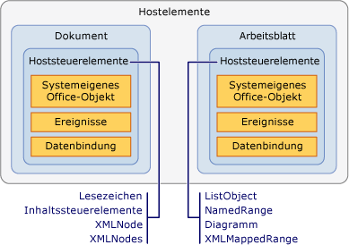

# &#220;bersicht &#252;ber Hostelemente und Hoststeuerelemente
  Hostelemente und Hoststeuerelemente sind Programmierelemente, die die Bereitstellung des Programmiermodells für Office\-Projektmappen ermöglichen, die mithilfe der Office\-Entwicklungstools in Visual Studio erstellt werden. Hostelemente und Hoststeuerelemente vereinfachen die Interaktion zwischen Objektmodellen von Microsoft Office Word und Microsoft Office Excel \(COM\-basiert\) und verwalteten Objekten wie Windows Forms\-Steuerelementen.  
  
 [!INCLUDE[appliesto_controls](../vsto/includes/appliesto-controls-md.md)]  
  
## Hostelemente  
 Hostelemente sind Programmiertypen, die in den Objektmodellhierarchien in Office\-Projekten ganz oben angesiedelt sind.[!INCLUDE[vsto_runtime](../vsto/includes/vsto-runtime-md.md)] definiert die folgenden Hostelemente für Word\- und Excel\-Projektmappen:  
  
-   <xref:Microsoft.Office.Tools.Word.Document>  
  
-   <xref:Microsoft.Office.Tools.Excel.Workbook>  
  
-   <xref:Microsoft.Office.Tools.Excel.Worksheet>  
  
-   <xref:Microsoft.Office.Tools.Excel.ChartSheet>  
  
 Jeder dieser Typen erweitert ein Objekt, das als systemeigenes Objekt im Word\- oder Excel\-Objektmodell vorhanden ist und als *systemeigenes Office\-Objekt* bezeichnet wird. Das <xref:Microsoft.Office.Tools.Word.Document>\-Hostelement erweitert beispielsweise das <xref:Microsoft.Office.Interop.Word.Document>\-Objekt, das in der primären Interopassembly für Word definiert ist.  
  
 Hostelemente verfügen im Allgemeinen über dieselben Standardfunktionen wie die entsprechenden Office\-Objekte, wurden jedoch durch folgende Features ergänzt:  
  
-   Die Fähigkeit, verwaltete Steuerelemente, einschließlich Hoststeuerelementen und Windows Forms\-Steuerelementen, zu hosten.  
  
-   Umfangreichere Ereignismodelle. Einige Dokument\-, Arbeitsmappen und Arbeitsblattereignisse in systemeigenen Word\- und Excel\-Objektmodellen werden nur auf Anwendungsebene ausgelöst. Hostelemente stellen diese Ereignisse auf Dokumentebene bereit, damit es einfacher ist, die Ereignisse für ein bestimmtes Dokument zu behandeln.  
  
### Grundlegendes zu Hostelementen in Projekten auf Dokumentebene  
 In Projekten auf Dokumentebene stellen Hostelemente einen Einstiegspunkt für den Code bereit. Außerdem verfügen sie über Designer, die Sie bei der Umsetzung Ihrer Projektmappen unterstützen.  
  
 Den Hostelementen <xref:Microsoft.Office.Tools.Word.Document> und <xref:Microsoft.Office.Tools.Excel.Worksheet> sind Designer zugeordnet, die einer visuellen Darstellung des Dokuments oder Arbeitsblatts entsprechen, ähnlich einem Windows Forms\-Designer. Sie können diesen Designer verwenden, um den Inhalt des Dokuments oder Arbeitsblatts direkt in Word oder Excel zu ändern und um Steuerelemente auf die Entwurfsoberfläche zu ziehen. Weitere Informationen finden Sie unter [Dokumenthostelement](../vsto/document-host-item.md) und [Arbeitsblatthostelement](../vsto/worksheet-host-item.md).  
  
 Das Hostelement <xref:Microsoft.Office.Tools.Excel.Workbook> dient nicht als Container für Steuerelemente, die über eine Benutzeroberfläche verfügen. Stattdessen fungiert der Designer für dieses Hostelement als Komponentenleiste, mit der Sie eine Komponente, z. B. eine <xref:System.Data.DataSet>, auf die Entwurfsoberfläche ziehen können. Weitere Informationen finden Sie unter [Arbeitsmappenhostelement](../vsto/workbook-host-item.md).  
  
 Hostelemente können nicht programmgesteuert in Projekten auf Dokumentebene erstellt werden. Stattdessen verwenden Sie die Klassen `ThisDocument`, `ThisWorkbook`, oder `Sheet`*n*, die von Visual Studio zur Entwurfszeit automatisch im Projekt generiert werden. Diese generierten Klassen werden von Hostelementen abgeleitet und bieten einen Einstiegspunkt für den Code. Weitere Informationen finden Sie unter [Programmgesteuerte Einschränkungen von Hostelementen und Hoststeuerelementen](../vsto/programmatic-limitations-of-host-items-and-host-controls.md).  
  
### Grundlegendes zu Hostelementen in VSTO\-Add\-In\-Projekten  
 Wenn Sie ein VSTO\-Add\-In erstellen, haben Sie standardmäßig keinen Zugriff auf Hostelemente. Sie können zur Laufzeit jedoch die Hostelemente <xref:Microsoft.Office.Tools.Word.Document>, <xref:Microsoft.Office.Tools.Excel.Workbook> und <xref:Microsoft.Office.Tools.Excel.Worksheet> in Word\- und Excel\-VSTO\-Add\-Ins generieren.  
  
 Nachdem Sie ein Hostelement generiert haben, können Sie Aufgaben wie das Hinzufügen von Steuerelementen zu Dokumenten ausführen. Weitere Informationen finden Sie unter [Erweitern von Word-Dokumenten und Excel-Arbeitsmappen in VSTO-Add-Ins zur Laufzeit](../vsto/extending-word-documents-and-excel-workbooks-in-vsto-add-ins-at-run-time.md).  
  
## Hoststeuerelemente  
 Hoststeuerelemente erweitern verschiedene Benutzeroberflächenobjekte im Word\- und Excel\-Objektmodell, z. B. die Objekte Microsoft.Office.Interop.Word.ContentControl und <xref:Microsoft.Office.Interop.Excel.Range>.  
  
 Die folgenden Hoststeuerelemente sind für Excel\-Projekte verfügbar:  
  
-   [Chart-Steuerelement](../vsto/chart-control.md)  
  
-   [ListObject-Steuerelement](../vsto/listobject-control.md)  
  
-   [NamedRange-Steuerelement](../vsto/namedrange-control.md)  
  
-   [XmlMappedRange-Steuerelement](../vsto/xmlmappedrange-control.md)  
  
 Die folgenden Hoststeuerelemente sind für Word\-Projekte verfügbar:  
  
-   [Bookmark-Steuerelement](../vsto/bookmark-control.md)  
  
-   [Inhaltssteuerelemente](../vsto/content-controls.md)  
  
-   [XMLNode-Steuerelement](../vsto/xmlnode-control.md)  
  
-   [XMLNodes-Steuerelement](../vsto/xmlnodes-control.md)  
  
 Hoststeuerelemente, die Office\-Dokumenten hinzugefügt werden, verhalten sich wie systemeigene Office\-Objekte; Hoststeuerelemente verfügen jedoch über zusätzliche Funktionalität wie z. B. Ereignisse und Datenbindungsfunktionen. Wenn Sie die Ereignisse eines systemeigenen <xref:Microsoft.Office.Interop.Excel.Range>\-Objekts in Excel z. B. aufzeichnen möchten, müssen Sie zuerst das Änderungsereignis des Arbeitsblatts behandeln. Anschließend müssen Sie feststellen, ob die Änderung innerhalb von <xref:Microsoft.Office.Interop.Excel.Range> aufgetreten ist. Im Gegensatz dazu verfügt das <xref:Microsoft.Office.Tools.Excel.NamedRange>\-Hoststeuerelement über ein <xref:Microsoft.Office.Tools.Excel.NamedRange.Change>\-Ereignis, das Sie direkt behandeln können.  
  
 Die Beziehung zwischen einem Hostelement und einem Hoststeuerelement ähnelt stark der Beziehung zwischen einem Windows Form\- und Windows Forms\-Steuerelement. Ein <xref:Microsoft.Office.Tools.Excel.NamedRange>\-Steuerelement wird auf die gleiche Weise auf einem <xref:Microsoft.Office.Tools.Excel.Worksheet>\-Hostelement platziert wie ein Textfeld\-Steuerelement auf einem Windows Form. Die folgende Abbildung veranschaulicht die Beziehung zwischen Hostelementen und Hoststeuerelementen.  
  
   
  
 Sie können auch Windows Forms\-Steuerelemente in Office\-Projektmappen verwenden, indem Sie sie direkt zur Word\- und Excel\-Dokumentoberfläche hinzufügen. Weitere Informationen finden Sie unter [Übersicht über Windows Forms-Steuerelemente in Office-Dokumenten](../vsto/windows-forms-controls-on-office-documents-overview.md).  
  
> [!NOTE]  
>  Das Hinzufügen von Hoststeuerelementen oder Windows Forms\-Steuerelementen zu einem Word\-Filialdokument wird nicht unterstützt.  
  
### Hinzufügen von Hoststeuerelementen zu Dokumenten  
 In Projekten auf Dokumentebene haben Sie zur Entwurfszeit folgende Möglichkeiten, Ihren Word\-Dokumenten oder Excel\-Arbeitsblättern Hoststeuerelemente hinzuzufügen:  
  
-   Hoststeuerelemente werden dem Dokument zur Entwurfszeit auf die gleiche Weise hinzugefügt wie systemeigene Objekte.  
  
-   Ziehen Sie Hoststeuerelemente aus der **Toolbox** auf Ihre Dokumente und Arbeitsblätter. Excel\-Hoststeuerelemente sind auf der Registerkarte **Excel\-Steuerelemente** in Excel\-Projekten und Word\-Hoststeuerelemente auf der Registerkarte **Word\-Steuerelemente** in Word\-Projekten verfügbar.  
  
-   Ziehen Sie Hoststeuerelemente aus dem Fenster **Datenquellen** auf Ihre Dokumente und Arbeitsblätter. Dadurch können Sie Steuerelemente hinzufügen, die bereits an Daten gebunden sind. Weitere Informationen finden Sie unter [Binden von Daten an Steuerelemente in Office-Projektmappen](../vsto/binding-data-to-controls-in-office-solutions.md).  
  
 In Projekten auf Dokumentebene und VSTO\-Add\-In\-Projekten können Sie Dokumenten zur Laufzeit auch einige Hoststeuerelemente hinzufügen. Weitere Informationen finden Sie unter [Hinzufügen von Steuerelementen zu Office-Dokumenten zur Laufzeit](../vsto/adding-controls-to-office-documents-at-run-time.md).  
  
 Weitere Informationen darüber, wie Sie Dokumenten Hoststeuerelemente hinzufügen, finden Sie unter folgenden Themen:  
  
-   [Gewusst wie: Hinzufügen von Diagrammsteuerelementen zu Arbeitsblättern](../vsto/how-to-add-chart-controls-to-worksheets.md)  
  
-   [Gewusst wie: Hinzufügen von ListObject-Steuerelementen zu Arbeitsblättern](../vsto/how-to-add-listobject-controls-to-worksheets.md)  
  
-   [Gewusst wie: Hinzufügen von NamedRange-Steuerelementen zu Arbeitsblättern](../vsto/how-to-add-namedrange-controls-to-worksheets.md)  
  
-   [Gewusst wie: Hinzufügen von XMLMappedRange-Steuerelementen zu Arbeitsblättern](../vsto/how-to-add-xmlmappedrange-controls-to-worksheets.md)  
  
-   [Gewusst wie: Hinzufügen von Bookmark-Steuerelementen zu Word-Dokumenten](../vsto/how-to-add-bookmark-controls-to-word-documents.md)  
  
-   [Gewusst wie: Hinzufügen von Inhaltssteuerelementen zu Word-Dokumenten](../vsto/how-to-add-content-controls-to-word-documents.md)  
  
-   [Gewusst wie: Hinzufügen von XMLNode-Steuerelementen zu Word-Dokumenten](../vsto/how-to-add-xmlnode-controls-to-word-documents.md)  
  
-   [Gewusst wie: Hinzufügen von XMLNodes-Steuerelementen zu Word-Dokumenten](../vsto/how-to-add-xmlnodes-controls-to-word-documents.md)  
  
### Benennen von Hoststeuerelementen  
 Wenn Sie ein Hoststeuerelement aus der **Toolbox** in das Dokument ziehen, wird das Steuerelement automatisch nach dem Steuerelementtyp gefolgt von einer fortlaufenden Nummer benannt. Lesezeichen erhalten beispielsweise den Namen **Bookmark1**, **Bookmark2** usw. Wenn Sie zum Hinzufügen des Steuerelements die systemeigene Funktionalität von Word oder Excel verwenden, können Sie dem Steuerelement bei der Erstellung einen spezifischen Namen geben. Sie können die Steuerelemente auch umbenennen, indem Sie den Wert der **Name**\-Eigenschaft im Fenster **Eigenschaften** ändern.  
  
> [!NOTE]  
>  Hoststeuerelemente können nicht nach reservierten Wörtern benannt werden. Wenn Sie einem Arbeitsblatt beispielsweise ein <xref:Microsoft.Office.Tools.Excel.NamedRange>\-Steuerelement hinzufügen und den Namen in **System** ändern, treten bei der Projekterstellung Fehler auf.  
  
### Löschen von Hoststeuerelementen  
 In Projekten auf Dokumentebene können Sie Hoststeuerelemente zur Entwurfszeit löschen, indem Sie das Steuerelement auf dem Excel\-Arbeitsblatt oder im Word\-Dokument auswählen und die ENTF\-TASTE drücken. Um <xref:Microsoft.Office.Tools.Excel.NamedRange>\-Steuerelemente zu löschen, müssen Sie jedoch das Dialogfeld **Namen definieren** in Excel verwenden.  
  
 Wenn Sie einem Dokument zur Entwurfszeit ein Hoststeuerelement hinzufügen, sollte es zur Laufzeit nicht programmgesteuert entfernt werden, da beim nächsten Versuch, das Steuerelement im Code zu verwenden, eine Ausnahme ausgelöst wird. Durch die `Delete`\-Methode eines Hoststeuerelements werden nur Hoststeuerelemente entfernt, die dem Dokument zur Laufzeit hinzugefügt werden. Wenn Sie die `Delete`\-Methode eines Hoststeuerelements aufrufen, das zur Entwurfszeit erstellt wurde, wird eine Ausnahme ausgelöst.  
  
 Durch die <xref:Microsoft.Office.Tools.Excel.NamedRange.Delete%2A>\-Methode eines <xref:Microsoft.Office.Tools.Excel.NamedRange> wird <xref:Microsoft.Office.Tools.Excel.NamedRange> beispielsweise nur erfolgreich gelöscht, wenn er dem Arbeitsblatt programmgesteuert hinzugefügt wurde. Dies wird als dynamische Erstellung von Hoststeuerelementen bezeichnet. Dynamisch erstellte Hoststeuerelemente können außerdem entfernt werden, indem der Steuerelementname an die `Remove`\-Methode der <xref:Microsoft.Office.Tools.Excel.Worksheet.Controls%2A>\- oder <xref:Microsoft.Office.Tools.Word.Document.Controls%2A>\-Eigenschaft übergeben wird. Weitere Informationen finden Sie unter [Hinzufügen von Steuerelementen zu Office-Dokumenten zur Laufzeit](../vsto/adding-controls-to-office-documents-at-run-time.md).  
  
 Wenn Endbenutzer zur Laufzeit ein Hoststeuerelement aus dem Dokument löschen, kann die Projektmappe unerwartete Fehler verursachen. Sie können die Dokumentschutzfeatures in Word und Excel verwenden, um das Löschen der Hoststeuerelemente zu verhindern. Weitere Informationen finden Sie unter [Beispiele und exemplarische Vorgehensweisen für die Programmierung mit Office](../vsto/office-development-samples-and-walkthroughs.md).  
  
> [!NOTE]  
>  Vermeiden Sie es, Steuerelemente während des `Shutdown`\-Ereignishandlerzeitraums des Dokuments oder Arbeitsblatts programmgesteuert zu entfernen. Die Benutzeroberflächenelemente sind nicht mehr verfügbar, wenn das `Shutdown`\-Ereignis eintritt. Wenn Sie Steuerelemente vor dem Schließen der Anwendung entfernen möchten, können Sie Ihren Code einem anderen Ereignishandler hinzufügen, z. B. `BeforeClose` oder `BeforeSave`.  
  
### Programmieren in Abhängigkeit von Hoststeuerelementereignissen  
 Eine Möglichkeit, wie Office\-Objekte von Hoststeuerelementen erweitert werden, ist das Hinzufügen von Ereignissen. Das <xref:Microsoft.Office.Interop.Excel.Range>\-Objekt in Excel und das <xref:Microsoft.Office.Interop.Word.Bookmark>\-Objekt in Word weisen z. B. keine Ereignisse auf, aber [!INCLUDE[vsto_runtime](../vsto/includes/vsto-runtime-md.md)] erweitert diese Objekte durch das Hinzufügen programmierbarer Ereignisse. Der Zugriff und die Programmierung in Abhängigkeit von diesen Ereignissen erfolgt auf die gleiche Weise wie der Zugriff auf Ereignisse von Windows Forms\-Steuerelementen: über die Ereignis\-Dropdownliste in Visual Basic und die Eigenschaftenseite in C\#. Weitere Informationen finden Sie unter [Exemplarische Vorgehensweise: Programmieren in Abhängigkeit von Ereignissen eines NamedRange-Steuerelements](../vsto/walkthrough-programming-against-events-of-a-namedrange-control.md).  
  
> [!NOTE]  
>  Sie sollten die <xref:Microsoft.Office.Interop.Excel._Application.EnableEvents%2A>\-Eigenschaft des <xref:Microsoft.Office.Interop.Excel.Application>\-Objekts in Excel nicht auf **false** festlegen. Wenn Sie diese Eigenschaft auf **false** festlegen, kann Excel keine Ereignisse auslösen, auch nicht die Ereignisse von Hoststeuerelementen.  
  
## Siehe auch  
 [Programmgesteuerte Einschränkungen von Hostelementen und Hoststeuerelementen](../vsto/programmatic-limitations-of-host-items-and-host-controls.md)   
 [Programmieren von VSTO-Add-Ins](../vsto/programming-vsto-add-ins.md)   
 [Programmieren von Anpassungen auf Dokumentebene](../vsto/programming-document-level-customizations.md)   
 [Automatisieren von Word mithilfe von erweiterten Objekten](../vsto/automating-word-by-using-extended-objects.md)   
 [Automatisieren von Excel mithilfe von erweiterten Objekten](../vsto/automating-excel-by-using-extended-objects.md)   
 [Steuerelemente für Office-Dokumente](../vsto/controls-on-office-documents.md)   
 [Binden von Daten an Steuerelemente in Office-Projektmappen](../vsto/binding-data-to-controls-in-office-solutions.md)  
  
  