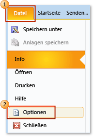
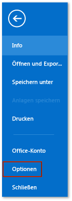
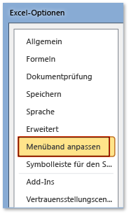

# Gewusst wie: Anzeigen der Registerkarte "Entwickler" auf der Multifunktionsleiste
  Für den Zugriff auf die **Developer** Registerkarte auf dem Menüband einer Office-Anwendung, müssen Sie konfigurieren, um die Registerkarte angezeigt werden, weil es nicht standardmäßig angezeigt wird. Beispielsweise müssen Sie diese Registerkarte anzeigen, wenn Sie <xref:Microsoft.Office.Tools.Word.GroupContentControl> einer Anpassung auf Dokumentebene für Word hinzufügen möchten.  
  
> [!NOTE]  
>  Dieser Leitfaden gilt nur für Office 2010-Anwendungen und neuer. Wenn Sie diese Registerkarte im 2007 Microsoft Office System anzeigen möchten, finden Sie die folgende Version dieses Themas [Vorgehensweise: Anzeigen der Registerkarte "Entwickler" im Menüband](http://msdn.microsoft.com/library/bb608625(v=vs.90).aspx).  
  
 [!INCLUDE[appliesto_ribbon](../vsto/includes/appliesto-ribbon-md.md)]  
  
> [!NOTE]  
>  Access enthält keine **Developer** Registerkarte.  
  
### Anzeigen der Registerkarte "Entwickler"  
  
1.  Starten Sie eine der Office-Anwendungen, die in diesem Thema beschrieben werden. Finden Sie unter der **gilt für:** Hinweis weiter oben in diesem Thema.  
  
2.  Auf der **Datei** Registerkarte, und wählen Sie die **Optionen** Schaltfläche.  
  
     Die folgende Abbildung zeigt die **Datei** Registerkarte und **Optionen** Schaltfläche in Office 2010.  
  
       
  
     Die folgende Abbildung zeigt die **Datei** Registerkarte in Office 2013.  
  
       
  
     Die folgende Abbildung zeigt die **Optionen** Schaltfläche in Office 2013.  
  
       
  
3.  In der *Parameter "ApplicationName"***Optionen** Dialogfeld Wählen Sie die **Menüband anpassen** Schaltfläche.  
  
     Die folgende Abbildung zeigt die **Optionen** Dialogfeld und der **Menüband anpassen** Schaltfläche in Excel 2010. Der Speicherort dieser Schaltfläche ist bei allen anderen Anwendungen vergleichbar, die im Abschnitt "Betrifft" oben in diesem Thema aufgeführt werden.  
  
       
  
4.  Wählen Sie in der Liste der Hauptregisterkarten das **Developer** Kontrollkästchen.  
  
     Die folgende Abbildung zeigt die **Developer** Kontrollkästchen in Word 2010 und [!INCLUDE[Word_15_short](../vsto/includes/word-15-short-md.md)]. Der Speicherort dieses Kontrollkästchens ist bei allen anderen Anwendungen vergleichbar, die im Abschnitt "Betrifft" oben in diesem Thema aufgeführt werden.  
  
       
  
5.  Wählen Sie die **OK** Schaltfläche zum Schließen der **Optionen** (Dialogfeld).  
  
## Siehe auch  
 [Anpassung der Office-Benutzeroberfläche](../vsto/office-ui-customization.md)  
  
  