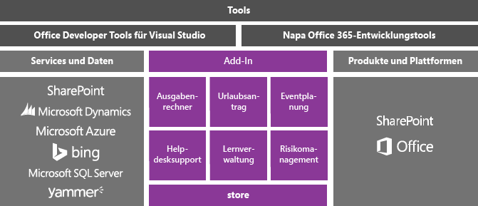
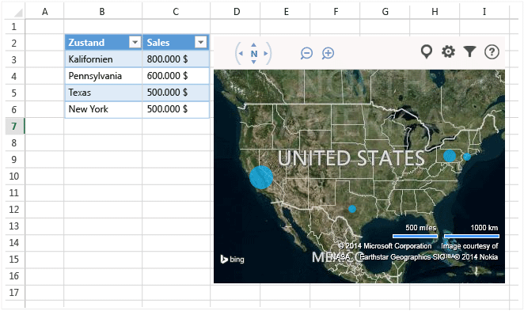
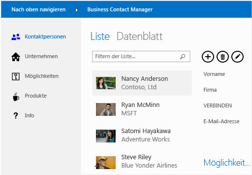

# Office und SharePoint-Entwicklung in Visual Studio
  Sie können Microsoft Office und SharePoint erweitern, indem Sie eine einfache App oder ein Add-In erstellen, die Benutzer im [Office Store](https://store.office.com/) oder einem Unternehmenskatalog herunterladen, oder indem sie eine.NET Framework-basierte Lösung erstellen, die von Benutzern auf einem Computer installiert wird.  
  
 In diesem Thema:  
  
-   [Erstellen von Add-Ins für Office und SharePoint](#Apps)  
  
-   [Erstellen eines VSTO-Add-Ins](#Add-ins)  
  
-   [Erstellen einer SharePoint-Lösung](#Solutions)  
  
##   Erstellen von Add-Ins für Office und SharePoint  
 Office 2013 und SharePoint 2013 stellen ein neues Add-In-Modell vor, das Ihnen hilft, Add-Ins als Erweiterungen von Office und SharePoint zu erstellen, zu verteilen und damit Geld zu verdienen.  Diese Add-Ins können in Office oder SharePoint online ausgeführt werden, und Benutzer können von vielen Geräten mit ihnen interagieren.  
  
 Erfahren Sie, wie Sie das neue [Office-Add-In-Modell](https://msdn.microsoft.com/library/office/jj220082.aspx) verwenden können, um die Office-Erfahrungen Ihrer Benutzer zu erweitern.  
  
 Diese Add-Ins belegen nur wenig Arbeitsspeicher im Vergleich zu VSTO-Add-Ins und -Projektmappen, und Sie können sie mithilfe von fast allen Web-Technologien wie HTML5, JavaScript, CSS3 und XML-Programmierung erstellen.  Verwenden Sie zu Beginn die Office Developer Tools in Visual Studio oder das einfache, webbasierte Tool mit dem Codenamen Napa Office 365-Entwicklungstools, mit dessen Hilfe Sie Projekte erstellen, Code schreiben und Ihre Add-Ins in einem Browser ausführen können.  
  
   
  
### Erstellen eines Office Add-Ins  
 Um die Funktionalität von Office zu erweitern, erstellen Sie ein Office-Add-In. Es ist im Grunde eine Webseite, die in einer Office-Anwendung wie Excel, Word, Outlook und PowerPoint gehostet wird. Ihre Anwendung kann zu Dokumenten, Arbeitsblättern, e-Mail-Nachrichten, Terminen, Präsentationen und Projekten Funktionalität hinzufügen.  
  
 Sie können Ihre Anwendung im Office Store verkaufen.  Im [Office Store](https://store.office.com/) können Sie Ihre Add-Ins einfach verkaufen, Updates verwalten und die Telemetrie nachverfolgen. Sie können Ihre Anwendung für Benutzer über einen Anwendungskatalog in SharePoint oder auf dem Exchange Server veröffentlichen.  
  
 Die folgende Anwendung für Office zeigt Arbeitsblatt-Daten in einer Bing-Karte.  
  
   
  
 **Weitere Informationen**  
  
|Beschreibung|Siehe|  
|--------|---------|  
|Erfahren Sie mehr über Office-Add-Ins, und erstellen Sie dann eins.|[Office-Add-Ins](http://msdn.microsoft.com/office/dn448457)|  
|Vergleichen Sie die verschiedenen Möglichkeiten, mit denen Sie Office erweitern können, und entscheiden Sie, ob Sie eine Anwendung oder ein Office-Add-In verwenden möchten.|[Roadmap für Office-Add-Ins, VSTO und VBA](http://blogs.msdn.com/b/officeapps/archive/2013/06/18/roadmap-for-apps-for-office-vsto-and-vba.aspx)|  
  
### Erstellen eines SharePoint-Add-Ins  
 Um SharePoint für Ihre Benutzer zu erweitern, erstellen Sie ein SharePoint-Add-In. Es ist im Grunde eine kleine, leicht zu verwendende, eigenständige Anwendung, die für Ihre Benutzer oder Unternehmen einen Bedarf deckt.  
  
 Sie können Ihre App für SharePoint im [Office Store](https://store.office.com/)verkaufen. Sie können Ihr Add-In für Benutzer auch über einen Add-In-Katalog in SharePoint veröffentlichen.  Websitebesitzer können Ihr Add-In ohne einen Farmserver oder Websiteauflistungsadministrator auf ihren SharePoint-Websites installieren, aktualisieren und deinstallieren.  
  
 Hier ist ein Beispiel für eine Anwendung für SharePoint, mit dem Benutzer Kontakte verwalten kann.  
  
   
  
 **Weitere Informationen**  
  
|Beschreibung|Siehe|  
|--------|---------|  
|Erfahren Sie mehr über SharePoint-Add-Ins, und erstellen Sie dann eins.|[SharePoint-Add-Ins](https://msdn.microsoft.com/library/office/fp179930.aspx)|  
|Vergleichen Sie Add-Ins für SharePoint mit herkömmlichen SharePoint-Lösungen.|[SharePoint-Add-Ins im Vergleich mit SharePoint-Lösungen](http://msdn.microsoft.com/library/office/jj163114.aspx)|  
|Wählen Sie aus, ob Sie SharePoint-Add-In oder eine SharePoint-Lösung erstellen möchten.|[Entscheiden Sie zwischen SharePoint-add-ins und SharePoint-Lösungen](https://msdn.microsoft.com/library/office/jj163114.aspx)|
  
##   Erstellen eines VSTO-Add-Ins  
 Erstellen Sie ein VSTO-add-in für Office 2007 oder Office 2010 oder eine Erweiterung für Office 2013 und Office 2016 hinausreichen mit Office-add-ins. VSTO-Add-Ins können nur auf dem Desktop ausgeführt werden. Benutzer müssen VSTO-add-ins installieren, da in der Regel schwieriger sind, bereitzustellen und zu unterstützen.  Allerdings kann das VSTO-Add-In stärker in Office integriert werden. Sie können z. B. die Office-Multifunktionsleiste Registerkarten und Steuerelemente hinzufügen und erweiterte Automatisierung-Aufgaben wie das Zusammenführen von Dokumenten oder das Ändern von Diagrammen durchführen. Sie können das .NET Framework einsetzen und C# und Visual Basic zur Interaktion mit Office-Objekten verwenden.  
  
 Hier ist ein Beispiel für welche eines VSTO-add-Ins ausführen kann. Dieses VSTO-Add-In fügt Menübandsteuerelemente, einen benutzerdefinierten Aufgabenbereich und ein Dialogfeld zu PowerPoint hinzu.  
  
   
  
 **Weitere Informationen**  
  
|An|Lesen|  
|--------|----------|  
|Vergleichen Sie die verschiedenen Möglichkeiten, mit denen Sie Office erweitern können, und entscheiden Sie, ob Sie ein VSTO-Add-In oder ein Office-Add-In verwenden möchten.|[Roadmap für Office-Add-Ins, VSTO und VBA](http://blogs.msdn.com/b/officeapps/archive/2013/06/18/roadmap-for-apps-for-office-vsto-and-vba.aspx)|  
|Erstellen eines VSTO-Add-Ins|[Mit Visual Studio erstellte VSTO-Add-Ins](https://msdn.microsoft.com/library/jj620922.aspx)|  
  
##   Erstellen einer SharePoint-Lösung  
 Erstellen Sie eine SharePoint-Lösung für SharePoint Foundation 2010 und SharePoint Server 2010 oder eine Erweiterung für SharePoint 2013 und SharePoint 2016 hinausgeht, was mit einem SharePoint-add-in möglich ist.  
  
 SharePoint-Lösungen erfordern lokale SharePoint-Farm-Server. Administratoren müssen sie installieren, und da Lösungen in SharePoint ausgeführt werden, können sie die Leistung des Servers beeinträchtigen. Allerdings bieten Lösungen einen tieferen Zugriff auf SharePoint-Objekte. Wenn Sie eine SharePoint-Lösung erstellen, können Sie außerdem das .NET Framework und C# und Visual Basic für die Interaktion mit SharePoint-Objekte verwenden.  
  
 **Weitere Informationen**  
  
|Beschreibung|Siehe|  
|--------|---------|  
|Vergleichen Sie SharePoint-Lösungen und SharePoint-Add-Ins.|[SharePoint-Add-Ins im Vergleich mit SharePoint-Lösungen](http://msdn.microsoft.com/library/office/jj163114.aspx)|  
|Erstellen Sie eine SharePoint-Lösung.|[Erstellen von SharePoint-Lösungen](../sharepoint/create-sharepoint-solutions.md)|  
  
  
