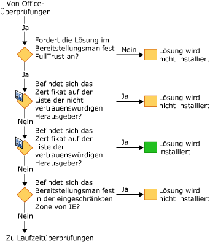
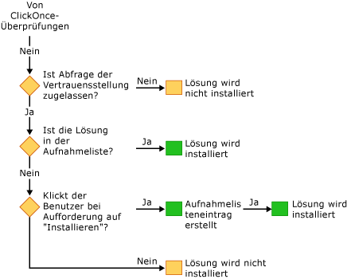

# Sichern von Office-Projektmappen
  Das Sicherheitsmodell für Office-Projektmappen beinhaltet verschiedene Technologien: die [!INCLUDE[vsto_runtime](../vsto/includes/vsto-runtime-md.md)], [!INCLUDE[ndptecclick](../vsto/includes/ndptecclick-md.md)], im Trust Center in Microsoft Office und Internet Explorer-Zone eingeschränkter Sites. In den folgenden Abschnitten wird die Funktionsweise der verschiedenen Sicherheitsfunktionen beschrieben:

- [Gewähren von Vertrauen für Office-Projektmappen](#GrantingTrustToSolutions)

- [Gewähren von Vertrauen für Dokumente](#GrantingTrustToDocuments)

- [Gewähren von vertrauen bei Verwendung von Windows Installer](#GrantingTrustWindowsInstaller)

- [Besondere sicherheitsüberlegungen für Office-Projektmappen](#Security)

- [Sicherheit während der Entwicklung](#SecurityDuringDeployment)

- [Visual Studio-Tools für Office-Laufzeit](#VisualStudioToolsForOfficeRuntime)

  [!INCLUDE[appliesto_all](../vsto/includes/appliesto-all-md.md)]

##   Gewähren von Vertrauen für Office-Projektmappen
 Das Gewähren von Vertrauenswürdigkeit für Office-Projektmappen bedeutet das Ändern der Sicherheitsrichtlinie jedes Endbenutzers, um der Office-Lösung auf Grundlage der folgenden Beweise zu vertrauen:

- Das Zertifikat, das zum Signieren des Bereitstellungsmanifests verwendet wird.

- Die URL des Bereitstellungsmanifests.

  Weitere Informationen finden Sie unter [Gewähren von Vertrauenswürdigkeit für Office-Projektmappen](../vsto/granting-trust-to-office-solutions.md).

##   Gewähren von Vertrauen für Dokumente
 Eine Anpassung auf Dokumentebene erfordert, dass sich das Dokument in einem Verzeichnis befindet, das als vertrauenswürdiger Speicherort festgelegt ist. Weitere Informationen finden Sie unter [Gewähren von Vertrauenswürdigkeit für Dokumente](../vsto/granting-trust-to-documents.md).

##   Gewähren von vertrauen bei Verwendung von Windows Installer
 Sie können Windows Installer verwenden, um eine MSI-Datei zum Installieren von Office-Projektmappen in das Verzeichnis "Programme" zu erstellen, wofür Administratorrechte erforderlich sind. Für Office-Projektmappen im Verzeichnis Programmdateien Visual Studio 2010-Tools für Office-Laufzeit berücksichtigt diese Office-Projektmappen als vertrauenswürdig gelten sollen, und der ClickOnce-vertrauensaufforderung wird nicht angezeigt.

##   Besondere sicherheitsüberlegungen für Office-Projektmappen
 Die Sicherheitsfunktionen, die von [!INCLUDE[net_v40_short](../sharepoint/includes/net-v40-short-md.md)], [!INCLUDE[net_v45](../vsto/includes/net-v45-md.md)] und Microsoft Office bereitgestellt werden, können zum Schutz vor verschiedenen Sicherheitsbedrohungen in Office-Projektmappen beitragen. Weitere Informationen finden Sie unter [besondere sicherheitsüberlegungen für Office-Projektmappen](../vsto/specific-security-considerations-for-office-solutions.md).

##   Sicherheit während der Entwicklung
 Um Ihren Entwicklungsprozess zu vereinfachen, legt Visual Studio die Sicherheitsrichtlinie, die zum Ausführen und Debuggen der Projektmappe auf dem Computer benötigt wird, bei jedem Erstellen eines Projekts fest. In einigen Szenarien müssen Sie möglicherweise zusätzliche Schritte zum Entwickeln des Projekts ausführen.

### Projektmappen auf Anwendungsebene
 Wenn Sie die folgenden Typen von Projekten entwickeln, muss der vollqualifizierte Pfad eines Dokuments zur Liste der vertrauenswürdigen Speicherorte in der Microsoft Office-Anwendung hinzugefügt werden:

- Lösungen, die auf einer Dateifreigabe im Netzwerk, z. B. sind auf Dokumentebene  *\\\servername\sharename*.

- Projektmappen auf Anwendungsebene für Word, mit denen *.doc* oder *.docm* Dateien.

  Schließen Sie die Unterverzeichnisse ein, wenn Sie den Dokumentspeicherort der Liste vertrauenswürdiger Speicherorte hinzufügen, oder schließen Sie insbesondere die Debug- und Buildordner ein. Weitere Informationen finden Sie im Artikel mit Microsoft Office-Onlinehilfe [erstellen, entfernen oder Ändern eines vertrauenswürdigen Speicherorts für Ihre Dateien](https://support.office.com/article/Create-remove-or-change-a-trusted-location-for-your-files-f5151879-25ea-4998-80a5-4208b3540a62).

### Temporäre Zertifikate
 Visual Studio erstellt ein temporäres Zertifikat, wenn ein signierendes Zertifikat nicht bereits vorhanden ist. Sie sollten dieses temporäre Zertifikat nur während der Entwicklung verwenden und ein offizielles Zertifikat für die Bereitstellung erwerben.

 Das temporäre Zertifikat wird nach dem ersten Erstellen eines Office-Projekts generiert. Das nächste Mal, die Sie drücken **F5**, das Projekt wird neu erstellt werden, da das Projekt laut geändert, wenn das Zertifikat hinzugefügt wird.

 Nach einer Weile kann es zahlreiche temporäre Zertifikate geben, sodass Sie sie gelegentlich löschen sollten.

##   Visual Studio-Tools für Office-Laufzeit
 Die [!INCLUDE[vsto_runtime](../vsto/includes/vsto-runtime-md.md)] verfügt über Funktionen zur Überprüfung der Identität des Herausgebers und die Berechtigungen, die einer Anpassung gewährt werden. Diese Berechtigungen werden mithilfe einer Reihe von Sicherheitsüberprüfungen verifiziert.

### Sicherheit während der Anpassung laden
 Wenn eine Anpassung auf Dokumentebene geladen wird, die [!INCLUDE[vsto_runtime](../vsto/includes/vsto-runtime-md.md)] immer überprüft, ob das Dokument in der Liste vertrauenswürdiger Speicherorte. Darüber hinaus prüft die Runtime an, ob die Projektmappe im Anwendungsmanifest FullTrust-Anforderungen. Beim Laden der Anpassung werden keine zusätzlichen Sicherheitsüberprüfungen durchgeführt.

### Abfolge der sicherheitsüberprüfungen während der installation
 Wenn eine Office-Projektmappe installiert oder aktualisiert wird, führt [!INCLUDE[vsto_runtime](../vsto/includes/vsto-runtime-md.md)] eine Reihe von Sicherheitsüberprüfungen in einer bestimmten Reihenfolge aus, um eine Entscheidung über die Vertrauenswürdigkeit zu treffen. Eine Projektmappe wird nur dann installiert oder aktualisiert, wenn die Laufzeit bestimmt, dass die Projektmappe vertrauenswürdig ist.

 Sie können den Installationsvorgang auf vier Arten starten: durch Ausführen des Setupprogramms, durch Öffnen des Bereitstellungsmanifests, durch Öffnen von Microsoft Office-Anwendungshosts oder durch Ausführen von *VSTOInstaller.exe*.

 Die erste Sicherheitsüberprüfung gilt nur für Projektmappen auf Dokumentebene. Das Dokument einer Projektmappe auf Dokumentebene muss sich an einem vertrauenswürdigen Speicherort befinden. Wenn das Dokument in einer Remotenetzwerk-Dateifreigabe oder verfügt über eine *.doc* oder *.docm* Dateinamenerweiterung, muss der Speicherort des Dokuments der Liste vertrauenswürdiger Speicherorte hinzugefügt werden. Weitere Informationen finden Sie unter [Gewähren von Vertrauenswürdigkeit für Dokumente](../vsto/granting-trust-to-documents.md).

 

 Die nächsten Sicherheitsüberprüfungen erfolgen durch [!INCLUDE[vsto_runtime](../vsto/includes/vsto-runtime-md.md)] und ClickOnce. Um diese Überprüfungen zu übergeben, Office-Projektmappen FullTrust-Berechtigungen anfordern müssen, signiert sein mit einem Zertifikat, die nicht in der Liste nicht vertrauenswürdiger Herausgeber aufgeführt ist, und werden an einem Speicherort, der nicht in der eingeschränkten Zone von Internet Explorer ist. Wenn das Zertifikat in der Liste vertrauenswürdiger Herausgeber ist, wird die Projektmappe sofort installiert. Andernfalls fährt die Lösung mit der letzten letzte Gruppe von Überprüfungen fort, sofern keine der Überprüfungen fehlgeschlagen ist.

 

 Wenn die [!INCLUDE[ndptecclick](../vsto/includes/ndptecclick-md.md)] -Eingabeaufforderung zulässig ist und die Lösung nicht noch Vertrauenswürdigkeit gewährt wurde, die Laufzeit wird die Entscheidung über die Vertrauenswürdigkeit vom Benutzer vorgenommen werden kann. Wenn der Benutzer der Projektmappe Vertrauenswürdigkeit gewährt, wird der Benutzeraufnahmeliste ein Eintrag hinzugefügt. Alle Projektmappen in der Benutzeraufnahmeliste haben volle Vertrauenswürdigkeit und können installiert und ausgeführt werden.

 Ab Visual Studio 2010 wird die Aufnahmeliste umgangen, wenn die Office-Projektmappe mithilfe von Windows Installer (MSI) in das Verzeichnis "Programme" installiert wurde. Weitere Informationen finden Sie unter [vertrauen Office-Projektmappen mithilfe von Aufnahmelisten](../vsto/trusting-office-solutions-by-using-inclusion-lists.md).

 

## Siehe auch

- [Gewähren von Vertrauen für Office-Projektmappen](../vsto/granting-trust-to-office-solutions.md)
- [Gewähren von Vertrauen für Dokumente](../vsto/granting-trust-to-documents.md)
- [Vertrauen Sie Office-Projektmappen mithilfe von Aufnahmelisten](../vsto/trusting-office-solutions-by-using-inclusion-lists.md)
- [Vorgehensweise: Konfigurieren der aufnahmelistensicherheit](../vsto/how-to-configure-inclusion-list-security.md)
- [Vorgehensweise: Signieren von Office-Projektmappen](../vsto/how-to-sign-office-solutions.md)
- [Problembehandlung bei Office-projektmappensicherheit](../vsto/troubleshooting-office-solution-security.md)
- [Anwendungsmanifeste für Office-Projektmappen](../vsto/application-manifests-for-office-solutions.md)
- [Bereitstellungsmanifeste für Office-Projektmappen](../vsto/deployment-manifests-for-office-solutions.md)
- [ClickOnce-Referenz](../deployment/clickonce-reference.md)
- [Bereitstellen einer Office-Projektmappe](../vsto/deploying-an-office-solution.md)
